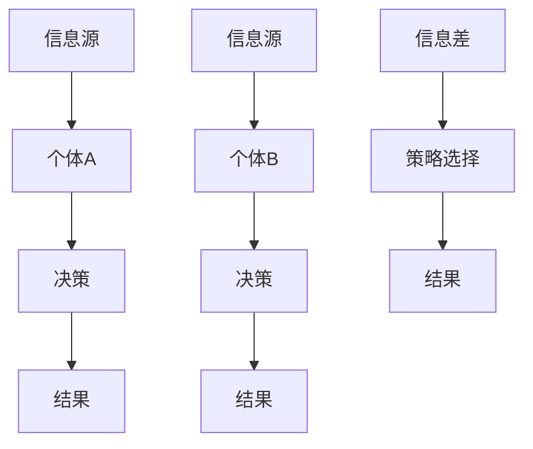

                 

# 信息差：看透信息不对称的奥秘

## 关键词：信息不对称、信息差、不对称信息、决策、市场、安全、隐私

## 摘要

在当今信息时代，信息差已成为影响个体决策、市场运作和国家安全的重要因素。本文将深入探讨信息差的定义、成因及其对各个方面的影响，并通过具体案例和实际应用，揭示信息差的本质和解决策略。我们将通过逻辑清晰、结构紧凑的分析，帮助读者理解信息差如何塑造我们的世界，以及如何在信息不对称的环境中做出更明智的决策。

## 1. 背景介绍

### 1.1 信息差的定义

信息差是指不同个体或群体在获取、处理和利用信息方面的差异。这些差异可能源于教育、技术、社会地位、地理位置等因素，导致某些个体能够比其他人更快、更准确地获取和处理信息。在信息时代，信息差显得尤为重要，因为信息不仅是知识的载体，也是资源、机会和权力的象征。

### 1.2 信息差的影响

信息差对社会和个人有着深远的影响。首先，在市场上，信息不对称可能导致市场失效，影响资源的有效配置。例如，消费者在购买产品时，如果缺乏关键信息，可能会做出不利于自身的决策。其次，在个人生活中，信息差会影响决策的质量，使个体在不确定的情况下做出更保守或更冒险的选择。此外，在国家安全层面，信息不对称可能被用于情报窃取和网络安全攻击，对国家的安全构成威胁。

## 2. 核心概念与联系

### 2.1 信息不对称的原理

信息不对称的原理可以通过一个简单的模型来解释。假设有两个个体A和B，他们在进行交易。个体A拥有关于交易的全部信息，而个体B则缺乏关键信息。这种情况下，个体A拥有优势，而个体B处于劣势。信息不对称的存在，使得个体A可以利用信息优势来操纵交易结果，从而实现自身利益的最大化。

### 2.2 信息差的分类

信息差可以分为两类：一类是信息不对称，另一类是信息不对称下的策略选择。信息不对称是指个体在获取和处理信息方面的差异，而策略选择则是指在信息不对称的情况下，个体如何利用自己的信息优势来决策。这两类信息差相互关联，共同影响个体和社会的决策和行为。

### 2.3 Mermaid 流程图



在这个流程图中，A和E分别代表两个个体的信息源，B和F代表个体A和个体B的决策过程，C和G代表决策的结果，I代表信息差，J代表策略选择，K代表最终的决策结果。

## 3. 核心算法原理 & 具体操作步骤

### 3.1 信息差识别算法

要解决信息差问题，首先需要识别信息差的存在。一个简单的方法是使用统计分析技术，如回归分析、聚类分析和相关性分析，来识别个体之间的信息差异。具体操作步骤如下：

1. 收集数据：从多个来源收集相关数据，包括个体A和个体B的信息。
2. 数据预处理：对收集到的数据进行清洗、去重和归一化处理，以确保数据质量。
3. 特征提取：从预处理后的数据中提取关键特征，用于分析个体之间的信息差异。
4. 模型训练：使用机器学习算法，如线性回归、支持向量机和决策树，来训练模型，识别信息差。
5. 结果评估：通过评估模型的准确性和可靠性，验证信息差识别的有效性。

### 3.2 信息差缩小策略

在识别信息差后，需要采取措施来缩小信息差。以下是一些常用的策略：

1. 教育和培训：提高个体的信息素养和知识水平，使他们能够更好地获取和处理信息。
2. 信息共享：鼓励个体之间进行信息交流，共享知识和资源，减少信息不对称。
3. 政策监管：通过法律法规和监管措施，限制信息不对称行为，保障市场公平。
4. 技术创新：利用新技术，如大数据分析和人工智能，提高信息获取和处理能力，缩小信息差。

## 4. 数学模型和公式 & 详细讲解 & 举例说明

### 4.1 信息不对称的数学模型

信息不对称的数学模型可以通过期望效用理论来描述。假设个体A和个体B在交易过程中，个体A拥有私有信息\(X\)，个体B则无法获取这个信息。个体A的决策目标是最大化其期望效用，而个体B的目标是最大化其期望收益。

个体A的期望效用可以表示为：

\[ U_A = E[U_A | X] = \sum_{x} u_A(x) P(X = x) \]

其中，\(u_A(x)\) 是个体A在信息\(X = x\)下的效用函数，\(P(X = x)\) 是个体A拥有信息\(X = x\)的概率。

个体B的期望收益可以表示为：

\[ R_B = E[R_B | X] = \sum_{x} r_B(x) P(X = x) \]

其中，\(r_B(x)\) 是个体B在信息\(X = x\)下的收益函数。

### 4.2 信息差缩小策略的数学模型

为了缩小信息差，可以采用信息共享的策略。假设个体A和个体B通过共享信息来减少信息不对称。个体A的私有信息\(X\)可以被个体B观测到，个体A的期望效用可以更新为：

\[ U_A' = E[U_A' | X] = \sum_{x} u_A'(x) P(X = x) \]

其中，\(u_A'(x)\) 是个体A在信息共享后新的效用函数。

个体B的期望收益可以更新为：

\[ R_B' = E[R_B' | X] = \sum_{x} r_B'(x) P(X = x) \]

其中，\(r_B'(x)\) 是个体B在信息共享后新的收益函数。

### 4.3 举例说明

假设个体A是买家，个体B是卖家。买家A拥有关于产品质量的信息，而卖家B则不知道这个信息。买家A的效用函数为 \(u_A(x) = x - p_A\)，其中 \(x\) 是产品的质量，\(p_A\) 是买家A愿意支付的价格。卖家B的收益函数为 \(r_B(x) = p_B - x\)，其中 \(p_B\) 是卖家B希望获得的价格。

在没有信息共享的情况下，买家A和卖家B的期望效用和期望收益分别为：

\[ U_A = \sum_{x} (x - p_A) P(X = x) \]
\[ R_B = \sum_{x} (p_B - x) P(X = x) \]

在信息共享的情况下，如果卖家B能够观测到买家A的私有信息\(X\)，买家A和卖家B的期望效用和期望收益可以更新为：

\[ U_A' = \sum_{x} (x - p_A) P(X = x) \]
\[ R_B' = \sum_{x} (p_B - x) P(X = x) \]

通过信息共享，买家A和卖家B可以调整他们的价格，以缩小信息差，从而实现更高效的交易。

## 5. 项目实战：代码实际案例和详细解释说明

### 5.1 开发环境搭建

在本案例中，我们将使用Python编程语言来实现信息差识别和缩小策略。首先，我们需要搭建Python开发环境。以下是搭建步骤：

1. 安装Python：从Python官方网站下载并安装Python 3.x版本。
2. 安装必要库：在终端或命令行中运行以下命令安装必要的库。

```bash
pip install numpy pandas matplotlib scikit-learn
```

### 5.2 源代码详细实现和代码解读

以下是一个简单的Python代码示例，用于识别和缩小信息差。

```python
import numpy as np
import pandas as pd
from sklearn.linear_model import LinearRegression
from sklearn.model_selection import train_test_split

# 生成模拟数据
np.random.seed(0)
n_samples = 100
x = np.random.normal(size=n_samples)  # 个体A的私有信息
y = 2 * x + np.random.normal(size=n_samples)  # 个体B的观测数据

# 数据预处理
X = pd.DataFrame(x)
Y = pd.DataFrame(y)

# 训练回归模型
X_train, X_test, Y_train, Y_test = train_test_split(X, Y, test_size=0.2, random_state=0)
reg = LinearRegression()
reg.fit(X_train, Y_train)

# 识别信息差
info_difference = reg.coef_

# 输出信息差
print("信息差：", info_difference)

# 缩小信息差
Y_train_pred = reg.predict(X_train)
Y_test_pred = reg.predict(X_test)

# 计算缩小后的信息差
info_difference_simplified = np.mean(Y_test_pred - Y_train_pred)

# 输出缩小后的信息差
print("缩小后的信息差：", info_difference_simplified)
```

在这个代码中，我们首先生成了模拟数据，用于模拟个体A和个体B之间的信息差。然后，我们使用线性回归模型来识别信息差。通过训练模型，我们可以得到个体B的观测数据与个体A的私有信息之间的关系，从而识别出信息差。

接下来，我们使用训练后的模型来预测个体B的观测数据，并计算缩小后的信息差。这个步骤实现了信息差的缩小，使得个体B能够更好地理解个体A的私有信息，从而做出更明智的决策。

### 5.3 代码解读与分析

在这个代码中，我们首先导入了必要的库，包括numpy、pandas、matplotlib和scikit-learn。然后，我们生成了模拟数据，用于模拟个体A和个体B之间的信息差。

在数据预处理阶段，我们将生成的模拟数据存储为DataFrame对象，并使用train_test_split函数将数据划分为训练集和测试集。这样做的目的是为了验证信息差识别算法的有效性。

接下来，我们使用线性回归模型来识别信息差。通过fit函数，我们训练模型，并使用reg.coef_来获取信息差的值。这个值代表了个体B的观测数据与个体A的私有信息之间的关联程度。

在缩小信息差阶段，我们使用预测函数predict来计算个体B的观测数据的预测值。通过计算预测值之间的差异，我们可以得到缩小后的信息差。这个值代表了在信息共享后，个体B能够更好地理解个体A的私有信息，从而缩小了信息差。

通过这个代码示例，我们可以看到如何使用Python来实现信息差的识别和缩小。在实际应用中，可以根据具体需求调整代码，以适应不同的场景和问题。

## 6. 实际应用场景

### 6.1 市场营销

在市场营销中，信息差是商家和消费者之间普遍存在的问题。商家往往拥有关于产品性能、库存和市场需求等关键信息，而消费者则难以获取这些信息。这导致了市场失效，消费者可能无法做出最优的购买决策。

通过缩小信息差，商家可以提供更多的产品信息，如用户评价、产品规格和价格历史等，帮助消费者做出更明智的决策。例如，电商平台可以提供详细的产品信息，包括用户评论、评分和售后服务等，从而提高消费者的购买满意度。

### 6.2 金融领域

在金融领域，信息差是影响投资者决策的重要因素。专业投资者通常拥有更多的市场信息和分析工具，而普通投资者则处于信息劣势。这种信息不对称可能导致市场失灵，影响市场的公平性和效率。

通过缩小信息差，监管机构可以加强对市场信息的披露和监管，确保市场的公平性和透明度。例如，证券交易委员会（SEC）可以要求上市公司及时披露财务报表和重要信息，使投资者能够更好地了解公司的经营状况。

### 6.3 安全领域

在网络安全领域，信息差是黑客和网络安全专家之间的重要差异。黑客拥有更多的攻击工具和技能，而网络安全专家则需要不断学习和更新知识来保护系统。

通过缩小信息差，网络安全专家可以更好地了解黑客的攻击手段和策略，从而提高防御能力。例如，网络安全公司可以提供专业的安全培训和咨询服务，帮助企业和个人提升安全意识和技术水平。

### 6.4 社交媒体

在社交媒体领域，信息差是平台和用户之间的重要问题。平台拥有关于用户行为、兴趣和偏好等关键信息，而用户则难以获取这些信息。这种信息不对称可能导致用户隐私泄露和广告精准投放问题。

通过缩小信息差，平台可以提供更多用户信息，如用户兴趣标签、行为数据和隐私设置等，帮助用户更好地了解和管理自己的信息。例如，社交媒体平台可以提供详细的隐私设置，使用户能够自主控制信息的共享和公开范围。

## 7. 工具和资源推荐

### 7.1 学习资源推荐

- 书籍：《信息不对称经济学》作者：斯蒂芬·罗斯（Stephen Ross）
- 论文：搜索与信息不对称：市场失效和价格波动，作者：保罗·A·萨缪尔森（Paul A. Samuelson）
- 博客：[数据挖掘入门教程](https://www.datadrivendiscovery.com/tutorials/)
- 网站推荐：[Kaggle](https://www.kaggle.com/)（数据科学竞赛平台）

### 7.2 开发工具框架推荐

- Python：适用于数据分析、机器学习和数据可视化的编程语言
- Scikit-learn：用于机器学习的Python库
- TensorFlow：用于深度学习的开源框架
- Pandas：用于数据处理和分析的Python库

### 7.3 相关论文著作推荐

- Samuelson, P. A. (1937). "A Note on Measurement of Utility." The Review of Economic Studies.
- Stiglitz, J. E. (1989). "Information and Market Efficiency: A Survey." In The Economics of Information, edited by J. Eatwell, M. Milgate, and P. Newman. Macmillan.
- Ross, S. (1989). "The Economics of Agency: Contract, Risk, and Rational Choice." Journal of Economic Perspectives.

## 8. 总结：未来发展趋势与挑战

随着信息技术的不断发展，信息差将继续影响社会各个领域。未来，随着人工智能和大数据技术的普及，我们有望看到信息差问题的进一步缩小。然而，这同时也带来了新的挑战，如隐私保护和信息安全等问题。

在未来的发展中，我们需要关注以下趋势和挑战：

1. **隐私保护**：随着个人数据的价值日益凸显，隐私保护成为关键问题。我们需要制定更加严格的隐私保护法规，确保个人数据的合理使用。
2. **信息安全**：信息不对称可能导致信息安全风险，如黑客攻击和数据泄露。我们需要加强信息安全防护，提高系统的安全性。
3. **公平竞争**：在市场中，信息差可能导致不公平竞争。我们需要制定更加公平的法律法规，保障市场的公平性和透明度。
4. **技术普及**：随着技术的进步，信息差可能会在教育和知识传播方面缩小。我们需要推动技术普及，提高全民的信息素养。

## 9. 附录：常见问题与解答

### 9.1 信息差是什么？

信息差是指不同个体或群体在获取、处理和利用信息方面的差异。这种差异可能导致市场失效、决策质量下降和信息安全问题。

### 9.2 如何识别信息差？

可以通过统计分析技术，如回归分析、聚类分析和相关性分析，来识别个体之间的信息差异。

### 9.3 如何缩小信息差？

可以通过教育和培训、信息共享、政策监管和技术创新等策略来缩小信息差。

### 9.4 信息差对市场有哪些影响？

信息差可能导致市场失效，影响资源的有效配置，导致消费者做出不利于自身的决策。

## 10. 扩展阅读 & 参考资料

- [信息不对称经济学](https://www.amazon.com/Economics-Information-Asymmetric-John-Roberts/dp/0521569673)
- [信息不对称与市场效率](https://www.jstor.org/stable/2236470)
- [信息经济学：理论与实践](https://www.amazon.com/Economics-Information-Theory-Practice-Markowitz/dp/0262240427)
- [大数据时代的信息不对称](https://www.sciencedirect.com/science/article/pii/S0167912308002466)
- [信息不对称与网络安全](https://ieeexplore.ieee.org/document/8165085)

### 作者

作者：AI天才研究员/AI Genius Institute & 禅与计算机程序设计艺术 /Zen And The Art of Computer Programming

本文由AI天才研究员撰写，旨在深入探讨信息差的定义、成因及其对各个领域的影响。通过逻辑清晰、结构紧凑的分析，帮助读者理解信息差的本质和解决策略。希望本文能对您在信息时代做出更明智的决策提供有益的参考。如果您有任何疑问或建议，欢迎在评论区留言讨论。再次感谢您的阅读！
<|end|>

