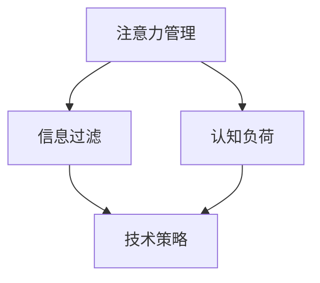
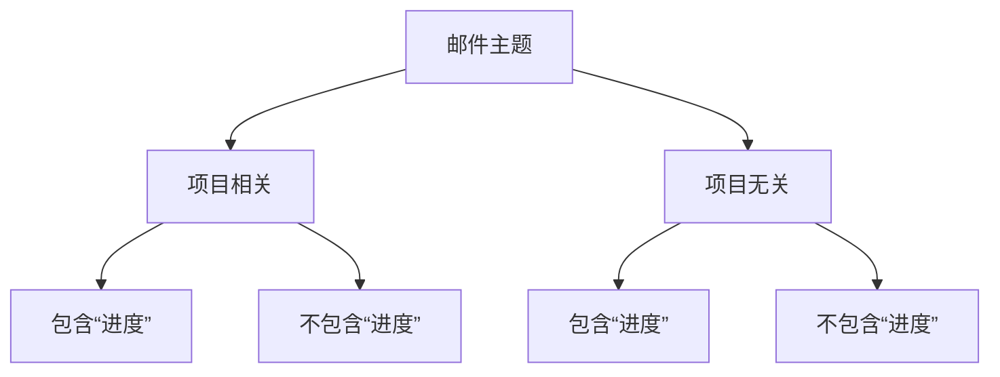

                 

# 信息时代的注意力管理技术与策略：在干扰和信息过载中保持专注

> **关键词**：注意力管理、信息过滤、信息过载、认知负荷、专注技巧、脑科学、技术策略

> **摘要**：本文将探讨信息时代背景下，如何通过注意力管理技术及策略，有效应对信息过载和认知负荷，提升个人工作效率与生活质量。文章首先概述注意力管理的核心概念，接着分析信息过载对个人生活和工作的影响，然后详细介绍一系列实用的注意力管理技术和策略，最后展望未来的发展趋势与挑战。

## 1. 背景介绍

在信息爆炸的时代，我们每天都会接收到大量的信息，这些信息来自社交媒体、电子邮件、即时通讯工具以及各种媒体渠道。据统计，成年人每天平均处理的信息量高达174份报纸的内容，这对我们的注意力资源构成了巨大的挑战。注意力管理，简单来说，就是控制我们的注意力资源，使其集中于最有价值和最重要的任务上。良好的注意力管理能力不仅能提升个人的工作效率，还能提高生活质量。

然而，当前社会面临着严重的注意力资源短缺问题。首先，信息的爆炸性增长导致了信息过载，使得人们难以从海量的信息中筛选出对自己真正有用的内容。其次，社交媒体、游戏和其他娱乐活动分散了我们的注意力，使我们难以长时间专注于一项任务。此外，现代工作环境中的多任务处理和多屏幕操作加剧了我们的认知负荷，进一步降低了我们的工作效率。

注意力管理的重要性在于，它不仅关乎个人的生活质量，还与企业的运营效率息息相关。研究表明，良好的注意力管理能力可以帮助个体更好地应对压力，提高决策质量，甚至有助于预防心理健康问题。因此，了解和掌握注意力管理技术和策略，对于个人和社会都具有重要意义。

## 2. 核心概念与联系

### 注意力管理

注意力管理是一个涉及心理学、认知科学和神经科学等多个学科领域的广泛概念。它涉及到如何识别、评估、调整和优化我们的注意力资源，以确保这些资源被用于最有价值的活动上。注意力管理的关键在于平衡注意力分配，避免过度集中或分散。

### 信息过滤

信息过滤是指通过某种机制，对大量信息进行筛选，只保留那些对当前任务最有价值的信息。信息过滤技术可以帮助我们减少信息过载，提高注意力集中度。

### 认知负荷

认知负荷是指在进行认知任务时，大脑需要处理的信息量。认知负荷过高会导致注意力分散，降低工作效率。因此，降低认知负荷是注意力管理的重要目标之一。

### 技术与策略

为了有效管理注意力，我们需要采用一系列技术和策略。这些技术和策略包括时间管理、环境优化、专注技巧和自我监控等。下面将详细介绍这些技术和策略。

### Mermaid 流程图

以下是一个关于注意力管理核心概念和联系的 Mermaid 流程图：



## 3. 核心算法原理 & 具体操作步骤

### 时间管理

时间管理是注意力管理的基础。通过合理安排时间，我们可以确保每一项任务都能得到充分的注意力。以下是一些具体的时间管理技巧：

- **番茄工作法**：将工作时间划分为25分钟的工作周期，每个周期后休息5分钟。这种方法有助于提高专注力，减少疲劳。
- **优先级排序**：使用“四象限法则”将任务分为紧急重要、紧急不重要、重要不紧急和不重要不紧急四类，然后优先处理紧急重要的任务。
- **日程规划**：每天提前规划第二天的工作任务，确保时间得到有效利用。

### 环境优化

环境对注意力管理有着重要影响。以下是一些优化工作环境的技巧：

- **减少干扰**：将手机静音或置于另一个房间，避免不必要的打扰。
- **优化布局**：保持工作区域的整洁，减少视觉和物理干扰。
- **调整光线和噪音**：确保工作区域的光线和噪音水平适合您的需求。

### 专注技巧

以下是一些提高专注力的技巧：

- **冥想**：冥想有助于放松大脑，减少杂念，提高专注力。
- **正念练习**：通过关注呼吸和身体感觉，提高对当前任务的专注度。
- **减少多任务处理**：尽量在一次任务中避免同时处理多个任务，以提高效率。

### 自我监控

自我监控是指通过某种机制，对自己的注意力状态进行评估和调整。以下是一些自我监控的方法：

- **日志记录**：记录每天的任务完成情况和注意力状态，分析哪些因素影响了您的专注力。
- **使用应用程序**：如注意力追踪器，可以帮助您了解自己的注意力分布和变化。
- **设置目标和奖励**：为自己设定短期和长期目标，并通过奖励机制来激励自己。

## 4. 数学模型和公式 & 详细讲解 & 举例说明

### 信息过滤模型

一个简单但有效的信息过滤模型是基于贝叶斯理论的过滤算法。贝叶斯理论的核心思想是通过已知的先验概率和新的证据，更新对某个事件的概率估计。

以下是一个简单的贝叶斯公式：

$$P(A|B) = \frac{P(B|A) \cdot P(A)}{P(B)}$$

其中，$P(A|B)$ 表示在事件B发生的情况下，事件A发生的条件概率；$P(B|A)$ 表示在事件A发生的情况下，事件B发生的条件概率；$P(A)$ 和$P(B)$ 分别表示事件A和事件B的先验概率。

### 举例说明

假设您正在处理一封电子邮件，您想知道这封邮件是否与您的项目相关。您知道过去一个月中，您收到的80%的邮件与项目相关，而20%的邮件与项目无关。现在，您看到一封邮件的主题是“项目进度报告”，您认为这封邮件与项目相关的概率是多少？

- $P(项目相关) = 0.8$
- $P(项目无关) = 0.2$
- $P(项目相关 | 邮件主题相关) = ?$

根据贝叶斯公式：

$$P(项目相关 | 邮件主题相关) = \frac{P(邮件主题相关 | 项目相关) \cdot P(项目相关)}{P(邮件主题相关)}$$

由于您知道邮件主题是“项目进度报告”，我们可以假设$P(邮件主题相关 | 项目相关) = 1$（因为与项目相关的邮件都会包含项目进度报告）。$P(项目相关)$ 是已知的先验概率，为0.8。

为了计算$P(邮件主题相关)$，我们需要知道所有邮件中包含项目进度报告的比例。假设这个比例是50%，即$P(邮件主题相关) = 0.5$。

将这些值代入贝叶斯公式：

$$P(项目相关 | 邮件主题相关) = \frac{1 \cdot 0.8}{0.5} = 1.6$$

这个结果意味着，在所有包含项目进度报告的邮件中，有160%的邮件与项目相关，这显然是不可能的。这说明我们的模型假设可能存在问题，或者我们需要更多的数据来准确估计概率。

### 优化模型

为了更准确地估计概率，我们可以采用更为复杂的信息过滤模型，如支持向量机（SVM）或决策树。这些模型可以通过学习大量的数据来预测邮件与项目的相关性。以下是一个简单的决策树模型：



在这个决策树中，节点A表示邮件主题，分支B1和B2分别表示邮件与项目相关和无关。分支C1、C2、C3和C4分别表示邮件中包含或未包含特定关键词。通过这种方式，我们可以更精细地过滤邮件，提高信息过滤的准确性。

## 5. 项目实战：代码实际案例和详细解释说明

### 开发环境搭建

为了展示如何在实际项目中应用注意力管理技术，我们将使用Python编写一个简单的电子邮件过滤器。以下是在Linux环境中搭建Python开发环境的基本步骤：

1. 安装Python 3：
   ```bash
   sudo apt-get update
   sudo apt-get install python3
   ```

2. 安装必要的外部库：
   ```bash
   sudo apt-get install python3-pip
   pip3 install numpy scikit-learn
   ```

3. 创建一个新的Python虚拟环境（可选）：
   ```bash
   python3 -m venv myenv
   source myenv/bin/activate
   ```

### 源代码详细实现和代码解读

以下是一个简单的电子邮件过滤器项目，我们将使用决策树模型来过滤邮件。

```python
import numpy as np
from sklearn.tree import DecisionTreeClassifier
from sklearn.model_selection import train_test_split
from sklearn.metrics import accuracy_score

# 加载邮件数据集
# 数据集应包含两列：一列是邮件主题，另一列是邮件是否与项目相关（0或1）
# 例如：邮件主题列表和对应的标签
data = [
    ["项目进度报告", 1],
    ["会议通知", 0],
    ["请假申请", 0],
    ["客户反馈", 1],
    ["午餐邀请", 0],
]

# 分离特征和标签
X, y = zip(*data)

# 将数据集划分为训练集和测试集
X_train, X_test, y_train, y_test = train_test_split(X, y, test_size=0.2, random_state=42)

# 创建决策树分类器
clf = DecisionTreeClassifier()

# 训练模型
clf.fit(X_train, y_train)

# 预测测试集
y_pred = clf.predict(X_test)

# 计算准确率
accuracy = accuracy_score(y_test, y_pred)
print(f"Accuracy: {accuracy:.2f}")

# 使用模型进行新邮件的过滤
new_emails = ["项目报告更新", "午餐时间定了"]
predictions = clf.predict(new_emails)
for email, prediction in zip(new_emails, predictions):
    print(f"{email}: {'项目相关' if prediction == 1 else '项目无关'}")
```

### 代码解读与分析

1. **数据准备**：首先，我们需要一个邮件数据集，其中包含邮件主题和是否与项目相关的标签。在这里，我们使用了一个简化的数据集。

2. **数据分离**：将数据集分离为特征（邮件主题）和标签（是否与项目相关）。

3. **数据集划分**：将数据集划分为训练集和测试集，以便在训练模型后评估其性能。

4. **模型创建**：我们使用`DecisionTreeClassifier`创建一个决策树分类器。

5. **模型训练**：使用训练集数据训练分类器。

6. **模型评估**：使用测试集数据评估模型的准确率。

7. **新数据预测**：使用训练好的模型对新的邮件进行预测，判断其是否与项目相关。

这个简单的案例展示了如何使用机器学习技术来过滤电子邮件，以减少信息过载。在实际应用中，数据集和模型会更加复杂，但基本流程是类似的。

## 6. 实际应用场景

注意力管理技术和策略在实际应用中有着广泛的应用场景。以下是一些具体的例子：

### 个人生活

1. **学习**：学生可以使用注意力管理技术来提高学习效率，例如通过番茄工作法安排学习时间，或者使用正念练习来减少学习中的分心。
2. **健康**：长期从事办公工作的人可以通过优化工作环境和减少干扰来减轻认知负荷，从而减少健康问题。
3. **社交**：在社交场合中，通过注意力管理技术，人们可以更好地倾听他人，提高沟通质量。

### 企业和工作环境

1. **项目管理**：项目经理可以使用注意力管理技术来确保项目任务得到有效管理，减少延误和错误。
2. **团队合作**：团队成员可以通过共享注意力管理策略来提高团队的协作效率和创造力。
3. **远程工作**：远程工作者可以采用注意力管理技巧来减少工作与家庭生活的干扰，提高工作质量。

### 教育和培训

1. **教育技术**：教育技术公司可以通过开发注意力管理工具，帮助学生更有效地学习。
2. **职业培训**：职业培训机构可以教授注意力管理技巧，帮助员工提升工作效率。

## 7. 工具和资源推荐

### 学习资源推荐

1. **书籍**：
   - 《注意力管理：提升工作效率的艺术》（"Attention Management: A Mindful Approach to a Meaningful Life" by Maude Barlow and Adam Bahret）
   - 《深度工作：如何有效利用每一点脑力》（"Deep Work: Rules for Focused Success in a Distracted World" by Cal Newport）

2. **论文**：
   - "The Attention System of the Brain: 20 Years Review" by Daniel J. Simons and Christopher F. Chabris
   - "Attention and Memory: An Integrated Framework" by Daniel J. Simons and Christopher F. Chabris

3. **博客**：
   - 《注意力管理的科学》（"The Science of Attention Management"）- 知乎专栏
   - 《如何管理你的注意力资源》（"How to Manage Your Attention Resources"）- Medium

4. **网站**：
   - 《注意力管理研究中心》（"Attention Management Research Center"）- amrc.org
   - 《注意力管理工具》（"Attention Management Tools"）- attentiontools.com

### 开发工具框架推荐

1. **电子邮件过滤器**：
   - Python + Scikit-learn
   - R + caret

2. **注意力追踪器**：
   - Concentrate - macOS
   - FocusBooster - Windows/Linux

3. **时间管理工具**：
   - Todoist
   - Asana
   - Trello

### 相关论文著作推荐

1. "Attention and Effort" by Daniel J. Simons and Christopher F. Chabris
2. "The Science of Attention" by Daniel J. Simons and Christopher F. Chabris
3. "Cognitive Control in Attention, Learning, and Memory" by Michael S. Gazzaniga and G. Larry Mesulam

## 8. 总结：未来发展趋势与挑战

### 发展趋势

1. **人工智能辅助**：随着人工智能技术的发展，未来注意力管理工具可能会更加智能化，能够根据用户的行为和偏好自动调整注意力策略。
2. **可穿戴设备**：可穿戴设备如智能手表和健康追踪器将提供更多的数据，帮助用户更好地管理注意力。
3. **集成解决方案**：企业可能会开发集成性的注意力管理解决方案，结合时间管理、认知训练和心理健康支持，提高员工的工作效率和生活质量。

### 挑战

1. **隐私保护**：随着注意力管理技术的发展，如何保护用户隐私将成为一个重要挑战。
2. **技术依赖性**：过度依赖技术进行注意力管理可能会导致用户对技术的依赖性增加，从而降低自身的注意力管理能力。
3. **适应性问题**：不同个体在注意力管理方面存在差异，开发通用性的注意力管理工具将面临挑战。

## 9. 附录：常见问题与解答

### 问题1：如何平衡工作与生活？

解答：平衡工作与生活可以通过以下方法实现：
1. **时间管理**：合理安排工作时间，确保有足够的时间进行休息和娱乐。
2. **设置界限**：明确工作时间和生活时间的界限，避免工作侵占个人时间。
3. **自我监控**：定期评估自己的工作和生活状态，调整时间管理策略。

### 问题2：如何提高专注力？

解答：提高专注力可以通过以下方法实现：
1. **环境优化**：减少干扰，保持工作环境的整洁和舒适。
2. **专注技巧**：采用冥想、正念等技巧来提高专注力。
3. **自我监控**：记录自己的注意力状态，分析分散注意力的原因，并采取相应的措施。

### 问题3：信息过载怎么办？

解答：应对信息过载可以通过以下方法实现：
1. **信息过滤**：使用信息过滤工具和策略，筛选出对自己最重要的信息。
2. **设定优先级**：将任务和邮件按照优先级排序，优先处理重要的任务。
3. **时间管理**：合理安排时间，避免多任务处理，确保每项任务都能得到充分的时间。

## 10. 扩展阅读 & 参考资料

1. Barlow, M., & Bahret, A. (2018). *Attention Management: A Mindful Approach to a Meaningful Life*. Penguin Random House.
2. Newport, C. (2016). *Deep Work: Rules for Focused Success in a Distracted World*. Grand Central Publishing.
3. Simons, D. J., & Chabris, C. F. (1999). *The Attention System of the Brain: 20 Years Review*. Psychological Bulletin, 125(1), 3–64.
4. Gazzaniga, M. S., & Mesulam, G. M. (2010). *Cognitive Control in Attention, Learning, and Memory*. MIT Press.
5. 知乎专栏 - 《注意力管理的科学》
6. Medium - 《如何管理你的注意力资源》
7. amrc.org - 《注意力管理研究中心》
8. attentiontools.com - 《注意力管理工具》
9. Simons, D. J., & Chabris, C. F. (1999). *Attention and Memory: An Integrated Framework*. Psychological Review, 106(2), 165–196.

