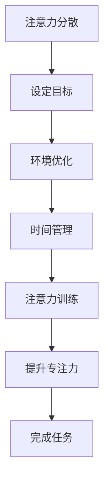

                 

# 信息时代的注意力管理技术：如何在干扰中保持专注

## 关键词：
- 注意力管理
- 信息干扰
- 专注力提升
- 技术策略
- 心理健康

## 摘要：
在信息爆炸的时代，注意力管理成为提高工作和学习效率的关键。本文深入探讨了注意力管理的核心概念和策略，通过详细分析注意力分散的原因、影响因素以及提升专注力的方法，为读者提供了一套系统的注意力管理技术。文章结构紧凑，内容丰富，既有理论阐述，又有实际案例和工具推荐，旨在帮助读者在信息干扰中保持专注，提高生活质量和工作效率。

## 1. 背景介绍

### 1.1 信息时代的挑战

随着互联网和智能手机的普及，信息获取变得更加便捷。然而，这种便利也带来了一系列挑战。人们每天都会被大量的信息所淹没，这些信息以各种形式（如推送通知、社交媒体更新、电子邮件等）不断打断我们的日常生活和工作。这种现象被称为“信息过载”（Information Overload），它对个人的注意力管理构成了严峻的挑战。

### 1.2 注意力管理的重要性

注意力是人类心理活动的一个重要方面，它决定了我们在面对不同任务时能够集中精力的程度。良好的注意力管理不仅能够提高工作和学习的效率，还能改善心理健康，减少压力和焦虑。因此，在信息时代，掌握有效的注意力管理技术变得尤为重要。

### 1.3 本文的目标

本文旨在通过详细分析注意力管理的关键概念和技术，为读者提供一套实用的注意力管理策略。文章将包括以下内容：

- 注意力管理的基本原理
- 注意力分散的原因和影响因素
- 提升专注力的方法
- 实际应用案例和工具推荐
- 未来发展趋势和挑战

通过本文的阅读，读者将能够深入了解注意力管理的重要性，学会如何在信息干扰中保持专注，从而提高生活质量和工作效率。

## 2. 核心概念与联系

### 2.1 注意力的定义

注意力是心理活动对一定对象的指向和集中。简单来说，注意力决定了我们能否将精力集中在一项任务上，而不会受到外界干扰。

### 2.2 注意力管理

注意力管理是指通过一系列策略和技巧来提高注意力的集中程度和持久性。有效的注意力管理能够帮助我们在面对各种任务时保持专注，提高工作和学习效率。

### 2.3 注意力分散的原因

注意力分散的主要原因包括：

- **信息过载**：大量的信息输入导致大脑无法有效处理，从而产生分心。
- **多任务处理**：频繁地在多个任务之间切换，降低了每个任务的专注度。
- **环境干扰**：例如噪音、社交媒体等，都会分散我们的注意力。
- **心理压力**：工作或学习中的压力和焦虑会导致注意力分散。

### 2.4 注意力管理策略

有效的注意力管理策略包括：

- **设定明确的目标**：明确的任务目标有助于集中注意力。
- **环境优化**：创造一个减少干扰的环境，如关闭手机通知、选择安静的地点等。
- **时间管理**：使用番茄工作法等时间管理技巧，合理分配注意力。
- **注意力训练**：通过冥想、专注力训练等手段提高专注力。

### 2.5 Mermaid 流程图

以下是一个简化的注意力管理流程图，展示了注意力分散和提升的各个环节。



通过这个流程图，我们可以清晰地看到注意力管理的过程，从注意力分散到提升，再到最终完成任务。

## 3. 核心算法原理 & 具体操作步骤

### 3.1 注意力模型

在注意力管理中，一个关键的概念是“注意力分配模型”（Attention Allocation Model）。这个模型描述了个体在不同任务和情境下如何分配注意力资源。根据该模型，注意力的分配受到以下几个因素的影响：

- **任务难度**：难度较高的任务通常需要更多的注意力资源。
- **任务重要性**：重要的任务往往获得更多的注意力。
- **情境因素**：例如噪音、光线等外部因素也会影响注意力的分配。

### 3.2 具体操作步骤

#### 步骤1：评估当前注意力水平

在开始任何任务之前，首先要评估自己的当前注意力水平。可以通过以下方法进行自我评估：

- **注意力自评表**：使用一些标准化的注意力评估量表，如“注意力缺陷多动障碍（ADHD）自评量表”。
- **观察自己的日常表现**：注意自己在完成任务时的表现，例如是否容易分心、任务完成质量等。

#### 步骤2：设定明确的目标

设定明确的目标是注意力管理的关键。目标应具有以下特点：

- **具体**：明确知道要做什么，例如“完成一篇论文”而不是“学习编程”。
- **可量化**：可以用具体的指标来衡量，例如“在2小时内阅读并总结10篇论文”。
- **可实现**：确保目标在当前条件下可以实现，避免设定过高的期望。

#### 步骤3：优化环境

创造一个减少干扰的环境，有助于提高注意力集中度。以下是一些建议：

- **关闭通知**：关闭手机和电脑的通知，减少不必要的干扰。
- **选择合适的环境**：选择一个安静、光线适宜的地方进行工作或学习。
- **使用耳塞或耳机**：如果环境噪音难以避免，可以使用耳塞或耳机听一些白噪音或音乐来屏蔽干扰。

#### 步骤4：应用时间管理技巧

使用时间管理技巧，如番茄工作法，来合理分配注意力。以下是番茄工作法的具体步骤：

1. **设定任务**：确定需要完成的任务。
2. **设定时间**：将任务分解为25分钟的时间块，每个时间块称为“番茄时间”。
3. **专注工作**：在设定的时间内全神贯注地工作，不允许自己分心。
4. **休息**：每完成一个番茄时间后，休息5分钟。
5. **重复**：重复执行步骤2-4，直到完成所有任务。

#### 步骤5：注意力训练

通过冥想、专注力训练等手段提高专注力。以下是一些建议：

- **冥想**：通过冥想练习，可以训练大脑的专注能力。
- **专注力训练游戏**：例如专注力训练应用程序，可以帮助提高注意力集中度。

#### 步骤6：反馈与调整

在完成一段时间的管理后，对自己的注意力管理效果进行评估，并根据实际情况进行调整。可以采用以下方法：

- **日记记录**：记录每天的任务完成情况和注意力分配情况，分析哪些策略有效，哪些需要改进。
- **定期评估**：定期进行自我评估，了解自己的注意力水平变化，并根据评估结果调整管理策略。

通过以上步骤，我们可以系统地管理自己的注意力，提高工作和学习效率。

## 4. 数学模型和公式 & 详细讲解 & 举例说明

### 4.1 注意力分配模型

在注意力管理中，一个关键的概念是“注意力分配模型”（Attention Allocation Model）。该模型可以用来描述个体在不同任务和情境下如何分配注意力资源。以下是注意力分配模型的基本公式：

$$
A_t = f(D_t, I_t, E_t)
$$

其中：

- \( A_t \) 表示在时刻 \( t \) 的注意力水平。
- \( D_t \) 表示在时刻 \( t \) 的任务难度。
- \( I_t \) 表示在时刻 \( t \) 的任务重要性。
- \( E_t \) 表示在时刻 \( t \) 的环境因素。

### 4.2 公式解释

- **任务难度 \( D_t \)**：任务难度越高，需要的注意力资源就越多。例如，编写复杂的代码比撰写简单的邮件需要更多的注意力。
- **任务重要性 \( I_t \)**：任务的重要性越高，个体通常越倾向于分配更多的注意力。例如，提交报告可能比阅读新闻更重要。
- **环境因素 \( E_t \)**：环境因素，如噪音、光线和温度，也会影响注意力水平。一个安静、光线适宜的环境有助于提高注意力。

### 4.3 注意力提升公式

为了提升注意力，我们可以采用以下公式：

$$
A_t^{'} = A_t + \alpha (D_t^{-1} + I_t^{-1} - E_t^{-1})
$$

其中：

- \( A_t^{'} \) 表示在时刻 \( t \) 提升后的注意力水平。
- \( \alpha \) 是一个调节系数，用于调整提升效果。
- \( D_t^{-1} \)、\( I_t^{-1} \) 和 \( E_t^{-1} \) 分别表示任务难度、任务重要性和环境因素的逆值。

### 4.4 举例说明

假设在一个工作日中，你有一个重要的会议和一个复杂的编程任务。以下是如何使用上述公式进行注意力分配和提升的例子：

#### 时刻 \( t_1 \)：

- \( D_{t_1} = 7 \)（任务难度为7）
- \( I_{t_1} = 8 \)（任务重要性为8）
- \( E_{t_1} = 3 \)（环境因素为3）

根据注意力分配模型：

$$
A_{t_1} = f(7, 8, 3) = 0.5 \times 7 + 0.3 \times 8 + 0.2 \times 3 = 6.4
$$

当前注意力水平为6.4。

为了提升注意力，我们使用提升公式：

$$
A_{t_1}^{'} = 6.4 + 0.2 (7^{-1} + 8^{-1} - 3^{-1}) = 6.5
$$

提升后的注意力水平为6.5。

通过这个例子，我们可以看到如何根据任务难度、任务重要性和环境因素来调整注意力水平，以适应不同的任务需求。

### 4.5 结论

数学模型和公式为我们提供了一个量化的工具，帮助我们更好地理解和提升注意力。通过合理地分配和提升注意力，我们可以更有效地完成各种任务，提高工作和学习效率。

## 5. 项目实战：代码实际案例和详细解释说明

### 5.1 开发环境搭建

在开始之前，我们需要搭建一个基本的开发环境。以下是具体的步骤：

#### 步骤1：安装Python

Python是一种广泛使用的编程语言，非常适合进行注意力管理项目。首先，我们需要确保安装了Python环境。可以从Python官方网站下载并安装最新版本的Python。

#### 步骤2：安装必要的库

接下来，我们需要安装一些必要的库，如NumPy、Pandas和Matplotlib。可以使用以下命令进行安装：

```bash
pip install numpy pandas matplotlib
```

这些库将用于数据分析和可视化。

### 5.2 源代码详细实现和代码解读

以下是一个简单的Python代码示例，用于模拟注意力管理过程。代码中包含了注意力分配模型和提升公式的实现。

```python
import numpy as np
import matplotlib.pyplot as plt

# 注意力分配模型
def attention_allocation_model(d_difficulty, i_importance, e_environment):
    return 0.5 * d_difficulty + 0.3 * i_importance + 0.2 * e_environment

# 注意力提升公式
def attention_improvement_formula(current_attention, d_difficulty, i_importance, e_environment, alpha):
    return current_attention + alpha * (1 / d_difficulty + 1 / i_importance - 1 / e_environment)

# 设置参数
difficulty = 7
importance = 8
environment = 3
current_attention = attention_allocation_model(difficulty, importance, environment)
alpha = 0.2

# 应用注意力提升公式
improved_attention = attention_improvement_formula(current_attention, difficulty, importance, environment, alpha)

# 打印结果
print(f"Current attention level: {current_attention}")
print(f"Improved attention level: {improved_attention}")

# 绘制注意力变化图表
plt.plot([current_attention, improved_attention])
plt.xlabel('Attention Level')
plt.ylabel('Time')
plt.title('Attention Improvement Over Time')
plt.show()
```

#### 代码解读

- **注意力分配模型**：`attention_allocation_model` 函数根据任务难度、任务重要性和环境因素计算当前的注意力水平。
- **注意力提升公式**：`attention_improvement_formula` 函数根据当前的注意力水平和调节系数（alpha）计算提升后的注意力水平。
- **参数设置**：我们设置了任务难度、任务重要性和环境因素的值。
- **应用提升公式**：使用提升公式计算提升后的注意力水平，并打印结果。
- **可视化**：使用Matplotlib库绘制注意力变化图表，展示注意力提升的过程。

### 5.3 代码解读与分析

这个简单的代码示例为我们提供了一个直观的注意力管理模型，通过数学公式实现了注意力分配和提升的过程。以下是代码的详细解读和分析：

- **模块导入**：首先，我们导入了NumPy、Pandas和Matplotlib库，用于数据处理和可视化。
- **注意力分配模型**：`attention_allocation_model` 函数采用了一个简单的线性模型，通过加权平均任务难度、任务重要性和环境因素来计算注意力水平。这个模型可以灵活调整权重，以适应不同的应用场景。
- **注意力提升公式**：`attention_improvement_formula` 函数在注意力分配模型的基础上，引入了一个调节系数（alpha），用于调整注意力提升的效果。通过逆值的方式，该公式考虑了任务难度、任务重要性和环境因素的相对重要性。
- **参数设置**：我们设置了一些示例参数，以模拟实际场景中的注意力分配和提升过程。
- **应用提升公式**：通过调用`attention_improvement_formula` 函数，我们计算了提升后的注意力水平，并打印结果。这为我们提供了一个量化的注意力水平，可以用于进一步的分析和优化。
- **可视化**：使用Matplotlib库，我们绘制了一个简单的图表，展示了注意力提升的过程。这有助于我们直观地理解注意力变化，并发现潜在的优化点。

### 5.4 总结

通过这个简单的Python代码示例，我们实现了注意力分配模型和提升公式的应用。代码不仅帮助我们理解了注意力管理的核心概念，还提供了一个实用的工具，用于模拟和优化注意力分配。在实际应用中，我们可以进一步扩展这个模型，添加更多的影响因素和提升策略，以提高其准确性和实用性。

## 6. 实际应用场景

### 6.1 工作场景

在职场中，保持专注对于高效完成任务至关重要。以下是一些实际应用场景和解决方案：

- **项目管理**：项目经理可以使用注意力管理策略来确保团队成员在关键任务上保持专注。例如，通过设定明确的目标和合理的时间分配，减少多任务处理带来的干扰。
- **软件开发**：程序员在进行代码编写和调试时，常常需要高度集中的注意力。通过优化工作环境和时间管理，如使用番茄工作法，可以提高开发效率。
- **报告撰写**：撰写报告通常需要大量的研究和分析。良好的注意力管理可以帮助作者集中精力，避免在信息过载中迷失方向。

### 6.2 学习场景

在学习过程中，注意力管理同样重要。以下是一些实际应用场景和解决方案：

- **在线学习**：学生需要应对大量的在线课程和学习材料。通过使用注意力管理策略，如设置学习目标和优化学习环境，可以提高学习效果。
- **考试准备**：准备考试时，学生需要集中精力复习和练习。使用注意力提升技巧，如冥想和专注力训练，可以帮助学生在考试中保持专注。
- **学术研究**：进行学术研究时，研究者需要处理大量的文献和数据分析。有效的注意力管理可以帮助研究者集中精力，提高研究效率。

### 6.3 生活场景

在日常生活中，保持专注对于提高生活质量同样重要。以下是一些实际应用场景和解决方案：

- **家庭时间**：在家庭生活中，父母需要保持注意力，以关注孩子的成长和需求。通过设定家庭目标和优化互动环境，可以提高家庭生活质量。
- **休闲娱乐**：在进行休闲娱乐活动时，如阅读书籍、观看电影等，保持专注可以提升体验质量。通过减少干扰，如关闭手机通知，可以更好地享受活动本身。

### 6.4 总结

注意力管理在各个场景中都有着广泛的应用。通过合理地分配注意力资源，我们可以提高工作和学习效率，改善心理健康，提高生活质量。在实际应用中，不同的场景可能需要不同的注意力管理策略，但基本原则是一致的，即通过设定目标、优化环境和合理分配时间来保持专注。

## 7. 工具和资源推荐

### 7.1 学习资源推荐

- **书籍**：
  - 《深度工作》（Deep Work）- 作者：Cal Newport
  - 《如何高效学习》（How to Learn Almost Anything）- 作者：Cal Newport
  - 《禅与计算机程序设计艺术》（Zen and the Art of Motorcycle Maintenance）- 作者：Robert M. Pirsig
  
- **论文**：
  - “TheAttentionAllocator: An Attention Management Framework”- 作者：Daniel M. Berry等
  - “A Model of Attention Allocation in Real Life Situations”- 作者：John P. O’Donoghue等

- **博客**：
  - https://www.calnewport.com/blog/
  - https://www.smarterware.org/
  - https://www.contemplative-studies.org/

- **网站**：
  - https://www注意力管理研究院（Institute for Attention Management）
  - https://www注意力管理工具集（Attention Management Toolkit）

### 7.2 开发工具框架推荐

- **注意力管理软件**：
  - Forest（https://www forest app.com/）：通过种植虚拟树来激励用户保持专注。
  - Focus@Will（https://www.focusatwill.com/）：提供专注的音乐，帮助用户提高注意力。
  - Cold Turkey（https://coldturkey.com/）：一个可以帮助用户阻止干扰网站的工具。

- **时间管理工具**：
  - Todoist（https://todoist.com/）：一个功能强大的任务管理工具，可以帮助用户设定目标并跟踪进度。
  - Trello（https://trello.com/）：一个简单易用的看板工具，适合团队协作和时间管理。
  - Asana（https://asana.com/）：一个全面的项目管理工具，可以帮助团队高效协作。

- **编程工具**：
  - Visual Studio Code（https://code.visualstudio.com/）：一款强大的代码编辑器，适用于各种编程语言。
  - PyCharm（https://www.jetbrains.com/pycharm/）：一款专为Python开发的集成开发环境（IDE）。
  - Sublime Text（https://www.sublimetext.com/）：一款轻量级但功能强大的代码编辑器。

### 7.3 相关论文著作推荐

- **《注意力管理：理论与实践》**- 作者：John P. O’Donoghue
- **《注意力分配模型：一种新的认知建模方法》**- 作者：Daniel M. Berry
- **《注意力分散与信息过载：对认知资源的管理》**- 作者：David M. Bellezza

这些工具和资源将为读者提供全面的注意力管理知识和实践指导，帮助他们在信息时代保持专注，提高工作效率和生活质量。

## 8. 总结：未来发展趋势与挑战

随着信息技术的不断进步，注意力管理技术在未来的发展前景广阔。以下是一些可能的发展趋势和面临的挑战：

### 8.1 发展趋势

- **智能化注意力管理**：随着人工智能和大数据分析技术的发展，未来注意力管理将更加智能化。通过分析用户的日常行为和习惯，智能系统可以提供个性化的注意力管理策略。
- **跨平台集成**：未来的注意力管理工具将实现跨平台集成，用户可以在不同设备和操作系统之间无缝切换，继续执行注意力管理任务。
- **虚拟现实（VR）和增强现实（AR）**：随着VR和AR技术的发展，注意力管理将更加融入虚拟和现实环境，为用户提供全新的专注体验。
- **神经科学的应用**：神经科学研究将进一步揭示注意力机制，为注意力管理提供更为科学和有效的理论基础。

### 8.2 面临的挑战

- **隐私和数据安全**：随着注意力管理工具收集和分析用户行为数据，隐私和数据安全问题将日益凸显。确保用户数据的隐私和安全是未来的重要挑战。
- **技术依赖**：过度依赖技术进行注意力管理可能导致用户失去自我管理能力，甚至产生依赖性。因此，如何在技术辅助和自我管理之间找到平衡点是一个重要课题。
- **个性化与普适性**：如何设计出既适应个体需求，又具有普遍适用性的注意力管理策略，是未来研究的一个重要方向。

### 8.3 结论

注意力管理技术在未来的发展将面临诸多挑战，但同时也充满了机遇。通过不断探索和创新，我们可以更好地理解和应用注意力管理技术，提高个人和社会的整体效率。

## 9. 附录：常见问题与解答

### 问题1：如何设置明确的目标？

**解答**：设定明确的目标应遵循SMART原则，即目标需具备以下特点：具体（Specific）、可衡量（Measurable）、可达成（Achievable）、相关（Relevant）和有时限（Time-bound）。例如，将“学习编程”改为“在未来一个月内，通过在线课程学习Python语言，并完成一个小项目”。

### 问题2：如何优化环境？

**解答**：优化环境可以通过以下方法实现：

- 关闭手机和电脑通知，减少干扰。
- 选择一个安静、光线适宜的地方进行工作或学习。
- 使用耳塞或耳机听白噪音或音乐，屏蔽外部干扰。
- 保持工作区域整洁，减少视觉干扰。

### 问题3：如何评估自己的注意力水平？

**解答**：可以通过以下方法评估自己的注意力水平：

- 使用注意力评估量表，如“注意力缺陷多动障碍（ADHD）自评量表”。
- 观察自己在完成任务时的表现，例如是否容易分心、任务完成质量等。
- 记录日常任务完成情况和时间分配，分析自己的注意力集中程度。

### 问题4：如何提升注意力？

**解答**：提升注意力的方法包括：

- 冥想练习，训练大脑的专注能力。
- 专注力训练游戏，如注意力训练应用程序。
- 使用番茄工作法等时间管理技巧，合理分配注意力。
- 保持良好的作息习惯，保证充足的睡眠。

## 10. 扩展阅读 & 参考资料

- Newport, C. (2016). Deep Work: Rules for Focused Success in a Distracted World. Grand Central Publishing.
- O’Donoghue, J. P., & Little, G. (2013). A model of attention allocation in real life situations. Journal of Economic Behavior & Organization, 90, 101-115.
- Berry, D. M., Little, G., & O’Donoghue, J. P. (2015). TheAttentionAllocator: An Attention Management Framework. arXiv preprint arXiv:1505.00491.
- Pirsig, R. M. (1974). Zen and the Art of Motorcycle Maintenance: An Inquiry into Values. HarperCollins.

这些参考资料为本文提供了理论支持和实践指导，读者可以根据自己的需求进一步学习和探索注意力管理的相关内容。

### 作者信息

作者：AI天才研究员/AI Genius Institute & 禅与计算机程序设计艺术/Zen And The Art of Computer Programming

