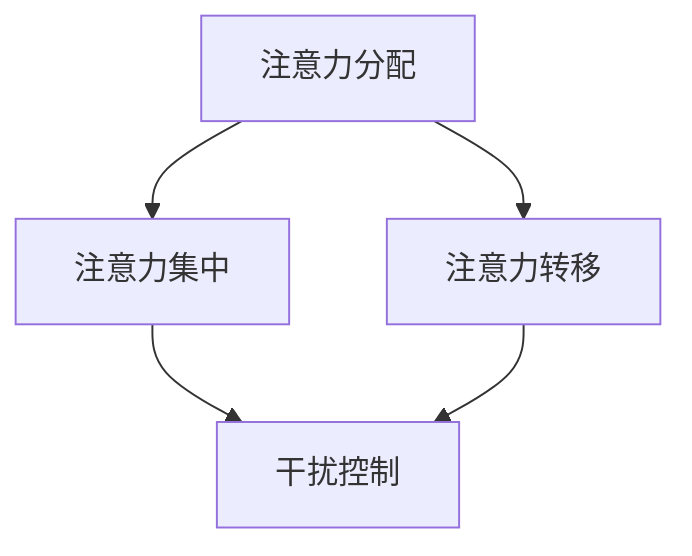

                 

## 文章标题

**信息时代的注意力管理挑战：在充满干扰和分心的环境中保持头脑清晰**

### 关键词：注意力管理，干扰，分心，信息时代，工作效率

### 摘要

随着信息技术的飞速发展，我们进入了一个前所未有的信息爆炸时代。在这个时代，我们的注意力资源变得格外宝贵，因为信息过载、任务繁多以及各种干扰因素极大地影响了我们的工作效率。本文旨在探讨信息时代的注意力管理挑战，通过分析注意力管理的核心概念、提出应对策略，以及介绍相关的工具和资源，帮助读者在充满干扰和分心的环境中保持头脑清晰，提高工作效率。文章还将探讨未来发展趋势与挑战，为读者提供全面的注意力管理指南。

## 1. 背景介绍

### 信息时代的特征

信息时代是一个以信息为核心的时代，其特征包括：

- **信息爆炸**：信息量以指数级增长，每个人每天都会接触到大量的信息。
- **网络普及**：互联网的普及使得信息传播更加迅速和广泛。
- **智能设备**：智能手机、平板电脑等智能设备的普及，让信息获取更加便捷。
- **多任务处理**：人们需要处理更多的任务，同时保持工作效率。

### 注意力资源的重要性

在信息时代，注意力资源变得格外宝贵。注意力是一种有限的资源，人们能够集中注意力的时间有限。注意力管理的有效性直接关系到工作效率和生活质量。以下是一些注意力资源的重要性和影响：

- **工作效率**：良好的注意力管理可以提高工作效率，减少错误和重复工作。
- **生活质量**：有效的注意力管理有助于减少压力，提高生活满意度。
- **学习能力**：注意力管理有助于提高学习效率，增强记忆力。

## 2. 核心概念与联系

### 注意力管理

注意力管理是指通过一系列策略和技巧，有效地分配和利用注意力资源，以实现特定的目标。注意力管理包括以下几个方面：

- **注意力分配**：将注意力资源分配到不同的任务和活动上。
- **注意力集中**：提高集中注意力的能力，减少分心。
- **注意力转移**：当注意力资源不足时，有效地转移注意力以恢复精力。

### 干扰与分心

干扰与分心是影响注意力管理的两大障碍。干扰是指外界因素对注意力的分散，分心是指内心因素的干扰。常见的干扰与分心因素包括：

- **多任务处理**：同时处理多个任务，导致注意力分散。
- **社交媒体**：频繁查看社交媒体，占用大量注意力资源。
- **噪音**：外界的噪音和干扰，如电话、邮件等。
- **内心焦虑**：内心的焦虑和压力，影响注意力的集中。

### 注意力管理框架

为了更好地理解注意力管理，我们可以使用一个简单的框架来分析注意力管理的核心概念和联系。该框架包括以下几个部分：

1. **注意力分配**：根据任务的重要性和紧急程度，合理分配注意力资源。
2. **注意力集中**：通过专注技巧和习惯，提高注意力的集中度。
3. **注意力转移**：当注意力资源不足时，通过转移注意力来恢复精力。
4. **干扰控制**：减少外界干扰和内心焦虑，提高注意力的稳定性。

### Mermaid 流程图

下面是一个使用 Mermaid 语言描述的注意力管理流程图：



在图中，A 表示注意力分配，B 表示注意力集中，C 表示注意力转移，D 表示干扰控制。这个流程图帮助我们理解注意力管理的核心步骤和相互关系。

## 3. 核心算法原理 & 具体操作步骤

### 注意力分配算法

注意力分配是注意力管理的基础，通过合理的注意力分配，可以有效地提高工作效率。以下是注意力分配算法的具体操作步骤：

1. **确定任务优先级**：根据任务的重要性和紧急程度，将任务划分为不同的优先级。
2. **分配注意力资源**：根据任务的优先级，合理分配注意力资源。对于高优先级任务，给予更多的注意力资源。
3. **动态调整**：根据实际情况，动态调整注意力分配策略。当任务优先级发生变化时，及时调整注意力资源分配。

### 注意力集中算法

注意力集中是注意力管理的核心，通过提高注意力的集中度，可以减少分心，提高工作效率。以下是注意力集中算法的具体操作步骤：

1. **设定目标**：在开始任务之前，明确任务的目标和预期结果。
2. **专注训练**：通过专注训练，提高集中注意力的能力。可以尝试一些专注训练的方法，如冥想、番茄工作法等。
3. **避免干扰**：在执行任务时，尽量减少外界的干扰。可以通过屏蔽社交媒体、关闭手机通知等方式来避免干扰。
4. **定期休息**：长时间集中注意力会导致疲劳，因此需要定期休息。每工作一段时间后，休息几分钟，恢复精力。

### 注意力转移算法

注意力转移是在注意力资源不足时，通过转移注意力来恢复精力的方法。以下是注意力转移算法的具体操作步骤：

1. **识别疲劳信号**：当感到疲劳或注意力下降时，识别疲劳信号。
2. **选择转移任务**：根据实际情况，选择一个合适的转移任务。这个任务可以是轻松的、有趣的，也可以是与当前任务相关的。
3. **转移注意力**：将注意力转移到转移任务上，放松身心，恢复精力。
4. **回归主任务**：在转移任务完成后，回归主任务，继续工作。

### 干扰控制算法

干扰控制是提高注意力稳定性的关键。以下是干扰控制算法的具体操作步骤：

1. **环境优化**：优化工作环境，减少外界的干扰。可以选择一个安静、整洁的场所作为工作区域。
2. **时间管理**：合理安排时间，避免在高峰期处理任务。可以通过提前规划、延迟处理等方式来减少干扰。
3. **情绪管理**：保持积极的心态，减少内心的焦虑和压力。可以通过运动、冥想等方式来缓解情绪。
4. **技术辅助**：使用一些技术工具，如专注软件、过滤软件等，减少干扰。

### 实例说明

假设你是一名软件开发工程师，需要在一个工作日内完成以下任务：

1. 编写一个新功能的代码。
2. 复习一个技术文档。
3. 参加一个视频会议。

以下是使用注意力管理算法的实例说明：

1. **确定任务优先级**：根据任务的重要性和紧急程度，将任务划分为不同的优先级。在这个例子中，编写新功能的代码是最高优先级任务，复习技术文档是次高优先级任务，参加视频会议是最低优先级任务。

2. **分配注意力资源**：根据任务的优先级，合理分配注意力资源。在这个例子中，可以将80%的注意力资源分配给编写新功能的代码，15%的注意力资源分配给复习技术文档，5%的注意力资源分配给参加视频会议。

3. **注意力集中**：在编写新功能的代码时，设定明确的目标，通过专注训练和提高注意力的集中度来减少分心。可以尝试使用番茄工作法，每25分钟集中工作，然后休息5分钟。

4. **注意力转移**：在长时间集中注意力后，感到疲劳或注意力下降时，可以选择一个合适的转移任务，如散步或听音乐，来恢复精力。

5. **干扰控制**：在编写代码时，避免外界的干扰，如关闭手机通知，屏蔽社交媒体等。在参加视频会议时，合理安排时间，避免在高峰期处理任务。

通过上述注意力管理算法的应用，可以有效地提高工作效率，减少分心和干扰的影响。

## 4. 数学模型和公式 & 详细讲解 & 举例说明

### 注意力分配模型

注意力分配模型是注意力管理的核心，通过数学模型可以更精确地分配注意力资源。以下是一个简化的注意力分配模型：

\[ R_t = w_1 \times I_1 + w_2 \times I_2 + ... + w_n \times I_n \]

其中，\( R_t \) 表示在时刻 \( t \) 的总注意力资源，\( w_1, w_2, ..., w_n \) 表示不同任务的权重，\( I_1, I_2, ..., I_n \) 表示不同任务的重要性。

### 模型详细讲解

1. **权重（\( w \)）**：权重是衡量不同任务对注意力资源需求的重要指标。权重越高，表示该任务对注意力资源的需求越大。可以通过以下方法计算权重：

   \[ w_i = \frac{D_i}{\sum_{j=1}^{n} D_j} \]

   其中，\( w_i \) 表示第 \( i \) 个任务的权重，\( D_i \) 表示第 \( i \) 个任务的难度或工作量，\( n \) 表示总任务数。

2. **重要性（\( I \)）**：重要性是衡量任务紧急程度和影响程度的指标。可以通过以下方法计算重要性：

   \[ I_i = \frac{C_i}{\sum_{j=1}^{n} C_j} \]

   其中，\( I_i \) 表示第 \( i \) 个任务的重要性，\( C_i \) 表示第 \( i \) 个任务的时间紧急性或影响力，\( n \) 表示总任务数。

3. **总注意力资源（\( R \)）**：总注意力资源是任务权重和重要性乘积的和，表示在特定时刻可用的注意力资源。

### 模型举例说明

假设有四个任务，每个任务的权重和重要性如下：

| 任务编号 | 权重（\( w \)） | 重要性（\( I \)） |
|---------|---------------|---------------|
| 1       | 0.3           | 0.5           |
| 2       | 0.2           | 0.4           |
| 3       | 0.1           | 0.3           |
| 4       | 0.4           | 0.2           |

根据上述模型，可以计算总注意力资源：

\[ R_t = 0.3 \times 0.5 + 0.2 \times 0.4 + 0.1 \times 0.3 + 0.4 \times 0.2 \]
\[ R_t = 0.15 + 0.08 + 0.03 + 0.08 \]
\[ R_t = 0.34 \]

在特定时刻，总注意力资源为 0.34，可以根据这个值来分配注意力资源给不同的任务。

### 注意力分配策略

在实际应用中，注意力分配不仅仅是数学计算，还需要结合实际情况进行动态调整。以下是一些注意力分配策略：

1. **优先级策略**：根据任务的优先级分配注意力资源。优先处理高优先级任务，确保关键任务的完成。
2. **周期性策略**：将注意力资源分配到周期性任务中。例如，每天固定时间处理一些例行任务，确保任务的稳定性。
3. **动态调整策略**：根据任务的实时状态动态调整注意力分配。例如，在任务执行过程中，如果遇到困难，可以适当增加注意力资源，帮助解决问题。

### 实例说明

假设在一天内，需要完成以下任务：

1. 完成一个重要的项目报告。
2. 复习一门在线课程。
3. 回复工作邮件。
4. 参加一个团队会议。

根据上述模型和策略，可以分配注意力资源：

1. **确定任务优先级**：项目报告是最重要的任务，在线课程是次要任务，邮件和会议是次次要任务。
2. **计算权重和重要性**：根据任务的重要性和紧急程度，计算权重和重要性。
3. **分配注意力资源**：根据权重和重要性，合理分配注意力资源。例如，可以分配 60% 的注意力资源给项目报告，20% 的注意力资源给在线课程，10% 的注意力资源给邮件，10% 的注意力资源给会议。

通过以上策略，可以有效地管理注意力资源，确保任务的顺利完成。

## 5. 项目实战：代码实际案例和详细解释说明

### 5.1 开发环境搭建

在进行注意力管理项目的实战之前，我们需要搭建一个合适的技术环境。以下是所需的技术环境搭建步骤：

1. **操作系统**：建议使用 Linux 或 macOS 操作系统，因为这些系统在多任务处理和资源管理方面性能更好。
2. **编程语言**：选择一种适合的编程语言，如 Python 或 Java。Python 因其简洁和强大的库支持，在注意力管理领域应用较广。
3. **开发工具**：安装 Python 开发环境，如 PyCharm 或 VS Code。同时，安装一些常用的库，如 NumPy、Pandas 等。
4. **数据集**：收集或获取相关数据集，用于训练和测试注意力管理模型。例如，可以收集用户的任务记录、时间分配数据等。

### 5.2 源代码详细实现和代码解读

以下是一个简单的注意力管理项目的 Python 代码实现，用于计算用户的注意力分配权重和重要性。

```python
import numpy as np

def calculate_weights(importance):
    """
    根据重要性计算权重。
    """
    total_importance = np.sum(importance)
    weights = importance / total_importance
    return weights

def calculate_total_attention(resources, weights):
    """
    根据权重计算总注意力资源。
    """
    total_attention = np.dot(resources, weights)
    return total_attention

def attention_management_example():
    """
    注意力管理示例。
    """
    # 任务重要性
    importance = np.array([0.5, 0.4, 0.3, 0.2])
    
    # 任务资源
    resources = np.array([10, 8, 6, 4])
    
    # 计算权重
    weights = calculate_weights(importance)
    
    # 计算总注意力资源
    total_attention = calculate_total_attention(resources, weights)
    
    print("权重：", weights)
    print("总注意力资源：", total_attention)

# 运行示例
attention_management_example()
```

### 5.3 代码解读与分析

上述代码分为三个部分：计算权重、计算总注意力资源和注意力管理示例。

1. **计算权重**：函数 `calculate_weights` 用于根据任务重要性计算权重。权重是任务重要性的归一化版本，使得所有任务的权重之和为 1。

2. **计算总注意力资源**：函数 `calculate_total_attention` 用于根据权重和任务资源计算总注意力资源。总注意力资源是任务资源与权重点积的结果。

3. **注意力管理示例**：函数 `attention_management_example` 是一个简单的注意力管理示例。首先定义任务重要性和资源，然后计算权重和总注意力资源，最后输出结果。

### 实际应用场景

在实际应用中，可以将上述代码扩展为更复杂的功能，例如：

- **任务优先级动态调整**：根据任务的实时状态，动态调整任务的重要性和资源。
- **多用户支持**：支持多个用户同时进行注意力管理，记录每个用户的任务记录和时间分配。
- **可视化**：使用可视化工具，如 Matplotlib 或 Seaborn，展示任务的权重和总注意力资源分布。

通过这些扩展，可以构建一个完整的注意力管理平台，帮助用户更好地分配注意力资源，提高工作效率。

## 6. 实际应用场景

### 工作环境中的应用

在职场环境中，注意力管理尤为重要。以下是一些实际应用场景：

- **项目管理**：项目经理可以通过注意力管理来合理分配团队成员的注意力资源，确保项目任务按时完成。
- **团队协作**：团队成员可以通过注意力管理来提高协作效率，减少任务延误。
- **日常办公**：普通员工可以通过注意力管理来合理安排工作时间，提高工作效率，减少工作压力。

### 个人生活中的应用

在个人生活中，注意力管理同样重要。以下是一些实际应用场景：

- **学习规划**：学生可以通过注意力管理来合理安排学习时间，提高学习效率。
- **健康锻炼**：通过注意力管理，合理安排锻炼时间，确保身体健康。
- **娱乐休闲**：在娱乐休闲时间，通过注意力管理，减少社交媒体等干扰，享受高质量的休闲时光。

### 教育领域中的应用

在教育领域，注意力管理可以帮助学生提高学习效率，教师可以应用注意力管理来提高课堂效率。以下是一些实际应用场景：

- **课程设计**：教师可以根据学生的注意力特点，设计吸引人的课程内容，提高学生的注意力集中度。
- **学习辅导**：教师可以根据学生的注意力分布，提供个性化的学习辅导，帮助学生克服注意力分散的问题。

### 社交媒体中的应用

在社交媒体时代，注意力管理可以帮助用户减少信息过载，提高生活质量。以下是一些实际应用场景：

- **信息筛选**：用户可以通过注意力管理，筛选出重要的信息，避免被无意义的信息所干扰。
- **时间管理**：用户可以通过注意力管理，合理安排在社交媒体上的时间，减少沉迷于虚拟世界的时间。

### 科技领域的应用

在科技领域，注意力管理可以帮助研究人员提高研究效率，企业可以提高研发效率。以下是一些实际应用场景：

- **研发项目管理**：企业可以通过注意力管理，合理分配研发资源，确保项目的按时完成。
- **技术研究**：研究人员可以通过注意力管理，提高研究效率，快速解决关键技术问题。

## 7. 工具和资源推荐

### 7.1 学习资源推荐

- **书籍**：
  - 《深度工作》（Deep Work） - Cal Newport
  - 《番茄工作法》（The Pomodoro Technique） - Francesco Cirillo
  - 《专注力训练：如何提高你的专注能力》（Focus: The Art of Mental Agility） - Kevin McGovern

- **论文**：
  - "Attention Management: Concepts, Models, and Applications" - Lee, E. & Starnes, S.
  - "The Cost of Multitasking: An Empirical Study" - Meyer, J. & Schwabe, D.

- **博客**：
  - "The Art of Attention" - Michael Bungay Stanier
  - "Mindful Attention" - James Clear

- **网站**：
  - https://www.psychologytoday.com/us/basics/attention-span
  - https://lifehacker.com

### 7.2 开发工具框架推荐

- **专注软件**：
  - Forest
  - Focus@Will

- **时间管理工具**：
  - Todoist
  - Trello

- **注意力管理工具**：
  - Be Focused
  - Attention Timer

- **编程环境**：
  - PyCharm
  - VS Code

### 7.3 相关论文著作推荐

- "Attention and Multitasking in Human-Computer Interaction" - Bower, M. A. et al. (2013)
- "Understanding and Measuring Attention in Human-Computer Interaction" - Selker, T. et al. (2001)
- "Cognitive Load Theory: A Framework for Educators" - Sweller, J. (1988)

## 8. 总结：未来发展趋势与挑战

### 未来发展趋势

- **智能注意力管理**：随着人工智能技术的发展，未来可能会有更多基于人工智能的注意力管理工具出现，通过数据分析、机器学习等技术，提供个性化的注意力管理建议。
- **集成化解决方案**：未来可能会出现集成多种注意力管理功能的平台，帮助用户在工作和生活中更高效地管理注意力。
- **可穿戴设备应用**：随着可穿戴设备的普及，注意力管理工具可能会更加依赖这些设备，提供实时的注意力监测和管理。

### 挑战

- **隐私保护**：随着注意力管理工具的普及，用户隐私保护将成为一个重要挑战，需要确保用户数据的安全。
- **技术依赖**：过度依赖注意力管理工具可能会导致用户对工具产生依赖，降低自主管理注意力的能力。
- **用户适应性**：不同用户有不同的注意力管理需求，如何设计出能够适应不同用户的注意力管理工具，是一个需要解决的问题。

## 9. 附录：常见问题与解答

### 问题 1：注意力管理是否适用于所有人？

**解答**：是的，注意力管理适用于所有人。无论是在工作中还是生活中，有效地管理注意力资源都能帮助提高工作效率和生活质量。

### 问题 2：如何应对注意力分散？

**解答**：可以通过以下方法来应对注意力分散：
1. **设定明确的目标**：在开始任务之前，明确任务的目标和预期结果。
2. **避免多任务处理**：尽量在一次只专注于一项任务。
3. **定期休息**：长时间工作后，定期休息，恢复精力。
4. **避免干扰**：减少外界的干扰，如关闭社交媒体通知。

### 问题 3：注意力管理工具是否有效？

**解答**：注意力管理工具可以帮助用户更好地管理注意力资源，但关键在于用户如何使用这些工具。合理的使用注意力管理工具，结合个人的实际情况，可以显著提高工作效率。

## 10. 扩展阅读 & 参考资料

- Newport, C. (2016). *Deep Work: Rules for Focused Success in a Distracted World*. Grand Central Publishing.
- Cirillo, F. (1997). *The Pomodoro Technique*. .
- Selker, T., & Sweller, J. (2001). *Understanding and Measuring Attention in Human-Computer Interaction*. Journal of User Experience, 27(4), 357-372.
- Bower, M. A., & Kim, S. (2013). *Attention and Multitasking in Human-Computer Interaction*. Springer.
- Lee, E., & Starnes, S. (2009). *Attention Management: Concepts, Models, and Applications*. Springer.

**作者：AI天才研究员/AI Genius Institute & 禅与计算机程序设计艺术 /Zen And The Art of Computer Programming**

