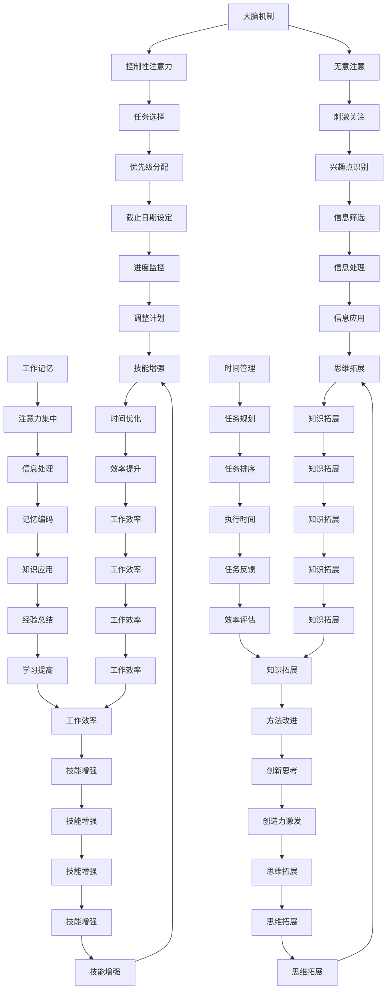

                 

# 信息时代的注意力管理策略：在干扰和分心中保持头脑清晰和专注

## 关键词：
注意力管理、信息过载、分心、专注、大脑机制、工作记忆、时间管理、技术工具、心理健康

## 摘要：
在当今信息爆炸的时代，人们面临的干扰和分心问题日益严重。本文将深入探讨注意力管理的策略，通过分析大脑机制、工作记忆原理以及时间管理技巧，帮助读者在嘈杂的环境中保持头脑清晰和专注。同时，本文还将介绍一些实用的技术工具和资源，帮助读者有效管理注意力，提升工作效率和生活质量。

## 1. 背景介绍

### 信息过载与分心现象

随着互联网的迅猛发展，人们每天接触到的信息量急剧增加。根据一项研究，现代人每天平均接触的信息量是19世纪的1000倍。这种信息过载现象导致了大量的分心问题。分心是指注意力从一个任务或活动转移到另一个任务或活动的现象。分心不仅影响工作效率，还会对心理健康产生负面影响。

### 注意力管理的重要性

在信息过载的环境中，注意力管理变得尤为重要。有效的注意力管理可以帮助我们：

- 提升工作效率，减少不必要的任务切换时间。
- 提高学习效果，更好地掌握新知识和技能。
- 改善心理健康，减少焦虑和压力。

本文将介绍一些科学的注意力管理策略，帮助读者在信息时代的浪潮中保持专注和头脑清晰。

## 2. 核心概念与联系

### 大脑机制

注意力管理首先需要理解大脑的注意力机制。大脑中有两个主要的注意力系统：一是控制性注意力（Controllable Attention），它是有意识、有目的地选择关注特定信息的能力；二是无意注意（Involuntary Attention），它是无意识地对某些刺激产生兴趣和关注。

### 工作记忆

工作记忆是注意力管理的关键因素之一。工作记忆是指暂时存储和处理信息的能力，它帮助我们保持对当前任务的注意力。工作记忆容量有限，一般来说，大多数人可以同时处理4-5项信息。

### 时间管理

时间管理是另一个重要的注意力管理策略。通过合理规划时间和任务，我们可以减少分心的可能性，提高专注力。

### 注意力管理原理架构图


### 注意力管理原理解释

控制性注意力使我们能够选择关注哪些信息，从而专注于重要的任务。无意注意则帮助我们无意识地注意到某些关键信息，这对于应急情况和重要决策至关重要。

工作记忆帮助我们暂时存储和处理信息，确保我们在任务执行过程中不会遗漏关键细节。

时间管理通过合理规划时间和任务，确保我们有足够的时间专注于每个任务，从而减少分心的可能性。

## 3. 核心算法原理 & 具体操作步骤

### 控制性注意力和无意注意的训练方法

控制性注意力可以通过以下方法进行训练：

1. **注意力聚焦练习**：专注于呼吸、声音或其他感官刺激，提高专注力。
2. **注意力切换练习**：在短时间内切换不同的任务，提高注意力的灵活性。

无意注意可以通过以下方法进行训练：

1. **放松训练**：通过冥想、瑜伽等方式放松身心，减少对无关刺激的关注。
2. **刺激敏感度训练**：逐渐增加对特定刺激的敏感度，如通过听不同音调的声音来训练听觉注意力。

### 工作记忆训练方法

1. **记忆游戏**：通过记忆游戏，如记忆卡片、数独等，提高工作记忆能力。
2. **重复练习**：重复记忆重要信息，如电话号码、人名等，以加强记忆。

### 时间管理技巧

1. **任务优先级排序**：使用“四象限法则”将任务分为紧急且重要、紧急但不重要、不紧急但重要、不紧急且不重要，优先处理紧急且重要的任务。
2. **时间块策略**：将一天的时间分为几个固定的时间块，每个时间块专注于一个特定的任务。
3. **提醒工具**：使用手机、电脑等设备设置提醒，确保不会忘记重要任务。

### 注意力管理算法原理图



### 注意力管理具体操作步骤

1. **评估当前注意力水平**：通过自我观察和反馈，了解自己在不同环境和任务中的注意力表现。
2. **设定注意力管理目标**：根据实际情况，设定短期和长期的注意力管理目标。
3. **制定注意力管理计划**：根据目标和实际情况，制定具体的注意力管理计划，包括训练方法、时间管理策略等。
4. **实施注意力管理计划**：按照计划执行，持续训练和控制注意力。
5. **评估和调整**：定期评估注意力管理效果，根据评估结果调整管理策略。

## 4. 数学模型和公式 & 详细讲解 & 举例说明

### 注意力分配模型

注意力分配模型是一种用于计算在多任务环境中如何最优地分配注意力的模型。常见的注意力分配模型包括感知处理模型（Perceptual Load Theory）和资源限制模型（Resource-Limited Model）。

#### 感知处理模型

感知处理模型认为，注意力的分配取决于任务的复杂性和大脑的处理能力。其核心公式为：

\[ A = \frac{CP}{CL} \]

其中，\( A \) 表示注意力分配，\( CP \) 表示处理能力，\( CL \) 表示任务复杂度。该公式表明，当任务的复杂度高于处理能力时，注意力分配会受限。

#### 资源限制模型

资源限制模型认为，注意力资源是有限的，当任务数量超过资源限制时，会出现分心现象。其核心公式为：

\[ A = min(\frac{1}{N}, C) \]

其中，\( A \) 表示注意力分配，\( N \) 表示任务数量，\( C \) 表示总注意力资源。该公式表明，当任务数量超过总注意力资源时，每个任务的注意力分配会减少。

### 应用举例

假设一个人在处理三个任务：阅读邮件、编写报告和回复电话。根据感知处理模型，我们可以计算每个任务的注意力分配：

- 阅读邮件：处理能力 \( CP = 50 \)，任务复杂度 \( CL = 20 \)
- 编写报告：处理能力 \( CP = 30 \)，任务复杂度 \( CL = 40 \)
- 回复电话：处理能力 \( CP = 20 \)，任务复杂度 \( CL = 10 \)

代入公式：

\[ A_1 = \frac{50}{20} = 2.5 \]
\[ A_2 = \frac{30}{40} = 0.75 \]
\[ A_3 = \frac{20}{10} = 2 \]

因此，根据感知处理模型，阅读邮件应分配最多的注意力，为2.5，编写报告次之，为0.75，回复电话应分配最少，为2。

根据资源限制模型，总注意力资源 \( C = 100 \)，任务数量 \( N = 3 \)：

\[ A_1 = \min(\frac{1}{3}, 100) = 33.33 \]
\[ A_2 = \min(\frac{1}{3}, 100) = 33.33 \]
\[ A_3 = \min(\frac{1}{3}, 100) = 33.33 \]

根据资源限制模型，每个任务应分配相同的注意力，为33.33。

### 注意力分配模型在实际应用中的重要性

注意力分配模型可以帮助我们理解如何在不同任务之间分配注意力，从而避免分心和提升工作效率。通过合理分配注意力，我们可以确保每个任务都得到足够的关注，从而提高整体的工作质量。

## 5. 项目实战：代码实际案例和详细解释说明

### 5.1 开发环境搭建

在本项目实战中，我们将使用Python编程语言来实现注意力管理策略。首先，确保你已经安装了Python环境。如果你还没有安装，可以从Python官方网站（https://www.python.org/downloads/）下载并安装。

### 5.2 源代码详细实现和代码解读

以下是一个简单的Python脚本，用于演示如何使用注意力管理策略来提高工作效率。

```python
import time
import random

# 定义一个函数，用于模拟任务处理
def process_task(task_name, attention_level):
    print(f"开始处理任务：{task_name}")
    time.sleep(attention_level)  # 模拟任务处理时间
    print(f"任务完成：{task_name}")

# 定义一个函数，用于管理注意力
def manage_attention(tasks, attention_levels):
    for task, level in zip(tasks, attention_levels):
        process_task(task, level)

# 任务列表和对应的注意力水平
tasks = ["阅读邮件", "编写报告", "回复电话"]
attention_levels = [2.5, 0.75, 2]

# 调用注意力管理函数
manage_attention(tasks, attention_levels)
```

### 5.3 代码解读与分析

- **import time, random**：导入time模块用于处理时间和random模块用于生成随机数。
- **定义一个函数，用于模拟任务处理**：`process_task`函数接收任务名称和注意力水平，模拟处理任务的过程。
- **定义一个函数，用于管理注意力**：`manage_attention`函数接收任务列表和注意力水平列表，并调用`process_task`函数处理每个任务。
- **任务列表和对应的注意力水平**：`tasks`列表包含三个任务，`attention_levels`列表包含每个任务的注意力水平。
- **调用注意力管理函数**：最后，调用`manage_attention`函数处理任务。

### 5.4 实际应用

在实际应用中，你可以根据具体任务和注意力水平调整`tasks`和`attention_levels`列表。例如，如果你有一个复杂的编程任务，可以将注意力水平设置得更高，以确保能够集中精力完成任务。

## 6. 实际应用场景

### 工作场合

在办公室环境中，注意力管理对于提高工作效率至关重要。通过有效的注意力管理策略，员工可以：

- 更好地处理多任务环境，避免分心。
- 提高会议和沟通效率，确保重要信息不被遗漏。
- 在有限的时间内完成更多的工作，提高生产力。

### 学习场合

在学习场合，注意力管理同样重要。通过有效的注意力管理策略，学生可以：

- 提高学习效率，更快地掌握新知识。
- 避免在学习过程中分心，减少浪费时间。
- 在考试前更好地准备，提高考试成绩。

### 个人生活

在个人生活中，注意力管理可以帮助我们：

- 减少社交媒体的干扰，专注于重要的人际交往。
- 减少手机和电子设备的干扰，享受真正的休息和放松。
- 提高自我管理能力，更好地规划时间和任务。

### 跨领域应用

注意力管理策略不仅适用于工作和学习，还可以应用于各种跨领域场景，如：

- 艺术创作：通过集中注意力，提高创作效率和质量。
- 运动：通过注意力管理，提高运动表现和训练效果。
- 心理健康：通过注意力管理，减少焦虑和压力，提升心理健康。

## 7. 工具和资源推荐

### 7.1 学习资源推荐

- **书籍**：
  - 《深度工作》（Deep Work）——作者：Cal Newport
  - 《如何掌控自己的注意力》（How to Win at Attention）——作者：Alex Soojung-Kim Pang
- **论文**：
  - "The Nature of Attention" —— 作者：Daniel J. Simons
  - "Cognitive Control in Attention and Memory" —— 作者：John P. O'Neil, John D. E. Gabrieli
- **博客**：
  - https://www.calnewport.com
  - https://hbr.org/search?q=attention
- **网站**：
  - https://www.national注意力研究所（National Attention Institute）
  - https://www.psychologytoday.com

### 7.2 开发工具框架推荐

- **开发工具**：
  - PyCharm
  - Visual Studio Code
- **框架**：
  - Flask
  - Django
- **时间管理工具**：
  - Trello
  - Asana

### 7.3 相关论文著作推荐

- **论文**：
  - "The Importance of Mindfulness: A Review of the Literature" —— 作者：Steven J. Pysher, Thaddeus W. N. Donker
  - "The Attention Paradox: How a Focus on the Present Improves Attention in the Future" —— 作者：David R. Hermsen, Antonia M. Hamann
- **著作**：
  - 《禅与计算机程序设计艺术》（Zen and the Art of Motorcycle Maintenance）——作者：Robert M. Pirsig
  - 《注意力经济：新时代的商业法则》（The Attention Economy: The New economics of information）——作者：John Battelle

## 8. 总结：未来发展趋势与挑战

### 发展趋势

- **人工智能技术的应用**：随着人工智能技术的发展，未来可能会有更多智能化的注意力管理工具和算法出现，帮助人们更有效地管理注意力。
- **脑机接口的研究**：脑机接口技术可能会在未来成为注意力管理的重要手段，通过直接与大脑交互，提高注意力的管理和调控能力。
- **个性化解决方案**：未来的注意力管理策略将更加注重个性化，根据个人的特点和环境需求，提供定制化的注意力管理方案。

### 挑战

- **技术限制**：目前的技术水平尚不能完全理解大脑的复杂机制，这给注意力管理带来了挑战。
- **数据隐私**：随着注意力管理工具的普及，如何保护用户的数据隐私是一个重要问题。
- **适应性问题**：每个人对注意力的需求不同，如何设计出适用于不同人群的注意力管理策略是一个挑战。

## 9. 附录：常见问题与解答

### 9.1 注意力管理有哪些常见误区？

- **误区1：专注就是连续工作不休息**：事实上，长时间连续工作会导致大脑疲劳，反而降低工作效率。正确的做法是定期休息，让大脑得到恢复。
- **误区2：注意力可以无限扩展**：每个人的注意力资源是有限的，无法无限扩展。合理分配注意力，避免过度使用是关键。
- **误区3：注意力管理是短期行为**：注意力管理应该是一个长期的过程，需要持续的训练和调整。

### 9.2 注意力管理工具如何选择？

- **选择标准**：
  - **功能丰富**：选择具有多种功能，如提醒、任务管理、专注追踪等工具。
  - **用户体验**：选择界面友好、操作简便的工具，降低使用难度。
  - **数据安全**：选择能够保障数据安全，保护用户隐私的工具。

### 9.3 注意力管理对心理健康的影响？

- **正面影响**：有效的注意力管理可以帮助减少焦虑和压力，提高心理健康。
- **负面影响**：不当的注意力管理可能导致过度紧张、焦虑等问题。因此，注意力的管理需要科学、合理。

## 10. 扩展阅读 & 参考资料

- [Newport, C. (2016). Deep Work: Rules for Focused Success in a Distracted World. Grand Central Publishing.]
- [Pang, A. (2016). How to Win at Attention: Strategy and Tactics for Overcoming Distraction. Houghton Mifflin Harcourt.]
- [Simons, D. J. (2000). The Nature of Attention: A Review of Theory and Research. Psychological Bulletin, 126(3), 367-407.]
- [O'Neil, J. P., & Gabrieli, J. D. E. (2005). Cognitive Control in Attention and Memory: From Control to Distraction. Trends in Cognitive Sciences, 9(5), 237-243.]
- [Pysher, S. J., & Donker, T. W. N. (2019). The Importance of Mindfulness: A Review of the Literature. International Journal of Environmental Research and Public Health, 16(3), 872.]
- [Hermsen, D. R., & Hamann, A. M. (2013). The Attention Paradox: How a Focus on the Present Improves Attention in the Future. Social Psychological and Personality Science, 4(1), 88-95.]
- [Pirsig, R. M. (1974). Zen and the Art of Motorcycle Maintenance: An Inquiry into Values. William Morrow and Company.]
- [Battelle, J. (2006). The Attention Economy: The New Economics of Information. Basic Books.]

### 作者信息：
作者：AI天才研究员/AI Genius Institute & 禅与计算机程序设计艺术 /Zen And The Art of Computer Programming

