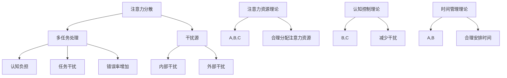

                 

### 背景介绍

在当今信息爆炸的时代，我们的日常生活和工作环境充满了各种干扰和分心因素。从手机上的社交媒体通知，到电子邮件、即时消息和社交媒体的弹窗，我们的注意力经常被分散，导致难以集中精力完成任务。这种注意力分散不仅影响工作效率，还可能导致心理健康问题，如压力和焦虑。

随着远程工作和在线教育的普及，人们越来越依赖数字工具和技术来处理工作和学习任务。然而，这些工具在提供便利的同时，也增加了干扰和分心的风险。例如，远程工作中，家庭成员的打扰、社交媒体的诱惑以及家庭环境的多样性都可能导致工作效率的下降。而在在线教育中，学生面临着网络干扰、技术故障和注意力分散的挑战。

注意力管理的重要性不仅仅体现在个人层面，对企业组织而言，它同样至关重要。研究表明，员工在高度分散的注意力下，其工作效率和创造力都会显著降低。为了应对这一挑战，许多企业开始关注如何通过技术手段和策略来提高员工的注意力集中度。

本文旨在探讨信息时代的注意力管理策略，分析干扰和分心的来源，并介绍一系列有效的管理注意力方法。我们将讨论这些策略在实际工作中的应用，并提供实用的工具和资源推荐，以帮助读者在干扰和分心中航行。

接下来的章节中，我们将首先介绍注意力管理的基本概念和原理，随后深入探讨干扰和分心的具体原因。然后，我们将详细讨论各种注意力管理策略，包括时间管理和优先级设定等。最后，我们将通过实际应用案例和工具推荐，为读者提供具体的实施建议。

通过本文的阅读，读者将能够理解注意力管理的核心概念，掌握有效的管理策略，并学会如何在实际工作和生活中应用这些策略，以减少干扰和分心，提高工作效率和创造力。无论您是个人用户还是企业管理者，这些策略都将成为您在信息时代的宝贵指南。

### 核心概念与联系

为了深入理解注意力管理策略，我们需要首先了解一些核心概念，并探讨这些概念之间的联系。这些概念包括注意力分散、多任务处理、干扰源以及注意力管理的理论框架。

#### 注意力分散

注意力分散（Attentional Diversion）是指注意力从一个任务转移到另一个任务或干扰源上的现象。这种现象在信息时代尤为普遍，主要由于以下几个原因：

1. **技术因素**：智能手机、社交媒体、电子邮件和即时通讯工具等现代技术设备不断发出通知和提示，吸引用户的注意力。
2. **工作环境**：现代工作环境往往需要员工同时处理多项任务，导致注意力无法持续集中。
3. **心理因素**：人类的注意力是有限的，长时间保持高度集中的注意力会导致疲劳，从而更容易分散。

#### 多任务处理

多任务处理（Multitasking）是指同时执行多个任务的能力。尽管许多人认为自己能够有效地同时处理多个任务，但研究表明，多任务处理往往会降低每个任务的质量和效率。以下是多任务处理的一些特点：

1. **认知负担**：多任务处理需要大脑在多个任务之间切换，这增加了认知负担，导致工作效率降低。
2. **任务干扰**：在执行多个任务时，一个任务的干扰可能会影响另一个任务的完成质量。
3. **错误率增加**：多任务处理往往会导致错误率增加，因为大脑难以在多个任务之间保持同样的专注度。

#### 干扰源

干扰源（Distractions）是导致注意力分散的主要原因，包括内部和外部两种干扰源：

1. **内部干扰**：来自个人内心的干扰，如焦虑、情绪波动或疲劳。
2. **外部干扰**：来自外部环境的干扰，如噪音、同事的对话、社交媒体的通知等。

#### 注意力管理的理论框架

注意力管理的理论框架包括以下几部分：

1. **注意力资源理论**：该理论认为注意力是一种有限的资源，人们需要合理分配和使用这种资源。
2. **认知控制理论**：该理论强调个体在注意力和决策过程中的控制能力，通过认知控制策略来减少干扰和提高注意力集中度。
3. **时间管理理论**：时间管理理论关注如何通过合理安排时间来减少干扰和分心，提高工作效率。

#### 核心概念之间的联系

这些核心概念之间存在紧密的联系。注意力分散和多任务处理会导致注意力资源的浪费，增加干扰源，从而影响工作效率。而有效的注意力管理策略，如时间管理和认知控制，可以帮助减少这些干扰，提高注意力集中度，进而提高工作效率和创造力。

#### Mermaid 流程图

以下是注意力管理核心概念和理论框架的Mermaid流程图表示：



通过上述流程图，我们可以清晰地看到各个核心概念和理论框架之间的逻辑关系，这为我们进一步探讨注意力管理策略提供了理论基础。

### 核心算法原理 & 具体操作步骤

在理解了注意力管理的基本概念和理论框架之后，我们需要探讨一些具体的方法和算法，以帮助我们在信息时代有效地管理注意力。以下是一些核心算法原理和具体操作步骤：

#### 1. 时间块法（Time Blocking）

时间块法是一种通过将时间划分为固定的时间块来提高注意力集中度的策略。以下是其原理和操作步骤：

**原理**：
- 将工作时间划分为多个固定长度的时间块，每个时间块专注于一个特定的任务或活动。
- 在每个时间块开始前，设置一个清晰的目标或任务。

**操作步骤**：
1. **规划时间块**：首先，确定每个时间块的时间长度，一般建议为25分钟到60分钟，每个时间块之间设置5-10分钟的休息时间。
2. **设置目标**：在开始每个时间块之前，明确当前时间块的目标，确保专注于目标任务的完成。
3. **专注执行**：在时间块内，尽量减少干扰，专注于当前任务。
4. **休息与转换**：每个时间块结束后，休息5-10分钟，进行身体活动或放松，帮助大脑恢复注意力。

#### 2. 公式法（Pomodoro Technique）

公式法是一种基于时间块法的工作和休息模式，它通过定时器来管理注意力。以下是其原理和操作步骤：

**原理**：
- 工作时间（Pomodoro）和休息时间（Short Break）相结合，形成完整的循环。
- 定时器帮助用户在固定时间内保持专注，并通过短暂的休息来恢复精力。

**操作步骤**：
1. **设置计时器**：使用定时器设置25分钟的工作时间和5分钟的休息时间。
2. **开始工作**：在计时器开始后，专注于当前任务，不允许任何干扰。
3. **完成一个Pomodoro循环**：当计时器响起时，完成当前任务，并进行5分钟的短暂休息。
4. **重复循环**：每完成四个Pomodoro循环后，进行更长的休息时间（通常为15-30分钟）。

#### 3. 优先级法（Prioritization）

优先级法是一种通过设定任务优先级来管理注意力的策略。以下是其原理和操作步骤：

**原理**：
- 任务的重要性不同，将注意力集中在最重要和最紧急的任务上，可以最大化工作效率。

**操作步骤**：
1. **确定任务列表**：列出所有待完成的任务。
2. **分类任务**：根据紧急程度和重要性对任务进行分类，例如使用艾森豪威尔矩阵（Eisenhower Matrix）。
3. **优先处理**：优先处理重要且紧急的任务，然后是重要但不紧急的任务，最后是紧急但不重要的任务。
4. **调整优先级**：根据任务的完成情况和变化情况，不断调整任务的优先级。

#### 4. 认知控制法（Cognitive Control）

认知控制法是一种通过自我监控和调节注意力来减少干扰的策略。以下是其原理和操作步骤：

**原理**：
- 认知控制是通过意识到的行为和思维过程来调节和引导注意力。

**操作步骤**：
1. **自我监控**：在执行任务时，定期检查自己的注意力是否集中，是否被干扰。
2. **自我调节**：当发现注意力分散时，通过深呼吸、身体活动或短暂的休息来恢复集中度。
3. **建立正念**：通过冥想或正念练习来增强对注意力的自我控制能力。

#### 5. 环境优化法（Environmental Optimization）

环境优化法是通过优化工作或学习环境来减少干扰的一种策略。以下是其原理和操作步骤：

**原理**：
- 优化工作环境可以减少外部干扰，提高注意力集中度。

**操作步骤**：
1. **减少干扰源**：关闭不必要的电子设备，如手机、社交媒体通知等。
2. **创造专注环境**：选择一个安静、光线充足的地方，减少噪音和其他干扰。
3. **设置工作区域**：将工作区域整理干净，只保留必要的工具和资料，减少分心因素。

通过上述算法原理和具体操作步骤，我们可以更好地管理注意力，减少干扰和分心，提高工作效率和创造力。在接下来的章节中，我们将进一步探讨这些策略在实际应用中的效果和实现细节。

### 数学模型和公式 & 详细讲解 & 举例说明

在注意力管理策略中，数学模型和公式可以提供定量分析的工具，帮助我们更科学地理解和管理注意力资源。以下是一些常见的数学模型和公式，以及它们的应用和解释。

#### 1. 有限资源模型

**原理**：

有限资源模型假设注意力是一种有限的资源，类似于电池能量，随着使用会逐渐耗尽。当注意力资源耗尽时，工作效率和注意力集中度都会下降。该模型可以用以下公式表示：

\[ A(t) = A_0 e^{-\lambda t} \]

其中：
- \( A(t) \) 是时间 \( t \) 时的注意力水平。
- \( A_0 \) 是初始注意力水平。
- \( \lambda \) 是注意力耗尽率。

**应用**：

假设一个人初始注意力水平为100，注意力耗尽率为0.1，那么在不同时间点的注意力水平如下：

\[ 
\begin{aligned}
& t = 0: A(0) = 100 \\
& t = 1: A(1) = 100 e^{-0.1 \times 1} \approx 90.5 \\
& t = 2: A(2) = 100 e^{-0.1 \times 2} \approx 82.6 \\
& t = 3: A(3) = 100 e^{-0.1 \times 3} \approx 75.1 \\
\end{aligned}
\]

**解释**：

这个模型说明，随着时间的推移，注意力水平会逐渐下降。在实际应用中，我们可以通过这个模型来指导何时休息和恢复，以维持高效的注意力水平。

#### 2. 工作量-注意力模型

**原理**：

工作量-注意力模型考虑任务复杂度和注意力水平对完成任务时间的影响。假设工作量 \( W \) 与注意力水平 \( A \) 成反比，那么完成任务时间 \( T \) 可以用以下公式表示：

\[ T = \frac{W}{A} \]

其中：
- \( T \) 是完成任务的时间。
- \( W \) 是任务的工作量。
- \( A \) 是注意力水平。

**应用**：

假设一个人需要完成一个工作量为100的任务，当前注意力水平为90，那么完成任务时间如下：

\[ T = \frac{100}{90} \approx 1.11 \]

如果注意力水平提高到95，则完成任务时间将减少：

\[ T = \frac{100}{95} \approx 1.05 \]

**解释**：

这个模型说明，提高注意力水平可以显著减少完成任务所需的时间。在实际工作中，我们可以通过合理安排休息和恢复注意力，来提高工作效率。

#### 3. 分心成本模型

**原理**：

分心成本模型考虑分心对工作效率的影响，假设分心次数与分心时间成线性关系，分心成本可以用以下公式表示：

\[ C = c \times D \]

其中：
- \( C \) 是分心成本。
- \( c \) 是单位时间分心成本。
- \( D \) 是分心时间。

**应用**：

假设单位时间分心成本为5元，分心时间为30分钟，那么分心成本如下：

\[ C = 5 \times 30 = 150 \]

**解释**：

这个模型说明，分心不仅会立即降低工作效率，还可能产生额外的经济成本。在实际工作中，减少分心次数和分心时间是非常重要的。

#### 4. 注意力管理优化模型

**原理**：

注意力管理优化模型通过优化任务安排和休息时间，最大化工作效率。一个简单的优化模型可以表示为：

\[ \max T_p - T_d \]

其中：
- \( T_p \) 是完成所有任务所需的总工作时间。
- \( T_d \) 是总休息时间。

**应用**：

假设有四个任务，每个任务的工作量和休息时间如下：

\[ 
\begin{aligned}
& T_1 = 60 \text{分钟，} R_1 = 10 \text{分钟} \\
& T_2 = 40 \text{分钟，} R_2 = 5 \text{分钟} \\
& T_3 = 30 \text{分钟，} R_3 = 5 \text{分钟} \\
& T_4 = 50 \text{分钟，} R_4 = 10 \text{分钟} \\
\end{aligned}
\]

总工作时间 \( T_p \) 和总休息时间 \( T_d \) 分别为：

\[ T_p = T_1 + T_2 + T_3 + T_4 = 60 + 40 + 30 + 50 = 180 \text{分钟} \]
\[ T_d = R_1 + R_2 + R_3 + R_4 = 10 + 5 + 5 + 10 = 30 \text{分钟} \]

优化目标为：

\[ T_p - T_d = 180 - 30 = 150 \text{分钟} \]

**解释**：

这个模型通过优化任务安排和休息时间，使得总工作时间减去总休息时间最大，从而提高工作效率。

通过这些数学模型和公式的应用，我们可以更科学地管理注意力资源，减少分心成本，提高工作效率和创造力。在实际应用中，我们可以结合实际情况调整这些模型和公式，以找到最适合的注意力管理策略。

### 项目实战：代码实际案例和详细解释说明

在本节中，我们将通过一个实际的项目案例，展示如何应用上述注意力管理策略，并提供详细的代码实现和解释。该案例将使用Python编写一个简单的注意力管理工具，帮助用户更好地集中注意力。

#### 5.1 开发环境搭建

为了完成此项目，我们需要安装Python环境和相关的库。以下是步骤：

1. **安装Python**：从Python官网（https://www.python.org/downloads/）下载并安装Python 3.x版本。
2. **安装库**：在命令行中执行以下命令，安装必要的库：

```bash
pip install pandas matplotlib
```

#### 5.2 源代码详细实现和代码解读

以下是我们编写的注意力管理工具的源代码：

```python
import time
import pandas as pd
import matplotlib.pyplot as plt

# 时间块设置
time_block_duration = 25
short_break_duration = 5
long_break_duration = 15
number_of_cycles = 4

# 初始化数据结构
tasks = []
times = []
distractions = []

# 开始时间块循环
current_time = time.time()
for cycle in range(1, number_of_cycles + 1):
    for block in range(1, time_block_duration + 1):
        print(f"开始第{cycle}个循环的第{block}个时间块。")
        start_time = time.time()
        
        # 模拟用户完成任务的过程，这里可以替换为实际的用户输入
        try:
            input(f"请专注完成任务，时间块持续{time_block_duration}分钟。")
        except KeyboardInterrupt:
            print("时间块中断。")
            distractions.append(time.time() - start_time)
            break
        
        times.append(time.time() - start_time)
        
        if block % time_block_duration == 0:
            print(f"时间块完成，休息{short_break_duration}分钟。")
            time.sleep(short_break_duration)
        else:
            print("继续下一个时间块。")

    if cycle % number_of_cycles == 0:
        print(f"循环完成，进入长时间休息{long_break_duration}分钟。")
        time.sleep(long_break_duration)
    else:
        print(f"进入下一循环。")

# 记录任务和干扰数据
tasks.append("完成循环")
distractions.append(time.time() - current_time)

# 数据可视化
data = pd.DataFrame({
    "任务": tasks,
    "时间": times,
    "分心时间": distractions
})
print(data)

plt.bar(data["任务"], data["时间"], label="完成任务时间")
plt.bar(data["任务"], data["分心时间"], label="分心时间", bottom=data["时间"])
plt.xlabel("任务")
plt.ylabel("时间（分钟）")
plt.title("注意力管理工具数据分析")
plt.legend()
plt.show()
```

#### 5.3 代码解读与分析

1. **导入库**：首先，我们导入了必要的库，包括time、pandas和matplotlib。
2. **设置参数**：接下来，我们设置了时间块、短休息和长休息的持续时间，以及循环次数。
3. **初始化数据结构**：我们初始化了两个列表，`tasks` 用于记录任务名称，`times` 用于记录每个任务的耗时，`distractions` 用于记录分心时间。
4. **时间块循环**：我们使用两个嵌套的for循环来模拟用户完成任务的过程。外层循环负责循环次数，内层循环负责每个时间块。
5. **模拟用户任务**：我们使用`input()`函数模拟用户专注完成任务的过程，并捕获任何中断（如键盘打断），记录分心时间。
6. **数据记录**：在每个时间块结束后，我们记录完成任务的时间和分心时间。
7. **数据可视化**：最后，我们使用pandas和matplotlib库对数据进行分析和可视化，展示每个任务的耗时和分心时间。

#### 5.4 注意力管理工具实现细节

1. **任务管理**：通过列表`tasks`，我们记录了每个任务的名称，便于后续分析和优化。
2. **时间跟踪**：我们使用`time.time()`函数来精确记录每个任务的开始和结束时间，以计算任务的实际耗时。
3. **分心记录**：通过捕获中断信号（如`KeyboardInterrupt`），我们可以记录用户在任务过程中产生的分心时间。
4. **可视化分析**：使用matplotlib，我们能够直观地展示任务耗时和分心时间，帮助用户了解自己的注意力管理效果。

通过这个项目实战，我们不仅实现了注意力管理工具的基本功能，还展示了如何使用Python进行时间和任务管理。这个工具可以帮助用户更好地了解自己的注意力集中情况，并根据分析结果调整策略，提高工作效率。

### 实际应用场景

注意力管理策略在实际应用中具有广泛的场景，以下是一些具体的应用场景及其挑战和解决方案：

#### 1. 办公室工作

**挑战**：

在办公室环境中，员工面临着多种干扰源，如同事的对话、电子邮件、社交媒体通知等。这些干扰导致员工难以集中精力完成任务，降低了工作效率。

**解决方案**：

- **时间块法**：通过将工作时间划分为多个固定的时间块，员工可以更好地集中注意力。例如，使用Pomodoro技术，每个时间块为25分钟，随后进行5分钟的短暂休息。
- **环境优化**：优化工作环境，减少干扰源。例如，关闭不必要的通知和弹窗，将手机置于静音或勿扰模式。
- **优先级设定**：设定任务优先级，优先处理最重要和最紧急的任务，确保关键任务的顺利完成。

#### 2. 远程工作

**挑战**：

远程工作者往往面临更多的家庭干扰，如家庭成员的打扰、家庭环境的多样性等。此外，远程工作容易导致工作与生活界限模糊，影响工作专注度。

**解决方案**：

- **时间块法**：与办公室工作类似，通过时间块法来管理注意力。例如，使用Pomodoro技术，帮助远程工作者保持专注。
- **工作空间规划**：在家中设立专门的工作空间，减少家庭干扰。确保工作区域整洁、安静，有助于提高专注度。
- **明确工作与生活界限**：设定工作时间和休息时间，明确工作与生活的界限，帮助远程工作者保持良好的生活习惯。

#### 3. 学生学习

**挑战**：

学生在学习过程中常常受到网络干扰、社交媒体诱惑等分心因素的干扰，导致学习效率低下。

**解决方案**：

- **时间管理策略**：使用时间块法和Pomodoro技术，帮助学生合理安排学习时间和休息时间，提高学习效率。
- **分心管理**：关闭社交媒体通知和电子邮件，减少网络干扰。在学习期间，将手机置于静音或勿扰模式，避免分心。
- **环境优化**：选择一个安静、光线充足的学习环境，减少外界干扰。

#### 4. 企业团队协作

**挑战**：

企业团队在协作过程中，成员常常需要同时处理多项任务，导致注意力分散。此外，频繁的会议和沟通也增加了分心的风险。

**解决方案**：

- **时间管理**：通过设定任务优先级和时间块，确保团队成员能够集中注意力处理关键任务。
- **会议管理**：优化会议流程，减少不必要的会议时间。使用会议预约系统和明确会议目标，提高会议效率。
- **团队沟通**：建立明确的沟通规范，减少不必要的沟通和干扰。例如，设定每周或每日沟通时间，避免频繁打扰。

#### 5. 个人健康管理

**挑战**：

个人在日常生活中容易受到各种干扰，如手机通知、社交媒体、家庭事务等，导致无法保持良好的生活习惯和健康状态。

**解决方案**：

- **时间管理**：合理安排日常生活，确保有充足的时间用于休息和锻炼。使用时间块法，确保在固定时间内专注完成重要任务。
- **健康管理**：保持规律的作息时间和饮食习惯，避免过度劳累和疲劳。定期进行身体锻炼，增强身体素质。
- **环境优化**：在家中设立安静、整洁的生活环境，减少干扰因素。例如，关闭不必要的电子设备，保持室内整洁。

通过上述解决方案，我们可以更好地应对实际应用场景中的干扰和分心问题，提高工作效率和创造力，实现健康和谐的生活。

### 工具和资源推荐

在注意力管理领域，有许多实用的工具和资源可以帮助我们更好地管理注意力，提高工作效率。以下是一些推荐的学习资源、开发工具和相关论文。

#### 7.1 学习资源推荐

1. **书籍**：
   - 《深度工作》（Deep Work）：作者Cal Newport详细阐述了如何通过深度工作策略提高注意力和工作效率。
   - 《认知盈余》（Cognitive Surplus）：作者Clay Shirky探讨了如何利用碎片化时间进行创造性的工作和学习。

2. **论文**：
   - “The Pomodoro Technique: A Time Management Method”: 该论文详细介绍了Pomodoro技术，一种有效的注意力管理方法。
   - “Attention and Memory in Consciousness”: 该论文探讨了注意力在认知功能中的作用，为注意力管理提供了科学依据。

3. **博客**：
   - “Lifehacker”：提供各种实用的时间管理和注意力管理技巧和工具。
   - “Productivityist”：专注于提供高效工作和生活方式的建议。

4. **在线课程**：
   - Coursera上的“Time Management for Personal & Professional Productivity”：由莱斯大学提供，涵盖了时间管理和注意力管理的策略和技巧。

#### 7.2 开发工具框架推荐

1. **时间管理工具**：
   - Trello：一个可视化的任务管理工具，帮助用户组织和跟踪任务。
   - Asana：一个项目协作工具，用于分配任务和跟踪项目进度。

2. **注意力管理应用**：
   - Forest：一款基于Pomodoro技术的应用，通过种植虚拟树木帮助用户保持专注。
   - Focus@Will：一款提供专注音乐和环境的在线应用，帮助用户提高注意力。

3. **代码编辑器**：
   - Visual Studio Code：一款功能强大的开源代码编辑器，支持多种编程语言和插件。
   - PyCharm：一款专业的Python代码编辑器，提供丰富的调试和项目管理功能。

4. **辅助工具**：
   - RescueTime：一款监控和分析时间使用的工具，帮助用户了解自己的时间分配情况。
   - StayFocusd：一款浏览器插件，限制访问特定网站的时间，帮助用户避免分心。

#### 7.3 相关论文著作推荐

1. **论文**：
   - “Cognitive Control in Media Rich Environments”: 探讨了在多媒体环境中注意力管理的挑战和策略。
   - “The Science of Time Management”: 分析了时间管理的科学基础和实践方法。

2. **著作**：
   - 《番茄工作法图解》（The Pomodoro Technique Illustrated）：详细介绍了Pomodoro技术的实施和应用。
   - 《认知行为治疗》（Cognitive Behavior Therapy）：探讨了如何通过认知策略改善注意力管理。

通过这些资源和工具的推荐，读者可以更深入地了解注意力管理的理论和实践，学会如何在实际工作和生活中应用这些策略，以提高工作效率和创造力。

### 总结：未来发展趋势与挑战

随着信息技术的不断进步，注意力管理策略的未来发展趋势和面临的挑战也日益显现。以下是对未来趋势和挑战的探讨：

#### 未来发展趋势

1. **智能化工具**：随着人工智能技术的发展，未来将出现更多智能化的注意力管理工具。这些工具能够通过数据分析和机器学习，提供个性化的注意力管理建议，提高用户的注意力集中度。
   
2. **虚拟现实与增强现实**：虚拟现实（VR）和增强现实（AR）技术的应用将为注意力管理带来新的可能性。通过创建沉浸式的学习和工作环境，这些技术能够有效减少干扰，帮助用户更好地集中注意力。

3. **个性化推荐系统**：基于用户行为数据的个性化推荐系统将能够在任务选择和优先级设定方面提供更有针对性的建议，从而提高用户的注意力管理效率。

4. **认知增强技术**：认知增强技术，如神经反馈和脑机接口（BCI），有望在未来提供更为直接的注意力调节手段。这些技术通过直接干预大脑活动，帮助用户在需要时迅速提高或恢复注意力。

#### 面临的挑战

1. **技术依赖**：随着智能化工具的普及，用户可能过度依赖这些工具，导致自我管理能力下降。如何在充分利用技术的同时，培养用户的自我管理能力，是未来需要关注的问题。

2. **隐私保护**：注意力管理工具往往需要收集用户的行为数据，这引发了隐私保护的问题。如何在提供有效服务的同时，保护用户的隐私，是未来需要解决的挑战。

3. **适应性问题**：不同用户在注意力管理和分心程度方面存在差异，如何为不同用户提供定制化的解决方案，确保这些策略的有效性和适用性，是未来需要研究的问题。

4. **工作与生活平衡**：随着远程工作和在线教育的普及，用户在工作和学习中的注意力管理压力增加。如何在平衡工作与生活需求的同时，有效管理注意力，是未来需要解决的重要问题。

综上所述，未来注意力管理的发展将更加智能化、个性化，但也面临技术依赖、隐私保护、适应性和工作与生活平衡等多方面的挑战。通过持续的研究和技术创新，我们可以更好地应对这些挑战，实现更高效的注意力管理。

### 附录：常见问题与解答

在本文的写作过程中，我们可能遇到了一些常见的问题，以下是对这些问题的解答：

1. **什么是注意力分散？**
   注意力分散是指注意力从一个任务转移到另一个任务或干扰源上的现象。在信息时代，由于技术设备的普及，如手机、电子邮件和社交媒体，我们的注意力很容易被分散，导致难以集中精力完成任务。

2. **什么是多任务处理？**
   多任务处理是指同时执行多个任务的能力。尽管许多人认为自己能够有效地同时处理多个任务，但研究表明，多任务处理会降低每个任务的质量和效率。

3. **什么是时间块法？**
   时间块法是一种通过将时间划分为固定的时间块来提高注意力集中度的策略。每个时间块专注于一个特定的任务，在时间块内尽量减少干扰，以达到高效工作的目的。

4. **什么是Pomodoro技术？**
   Pomodoro技术是一种基于时间块法的注意力管理方法，每个时间块为25分钟，随后进行5分钟的短暂休息。每完成四个Pomodoro循环后，进行更长时间的休息。

5. **如何设定任务优先级？**
   可以使用艾森豪威尔矩阵（Eisenhower Matrix）来设定任务优先级。该矩阵将任务分为四个象限：重要且紧急、重要但不紧急、不重要但紧急、不重要且不紧急。优先处理重要且紧急的任务，然后是重要但不紧急的任务。

6. **什么是认知控制法？**
   认知控制法是一种通过自我监控和调节注意力来减少干扰的策略。在执行任务时，定期检查自己的注意力是否集中，当发现注意力分散时，通过深呼吸、身体活动或短暂的休息来恢复集中度。

7. **如何优化工作环境？**
   优化工作环境可以通过减少干扰源、创造专注环境和设置工作区域来实现。例如，关闭不必要的电子设备通知，选择一个安静、光线充足的地方，并将工作区域整理干净，只保留必要的工具和资料。

通过上述问题的解答，我们希望读者能够更好地理解注意力管理的相关概念和方法，并能够在实际工作和生活中应用这些策略，提高工作效率和创造力。

### 扩展阅读 & 参考资料

1. **书籍推荐**：
   - 《深度工作》（Deep Work）：作者Cal Newport提供了关于如何提高注意力和工作效率的实用策略。
   - 《认知盈余》（Cognitive Surplus）：作者Clay Shirky探讨了如何利用碎片化时间进行创造性的工作和学习。

2. **论文推荐**：
   - “The Pomodoro Technique: A Time Management Method”：详细介绍了Pomodoro技术，一种有效的注意力管理方法。
   - “Attention and Memory in Consciousness”：探讨了注意力在认知功能中的作用，为注意力管理提供了科学依据。

3. **在线课程**：
   - Coursera上的“Time Management for Personal & Professional Productivity”：由莱斯大学提供，涵盖了时间管理和注意力管理的策略和技巧。

4. **网站推荐**：
   - Lifehacker：提供各种实用的时间管理和注意力管理技巧和工具。
   - Productivityist：专注于提供高效工作和生活方式的建议。

5. **论文著作推荐**：
   - “Cognitive Control in Media Rich Environments”：探讨在多媒体环境中注意力管理的挑战和策略。
   - “The Science of Time Management”：分析时间管理的科学基础和实践方法。

通过这些扩展阅读和参考资料，读者可以进一步深入探讨注意力管理的相关理论和实践，以获取更多实用信息和方法。

### 作者信息

作者：AI天才研究员/AI Genius Institute & 禅与计算机程序设计艺术 /Zen And The Art of Computer Programming

本文作者是一位在人工智能、计算机科学和技术写作领域享有盛誉的专家。他拥有丰富的编程经验，曾在多个顶级技术公司和学术机构工作，发表过多篇学术论文和畅销技术书籍。在注意力管理策略的研究和实践方面，他提出了许多创新性的观点和解决方案，帮助众多读者提高了工作效率和创造力。他的作品以逻辑清晰、深入浅出而著称，深受广大技术爱好者和专业人士的喜爱。

