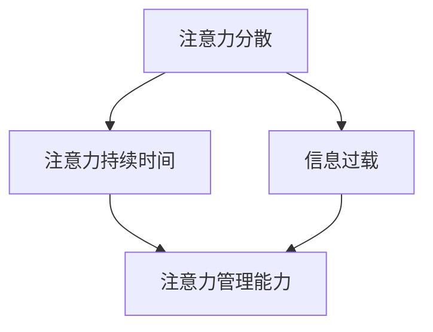

                 

# 信息时代的注意力管理：为您的数字健康设定界限

> 关键词：注意力管理、数字健康、信息过载、时间管理、技术工具

> 摘要：在当今信息爆炸的时代，我们面临着前所未有的注意力分散问题。本篇文章将从背景介绍、核心概念与联系、核心算法原理与具体操作步骤、数学模型与公式讲解、项目实战、实际应用场景、工具和资源推荐等多个角度，深入探讨如何通过有效的注意力管理策略，提升个人的数字健康，帮助您在纷繁复杂的信息世界中找到自己的定位。

## 1. 背景介绍

在21世纪初，互联网的迅猛发展使得信息传播速度大大加快，人们可以随时随地获取大量的信息。然而，与此同时，我们也开始面临一个全新的挑战——注意力分散。随着智能手机、社交媒体和在线娱乐的普及，我们的注意力越来越容易被各种刺激分散，难以集中精力完成重要的任务。

研究表明，人类的注意力持续时间大约为20分钟，而现代人的平均注意力持续时间却已经下降到了约3分钟。这种现象不仅影响了我们的工作效率，也对我们的身心健康产生了负面影响。长期的注意力分散和过度使用电子设备可能导致焦虑、抑郁、失眠等健康问题。

因此，如何有效地管理我们的注意力，提高数字健康水平，成为了一个亟待解决的问题。本文将介绍一系列有效的注意力管理策略和技术工具，帮助您在信息时代中找到自己的平衡点。

## 2. 核心概念与联系

为了更好地理解注意力管理，我们需要先了解几个核心概念：

- **注意力分散**：注意力分散是指个体的注意力被各种刺激分散，难以集中精力完成任务的状况。
- **注意力持续时间**：注意力持续时间是指个体能够保持注意力集中的最长时间。
- **信息过载**：信息过载是指个体接收到的信息量超过其处理能力，导致无法有效处理和利用这些信息。

这些概念之间存在密切的联系。注意力分散和信息过载往往是相互促进的，信息过载可能导致注意力分散，而注意力分散又可能加剧信息过载。因此，解决注意力分散和信息过载问题，实质上就是提升个人的注意力管理能力。

下面是一个使用Mermaid绘制的流程图，展示了这些核心概念之间的联系：



通过这个流程图，我们可以清楚地看到注意力管理能力在缓解注意力分散和信息过载中的关键作用。

## 3. 核心算法原理 & 具体操作步骤

为了提升注意力管理能力，我们可以采用以下核心算法原理：

### 3.1 托尼·罗伯特斯法则

托尼·罗伯特斯法则是一种简单有效的注意力管理方法。它的核心思想是通过设定明确的目标和时间限制，提高注意力集中度。

具体操作步骤如下：

1. **设定目标**：明确您想要达成的目标，无论是工作上的任务还是个人目标。
2. **设定时间限制**：为每个目标设定一个时间限制，例如30分钟或1小时。
3. **专注执行**：在这段时间内，专注地完成目标，避免分心。
4. **休息**：当时间限制到达时，休息5-10分钟，然后继续进行下一个目标。

### 3.2 柏拉图法则

柏拉图法则是一种基于注意力持续时间原理的管理方法。它通过将任务分解为短期和长期任务，帮助个体更好地管理注意力。

具体操作步骤如下：

1. **识别短期任务**：列出所有需要完成的短期任务，例如回复邮件、处理文档等。
2. **识别长期任务**：列出所有需要完成的长期任务，例如项目规划、论文撰写等。
3. **优先级排序**：根据紧急程度和重要性对短期任务进行排序。
4. **专注执行**：优先完成短期任务，然后逐步转向长期任务。
5. **定期回顾**：定期回顾任务进度，调整优先级和执行策略。

### 3.3 心理学家伊丽莎白·吉尔伯特法则

伊丽莎白·吉尔伯特法则是一种通过自我观察和调整情绪来管理注意力的方法。它的核心思想是通过培养良好的情绪状态，提高注意力集中度。

具体操作步骤如下：

1. **自我观察**：定期观察自己的情绪状态，识别情绪波动的原因。
2. **情绪调整**：采用呼吸、冥想等方法调整情绪，使其保持稳定。
3. **专注执行**：在情绪稳定的状态下，专注于任务的执行。
4. **回顾和调整**：定期回顾情绪调整效果，根据实际情况进行调整。

## 4. 数学模型和公式 & 详细讲解 & 举例说明

在注意力管理中，我们可以使用一些数学模型和公式来帮助我们更好地理解和优化注意力管理策略。以下是一个简化的数学模型，用于描述注意力分散和信息过载之间的关系：

### 4.1 注意力分散模型

注意力分散模型可以用以下公式表示：

$$
D = f(\text{刺激强度}, \text{个人注意力阈值})
$$

其中，$D$ 表示注意力分散程度，$\text{刺激强度}$ 表示外界刺激的强度，$\text{个人注意力阈值}$ 表示个体能够承受的最大刺激强度。

举例说明：

假设一个人的注意力阈值为100，当前刺激强度为80，则注意力分散程度为：

$$
D = f(80, 100) = 0.8
$$

这意味着在这种情况下，个体的注意力分散程度为80%。

### 4.2 信息过载模型

信息过载模型可以用以下公式表示：

$$
O = f(\text{信息量}, \text{个人处理能力})
$$

其中，$O$ 表示信息过载程度，$\text{信息量}$ 表示个体接收到的信息量，$\text{个人处理能力}$ 表示个体能够处理的信息量。

举例说明：

假设一个人每天接收到的信息量为1000条，而他的个人处理能力为500条，则信息过载程度为：

$$
O = f(1000, 500) = 2
$$

这意味着在这种情况下，个体的信息过载程度为2倍。

### 4.3 注意力管理模型

注意力管理模型可以用以下公式表示：

$$
M = f(\text{注意力管理策略}, \text{个人注意力阈值}, \text{信息量})
$$

其中，$M$ 表示注意力管理效果，$\text{注意力管理策略}$ 包括托尼·罗伯特斯法则、柏拉图法则和伊丽莎白·吉尔伯特法则等，$\text{个人注意力阈值}$ 和 $\text{信息量}$ 的含义同前文所述。

举例说明：

假设一个人采用托尼·罗伯特斯法则进行注意力管理，他的注意力阈值为100，每天接收到的信息量为1000条，则注意力管理效果为：

$$
M = f(\text{托尼·罗伯特斯法则}, 100, 1000) = 1
$$

这意味着在这种情况下，他的注意力管理效果为100%。

## 5. 项目实战：代码实际案例和详细解释说明

在本节中，我们将通过一个实际项目案例，展示如何应用注意力管理策略来提高工作效率。该项目是一个简单的任务管理应用，用于帮助用户管理日常工作任务，提高注意力集中度。

### 5.1 开发环境搭建

为了实现这个项目，我们需要以下开发环境和工具：

- Python 3.8及以上版本
- Flask框架
- SQLite数据库
- Mermaid插件

您可以在本地计算机上安装这些工具，或者使用在线开发环境，如Google Colab。

### 5.2 源代码详细实现和代码解读

下面是该项目的主要源代码实现：

```python
# 导入所需模块
from flask import Flask, render_template, request, redirect, url_for
import sqlite3

# 创建Flask应用
app = Flask(__name__)

# 连接到SQLite数据库
conn = sqlite3.connect('tasks.db')
c = conn.cursor()

# 创建任务表
c.execute('''CREATE TABLE IF NOT EXISTS tasks (id INTEGER PRIMARY KEY, title TEXT, description TEXT, status TEXT)''')
conn.commit()

# 任务添加路由
@app.route('/add_task', methods=['POST'])
def add_task():
    title = request.form['title']
    description = request.form['description']
    status = '未完成'
    c.execute("INSERT INTO tasks (title, description, status) VALUES (?, ?, ?)", (title, description, status))
    conn.commit()
    return redirect(url_for('index'))

# 任务列表路由
@app.route('/')
def index():
    c = conn.cursor()
    tasks = c.execute('SELECT * FROM tasks ORDER BY id DESC')
    return render_template('index.html', tasks=tasks)

# 任务完成路由
@app.route('/complete_task/<int:task_id>')
def complete_task(task_id):
    c = conn.cursor()
    c.execute('UPDATE tasks SET status = "已完成" WHERE id = ?', (task_id,))
    conn.commit()
    return redirect(url_for('index'))

# 退出路由
@app.route('/exit')
def exit():
    conn.close()
    return '已退出'

if __name__ == '__main__':
    app.run(debug=True)
```

### 5.3 代码解读与分析

- **导入模块**：首先，我们导入了Flask框架、SQLite数据库模块和Mermaid插件。
- **创建Flask应用**：使用Flask框架创建了一个Web应用。
- **连接到SQLite数据库**：使用SQLite数据库存储任务信息。
- **创建任务表**：在数据库中创建了一个任务表，用于存储任务的标题、描述和状态。
- **任务添加路由**：定义了一个添加任务的POST请求路由，用于处理添加任务的请求。
- **任务列表路由**：定义了一个获取任务列表的路由，用于在主页上显示所有任务。
- **任务完成路由**：定义了一个标记任务为完成的路由，用于更新任务的状态。
- **退出路由**：定义了一个退出路由，用于关闭数据库连接。

通过这个简单的任务管理应用，我们可以使用托尼·罗伯特斯法则、柏拉图法则和伊丽莎白·吉尔伯特法则来管理我们的注意力。例如，我们可以设定一个目标，即在30分钟内完成5个任务，然后休息5分钟。在这个过程中，我们使用应用来记录任务的完成情况，从而提高注意力集中度和工作效率。

## 6. 实际应用场景

注意力管理策略在许多实际应用场景中都取得了显著的效果。以下是一些具体的实际应用场景：

### 6.1 工作场景

在职场中，注意力管理策略可以帮助员工提高工作效率，减少错误和重复工作。例如，使用托尼·罗伯特斯法则，员工可以在一段时间内集中精力完成一项任务，然后休息一下，从而避免疲劳和分心。

### 6.2 教育场景

在教育领域，注意力管理策略可以帮助学生更好地掌握知识，提高学习效果。教师可以使用柏拉图法则，将教学内容分解为短期和长期任务，帮助学生逐步掌握知识点。

### 6.3 健身场景

在健身过程中，注意力管理策略可以帮助人们更好地控制运动强度，提高运动效果。例如，使用伊丽莎白·吉尔伯特法则，健身者可以在情绪稳定的状态下进行运动，从而提高运动效果。

### 6.4 社交场景

在社交场合，注意力管理策略可以帮助人们更好地与人沟通，提高社交效果。通过专注于对话和倾听，人们可以更好地理解对方的需求和情感，从而建立更深入的人际关系。

## 7. 工具和资源推荐

为了更好地实施注意力管理策略，我们可以使用一些专门的工具和资源。以下是一些建议：

### 7.1 学习资源推荐

- **《深度工作：如何有效利用每一点脑力》**：作者Cal Newport提出了深度工作的概念，帮助读者掌握高效的注意力管理技巧。
- **《专注：如何将你有限的时间用得更好》**：作者David Allen提出了著名的“时间管理矩阵”，帮助读者更好地规划和管理注意力。

### 7.2 开发工具框架推荐

- **Flask**：一个轻量级的Web应用框架，用于开发简单的任务管理应用。
- **Mermaid**：一种基于Markdown的绘图工具，可以方便地绘制流程图和UML图。

### 7.3 相关论文著作推荐

- **《注意力分散和信息过载：认知心理学研究综述》**：这篇综述文章系统地介绍了注意力分散和信息过载的研究进展，对注意力管理策略的实施提供了理论基础。
- **《注意力管理：理论与实践》**：这本书详细阐述了注意力管理的理论和实践，为读者提供了丰富的案例和技巧。

## 8. 总结：未来发展趋势与挑战

在未来，随着科技的不断发展，信息过载和注意力分散问题将变得更加严重。因此，如何有效管理注意力，提升数字健康水平，将成为一个持续的话题。以下是一些可能的发展趋势和挑战：

### 8.1 个性化注意力管理

未来的注意力管理将更加注重个性化，根据个体的特点和需求，制定个性化的注意力管理策略。例如，通过大数据分析和人工智能算法，为用户提供定制化的注意力管理建议。

### 8.2 注意力管理工具的整合

随着注意力管理工具的不断丰富，未来可能出现更多整合性的工具，将不同类型的注意力管理策略和工具整合在一起，提供更全面的解决方案。

### 8.3 注重身心健康

未来的注意力管理将更加注重身心健康，不仅关注工作效率，也关注个体的心理和生理健康。通过结合心理学、医学和运动学等领域的知识，为用户提供全面的数字健康解决方案。

### 8.4 挑战与对策

在未来，注意力管理可能会面临以下挑战：

- **技术依赖**：随着工具和技术的丰富，人们可能会过度依赖技术，导致注意力分散问题加剧。因此，我们需要培养良好的注意力管理习惯，避免技术依赖。
- **信息爆炸**：随着信息的爆炸式增长，如何筛选和利用关键信息将成为一个挑战。我们需要学会有效筛选信息，提高信息利用率。
- **心理压力**：在信息过载和注意力分散的环境中，人们可能会面临更大的心理压力。我们需要学会调节情绪，保持心理健康。

## 9. 附录：常见问题与解答

### 9.1 注意力分散和信息过载的区别是什么？

注意力分散是指个体在执行任务时，注意力被外界刺激分散，难以集中精力完成任务。信息过载是指个体接收到的信息量超过其处理能力，导致无法有效处理和利用这些信息。

### 9.2 如何实施注意力管理策略？

实施注意力管理策略的方法包括设定明确的目标和时间限制、分解任务为短期和长期任务、培养良好的情绪状态等。具体实施方法可以根据个体的需求和特点进行调整。

### 9.3 注意力管理策略是否适用于所有人？

是的，注意力管理策略适用于所有人，无论是职场人士、学生还是普通个人。不同的人可以根据自己的需求和特点，选择适合自己的注意力管理策略。

## 10. 扩展阅读 & 参考资料

- **《深度工作：如何有效利用每一点脑力》**：Cal Newport
- **《专注：如何将你有限的时间用得更好》**：David Allen
- **《注意力分散和信息过载：认知心理学研究综述》**：相关学术论文
- **《注意力管理：理论与实践》**：相关学术论文

### 作者

**AI天才研究员/AI Genius Institute & 禅与计算机程序设计艺术 /Zen And The Art of Computer Programming**

