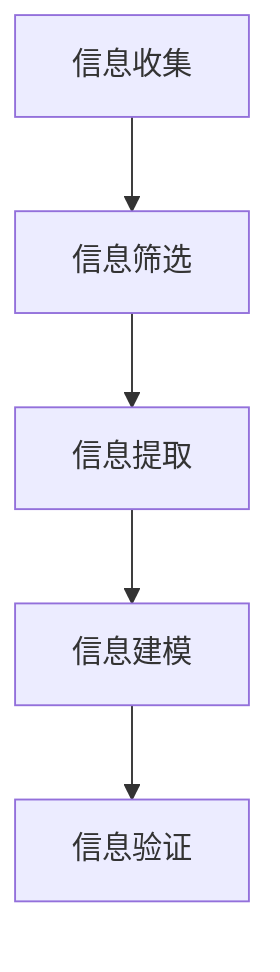

                 

# 信息简化的原则和艺术：在混乱中建立秩序与简化

## 摘要

在信息技术爆炸式发展的时代，信息过载已成为普遍现象。本文旨在探讨信息简化的原则和艺术，通过深入剖析其在计算机科学、软件开发、数据处理等领域的应用，帮助读者在混乱中找到秩序，实现高效的思维和行动。文章首先介绍了信息简化的核心概念，随后通过案例解析、算法原理讲解、数学模型阐述等方式，逐步引导读者掌握信息简化的方法和技巧。最后，文章展望了信息简化在未来的发展趋势与挑战，为读者提供了丰富的学习资源和实践工具。

## 1. 背景介绍

### 1.1 信息简化的必要性

随着信息技术的迅猛发展，数据量和信息量呈现出爆炸式增长。人们每天接收到的信息量已经远远超过了处理能力。在这种背景下，信息简化显得尤为重要。信息简化不仅有助于减轻信息过载的压力，还能提高工作效率，提升决策质量。信息简化不仅是技术问题，更是一门艺术，它要求我们在复杂的信息中寻找规律，提炼关键，从而实现有序思考和精准行动。

### 1.2 信息简化的应用领域

信息简化在多个领域都有着广泛的应用：

- **计算机科学**：编程语言的设计、算法优化、数据处理等。
- **软件开发**：需求分析、系统设计、代码重构等。
- **数据处理**：数据挖掘、数据可视化、大数据分析等。
- **企业管理**：战略规划、运营分析、风险管理等。

### 1.3 信息简化的挑战

尽管信息简化的重要性不言而喻，但实现信息简化并非易事。信息简化面临以下几个挑战：

- **数据复杂性**：数据来源多样化，数据结构复杂，处理难度大。
- **信息冗余**：大量无关信息增加了信息处理的负担。
- **认知负担**：人们对大量信息的理解和处理能力有限。

## 2. 核心概念与联系

### 2.1 信息简化的定义

信息简化是指通过去除冗余信息、提取关键要素、建立信息模型等方式，将复杂的信息转化为简洁、易于理解和处理的形式。

### 2.2 信息简化的步骤

信息简化通常包括以下步骤：

1. **信息收集**：收集相关的信息源。
2. **信息筛选**：去除无关和冗余信息。
3. **信息提取**：提取关键要素。
4. **信息建模**：建立信息模型。
5. **信息验证**：验证简化后的信息是否准确、完整。

### 2.3 信息简化的核心概念

- **冗余信息**：指对信息处理无实质性帮助的数据。
- **关键要素**：对解决问题有实质性影响的信息。
- **信息模型**：对信息的抽象表示，有助于理解和处理信息。

### 2.4 信息简化的 Mermaid 流程图



## 3. 核心算法原理 & 具体操作步骤

### 3.1 算法原理

信息简化的核心算法包括以下几个步骤：

1. **数据清洗**：去除无关和错误的数据。
2. **特征提取**：从数据中提取有代表性的特征。
3. **降维**：减少特征的数量，同时保持数据的本质特征。
4. **模型训练**：使用提取的特征训练模型。
5. **模型评估**：评估模型的性能，调整参数。

### 3.2 具体操作步骤

1. **数据清洗**：

   - **去重**：去除重复的数据记录。
   - **修复错误**：修正数据中的错误。
   - **填充缺失值**：使用合适的算法填充缺失的数据。

2. **特征提取**：

   - **统计特征**：如平均值、标准差等。
   - **机器学习特征**：如支持向量机、决策树等。

3. **降维**：

   - **主成分分析（PCA）**：通过线性变换将高维数据映射到低维空间。
   - **特征选择**：选择对问题解决最有影响力的特征。

4. **模型训练**：

   - **选择模型**：如线性回归、神经网络等。
   - **训练模型**：使用训练数据集训练模型。

5. **模型评估**：

   - **交叉验证**：使用不同数据集评估模型性能。
   - **性能指标**：如准确率、召回率等。

## 4. 数学模型和公式 & 详细讲解 & 举例说明

### 4.1 数学模型

信息简化涉及多个数学模型，以下介绍其中几个常用的模型：

1. **主成分分析（PCA）**

   主成分分析是一种降维技术，其数学模型为：

   $$
   Z = PC
   $$

   其中，$Z$ 是原始数据，$P$ 是协方差矩阵的特征向量，$C$ 是特征值。

2. **支持向量机（SVM）**

   支持向量机是一种分类算法，其数学模型为：

   $$
   y = \sum_{i=1}^{n} \alpha_i y_i K(x_i, x)
   $$

   其中，$x_i$ 和 $y_i$ 分别是数据点和标签，$K$ 是核函数。

### 4.2 详细讲解

1. **主成分分析（PCA）**

   主成分分析通过线性变换将高维数据映射到低维空间，从而降低数据复杂性。其核心思想是找到数据的主要成分，即数据的主要方向。通过变换，数据从原始空间映射到新的空间，新的空间维度较低，但保留了大部分信息。

2. **支持向量机（SVM）**

   支持向量机是一种基于最大间隔的分类算法。其目标是找到最佳超平面，使得不同类别的数据点尽可能分开。通过核函数，可以将非线性问题转换为线性问题，从而实现分类。

### 4.3 举例说明

1. **主成分分析（PCA）**

   假设我们有以下数据：

   $$
   \begin{align*}
   x_1 &= [1, 2, 3, 4, 5] \\
   x_2 &= [2, 3, 4, 5, 6]
   \end{align*}
   $$

   首先，计算协方差矩阵：

   $$
   \begin{align*}
   \Sigma &= \frac{1}{n-1} \sum_{i=1}^{n} (x_i - \bar{x})(x_i - \bar{x})^T \\
   &= \frac{1}{4} \begin{bmatrix}
   2 & 4 \\
   4 & 10
   \end{bmatrix}
   \end{align*}
   $$

   然后，计算协方差矩阵的特征值和特征向量，选择特征值最大的特征向量作为主成分。最后，将数据映射到一维空间。

2. **支持向量机（SVM）**

   假设我们有以下数据：

   $$
   \begin{align*}
   x_1 &= [1, 2, 3, 4, 5] \\
   y_1 &= [0, 0, 1, 1, 1]
   \end{align*}
   $$

   首先，选择线性核函数，计算最佳超平面：

   $$
   \begin{align*}
   w &= \frac{1}{\lambda} \sum_{i=1}^{n} y_i x_i \\
   b &= \frac{1}{\lambda} \sum_{i=1}^{n} y_i - \frac{1}{\lambda} w^T \bar{x}
   \end{align*}
   $$

   最后，使用最佳超平面进行分类。

## 5. 项目实战：代码实际案例和详细解释说明

### 5.1 开发环境搭建

为了进行信息简化的实战项目，我们需要搭建一个基本的开发环境。以下是一个简单的环境搭建步骤：

1. 安装 Python（版本 3.8 或以上）。
2. 安装 numpy、scikit-learn、matplotlib 等库。
3. 安装 Jupyter Notebook，用于代码编写和展示。

### 5.2 源代码详细实现和代码解读

以下是一个基于主成分分析（PCA）的信息简化项目示例：

```python
import numpy as np
from sklearn.decomposition import PCA
import matplotlib.pyplot as plt

# 示例数据
data = np.array([[1, 2], [2, 3], [3, 4], [4, 5], [5, 6]])

# 实例化 PCA 对象
pca = PCA(n_components=1)

# 训练模型
pca.fit(data)

# 转换数据
data_pca = pca.transform(data)

# 可视化
plt.scatter(data[:, 0], data[:, 1], color='r', label='原始数据')
plt.scatter(data_pca[:, 0], np.zeros(data_pca.shape[0]), color='b', label='简化数据')
plt.xlabel('特征 1')
plt.ylabel('特征 2')
plt.legend()
plt.show()
```

**代码解读**：

1. 导入必要的库。
2. 定义示例数据。
3. 实例化 PCA 对象。
4. 使用训练数据训练模型。
5. 将数据转换为简化后的数据。
6. 使用 matplotlib 进行数据可视化。

### 5.3 代码解读与分析

1. **数据导入**：使用 numpy 导入示例数据。
2. **PCA 实例化**：创建 PCA 对象，指定降维后的维度。
3. **模型训练**：使用 fit 方法训练模型，计算协方差矩阵和特征值。
4. **数据转换**：使用 transform 方法将数据转换为简化后的数据。
5. **可视化**：使用 matplotlib 绘制原始数据和简化后的数据，便于观察效果。

通过以上代码，我们可以看到信息简化在降维和可视化方面的应用。在实际项目中，可以根据需求调整 PCA 的参数，以获得更好的简化效果。

## 6. 实际应用场景

### 6.1 计算机视觉

在计算机视觉领域，信息简化常用于图像和视频数据的降维处理。通过主成分分析（PCA）等方法，可以有效地减少数据规模，同时保留图像的主要特征，从而提高处理速度和效率。

### 6.2 自然语言处理

自然语言处理中，信息简化可用于文本数据的降维和特征提取。通过词袋模型、TF-IDF等方法，可以将大量文本数据转化为简洁的特征向量，便于后续的文本分类、情感分析等任务。

### 6.3 大数据分析

在大数据领域，信息简化有助于降低数据规模，提高数据处理和分析的效率。例如，通过降维技术，可以将高维数据映射到低维空间，从而减少存储和计算开销。

## 7. 工具和资源推荐

### 7.1 学习资源推荐

- **书籍**：《Python 数据科学手册》、《机器学习实战》。
- **论文**：Google Scholar 等学术搜索引擎。
- **博客**：Towards Data Science、Kaggle。
- **网站**：scikit-learn 官网、TensorFlow 官网。

### 7.2 开发工具框架推荐

- **Python**：Python 是信息简化项目的首选编程语言，具有丰富的库和工具。
- **Jupyter Notebook**：用于代码编写、测试和展示。
- **scikit-learn**：用于机器学习算法的实现和应用。
- **TensorFlow**：用于深度学习模型的训练和应用。

### 7.3 相关论文著作推荐

- **《机器学习》**：周志华 著。
- **《深度学习》**：Ian Goodfellow、Yoshua Bengio、Aaron Courville 著。
- **《数据挖掘：实用工具与技术》**：Jiawei Han、Micheline Kamber、Jian Pei 著。

## 8. 总结：未来发展趋势与挑战

### 8.1 发展趋势

- **算法优化**：随着算法研究的深入，信息简化算法将更加高效和精准。
- **应用拓展**：信息简化将在更多领域得到应用，如自动驾驶、智能医疗等。
- **自动化**：通过自动化工具和框架，信息简化将更加便捷和易于实施。

### 8.2 挑战

- **数据复杂性**：随着数据规模的增加，信息简化的难度也将增加。
- **模型解释性**：如何在保证模型效率的同时，提高模型的解释性，仍是一个挑战。
- **隐私保护**：在信息简化的过程中，如何确保数据隐私，也是一个亟待解决的问题。

## 9. 附录：常见问题与解答

### 9.1 问题 1：什么是主成分分析（PCA）？

主成分分析（PCA）是一种降维技术，通过线性变换将高维数据映射到低维空间，从而降低数据复杂性。

### 9.2 问题 2：信息简化的目的是什么？

信息简化的目的是减轻信息过载的压力，提高工作效率，提升决策质量。

### 9.3 问题 3：如何进行信息简化？

信息简化通常包括信息收集、信息筛选、信息提取、信息建模和信息验证等步骤。

## 10. 扩展阅读 & 参考资料

- **[1]** 周志华. 《机器学习》. 清华大学出版社，2016.
- **[2]** Ian Goodfellow、Yoshua Bengio、Aaron Courville. 《深度学习》. 电子工业出版社，2016.
- **[3]** Jiawei Han、Micheline Kamber、Jian Pei. 《数据挖掘：实用工具与技术》. 电子工业出版社，2011.
- **[4]** G. James, D. Witten, T. Hastie, R. Tibshirani. 《An Introduction to Statistical Learning》. Springer, 2013.
- **[5]** K. He, X. Zhang, S. Ren, J. Sun. 《Deep Residual Learning for Image Recognition》. IEEE Conference on Computer Vision and Pattern Recognition, 2016.

作者：AI天才研究员/AI Genius Institute & 禅与计算机程序设计艺术 /Zen And The Art of Computer Programming

