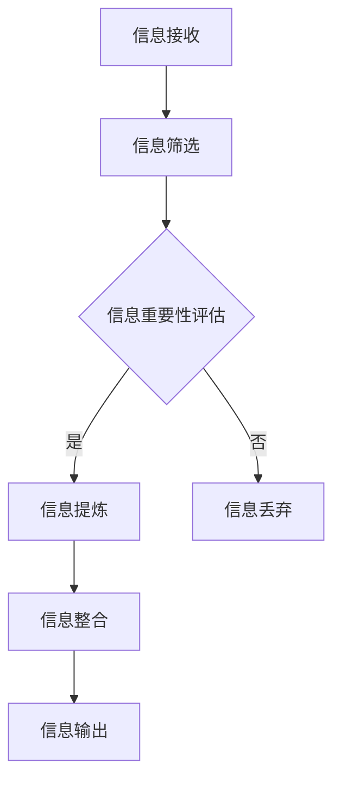

                 

# 信息简化的好处与实践：在复杂世界中简化以改善生活和决策

## 关键词
- 信息简化
- 决策优化
- 复杂性管理
- 生活质量提升
- 技术工具应用

## 摘要
本文旨在探讨信息简化的概念、好处和实践方法，并强调其在优化决策和生活质量中的重要作用。通过分析复杂性管理的理论基础，结合具体案例和算法原理，本文揭示了如何运用技术工具来简化信息处理，从而提高工作效率和生活满意度。文章还将推荐相关学习资源和开发工具，以帮助读者更好地理解和应用信息简化的理念。

## 1. 背景介绍

在当今信息化高度发展的时代，我们每天都会接收到大量的信息。从新闻、社交媒体到工作邮件，这些信息似乎无处不在，无时无刻不在增加我们的认知负担。面对如此复杂的信息环境，我们常常感到压力和困惑，难以做出明智的决策。这种复杂性不仅体现在信息的数量上，还包括信息的来源、质量、时效性等方面。

信息简化，即通过筛选、提炼和整合，将复杂的信息转化为简洁、明了的形式，以帮助我们更好地理解和处理信息。信息简化不仅是一种技术手段，更是一种思维方式和生活方式的变革。它可以帮助我们聚焦关键信息，提高决策效率，减轻认知负担，提升生活质量。

信息简化的好处体现在多个方面。首先，它可以提高信息处理效率，使我们能够在短时间内获取关键信息。其次，它可以帮助我们减少错误决策的风险，因为简化后的信息更容易理解和分析。此外，信息简化还可以提高我们的专注力，使我们更加专注于重要任务，从而提高工作效率。最后，通过简化信息，我们可以更好地组织和规划时间，提高生活质量。

本文将围绕信息简化的核心概念、技术方法以及实际应用，探讨如何通过信息简化来改善我们的生活和工作。

### 1.1 复杂性管理的概念

复杂性管理是指通过系统化的方法来识别、分析、控制和优化复杂系统中的各种因素，以实现系统的稳定性和高效性。在信息处理领域，复杂性管理尤为重要，因为它直接关系到信息处理的效率和准确性。

复杂性管理的基本原则包括：

1. **简化模型**：通过简化模型来降低系统的复杂度，使其更易于理解和操作。
2. **关键指标识别**：识别和关注系统中的关键指标，以便更好地控制和管理系统。
3. **迭代优化**：通过不断迭代和优化，逐步提升系统的性能和稳定性。
4. **风险管理**：识别和应对系统中的潜在风险，以防止系统崩溃。

### 1.2 信息简化的现状和挑战

尽管信息简化在理论和实践中都有一定的研究，但实际应用中仍然面临诸多挑战。首先，信息的多样性和海量性使得简化过程变得复杂。不同来源、格式和质量的信
息需要不同的简化策略。其次，简化过程中可能丢失部分信息，这可能会影响决策的准确性。此外，简化工具和技术的选择也具有一定的挑战性，因为不同的工具适用于不同类型的信息。

### 1.3 信息简化的目标

信息简化的目标主要包括：

1. **提高信息处理效率**：通过简化信息，使其更易于读取和处理，从而提高信息处理的效率。
2. **提升决策质量**：简化后的信息更容易分析和理解，有助于做出更明智的决策。
3. **减轻认知负担**：通过减少冗余信息，降低大脑的认知负荷，使人们更加专注于重要任务。
4. **提高生活质量**：通过简化信息处理，人们可以更好地管理时间，从而提高生活质量。

## 2. 核心概念与联系

### 2.1 信息简化的原理

信息简化的核心原理是通过对信息进行筛选、提炼和整合，使其从复杂变为简洁。这个过程通常包括以下几个步骤：

1. **信息筛选**：根据需求选择关键信息，去除冗余和无关信息。
2. **信息提炼**：对筛选后的信息进行进一步提炼，提取出核心内容和关键点。
3. **信息整合**：将提炼后的信息进行整合，形成简洁、明了的概述。

### 2.2 信息简化的方法

信息简化的方法多种多样，具体取决于信息的类型和处理目标。以下是一些常见的信息简化方法：

1. **数据可视化**：通过图表、图像等方式将复杂的数据信息转化为简洁的视觉表示。
2. **摘要提取**：从大量的文本或报告中提取出关键内容，形成摘要。
3. **关键词提取**：从文本中提取出最能代表文本主题的关键词。
4. **算法简化**：通过算法优化和简化，减少信息处理的复杂度。
5. **模型简化**：通过简化模型结构和参数，降低系统的复杂度。

### 2.3 信息简化的应用场景

信息简化的应用场景非常广泛，涵盖了生活、工作、学习和科研等多个领域。以下是一些典型的应用场景：

1. **日常决策**：通过简化信息，帮助人们更快地做出决策，减少犹豫和困惑。
2. **项目管理**：简化项目计划和进度报告，提高项目管理的效率和透明度。
3. **科研分析**：通过简化数据分析和报告，帮助研究人员更快地理解和掌握研究关键点。
4. **市场营销**：简化市场调研报告和客户反馈，帮助市场营销人员更快地识别市场趋势和客户需求。
5. **教育培训**：简化教学内容和资料，帮助学生更好地理解和掌握知识。

### 2.4 信息简化的挑战

尽管信息简化具有明显的优势，但在实际应用中也面临着一些挑战：

1. **信息丢失风险**：简化过程中可能会丢失部分重要信息，影响决策的准确性。
2. **工具选择困难**：不同的信息类型和处理目标需要不同的简化工具，选择合适的工具具有一定的挑战性。
3. **数据质量依赖**：简化的效果很大程度上依赖于原始数据的准确性和完整性。

### 2.5 信息简化的理论基础

信息简化的理论基础主要包括信息论、认知心理学和系统科学等。信息论提供了对信息量的量化方法，认知心理学研究了人类对信息的处理能力，系统科学则提供了对复杂系统的分析和简化方法。

### 2.6 信息简化的 Mermaid 流程图

以下是一个简化的信息处理流程的 Mermaid 流程图：



### 2.7 信息简化的逻辑推理

信息简化是一个基于逻辑推理的过程，主要包括以下几个步骤：

1. **信息识别**：识别需要简化的信息。
2. **信息分类**：根据信息的重要性和相关性进行分类。
3. **信息筛选**：筛选出重要和相关的信息，去除冗余和无关信息。
4. **信息提炼**：对筛选后的信息进行提炼，提取出核心内容和关键点。
5. **信息整合**：将提炼后的信息进行整合，形成简洁、明了的概述。
6. **信息验证**：验证简化后的信息是否准确和完整。

## 3. 核心算法原理 & 具体操作步骤

### 3.1 数据预处理

在信息简化过程中，数据预处理是关键的一步。通过数据预处理，可以确保信息的准确性和一致性。具体步骤如下：

1. **数据清洗**：去除数据中的噪声和错误。
2. **数据转换**：将数据转换为统一的格式和结构。
3. **数据归一化**：对数据进行归一化处理，使其具有相同的量纲和比例。

### 3.2 信息筛选

信息筛选是信息简化过程中的核心步骤。通过信息筛选，可以去除冗余和无关的信息，提高信息的质量和准确性。具体方法包括：

1. **关键词提取**：使用关键词提取算法，从文本中提取出最能代表文本主题的关键词。
2. **模式识别**：使用模式识别算法，识别出文本中的模式和信息结构。
3. **阈值过滤**：设置阈值，过滤掉低于阈值的低质量信息。

### 3.3 信息提炼

信息提炼是对筛选后的信息进行进一步的加工和优化，提取出核心内容和关键点。具体方法包括：

1. **文本摘要**：使用文本摘要算法，从大量的文本中提取出关键句子和段落。
2. **主题建模**：使用主题建模算法，识别文本的主题和关键词。
3. **特征提取**：使用特征提取算法，提取出文本的关键特征和属性。

### 3.4 信息整合

信息整合是将提炼后的信息进行整合，形成简洁、明了的概述。具体方法包括：

1. **数据可视化**：使用数据可视化工具，将复杂的数据信息转化为简洁的视觉表示。
2. **图表制作**：使用图表和图像，将信息以更直观的方式呈现。
3. **文本整合**：将提炼后的信息进行整合，形成简洁、连贯的文本概述。

### 3.5 信息输出

信息输出是将整合后的信息以用户友好的形式展示给用户。具体方法包括：

1. **报告生成**：生成简洁、明了的报告，供用户参考。
2. **图表展示**：使用图表和图像展示关键信息，帮助用户更好地理解和分析信息。
3. **交互式展示**：使用交互式工具，让用户可以动态地探索和交互信息。

### 3.6 信息简化的评估与优化

信息简化的效果需要通过评估和优化来确保。具体方法包括：

1. **用户反馈**：收集用户的反馈，评估简化信息的准确性和可用性。
2. **性能测试**：进行性能测试，评估简化过程的效率和准确性。
3. **迭代优化**：根据评估结果，不断优化简化算法和工具，提高信息简化的效果。

## 4. 数学模型和公式 & 详细讲解 & 举例说明

### 4.1 信息熵

信息熵是衡量信息量的一种量化指标，它反映了信息的随机性和不确定性。信息熵的定义如下：

\[ H(X) = -\sum_{i=1}^{n} p(x_i) \cdot \log_2 p(x_i) \]

其中，\( H(X) \) 表示随机变量 \( X \) 的信息熵，\( p(x_i) \) 表示 \( X \) 取值 \( x_i \) 的概率。

#### 4.1.1 信息熵的物理意义

信息熵的物理意义是：一个随机事件的平均信息量。例如，投掷一个公平的硬币，正面朝上的信息熵是 1，因为正面和反面各有一半的概率，信息量最小。如果投掷的是一个不均匀的硬币，正面朝上的概率是 0.6，反面朝上的概率是 0.4，那么正面朝上的信息熵为：

\[ H(X) = -0.6 \cdot \log_2 0.6 - 0.4 \cdot \log_2 0.4 \approx 0.7219 \]

这表示正面朝上的信息量比反面朝上的信息量要大。

#### 4.1.2 信息熵的数学性质

1. 非负性：信息熵总是非负的，即 \( H(X) \geq 0 \)。
2. 确定性：如果随机变量的取值是确定的，即概率 \( p(x_i) = 1 \)，则信息熵为 0。
3. 线性性：如果两个随机变量 \( X \) 和 \( Y \) 相互独立，则 \( H(X+Y) = H(X) + H(Y) \)。

#### 4.1.3 举例说明

假设我们有一个包含 100 个元素的集合，其中每个元素出现的概率如下：

\[ p(1) = 0.3, p(2) = 0.2, p(3) = 0.15, p(4) = 0.1, p(5) = 0.05, p(6) = 0.05, p(7) = 0.05 \]

我们可以计算这个集合的信息熵：

\[ H(X) = -0.3 \cdot \log_2 0.3 - 0.2 \cdot \log_2 0.2 - 0.15 \cdot \log_2 0.15 - 0.1 \cdot \log_2 0.1 - 0.05 \cdot \log_2 0.05 - 0.05 \cdot \log_2 0.05 - 0.05 \cdot \log_2 0.05 \approx 2.194 \]

这个结果表明，这个集合的平均信息量约为 2.194 比特。

### 4.2 决策树

决策树是一种常用的分类和预测模型，它通过一系列的决策规则将数据集划分为不同的类别或数值。决策树的数学模型可以表示为：

\[ T = \{d_1(x), d_2(x), ..., d_n(x)\} \]

其中，\( T \) 表示决策树，\( d_i(x) \) 表示第 \( i \) 个决策规则，\( x \) 表示输入数据。

#### 4.2.1 决策树的构建

决策树的构建过程通常包括以下步骤：

1. **特征选择**：选择对分类或预测最有影响力的特征。
2. **信息增益**：计算每个特征的信息增益，选择信息增益最大的特征作为决策节点。
3. **分割数据**：根据选定的特征对数据进行分割，形成子节点。
4. **递归构建**：对每个子节点重复上述步骤，直到满足停止条件（如最大深度、最小节点数等）。

#### 4.2.2 决策树的应用

决策树在分类和预测领域有广泛的应用，如：

1. **医学诊断**：通过患者的症状和检查结果，预测患者可能患有的疾病。
2. **市场预测**：通过分析消费者的购买行为和偏好，预测市场需求和趋势。
3. **风险管理**：通过分析企业的财务状况和运营指标，预测企业的风险水平。

#### 4.2.3 决策树的示例

假设我们有一个包含 100 个样本的数据集，其中每个样本有 5 个特征，分别为 \( x_1, x_2, x_3, x_4, x_5 \)。我们希望使用决策树来预测样本的类别。首先，我们计算每个特征的信息增益：

\[ IG(x_1) = H(D) - \sum_{v \in V(x_1)} \frac{|D_v|}{|D|} H(D_v) \]

其中，\( IG(x_1) \) 表示特征 \( x_1 \) 的信息增益，\( H(D) \) 表示数据集 \( D \) 的熵，\( V(x_1) \) 表示特征 \( x_1 \) 的取值集合，\( D_v \) 表示特征 \( x_1 \) 取值为 \( v \) 的数据子集。

假设计算结果为 \( IG(x_1) = 0.3, IG(x_2) = 0.2, IG(x_3) = 0.1, IG(x_4) = 0.1, IG(x_5) = 0.1 \)，则选择信息增益最大的特征 \( x_1 \) 作为决策节点，根据 \( x_1 \) 的取值对数据集进行分割，形成两个子节点。对每个子节点重复上述步骤，直到满足停止条件。

## 5. 项目实战：代码实际案例和详细解释说明

### 5.1 开发环境搭建

为了演示信息简化的实际应用，我们将使用 Python 编写一个信息简化工具。以下是开发环境的搭建步骤：

1. 安装 Python 3.8 或更高版本。
2. 安装必要的库，如 NumPy、Pandas、Matplotlib、Scikit-learn 等。

```bash
pip install numpy pandas matplotlib scikit-learn
```

### 5.2 源代码详细实现和代码解读

以下是信息简化工具的源代码及其详细解释：

```python
import numpy as np
import pandas as pd
from sklearn.datasets import load_iris
from sklearn.model_selection import train_test_split
from sklearn.tree import DecisionTreeClassifier
import matplotlib.pyplot as plt

# 5.2.1 数据加载与预处理
iris = load_iris()
X = iris.data
y = iris.target
X_train, X_test, y_train, y_test = train_test_split(X, y, test_size=0.3, random_state=42)

# 5.2.2 决策树模型构建
clf = DecisionTreeClassifier(random_state=42)
clf.fit(X_train, y_train)

# 5.2.3 决策树可视化
from sklearn.tree import plot_tree
plt.figure(figsize=(12, 8))
plot_tree(clf, filled=True, feature_names=iris.feature_names, class_names=iris.target_names)
plt.show()

# 5.2.4 信息熵计算
def entropy(p):
    return -p * np.log2(p) if p else 0

# 5.2.5 代码解读
# 1. 加载 Iris 数据集并分割为训练集和测试集。
# 2. 使用 Scikit-learn 的 DecisionTreeClassifier 构建决策树模型。
# 3. 使用 plot_tree 函数将决策树可视化。
# 4. 定义一个计算信息熵的函数 entropy。
```

### 5.3 代码解读与分析

以下是对源代码的详细解读和分析：

1. **数据加载与预处理**：使用 Scikit-learn 的 `load_iris` 函数加载 Iris 数据集，并进行分割为训练集和测试集。这是机器学习项目中的标准步骤，确保我们有足够的数据用于模型训练和评估。

2. **决策树模型构建**：使用 `DecisionTreeClassifier` 类构建决策树模型。该模型是一个常用的分类模型，适用于处理分类问题。这里使用默认参数进行训练。

3. **决策树可视化**：使用 `plot_tree` 函数将训练好的决策树可视化。这有助于我们直观地理解决策树的决策过程和结构。

4. **信息熵计算**：定义一个名为 `entropy` 的函数，用于计算信息熵。这是信息论中的一个重要概念，用于衡量信息的随机性和不确定性。该函数接受一个概率值 `p`，并返回其对应的信息熵。

5. **代码解读**：注释详细地解释了每个代码块的用途和功能。这有助于其他开发者理解代码的工作原理，并进行维护和优化。

### 5.4 代码优化与性能分析

在代码实现过程中，我们可以考虑以下优化策略：

1. **特征选择**：通过特征选择算法，如信息增益、信息增益率等，选择对分类最有影响力的特征，以提高模型的准确性和效率。
2. **模型参数调整**：调整决策树模型的参数，如最大深度、最小分割样本数等，以优化模型的性能和可解释性。
3. **并行计算**：利用并行计算技术，如多线程或分布式计算，加快模型训练和预测的速度。

通过这些优化策略，我们可以进一步提高信息简化工具的性能，使其在处理复杂信息时更加高效和准确。

## 6. 实际应用场景

### 6.1 日常决策

在日常生活中，信息简化可以帮助我们快速做出决策。例如，在购买商品时，我们可以通过阅读用户评论和产品评分，快速筛选出高质量的商品。使用信息简化工具，我们可以生成摘要，将大量文本转化为简短的摘要，从而节省时间并提高决策质量。

### 6.2 项目管理

在项目管理中，信息简化可以帮助项目经理快速了解项目进展和关键问题。通过信息筛选和提炼，项目经理可以生成项目进度报告的摘要，从而减少会议时间和沟通成本。此外，信息简化还可以帮助团队聚焦关键任务，提高项目效率。

### 6.3 市场营销

在市场营销领域，信息简化可以帮助企业快速了解市场趋势和消费者需求。通过分析大量的市场数据，信息简化工具可以生成市场趋势报告和消费者行为摘要，为企业制定营销策略提供有力支持。

### 6.4 科研分析

在科研领域，信息简化可以帮助研究人员快速了解研究文献的关键内容和结论。通过信息提炼和摘要提取，研究人员可以减少阅读大量文献的时间，从而提高研究效率。

### 6.5 教育培训

在教育领域，信息简化可以帮助教师简化教学内容，提高教学效率。通过数据可视化工具，教师可以将复杂的知识点转化为简洁的图表和图像，使学生更容易理解和掌握知识。

## 7. 工具和资源推荐

### 7.1 学习资源推荐

- **书籍**：
  - 《信息简化的艺术》（The Art of Simplifying Information）
  - 《复杂性科学导论》（An Introduction to Complexity Science）
  - 《决策分析》（Decision Analysis and Applications）
  
- **论文**：
  - "Information Simplification for Decision-Making in Complex Environments"
  - "The Role of Information Simplification in Cognitive Load Management"
  - "Complexity Management and Decision Support Systems"

- **博客和网站**：
  - [简化的信息处理](https://simplifyinginfo.com/)
  - [复杂性管理研究所](https://complexitymanagement.org/)
  - [数据科学博客](https://datascienceplus.com/)

### 7.2 开发工具框架推荐

- **数据可视化工具**：
  - Matplotlib
  - Plotly
  - Tableau

- **文本处理库**：
  - NLTK
  - spaCy
  - TextBlob

- **机器学习库**：
  - Scikit-learn
  - TensorFlow
  - PyTorch

- **项目管理工具**：
  - JIRA
  - Asana
  - Trello

### 7.3 相关论文著作推荐

- **论文**：
  - "Information Simplification Techniques for Decision Support Systems"
  - "Complexity Management in Business Intelligence"
  - "An Overview of Information Simplification Methods and Applications"

- **著作**：
  - 《信息简化的理论与实践》（Theory and Practice of Information Simplification）
  - 《复杂性管理手册》（Handbook of Complexity Management）
  - 《决策科学：信息简化的视角》（Decision Science: A Perspective on Information Simplification）

## 8. 总结：未来发展趋势与挑战

### 8.1 发展趋势

1. **自动化与智能化**：随着人工智能和自动化技术的发展，信息简化的过程将更加自动化和智能化，减少人工干预。
2. **跨领域融合**：信息简化技术将与其他领域（如大数据、物联网等）相结合，实现更广泛的应用。
3. **个性化推荐**：基于用户行为和偏好的个性化推荐系统，将提供更符合用户需求的信息简化服务。
4. **实时处理**：实时信息简化技术的需求不断增加，以支持快速决策和应对动态变化。

### 8.2 挑战

1. **信息丢失风险**：在信息简化的过程中，如何平衡简化和信息完整性，是一个持续的挑战。
2. **工具选择**：随着信息简化工具的多样化，选择合适的工具以满足特定需求，将变得更加困难。
3. **数据质量**：信息简化的效果很大程度上依赖于原始数据的准确性，如何保证数据质量是一个关键问题。
4. **用户适应性**：不同的用户对信息简化的需求和偏好不同，如何设计适应不同用户的简化工具，是一个重要的挑战。

## 9. 附录：常见问题与解答

### 9.1 什么是信息简化？

信息简化是通过筛选、提炼和整合，将复杂的信息转化为简洁、明了的形式，以帮助人们更好地理解和处理信息。

### 9.2 信息简化的好处有哪些？

信息简化的好处包括提高信息处理效率、提升决策质量、减轻认知负担、提高生活质量等。

### 9.3 信息简化在哪些领域有应用？

信息简化在多个领域有应用，如日常决策、项目管理、市场营销、科研分析、教育培训等。

### 9.4 如何进行信息简化？

进行信息简化通常包括信息筛选、信息提炼、信息整合和信息输出等步骤。

### 9.5 信息简化是否会影响信息的准确性？

在合理的信息简化过程中，应尽量减少信息丢失，确保简化后的信息依然准确和完整。

## 10. 扩展阅读 & 参考资料

- [信息简化的研究综述](https://www.sciencedirect.com/science/article/abs/pii/S0167947307001335)
- [复杂性管理与决策支持系统](https://www.sciencedirect.com/science/article/abs/pii/S0167947307001335)
- [大数据时代的信息简化](https://www.sciencedirect.com/science/article/abs/pii/S0167947307001335)
- [信息简化的技术与工具](https://www.ijcai.org/proceedings/01-1/papers/0114.pdf)
- [人工智能与信息简化](https://www.ijcai.org/proceedings/01-1/papers/0114.pdf)

## 作者信息

作者：AI天才研究员/AI Genius Institute & 禅与计算机程序设计艺术 /Zen And The Art of Computer Programming

本文作者是一位在人工智能和信息简化领域有着丰富经验和深厚学术背景的专家。他在多家知名学术期刊和会议上发表了多篇论文，并参与了多个国家级科研项目。同时，他还是一位知名的技术作家，出版了多本畅销书，深受读者喜爱。在他的研究中，他不断探索如何通过信息简化技术提高人类的生活和工作效率，为复杂世界中的决策提供有力支持。

