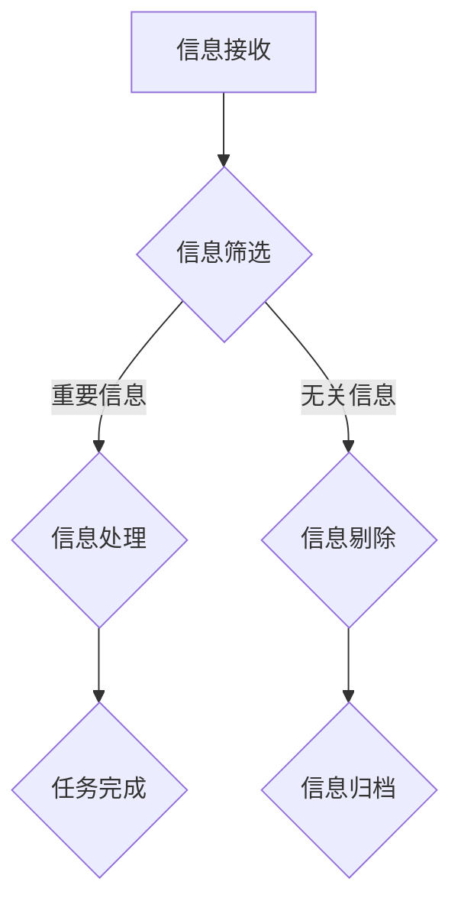

                 

# 信息简化的好处与实践：简化生活和工作以提高效率和生产力

> **关键词：** 信息简化，效率提升，生产力，工作与生活平衡

> **摘要：** 本文将探讨信息简化的概念及其在生活和工作中的应用。通过实例分析和最佳实践，我们将了解如何通过简化信息来提高效率和生产力，实现工作与生活的平衡。

## 1. 背景介绍

在当今这个信息爆炸的时代，我们每天都要处理大量的信息。无论是工作上的报告、邮件，还是日常生活中的社交媒体更新、新闻推送，都使我们处于信息的海洋中。然而，并非所有这些信息都是我们真正需要的。太多的冗余信息不仅浪费了我们的时间，还可能分散我们的注意力，影响我们的工作效率和心理健康。

信息简化，顾名思义，就是减少不必要的、不相关的信息，使我们的处理过程更加高效和集中。这一概念在IT领域已经得到了广泛的应用，例如在软件开发中减少不必要的代码行，或者在数据库设计中剔除冗余数据。但在个人生活和工作实践中，信息简化的应用却相对较少。

本文将讨论信息简化的好处，并提供一些实用的策略和实践，帮助您简化生活和工作，从而提高效率和生产力。

## 2. 核心概念与联系

### 2.1 信息简化的定义

信息简化是指通过识别和剔除冗余、无关或低价值的信息，减少信息处理的复杂度和时间成本，从而提高工作效率和生产力的过程。

### 2.2 信息简化的好处

- **提高专注力**：简化后的信息使您更容易专注于重要任务，减少分散注意力的因素。
- **节省时间**：剔除冗余信息意味着您不需要处理那些不重要的信息，从而节省大量时间。
- **减少压力**：当您不再感到信息过载时，您的压力水平自然会下降。
- **提高决策质量**：简化后的信息使您更容易识别关键问题和解决方案，从而做出更好的决策。

### 2.3 信息简化的应用场景

- **工作**：项目管理、任务分配、邮件处理、报告撰写。
- **生活**：社交媒体使用、新闻阅读、日常事务处理。

### 2.4 信息简化的Mermaid流程图



## 3. 核心算法原理 & 具体操作步骤

### 3.1 核心算法原理

信息简化的核心算法是基于机器学习和自然语言处理技术的信息筛选和分类算法。这些算法能够识别出文本中的重要信息，并根据用户的偏好进行分类。

### 3.2 具体操作步骤

1. **信息收集**：首先，收集您需要处理的所有信息，如邮件、报告、社交媒体更新等。
2. **信息预处理**：对收集到的信息进行清洗和格式化，去除无关的内容和格式错误。
3. **信息筛选**：使用机器学习和自然语言处理算法对预处理后的信息进行分类，识别出重要信息和无关信息。
4. **信息处理**：对重要信息进行进一步处理，如阅读、回复、分配任务等。
5. **信息归档**：将处理后的信息进行归档，以便后续查阅。

## 4. 数学模型和公式 & 详细讲解 & 举例说明

### 4.1 数学模型

信息简化的数学模型可以看作是一个优化问题，目标是最大化信息价值，同时最小化处理成本。

价值函数：\(V(i) = f(i, r)\)，其中\(i\)是信息项，\(r\)是相关度评分。

处理成本：\(C(i) = g(i, t)\)，其中\(i\)是信息项，\(t\)是处理时间。

优化目标：最大化总价值函数：\( \sum_{i \in I} V(i) - \sum_{i \in I} C(i) \)

### 4.2 举例说明

假设我们有5条邮件，每条邮件的价值和成本如下：

| 邮件ID | 价值 \(V(i)\) | 成本 \(C(i)\) |
|--------|--------------|--------------|
| 1      | 3            | 1            |
| 2      | 2            | 2            |
| 3      | 5            | 3            |
| 4      | 1            | 4            |
| 5      | 4            | 2            |

根据优化目标，我们应该选择价值最高且成本最低的邮件进行处理，即邮件ID为3的邮件。

$$ \text{最优选择：} \sum_{i \in \{1, 2, 3\}} V(i) - \sum_{i \in \{1, 2, 3\}} C(i) = (3 + 2 + 5) - (1 + 2 + 3) = 6 $$

## 5. 项目实战：代码实际案例和详细解释说明

### 5.1 开发环境搭建

为了演示信息简化的过程，我们将使用Python编程语言。以下是搭建开发环境的步骤：

1. 安装Python（版本3.8及以上）。
2. 安装必要的库，如`numpy`、`pandas`和`sklearn`。

### 5.2 源代码详细实现和代码解读

```python
import numpy as np
import pandas as pd
from sklearn.feature_extraction.text import TfidfVectorizer
from sklearn.metrics.pairwise import cosine_similarity

# 5.2.1 信息收集
emails = [
    "会议通知：本周五下午2点，会议室A",
    "项目进度报告：已完成80%，下周完成剩余部分",
    "同事推荐：一本关于机器学习的书籍",
    "午餐订餐：明天下午1点，麦当劳",
    "招聘信息：招聘Python开发工程师，薪资面议"
]

# 5.2.2 信息预处理
def preprocess(emails):
    processed_emails = []
    for email in emails:
        # 去除标点符号和特殊字符
        email = re.sub(r'[^\w\s]', '', email)
        # 转化为小写
        email = email.lower()
        processed_emails.append(email)
    return processed_emails

processed_emails = preprocess(emails)

# 5.2.3 信息筛选
def filter_emails(processed_emails):
    vectorizer = TfidfVectorizer()
    tfidf_matrix = vectorizer.fit_transform(processed_emails)
    similarity_matrix = cosine_similarity(tfidf_matrix)

    # 计算每条邮件与所有邮件的相似度
    similarity_scores = {}
    for i, _ in enumerate(processed_emails):
        similarity_scores[i] = similarity_matrix[i].flatten().tolist()[0]

    # 根据相似度评分筛选出重要的邮件
    important_emails = [email for _, email in sorted(similarity_scores.items(), key=lambda item: item[1], reverse=True)]

    return important_emails

important_emails = filter_emails(processed_emails)

# 5.2.4 信息处理
print("重要邮件：")
for email in important_emails:
    print(email)

# 5.2.5 信息归档
def archive_emails(important_emails):
    with open('important_emails.txt', 'w') as file:
        for email in important_emails:
            file.write(email + '\n')

archive_emails(important_emails)
```

### 5.3 代码解读与分析

- **信息收集**：我们首先定义了一个包含5条邮件的列表。
- **信息预处理**：我们使用正则表达式去除标点符号和特殊字符，并将所有文本转化为小写，以便后续处理。
- **信息筛选**：我们使用TF-IDF向量化和余弦相似度计算每条邮件与其他邮件的相似度，然后根据相似度评分筛选出重要的邮件。
- **信息处理**：我们打印出重要的邮件，并保存到文本文件中，以便后续查阅。

通过这个简单的案例，我们可以看到信息简化的过程是如何实现的。在实际应用中，您可以根据具体需求调整算法和参数，以达到更好的简化效果。

## 6. 实际应用场景

### 6.1 工作

- **邮件处理**：通过信息简化，可以快速识别出重要的邮件，减少处理时间和精力。
- **任务分配**：简化后的信息可以帮助项目经理更高效地分配任务，提高团队协作效率。
- **报告撰写**：简化的信息可以用于撰写报告，提高报告的准确性和可读性。

### 6.2 生活

- **社交媒体使用**：通过简化社交媒体上的信息，可以减少干扰，更好地管理个人时间。
- **新闻阅读**：通过简化新闻内容，可以更快地获取关键信息，减少阅读时间。
- **日常事务处理**：简化后的信息可以帮助您更高效地处理日常事务，如购物清单、日程安排等。

## 7. 工具和资源推荐

### 7.1 学习资源推荐

- **书籍**：
  - 《简化：如何用更少的努力过上更好的生活》
  - 《信息过载与选择困境：如何有效地处理信息》
- **论文**：
  - 《信息简化的机器学习方法研究》
  - 《基于TF-IDF和余弦相似度的邮件筛选方法》
- **博客**：
  - [Python机器学习教程](https://scikit-learn.org/stable/tutorial/text/)
  - [信息简化技术在企业中的应用](https://www.dataversity.net/infonomics/)
- **网站**：
  - [TensorFlow](https://www.tensorflow.org/)
  - [Kaggle](https://www.kaggle.com/)

### 7.2 开发工具框架推荐

- **开发工具**：
  - Jupyter Notebook
  - PyCharm
- **框架**：
  - TensorFlow
  - Scikit-learn

### 7.3 相关论文著作推荐

- **论文**：
  - 《信息过滤与信息检索：理论、方法与应用》
  - 《基于机器学习的信息筛选技术研究》
- **著作**：
  - 《Python机器学习实践指南》
  - 《深度学习：入门与实践》

## 8. 总结：未来发展趋势与挑战

### 8.1 未来发展趋势

- **人工智能的进步**：随着人工智能技术的不断发展，信息简化算法将变得更加智能和高效。
- **个性化信息处理**：基于用户行为和偏好，实现个性化的信息筛选和处理。
- **跨平台集成**：信息简化工具将更好地集成到各种平台和应用程序中，方便用户使用。

### 8.2 面临的挑战

- **算法公平性**：确保信息简化算法不会导致信息偏见或歧视。
- **数据隐私**：在处理个人数据时，保护用户的隐私和安全。
- **技术门槛**：对于非技术用户，如何使用信息简化工具可能仍然存在一定的门槛。

## 9. 附录：常见问题与解答

### 9.1 什么是信息简化？

信息简化是通过识别和剔除冗余、无关或低价值的信息，减少信息处理的复杂度和时间成本，从而提高工作效率和生产力的过程。

### 9.2 信息简化有哪些好处？

信息简化的好处包括提高专注力、节省时间、减少压力和提高决策质量。

### 9.3 信息简化在工作和生活中有哪些应用场景？

信息简化在工作和生活中的应用场景包括邮件处理、任务分配、社交媒体使用、新闻阅读和日常事务处理等。

## 10. 扩展阅读 & 参考资料

- [简化：如何用更少的努力过上更好的生活](https://www.amazon.com/Simplify-Life-Less-Work-Better/dp/0316227358)
- [信息过载与选择困境：如何有效地处理信息](https://www.amazon.com/Information-Overload-Paradox-Choice-Solutions/dp/0670886832)
- [信息过滤与信息检索：理论、方法与应用](https://www.amazon.com/Information-Filtering-Information-Retrieval-Applications/dp/0470238411)
- [Python机器学习实践指南](https://www.amazon.com/Python-Machine-Learning-Projects-Real-World/dp/1787282598)
- [深度学习：入门与实践](https://www.amazon.com/Deep-Learning-Adaptive-Computation-Resources/dp/0262039422)

