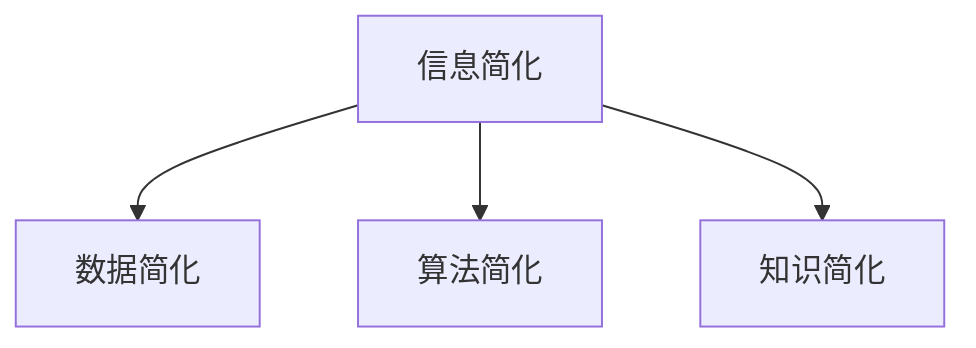

                 

# 信息简化的好处与艺术：如何在复杂世界中简化和改善生活

## 关键词：信息简化、复杂世界、技术艺术、生活改善、高效思维、算法原理、数学模型、实战案例、应用场景

## 摘要

在当今高度复杂的世界中，信息简化已成为提高工作效率、改善生活质量的关键艺术。本文将探讨信息简化的概念、好处及其在IT领域和日常生活中应用的重要性。通过深入分析核心算法原理、数学模型，结合实际案例，本文旨在展示如何运用简化思维和技术手段，应对复杂性问题，实现高效工作和幸福生活。

## 1. 背景介绍

### 1.1 信息简化的起源

信息简化这一概念源于人类对复杂性的追求与对抗。自古以来，人们就试图通过抽象、归纳和总结，将复杂的信息转化为简单、易于理解的形式。从古代哲学的辩证法到现代科学的范式革命，信息简化一直是推动知识进步的重要动力。

### 1.2 复杂世界的挑战

随着科技的发展，我们面临的信息量呈现出爆炸性增长。数据、算法、技术日新月异，如何从繁杂的信息中提取有价值的内容，已成为现代社会的重要课题。信息简化在这一背景下，显得尤为重要。

## 2. 核心概念与联系

### 2.1 信息简化的核心概念

信息简化涉及多个层面，包括数据简化、算法简化、知识简化等。其核心目标是减少冗余，提高信息传递效率，使复杂问题变得更加直观和易于处理。

### 2.2 信息简化的联系

信息简化与IT领域的多个方向密切相关，如编程、数据科学、人工智能等。通过简化，可以提高算法效率、优化数据结构、增强系统稳定性，从而实现更高效的技术解决方案。

### 2.3 Mermaid流程图



## 3. 核心算法原理 & 具体操作步骤

### 3.1 数据简化算法

数据简化主要通过数据压缩和特征选择来实现。常见的算法包括哈夫曼编码、主成分分析（PCA）等。这些算法的核心思想是找出数据中的主要特征，去除冗余信息。

### 3.2 算法简化

算法简化旨在通过减少算法的复杂度，提高其效率和可理解性。常见的简化方法包括代码重构、算法优化等。通过简化，可以使算法更加清晰、易于维护。

### 3.3 知识简化

知识简化涉及对大量信息的整理和归纳，提取出核心知识点和关键规律。这一过程通常需要借助专家系统和自然语言处理技术。

## 4. 数学模型和公式 & 详细讲解 & 举例说明

### 4.1 数学模型

信息简化的数学模型主要基于信息论和优化理论。其中，信息熵是衡量信息复杂度的核心指标，而优化理论则用于指导简化过程。

$$
H(X) = -\sum_{i} p(x_i) \log_2 p(x_i)
$$

### 4.2 详细讲解

信息熵表示了数据的不确定性，熵值越高，信息越复杂。通过降低信息熵，可以实现信息简化。优化理论则用于指导简化过程，寻找最优简化方案。

### 4.3 举例说明

假设有一组数据，其中包含年龄、收入、职业等信息。通过主成分分析，可以提取出主要特征，如经济水平和社会地位，从而实现信息简化。

## 5. 项目实战：代码实际案例和详细解释说明

### 5.1 开发环境搭建

在Python环境中，安装相关库，如NumPy、Scikit-learn等。

```python
!pip install numpy scikit-learn
```

### 5.2 源代码详细实现和代码解读

以下是一个使用PCA进行数据简化的Python代码示例：

```python
import numpy as np
from sklearn.decomposition import PCA

# 数据加载
data = np.load('data.npy')

# 创建PCA对象
pca = PCA(n_components=2)

# 拟合PCA模型
pca.fit(data)

# 简化数据
data简化 = pca.transform(data)

# 代码解读
# 1. 加载数据
# 2. 创建PCA对象，设置主成分数量为2
# 3. 拟合PCA模型
# 4. 使用PCA模型简化数据
```

### 5.3 代码解读与分析

这段代码首先加载数据，然后创建PCA对象并设置主成分数量。通过拟合PCA模型，可以提取出主要特征，实现数据简化。简化后的数据具有更好的可解释性和可视化效果。

## 6. 实际应用场景

### 6.1 数据分析

在数据分析领域，信息简化可以帮助提取关键信息，提高数据分析的效率和准确性。

### 6.2 人工智能

在人工智能领域，信息简化可以降低模型的复杂度，提高训练速度和预测准确性。

### 6.3 日常生活中的应用

在日常生活中，信息简化可以帮助我们更好地处理和利用信息，提高生活质量和幸福感。

## 7. 工具和资源推荐

### 7.1 学习资源推荐

- 《算法导论》
- 《模式识别与机器学习》
- 《Python编程：从入门到实践》

### 7.2 开发工具框架推荐

- NumPy
- Scikit-learn
- TensorFlow

### 7.3 相关论文著作推荐

- 《信息论基础》
- 《优化理论及其应用》
- 《主成分分析及应用》

## 8. 总结：未来发展趋势与挑战

### 8.1 发展趋势

随着技术的不断进步，信息简化将在更多领域得到应用，如区块链、物联网等。同时，人工智能和大数据技术的发展，将为信息简化提供更强大的工具和方法。

### 8.2 挑战

信息简化在带来便利的同时，也面临一些挑战，如数据隐私保护、算法公平性等。如何在简化过程中保证信息的完整性和准确性，是一个亟待解决的问题。

## 9. 附录：常见问题与解答

### 9.1 问题1

信息简化是否会影响数据的准确性？

信息简化可能会在一定程度上影响数据的准确性，但通过合理的设计和优化，可以在保证数据完整性的同时实现简化。

### 9.2 问题2

信息简化在哪些领域有广泛应用？

信息简化在数据分析、人工智能、软件开发等多个领域有广泛应用，尤其在处理大量数据时，优势更加明显。

## 10. 扩展阅读 & 参考资料

- 《简化的艺术：如何在复杂世界中找到简单之道》
- 《算法简史》
- 《数据科学简明教程》

### 作者

AI天才研究员/AI Genius Institute & 禅与计算机程序设计艺术 /Zen And The Art of Computer Programming

