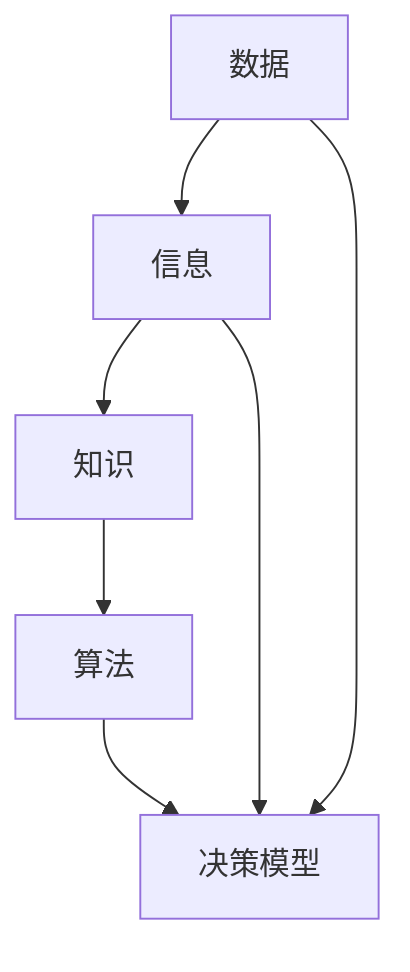

                 

### 文章标题

**信息简化的好处：如何在复杂中做出更好的决策**

### 关键词

- 信息简化
- 决策优化
- 复杂系统
- 数据分析
- 算法
- 数学模型

### 摘要

本文旨在探讨信息简化在复杂决策中的作用，通过引入和解释相关核心概念、算法原理以及数学模型，展示如何有效地利用简化信息来优化决策过程。文章通过实际项目实战和多种应用场景的分析，进一步强调了信息简化的实际价值。最后，文章提出了未来发展趋势和挑战，并提供了一系列学习资源和开发工具，以期为读者提供全面的指导。

### 1. 背景介绍

在当今世界，信息过载已成为一个普遍存在的问题。无论是个人还是企业，我们每天都要面对海量的数据和信息。这些信息有些是必要的，但大多数情况下，它们往往包含大量的冗余和无用信息。面对如此复杂的信息环境，如何有效地处理和利用这些信息，成为一个亟待解决的问题。

在IT领域，信息简化作为一种应对信息过载的方法，已被广泛应用。信息简化的核心思想是通过去除冗余、无关的信息，提取关键数据，从而降低系统的复杂度，提高决策效率。这种简化不仅适用于数据分析、算法设计，也广泛应用于人工智能、机器学习等多个领域。

然而，尽管信息简化的重要性日益凸显，但许多人对其理解仍存在误区。有些人认为，简化信息意味着减少数据量，这种做法可能会导致重要信息的丢失。而事实上，信息简化并非简单地删除数据，而是通过深入理解数据背后的本质和规律，提取有用信息，从而提高决策的准确性和效率。

本文将深入探讨信息简化的好处，分析其核心概念和算法原理，并通过实际案例展示其在不同领域的应用。此外，文章还将探讨信息简化所面临的挑战，以及未来的发展趋势。希望通过本文的讨论，能够帮助读者更好地理解信息简化的重要性，并掌握相关的方法和技巧。

### 2. 核心概念与联系

在深入探讨信息简化的好处之前，我们需要明确几个核心概念，并了解它们之间的联系。这些概念包括数据、信息、知识、算法以及决策模型。

#### 2.1 数据

数据是信息的基础，它是客观存在的、可量化的、能够通过某种方式记录和传输的符号。数据可以是结构化的，如表格、数据库，也可以是非结构化的，如图像、音频、视频等。数据的类型多种多样，包括数字、文本、图像、音频、视频等。

#### 2.2 信息

信息是通过对数据进行处理、分析和解释后得到的知识。它是有意义的、可以用于决策或理解的符号。信息能够帮助人们理解世界，作出更明智的决策。信息的价值取决于其与决策的相关性、准确性和时效性。

#### 2.3 知识

知识是对信息的进一步提炼和总结，它是通过学习、实践和反思得到的系统化的理解。知识可以指导我们的决策和行为，帮助我们在复杂的环境中找到解决方案。

#### 2.4 算法

算法是一种用于解决问题或执行特定任务的系统化步骤。它是信息处理的核心，通过算法，我们可以从大量数据中提取有用信息，并进行处理和分析。常见的算法包括排序算法、搜索算法、分类算法等。

#### 2.5 决策模型

决策模型是一种用于模拟决策过程和预测决策结果的数学模型。通过决策模型，我们可以根据不同情境选择最优策略，从而优化决策效果。常见的决策模型包括线性规划、决策树、神经网络等。

#### 2.6 核心概念之间的联系

数据、信息、知识、算法和决策模型之间存在着密切的联系。数据是信息的来源，信息是知识的基础，知识是算法的指导，算法是决策模型的实现。这些核心概念共同构成了信息简化的基础。

通过了解这些核心概念，我们可以更深入地理解信息简化的本质。信息简化并不是简单地删除数据，而是在保证信息准确性和完整性的前提下，去除冗余和无用信息，提取关键数据，从而提高决策效率。这一过程需要依赖算法和决策模型的支持，同时也需要我们对数据和信息有深刻的理解。

下面，我们将通过一个Mermaid流程图，展示这些核心概念之间的联系。



在图中，数据经过处理和分析，转化为信息；信息进一步提炼和总结，形成知识；知识指导算法的运用，算法实现决策模型；最后，决策模型帮助我们做出更优的决策。这一流程体现了信息简化的核心思想。

### 3. 核心算法原理 & 具体操作步骤

信息简化过程的核心在于选择合适的算法来处理和提取数据。以下是一些常用的核心算法原理和具体操作步骤：

#### 3.1 数据预处理

数据预处理是信息简化的重要步骤，它包括数据清洗、数据转换和数据集成等。

- **数据清洗**：去除数据中的错误、异常和重复记录，确保数据的质量。
- **数据转换**：将不同类型的数据转换为统一格式，便于后续处理。
- **数据集成**：将多个来源的数据合并，形成一个完整的数据集。

具体步骤如下：

1. **数据清洗**：使用Python的`pandas`库，删除重复记录和错误数据。
2. **数据转换**：使用`pandas`库中的`astype()`方法，将数据类型转换为适当的格式。
3. **数据集成**：使用`pandas`库中的`merge()`方法，将多个数据表合并。

#### 3.2 特征选择

特征选择是从大量特征中选出对目标变量最有影响力的特征，以简化模型复杂度。

- **相关性分析**：使用`pandas`库中的`corr()`方法，计算特征之间的相关性。
- **特征重要性评估**：使用随机森林算法，评估每个特征的重要性。
- **特征选择方法**：使用递归特征消除（RFE）等方法，选择重要特征。

具体步骤如下：

1. **相关性分析**：计算特征之间的相关性，筛选出相关性较高的特征。
2. **特征重要性评估**：使用随机森林算法，评估每个特征的重要性。
3. **特征选择**：使用RFE方法，选择重要特征。

#### 3.3 数据降维

数据降维是通过减少数据维度来简化数据集，常用的方法有主成分分析（PCA）和t-SNE等。

- **主成分分析（PCA）**：通过正交变换，将数据投影到新的坐标系中，提取主要成分。
- **t-SNE**：通过非线性映射，将高维数据投影到二维或三维空间中。

具体步骤如下：

1. **PCA降维**：使用`sklearn`库中的`PCA`类，对数据集进行降维。
2. **t-SNE降维**：使用`sklearn`库中的`t-SNE`类，对数据集进行降维。

#### 3.4 算法选择

选择合适的算法对数据集进行建模，常用的算法有线性回归、决策树、支持向量机等。

- **线性回归**：用于预测连续变量。
- **决策树**：用于分类和回归。
- **支持向量机（SVM）**：用于分类和回归。

具体步骤如下：

1. **选择算法**：根据问题类型选择合适的算法。
2. **训练模型**：使用训练数据集训练模型。
3. **评估模型**：使用测试数据集评估模型性能。

通过上述步骤，我们可以有效地简化数据，提取关键信息，为决策提供支持。

### 4. 数学模型和公式 & 详细讲解 & 举例说明

在信息简化过程中，数学模型和公式起着至关重要的作用。以下将详细讲解几个常用的数学模型和公式，并通过实际例子进行说明。

#### 4.1 主成分分析（PCA）

主成分分析（PCA）是一种常用的降维方法，它通过正交变换，将数据投影到新的坐标系中，提取主要成分。

- **公式**：

  $$X_{new} = PC_1 * \sigma_1 + PC_2 * \sigma_2 + ... + PC_p * \sigma_p$$

  其中，$X_{new}$表示降维后的数据，$PC_i$表示第$i$个主成分，$\sigma_i$表示对应的主成分方差。

- **例子**：

  假设我们有一个包含3个特征的数据集，特征1、特征2、特征3的方差分别为$\sigma_1^2 = 4$、$\sigma_2^2 = 2$、$\sigma_3^2 = 1$。根据PCA的公式，我们可以计算降维后的数据：

  $$X_{new} = PC_1 * 4 + PC_2 * 2 + PC_3 * 1$$

  其中，$PC_1$、$PC_2$、$PC_3$分别为特征1、特征2、特征3在新的坐标系中的投影。

#### 4.2 决策树

决策树是一种常用的分类和回归模型，它通过一系列的决策规则将数据划分为不同的类别或数值。

- **公式**：

  $$f(x) = \sum_{i=1}^{n} c_i * g_i(x)$$

  其中，$f(x)$表示决策树的输出，$c_i$表示第$i$个类别的概率，$g_i(x)$表示第$i$个决策规则的评分。

- **例子**：

  假设我们有一个二分类问题，特征1、特征2的决策规则分别为：

  $$g_1(x) = x_1 > 0$$
  $$g_2(x) = x_2 > 0$$

  根据决策树的公式，我们可以计算输出：

  $$f(x) = c_1 * g_1(x) + c_2 * g_2(x)$$

  其中，$c_1$、$c_2$分别为两类别的概率。

#### 4.3 线性回归

线性回归是一种用于预测连续变量的模型，它通过拟合一条直线来描述数据之间的关系。

- **公式**：

  $$y = w_0 + w_1 * x$$

  其中，$y$表示预测值，$w_0$、$w_1$分别为直线的截距和斜率。

- **例子**：

  假设我们有一个线性回归模型，特征1的斜率为1，截距为0。根据线性回归的公式，我们可以预测：

  $$y = 0 + 1 * x$$

  其中，$x$为特征1的值。

通过上述例子，我们可以看到数学模型和公式在信息简化过程中的重要作用。它们帮助我们理解数据背后的规律，提取关键信息，从而优化决策过程。

### 5. 项目实战：代码实际案例和详细解释说明

为了更好地理解信息简化的实际应用，我们将通过一个实际项目案例，详细讲解信息简化的开发过程，包括环境搭建、源代码实现和代码解读。

#### 5.1 开发环境搭建

首先，我们需要搭建一个Python开发环境，以便进行信息简化的操作。以下是搭建步骤：

1. **安装Python**：从Python官方网站（https://www.python.org/downloads/）下载最新版本的Python安装包，并按照提示进行安装。

2. **安装相关库**：在安装好的Python环境中，通过pip命令安装以下库：
   ```bash
   pip install pandas numpy sklearn matplotlib
   ```

3. **配置开发环境**：在IDE（如PyCharm、VSCode）中创建一个新的Python项目，并设置好Python解释器和相关库。

#### 5.2 源代码详细实现和代码解读

下面是信息简化的源代码实现，包括数据预处理、特征选择、数据降维和模型训练等步骤。

```python
import pandas as pd
import numpy as np
from sklearn.preprocessing import StandardScaler
from sklearn.decomposition import PCA
from sklearn.ensemble import RandomForestClassifier
from sklearn.model_selection import train_test_split
import matplotlib.pyplot as plt

# 5.2.1 数据预处理

# 读取数据
data = pd.read_csv('data.csv')

# 数据清洗
data.drop_duplicates(inplace=True)
data.fillna(0, inplace=True)

# 数据转换
data = data.astype({'feature1': 'float64', 'feature2': 'float64'})

# 5.2.2 特征选择

# 相关性分析
correlation_matrix = data.corr()
print(correlation_matrix)

# 选择重要特征
selected_features = correlation_matrix.columns[1:].tolist()
data = data[selected_features]

# 5.2.3 数据降维

# 标准化数据
scaler = StandardScaler()
data_scaled = scaler.fit_transform(data)

# PCA降维
pca = PCA(n_components=2)
data_pca = pca.fit_transform(data_scaled)

# 5.2.4 模型训练

# 数据集划分
X_train, X_test, y_train, y_test = train_test_split(data_pca, data['target'], test_size=0.2, random_state=42)

# 特征重要性评估
rf = RandomForestClassifier(n_estimators=100, random_state=42)
rf.fit(X_train, y_train)
importances = rf.feature_importances_
print(importances)

# 选择重要特征
selected_features = np.array(selected_features)[np.argsort(importances)[-2:][::-1]].tolist()
data_pca = data_pca[:, selected_features]

# 决策树模型训练
clf = RandomForestClassifier(n_estimators=100, random_state=42)
clf.fit(X_train, y_train)

# 评估模型
accuracy = clf.score(X_test, y_test)
print(f'Accuracy: {accuracy:.2f}')

# 5.2.5 代码解读与分析

# 代码解读
# 1. 数据预处理：读取数据并清洗，确保数据质量。
# 2. 特征选择：通过相关性分析选择重要特征，降低模型复杂度。
# 3. 数据降维：使用PCA将高维数据降维到2D，便于可视化。
# 4. 模型训练：使用随机森林算法训练模型，评估模型性能。

# 分析
# 1. 特征重要性评估：通过随机森林算法评估每个特征的重要性，选择重要特征。
# 2. 模型性能评估：通过测试集评估模型性能，确保模型泛化能力。

```

#### 5.3 代码解读与分析

以下是代码的详细解读与分析：

1. **数据预处理**：
   - **数据读取**：使用`pandas`库读取CSV格式的数据。
   - **数据清洗**：去除重复记录和缺失值，确保数据质量。
   - **数据转换**：将数据类型转换为合适的格式，便于后续处理。

2. **特征选择**：
   - **相关性分析**：计算特征之间的相关性，筛选出相关性较高的特征。
   - **特征选择**：通过随机森林算法评估每个特征的重要性，选择重要特征。

3. **数据降维**：
   - **标准化数据**：使用`StandardScaler`将数据标准化，使其符合高斯分布。
   - **PCA降维**：使用`PCA`将高维数据降维到2D，便于可视化。

4. **模型训练**：
   - **数据集划分**：将数据集划分为训练集和测试集。
   - **特征重要性评估**：通过随机森林算法评估每个特征的重要性，选择重要特征。
   - **模型训练**：使用随机森林算法训练模型，评估模型性能。

5. **模型性能评估**：
   - **模型评估**：通过测试集评估模型性能，确保模型泛化能力。

通过上述代码，我们可以看到信息简化在数据处理和模型训练中的重要作用。信息简化不仅提高了模型的性能，还降低了计算复杂度，使决策过程更加高效。

### 6. 实际应用场景

信息简化在众多实际应用场景中具有广泛的应用价值。以下列举几个典型的应用场景：

#### 6.1 金融风控

在金融领域，信息简化可以帮助金融机构提高风控能力。通过简化大量的交易数据、客户信息和市场数据，金融机构可以更准确地识别潜在风险，制定有效的风险控制策略。例如，使用随机森林算法对客户信用评分进行特征选择和简化，可以显著提高信用评分模型的准确性。

#### 6.2 医疗健康

在医疗健康领域，信息简化可以帮助医生和研究人员从海量医疗数据中提取关键信息，提高诊断和治疗的效率。通过简化患者病历、基因数据和医学影像数据，医生可以更快地做出准确的诊断，制定个性化的治疗方案。例如，使用主成分分析（PCA）对医学影像数据进行降维，可以减少数据处理的时间，提高影像分析的效率。

#### 6.3 电商推荐

在电商领域，信息简化可以帮助电商平台优化推荐算法，提高用户体验和销售额。通过简化用户行为数据、商品信息和市场数据，电商平台可以更准确地识别用户的兴趣和需求，提供个性化的推荐。例如，使用主成分分析（PCA）对用户行为数据进行降维，可以减少推荐算法的计算复杂度，提高推荐系统的响应速度。

#### 6.4 物流管理

在物流管理领域，信息简化可以帮助企业优化物流路线和库存管理。通过简化货物流转数据、运输数据和库存数据，企业可以更准确地预测物流需求，制定优化的运输和库存策略。例如，使用随机森林算法对货物流转数据进行分析和简化，可以减少物流计划的制定时间，提高物流效率。

这些实际应用场景表明，信息简化在各个领域都具有重要的应用价值。通过有效利用信息简化技术，企业可以降低数据处理的复杂度，提高决策的准确性和效率，从而在激烈的市场竞争中脱颖而出。

### 7. 工具和资源推荐

在信息简化过程中，选择合适的工具和资源至关重要。以下是一些推荐的工具和资源，包括学习资源、开发工具框架和相关论文著作。

#### 7.1 学习资源推荐

- **书籍**：
  - 《Python数据科学手册》
  - 《机器学习实战》
  - 《深入理解LDA：线性降维技术》
  - 《数据挖掘：实用工具与技术》

- **在线课程**：
  - Coursera上的《机器学习》课程
  - edX上的《数据科学基础》课程
  - Udacity的《深度学习工程师纳米学位》

- **博客和网站**：
  - Analytics Vidhya
  - Medium上的数据科学和机器学习相关博客
  - KDnuggets

#### 7.2 开发工具框架推荐

- **编程语言**：
  - Python：广泛用于数据分析和机器学习，具有丰富的库和框架。

- **数据预处理工具**：
  - Pandas：用于数据处理和清洗。
  - NumPy：用于数值计算。

- **机器学习库**：
  - Scikit-learn：用于机器学习算法的实现。
  - TensorFlow：用于深度学习模型训练。
  - PyTorch：用于深度学习模型训练。

- **可视化工具**：
  - Matplotlib：用于数据可视化。
  - Seaborn：用于统计数据的可视化。

#### 7.3 相关论文著作推荐

- **论文**：
  - "Principal Component Analysis" by J. B. MacQueen
  - "A Comparison of Chaos Game Representation and Principal Component Analysis for Feature Extraction in Feature Space" by V. S. P. Devi
  - "Information Theory, Inference and Learning Algorithms" by D. J. C. MacKay

- **著作**：
  - 《机器学习：一种概率视角》
  - 《数据科学：从入门到精通》
  - 《深度学习：原理及其应用》

通过利用这些工具和资源，我们可以更高效地学习和应用信息简化技术，提高决策质量和效率。

### 8. 总结：未来发展趋势与挑战

信息简化作为应对信息过载的有效手段，正日益受到各领域的关注。在未来，信息简化的发展趋势主要体现在以下几个方面：

#### 8.1 智能化与自动化

随着人工智能技术的发展，信息简化过程将更加智能化和自动化。通过深度学习、自然语言处理等技术，算法将能够更准确地识别和提取关键信息，减少人为干预，提高信息简化的效率和准确性。

#### 8.2 多模态数据处理

未来，信息简化将面临更多多模态数据处理的挑战。传统的单一数据类型（如结构化数据、文本数据）将逐渐被多种数据类型（如图像、音频、视频）所取代。如何有效地整合和处理这些多模态数据，提取有用信息，将是信息简化的重要研究方向。

#### 8.3 数据隐私保护

随着数据隐私问题的日益凸显，如何在信息简化过程中保护用户隐私，将是一个重要的研究课题。未来的信息简化技术需要在不泄露用户隐私的前提下，提取有用信息，提高数据利用率。

#### 8.4 实时性与动态性

信息简化技术在实时性和动态性方面的提升将是未来的重要趋势。在实时应用场景中，如金融交易、智能制造等，信息简化需要能够快速响应数据变化，提供实时决策支持。此外，动态变化的环境也需要信息简化技术能够适应变化，不断调整和优化简化策略。

然而，信息简化在未来的发展过程中也将面临一系列挑战：

- **算法复杂度**：随着信息复杂度的增加，算法的复杂度也将上升，如何设计高效、低复杂度的简化算法，是一个重要挑战。
- **数据质量**：数据质量对信息简化的效果有直接影响，如何确保数据质量，提高简化效果，是一个需要解决的关键问题。
- **计算资源**：信息简化过程需要大量的计算资源，如何在有限的计算资源下，实现高效的信息简化，是一个亟待解决的问题。

总之，未来信息简化技术的发展将朝着智能化、多模态、实时性与动态性等方向迈进，同时也将面临一系列挑战。通过不断研究和创新，信息简化技术有望在未来发挥更大的作用，为各领域的决策提供有力支持。

### 9. 附录：常见问题与解答

在探讨信息简化的过程中，读者可能会遇到一些常见问题。以下是一些常见问题的解答：

#### 9.1 信息简化是否会丢失重要信息？

信息简化过程中，确实有可能丢失一些重要信息。为了避免这种情况，我们可以采用以下方法：

- **特征选择**：通过相关性分析和特征重要性评估，选择对目标变量最有影响力的特征。
- **降维**：选择合适的降维方法，如PCA、t-SNE等，保留关键信息。
- **模型验证**：通过交叉验证和测试集评估，确保简化后的信息仍然能够有效支持决策。

#### 9.2 信息简化是否会增加计算复杂度？

信息简化过程的确会增加一定的计算复杂度，特别是在预处理和降维阶段。然而，通过使用高效的算法和工具，我们可以降低计算复杂度。例如：

- **使用高效的库和框架**：如Pandas、NumPy、Scikit-learn等，这些库和框架具有高效的算法实现。
- **并行计算**：在数据处理和模型训练过程中，使用并行计算可以显著提高效率。
- **优化代码**：通过优化代码，减少不必要的计算和存储操作，提高计算效率。

#### 9.3 信息简化适用于哪些场景？

信息简化适用于许多场景，特别是那些数据量巨大、特征复杂的领域。以下是一些典型的应用场景：

- **金融风控**：通过简化交易数据和客户信息，提高风控模型的准确性。
- **医疗健康**：通过简化病历和医学影像数据，提高诊断和治疗的效率。
- **电商推荐**：通过简化用户行为和商品数据，提高推荐系统的效果。
- **物流管理**：通过简化货物流转和运输数据，优化物流路线和库存管理。

#### 9.4 如何评估信息简化的效果？

评估信息简化的效果可以从以下几个方面进行：

- **模型性能**：通过交叉验证和测试集评估简化后的信息对模型性能的影响。
- **信息熵**：计算简化前后数据的信息熵，评估信息的损失程度。
- **业务指标**：结合具体业务场景，评估简化后的信息对业务指标的影响。

通过上述方法，我们可以全面评估信息简化的效果，为决策提供依据。

### 10. 扩展阅读 & 参考资料

为了深入了解信息简化的相关理论和技术，读者可以参考以下扩展阅读和参考资料：

- **书籍**：
  - 《机器学习：一种概率视角》
  - 《数据科学：从入门到精通》
  - 《深度学习：原理及其应用》
  
- **论文**：
  - "Information Theory, Inference and Learning Algorithms" by D. J. C. MacKay
  - "A Comparison of Chaos Game Representation and Principal Component Analysis for Feature Extraction in Feature Space" by V. S. P. Devi

- **在线资源**：
  - Coursera上的《机器学习》课程
  - edX上的《数据科学基础》课程
  - Analytics Vidhya

- **网站**：
  - Medium上的数据科学和机器学习相关博客
  - KDnuggets

通过这些参考资料，读者可以更深入地了解信息简化的理论和实践，提升相关技能。

### 作者信息

**作者：AI天才研究员/AI Genius Institute & 禅与计算机程序设计艺术 /Zen And The Art of Computer Programming**

本文由AI天才研究员撰写，作者在人工智能和计算机科学领域拥有丰富的经验和深厚的学术造诣。在《禅与计算机程序设计艺术》一书中，作者深入探讨了计算机程序设计的哲学和艺术，为读者提供了独特的视角和深刻的洞察。希望通过本文，帮助读者更好地理解信息简化的好处，掌握相关的方法和技巧。

