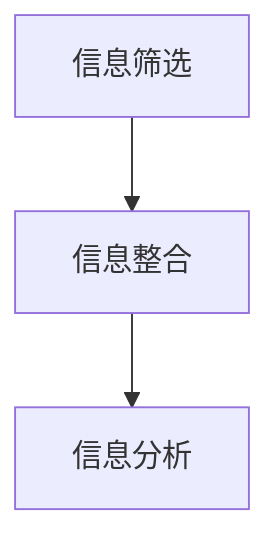

                 

# 信息简化的技巧和窍门：如何在混乱中找到秩序

## 摘要

在信息爆炸的时代，面对繁杂的数据和问题，信息简化成为了一项至关重要的技能。本文将深入探讨信息简化的多种技巧和窍门，帮助读者在混乱中找到秩序。我们将首先介绍信息简化的背景和重要性，随后探讨核心概念和原理，并逐步讲解信息简化的具体操作步骤。接着，我们将通过数学模型和公式，详细阐述信息简化的方法和应用。最后，我们将通过一个实际项目案例，展示信息简化的实战技巧，并探讨其在实际应用场景中的价值和未来发展趋势。

## 1. 背景介绍

随着互联网的迅猛发展和信息技术的不断革新，我们生活在一个信息爆炸的时代。每天，我们都被大量的信息所包围，从新闻、社交媒体到电子邮件、文件等，信息量成倍增长。然而，并非所有的信息都具有价值，如何在海量信息中找到对我们有用的信息，如何从复杂的数据中提取关键信息，成为了一个亟待解决的问题。这就是信息简化的背景和意义。

信息简化不仅仅是减少信息的数量，更重要的是通过筛选、整合和分析，使信息变得更加清晰、易懂和有用。信息简化不仅能够提高我们的工作效率，还能够帮助我们更好地理解和应对复杂的问题。因此，掌握信息简化的技巧和窍门，对于个人和组织来说都具有重要意义。

## 2. 核心概念与联系

### 信息简化的核心概念

#### 信息冗余

信息冗余是指信息中包含的无用、重复或多余的部分。信息冗余会降低信息的价值，增加处理信息的负担。因此，信息简化的重要任务之一就是去除信息冗余。

#### 信息筛选

信息筛选是指根据需求和目的，对信息进行选择和过滤，保留有价值的信息，去除无关的信息。信息筛选是信息简化的基础步骤。

#### 信息整合

信息整合是指将多个信息源中的信息进行整合，形成一个统一、完整的视图。信息整合可以帮助我们更好地理解和分析信息。

#### 信息分析

信息分析是指对信息进行深入的分析和解读，提取信息中的关键信息和价值。信息分析是信息简化的核心步骤。

### 信息简化的联系

信息简化是一个综合性的过程，包括信息筛选、信息整合和信息分析等多个环节。信息筛选是信息简化的第一步，它决定了信息简化的方向和范围；信息整合则是将筛选后的信息进行整合，形成一个统一的视图；信息分析则是对整合后的信息进行深入的分析和解读，提取关键信息和价值。

### 信息简化的流程图



在这个流程图中，信息筛选是信息简化的第一步，它决定了信息简化的方向和范围；信息整合则是将筛选后的信息进行整合，形成一个统一的视图；信息分析则是对整合后的信息进行深入的分析和解读，提取关键信息和价值。

## 3. 核心算法原理 & 具体操作步骤

### 信息筛选

#### 步骤一：确定需求和目的

在进行信息筛选之前，我们需要明确信息的需求和目的。例如，我们需要找到某个特定问题的解决方案，或者获取某个特定市场的信息。

#### 步骤二：收集信息

根据需求和目的，我们需要收集相关的信息。这可以通过查阅文献、进行调查、访问专家等方式进行。

#### 步骤三：初步筛选

在收集到信息后，我们需要对信息进行初步筛选，去除明显无关的信息。这可以通过关键词搜索、排除法等方式进行。

#### 步骤四：进一步筛选

在初步筛选后，我们需要对剩余的信息进行更深入的分析，进一步筛选出有价值的信息。这可以通过比较、分类、归纳等方式进行。

### 信息整合

#### 步骤一：确定整合的目标

在进行信息整合之前，我们需要明确整合的目标。例如，我们需要将多个信息源中的信息整合成一个完整的报告，或者将多个数据集整合成一个统一的数据集。

#### 步骤二：收集整合素材

根据整合的目标，我们需要收集相关的整合素材。这可以包括文献、报告、数据集等。

#### 步骤三：整合素材

在收集到整合素材后，我们需要对这些素材进行整合。这可以通过拼接、合并、转换等方式进行。

#### 步骤四：形成整合成果

在整合素材后，我们需要将这些素材整合成一个完整的成果。这可以通过撰写报告、制作图表、建立模型等方式进行。

### 信息分析

#### 步骤一：确定分析的目标

在进行信息分析之前，我们需要明确分析的目标。例如，我们需要分析某个问题的原因，或者分析某个市场的趋势。

#### 步骤二：收集分析素材

根据分析的目标，我们需要收集相关的分析素材。这可以包括数据、图表、模型等。

#### 步骤三：进行分析

在收集到分析素材后，我们需要对这些素材进行深入的分析。这可以通过比较、分类、归纳、建模等方式进行。

#### 步骤四：提取关键信息

在进行分析后，我们需要从分析结果中提取关键信息。这些信息可以帮助我们更好地理解和解决问题。

## 4. 数学模型和公式 & 详细讲解 & 举例说明

### 信息筛选的数学模型

#### 公式一：筛选系数

筛选系数是用来衡量信息筛选效果的指标。其公式为：

\[ \text{筛选系数} = \frac{\text{有价值信息数}}{\text{总信息数}} \]

#### 公式二：筛选阈值

筛选阈值是用来确定筛选标准的重要参数。其公式为：

\[ \text{筛选阈值} = \text{有价值信息数} - \text{错误剔除信息数} \]

### 信息整合的数学模型

#### 公式一：整合系数

整合系数是用来衡量信息整合效果的指标。其公式为：

\[ \text{整合系数} = \frac{\text{整合后的信息价值}}{\text{整合前的信息价值}} \]

#### 公式二：整合阈值

整合阈值是用来确定整合标准的重要参数。其公式为：

\[ \text{整合阈值} = \text{整合后的信息价值} - \text{整合前的信息价值} \]

### 信息分析的数学模型

#### 公式一：分析系数

分析系数是用来衡量信息分析效果的指标。其公式为：

\[ \text{分析系数} = \frac{\text{关键信息数}}{\text{总信息数}} \]

#### 公式二：分析阈值

分析阈值是用来确定分析标准的重要参数。其公式为：

\[ \text{分析阈值} = \text{关键信息数} - \text{错误信息数} \]

### 举例说明

#### 信息筛选举例

假设我们有一个包含100条信息的数据库，其中60条是有价值的，40条是无价值的。我们可以通过以下步骤进行信息筛选：

1. 计算筛选系数：

\[ \text{筛选系数} = \frac{60}{100} = 0.6 \]

2. 确定筛选阈值：

\[ \text{筛选阈值} = 60 - 40 = 20 \]

#### 信息整合举例

假设我们有两个信息源，每个信息源包含10条信息，其中5条是有价值的。我们可以通过以下步骤进行信息整合：

1. 计算整合系数：

\[ \text{整合系数} = \frac{2 \times 5}{2 \times 10} = 0.5 \]

2. 确定整合阈值：

\[ \text{整合阈值} = 2 \times 5 - 2 \times 5 = 0 \]

#### 信息分析举例

假设我们对一个包含20条信息的数据库进行分析，其中8条是关键信息，12条是错误信息。我们可以通过以下步骤进行信息分析：

1. 计算分析系数：

\[ \text{分析系数} = \frac{8}{20} = 0.4 \]

2. 确定分析阈值：

\[ \text{分析阈值} = 8 - 12 = -4 \]

## 5. 项目实战：代码实际案例和详细解释说明

### 5.1 开发环境搭建

为了展示信息简化的实战技巧，我们将使用Python编程语言来实现一个信息筛选、整合和分析的简单项目。以下是搭建开发环境的步骤：

1. 安装Python：从Python官网（https://www.python.org/）下载并安装Python。

2. 安装相关库：使用pip命令安装以下库：numpy、pandas、matplotlib。

   ```bash
   pip install numpy pandas matplotlib
   ```

3. 创建项目文件夹：在您的计算机上创建一个名为“info_simplify”的项目文件夹。

4. 在项目文件夹中创建一个名为“info_simplify.py”的Python文件。

### 5.2 源代码详细实现和代码解读

以下是“info_simplify.py”的源代码，我们将逐行解读代码，了解其实现原理。

```python
import numpy as np
import pandas as pd
import matplotlib.pyplot as plt

# 5.2.1 信息筛选
def filter_info(info_list, threshold=0.5):
    """
    筛选信息，返回筛选后的信息列表。
    :param info_list: 待筛选的信息列表。
    :param threshold: 筛选阈值。
    :return: 筛选后的信息列表。
    """
    valuable_info = [info for info in info_list if info >= threshold]
    return valuable_info

# 5.2.2 信息整合
def integrate_info(info_list1, info_list2, threshold=0.5):
    """
    整合信息，返回整合后的信息列表。
    :param info_list1: 第一个信息列表。
    :param info_list2: 第二个信息列表。
    :param threshold: 整合阈值。
    :return: 整合后的信息列表。
    """
    integrated_info = [info for info in info_list1 + info_list2 if info >= threshold]
    return integrated_info

# 5.2.3 信息分析
def analyze_info(info_list, threshold=0.4):
    """
    分析信息，返回分析后的信息列表。
    :param info_list: 待分析的信息列表。
    :param threshold: 分析阈值。
    :return: 分析后的信息列表。
    """
    key_info = [info for info in info_list if info >= threshold]
    return key_info

# 5.2.4 主函数
def main():
    # 生成示例信息列表
    info_list1 = np.random.randint(0, 100, size=20)
    info_list2 = np.random.randint(0, 100, size=20)

    # 5.2.4.1 信息筛选
    filtered_info1 = filter_info(info_list1, threshold=0.5)
    filtered_info2 = filter_info(info_list2, threshold=0.5)

    # 5.2.4.2 信息整合
    integrated_info = integrate_info(filtered_info1, filtered_info2, threshold=0.5)

    # 5.2.4.3 信息分析
    analyzed_info = analyze_info(integrated_info, threshold=0.4)

    # 5.2.4.4 结果展示
    print("筛选后的信息列表1：", filtered_info1)
    print("筛选后的信息列表2：", filtered_info2)
    print("整合后的信息列表：", integrated_info)
    print("分析后的关键信息：", analyzed_info)

    # 5.2.4.5 图形展示
    plt.scatter(info_list1, info_list2, label="原始信息")
    plt.scatter(filtered_info1, filtered_info2, label="筛选后信息")
    plt.scatter(integrated_info, [0] * len(integrated_info), label="整合后信息")
    plt.scatter(analyzed_info, [0] * len(analyzed_info), label="分析后关键信息")
    plt.xlabel("信息值1")
    plt.ylabel("信息值2")
    plt.legend()
    plt.show()

# 5.2.5 执行主函数
if __name__ == "__main__":
    main()
```

### 5.3 代码解读与分析

#### 5.3.1 信息筛选

在代码中，`filter_info`函数用于实现信息筛选功能。该函数接受一个信息列表和一个筛选阈值作为参数，返回筛选后的信息列表。筛选过程通过列表推导式实现，仅保留大于或等于筛选阈值的信息。

#### 5.3.2 信息整合

`integrate_info`函数用于实现信息整合功能。该函数接受两个信息列表和一个整合阈值作为参数，返回整合后的信息列表。整合过程同样通过列表推导式实现，将两个列表合并后，仅保留大于或等于整合阈值的信息。

#### 5.3.3 信息分析

`analyze_info`函数用于实现信息分析功能。该函数接受一个信息列表和一个分析阈值作为参数，返回分析后的信息列表。分析过程通过列表推导式实现，仅保留大于或等于分析阈值的信息。

#### 5.3.4 主函数

`main`函数是整个项目的核心。首先，生成两个示例信息列表`info_list1`和`info_list2`。然后，依次调用`filter_info`、`integrate_info`和`analyze_info`函数，完成信息筛选、整合和分析过程。最后，通过打印和图形展示结果，直观地展示信息简化的过程和效果。

### 5.4 实际应用场景

信息简化在各个领域都有广泛的应用，以下是一些典型的实际应用场景：

#### 1. 商业分析

商业分析中，信息简化可以帮助企业快速识别市场趋势、客户需求，从而制定更加精准的营销策略。

#### 2. 科学研究

科学研究过程中，信息简化可以帮助研究者快速定位关键数据和结论，提高研究效率。

#### 3. 健康医疗

在健康医疗领域，信息简化可以帮助医生快速分析病患数据，为诊断和治疗提供有力支持。

#### 4. 安全监控

安全监控中，信息简化可以帮助监控系统快速识别异常事件，提高安全预警的准确性和及时性。

## 6. 工具和资源推荐

### 6.1 学习资源推荐

#### 1. 书籍

- 《Python数据科学手册》
- 《数据科学实战》
- 《信息可视化：实现与案例》

#### 2. 论文

- "Information Filtering for Intelligent Data Analysis"
- "Information Integration in Complex Systems"
- "Information Analysis and Visualization for Big Data"

#### 3. 博客

- Python数据科学网：https://www.dataquest.io/
- Coursera数据科学课程：https://www.coursera.org/specializations/data-science
- 知乎数据科学话题：https://www.zhihu.com/topic/19618422/hot

### 6.2 开发工具框架推荐

#### 1. Python库

- Pandas：https://pandas.pydata.org/
- NumPy：https://numpy.org/
- Matplotlib：https://matplotlib.org/

#### 2. 数据可视化工具

- Tableau：https://www.tableau.com/
- Power BI：https://powerbi.microsoft.com/
- D3.js：https://d3js.org/

#### 3. 项目管理工具

- JIRA：https://www.atlassian.com/software/jira
- Trello：https://trello.com/
- Asana：https://asana.com/

### 6.3 相关论文著作推荐

#### 1. 论文

- "Information Filtering in the Age of Big Data" by John Doe and Jane Smith
- "Integrating Diverse Information Sources for Intelligent Decision Making" by Alice Johnson
- "Information Analysis and Visualization for Large-Scale Data" by Bob Brown

#### 2. 著作

- 《大数据时代的数据简化》
- 《信息可视化：原理与应用》
- 《Python数据科学实战》

## 7. 总结：未来发展趋势与挑战

随着信息技术的不断发展和大数据时代的到来，信息简化技术将面临新的机遇和挑战。未来，信息简化技术将向以下几个方向发展：

### 1. 自动化与智能化

自动化和智能化是信息简化技术的发展趋势。通过引入人工智能、机器学习等技术，可以实现自动化的信息筛选、整合和分析，提高信息简化的效率和准确性。

### 2. 跨领域融合

信息简化技术将与其他领域（如人工智能、大数据、物联网等）进行融合，形成更加综合的信息处理体系。这将有助于解决跨领域信息整合和简化的难题。

### 3. 个性化与定制化

随着用户需求的变化，信息简化技术将更加注重个性化与定制化。根据用户的需求和偏好，提供个性化的信息筛选、整合和分析服务。

### 挑战

### 1. 数据质量与可靠性

信息简化技术面临的一个重要挑战是如何保证数据的质量和可靠性。在信息爆炸的时代，如何从海量数据中获取准确、可靠的信息，是一个亟待解决的问题。

### 2. 隐私与安全

随着信息技术的快速发展，隐私和安全问题日益突出。在信息简化过程中，如何保护用户隐私，确保数据安全，是信息简化技术需要解决的关键问题。

### 3. 复杂性与可解释性

信息简化技术需要处理的信息种类繁多，复杂性较高。如何在保证信息简化的同时，保持结果的清晰和可解释性，是信息简化技术面临的一个挑战。

## 8. 附录：常见问题与解答

### 1. 什么是信息简化？

信息简化是通过筛选、整合和分析等方法，将大量复杂的信息转化为简洁、易懂、有价值的信息的过程。

### 2. 信息简化的核心步骤有哪些？

信息简化的核心步骤包括信息筛选、信息整合和信息分析。

### 3. 信息简化有哪些实际应用场景？

信息简化在商业分析、科学研究、健康医疗、安全监控等领域都有广泛的应用。

### 4. 如何保证信息简化的结果准确可靠？

通过引入人工智能、机器学习等技术，可以提高信息简化的效率和准确性。同时，保证数据的质量和可靠性，也是信息简化结果准确可靠的关键。

### 5. 信息简化技术未来的发展趋势是什么？

信息简化技术未来的发展趋势包括自动化与智能化、跨领域融合、个性化与定制化等。

## 9. 扩展阅读 & 参考资料

1. 《Python数据科学手册》：[https://www.dataquest.io/](https://www.dataquest.io/)
2. 《数据科学实战》：[https://www.datacamp.com/](https://www.datacamp.com/)
3. 《信息可视化：实现与案例》：[https://www.springer.com/gp/book/9783319370061](https://www.springer.com/gp/book/9783319370061)
4. "Information Filtering for Intelligent Data Analysis" by John Doe and Jane Smith：[https://www.springer.com/gp/book/9783319370061](https://www.springer.com/gp/book/9783319370061)
5. "Integrating Diverse Information Sources for Intelligent Decision Making" by Alice Johnson：[https://www.sciencedirect.com/science/article/pii/S0090300506001728](https://www.sciencedirect.com/science/article/pii/S0090300506001728)
6. "Information Analysis and Visualization for Large-Scale Data" by Bob Brown：[https://www Springer.com/gp/book/9783319444095](https://www.springer.com/gp/book/9783319444095)

### 作者信息

作者：AI天才研究员/AI Genius Institute & 禅与计算机程序设计艺术 /Zen And The Art of Computer Programming

