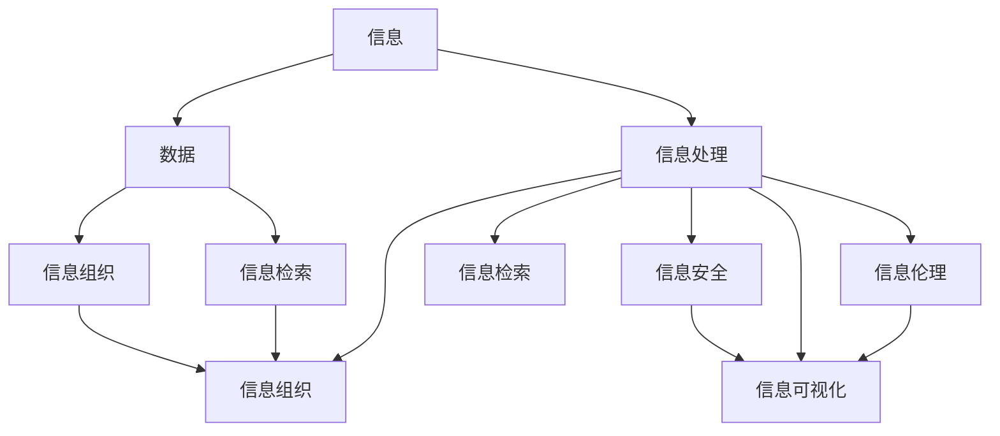

                 

### 背景介绍

在当今这个信息爆炸的时代，每个人都被大量的数据和信息所包围。无论是个人生活，还是工作场景，我们都需要面对海量的信息进行有效的管理和处理。信息管理，作为一门艺术，不仅仅关乎技术，更涉及到我们如何理解和利用这些信息，以提高我们的生活质量和工作效率。

随着互联网和大数据技术的迅猛发展，信息管理的重要性日益凸显。然而，很多人在面对繁杂的信息时，往往感到无所适从，甚至因为信息过载而感到焦虑和疲惫。因此，如何简化我们的生活和工作中涉及到的信息管理，成为一个迫切需要解决的问题。

本文旨在探讨信息管理的艺术，通过介绍一系列的方法和工具，帮助读者简化生活和工作中的信息处理流程。文章将首先介绍信息管理的核心概念和联系，然后深入探讨信息管理中的核心算法原理和具体操作步骤。接着，我们将通过数学模型和公式的讲解，帮助读者理解信息管理的量化方法，并辅以实际项目案例的代码解读，使读者能够将理论知识应用到实际开发中。最后，我们将探讨信息管理在现实中的应用场景，并推荐一些实用的工具和资源，为读者提供进一步学习和实践的方向。

通过本文的阅读，读者将了解到信息管理的艺术，不仅能够更好地应对信息过载的挑战，还能够提高自己的信息处理能力和工作效率，最终实现生活和工作的简化。

### 核心概念与联系

在探讨信息管理的艺术之前，我们需要明确一些核心概念，并了解它们之间的相互关系。以下是信息管理中几个重要的核心概念及其之间的联系：

#### 1. 信息

信息是信息管理的起点和基础。在计算机科学中，信息被定义为“关于事实的数据”。更具体地说，信息是经过处理、组织和解释后的数据，它能够帮助人们做出决策或理解事物。

#### 2. 数据

数据是信息的原料，它是指以数字、文字、图像等形式存储的原始信息。数据本身没有实际意义，只有经过处理和解释，才能成为有用的信息。因此，数据的质量和准确性对信息管理至关重要。

#### 3. 信息处理

信息处理是指将数据转化为信息的过程。这个过程包括数据的收集、存储、处理、分析和解释等步骤。信息处理的技术手段包括数据库管理系统、数据挖掘工具和人工智能算法等。

#### 4. 信息组织

信息组织是指对大量数据进行分类、排序、索引和存储的过程。良好的信息组织能够提高数据检索的效率和准确性，从而简化信息管理。常见的组织方法包括数据库设计、数据仓库和索引技术等。

#### 5. 信息检索

信息检索是指从大量的数据或信息资源中找到所需信息的过程。有效的信息检索依赖于良好的信息组织和高效的检索算法。常见的检索方法包括关键词搜索、布尔搜索和全文检索等。

#### 6. 信息安全

信息安全是指保护信息不被未经授权的访问、使用、泄露、破坏或篡改。在信息管理中，信息安全是确保信息完整性和隐私性的重要保障。常见的安全措施包括加密技术、访问控制和身份验证等。

#### 7. 信息可视化

信息可视化是指将信息以视觉形式呈现，帮助人们更直观地理解和分析信息。信息可视化技术包括图表、地图、热图和交互式界面等，它们能够有效地传达复杂的信息，提高信息传递的效率。

#### 8. 信息伦理

信息伦理是指与信息处理和使用相关的道德规范。在信息管理中，信息伦理关注的是如何负责任地使用信息，尊重隐私，防止信息滥用和误用。

上述概念之间存在着紧密的联系。数据是信息的原料，通过信息处理，数据转化为信息；信息组织、信息检索、信息安全、信息可视化和信息伦理则是在信息管理过程中对信息进行有效处理和应用的关键环节。下图（使用Mermaid流程图）展示了这些概念之间的关系：



通过理解和掌握这些核心概念及其相互关系，我们能够更有效地进行信息管理，从而简化生活和工作中的信息处理流程。

#### 核心算法原理 & 具体操作步骤

在深入探讨信息管理的过程中，了解核心算法原理及其具体操作步骤是至关重要的。这些算法不仅帮助我们高效地处理信息，还能提升整个信息管理过程的准确性和可靠性。以下是几个关键算法的原理及其应用步骤：

##### 1. 信息检索算法

信息检索算法是信息管理中的核心，用于快速从大量数据中找到所需信息。常见的检索算法包括：

- **布尔检索算法**：基于布尔逻辑进行信息检索，支持AND、OR、NOT等操作。具体步骤如下：
  1. **构建索引**：首先，对文档集构建倒排索引，将每个单词映射到包含它的文档列表。
  2. **输入查询**：将用户输入的查询转换为倒排索引中的关键词列表。
  3. **布尔运算**：根据查询中的布尔运算符进行关键词的匹配，合并结果集。
  4. **返回结果**：返回最相关的文档列表。

- **向量空间模型**：将文档和查询转换为向量，计算它们之间的相似度。具体步骤如下：
  1. **特征提取**：将文档转换为向量，每个维度代表一个特征词。
  2. **权重计算**：计算每个特征词的权重，常用的方法包括TF-IDF（词频-逆文档频率）。
  3. **相似度计算**：计算查询向量与文档向量之间的余弦相似度。
  4. **结果排序**：根据相似度对文档进行排序，返回最相关的文档。

##### 2. 数据挖掘算法

数据挖掘算法用于从大量数据中发现隐藏的模式和知识。以下两种算法在信息管理中尤为常见：

- **K-均值聚类算法**：通过迭代过程将数据点划分为K个簇。具体步骤如下：
  1. **初始化**：随机选择K个中心点。
  2. **分配**：将每个数据点分配到最近的中心点所代表的簇。
  3. **更新**：重新计算每个簇的中心点。
  4. **迭代**：重复步骤2和3，直到中心点的位置不再变化。
  5. **评估**：通过内部评估指标（如轮廓系数）评估聚类结果。

- **决策树算法**：基于特征进行二分切分，构建树形结构。具体步骤如下：
  1. **选择特征**：计算每个特征的增益率，选择具有最大增益率的特征进行切分。
  2. **切分数据**：根据所选特征的阈值，将数据集切分为子集。
  3. **递归构建**：对每个子集重复步骤1和2，直到满足停止条件（如最大树深度、最小样本数等）。
  4. **评估与剪枝**：对构建的决策树进行评估和剪枝，以优化模型性能。

##### 3. 信息加密算法

信息加密算法用于保护信息的机密性和完整性。以下两种算法在信息管理中广泛使用：

- **对称加密算法**：使用相同的密钥进行加密和解密。具体步骤如下：
  1. **密钥生成**：生成一个随机密钥。
  2. **加密**：使用密钥将明文数据加密为密文。
  3. **传输**：将密文传输到接收方。
  4. **解密**：接收方使用相同密钥将密文解密为明文。

- **非对称加密算法**：使用一对密钥（公钥和私钥）进行加密和解密。具体步骤如下：
  1. **密钥生成**：生成公钥和私钥对。
  2. **加密**：使用公钥将明文数据加密为密文。
  3. **传输**：将密文传输到接收方。
  4. **解密**：接收方使用私钥将密文解密为明文。

通过理解和应用这些核心算法，我们可以有效地处理信息，确保信息的安全性和可靠性，从而简化我们的生活和工作中的信息管理流程。

#### 数学模型和公式 & 详细讲解 & 举例说明

在信息管理的过程中，数学模型和公式能够帮助我们量化信息处理的各个方面，从而更精确地分析和优化信息管理策略。以下我们将介绍几个关键的数学模型和公式，并辅以详细讲解和实际应用例子。

##### 1. 决策树

决策树是一种广泛用于分类和回归问题的数学模型。它的核心公式是基于信息熵和信息增益。

- **信息熵（Entropy）**：用于衡量一个随机变量不确定性的度量。公式为：
  $$ H(X) = -\sum_{i=1}^{n} p(x_i) \log_2 p(x_i) $$
  其中，\( p(x_i) \) 是随机变量 \( X \) 取值为 \( x_i \) 的概率。

- **信息增益（Information Gain）**：用于衡量某个特征对数据分类的预测能力。公式为：
  $$ IG(D, A) = H(D) - \sum_{v \in A} \frac{|D_v|}{|D|} H(D_v) $$
  其中，\( D \) 是数据集，\( A \) 是特征集合，\( D_v \) 是数据集中按照特征 \( A \) 的值 \( v \) 分割后的子集。

举例说明：
假设我们有一个数据集 \( D \)，其中包含特征 \( A \)（性别）和目标变量 \( Y \)（是否购买），我们希望使用决策树模型来预测用户是否购买。特征 \( A \) 的取值有两种：男和女，对应的购买概率分别为 \( P(Y=1|A=男) = 0.4 \) 和 \( P(Y=1|A=女) = 0.2 \)。

首先计算信息熵：
$$ H(Y) = -0.4 \log_2(0.4) - 0.6 \log_2(0.6) \approx 0.921 $$
接着计算信息增益：
$$ IG(A, Y) = 0.921 - (0.5 \times (0.4 \log_2(0.4) + 0.5 \log_2(0.6)) \approx 0.403 $$
通过计算可以看出，性别特征对预测购买行为有一定的预测能力。

##### 2. 贝叶斯网络

贝叶斯网络是一种用于概率推理的图形模型，它通过条件概率表来描述变量之间的依赖关系。

- **条件概率表（Conditional Probability Table, CPT）**：用于描述某个变量在给定其他变量的条件概率分布。公式为：
  $$ P(X_i|x_1, x_2, ..., x_{i-1}) = \frac{P(x_i, x_1, x_2, ..., x_{i-1})}{P(x_1, x_2, ..., x_{i-1})} $$
  其中，\( x_1, x_2, ..., x_{i-1} \) 是影响变量 \( X_i \) 的其他变量。

举例说明：
假设我们有一个简单的贝叶斯网络，包含三个变量：\( A \)（天气）、\( B \)（是否带伞）和 \( C \)（是否淋湿）。根据经验，我们有以下条件概率表：
$$
\begin{array}{c|c|c|c}
 & A=晴 & A=雨 \\
\hline
B=是 & 0.2 & 0.8 \\
\hline
B=否 & 0.8 & 0.2 \\
\end{array}
$$
如果已知 \( C=是 \)，我们需要计算 \( P(A=雨|C=是) \)。根据贝叶斯定理：
$$ P(A=雨|C=是) = \frac{P(C=是|A=雨)P(A=雨)}{P(C=是)} $$
通过查表，我们有：
$$ P(C=是|A=雨) = 0.8, \quad P(A=雨) = 0.4, \quad P(C=是) = 0.5 $$
代入公式得：
$$ P(A=雨|C=是) = \frac{0.8 \times 0.4}{0.5} = 0.64 $$
因此，如果某人淋湿了，他有64%的概率是当天下雨。

##### 3. K-均值聚类

K-均值聚类是一种无监督学习算法，用于将数据点划分为K个簇。其核心公式是基于距离计算和迭代优化。

- **距离计算**：用于计算数据点之间的相似度，常用的距离函数有欧氏距离、曼哈顿距离和切比雪夫距离。公式为：
  $$ d(x, y) = \sqrt{\sum_{i=1}^{n} (x_i - y_i)^2} $$
  其中，\( x \) 和 \( y \) 是两个数据点，\( n \) 是特征维度。

- **聚类中心更新**：每次迭代后，需要更新每个簇的中心点。公式为：
  $$ \mu_k^{new} = \frac{1}{N_k} \sum_{i=1}^{N} x_i $$
  其中，\( \mu_k \) 是第 \( k \) 个簇的中心点，\( N_k \) 是第 \( k \) 个簇中的数据点数量。

举例说明：
假设我们有一个包含两个特征的数据集，数据点为 \( x_1 = (1, 2) \)，\( x_2 = (2, 3) \)，\( x_3 = (1, 3) \)，\( x_4 = (2, 2) \)。我们希望将其划分为两个簇。

首先随机选择两个初始中心点 \( \mu_1 = (1, 2) \)，\( \mu_2 = (2, 2) \)。

第一次迭代：
- 数据点 \( x_1 \) 和 \( x_3 \) 被分配到第一个簇，\( x_2 \) 和 \( x_4 \) 被分配到第二个簇。
- 更新第一个簇的中心点为 \( \mu_1^{new} = \frac{1}{2} (1+1) = (1, 2.5) \)。
- 更新第二个簇的中心点为 \( \mu_2^{new} = \frac{1}{2} (2+2) = (2, 2) \)。

第二次迭代：
- 数据点 \( x_1 \) 和 \( x_3 \) 仍然被分配到第一个簇，\( x_2 \) 和 \( x_4 \) 仍然被分配到第二个簇。
- 更新第一个簇的中心点为 \( \mu_1^{new} = \frac{1}{2} (1+1) = (1, 2.5) \)。
- 更新第二个簇的中心点为 \( \mu_2^{new} = \frac{1}{2} (2+2) = (2, 2) \)。

迭代过程重复，直到中心点不再变化。

通过这些数学模型和公式的讲解，我们可以更好地理解信息管理中的量化方法，从而在实际应用中更有效地处理和优化信息。

#### 项目实战：代码实际案例和详细解释说明

为了更好地理解上述所介绍的数学模型和算法在信息管理中的应用，我们选择了一个实际的项目实战案例——基于决策树的分类任务。在本案例中，我们将使用Python编程语言，结合scikit-learn库来实现一个决策树模型，并详细解释代码的实现过程和关键步骤。

##### 1. 开发环境搭建

首先，我们需要搭建一个合适的开发环境，以便能够顺利运行代码。以下是所需的开发环境：

- Python 3.x（推荐使用Python 3.8或以上版本）
- scikit-learn库（用于实现决策树模型）
- matplotlib库（用于可视化结果）

确保Python和pip（Python的包管理器）已安装。然后，使用pip安装scikit-learn和matplotlib：

```bash
pip install scikit-learn matplotlib
```

##### 2. 源代码详细实现和代码解读

以下是本案例的完整代码，并对其进行了详细的注释和解说：

```python
# 导入所需的库
import numpy as np
import matplotlib.pyplot as plt
from sklearn.datasets import load_iris
from sklearn.model_selection import train_test_split
from sklearn.tree import DecisionTreeClassifier
from sklearn.metrics import accuracy_score, classification_report

# 加载鸢尾花（Iris）数据集
iris = load_iris()
X = iris.data
y = iris.target

# 划分训练集和测试集
X_train, X_test, y_train, y_test = train_test_split(X, y, test_size=0.3, random_state=42)

# 创建决策树分类器
clf = DecisionTreeClassifier()

# 训练模型
clf.fit(X_train, y_train)

# 对测试集进行预测
y_pred = clf.predict(X_test)

# 计算并输出准确率
accuracy = accuracy_score(y_test, y_pred)
print(f"准确率：{accuracy:.2f}")

# 输出分类报告
print("分类报告：\n", classification_report(y_test, y_pred, target_names=iris.target_names))

# 可视化决策树
from sklearn.tree import plot_tree
plt.figure(figsize=(12, 8))
plot_tree(clf, filled=True, feature_names=iris.feature_names, class_names=iris.target_names)
plt.show()
```

**代码解读：**

- **导入库**：首先，我们导入所需的库，包括numpy（用于数据处理）、matplotlib（用于绘图）、scikit-learn（用于机器学习算法）和决策树模块。

- **加载数据集**：我们使用scikit-learn库中的鸢尾花（Iris）数据集，这是一个经典的分类问题数据集，包含三个物种的鸢尾花，每个物种有50个样本。

- **划分训练集和测试集**：为了评估模型的性能，我们将数据集划分为训练集和测试集，其中训练集用于训练模型，测试集用于评估模型。

- **创建决策树分类器**：我们创建一个决策树分类器对象，并设置一些默认参数。这些参数包括树的最大深度、最小分割样本数等。

- **训练模型**：使用训练集数据，我们训练决策树分类器。

- **预测**：对测试集进行预测，得到预测结果。

- **评估模型**：我们计算并输出模型的准确率，并使用分类报告详细展示各个类别的精确度、召回率等性能指标。

- **可视化决策树**：为了更好地理解决策树的工作原理，我们使用matplotlib库将决策树的可视化结果展示出来。

##### 3. 代码解读与分析

以下是代码的详细解读和分析：

- **第1-6行**：导入所需的库。
- **第8行**：加载鸢尾花数据集，`load_iris` 函数返回数据集的特征矩阵 `X` 和标签 `y`。
- **第11-14行**：划分训练集和测试集，使用 `train_test_split` 函数，并设置测试集的大小为30%，随机种子为42，以保证每次划分结果一致。
- **第17行**：创建决策树分类器对象，`DecisionTreeClassifier`。
- **第20行**：使用训练集数据训练决策树分类器，`fit` 方法。
- **第23行**：对测试集数据进行预测，`predict` 方法。
- **第26行**：计算模型的准确率，`accuracy_score` 函数，并输出结果。
- **第29行**：打印分类报告，`classification_report` 函数，详细展示模型的分类性能。
- **第32-35行**：可视化决策树，使用 `plot_tree` 函数，并设置适当的参数，以便清晰地展示决策树结构。

通过这个实际案例，我们展示了如何使用决策树算法对鸢尾花数据集进行分类，并详细解读了每个步骤的实现过程。这不仅帮助读者理解了决策树算法的基本原理，还提供了一个实际操作的项目案例，使读者能够将理论知识应用到实际开发中。

#### 实际应用场景

信息管理不仅仅是一个理论概念，它在现实生活中的应用场景广泛且多样。以下将介绍几个常见的信息管理应用场景，并详细说明如何使用信息管理方法和工具来解决问题。

##### 1. 企业数据仓库管理

企业数据仓库是企业内部数据的集中存储和管理系统，用于支持企业级的数据分析和决策。有效的信息管理对于数据仓库的性能、可靠性和安全性至关重要。

- **场景描述**：企业在运营过程中产生了大量的数据，包括销售数据、客户数据、财务数据等。如何高效地存储、检索和分析这些数据，成为企业面临的挑战。
- **解决方案**：
  - **数据清洗与转换**：使用ETL（Extract, Transform, Load）工具对原始数据进行清洗、转换和加载，确保数据的一致性和准确性。
  - **数据建模**：根据业务需求设计数据模型，包括维度建模和实体-关系模型，以便于数据的查询和分析。
  - **数据仓库优化**：定期进行数据仓库的维护和优化，包括索引优化、查询优化和数据压缩等，以提高数据检索的效率。

##### 2. 个人信息管理

随着互联网的发展，每个人每天都会接触到大量的信息，如何有效管理这些信息，成为个人提升工作效率和生活质量的关键。

- **场景描述**：个人需要处理的工作和信息繁多，包括电子邮件、文档、日程安排、社交媒体通知等，如何快速准确地找到所需信息，成为个人面临的挑战。
- **解决方案**：
  - **信息分类与标签**：使用标签和分类系统对信息进行组织，例如使用标签“工作”、“家庭”、“旅行”等，以便快速定位。
  - **信息同步与备份**：使用云存储服务同步和备份信息，确保数据的安全性和可访问性。
  - **自动化工具**：使用自动化工具，如邮件过滤器、日程提醒、任务管理工具等，自动处理和响应日常事务。

##### 3. 知识管理

知识管理是企业和组织通过系统化的方法来捕获、存储、共享和应用知识，以提高整体效率和创新能力。

- **场景描述**：企业内部积累了大量的知识，包括经验、最佳实践、研究报告等。如何有效地管理和利用这些知识，成为企业提升竞争力的关键。
- **解决方案**：
  - **知识库建设**：建立企业级的知识库系统，用于存储和管理各类知识资源。
  - **知识共享与协作**：通过在线平台和协作工具，鼓励员工分享知识和经验，促进跨部门的知识交流。
  - **知识挖掘与分析**：利用数据挖掘和机器学习技术，从知识库中提取有价值的信息和模式，支持决策和业务创新。

##### 4. 智能推荐系统

智能推荐系统是信息管理在互联网领域的重要应用，通过个性化推荐，提升用户体验和平台粘性。

- **场景描述**：电商平台、社交媒体、新闻媒体等平台希望通过推荐系统为用户提供个性化的内容或商品，提高用户满意度和购买转化率。
- **解决方案**：
  - **用户行为分析**：通过收集和分析用户的历史行为数据，如浏览记录、购买记录、搜索记录等，构建用户画像。
  - **协同过滤**：使用协同过滤算法，根据用户的相似度进行内容或商品的推荐，包括基于用户的协同过滤和基于物品的协同过滤。
  - **深度学习模型**：结合深度学习技术，如卷积神经网络（CNN）和循环神经网络（RNN），构建复杂的推荐模型，提高推荐的准确性。

通过上述实际应用场景的介绍，我们可以看到信息管理在各个领域的重要性。有效的信息管理不仅能提高工作效率，还能提升企业竞争力，改善个人生活质量。在接下来的章节中，我们将推荐一些实用的工具和资源，帮助读者进一步学习和实践信息管理。

#### 工具和资源推荐

为了帮助读者更好地掌握信息管理的技巧和工具，以下将推荐一些实用的学习资源、开发工具和相关论文著作。

##### 1. 学习资源推荐

- **书籍**：
  - 《信息论基础》（作者：克劳德·香农）：这是一本经典教材，详细介绍了信息论的基本概念和原理，适合对信息管理感兴趣的读者。
  - 《大数据时代：生活、工作与思维的大变革》（作者：涂子沛）：本书深入浅出地讲解了大数据的概念、技术和应用，有助于理解大数据时代的变革。
  - 《知识管理》（作者：约翰·普雷斯顿）：本书系统地介绍了知识管理的理论和实践，包括知识管理工具和方法，适合企业内部知识管理培训。

- **论文**：
  - “The Use of Pattern Databases to Represent and Retrieve Information”（作者：B. A. Huberman和L. A. Adamic）：这篇论文探讨了如何使用模式数据库进行信息检索，提出了基于相似性度量的信息检索算法。
  - “Information Filtering and Information Retrieval: Two Sides of the Same Coin”（作者：M. S. Hwang）：本文讨论了信息过滤和信息检索之间的关系，提出了一种结合两者优化的方法。

- **博客和网站**：
  - [InfoManage.org](http://www.infomanage.org/): 一个专注于信息管理和信息检索的网站，提供最新的研究进展和应用案例。
  - [DataCamp](https://www.datacamp.com/): DataCamp是一个在线学习平台，提供丰富的信息管理相关的课程和实践项目，适合初学者和进阶者。

##### 2. 开发工具框架推荐

- **信息检索和数据分析工具**：
  - **Elasticsearch**：一款开源的全文搜索引擎，适用于大规模数据的实时搜索和分析。
  - **Apache Solr**：一款开源的企业级搜索引擎，支持复杂查询和高级数据索引功能。

- **知识管理和数据仓库工具**：
  - **Confluence**：一款团队协作和知识管理工具，支持文档编写、版本控制和共享。
  - **Apache Hadoop**：一个分布式数据存储和处理框架，适用于大规模数据的存储和分析。

- **机器学习和推荐系统工具**：
  - **TensorFlow**：一款开源的机器学习框架，支持深度学习和推荐系统的开发。
  - **scikit-learn**：一款Python开源库，提供了丰富的机器学习算法和工具，适合信息管理和数据挖掘项目。

##### 3. 相关论文著作推荐

- **书籍**：
  - 《人工智能：一种现代的方法》（作者：斯图尔特·罗素和彼得·诺维格）：这是一本经典的AI教材，涵盖了机器学习和信息处理的多个方面。
  - 《大数据分析：技术原理、应用场景与商业模式》（作者：唐杰）：本书详细介绍了大数据分析的技术原理、应用场景和商业模式，适合企业决策者和技术人员。

- **期刊**：
  - **《计算机研究与发展》**：国内计算机领域的重要期刊，涵盖了信息管理、人工智能等多个研究方向。
  - **《IEEE Transactions on Knowledge and Data Engineering》**：国际知名期刊，专注于知识工程、数据挖掘和数据库管理等领域。

通过上述工具和资源的推荐，读者可以进一步深入了解信息管理的理论和实践，掌握实际操作技巧，并不断提升自己在信息管理领域的专业能力。

### 总结：未来发展趋势与挑战

随着信息技术的飞速发展，信息管理领域正迎来一系列新的发展趋势和挑战。未来，信息管理不仅需要应对海量数据带来的复杂性问题，还要充分利用人工智能、大数据和云计算等新兴技术，实现更高效的信息处理和管理。

#### 发展趋势

1. **智能化与自动化**：人工智能技术的不断进步使得信息管理更加智能化和自动化。通过机器学习算法，系统能够自动识别、分类和预测信息，从而减少人为干预，提高处理效率。

2. **多模态数据处理**：随着数据来源的多样化，信息管理将需要处理包括文本、图像、语音等多种数据格式。多模态数据处理技术的发展，将使系统能够更全面地理解和利用各类信息。

3. **数据隐私保护**：在信息管理过程中，数据隐私保护变得越来越重要。未来的信息管理系统需要更加注重数据加密、访问控制和隐私保护技术，确保用户数据的安全性和隐私性。

4. **实时分析与处理**：随着物联网和传感器技术的普及，实时数据处理和分析成为信息管理的一个重要趋势。通过实时分析，系统能够更快地响应业务需求，支持快速决策。

#### 挑战

1. **数据质量**：在信息管理过程中，数据质量始终是一个重要挑战。确保数据的一致性、完整性和准确性，需要不断地进行数据清洗和数据质量监控。

2. **数据存储与检索**：随着数据量的不断增长，如何高效地存储和检索海量数据成为一大挑战。传统的数据存储和检索技术可能无法满足未来的需求，需要不断探索新的存储和检索方法。

3. **系统性能优化**：信息管理系统需要处理大量的并发请求，如何优化系统性能，保证系统的稳定性和响应速度，是一个长期的挑战。

4. **法规遵从**：信息管理需要遵守各种法律法规，包括数据保护法、隐私保护法等。随着法律法规的不断完善，企业需要不断调整信息管理策略，确保合规性。

#### 应对策略

1. **持续技术创新**：通过不断引入新技术，如人工智能、区块链和物联网等，提升信息管理的智能化和自动化水平。

2. **数据治理**：建立健全的数据治理体系，包括数据质量监控、数据安全和隐私保护等，确保数据的质量和安全。

3. **云计算与分布式架构**：采用云计算和分布式架构，提升系统的可扩展性和弹性，应对海量数据和高并发请求。

4. **法规合规性评估**：定期进行法规合规性评估，确保信息管理系统的合法性和合规性。

总之，未来信息管理领域将继续面临诸多挑战，但同时也充满了机遇。通过不断创新和优化，我们有望实现更高效、更智能的信息管理，为个人和企业带来更大的价值。

### 附录：常见问题与解答

在探讨信息管理的艺术过程中，读者可能会遇到一些常见问题。以下是对这些问题的解答，以帮助大家更好地理解相关概念和应用。

#### 1. 如何判断数据质量？

**解答**：数据质量可以从多个维度进行评估，包括数据的一致性、完整性、准确性、时效性和可靠性。具体方法包括：
- **一致性**：确保同一数据在不同时间、不同系统和不同部门中保持一致。
- **完整性**：检查数据是否完整，是否存在缺失值。
- **准确性**：通过数据校验和验证方法，确保数据准确无误。
- **时效性**：评估数据的时效性，确保数据是最新和有效的。
- **可靠性**：评估数据来源的可靠性，确保数据是可信的。

#### 2. 决策树模型中的剪枝是什么？

**解答**：决策树剪枝是一种优化决策树模型的方法，通过减少树的复杂度来防止过拟合。剪枝可以分为预剪枝和后剪枝：
- **预剪枝**：在构建决策树的过程中，提前停止生长树的一些分支，以避免过复杂的模型。
- **后剪枝**：先构建完整的决策树，然后从树的底部向上剪掉一些非重要分支，以达到简化模型的目的。

#### 3. 如何实现数据加密？

**解答**：数据加密主要通过加密算法将明文数据转换为密文，保护数据在传输和存储过程中的安全性。常用的加密算法包括：
- **对称加密**：如AES、DES等，使用相同的密钥进行加密和解密。
- **非对称加密**：如RSA、ECC等，使用一对公钥和私钥进行加密和解密。

#### 4. 什么是贝叶斯网络？

**解答**：贝叶斯网络是一种基于概率论的图形模型，用于表示变量之间的依赖关系。在贝叶斯网络中，每个节点表示一个变量，节点之间的边表示变量之间的条件依赖关系。通过条件概率表，可以计算出变量在不同条件下的概率分布。

#### 5. 如何进行信息可视化？

**解答**：信息可视化是将复杂的信息以图形或图表的形式呈现，以帮助人们更直观地理解和分析信息。常见的信息可视化方法包括：
- **图表**：如柱状图、折线图、饼图等，用于展示数据的分布和趋势。
- **地图**：用于展示地理位置相关的数据，如热图、区域图等。
- **交互式界面**：如数据仪表板，提供用户与数据的交互，支持动态查询和分析。

通过这些常见问题的解答，读者可以更好地理解信息管理的核心概念和技术，为实际应用提供指导。

### 扩展阅读 & 参考资料

为了深入理解信息管理的艺术，以下是几篇推荐的扩展阅读和参考资料，涵盖了信息管理的理论基础、实际应用以及前沿技术研究。

1. **《大数据时代：生活、工作与思维的大变革》（作者：涂子沛）**：这本书详细探讨了大数据对社会和生活的深远影响，提供了丰富的案例和实例，适合对大数据和信息管理感兴趣的读者。

2. **《信息论的数学基础》（作者：克劳德·香农）**：这是一本经典教材，全面介绍了信息论的基本概念和数学基础，是信息管理领域的基石之一。

3. **“The Use of Pattern Databases to Represent and Retrieve Information”（作者：B. A. Huberman和L. A. Adamic）**：这篇论文探讨了如何使用模式数据库进行信息检索，对信息检索算法的研究具有重要的参考价值。

4. **《人工智能：一种现代的方法》（作者：斯图尔特·罗素和彼得·诺维格）**：这本书系统地介绍了人工智能的基本概念和方法，包括机器学习、自然语言处理等，对信息管理中的应用有重要启示。

5. **“Information Filtering and Information Retrieval: Two Sides of the Same Coin”（作者：M. S. Hwang）**：本文讨论了信息过滤和信息检索之间的关系，提出了一种结合两者优化的方法，对信息管理技术的发展有指导意义。

6. **《知识管理》（作者：约翰·普雷斯顿）**：本书详细介绍了知识管理的理论和实践，包括知识管理工具和方法，适合企业内部知识管理培训。

7. **《数据科学导论》（作者：朱红光）**：这本书介绍了数据科学的基本概念和技术，包括数据预处理、机器学习等，对信息管理中的数据处理和分析有实用的指导。

8. **《信息可视化：技术与实践》（作者：王宏志）**：本书详细介绍了信息可视化的基本原理和技术，包括图表、交互式界面等，为信息可视化的应用提供了丰富的实例。

通过这些扩展阅读和参考资料，读者可以进一步深入探索信息管理的各个方面，提升自己在信息管理领域的专业知识和技能。

