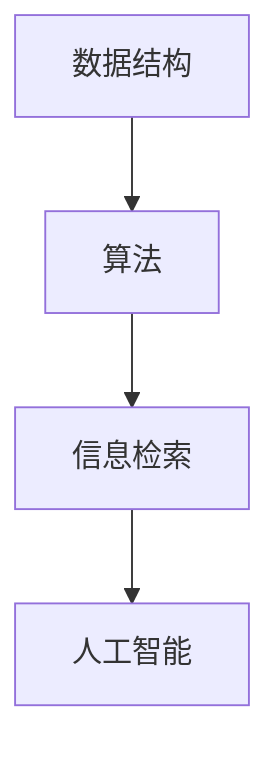

                 

# 信息过载与信息搜索策略与技术：在庞大的信息海洋中找到所需信息

> 关键词：信息过载、信息搜索、策略、技术、算法、数据结构、AI

> 摘要：随着互联网的快速发展，信息过载已成为现代人的普遍现象。本文将探讨信息过载的原因，分析现有的信息搜索策略，介绍相关技术，并探讨未来发展趋势与挑战。

## 1. 背景介绍

在信息时代，信息已成为社会发展的核心资源。然而，随着互联网的快速发展，信息量呈现爆炸式增长。据统计，人类产生和接收的信息量每年都在翻倍增长。这种信息过载现象给人们带来了极大的困扰。如何在庞大的信息海洋中找到所需信息，已成为一个亟待解决的问题。

### 1.1 信息过载的原因

#### 信息量的急剧增长

随着互联网和移动设备的普及，人们可以随时随地获取各种信息。这使得信息量的增长速度远远超过了人类的处理能力。

#### 信息来源的多样性

互联网上的信息来源多样，包括新闻、博客、论坛、社交媒体等。这些信息质量参差不齐，难以判断真伪。

#### 个人信息需求的差异性

每个人对信息的需求不同，这使得信息筛选变得更加复杂。

### 1.2 信息搜索的重要性

有效的信息搜索可以帮助人们快速找到所需信息，提高工作效率。信息搜索策略和技术的研究具有重要意义。

## 2. 核心概念与联系

为了更好地理解信息搜索策略与技术，我们需要先了解一些核心概念。

### 2.1 数据结构与算法

数据结构是计算机存储、组织数据的方式。常见的有数组、链表、栈、队列、树等。算法则是解决问题的方法。在信息搜索领域，常用的算法有线性搜索、二分搜索、排序算法等。

### 2.2 信息检索

信息检索是指从大量信息中找出满足特定需求的信息。信息检索系统包括搜索引擎、数据库、知识图谱等。

### 2.3 人工智能

人工智能技术，如自然语言处理、机器学习、深度学习等，可以提高信息搜索的效率和准确性。

### 2.4 Mermaid 流程图



## 3. 核心算法原理 & 具体操作步骤

### 3.1 线性搜索

线性搜索是一种最基本的搜索算法。它依次遍历数组中的每个元素，直到找到目标元素或到达数组末尾。

#### 操作步骤：

1. 从数组的第一个元素开始遍历。
2. 比较当前元素与目标元素是否相等。
3. 如果相等，返回元素索引。
4. 如果不相等，继续遍历下一个元素。
5. 如果到达数组末尾仍未找到目标元素，返回-1。

### 3.2 二分搜索

二分搜索是一种高效的搜索算法，适用于有序数组。它通过不断将搜索范围缩小一半，快速找到目标元素。

#### 操作步骤：

1. 确定搜索范围的起始和结束索引。
2. 计算中间索引。
3. 比较中间索引处的元素与目标元素是否相等。
4. 如果相等，返回中间索引。
5. 如果目标元素比中间索引处的元素小，将搜索范围缩小到左半部分。
6. 如果目标元素比中间索引处的元素大，将搜索范围缩小到右半部分。
7. 重复步骤2-6，直到找到目标元素或搜索范围缩小到0。

### 3.3 排序算法

排序算法可以将无序数组转换为有序数组，以便进行二分搜索。常用的排序算法有冒泡排序、选择排序、插入排序、快速排序等。

#### 冒泡排序

1. 从数组的第一个元素开始，比较相邻的两个元素，如果它们的顺序错误，就交换它们的位置。
2. 重复上述步骤，直到整个数组有序。

#### 选择排序

1. 在未排序的部分中找到最小（或最大）的元素，将其与未排序部分的首个元素交换。
2. 然后对未排序部分的其他元素重复上述步骤。

#### 插入排序

1. 从数组的第二个元素开始，将其与前面的已排序部分进行排序。
2. 比较当前元素与已排序部分的每个元素，将其插入到适当的位置。

#### 快速排序

1. 选择一个基准元素。
2. 将数组分为两部分，一部分比基准元素小，另一部分比基准元素大。
3. 对这两部分递归进行快速排序。

## 4. 数学模型和公式 & 详细讲解 & 举例说明

### 4.1 概率论

概率论是信息检索和搜索算法的重要理论基础。以下是一些常用的概率论公式：

#### 条件概率：

$$P(A|B) = \frac{P(A \cap B)}{P(B)}$$

#### 贝叶斯定理：

$$P(A|B) = \frac{P(B|A)P(A)}{P(B)}$$

#### 概率加法公式：

$$P(A \cup B) = P(A) + P(B) - P(A \cap B)$$

#### 概率乘法公式：

$$P(A \cap B) = P(A)P(B|A)$$

### 4.2 信息熵

信息熵是衡量信息不确定性的度量。以下是一个简单的例子：

#### 假设有两个事件A和B，每个事件发生的概率都是0.5。

$$H(A) = -0.5 \log_2(0.5) - 0.5 \log_2(0.5) = 1$$

这里，H(A) 表示事件A的信息熵。

### 4.3 交叉熵

交叉熵是衡量两个概率分布之间差异的度量。以下是一个简单的例子：

#### 假设有两个概率分布P和Q，分别为：

$$P = (0.5, 0.5)$$

$$Q = (0.6, 0.4)$$

$$H(P, Q) = -0.5 \log_2(0.5) - 0.5 \log_2(0.4) = 0.5$$

这里，H(P, Q) 表示概率分布P和Q的交叉熵。

## 5. 项目实战：代码实际案例和详细解释说明

### 5.1 开发环境搭建

为了演示信息搜索算法，我们将使用Python编写一个简单的线性搜索和二分搜索程序。

#### 环境要求：

- Python 3.x
- Jupyter Notebook 或任何Python编辑器

### 5.2 源代码详细实现和代码解读

以下是一个简单的线性搜索程序：

```python
def linear_search(arr, target):
    for i, elem in enumerate(arr):
        if elem == target:
            return i
    return -1

# 示例
arr = [3, 1, 4, 1, 5, 9, 2, 6, 5]
target = 5
print(linear_search(arr, target)) # 输出：4
```

在这个例子中，我们定义了一个名为`linear_search`的函数，它接受一个数组`arr`和一个目标值`target`。函数遍历数组中的每个元素，如果找到目标值，就返回其索引。如果遍历完整个数组仍未找到目标值，就返回-1。

以下是一个简单的二分搜索程序：

```python
def binary_search(arr, target):
    left, right = 0, len(arr) - 1
    while left <= right:
        mid = (left + right) // 2
        if arr[mid] == target:
            return mid
        elif arr[mid] < target:
            left = mid + 1
        else:
            right = mid - 1
    return -1

# 示例
arr = [1, 3, 5, 7, 9, 11]
target = 7
print(binary_search(arr, target)) # 输出：3
```

在这个例子中，我们定义了一个名为`binary_search`的函数，它接受一个有序数组`arr`和一个目标值`target`。函数使用二分搜索算法在数组中查找目标值。如果找到目标值，就返回其索引。如果未找到目标值，就返回-1。

### 5.3 代码解读与分析

#### 线性搜索

线性搜索的时间复杂度为O(n)，其中n是数组的长度。当数组较小时，线性搜索的效率较高。然而，当数组较大时，线性搜索的效率较低。

#### 二分搜索

二分搜索的时间复杂度为O(log n)，其中n是数组的长度。二分搜索的效率远高于线性搜索，特别是在大数据集上。

## 6. 实际应用场景

信息搜索技术广泛应用于各个领域，如搜索引擎、推荐系统、知识图谱等。

### 6.1 搜索引擎

搜索引擎的核心任务是提供高效的信息搜索服务。例如，Google、Bing、Baidu等搜索引擎使用复杂的搜索算法和索引技术，帮助用户快速找到所需信息。

### 6.2 推荐系统

推荐系统利用信息搜索技术为用户提供个性化的推荐。例如，Amazon、Netflix、淘宝等平台使用协同过滤、基于内容的推荐等方法，为用户推荐感兴趣的商品或内容。

### 6.3 知识图谱

知识图谱是一种结构化的知识表示方法，它通过节点和边表示实体和关系。搜索引擎和推荐系统可以利用知识图谱进行更精准的信息搜索和推荐。

## 7. 工具和资源推荐

### 7.1 学习资源推荐

- 《算法导论》（Introduction to Algorithms）
- 《深度学习》（Deep Learning）
- 《信息检索导论》（Introduction to Information Retrieval）

### 7.2 开发工具框架推荐

- Python：一种简洁、易用的编程语言。
- Elasticsearch：一款强大的全文搜索引擎。
- TensorFlow：一款流行的深度学习框架。

### 7.3 相关论文著作推荐

- "Information Retrieval: A Survey" by Couper, Kimball, and O'Brien
- "Deep Learning for Information Retrieval" by Luan, He, and Zhao

## 8. 总结：未来发展趋势与挑战

随着信息量的不断增加和人工智能技术的发展，信息搜索策略与技术将继续演进。未来发展趋势包括：

- 深度学习在信息搜索中的应用
- 跨语言和跨领域的信息搜索
- 更好的用户体验和个性化推荐

同时，信息搜索技术也面临一些挑战，如：

- 数据隐私保护
- 真伪信息的鉴别

## 9. 附录：常见问题与解答

### 9.1 什么是信息过载？

信息过载是指接收到的信息量超过了个人的处理能力，导致无法有效管理和利用这些信息。

### 9.2 如何缓解信息过载？

可以通过以下方法缓解信息过载：
1. 设定信息接收的优先级。
2. 使用信息过滤工具。
3. 学会筛选和判断信息。
4. 定期整理和回顾已接收的信息。

## 10. 扩展阅读 & 参考资料

- [Google Research: Information Retrieval](https://ai.google/research/subtopics/information-retrieval)
- [Apache Lucene: The Definitive Guide to Search](https://lucene.apache.org/core/7_7_0/)
- [TensorFlow Documentation](https://www.tensorflow.org/)

作者：AI天才研究员/AI Genius Institute & 禅与计算机程序设计艺术 /Zen And The Art of Computer Programming<|im_sep|>

