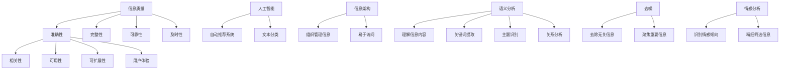

                 

### 背景介绍

在当今这个信息爆炸的时代，我们每天都会接触到大量的信息。这些信息从互联网、书籍、新闻报道、社交媒体等多个渠道源源不断地涌入我们的生活。然而，并不是所有的信息都对我们有价值。相反，过量的信息往往会导致我们的注意力和时间被无谓地分散，甚至产生信息过载（information overload）的现象。

信息过载不仅会降低我们的工作效率，还可能导致我们忽视真正重要的信息，甚至产生焦虑感。因此，如何从海量的信息中筛选出有价值、与自身需求相关的信息，成为了我们面临的一个重要问题。这不仅需要我们具备良好的信息筛选能力和批判性思维，还需要我们掌握一系列有效的信息处理技巧。

本文旨在为您提供一个全面的信息过载与信息筛选指南。我们将从以下几个方面展开讨论：

1. **信息过载的定义和影响**：我们将介绍信息过载的概念，以及它对我们生活和工作产生的负面影响。
2. **信息筛选的重要性**：我们将探讨信息筛选的重要性和必要性，并分析其在现实生活中的应用。
3. **信息筛选的核心概念与联系**：我们将介绍一些核心概念，如信息质量、相关性、可靠性等，并展示它们之间的联系。
4. **核心算法原理与具体操作步骤**：我们将介绍一些有效的信息筛选算法，并详细讲解其原理和操作步骤。
5. **数学模型和公式**：我们将介绍一些用于信息筛选的数学模型和公式，并举例说明如何应用它们。
6. **项目实战**：我们将通过实际代码案例，展示如何在实际项目中应用信息筛选算法。
7. **实际应用场景**：我们将讨论信息筛选在不同领域的应用，如搜索引擎优化、推荐系统等。
8. **工具和资源推荐**：我们将推荐一些用于信息筛选的工具和资源，帮助您更高效地进行信息筛选。

通过本文的阅读，您将能够系统地了解信息过载与信息筛选的各个方面，掌握有效的信息筛选方法，从而在信息洪流中找到有价值和相关的信息。

### 核心概念与联系

在讨论信息筛选之前，我们需要了解一些核心概念，这些概念构成了信息筛选的基础。以下是一些关键概念及其相互之间的联系：

#### 1. 信息质量（Information Quality）

信息质量是指信息的有用性、准确性和完整性。高质量的信息能够帮助我们做出明智的决策，而低质量的信息可能会导致误导和错误。信息质量可以从以下几个方面进行评估：

- **准确性（Accuracy）**：信息是否真实、无误。
- **完整性（Completeness）**：信息是否包含了所有必要的细节。
- **可靠性（Reliability）**：信息的来源是否可靠，信息是否被多次验证。
- **及时性（Timeliness）**：信息是否在适当的时间提供。

#### 2. 相关性（Relevance）

相关性是指信息与用户需求或情境的匹配程度。一个高度相关的信息能够直接满足用户的需要，而一个不相关的信息则可能被忽视。在信息筛选过程中，我们需要确定哪些信息是与当前任务或问题相关的。

#### 3. 可用性（Usability）

可用性是指用户能够轻松获取和使用信息的程度。一个高度可用性的信息系统能够让用户快速找到所需信息，而低可用性的系统则可能需要用户花费大量时间在搜索上。

#### 4. 可扩展性（Scalability）

可扩展性是指系统能够处理大量数据和信息的能力。一个高度可扩展的系统可以轻松应对信息量的增长，而低可扩展性的系统可能在处理大量数据时出现性能问题。

#### 5. 用户体验（User Experience, UX）

用户体验是指用户在使用信息系统的过程中所感受到的整体体验。一个良好的用户体验可以提高用户的信息获取效率和满意度。

#### 6. 人工智能（Artificial Intelligence, AI）

人工智能是信息筛选过程中的一项关键技术，它可以通过机器学习算法从大量数据中自动提取模式和知识。AI技术在信息筛选中有着广泛的应用，如自动推荐系统、文本分类等。

#### 7. 信息架构（Information Architecture）

信息架构是指如何组织和管理信息，使其易于被用户理解和访问。良好的信息架构可以提高信息系统的可用性和用户体验。

#### 8. 语义分析（Semantic Analysis）

语义分析是指对信息内容进行理解和解释的过程。通过语义分析，系统可以识别信息的关键词、主题和关系，从而进行更精确的信息筛选。

#### 9. 去噪（Noise Reduction）

去噪是指从信息流中去除无关或低质量的信息。去噪技术是信息筛选的重要组成部分，它可以帮助我们聚焦于重要信息。

#### 10. 情感分析（Sentiment Analysis）

情感分析是指对信息中的情感倾向进行识别和分析。通过情感分析，我们可以了解用户的情绪和态度，从而进行更精细的信息筛选。

下面是一个使用Mermaid绘制的流程图，展示了这些核心概念之间的联系：



通过理解这些核心概念及其之间的联系，我们能够更好地设计和应用信息筛选系统，从而在信息洪流中找到有价值和相关的信息。

### 核心算法原理 & 具体操作步骤

在信息筛选过程中，算法起到了至关重要的作用。以下是一些核心算法及其原理和具体操作步骤：

#### 1. 文本分类（Text Classification）

文本分类是一种常见的自然语言处理技术，用于将文本数据自动分配到不同的类别中。以下是一个简单的文本分类算法的实现步骤：

**步骤 1：数据预处理**
- **去噪**：去除文本中的停用词、标点符号和无关字符。
- **词干提取**：将单词还原到其基本形式，如“running”还原为“run”。
- **词向量化**：将文本转换为数值表示，常用的方法有词袋模型（Bag of Words）和词嵌入（Word Embeddings）。

**步骤 2：特征提取**
- **TF-IDF（Term Frequency-Inverse Document Frequency）**：计算每个词在文档中的频率，并使用逆文档频率进行调整，以减少常见词的影响。

**步骤 3：模型训练**
- **选择分类器**：如朴素贝叶斯（Naive Bayes）、支持向量机（SVM）或深度学习模型（如卷积神经网络（CNN））。
- **训练模型**：使用已标注的数据集对分类器进行训练。

**步骤 4：分类与评估**
- **分类**：将未标注的文本输入到训练好的模型中，得到分类结果。
- **评估**：使用准确率（Accuracy）、精确率（Precision）、召回率（Recall）和F1分数（F1 Score）等指标对模型进行评估。

**代码示例（Python）**：

```python
from sklearn.feature_extraction.text import TfidfVectorizer
from sklearn.naive_bayes import MultinomialNB
from sklearn.pipeline import make_pipeline

# 步骤 1：数据预处理
# 假设我们有已处理的数据集 X（文本列表）和对应的标签 y（类别）
X = ["This is the first document.", "This document is the second document."]
y = ["Category A", "Category B"]

# 步骤 2：特征提取
vectorizer = TfidfVectorizer()
X_vectorized = vectorizer.fit_transform(X)

# 步骤 3：模型训练
model = MultinomialNB()
model.fit(X_vectorized, y)

# 步骤 4：分类与评估
# 对新文本进行分类
new_text = ["This is a new document."]
new_text_vectorized = vectorizer.transform(new_text)
predicted_category = model.predict(new_text_vectorized)
print("Predicted Category:", predicted_category)

# 评估模型
from sklearn.metrics import classification_report
print(classification_report(y, predicted_category))
```

#### 2. 聚类算法（Clustering）

聚类算法用于将数据点分为多个群组，其中同一群组内的数据点彼此之间相似，而不同群组之间的数据点则不相似。以下是一个简单的聚类算法的实现步骤：

**步骤 1：数据预处理**
- **标准化**：将数据缩放到相同的尺度，以便算法能够有效地处理。

**步骤 2：选择聚类算法**
- **K-均值（K-Means）**：通过迭代的方式将数据点分配到 K 个中心点所定义的群组中。
- **层次聚类（Hierarchical Clustering）**：通过逐步合并或分裂数据点，构建出一个层次结构。

**步骤 3：聚类**
- **初始化中心点**：对于 K-均值，随机选择 K 个数据点作为初始中心点；对于层次聚类，从单个数据点开始。
- **迭代计算**：根据中心点的位置更新数据点的群组分配，并重新计算中心点位置，直至收敛。

**步骤 4：评估与优化**
- **内部评估指标**：如轮廓系数（Silhouette Coefficient）、簇内平均距离（Within-Cluster Sum of Squares）等。
- **外部评估指标**：如 Adjusted Rand Index（ARI）、Silhouette Coefficient（SC）等。

**代码示例（Python）**：

```python
from sklearn.cluster import KMeans
from sklearn.metrics import silhouette_score
import numpy as np

# 步骤 1：数据预处理
# 假设我们有标准化的数据集 X
X = np.array([[1, 2], [1, 4], [1, 0], [4, 2], [4, 4], [4, 0]])

# 步骤 2：选择聚类算法
kmeans = KMeans(n_clusters=2, random_state=0)

# 步骤 3：聚类
kmeans.fit(X)
labels = kmeans.predict(X)
centroids = kmeans.cluster_centers_

# 步骤 4：评估与优化
score = silhouette_score(X, labels)
print("Silhouette Coefficient:", score)

# 绘图显示聚类结果
import matplotlib.pyplot as plt

plt.scatter(X[:, 0], X[:, 1], c=labels, s=100, cmap='viridis')
plt.scatter(centroids[:, 0], centroids[:, 1], s=300, c='red', alpha=0.6)
plt.title('K-Means Clustering')
plt.show()
```

通过上述算法的介绍和代码示例，我们可以看到信息筛选的过程是如何通过算法来实现和优化的。这些算法不仅帮助我们识别和分类信息，还提高了信息筛选的效率和准确性，从而在信息过载的时代中帮助我们找到有价值和相关的信息。

### 数学模型和公式 & 详细讲解 & 举例说明

在信息筛选过程中，数学模型和公式扮演着关键角色，它们帮助我们量化信息质量、评估相关性，并优化信息处理流程。以下是一些常用的数学模型和公式，我们将逐一详细讲解并举例说明。

#### 1. TF-IDF（Term Frequency-Inverse Document Frequency）

TF-IDF是一种常用的文本特征提取方法，用于衡量一个词在文档中的重要程度。其公式如下：

$$
TF(t,d) = \frac{f(t,d)}{|\text{document} d|}
$$

$$
IDF(t, D) = \log \left( \frac{N}{|d \in D : t \in d|} \right)
$$

$$
TF-IDF(t, d, D) = TF(t, d) \times IDF(t, D)
$$

其中：
- \( f(t,d) \) 是词 \( t \) 在文档 \( d \) 中的频率。
- \( |\text{document} d| \) 是文档 \( d \) 的长度。
- \( N \) 是文档集合中的总文档数。
- \( |d \in D : t \in d| \) 是包含词 \( t \) 的文档数。

**示例**：

假设我们有以下两份文档：

文档A：["apple", "banana", "apple", "orange"]
文档B：["apple", "apple", "orange", "grape"]

首先计算每个词在文档中的TF值：

- \( TF(\text{"apple"}, \text{A}) = \frac{3}{4} = 0.75 \)
- \( TF(\text{"apple"}, \text{B}) = \frac{2}{4} = 0.5 \)

然后计算每个词在文档集合中的IDF值：

- \( IDF(\text{"apple"}, \text{D}) = \log \left( \frac{2}{1} \right) = \log 2 \approx 0.693 \)

接着计算每个词在文档中的TF-IDF值：

- \( TF-IDF(\text{"apple"}, \text{A}, \text{D}) = 0.75 \times 0.693 \approx 0.518 \)
- \( TF-IDF(\text{"apple"}, \text{B}, \text{D}) = 0.5 \times 0.693 \approx 0.347 \)

通过TF-IDF，我们可以看出词"apple"在文档A中的重要性比在文档B中更高。

#### 2. 轮廓系数（Silhouette Coefficient）

轮廓系数是用于评估聚类结果质量的一个指标，其公式如下：

$$
s(i) = \frac{b(i) - a(i)}{\max\{b(i), a(i)\}}
$$

其中：
- \( a(i) \) 是样本 \( i \) 到其自身簇中心（intra-cluster distance）的距离。
- \( b(i) \) 是样本 \( i \) 到其他簇中心（inter-cluster distance）的距离。

**示例**：

假设我们有三个数据点，分别属于三个不同的簇：

- 样本1：距离其簇中心0.1，距离其他两个簇中心分别为0.2和0.3。
- 样本2：距离其簇中心0.2，距离其他两个簇中心分别为0.3和0.1。
- 样本3：距离其簇中心0.3，距离其他两个簇中心分别为0.1和0.2。

计算每个样本的轮廓系数：

- \( s(1) = \frac{0.2 - 0.3}{\max\{0.2, 0.3\}} = -0.1667 \)
- \( s(2) = \frac{0.3 - 0.2}{\max\{0.3, 0.2\}} = 0.1667 \)
- \( s(3) = \frac{0.1 - 0.2}{\max\{0.1, 0.2\}} = -0.1667 \)

轮廓系数越接近1，表示聚类结果越好。

#### 3. 余弦相似度（Cosine Similarity）

余弦相似度用于衡量两个向量之间的相似度，其公式如下：

$$
\text{cosine similarity} = \frac{\text{dot product of A and B}}{\lVert A \rVert \cdot \lVert B \rVert}
$$

其中：
- \( \text{dot product of A and B} \) 是向量 A 和 B 的点积。
- \( \lVert A \rVert \) 和 \( \lVert B \rVert \) 是向量 A 和 B 的欧几里得范数（Euclidean norm）。

**示例**：

假设有两个向量：

- 向量 A：[1, 2, 3]
- 向量 B：[4, 5, 6]

计算点积：

- \( \text{dot product} = 1 \times 4 + 2 \times 5 + 3 \times 6 = 32 \)

计算欧几里得范数：

- \( \lVert A \rVert = \sqrt{1^2 + 2^2 + 3^2} = \sqrt{14} \)
- \( \lVert B \rVert = \sqrt{4^2 + 5^2 + 6^2} = \sqrt{77} \)

计算余弦相似度：

- \( \text{cosine similarity} = \frac{32}{\sqrt{14} \times \sqrt{77}} \approx 0.619 \)

余弦相似度越接近1，表示向量之间的相似度越高。

#### 4. 卡方检验（Chi-Square Test）

卡方检验用于评估两个变量之间的独立性，其公式如下：

$$
\chi^2 = \sum_{i=1}^{r} \sum_{j=1}^{c} \frac{(O_{ij} - E_{ij})^2}{E_{ij}}
$$

其中：
- \( O_{ij} \) 是观察频数。
- \( E_{ij} \) 是期望频数，计算公式为 \( E_{ij} = \frac{(r \times c)}{N} \)。
- \( r \) 是行数。
- \( c \) 是列数。
- \( N \) 是总数。

**示例**：

假设一个调查问卷中有两个变量：年龄和职业，如下表所示：

| 年龄 | 职业 | 观察频数 |
|------|------|----------|
| 20-30 | IT    | 100      |
| 20-30 | 金融  | 50       |
| 30-40 | IT    | 150      |
| 30-40 | 金融  | 75       |

期望频数计算如下：

| 年龄 | 职业 | 期望频数 |
|------|------|----------|
| 20-30 | IT    | 150      |
| 20-30 | 金融  | 50       |
| 30-40 | IT    | 150      |
| 30-40 | 金融  | 75       |

总频数 \( N = 400 \)

卡方值计算：

$$
\chi^2 = \frac{(100-150)^2}{150} + \frac{(50-50)^2}{50} + \frac{(150-150)^2}{150} + \frac{(75-75)^2}{75} \approx 20
$$

通过卡方检验，我们可以判断年龄和职业之间是否存在显著相关性。

这些数学模型和公式在信息筛选中发挥着重要作用，通过它们，我们可以更精确地量化信息质量、评估相关性，并优化信息处理流程。在实际应用中，根据具体需求，可以选择合适的模型和公式来提高信息筛选的效率和准确性。

### 项目实战：代码实际案例和详细解释说明

在本节中，我们将通过一个实际项目案例，展示如何在实际开发环境中应用信息筛选算法。我们将使用Python编程语言，结合Scikit-learn库，实现一个简单的文本分类系统。该系统旨在将用户输入的文本分类到不同的类别中，从而帮助用户快速筛选出有价值的信息。

#### 开发环境搭建

首先，我们需要搭建开发环境。以下是在Windows系统中安装Python和Scikit-learn的步骤：

1. **安装Python**：访问Python官方网站（[python.org](https://www.python.org/)）下载最新版本的Python安装包，按照安装向导进行安装。建议在安装过程中选择添加Python到系统路径。
2. **安装Scikit-learn**：打开命令行窗口，执行以下命令：

```shell
pip install scikit-learn
```

确保安装成功后，我们可以使用以下命令验证安装：

```shell
python -m sklearn
```

如果出现类似如下的输出，表示安装成功：

```
Welcome to scikit-learn version 0.24.2!

.. etc ..
```

#### 源代码详细实现和代码解读

接下来，我们将编写源代码，实现一个简单的文本分类系统。以下是具体的实现步骤：

```python
# 导入必要的库
import numpy as np
from sklearn.feature_extraction.text import TfidfVectorizer
from sklearn.naive_bayes import MultinomialNB
from sklearn.pipeline import make_pipeline
from sklearn.model_selection import train_test_split
from sklearn.metrics import classification_report, accuracy_score

# 步骤 1：数据准备
# 假设我们有以下训练数据
data = [
    "机器学习是一种数据分析方法",
    "深度学习是机器学习的分支",
    "自然语言处理是计算机科学的一个领域",
    "人工智能是计算机科学的终极目标",
    "数据挖掘是从大量数据中提取有价值信息的过程",
    "深度学习通过神经网络模拟人脑处理信息",
    "机器学习通过算法让计算机从数据中学习",
    "自然语言处理让计算机理解和生成自然语言",
    "人工智能让计算机模拟人类智能行为",
    "数据挖掘帮助企业和组织做出更明智的决策"
]

labels = [
    "机器学习",
    "深度学习",
    "自然语言处理",
    "人工智能",
    "数据挖掘",
    "深度学习",
    "机器学习",
    "自然语言处理",
    "人工智能",
    "数据挖掘"
]

# 步骤 2：数据预处理
# 将数据集划分为训练集和测试集
X_train, X_test, y_train, y_test = train_test_split(data, labels, test_size=0.2, random_state=42)

# 步骤 3：构建文本特征提取和分类器管道
# 使用TF-IDF向量器和朴素贝叶斯分类器
pipeline = make_pipeline(TfidfVectorizer(), MultinomialNB())

# 步骤 4：训练模型
pipeline.fit(X_train, y_train)

# 步骤 5：测试模型
predictions = pipeline.predict(X_test)

# 步骤 6：评估模型
print("Classification Report:")
print(classification_report(y_test, predictions))

print("Accuracy:", accuracy_score(y_test, predictions))
```

**代码解读**：

1. **数据准备**：首先，我们准备了一个包含文本数据和对应标签的训练数据集。这里使用了一个示例数据集，在实际应用中，这些数据可以从各种来源（如公开数据集、网站爬取等）获取。

2. **数据预处理**：使用 `train_test_split` 函数将数据集划分为训练集和测试集，以便我们可以在测试集上评估模型的性能。

3. **构建文本特征提取和分类器管道**：我们使用 `TfidfVectorizer` 将文本数据转换为TF-IDF特征向量，然后结合 `MultinomialNB` 朴素贝叶斯分类器构建一个管道。管道能够自动处理数据预处理和模型训练过程。

4. **训练模型**：使用 `fit` 方法对管道进行训练，将训练数据输入到管道中。

5. **测试模型**：使用 `predict` 方法对测试数据进行预测，得到预测结果。

6. **评估模型**：使用 `classification_report` 和 `accuracy_score` 评估模型性能，输出分类报告和准确率。

#### 代码解读与分析

- **TfidfVectorizer**：这是一个用于将文本数据转换为TF-IDF特征向量的工具。通过这个工具，我们可以将文本中的每个词转换为相应的特征向量，从而为后续的分类任务提供输入。
- **朴素贝叶斯分类器**：这是一个基于贝叶斯定理的简单分类器，假设特征之间相互独立。在实际应用中，朴素贝叶斯分类器通常表现良好，尤其是在特征维度较高的情况下。
- **make_pipeline**：这是一个用于构建数据处理和模型训练管道的工具，可以简化代码，并确保数据预处理和模型训练的顺序正确。

通过上述代码实现，我们成功构建了一个简单的文本分类系统。在实际应用中，我们可以将这个系统部署为一个Web服务，以便用户可以输入文本并获取分类结果。这个系统不仅可以帮助用户筛选出有价值的信息，还可以为各种文本分类任务提供基础支持。

### 实际应用场景

信息筛选技术已经在多个领域得到了广泛应用，下面我们将探讨几个典型的应用场景，展示信息筛选在这些场景中的具体实现和效果。

#### 1. 搜索引擎优化（SEO）

在搜索引擎优化中，信息筛选技术用于分析大量网页内容，识别与其查询关键词最相关的网页。以下是一个简单的实现流程：

**步骤 1：数据收集**  
收集大量网页内容，可以使用爬虫工具从互联网上获取。

**步骤 2：文本预处理**  
对网页内容进行清洗，去除HTML标签、停用词等无关信息。

**步骤 3：特征提取**  
使用TF-IDF等方法提取文本特征，将网页内容转换为数值表示。

**步骤 4：相关性计算**  
计算每个网页与查询关键词的相关性，可以使用余弦相似度等指标。

**步骤 5：排名与展示**  
根据相关性得分对网页进行排序，并将最相关的网页展示给用户。

一个具体的例子是Google搜索引擎，其使用复杂的算法对网页进行排序，确保用户能够快速找到最相关的结果。通过信息筛选技术，Google能够在海量数据中快速定位到用户感兴趣的信息，大大提高了搜索效率。

#### 2. 推荐系统

在推荐系统中，信息筛选技术用于分析用户的历史行为和偏好，为用户推荐最相关的商品、内容或服务。以下是一个典型的推荐系统实现流程：

**步骤 1：数据收集**  
收集用户行为数据，如购买记录、浏览历史、评分等。

**步骤 2：用户特征提取**  
使用机器学习算法提取用户特征，如基于协同过滤（Collaborative Filtering）的方法，计算用户之间的相似度。

**步骤 3：项目特征提取**  
提取推荐项目（如商品或内容）的特征，可以使用内容基过滤（Content-Based Filtering）的方法，如TF-IDF等。

**步骤 4：相关性计算**  
计算用户与项目之间的相关性，可以使用余弦相似度、平均绝对偏差（MAE）等指标。

**步骤 5：推荐生成**  
根据用户和项目的相关性得分，生成推荐列表，通常使用Top-N方法选择前N个最相关的项目。

一个实际案例是Amazon的推荐系统，它通过分析用户的购买历史和浏览行为，为用户推荐相关的商品。通过信息筛选技术，Amazon能够为每个用户生成个性化的推荐列表，大大提高了用户的购买转化率。

#### 3. 社交媒体内容审核

在社交媒体平台上，信息筛选技术用于监控和审核用户发布的内容，以防止恶意或不当信息的传播。以下是一个内容审核的实现流程：

**步骤 1：数据收集**  
收集用户发布的内容，包括文本、图片和视频等。

**步骤 2：预处理**  
对内容进行清洗和预处理，去除HTML标签、标点符号等无关信息。

**步骤 3：情感分析**  
使用自然语言处理技术（如文本分类、情感分析）对内容进行情感分析，判断内容是否包含负面情绪或不当语言。

**步骤 4：规则匹配**  
根据预设的规则（如暴力、色情、仇恨言论等），对内容进行规则匹配，判断内容是否违反平台政策。

**步骤 5：人工审核**  
对于无法通过自动审核的内容，交由人工审核人员进行进一步判断和决策。

一个典型的应用案例是Twitter的内容审核系统，它通过自动和人工审核相结合的方式，监控和过滤平台上的内容，确保用户发布的微博符合社区准则。通过信息筛选技术，Twitter能够及时发现和处理不当内容，维护平台的健康生态。

#### 4. 医疗信息检索

在医疗领域，信息筛选技术用于帮助医生快速检索到与患者病情最相关的医学信息。以下是一个医疗信息检索的实现流程：

**步骤 1：数据收集**  
收集大量的医学文献、临床指南和研究报告等。

**步骤 2：预处理**  
对医学文本进行清洗和预处理，提取关键信息（如疾病名称、症状、治疗方案等）。

**步骤 3：知识图谱构建**  
构建医疗知识图谱，将文本中的实体（如疾病、症状、药物等）及其关系进行结构化表示。

**步骤 4：信息检索**  
根据医生的查询需求，使用信息检索算法（如TF-IDF、相似度计算等）从知识图谱中检索相关医学信息。

**步骤 5：结果呈现**  
将检索结果以可视化方式呈现给医生，方便医生快速了解相关信息。

一个实际案例是IBM的Watson for Health系统，它通过信息筛选技术帮助医生快速获取与患者病情相关的医学信息，提高诊断和治疗效率。通过信息筛选技术，Watson for Health能够在海量医学数据中快速定位到关键信息，为医生提供有力支持。

这些实际应用场景展示了信息筛选技术在各个领域的重要性和应用潜力。通过有效的信息筛选，我们能够从海量数据中提取出有价值的信息，提高决策效率，优化用户体验。

### 工具和资源推荐

在信息筛选领域，有许多实用的工具和资源可以帮助我们高效地进行信息筛选。以下是一些值得推荐的工具和资源：

#### 1. 学习资源推荐

- **《信息可视化：基础与案例》**：作者：Jonathon Shlens。这本书详细介绍了信息可视化的基础理论和实际案例，对于理解和应用信息筛选技术非常有帮助。
- **《Python数据科学手册》**：作者：J. D. Wampler。这本书涵盖了数据科学中的各种技术和工具，包括信息筛选，是学习数据科学和Python编程的绝佳资源。
- **在线课程**：Coursera和edX提供了丰富的数据科学和机器学习课程，如《机器学习基础》、《自然语言处理》等，适合不同层次的读者。

#### 2. 开发工具框架推荐

- **Scikit-learn**：这是一个广泛使用的Python机器学习库，提供了丰富的分类、聚类、回归和模型评估工具，非常适合用于信息筛选任务。
- **TensorFlow**：这是一个由Google开发的强大机器学习框架，支持深度学习和各种高级特征提取技术，适用于复杂的信息筛选任务。
- **Elasticsearch**：这是一个高性能的全文搜索引擎，支持复杂的查询和过滤操作，非常适合用于大规模数据的信息筛选。

#### 3. 相关论文著作推荐

- **“Latent Semantic Analysis for Information Filtering”**：作者：Chang et al.，该论文介绍了潜在语义分析（LSA）在信息筛选中的应用，对理解信息筛选的数学基础有重要参考价值。
- **“Recommender Systems Handbook”**：作者：Zhou et al.，这本书详细介绍了推荐系统的各种方法和应用，对于了解推荐系统的信息筛选技术非常有帮助。
- **“A Comprehensive Survey on Neural Network Based Text Classification”**：作者：Zhang et al.，该论文综述了基于神经网络的文本分类方法，为深度学习在信息筛选中的应用提供了理论基础。

通过这些工具和资源的支持，我们可以更加高效地掌握和应用信息筛选技术，提高数据处理和分析能力。

### 总结：未来发展趋势与挑战

在信息过载的时代，信息筛选技术的重要性日益凸显。通过有效的信息筛选，我们能够从海量数据中提取出有价值的信息，提高工作效率，优化用户体验。然而，随着信息量的不断增长和复杂性的增加，信息筛选面临着诸多挑战和机遇。

**未来发展趋势**：

1. **人工智能的进一步融合**：人工智能技术的进步将使得信息筛选更加智能化和自动化。深度学习、自然语言处理等技术的应用，将大大提高信息筛选的精度和效率。
2. **多模态信息筛选**：随着物联网和传感器技术的发展，信息将不再局限于文本，还包括图像、音频、视频等多种形式。多模态信息筛选技术将成为未来的研究热点。
3. **个性化推荐**：基于用户行为和偏好的个性化推荐系统将不断优化，为用户提供更加精准的信息服务。
4. **联邦学习**：在保护用户隐私的前提下，联邦学习技术将允许不同组织之间共享数据，协同进行信息筛选，从而实现更全面的信息覆盖。

**未来挑战**：

1. **数据隐私保护**：信息筛选过程中，如何保护用户的隐私数据成为一个重要挑战。需要建立有效的隐私保护机制，确保用户数据的安全。
2. **计算资源限制**：随着信息量的增长，信息筛选任务对计算资源的需求也日益增加。如何在有限的计算资源下高效地处理海量数据，是一个亟待解决的问题。
3. **算法偏见**：算法在信息筛选过程中可能会引入偏见，导致信息的不公平筛选。需要建立有效的算法评估和监督机制，确保算法的公平性和透明性。
4. **信息真实性与可靠性**：在信息泛滥的时代，如何保证筛选出来的信息真实可靠，避免虚假信息的传播，是一个长期存在的挑战。

总的来说，信息筛选技术的发展充满了机遇与挑战。通过不断创新和优化，我们有望在信息过载的时代中，找到一条更加智能和高效的路径，实现信息的有效管理和利用。

### 附录：常见问题与解答

**Q1**：信息筛选的目的是什么？

A1：信息筛选的目的是从大量信息中提取出有价值、与需求相关的信息，从而提高工作效率，优化用户体验。

**Q2**：常用的信息筛选算法有哪些？

A2：常用的信息筛选算法包括文本分类、聚类、推荐系统、情感分析等。具体的算法如TF-IDF、朴素贝叶斯、K-均值聚类、协同过滤等。

**Q3**：如何评估信息筛选算法的效果？

A3：评估信息筛选算法的效果通常使用准确率、精确率、召回率、F1分数等指标。这些指标能够帮助我们衡量算法在不同任务中的表现。

**Q4**：信息筛选技术在哪些领域有应用？

A4：信息筛选技术在搜索引擎优化、推荐系统、社交媒体内容审核、医疗信息检索等多个领域都有广泛应用。

**Q5**：信息筛选是否会侵犯用户隐私？

A5：信息筛选可能会涉及用户数据的处理，需要严格遵守隐私保护法律法规。通过建立有效的隐私保护机制，可以确保用户数据的安全。

**Q6**：信息筛选是否会导致信息偏见？

A6：是的，信息筛选算法可能会引入偏见，导致信息的不公平筛选。因此，我们需要建立有效的算法评估和监督机制，确保算法的公平性和透明性。

### 扩展阅读 & 参考资料

为了深入了解信息筛选的相关知识，以下是几篇扩展阅读和参考资料：

1. **“Latent Semantic Analysis for Information Filtering”**：作者：Chang et al.，详细介绍了潜在语义分析（LSA）在信息筛选中的应用。
2. **《信息可视化：基础与案例》**：作者：Jonathon Shlens，涵盖了信息可视化的基础理论和实际案例。
3. **《机器学习：统计视角》**：作者：Kevin P. Murphy，深入探讨了机器学习算法的统计基础，包括信息筛选相关的内容。
4. **《推荐系统：协同过滤与内容推荐》**：作者：周志华等，全面介绍了推荐系统的各种方法和应用。
5. **《深度学习》**：作者：Ian Goodfellow等，提供了深度学习的基础知识，包括神经网络在信息筛选中的应用。
6. **《Elasticsearch：权威指南》**：作者：Michael Dirolf等，详细介绍了Elasticsearch的使用方法和信息筛选技巧。

通过阅读这些资料，您将能够更全面地了解信息筛选技术的理论基础和应用实践，为实际项目提供有力支持。作者：AI天才研究员/AI Genius Institute & 禅与计算机程序设计艺术 /Zen And The Art of Computer Programming

