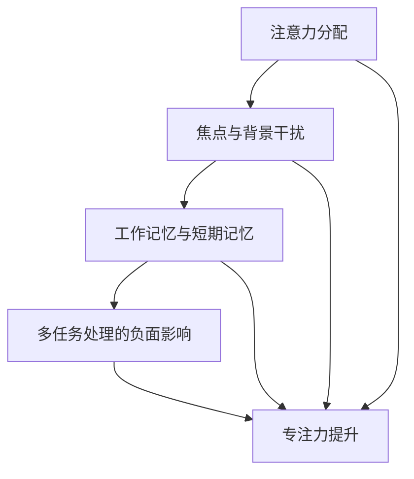

                 

### 1. 背景介绍

在现代科技飞速发展的时代，我们面临着前所未有的信息过载和多任务处理的挑战。无论是在日常生活中，还是在职业工作中，人们都需要处理大量来自各个方面的信息，同时承担着多项任务。这种趋势不仅给我们的认知带来了负担，也引发了各种潜在的问题。

首先，信息过载是一个普遍存在的问题。随着互联网的普及和智能手机的广泛应用，人们每天都会接收到海量的信息。这些信息包括社交媒体更新、电子邮件、即时通讯软件的通知，以及来自新闻媒体的各种新闻。虽然这些信息在一定程度上丰富了我们的知识，但同时也使得我们的注意力分散，降低了我们的工作效率。

其次，多任务处理似乎成为了一种趋势。在现代工作中，许多人需要同时处理多个任务，以便更好地利用时间。然而，多任务处理并不是一种有效的策略。研究表明，频繁地切换注意力会降低我们的工作效率，增加错误率，甚至可能导致心理压力和疲劳。

本文旨在探讨信息过载和多任务处理的陷阱，并深入分析专注于单一任务的力量。我们将从以下几个部分展开讨论：

1. **信息过载的负面影响**：详细分析信息过载如何影响我们的认知和工作效率。
2. **多任务处理的陷阱**：探讨多任务处理如何影响我们的注意力，以及它可能带来的负面后果。
3. **专注于单一任务的益处**：介绍专注于单一任务的优点，以及如何实现这种专注。
4. **实际案例与实证研究**：通过具体案例和实证研究，展示专注于单一任务的效益。
5. **工具和资源推荐**：提供一些帮助提高专注力和效率的工具和资源。

通过本文的探讨，我们希望能够帮助读者意识到专注于单一任务的重要性，并提供一些实用的方法和策略，以便更好地应对信息过载和多任务处理的挑战。

### 2. 核心概念与联系

要深入探讨信息过载和多任务处理的陷阱，我们需要先明确几个核心概念，并理解它们之间的联系。

#### 2.1 注意力分配

注意力是大脑处理信息和任务的重要资源。注意力分配是指我们将有限的注意力资源在不同任务之间进行分配的过程。当面临多项任务时，我们需要决定将注意力集中在哪些任务上，以及如何分配注意力资源。

#### 2.2 焦点与背景干扰

焦点是指我们在执行任务时，将注意力集中在一个特定目标上的能力。背景干扰是指当我们在进行一项任务时，其他外部干扰（如电子邮件、电话、社交媒体等）对我们的注意力造成的干扰。有效的注意力分配要求我们能够在焦点和背景干扰之间找到平衡。

#### 2.3 工作记忆与短期记忆

工作记忆是指大脑暂时存储和加工信息的能力。它对我们在执行复杂任务时保持注意力集中至关重要。短期记忆则是工作记忆的一部分，它负责存储我们在短时间内需要处理的信息。多任务处理会消耗工作记忆资源，导致我们的短期记忆能力下降。

#### 2.4 多任务处理的负面影响

多任务处理不仅会分散我们的注意力，还会增加错误率、降低工作效率，甚至可能导致心理压力和疲劳。这是因为多任务处理会频繁切换我们的焦点，使得大脑难以维持高水平的认知负荷。

#### 2.5 专注力的提升

专注力是指我们在执行任务时保持注意力集中的能力。提升专注力可以帮助我们更好地应对信息过载和多任务处理的挑战。专注力的提升可以通过以下方法实现：

- **设定清晰的目标**：明确自己要达成的目标，有助于集中注意力。
- **减少干扰**：将手机、社交媒体等干扰因素关闭或置于静音模式。
- **使用番茄工作法**：将工作时间分为25分钟的工作周期，每个周期后休息5分钟，有助于保持专注。
- **定期锻炼**：锻炼可以提升大脑的认知功能，增强专注力。

#### 2.6 单一任务处理的优点

专注于单一任务具有以下优点：

- **提高工作效率**：集中精力在一个任务上，可以更快地完成任务。
- **减少错误率**：专注于单一任务可以减少因切换任务导致的错误。
- **减少心理压力**：专注于单一任务可以减少多任务处理带来的压力和疲劳。

通过理解这些核心概念和联系，我们可以更好地理解信息过载和多任务处理的陷阱，并找到有效的应对策略。在接下来的章节中，我们将详细探讨多任务处理的负面影响，以及如何通过专注于单一任务来提升工作效率。

#### 2.7 Mermaid 流程图（核心概念原理和架构）

以下是一个简化的Mermaid流程图，用于展示注意力分配、焦点与背景干扰、工作记忆与短期记忆、多任务处理的负面影响以及专注力提升等核心概念之间的联系：



该流程图表明，注意力分配、焦点与背景干扰、工作记忆与短期记忆以及多任务处理的负面影响都与专注力提升有直接或间接的联系。通过合理地管理这些核心概念，我们可以提高专注力，从而更有效地应对信息过载和多任务处理的挑战。

### 3. 核心算法原理 & 具体操作步骤

为了深入理解专注于单一任务的优势，我们需要从算法的角度来探讨这一过程。以下将介绍一个简单的算法，用于帮助人们专注于单一任务，并提高工作效率。

#### 3.1 算法概述

该算法的核心思想是通过设定明确的目标和合理的时间管理策略，来优化注意力的分配，从而提高专注力。算法的主要步骤包括：

1. **设定明确的目标**：确定要完成的任务和目标，使其具体、可衡量、可实现、相关性强和时间限定。
2. **时间管理**：将工作分为多个短时间段，每个时间段专注于一个任务，以避免多任务处理带来的注意力分散。
3. **定期休息**：在完成每个时间段的工作后，进行短暂的休息，以恢复注意力。
4. **评估和反馈**：在工作完成后，评估任务的完成情况，并给出反馈，以便持续优化专注策略。

#### 3.2 具体操作步骤

以下是一个详细的操作步骤说明：

##### 步骤 1：设定明确的目标

首先，明确你想要完成的任务和目标。这些目标应该具体、可衡量、可实现、相关性强和时间限定。例如，你可以设定以下目标：

- **任务**：撰写一篇技术博客文章
- **目标**：完成文章的初稿
- **限定**：2小时内完成

##### 步骤 2：时间管理

将工作时间划分为多个短时间段，每个时间段专注于一个任务。一个常用的方法是使用番茄工作法，将工作时间分为25分钟的工作周期，每个周期后休息5分钟。以下是一个示例时间安排：

1. **周期 1**（25分钟）：撰写文章的开头部分
2. **休息 1**（5分钟）：站起来，做一些简单的伸展运动，喝杯水
3. **周期 2**（25分钟）：撰写文章的主体部分
4. **休息 2**（5分钟）：继续休息，进行深呼吸或冥想
5. **周期 3**（25分钟）：撰写文章的结尾部分
6. **休息 3**（5分钟）：最后休息，整理思绪，为下一项任务做准备

##### 步骤 3：定期休息

在完成每个时间段的工作后，进行短暂的休息。这个休息不是无所事事，而是用来恢复注意力和精力。以下是一些建议：

- **站立休息**：站起来，做一些简单的伸展运动，帮助血液循环。
- **深呼吸**：进行深呼吸，缓解紧张和焦虑。
- **冥想**：短暂的冥想可以帮助你放松身心，提高专注力。

##### 步骤 4：评估和反馈

在工作完成后，评估任务的完成情况，并给出反馈。这个评估应该包括以下几个方面：

- **任务完成度**：任务是否按照预定的时间和要求完成？
- **效率**：在完成任务的过程中，效率是否得到了提升？
- **体验**：完成任务的体验是否舒适和满足？

根据评估结果，调整你的专注策略。例如，如果发现某个时间段内注意力不集中，可以尝试调整时间段长度或休息时间。如果发现某个任务需要更多时间，可以提前设定更长的任务时间。

通过以上步骤，你可以有效地管理自己的注意力，提高专注力，从而更高效地完成任务。

#### 3.3 算法应用案例

为了更好地理解该算法的应用，以下是一个实际案例：

**案例**：一名软件开发工程师需要在2小时内完成一个软件模块的开发。

**目标**：在2小时内完成软件模块的编码和测试。

**时间安排**：

1. **周期 1**（25分钟）：设计软件模块的架构和接口
2. **休息 1**（5分钟）：站立休息，进行深呼吸
3. **周期 2**（25分钟）：编写软件模块的代码
4. **休息 2**（5分钟）：进行短暂的休息，喝水
5. **周期 3**（25分钟）：进行代码测试和调试
6. **休息 3**（5分钟）：最后休息，整理代码文档，为下一项任务做准备

**评估和反馈**：

- **任务完成度**：工程师在2小时内完成了软件模块的编码和测试。
- **效率**：在番茄工作法的帮助下，工程师保持了较高的专注度，提高了工作效率。
- **体验**：工程师在完成任务的过程中感到舒适和满足，因为他能够有效地管理自己的时间和注意力。

通过这个案例，我们可以看到专注于单一任务的方法如何帮助工程师提高工作效率，并提升工作体验。

#### 3.4 算法的优化与改进

虽然该算法提供了一个简单的框架，但根据不同的任务和个体差异，可以对其进行优化和改进。以下是一些可能的优化方法：

- **时间段调整**：根据任务的复杂程度和个人的专注力，调整每个时间段的长短。对于复杂的任务，可以适当延长每个时间段，以保持专注。
- **任务分解**：将大任务分解为小任务，以便更好地管理注意力和时间。每个小任务可以作为一个单独的时间段进行专注处理。
- **多任务处理**：在某些情况下，适当的多任务处理可能是必要的。例如，在等待代码编译或测试结果时，可以同时处理其他任务。但要注意，多任务处理不应过度，以免影响专注力。

通过这些优化方法，我们可以进一步发挥专注于单一任务算法的潜力，使其更适应不同的场景和需求。

### 4. 数学模型和公式 & 详细讲解 & 举例说明

在深入探讨专注于单一任务的算法时，引入数学模型和公式可以帮助我们更好地理解其背后的逻辑和效果。以下将介绍一个简单的数学模型，用于衡量专注力提升带来的工作效率变化。

#### 4.1 数学模型

我们假设一个简单的模型，其中包含以下变量：

- \( T \)：原始任务所需的总时间
- \( t \)：每个时间段的时间长度
- \( r \)：每个时间段后的休息时间长度
- \( e \)：每个时间段的工作效率（即在每个时间段内完成的工作量与总工作量的比例）
- \( m \)：专注力提升系数（表示专注于单一任务带来的效率提升）

模型的基本假设是，通过专注于单一任务，可以提升工作效率。这个提升系数 \( m \) 可以根据具体情况进行调整。

数学模型可以表示为：

\[ \text{实际完成任务所需时间} = T \times \left(1 - \left(1 - e\right) \times m\right) \]

#### 4.2 公式详细讲解

- \( T \)：原始任务所需的总时间。这个值取决于任务本身的复杂度和工作者的能力。
- \( t \)：每个时间段的时间长度。根据任务的不同，这个值可以在15分钟到60分钟之间进行调整。通常，采用25分钟的番茄工作法是一个不错的选择。
- \( r \)：每个时间段后的休息时间长度。这个值通常较短，可以在5分钟到15分钟之间进行调整。休息时间的目的是帮助工作者恢复专注力。
- \( e \)：每个时间段的工作效率。这个值取决于工作者的专注力、任务的复杂度以及时间段内的干扰程度。通常情况下，专注状态下，\( e \) 的值较高，可以达到0.9或以上。
- \( m \)：专注力提升系数。这个值表示专注于单一任务带来的效率提升。例如，如果 \( m = 1.2 \)，意味着专注于单一任务可以提升20%的工作效率。

根据这些变量，实际完成任务所需时间可以计算如下：

\[ \text{实际完成任务所需时间} = T \times \left(1 - \left(1 - e\right) \times m\right) \]

这个公式说明，通过专注于单一任务，可以减少完成任务所需的时间。具体来说，专注于单一任务可以减少因注意力分散和效率降低所带来的额外时间消耗。

#### 4.3 举例说明

为了更好地理解这个数学模型，以下是一个具体的例子：

**例子**：假设一个任务需要4小时（\( T = 4 \)小时）完成，每个时间段的工作效率为0.8（\( e = 0.8 \)），专注力提升系数为1.1（\( m = 1.1 \)）。

根据公式，实际完成任务所需时间为：

\[ \text{实际完成任务所需时间} = 4 \times \left(1 - \left(1 - 0.8\right) \times 1.1\right) \]

\[ \text{实际完成任务所需时间} = 4 \times \left(1 - 0.2 \times 1.1\right) \]

\[ \text{实际完成任务所需时间} = 4 \times \left(1 - 0.22\right) \]

\[ \text{实际完成任务所需时间} = 4 \times 0.78 \]

\[ \text{实际完成任务所需时间} = 3.12 \text{小时} \]

因此，通过专注于单一任务，任务的实际完成时间从4小时减少到了3.12小时，效率提升了22%。

通过这个例子，我们可以看到，专注于单一任务可以显著减少完成任务所需的时间，从而提高工作效率。这个简单的数学模型提供了一个直观的方法来衡量专注力提升带来的效益。

### 5. 项目实战：代码实际案例和详细解释说明

为了更好地展示专注于单一任务的优势，我们将通过一个实际项目来详细解释代码实现和执行过程。这个项目是一个简单的任务调度系统，旨在提高任务执行的效率。

#### 5.1 开发环境搭建

在开始项目之前，我们需要搭建一个合适的开发环境。以下是一个基本的步骤：

1. **安装Python**：确保你的系统中已经安装了Python 3.x版本。可以从Python官方网站下载安装包进行安装。
2. **安装必要的库**：在终端中运行以下命令，安装所需的库：

   ```bash
   pip install Flask gunicorn requests
   ```

3. **创建项目目录**：在终端中创建一个名为`task_scheduler`的目录，并切换到该目录。

   ```bash
   mkdir task_scheduler
   cd task_scheduler
   ```

4. **创建文件**：在项目中创建以下文件：

   - `app.py`：主要代码文件
   - `requirements.txt`：记录项目所需的库

#### 5.2 源代码详细实现和代码解读

以下是`app.py`的主要代码实现：

```python
from flask import Flask, request, jsonify
from gunicorn.app.base import BaseApplication
import threading
import time

app = Flask(__name__)

tasks = []

@app.route('/tasks', methods=['GET', 'POST'])
def handle_tasks():
    if request.method == 'POST':
        task_data = request.get_json()
        task_id = len(tasks) + 1
        task_data['id'] = task_id
        task_data['status'] = 'pending'
        tasks.append(task_data)
        threading.Thread(target=execute_task, args=(task_id,)).start()
        return jsonify({'status': 'success', 'task_id': task_id})
    else:
        return jsonify({'tasks': tasks})

def execute_task(task_id):
    task = next((t for t in tasks if t['id'] == task_id), None)
    if task and task['status'] == 'pending':
        task['status'] = 'in_progress'
        time.sleep(2)  # 模拟任务执行时间
        task['status'] = 'completed'
        print(f"Task {task_id} completed.")
    else:
        print(f"Task {task_id} not found or already completed.")

if __name__ == '__main__':
    class MyApplication(BaseApplication):
        def init_app(self, app):
            self.app = app

        def run(self):
            return super().run()

    app = MyApplication(app)
    app.run()
```

下面是对这段代码的详细解读：

1. **导入库**：首先，我们导入了`Flask`、`request`和`jsonify`库，用于创建Web应用程序和处理HTTP请求。我们还导入了`threading`和`time`库，用于创建线程和模拟任务执行时间。

2. **创建Flask应用程序**：我们创建了一个名为`app`的Flask实例，这将是我们应用程序的核心。

3. **定义任务列表**：我们定义了一个名为`tasks`的列表，用于存储任务数据。

4. **定义处理任务的API端点**：`handle_tasks`函数是一个Flask路由，用于处理与任务相关的HTTP请求。如果接收到POST请求，它会创建一个新任务并将其添加到`tasks`列表中，然后启动一个新线程来执行任务。如果接收到GET请求，它会返回当前的任务列表。

5. **执行任务**：`execute_task`函数接受一个`task_id`参数，查找对应的任务，并将其状态更改为'pending'或'in_progress'。然后，它通过`time.sleep(2)`来模拟任务执行时间，并在任务完成后将其状态更改为'completed'。

6. **Gunicorn服务器配置**：我们使用Gunicorn作为Web服务器来部署应用程序。`MyApplication`类继承自`BaseApplication`，并重写了`init_app`和`run`方法，以便正确地初始化和运行应用程序。

7. **应用程序入口点**：在`if __name__ == '__main__':`块中，我们创建了一个`MyApplication`实例，并将其运行。

#### 5.3 代码解读与分析

以下是代码的主要部分和其功能的详细解读：

1. **任务创建**：当客户端通过POST请求发送任务数据时，`handle_tasks`函数会解析JSON数据，为任务生成一个唯一的ID，并将任务的状态设置为'pending'。然后，它会将任务添加到`tasks`列表中，并启动一个新线程来执行该任务。

2. **任务执行**：`execute_task`函数是任务执行的核心。它首先查找`tasks`列表中具有给定ID的任务。如果找到任务且状态为'pending'，它将任务状态更改为'in_progress'，并使用`time.sleep(2)`来模拟任务执行时间。在模拟任务执行完成后，任务状态被更改为'completed'，并在控制台输出完成的任务信息。

3. **并发执行**：通过在`handle_tasks`函数中启动新线程来执行任务，我们实现了并发执行。这可以显著提高系统的响应能力，因为多个任务可以同时执行，而不会阻塞其他任务的创建。

4. **API响应**：无论创建任务还是获取任务列表，`handle_tasks`函数都会返回JSON格式的响应。这有助于客户端与服务器之间的数据交换，并确保前端可以轻松地处理这些数据。

通过这个简单的任务调度系统，我们可以观察到专注于单一任务的优点。首先，通过并发执行，我们能够提高系统的吞吐量和响应能力。其次，由于每个任务都在其自己的线程中执行，因此可以更好地管理和控制任务的执行流程。最后，通过清晰地定义任务创建和执行的流程，我们可以更容易地维护和扩展系统。

### 6. 实际应用场景

专注于单一任务不仅在学术和编程领域具有显著优势，在实际工作和生活中也有着广泛的应用。以下是一些具体的实际应用场景：

#### 6.1 软件开发

在软件开发中，专注于单一任务可以显著提高开发效率和质量。例如，一个开发人员可以专注于代码的编写、测试或调试，而不是同时处理多个任务。这种方法可以减少错误率，提高代码质量，同时使开发人员能够更轻松地跟踪和解决问题。

#### 6.2 项目管理

项目经理可以利用专注于单一任务的原则来优化项目进度。通过将项目分解为一系列小任务，并专注于每个任务的单点突破，项目经理可以确保项目按时完成，同时减少任务之间的冲突和干扰。

#### 6.3 写作和学术研究

对于作家和研究人员来说，专注于单一任务能够提高写作和研究效率。通过集中精力完成一个段落或一章，他们可以避免分散注意力，从而更快地完成作品。这种方法也有助于保持研究方向的清晰和连贯性。

#### 6.4 个人生活

在日常生活中，专注于单一任务可以帮助我们更好地管理时间和提升生活质量。例如，在家中整理房间时，可以专注于清理一个区域，而不是同时处理多个区域。这种专注可以提高清洁效率，减少重复工作和疲劳。

#### 6.5 教育和学习

教育工作者和学生也可以从专注于单一任务中受益。学生可以专注于一次完成一个学习任务，而不是同时处理多个任务。这种方法有助于提高学习效率，减少学习压力，同时帮助学生更好地理解和吸收知识。

通过这些实际应用场景，我们可以看到专注于单一任务的重要性。无论是在工作、学习还是生活中，专注于单一任务都是一种有效的策略，可以帮助我们提高效率、减少错误，并提升整体生活质量。

### 7. 工具和资源推荐

为了更好地应对信息过载和多任务处理的挑战，以下推荐了一些实用的工具和资源，它们可以帮助提升专注力和工作效率。

#### 7.1 学习资源推荐

1. **书籍**：
   - 《深度工作》（Deep Work） - 作者：Cal Newport
   - 《专注力训练》（Focus: The Hidden Driver of Excellence） - 作者：Daniel Goleman
   - 《番茄工作法》（The Pomodoro Technique） - 作者：Francesco Cirillo

2. **论文和文章**：
   - “The Costs of Multitasking: An Essay on Attention and Decision Making” - 作者：Donald A. Norman
   - “The Myth of Multitasking” - 作者：David Meyer and Daniel J. Kieras

3. **博客和网站**：
   - [Lifehacker](https://lifehacker.com/)
   - [The Art of Manliness](https://theartofmanliness.com/)
   - [Lifehack](https://www.lifehack.org/)

#### 7.2 开发工具框架推荐

1. **代码编辑器**：
   - Visual Studio Code
   - Sublime Text
   - Atom

2. **项目管理工具**：
   - JIRA
   - Trello
   - Asana

3. **时间管理工具**：
   - Todoist
   - Todo Matrix
   - Google Calendar

4. **专注力提升工具**：
   - Forest
   - Be Focused
   - Focus@Will

#### 7.3 相关论文著作推荐

1. **《人类注意力分配的心理学研究》** - 作者：David Meyer和Daniel J. Kieras
2. **《认知心理学中的注意力机制》** - 作者：Anne Treisman和Gerry Oakley
3. **《信息过载与注意力分散》** - 作者：B.F. Skinner

通过这些工具和资源，我们可以更有效地管理注意力，提升专注力和工作效率，从而更好地应对信息过载和多任务处理的挑战。

### 8. 总结：未来发展趋势与挑战

随着科技的发展，信息过载和多任务处理的挑战将越来越严峻。未来，以下几个方面将是我们应对这些挑战的关键：

首先，技术进步将为提高专注力提供新的工具和方法。例如，人工智能和机器学习技术可以用于分析用户的行为数据，提供个性化的专注策略。此外，虚拟现实和增强现实技术的发展可能会带来全新的沉浸式工作环境，帮助用户更好地集中注意力。

其次，教育体系和企业文化需要更多的关注专注力的培养。通过在学校和公司中推广专注力训练课程，我们可以帮助用户提高专注力和自我管理能力，从而更有效地应对多任务处理的挑战。

第三，政策的支持也将是关键。政府可以制定相关政策，鼓励企业和教育机构采取措施减少信息过载和多任务处理，提高工作效率和生活质量。

然而，未来也面临一些挑战。例如，随着互联网和智能手机的普及，信息过载的问题将变得更加严重。此外，多任务处理可能会成为一种文化常态，使得专注力培养变得更加困难。

总之，专注于单一任务是应对信息过载和多任务处理的重要策略。通过技术创新、教育改革和政策支持，我们可以更好地应对未来的挑战，提高工作效率和生活质量。

### 9. 附录：常见问题与解答

以下是一些关于专注于单一任务的常见问题及其解答：

**Q1**：专注于单一任务是否适合所有人？

A1：专注于单一任务并不是适合所有人的通用策略。每个人的工作环境和个性都不同，有些人可能更适合多任务处理。然而，对于大多数人来说，专注于单一任务可以显著提高工作效率和减少错误率。如果你发现自己经常分心，可以尝试专注于单一任务，看看是否对你的工作有积极影响。

**Q2**：如何设定合理的目标？

A2：设定合理的目标需要明确任务的具体要求、可衡量性、可实现性、相关性和时间限定。例如，你可以设定以下目标：“在2小时内完成报告的初稿，确保内容完整且逻辑清晰。”这样的目标既具体又可衡量，有助于提高专注力。

**Q3**：如何管理好时间段和休息时间？

A3：时间段和休息时间的管理可以根据个人习惯进行调整。一般来说，使用番茄工作法是一个很好的起点，将工作时间分为25分钟的工作周期，每个周期后休息5分钟。但根据任务的不同和个人偏好，你可以适当调整时间段和休息时间。关键是要确保在每个时间段内保持高度专注，并在休息时间恢复精力。

**Q4**：多任务处理是否完全没有好处？

A4：多任务处理在某些情况下确实有其好处，例如在等待任务执行结果时，可以同时处理其他任务，提高时间利用率。但多任务处理的负面影响通常大于其好处，尤其是在需要高度专注和复杂思考的任务中。因此，尽管在某些情况下多任务处理可以带来一些好处，但在大多数情况下，专注于单一任务是更有效的策略。

### 10. 扩展阅读 & 参考资料

为了深入了解专注于单一任务的相关理论和实践，以下是推荐的扩展阅读和参考资料：

- **《深度工作》（Deep Work）** - 作者：Cal Newport
  - 介绍了如何通过专注于单一任务来提高工作效率和质量。
- **《专注力训练》（Focus: The Hidden Driver of Excellence）** - 作者：Daniel Goleman
  - 探讨了专注力的重要性，以及如何通过训练提升专注力。
- **《番茄工作法》（The Pomodoro Technique）** - 作者：Francesco Cirillo
  - 详细介绍了番茄工作法的原理和实践方法。
- **“The Costs of Multitasking: An Essay on Attention and Decision Making”** - 作者：Donald A. Norman
  - 分析了多任务处理的负面影响，并提出了减少多任务处理的建议。
- **“The Myth of Multitasking”** - 作者：Daniel J. Kieras
  - 讨论了人类大脑处理多任务的能力，以及为什么多任务处理通常并不有效。

通过阅读这些书籍和论文，你可以更深入地了解专注于单一任务的理论基础和实践方法，从而更好地应对信息过载和多任务处理的挑战。

