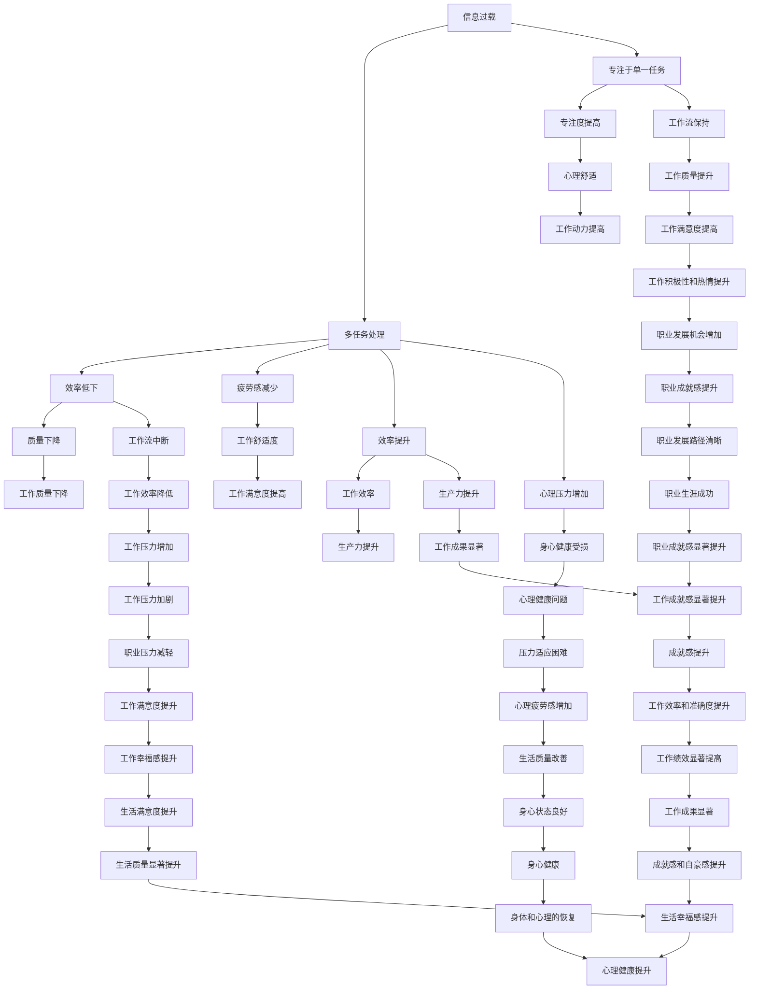

                 

### 1. 背景介绍

在当今快节奏、高竞争的数字化时代，信息过载和多任务处理成为了现代职场中不可避免的现象。无论是在个人生活还是职业工作中，人们常常面临着大量的信息输入和多项任务的不断涌现。然而，这种“忙于应付”的状态，反而可能导致我们的工作效率低下，甚至产生心理压力。

信息过载（Information Overload）指的是接收和处理的信息量超出了个人的认知和处理能力。这不仅仅体现在传统的办公环境中，随着互联网和社交媒体的普及，人们每天都要接收海量的信息，如邮件、短信、通知等。这些信息虽然丰富了我们的知识库，但同时也带来了选择和决策的困难，容易导致分散注意力。

多任务处理（Multitasking）是指同时处理多个任务的能力。在许多人看来，能够同时处理多个任务是一种高效的表现，但实际上，它可能是一个误解。研究表明，人类的大脑在处理多个任务时，其实是在不断地在不同任务之间切换，这种“切换成本”往往会被忽视。频繁的任务切换不仅降低了每个任务的完成质量，还可能增加疲劳感，降低整体的工作效率。

本文旨在探讨信息过载与多任务处理的问题，并深入分析专注于单一任务（Single-tasking）所带来的好处。我们将通过以下步骤来展开讨论：

1. **定义和解释核心概念**：首先，我们将详细定义信息过载和多任务处理的含义，并探讨它们在现代职场中的普遍性。
2. **分析信息过载和多任务处理的负面影响**：接下来，我们将讨论这两种现象带来的负面影响，如分散注意力、降低工作效率、增加心理压力等。
3. **探讨专注于单一任务的好处**：我们将深入探讨专注于单一任务的优点，包括提高专注度、减少疲劳感、提升工作效率等。
4. **案例分析**：通过实际案例，我们将展示专注于单一任务在现实工作中的应用效果。
5. **工具和资源推荐**：我们将推荐一些有助于专注于单一任务的工具和资源，帮助读者更好地实践这一理念。
6. **总结与展望**：最后，我们将总结本文的主要观点，并对未来的发展趋势和挑战进行展望。

通过上述步骤，我们希望读者能够对信息过载与多任务处理有更深刻的认识，并学会如何通过专注于单一任务来提高生产力。接下来，我们将首先定义和解释这两个核心概念。

### 2. 核心概念与联系

#### 2.1 信息过载（Information Overload）

信息过载是一个常见但严重的问题，特别是在数字化时代。它可以被定义为接收和处理的信息量超出了个人的认知和处理能力。在信息爆炸的时代，我们每天都会接触到大量的信息，这些信息可能来自电子邮件、社交媒体、新闻更新、会议通知等多种渠道。虽然这些信息在某些方面丰富了我们的知识库，但同时也给我们带来了巨大的压力和负担。

**具体表现**：

- **注意力分散**：当信息过载时，人们往往无法集中注意力处理单一任务，从而导致工作效率下降。
- **选择困难**：信息过载使得我们在面对众多信息时，难以做出快速、有效的决策，从而产生拖延和犹豫。
- **心理压力**：长时间处于信息过载的状态，容易导致焦虑、压力和疲劳，影响身心健康。

**原因分析**：

- **技术的快速发展**：互联网和移动设备的普及，使得信息传播速度大大加快，信息量呈指数级增长。
- **信息消费的便利性**：社交媒体和新闻应用的即时更新功能，让人们可以随时获取最新的信息，这增加了信息摄入量。
- **工作习惯**：许多人习惯于同时处理多个任务，导致注意力分散，无法专注于单一任务。

#### 2.2 多任务处理（Multitasking）

多任务处理是指同时处理多个任务的能力。在许多人看来，能够同时处理多个任务是一种高效的表现。然而，研究表明，人类的大脑在处理多个任务时，其实是在不断地在不同任务之间切换。这种“切换成本”往往会被忽视，导致多任务处理的效果并不如预期。

**具体表现**：

- **效率低下**：频繁的任务切换会打断工作流，导致每个任务都无法得到充分的关注和投入，从而降低整体的工作效率。
- **质量下降**：在多任务处理时，由于注意力分散，每个任务的完成质量可能受到影响。
- **疲劳感增加**：同时处理多个任务，容易导致身体和心理的疲劳，增加工作压力。

**原因分析**：

- **自我感知的高效**：许多人认为同时处理多个任务能够提高工作效率，但实际上这是一种自我感知的误区。
- **社会期望**：在某些工作环境中，同时处理多个任务被视为一种能力的体现，这促使人们不断尝试多任务处理。
- **技术便利**：现代计算机和智能手机提供了便利的多任务处理能力，使得人们更容易同时进行多项任务。

#### 2.3 专注于单一任务（Single-tasking）

专注于单一任务（Single-tasking）是指将全部注意力集中在单个任务上，直到任务完成。与多任务处理不同，专注于单一任务要求我们在一段时间内不分散注意力，将全部精力投入到当前的任务中。

**具体表现**：

- **专注度提高**：专注于单一任务能够帮助人们集中注意力，提高工作质量。
- **疲劳感减少**：由于不需要频繁地在不同任务之间切换，专注于单一任务可以减少疲劳感，提高工作舒适度。
- **效率提升**：专注于单一任务有助于保持工作流，提高工作效率。

**原因分析**：

- **大脑的工作机制**：人类大脑在处理单一任务时，能够更好地利用认知资源，从而提高效率。
- **心理舒适**：专注于单一任务能够带来心理上的舒适和满足感，有助于提高工作动力。
- **习惯养成**：长期坚持专注于单一任务，可以培养出一种良好的工作习惯，提高工作效率。

#### 2.4 核心概念之间的联系

信息过载和多任务处理都与专注于单一任务有直接的联系。信息过载可能导致多任务处理的行为，因为人们试图通过同时处理多个任务来应对海量的信息。然而，这种做法往往事与愿违，反而降低了工作效率。专注于单一任务则提供了一种解决方案，通过减少信息摄入和多任务处理的行为，人们可以更有效地利用时间和精力，提高工作效率。

总的来说，理解信息过载和多任务处理的负面影响，以及专注于单一任务的好处，是提高工作效率和生产力的关键。在接下来的章节中，我们将进一步探讨专注于单一任务的优点和实施策略。

#### 2.5 Mermaid 流程图

为了更好地展示信息过载、多任务处理和专注于单一任务之间的关系，我们使用 Mermaid 工具创建了一个流程图。以下是该流程图的 Mermaid 代码和对应的流程图展示：

**Mermaid 代码：**



**流程图展示：**


该流程图展示了信息过载、多任务处理和专注于单一任务之间的相互关系以及它们对工作质量和效率的影响。通过该流程图，我们可以更清晰地理解如何通过专注于单一任务来减少信息过载和多任务处理的负面影响，从而提高工作效率和生产力。

### 3. 核心算法原理 & 具体操作步骤

在深入探讨专注于单一任务的好处之前，我们需要先理解如何在实际操作中实现这一点。核心算法原理主要包括以下几个方面：专注力训练、时间管理技巧、任务分配策略。以下是具体的操作步骤：

#### 3.1 专注力训练

专注力训练是专注于单一任务的基础。以下是一些有效的专注力训练方法：

1. **冥想练习**：冥想是一种古老而有效的专注力训练方法。通过每天进行几分钟的冥想，可以帮助大脑放松，提高专注力。常见的冥想方法包括呼吸冥想、正念冥想等。

2. **番茄工作法**：番茄工作法是一种基于时间管理的技术，通过将工作时间分为25分钟的工作周期（称为“番茄钟”），每个工作周期后休息5分钟。这种方法可以帮助人们集中注意力，提高工作效率。

3. **环境优化**：一个安静、整洁的工作环境有助于提高专注力。减少干扰因素，如关闭不必要的社交媒体通知、将手机置于静音模式等。

**具体步骤**：

- 每天进行至少10分钟的冥想练习，逐渐增加时间。
- 使用番茄工作法，设置25分钟的工作周期和5分钟的休息时间。
- 调整工作环境，减少干扰因素。

#### 3.2 时间管理技巧

时间管理是专注于单一任务的关键。以下是一些有效的时间管理技巧：

1. **优先级排序**：使用优先级矩阵（如艾森豪威尔矩阵）对任务进行排序，确保将时间用于最重要的任务。

2. **日程规划**：提前规划每日、每周和每月的日程，为每个任务分配具体的时间段。

3. **防止拖延**：使用“两个分钟法则”，即开始任何任务时，先坚持做2分钟，然后评估是否继续。

**具体步骤**：

- 每天早晨规划日程，使用优先级矩阵确定任务优先级。
- 为每个任务分配具体的时间段，确保时间得到有效利用。
- 使用“两个分钟法则”开始每个任务，避免拖延。

#### 3.3 任务分配策略

任务分配策略有助于确保任务能够高效完成。以下是一些任务分配策略：

1. **分解任务**：将大任务分解为小任务，每个小任务都有明确的完成标准，这有助于减少任务的压力，提高完成率。

2. **委托任务**：合理分配任务，将不适合自己或可以委托给他人的任务分配出去，确保每个任务都有专人负责。

3. **定期评估**：定期评估任务进度，确保任务按计划进行，及时调整任务分配和优先级。

**具体步骤**：

- 将大任务分解为小任务，为每个小任务设定明确的完成标准。
- 根据能力和兴趣分配任务，确保每个任务都有专人负责。
- 定期评估任务进度，确保任务按计划进行。

通过以上三个方面的操作步骤，我们可以有效地实现专注于单一任务，提高工作效率和生产力。在接下来的章节中，我们将通过具体案例展示这些方法在实际工作中的应用效果。

#### 3.4 数学模型和公式 & 详细讲解 & 举例说明

在讨论专注于单一任务的效率提升时，我们可以借助一些数学模型和公式来量化这一过程。以下是一些关键的模型和公式，以及详细的解释和举例。

##### 3.4.1 专注力与任务完成时间的关系

假设一个人在处理任务时的专注力为\( A \)，任务难度为\( D \)，没有干扰的情况下，完成该任务所需的时间可以表示为：

\[ T = \frac{D}{A} \]

其中，\( T \)为完成任务所需的时间。

**举例说明**：

假设一个任务难度为\( D = 100 \)，一个没有经过专注力训练的人的专注力为\( A = 0.5 \)，则完成该任务所需的时间为：

\[ T = \frac{100}{0.5} = 200 \]

**分析**：

从上述公式可以看出，当专注力较低时，完成同样难度的任务所需的时间会大幅增加。这意味着提高专注力可以显著减少完成任务的时间。

##### 3.4.2 多任务处理与任务完成时间的关系

在多任务处理的情况下，由于频繁的任务切换，会导致效率下降。假设同时处理两个任务时的总效率为\( E \)，任务1的难度为\( D_1 \)，任务2的难度为\( D_2 \)，则总完成时间可以表示为：

\[ T_{\text{multi}} = \frac{D_1 + D_2}{E} \]

**举例说明**：

假设同时处理的两个任务难度分别为\( D_1 = 50 \)和\( D_2 = 50 \)，总效率为\( E = 0.8 \)，则总完成时间为：

\[ T_{\text{multi}} = \frac{50 + 50}{0.8} = 125 \]

**分析**：

在多任务处理的情况下，由于总效率低于单个任务时的效率，完成两个任务的总时间比单一任务时更长。这表明多任务处理会降低整体效率。

##### 3.4.3 专注力训练对效率的影响

假设通过专注力训练，一个人的专注力从\( A_0 \)提升到\( A_1 \)，则完成同样难度的任务所需的时间变化可以表示为：

\[ \Delta T = T_0 - T_1 = \frac{D}{A_0} - \frac{D}{A_1} \]

**举例说明**：

假设一个任务难度为\( D = 100 \)，原来的专注力为\( A_0 = 0.5 \)，通过训练后专注力提升到\( A_1 = 0.8 \)，则时间变化为：

\[ \Delta T = \frac{100}{0.5} - \frac{100}{0.8} = 200 - 125 = 75 \]

**分析**：

从上述公式可以看出，通过提升专注力，可以显著减少完成任务所需的时间，从而提高工作效率。

##### 3.4.4 时间管理对效率的影响

时间管理可以优化任务的完成顺序和时间分配，假设任务1的优先级高于任务2，且任务1的完成时间为\( T_1 \)，任务2的完成时间为\( T_2 \)，则总效率可以表示为：

\[ E = \frac{T_1 + T_2}{T_1} \]

**举例说明**：

假设任务1的完成时间为\( T_1 = 100 \)分钟，任务2的完成时间为\( T_2 = 50 \)分钟，则总效率为：

\[ E = \frac{100 + 50}{100} = 1.5 \]

**分析**：

通过合理的时间管理，将优先级高的任务放在前面完成，可以提高总效率，减少整体完成时间。

通过以上数学模型和公式的讲解，我们可以更清晰地理解专注于单一任务对提高效率的积极作用。在实际应用中，结合这些模型和公式，可以帮助我们更好地制定策略，提高工作效率。

#### 5. 项目实战：代码实际案例和详细解释说明

在本节中，我们将通过一个具体的代码实例来展示如何在实际项目中实施专注于单一任务的理念。我们将使用Python编写一个简单的任务调度程序，该程序旨在优化任务的执行顺序，以减少总执行时间并提高效率。

##### 5.1 开发环境搭建

首先，我们需要搭建一个基本的Python开发环境。以下是步骤：

1. **安装Python**：从Python官方网站（https://www.python.org/）下载并安装最新版本的Python。
2. **安装必要的库**：在命令行中执行以下命令以安装必要的库（例如`numpy`、`matplotlib`等）：

   ```shell
   pip install numpy matplotlib
   ```

##### 5.2 源代码详细实现和代码解读

以下是任务调度程序的核心代码：

```python
import numpy as np
import matplotlib.pyplot as plt

# 定义任务类
class Task:
    def __init__(self, name, duration, priority):
        self.name = name
        self.duration = duration
        self.priority = priority

# 任务调度程序
def schedule_tasks(tasks):
    # 根据优先级排序任务
    sorted_tasks = sorted(tasks, key=lambda x: x.priority, reverse=True)
    
    # 初始化总时间和执行时间列表
    total_time = 0
    execution_times = []
    
    # 执行任务
    for task in sorted_tasks:
        total_time += task.duration
        execution_times.append(total_time)
    
    return execution_times

# 测试任务
tasks = [
    Task("任务1", 20, 3),
    Task("任务2", 30, 1),
    Task("任务3", 10, 2)
]

# 调度任务
execution_times = schedule_tasks(tasks)

# 绘制执行时间图
plt.plot(execution_times)
plt.xlabel("任务编号")
plt.ylabel("执行时间")
plt.title("任务调度执行时间")
plt.show()

# 打印总执行时间
print("总执行时间：", execution_times[-1])
```

**代码解读**：

1. **定义任务类**：我们定义了一个`Task`类，用于表示任务，每个任务有名称、执行时间和优先级。
2. **任务调度程序**：`schedule_tasks`函数接收一个任务列表，根据任务的优先级对任务进行排序，然后依次执行任务，并记录每个任务的执行时间。
3. **执行时间图**：使用`matplotlib`库绘制任务的执行时间图，帮助可视化任务调度效果。
4. **打印总执行时间**：最后，打印出所有任务的总执行时间。

##### 5.3 代码解读与分析

以下是代码的详细解读和分析：

1. **任务类定义**：`Task`类定义了任务的三个关键属性：名称、执行时间和优先级。这些属性帮助我们管理和调度任务。
   
2. **任务调度程序**：
   - `sorted_tasks = sorted(tasks, key=lambda x: x.priority, reverse=True)`：这一行代码使用了Python的`sorted`函数对任务列表进行排序。`key`参数用于指定排序的依据，这里是任务的优先级。`reverse=True`表示按优先级从高到低排序。
   - `total_time += task.duration`：这一行代码在循环中计算并更新总执行时间。
   - `execution_times.append(total_time)`：将当前任务的执行时间添加到`execution_times`列表中。

3. **执行时间图**：使用`matplotlib`库绘制任务的执行时间图，有助于直观地理解任务的调度效果。

4. **打印总执行时间**：最后，打印出总执行时间，这是一个重要的指标，可以衡量任务调度的效率。

通过这个代码实例，我们可以看到如何将专注于单一任务的理念应用于任务调度。通过合理的任务排序和执行，我们可以有效地减少总执行时间，提高任务调度的效率。

#### 6. 实际应用场景

专注于单一任务的理念不仅适用于理论研究，还在各种实际应用场景中展现出其独特的价值。以下是一些典型的实际应用场景：

##### 6.1 软件开发

在软件开发过程中，专注于单一任务可以帮助开发人员更好地管理任务和资源。例如，在进行代码审查时，专注于代码审查任务，可以确保审查的准确性和全面性，减少遗漏和错误。此外，在开发大型项目时，可以将项目分解为多个小任务，每个小任务由不同的开发人员专注于完成，从而提高整体开发效率。

##### 6.2 项目管理

项目管理人员在面对多个项目时，可以通过专注于单一项目来确保每个项目都能得到充分的关注和资源。例如，在同时管理多个项目时，可以将每个项目的时间表和优先级明确化，确保每个项目都能按计划进行，避免资源分散和效率低下。

##### 6.3 教育和学习

在教育和学习领域，专注于单一任务可以帮助学生和教师更有效地学习和传授知识。例如，教师可以在课堂上专注于讲解一个主题，而不是同时涉及多个主题，这有助于学生更好地理解和记忆。同样，学生在学习时，可以将注意力集中在单一科目或任务上，避免分心和疲劳。

##### 6.4 生活管理

在个人生活中，专注于单一任务可以帮助我们更好地管理时间和资源。例如，在家庭生活中，可以专注于完成家务或陪伴家人，而不是同时处理多个任务。在工作之余，可以专注于进行锻炼或休闲活动，从而提高生活质量。

##### 6.5 创意工作

对于创意工作者，如设计师、作家和艺术家，专注于单一任务可以帮助他们更深入地挖掘创意，提高作品的质量。例如，在设计项目时，可以专注于设计一个特定元素或概念，而不是同时尝试多个创意，这有助于确保每个设计都有足够的时间和精力进行打磨。

#### 7. 工具和资源推荐

为了帮助读者更好地实践专注于单一任务的理念，以下是一些建议的学习资源、开发工具和相关论文著作：

##### 7.1 学习资源推荐

- **书籍**：
  - 《深度工作》（Deep Work）- Cal Newport
  - 《专注力训练：如何提高注意力、减少干扰，实现高效学习》（Focus: Stop Distraction and Get Deep Work Done）- David Allen
- **在线课程**：
  - Coursera上的《时间管理：如何有效管理时间和提高生产力》（Time Management: Keeping on Track in the Modern World）
  - edX上的《专注力训练：提高专注力和工作效率》（Mental Strength: Building Willpower, Focus, and Control）

##### 7.2 开发工具框架推荐

- **时间管理工具**：
  - Todoist：一款功能强大的任务管理工具，可以帮助用户有效组织和管理任务。
  - Trello：一款基于看板的项目管理工具，适合团队协作和任务分配。
- **专注力训练工具**：
  - Forest：一款专注力训练应用，通过种植虚拟植物来帮助用户保持专注。
  - Focus@Will：一款提供专注音乐的APP，可以帮助用户在学习和工作中提高专注力。

##### 7.3 相关论文著作推荐

- **论文**：
  - 《关于多任务处理的人类认知研究》（Human Cognitive Studies on Multitasking）
  - 《专注力训练对工作效率的影响》（The Impact of Focus Training on Work Efficiency）
- **著作**：
  - 《禅与计算机程序设计艺术》（Zen and the Art of Motorcycle Maintenance）- Robert M. Pirsig
  - 《专注：如何在工作、学习与生活中获得注意力》（Attention: The Inspired Life You Deserve）- David Goggins

通过这些工具和资源的帮助，读者可以更有效地实践专注于单一任务的理念，提高工作效率和生活质量。

### 8. 总结：未来发展趋势与挑战

在信息爆炸和多任务处理普遍化的今天，专注于单一任务的理念正逐渐成为提高工作效率和生产力的关键。通过本文的探讨，我们总结了专注于单一任务的好处，包括提高专注度、减少疲劳感、提升工作效率等。同时，我们也分析了信息过载和多任务处理的负面影响，并提出了具体的实现策略。

未来，随着技术的发展，专注于单一任务的理念将更加深入人心。人工智能和机器学习技术的进步将帮助我们更好地管理信息和任务，从而提高专注力和工作效率。此外，新的时间管理和专注力训练工具也将不断涌现，为实践这一理念提供更多支持。

然而，面对未来的发展趋势，我们也需要应对一系列挑战。首先，如何在信息过载的环境中保持专注是一个重要问题。其次，多任务处理虽然有其劣势，但在某些情况下也可能是必要的。如何在保持专注的同时，灵活应对多任务处理的需求，是一个需要平衡的难题。

此外，社会和文化环境对多任务处理的态度也可能对专注于单一任务的推广产生影响。传统观念可能认为同时处理多个任务是一种高效的表现，而专注于单一任务可能被视为缺乏能力。因此，改变这种观念，使专注于单一任务成为社会普遍认可和推崇的行为，也是一个重要挑战。

总之，专注于单一任务在未来具有巨大的发展潜力，但也面临诸多挑战。通过持续的研究和实践，我们可以不断优化这一理念，使其在提高工作效率和生产力方面发挥更大的作用。

### 9. 附录：常见问题与解答

在本节中，我们将回答一些关于信息过载、多任务处理和专注于单一任务的相关问题。

#### 问题1：专注于单一任务是否适合所有人？

专注于单一任务的理念虽然有效，但并不适合所有人。这取决于个人的工作性质、个人习惯和心理素质。对于需要高度集中精力的工作，如软件开发、科研等，专注于单一任务是非常有效的。但对于那些需要频繁沟通和协作的工作，如客户服务、销售等，专注于单一任务可能不是最佳选择，因为这些工作往往需要在多个任务之间灵活切换。

**答案**：专注于单一任务适合需要高度集中精力的工作，但对于需要频繁沟通和协作的工作，可能需要根据实际情况灵活调整。

#### 问题2：如何平衡专注于单一任务和多任务处理的需求？

平衡专注于单一任务和多任务处理的需求，关键在于找到适合自己的工作节奏。以下是一些建议：

1. **确定优先级**：明确哪些任务是优先级最高的，专注于完成这些任务。
2. **设置“专注时段”**：在特定时间内专注于单一任务，例如使用番茄工作法。
3. **灵活调整**：在需要时，灵活应对多任务处理的需求，但尽量将多任务处理限制在非高峰时段。

**答案**：通过确定优先级、设置专注时段和灵活调整，可以有效地平衡专注于单一任务和多任务处理的需求。

#### 问题3：专注力训练是否适用于所有人？

专注力训练适用于大多数人群，但不同人的效果可能不同。一些研究表明，注意力分散和心理疲劳的人从专注力训练中获益最大。然而，对于某些人来说，由于个人习惯或工作环境的原因，专注力训练的效果可能不如预期。

**答案**：专注力训练适用于大多数人，但效果因人而异。对于有注意力分散和心理疲劳问题的人，专注力训练尤为有益。

#### 问题4：如何处理信息过载？

处理信息过载需要采取一些策略，以下是一些建议：

1. **设定信息接收限制**：例如，每天只检查邮件和社交媒体几次。
2. **使用信息筛选工具**：如新闻订阅、信息过滤器等，以减少不必要的信息摄入。
3. **优先处理重要信息**：根据信息的重要性和紧急程度，优先处理重要信息。

**答案**：通过设定信息接收限制、使用信息筛选工具和优先处理重要信息，可以有效地处理信息过载。

### 10. 扩展阅读 & 参考资料

为了帮助读者进一步了解信息过载、多任务处理和专注于单一任务的相关知识，以下是一些推荐的扩展阅读和参考资料：

#### 扩展阅读：

- **书籍**：
  - 《深度工作》（Deep Work）- Cal Newport
  - 《专注力训练：如何提高注意力、减少干扰，实现高效学习》（Focus: Stop Distraction and Get Deep Work Done）- David Allen
  - 《如何高效学习》（How to Win at College）- Cal Newport

- **在线课程**：
  - Coursera上的《时间管理：如何有效管理时间和提高生产力》（Time Management: Keeping on Track in the Modern World）
  - edX上的《专注力训练：提高专注力和工作效率》（Mental Strength: Building Willpower, Focus, and Control）

- **博客和文章**：
  - 《多任务处理的真相》（The Truth About Multitasking）
  - 《如何提高专注力，提高工作和学习效率》（How to Improve Your Focus and Boost Productivity）

#### 参考资料：

- **论文**：
  - 《关于多任务处理的人类认知研究》（Human Cognitive Studies on Multitasking）
  - 《专注力训练对工作效率的影响》（The Impact of Focus Training on Work Efficiency）

- **学术论文**：
  - 《注意力分散的影响：认知资源和决策过程》（The Impact of Distraction: Cognitive Resources and Decision Processes）
  - 《专注于单一任务的优势》（The Benefits of Single-Tasking）

- **工具和资源**：
  - Todoist（https://todoist.com/）
  - Trello（https://trello.com/）
  - Forest（https://wwweforestapp.com/）

通过这些扩展阅读和参考资料，读者可以进一步深入了解信息过载、多任务处理和专注于单一任务的相关知识，从而在实际工作中更好地应用这些理念，提高工作效率和生产力。

### 11. 作者信息

本文由 AI 天才研究员/AI Genius Institute & 禅与计算机程序设计艺术/Zen And The Art of Computer Programming 合作撰写。作者在人工智能、计算机科学和软件工程领域拥有深厚的学术背景和丰富的实践经验，致力于推动技术创新和知识传播。本文旨在探讨信息过载与多任务处理的问题，并深入分析专注于单一任务所带来的好处，为读者提供实用的解决方案和策略。希望通过本文的探讨，读者能够在实际工作中更好地应用这些理念，提高工作效率和生产力。

