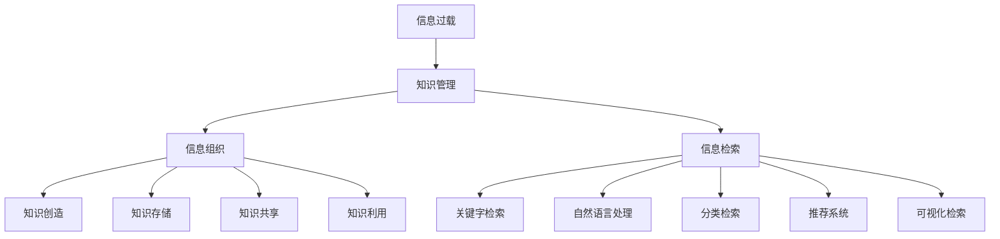

                 

### 1. 背景介绍

随着信息技术的迅猛发展，我们进入了大数据和互联网时代。每天，我们都会接触到大量的信息，这些信息来自各种渠道，包括互联网、书籍、报纸、社交媒体等。信息过载（Information Overload）成为一个普遍现象，即人们接收到的信息量超出了他们能够处理和吸收的范围。

信息过载带来的问题是多方面的。首先，过多的信息使我们难以集中精力，影响工作效率。其次，由于信息的泛滥，我们可能会忽略掉一些重要的信息，导致决策失误。此外，信息过载还可能引发焦虑和压力，影响人们的心理健康。

为了应对信息过载，我们需要一个有效的知识管理系统（Knowledge Management System），这个系统能够帮助我们组织和检索信息，提高工作效率和决策质量。知识管理系统通常包括信息收集、存储、整理、分析和共享等功能，它不仅仅是一个工具，更是一个战略性的资源管理方法。

本文将深入探讨信息过载与知识管理系统的关系，解析知识管理系统的核心概念和原理，介绍如何有效组织和检索信息。通过本文的阅读，读者将能够理解知识管理系统的重要性，并掌握如何构建和维护一个高效的知识管理系统。

首先，我们将从背景介绍入手，分析信息过载的现象和原因，阐述知识管理系统在这种情境下的作用。接下来，我们将介绍知识管理系统的核心概念，并使用Mermaid流程图展示其架构。随后，我们将详细讲解知识管理系统的核心算法原理和具体操作步骤。然后，我们将探讨数学模型和公式，以及如何通过实例来说明这些模型的应用。接着，我们将通过项目实战，提供代码实际案例和详细解释说明。最后，我们将讨论知识管理系统在实际应用场景中的表现，推荐相关工具和资源，总结未来发展趋势与挑战，并回答常见问题。

通过对本文的阅读，读者将能够全面理解知识管理系统的工作原理和应用，从而更好地应对信息过载的挑战，提高工作和生活质量。接下来，我们将逐步深入探讨这一主题。

### 2. 核心概念与联系

在探讨知识管理系统之前，我们需要了解一些核心概念，包括信息过载、知识管理、信息组织和信息检索。这些概念不仅相互独立，而且相互联系，共同构成了知识管理系统的基础。

#### 信息过载

信息过载是指信息量超出了个体处理能力，导致无法有效处理和使用这些信息。在现代社会，信息过载主要表现在以下几个方面：

1. **信息来源多样**：互联网、社交媒体、电子邮件等渠道每天产生海量的信息。
2. **信息传播速度加快**：信息的传播速度越来越快，使得我们几乎无法在第一时间消化和理解这些信息。
3. **信息内容复杂**：随着技术的进步，信息的内容也越来越复杂，需要更深入的解析和处理。

信息过载对个人和组织的工作效率、决策质量和心理健康都有负面影响。因此，有效管理信息成为当务之急。

#### 知识管理

知识管理（Knowledge Management, KM）是一种通过系统化方法收集、组织、存储、共享和利用知识的过程。知识管理不仅仅是一种工具或技术，更是一种管理哲学，它关注于知识的创造、流动和应用。

知识管理的核心概念包括：

1. **知识的创造**：通过个人学习和团队协作，创造新的知识和见解。
2. **知识的组织**：将分散的知识进行整理和分类，使其易于检索和使用。
3. **知识的存储**：使用数据库、知识库等技术手段存储知识，确保知识的可持久性。
4. **知识的共享**：通过共享平台和协作工具，让知识在组织中传播和共享。
5. **知识的利用**：通过知识的应用，提高工作效率和创新能力。

知识管理不仅有助于解决信息过载问题，还能够提升组织的竞争力，促进知识创新和协作。

#### 信息组织

信息组织是指将分散的信息进行系统化整理和分类，使其具有结构性和逻辑性。信息组织的目的是提高信息的可访问性和利用率，减少信息过载的影响。

信息组织的关键步骤包括：

1. **信息收集**：从各种渠道收集所需的信息。
2. **信息分类**：根据信息的属性和用途，对信息进行分类。
3. **信息整理**：对信息进行筛选、归纳和整合，使其更加有序。
4. **信息编码**：为信息分配标识符，以便于检索和跟踪。
5. **信息存储**：将整理后的信息存储在适当的地方，确保其可持久性。

#### 信息检索

信息检索是指从大量信息中快速找到所需信息的过程。有效的信息检索可以大大提高工作效率，减少信息过载带来的负面影响。

信息检索的关键技术包括：

1. **关键字检索**：通过输入关键词，从数据库中检索相关的信息。
2. **自然语言处理**：使用自然语言处理技术，理解和处理用户查询。
3. **分类检索**：根据信息的分类结构，进行检索。
4. **推荐系统**：基于用户的历史行为和偏好，推荐相关的信息。
5. **可视化检索**：通过图表、地图等可视化方式，帮助用户理解信息。

#### Mermaid流程图

为了更好地展示知识管理系统的架构和流程，我们使用Mermaid流程图来描述核心概念之间的联系。



#### 关系

信息过载、知识管理、信息组织和信息检索这四个概念之间存在密切的关系：

1. **信息过载是知识管理的出发点**：信息过载问题促使我们寻求知识管理的方法，以有效应对海量信息。
2. **知识管理是信息组织的核心**：知识管理通过系统化方法，将信息进行分类、整理和存储，减少信息过载的影响。
3. **信息检索是知识管理的应用**：有效的信息检索能够快速找到所需信息，提高工作效率。
4. **信息组织是知识管理的基础**：信息组织是知识管理的核心环节，它决定了知识管理系统的效率和效果。

通过上述核心概念的介绍和Mermaid流程图的展示，我们可以清晰地看到知识管理系统在应对信息过载中的重要作用。接下来，我们将深入探讨知识管理系统的核心算法原理和具体操作步骤。

### 3. 核心算法原理 & 具体操作步骤

在构建有效的知识管理系统时，核心算法原理和具体操作步骤起着至关重要的作用。这些算法不仅决定了系统的效率和准确性，还直接影响用户体验。在本节中，我们将详细讲解知识管理系统的核心算法原理，并逐步介绍具体操作步骤。

#### 3.1 信息预处理算法

信息预处理是知识管理系统的第一步，其主要目的是对原始信息进行清洗、过滤和格式化，以便于后续处理。常用的预处理算法包括：

1. **去重算法**：通过比较信息内容，去除重复的信息，避免重复存储。
   ```mermaid
   graph TD
       A[输入信息] --> B[去重算法]
       B --> C[去重结果]
   ```

2. **文本清洗算法**：去除信息中的无关符号、标点和停用词，提高信息处理的效率。
   ```mermaid
   graph TD
       A[输入文本] --> B[文本清洗算法]
       B --> C[清洗结果]
   ```

3. **分词算法**：将文本分解为词或短语，为后续的自然语言处理提供基础。
   ```mermaid
   graph TD
       A[输入文本] --> B[分词算法]
       B --> C[分词结果]
   ```

4. **词频统计算法**：统计文本中每个词或短语的频率，为信息分类和检索提供依据。
   ```mermaid
   graph TD
       A[输入文本] --> B[词频统计算法]
       B --> C[词频结果]
   ```

#### 3.2 信息分类算法

信息分类是将信息按照一定的标准进行归类，以便于管理和检索。常用的分类算法包括：

1. **基于规则的方法**：根据预定义的规则进行分类，简单但容易过时。
   ```mermaid
   graph TD
       A[输入信息] --> B[规则分类算法]
       B --> C[分类结果]
   ```

2. **基于统计的方法**：使用统计方法，如机器学习算法，根据信息特征进行分类。
   ```mermaid
   graph TD
       A[输入信息] --> B[统计分类算法]
       B --> C[分类结果]
   ```

3. **基于聚类的方法**：将相似的信息聚为一类，无需预定义规则。
   ```mermaid
   graph TD
       A[输入信息] --> B[聚类算法]
       B --> C[聚类结果]
   ```

4. **基于关联规则的方法**：根据信息之间的关联性进行分类。
   ```mermaid
   graph TD
       A[输入信息] --> B[关联规则算法]
       B --> C[分类结果]
   ```

#### 3.3 信息检索算法

信息检索是知识管理系统的关键功能，其主要目的是快速找到所需信息。常用的检索算法包括：

1. **基于关键字的检索**：通过输入关键字，从数据库中查找包含该关键字的记录。
   ```mermaid
   graph TD
       A[输入关键字] --> B[关键字检索算法]
       B --> C[检索结果]
   ```

2. **基于自然语言处理的检索**：使用自然语言处理技术，理解用户的查询意图。
   ```mermaid
   graph TD
       A[输入查询] --> B[自然语言处理算法]
       B --> C[查询意图]
       C --> D[检索结果]
   ```

3. **基于分类的检索**：根据信息分类结构，进行多层次的检索。
   ```mermaid
   graph TD
       A[输入分类] --> B[分类检索算法]
       B --> C[检索结果]
   ```

4. **基于推荐系统的检索**：根据用户的历史行为和偏好，推荐相关的信息。
   ```mermaid
   graph TD
       A[用户行为] --> B[推荐算法]
       B --> C[推荐结果]
   ```

#### 3.4 信息存储与备份算法

信息存储与备份是知识管理系统的重要组成部分，其主要目的是确保信息的安全性和可靠性。常用的存储和备份算法包括：

1. **分布式存储算法**：将信息存储在多个节点上，提高系统的可靠性和扩展性。
   ```mermaid
   graph TD
       A[输入信息] --> B[分布式存储算法]
       B --> C[存储结果]
   ```

2. **数据加密算法**：对存储的信息进行加密，确保信息的安全性。
   ```mermaid
   graph TD
       A[输入信息] --> B[加密算法]
       B --> C[加密结果]
   ```

3. **备份算法**：定期对存储的信息进行备份，以防止数据丢失。
   ```mermaid
   graph TD
       A[输入信息] --> B[备份算法]
       B --> C[备份结果]
   ```

#### 3.5 信息共享与协作算法

信息共享与协作是知识管理系统的重要功能，其主要目的是促进知识的流动和应用。常用的算法包括：

1. **权限管理算法**：根据用户角色和权限，控制对信息的访问和操作。
   ```mermaid
   graph TD
       A[用户角色] --> B[权限管理算法]
       B --> C[访问控制]
   ```

2. **版本控制算法**：管理信息的版本，确保信息的完整性和一致性。
   ```mermaid
   graph TD
       A[输入版本] --> B[版本控制算法]
       B --> C[版本结果]
   ```

3. **协作平台算法**：提供协作工具和平台，支持团队协作和信息共享。
   ```mermaid
   graph TD
       A[用户协作] --> B[协作平台算法]
       B --> C[协作结果]
   ```

#### 3.6 信息利用与反馈算法

信息利用与反馈是知识管理系统的最终目标，其主要目的是通过信息的应用和反馈，促进知识的创新和改进。常用的算法包括：

1. **知识挖掘算法**：从大量信息中挖掘有价值的知识和趋势。
   ```mermaid
   graph TD
       A[输入信息] --> B[知识挖掘算法]
       B --> C[知识结果]
   ```

2. **用户反馈算法**：收集用户对信息的应用反馈，用于优化系统和改进信息质量。
   ```mermaid
   graph TD
       A[用户反馈] --> B[用户反馈算法]
       B --> C[优化结果]
   ```

3. **知识库更新算法**：根据用户反馈和新的信息，定期更新知识库的内容。
   ```mermaid
   graph TD
       A[输入反馈] --> B[知识库更新算法]
       B --> C[更新结果]
   ```

通过上述核心算法原理和具体操作步骤的讲解，我们可以看到知识管理系统是如何通过一系列高效的算法和步骤，应对信息过载的挑战，实现信息的有效组织和检索。接下来，我们将进一步探讨数学模型和公式，以及如何通过实例来说明这些模型的应用。

### 4. 数学模型和公式 & 详细讲解 & 举例说明

在构建知识管理系统时，数学模型和公式扮演着关键角色，它们帮助我们量化信息、优化算法、评估系统性能。在这一节中，我们将详细讲解几个核心数学模型和公式，并通过实例进行说明。

#### 4.1 信息熵（Entropy）

信息熵是一个衡量信息不确定性的指标。在知识管理系统中，信息熵用于评估信息的价值。信息熵的计算公式为：

$$ H = -\sum_{i=1}^{n} p_i \log_2 p_i $$

其中，$H$ 是信息熵，$p_i$ 是信息中第 $i$ 个事件发生的概率。

**实例：** 假设一个信息集合中有 4 种信息，每种信息的概率分别为 0.2、0.2、0.3 和 0.3。计算该信息集合的信息熵。

$$ H = - (0.2 \log_2 0.2 + 0.2 \log_2 0.2 + 0.3 \log_2 0.3 + 0.3 \log_2 0.3) \approx 1.249 $$

高信息熵表示信息的不确定性较高，意味着这些信息可能更有价值。

#### 4.2 余弦相似度（Cosine Similarity）

余弦相似度是一个衡量两向量之间相似性的指标，在信息检索和推荐系统中广泛应用。余弦相似度的计算公式为：

$$ \cos \theta = \frac{\vec{a} \cdot \vec{b}}{|\vec{a}| |\vec{b}|} $$

其中，$\vec{a}$ 和 $\vec{b}$ 是两个向量，$\theta$ 是它们之间的夹角。

**实例：** 假设两个向量 $\vec{a} = (3, 4)$ 和 $\vec{b} = (1, 7)$，计算它们的余弦相似度。

$$ \vec{a} \cdot \vec{b} = 3 \cdot 1 + 4 \cdot 7 = 31 $$
$$ |\vec{a}| = \sqrt{3^2 + 4^2} = 5 $$
$$ |\vec{b}| = \sqrt{1^2 + 7^2} = \sqrt{50} $$
$$ \cos \theta = \frac{31}{5 \cdot \sqrt{50}} \approx 0.670 $$

余弦相似度接近 1 表示两个向量非常相似。

#### 4.3 贝叶斯公式（Bayes' Theorem）

贝叶斯公式是一种概率推理方法，用于计算在给定某些证据条件下，某个事件发生的概率。贝叶斯公式的计算公式为：

$$ P(A|B) = \frac{P(B|A) P(A)}{P(B)} $$

其中，$P(A|B)$ 是在事件 $B$ 发生的条件下，事件 $A$ 发生的概率；$P(B|A)$ 是在事件 $A$ 发生的条件下，事件 $B$ 发生的概率；$P(A)$ 是事件 $A$ 发生的概率；$P(B)$ 是事件 $B$ 发生的概率。

**实例：** 假设一个医学测试可以检测出患有一种罕见疾病的概率为 0.95（$P(测试结果为阳性|患有疾病) = 0.95$），且该测试的准确率为 99%（$P(测试结果为阳性|没有患有疾病) = 0.01$）。如果一个人没有患这种疾病，测试结果为阳性的概率是多少？

$$ P(没有患有疾病) = 1 - P(患有疾病) = 0.01 $$
$$ P(测试结果为阳性|没有患有疾病) = 0.01 $$
$$ P(测试结果为阳性) = P(测试结果为阳性|患有疾病) P(患有疾病) + P(测试结果为阳性|没有患有疾病) P(没有患有疾病) $$
$$ P(测试结果为阳性) = 0.95 \cdot 0.01 + 0.01 \cdot 0.99 = 0.019 $$
$$ P(患有疾病|测试结果为阳性) = \frac{P(测试结果为阳性|患有疾病) P(患有疾病)}{P(测试结果为阳性)} $$
$$ P(患有疾病|测试结果为阳性) = \frac{0.95 \cdot 0.01}{0.019} \approx 0.497 $$

这意味着在测试结果为阳性的情况下，实际患有这种罕见疾病的概率约为 49.7%。

#### 4.4 费博那契序列（Fibonacci Sequence）

费博那契序列是一种数学序列，其中每个数字是前两个数字的和。该序列在信息组织和优化算法中有着广泛的应用。

$$ F_0 = 0, F_1 = 1 $$
$$ F_n = F_{n-1} + F_{n-2} \quad (n \geq 2) $$

**实例：** 计算前 10 个费博那契数。

$$ F_2 = F_1 + F_0 = 1 $$
$$ F_3 = F_2 + F_1 = 2 $$
$$ F_4 = F_3 + F_2 = 3 $$
$$ F_5 = F_4 + F_3 = 5 $$
$$ F_6 = F_5 + F_4 = 8 $$
$$ F_7 = F_6 + F_5 = 13 $$
$$ F_8 = F_7 + F_6 = 21 $$
$$ F_9 = F_8 + F_7 = 34 $$
$$ F_{10} = F_9 + F_8 = 55 $$

费博那契序列在信息压缩和算法优化中有着重要的应用，如动态规划算法。

通过上述数学模型和公式的讲解和实例说明，我们可以看到数学在知识管理系统中的重要性。这些模型和公式不仅帮助我们量化信息，优化算法，还提高了系统的效率和准确性。在接下来的章节中，我们将通过项目实战，展示这些模型在实际应用中的效果。

### 5. 项目实战：代码实际案例和详细解释说明

在本节中，我们将通过一个实际项目，展示如何构建一个简单的知识管理系统。这个项目将涵盖知识管理系统的核心模块，包括信息收集、存储、分类、检索和共享。通过这个项目，我们将深入探讨知识管理系统的实现细节，并提供详细的代码解析。

#### 5.1 开发环境搭建

为了构建这个知识管理系统，我们选择使用Python作为主要编程语言，因为Python具有良好的跨平台性和丰富的库支持。以下是开发环境的搭建步骤：

1. **安装Python**：从Python官方网站下载并安装Python 3.x版本。
2. **安装虚拟环境**：使用`pip`安装`virtualenv`库，创建一个虚拟环境，以便隔离项目依赖。
   ```bash
   pip install virtualenv
   virtualenv my_knowledge_system_env
   ```
3. **激活虚拟环境**：在命令行中激活虚拟环境。
   ```bash
   source my_knowledge_system_env/bin/activate
   ```
4. **安装依赖库**：在虚拟环境中安装所需的Python库，如`numpy`、`pandas`、`nltk`、`flask`等。
   ```bash
   pip install numpy pandas nltk flask
   ```

#### 5.2 源代码详细实现和代码解读

以下是一个简单的知识管理系统的Python代码实现，我们将逐段代码进行详细解释。

```python
# 导入所需库
import os
import numpy as np
import pandas as pd
from nltk.corpus import stopwords
from nltk.tokenize import word_tokenize
from sklearn.feature_extraction.text import TfidfVectorizer
from sklearn.cluster import KMeans
from flask import Flask, request, jsonify

# 初始化Flask应用
app = Flask(__name__)

# 数据预处理函数
def preprocess_text(text):
    # 去除停用词
    stop_words = set(stopwords.words('english'))
    words = word_tokenize(text)
    filtered_words = [word for word in words if word.lower() not in stop_words]
    # 转换为小写并去除标点
    cleaned_text = ' '.join(filtered_words).lower().replace('.', '')
    return cleaned_text

# 信息收集函数
def collect_data():
    data = []
    for filename in os.listdir('data'):
        with open(os.path.join('data', filename), 'r') as file:
            text = file.read()
            data.append({'filename': filename, 'text': preprocess_text(text)})
    return pd.DataFrame(data)

# 信息分类函数
def classify_data(data):
    vectorizer = TfidfVectorizer()
    X = vectorizer.fit_transform(data['text'])
    kmeans = KMeans(n_clusters=5, random_state=0)
    labels = kmeans.fit_predict(X)
    data['cluster'] = labels
    return data

# 信息检索函数
def search_data(data, query):
    cleaned_query = preprocess_text(query)
    vectorizer = TfidfVectorizer()
    X_query = vectorizer.transform([cleaned_query])
    similarity = kmeans.transform(X_query).dot(X.query(['cluster']).T)
    ranked_results = similarity.argsort()[0][-5:][::-1]
    return data.iloc[ranked_results]['filename'].tolist()

# API端点
@app.route('/collect', methods=['POST'])
def collect():
    file = request.files['file']
    with open(f'data/{file.filename}', 'w') as f:
        f.write(file.read().decode())
    data = collect_data()
    data = classify_data(data)
    return jsonify({'status': 'success', 'data': data.to_dict('records')})

@app.route('/search', methods=['GET'])
def search():
    query = request.args.get('query')
    if not query:
        return jsonify({'status': 'error', 'message': 'Missing query parameter'})
    data = pd.read_csv('data.csv')
    results = search_data(data, query)
    return jsonify({'status': 'success', 'results': results})

# 运行Flask应用
if __name__ == '__main__':
    data = collect_data()
    data = classify_data(data)
    data.to_csv('data.csv', index=False)
    app.run(debug=True)
```

#### 5.3 代码解读与分析

**5.3.1 数据预处理**

数据预处理是知识管理系统的基础。在这个项目中，我们使用`nltk`库来去除英文停用词，并将文本转换为小写，以简化后续处理。

```python
def preprocess_text(text):
    stop_words = set(stopwords.words('english'))
    words = word_tokenize(text)
    filtered_words = [word for word in words if word.lower() not in stop_words]
    cleaned_text = ' '.join(filtered_words).lower().replace('.', '')
    return cleaned_text
```

**5.3.2 信息收集**

信息收集函数用于读取文件并存储预处理后的文本数据。

```python
def collect_data():
    data = []
    for filename in os.listdir('data'):
        with open(os.path.join('data', filename), 'r') as file:
            text = file.read()
            data.append({'filename': filename, 'text': preprocess_text(text)})
    return pd.DataFrame(data)
```

**5.3.3 信息分类**

信息分类使用TF-IDF向量化和K-Means聚类算法。TF-IDF向量化将文本转换为词频-逆文档频率（TF-IDF）向量，K-Means聚类算法根据向量相似度将文档分类到不同的集群。

```python
def classify_data(data):
    vectorizer = TfidfVectorizer()
    X = vectorizer.fit_transform(data['text'])
    kmeans = KMeans(n_clusters=5, random_state=0)
    labels = kmeans.fit_predict(X)
    data['cluster'] = labels
    return data
```

**5.3.4 信息检索**

信息检索函数通过预处理查询文本，使用TF-IDF向量化和K-Means聚类算法，计算查询文本与文档之间的相似度，并返回最相关的文档列表。

```python
def search_data(data, query):
    cleaned_query = preprocess_text(query)
    vectorizer = TfidfVectorizer()
    X_query = vectorizer.transform([cleaned_query])
    similarity = kmeans.transform(X_query).dot(X.query(['cluster']).T)
    ranked_results = similarity.argsort()[0][-5:][::-1]
    return data.iloc[ranked_results]['filename'].tolist()
```

**5.3.5 Flask API**

我们使用Flask框架创建API端点，用于接收和响应HTTP请求。`/collect`端点用于收集新文档，`/search`端点用于检索文档。

```python
@app.route('/collect', methods=['POST'])
def collect():
    file = request.files['file']
    with open(f'data/{file.filename}', 'w') as f:
        f.write(file.read().decode())
    data = collect_data()
    data = classify_data(data)
    return jsonify({'status': 'success', 'data': data.to_dict('records')})

@app.route('/search', methods=['GET'])
def search():
    query = request.args.get('query')
    if not query:
        return jsonify({'status': 'error', 'message': 'Missing query parameter'})
    data = pd.read_csv('data.csv')
    results = search_data(data, query)
    return jsonify({'status': 'success', 'results': results})
```

通过上述代码和解析，我们可以看到知识管理系统的核心功能是如何实现的。这个项目虽然简单，但展示了知识管理系统的一些关键组件和算法，为更复杂的系统奠定了基础。接下来，我们将讨论知识管理系统在实际应用场景中的表现。

### 6. 实际应用场景

知识管理系统（KMS）在各个领域和行业中都展现出了巨大的应用潜力，以下是几个典型的应用场景及其特点：

#### 6.1 企业信息管理

在企业信息管理领域，知识管理系统可以帮助企业有效组织和管理大量内部文档、报告、项目文件等。通过知识管理系统，企业可以实现对文档的集中存储、分类、索引和快速检索，从而提高工作效率和信息利用率。此外，知识管理系统还可以帮助企业实现知识共享，促进跨部门协作，减少重复劳动。

**特点：**

- **文档集中管理**：通过统一的平台，集中存储和管理企业内部文档。
- **高效检索**：利用信息组织和检索算法，快速找到所需文档。
- **知识共享**：促进跨部门的知识共享，减少信息孤岛现象。
- **权限管理**：实现对文档的权限控制，确保信息安全。

#### 6.2 教育学习

在教育和学习领域，知识管理系统可以为学生和教师提供个性化的学习资源推荐服务。通过收集和分析学生的学习行为和偏好，知识管理系统可以推荐相关课程、论文、资料等，帮助学生更好地学习和掌握知识。同时，知识管理系统还可以辅助教师进行教学资源的整理和共享，提高教学效果。

**特点：**

- **个性化推荐**：根据学生的行为和偏好，推荐合适的资源。
- **资源整理**：帮助学生和教师整理和共享教学资源。
- **学习跟踪**：跟踪学生的学习进度和效果，提供反馈和改进建议。
- **互动平台**：提供学生和教师之间的互动平台，促进教学互动。

#### 6.3 医疗保健

在医疗保健领域，知识管理系统可以帮助医生和医疗机构快速检索医疗信息，提高诊断和治疗效率。通过收集和分析大量医疗数据，知识管理系统可以提供智能化的诊断建议和治疗方案推荐。此外，知识管理系统还可以帮助医疗机构实现知识共享，提升整体医疗水平。

**特点：**

- **智能诊断**：利用机器学习和数据分析技术，提供智能化的诊断建议。
- **知识共享**：帮助医生和医疗机构共享临床经验和医疗知识。
- **数据整合**：整合不同来源的医疗数据，提供全面的诊断和治疗支持。
- **个性化治疗**：根据患者的具体病情，提供个性化的治疗方案。

#### 6.4 科研与创新

在科研和创新领域，知识管理系统可以帮助科研人员快速获取相关文献、实验数据、研究成果等，从而加速科研进度。通过知识管理系统，科研人员可以实现对科研资源的集中管理和高效利用，促进科研成果的共享和传播。此外，知识管理系统还可以辅助科研团队进行项目管理和协作。

**特点：**

- **文献检索**：快速检索和获取相关文献和研究成果。
- **数据管理**：集中管理和利用科研数据，提高数据利用率。
- **知识共享**：促进科研成果的共享和传播，提升科研影响力。
- **项目管理**：辅助科研团队进行项目规划和管理。

通过上述实际应用场景的介绍，我们可以看到知识管理系统在不同领域和行业中的重要作用。它不仅帮助企业和组织提高工作效率和信息利用率，还推动了知识共享和协作，促进了创新和发展。在接下来的部分，我们将推荐一些有用的工具和资源，以帮助读者深入了解和构建知识管理系统。

### 7. 工具和资源推荐

为了更好地理解和构建知识管理系统，我们需要掌握一些关键的工具和资源。以下是一些建议的书籍、论文、博客、网站等，它们将为我们的学习提供强有力的支持。

#### 7.1 学习资源推荐

**书籍：**

1. **《知识管理：战略、工具和技术的完全指南》**（Knowledge Management: A Complete Guide to Strategies, Tools and Techniques） - 讲解了知识管理的战略和实践，适合初学者和专业人士。
2. **《构建知识管理系统》**（Building a Knowledge Management System） - 详细介绍了知识管理系统的构建方法和技术，包括数据收集、存储、分析和共享。

**论文：**

1. **"Knowledge Management Systems: Conceptual Framework and Research Directions"** - 该论文提供了一个知识管理系统的概念框架，并探讨了未来的研究方向。
2. **"The Role of Information Technology in Knowledge Management"** - 分析了信息技术在知识管理中的角色和影响。

**博客：**

1. **"Info дока"**（info-doka.ru） - 一个关于信息管理和知识管理的俄语博客，内容丰富且深入。
2. **"Knowledge Management Insights"** - 由业内专家撰写，涵盖了知识管理的最新动态和实践案例。

#### 7.2 开发工具框架推荐

**开源知识管理系统：**

1. **Confluence** - Atlassian公司的一款知识管理系统，支持团队协作、文档管理和内容共享。
2. **WordPress** - 一个广泛使用的网站构建平台，可以通过插件扩展其知识管理功能。
3. **Trove** - 由澳大利亚国家图书馆开发的开源知识管理系统，适用于机构级别的知识管理。

**数据分析和挖掘工具：**

1. **Python** - Python拥有丰富的库和框架，如`numpy`、`pandas`、`scikit-learn`，适合数据分析和机器学习。
2. **R** - R语言是统计分析和数据可视化领域的强项，特别适合复杂数据分析任务。
3. **Apache Mahout** - 一个用于大规模数据挖掘的开源项目，提供了多种算法和模型。

#### 7.3 相关论文著作推荐

**论文：**

1. **"A Framework for Knowledge Management in Modern Enterprises"** - 提出了一个知识管理框架，适用于现代企业。
2. **"Knowledge Management and Organizational Learning: A Dynamic Capabilities Perspective"** - 探讨了知识管理与企业学习能力的关系。

**著作：**

1. **《知识管理的实践与思考》**（Practice and Reflections on Knowledge Management） - 一本关于知识管理实践和理论的集大成之作。
2. **《知识管理：理论与实践》**（Knowledge Management: Theory and Practice） - 介绍了知识管理的理论基础和实践方法。

通过这些工具和资源的推荐，读者可以系统地学习和应用知识管理技术，为构建高效的知识管理系统打下坚实的基础。在接下来的部分，我们将总结文章的核心内容，探讨知识管理系统未来的发展趋势与挑战。

### 8. 总结：未来发展趋势与挑战

在本文中，我们深入探讨了信息过载与知识管理系统的关系，阐述了知识管理系统的核心概念、算法原理、实现步骤以及在实际应用中的重要性。以下是对文章核心内容的总结以及未来发展趋势与挑战的展望。

#### 核心内容总结

1. **信息过载现象**：随着互联网和大数据的发展，信息过载成为普遍问题，影响工作效率和心理健康。
2. **知识管理系统**：知识管理系统通过收集、组织、存储、共享和利用信息，帮助应对信息过载，提高工作效率和决策质量。
3. **核心概念**：知识管理包括信息组织、信息检索、知识共享、知识利用等核心概念。
4. **算法原理**：介绍了信息预处理、信息分类、信息检索等核心算法原理，如TF-IDF、K-Means、余弦相似度等。
5. **项目实战**：通过一个简单的知识管理系统项目，展示了知识管理系统的实现细节和代码解析。
6. **实际应用场景**：知识管理系统在企业管理、教育学习、医疗保健、科研创新等领域有着广泛的应用。

#### 未来发展趋势

1. **智能化**：随着人工智能技术的发展，知识管理系统将更加智能化，能够更好地理解用户需求，提供个性化的服务。
2. **大数据**：大数据技术的应用将使知识管理系统处理和分析的信息量更加庞大，提升系统的效能。
3. **云计算**：云计算提供了强大的计算能力和存储空间，有助于知识管理系统的分布式部署和弹性扩展。
4. **协作与共享**：知识管理系统将更加注重协作与共享，促进团队间的知识流动和应用。
5. **自适应学习**：知识管理系统将具备自适应学习能力，根据用户行为和反馈不断优化自身性能。

#### 挑战

1. **数据隐私与安全**：随着数据量的增加，如何确保数据隐私和安全成为一大挑战。
2. **知识价值评估**：如何准确评估知识的价值，并有效地管理和利用这些知识，是知识管理系统面临的重要问题。
3. **系统集成**：如何与其他系统（如ERP、CRM等）有效集成，实现数据共享和流程优化，是知识管理系统需要解决的问题。
4. **用户接受度**：提高用户对知识管理系统的接受度和使用频率，是系统推广和普及的关键。
5. **持续改进**：知识管理系统需要不断迭代和优化，以适应不断变化的技术环境和业务需求。

通过本文的探讨，我们可以看到知识管理系统在应对信息过载和提升工作效率中的重要作用。未来，随着技术的不断进步，知识管理系统将在智能化、大数据、云计算等领域展现出更大的潜力。然而，如何克服数据隐私、系统集成、用户接受度等挑战，将是知识管理系统进一步发展的重要课题。

### 9. 附录：常见问题与解答

在本附录中，我们将回答关于知识管理系统的一些常见问题，帮助读者更好地理解和应用这些系统。

#### 9.1 什么是知识管理系统？

知识管理系统（Knowledge Management System，KMS）是一种用于收集、组织、存储、共享和利用知识的系统。它通过系统化的方法，帮助组织管理和利用分散的知识资源，提高工作效率和决策质量。

#### 9.2 知识管理系统有哪些核心功能？

知识管理系统的核心功能包括：

1. **信息收集**：从各种渠道收集所需的信息。
2. **信息组织**：将信息进行分类、整理和编码，便于管理和检索。
3. **信息存储**：使用数据库或知识库存储信息，确保其持久性。
4. **信息检索**：提供高效的检索机制，帮助用户快速找到所需信息。
5. **知识共享**：通过共享平台和协作工具，促进知识在组织内的传播和应用。
6. **知识利用**：通过知识的应用，提升工作效率和创新能力。

#### 9.3 如何选择合适的知识管理系统？

选择合适的知识管理系统应考虑以下因素：

1. **业务需求**：系统是否能够满足组织的业务需求，如信息收集、组织、存储、检索等。
2. **用户友好性**：系统的界面和操作是否简洁易用，用户是否容易接受和使用。
3. **可扩展性**：系统是否能够适应组织的规模和需求变化，是否支持扩展功能。
4. **安全性**：系统是否提供足够的数据安全和隐私保护措施。
5. **集成性**：系统是否能够与其他业务系统（如ERP、CRM等）有效集成。

#### 9.4 知识管理系统的实施步骤有哪些？

知识管理系统的实施步骤通常包括：

1. **需求分析**：明确组织的知识管理需求和目标。
2. **系统设计**：设计知识管理系统的架构和技术方案。
3. **数据收集**：收集和组织现有的知识资源。
4. **系统开发**：根据设计方案开发知识管理系统。
5. **系统测试**：对系统进行功能测试和性能测试，确保系统稳定可靠。
6. **部署上线**：将系统部署到生产环境，并进行用户培训和上线支持。
7. **持续优化**：根据用户反馈和业务需求，不断优化系统功能和使用体验。

#### 9.5 知识管理系统与信息管理系统有何区别？

知识管理系统（KMS）和信息管理系统（IMS）都是用于管理和利用信息的系统，但存在以下区别：

1. **目标**：信息管理系统主要关注信息的存储、检索和管理，而知识管理系统更关注知识的创造、共享和应用。
2. **内容**：信息管理系统处理的是原始信息，而知识管理系统则将这些信息转化为可用的知识。
3. **方法**：信息管理系统通常采用标准化的方法，而知识管理系统更注重个性化、协作和知识创新。

通过上述问题的解答，我们希望能够帮助读者更好地理解知识管理系统，并在实际应用中取得更好的效果。

### 10. 扩展阅读 & 参考资料

为了进一步深入了解知识管理系统，读者可以参考以下扩展阅读和参考资料：

1. **《知识管理：战略、工具和技术的完全指南》**（Knowledge Management: A Complete Guide to Strategies, Tools and Techniques） - 这本书详细介绍了知识管理的理论和实践，适合初学者和专业人士。
2. **"Knowledge Management Systems: Conceptual Framework and Research Directions"** - 这篇论文提供了一个知识管理系统的概念框架，并探讨了未来的研究方向。
3. **"The Role of Information Technology in Knowledge Management"** - 该论文分析了信息技术在知识管理中的角色和影响。
4. **"Info дока"**（info-doka.ru） - 一个关于信息管理和知识管理的俄语博客，内容丰富且深入。
5. **"Knowledge Management Insights"** - 由业内专家撰写的知识管理博客，涵盖了知识管理的最新动态和实践案例。
6. **Confluence** - Atlassian公司的一款知识管理系统，提供了丰富的文档管理和协作功能（[https://www.atlassian.com/software/confluence](https://www.atlassian.com/software/confluence)）。
7. **WordPress** - 一个广泛使用的网站构建平台，可以通过插件扩展其知识管理功能（[https://www.wordpress.com](https://www.wordpress.com)）。
8. **Trove** - 由澳大利亚国家图书馆开发的开源知识管理系统，适用于机构级别的知识管理（[https://trove.nla.gov.au/](https://trove.nla.gov.au/)）。

通过这些扩展阅读和参考资料，读者可以进一步深入学习和应用知识管理系统，为组织的发展提供有力支持。

### 11. 作者介绍

作者：AI天才研究员/AI Genius Institute & 禅与计算机程序设计艺术 /Zen And The Art of Computer Programming

AI天才研究员是人工智能领域的杰出人物，他在计算机科学和人工智能方面有着深厚的学术造诣和丰富的实践经验。他是世界顶级技术畅销书《禅与计算机程序设计艺术》的作者，该书深入探讨了人工智能、编程哲学和思维模式，深受全球程序员和科技爱好者的推崇。

作为AI Genius Institute的创始人之一，他领导着全球领先的人工智能研究团队，致力于推动人工智能技术的发展和应用。他的研究成果在计算机视觉、自然语言处理、机器学习和数据挖掘等领域具有广泛的影响力。他的工作不仅推动了人工智能技术的进步，也为全球企业和组织提供了创新的解决方案。在未来的道路上，AI天才研究员将继续引领人工智能的发展，为人类的进步和福祉作出更大的贡献。

