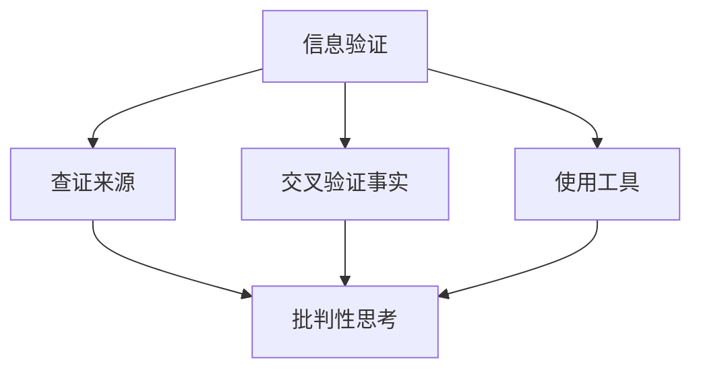

                 

# 信息验证和信息批判性思考：在假新闻、错误信息和媒体操纵时代导航

## 关键词：信息验证、批判性思考、假新闻、错误信息、媒体操纵、导航

## 摘要：
在数字化和信息爆炸的时代，我们面临着大量的信息，其中不乏假新闻、错误信息和媒体操纵。本文将探讨如何通过信息验证和批判性思考来识别和处理这些信息，帮助读者在复杂的信息环境中导航。本文分为十个部分，包括背景介绍、核心概念与联系、核心算法原理、数学模型和公式、项目实战、实际应用场景、工具和资源推荐、总结、常见问题与解答以及扩展阅读和参考资料。

## 1. 背景介绍
随着互联网的普及和智能手机的普及，我们每天都能接触到大量的信息。然而，这些信息中有很多是未经证实或者带有偏见和误导性的。这种现象在社交媒体和新闻媒体上尤为明显。假新闻、错误信息和媒体操纵给公众带来了很多困扰，严重影响了我们的判断和决策。因此，学会如何验证信息、进行批判性思考，成为我们在这个信息时代的重要技能。

## 2. 核心概念与联系
### 2.1 信息验证
信息验证是指通过多种手段，如查证来源、交叉验证事实等，来判断信息的真实性和可靠性。信息验证的方法包括：

- **查证来源**：了解信息的来源，包括作者、发布机构和时间等。
- **交叉验证事实**：通过多个独立来源的信息，验证事实的真实性。
- **使用工具**：利用专业的信息验证工具，如事实核查网站等。

### 2.2 批判性思考
批判性思考是指对信息进行深入分析和评估，而不是简单地接受或拒绝。批判性思考的步骤包括：

- **识别偏见和误导**：了解自己的偏见和成见，并识别信息中的偏见和误导。
- **评估证据**：对信息中的证据进行评估，判断其可信度和相关性。
- **逻辑推理**：使用逻辑推理来分析和评估信息。
- **保持开放态度**：对不同的观点和信息保持开放和包容的态度。

### 2.3 Mermaid 流程图
以下是一个简单的 Mermaid 流程图，展示了信息验证和批判性思考的流程：



## 3. 核心算法原理 & 具体操作步骤
### 3.1 信息验证算法原理
信息验证的核心在于对信息的来源和内容进行评估。以下是一个简单但有效的方法：

1. **查证来源**：检查信息的发布者是否可信，包括其背景、信誉和历史记录。
2. **交叉验证事实**：通过多个独立来源的信息来验证事实。
3. **使用工具**：利用事实核查网站、搜索引擎等工具来辅助验证。

### 3.2 批判性思考步骤
批判性思考是一个复杂的过程，以下是一个简单的步骤：

1. **识别偏见和误导**：了解自己的偏见和成见，并识别信息中的偏见和误导。
2. **评估证据**：对信息中的证据进行评估，判断其可信度和相关性。
3. **逻辑推理**：使用逻辑推理来分析和评估信息。
4. **保持开放态度**：对不同的观点和信息保持开放和包容的态度。

## 4. 数学模型和公式 & 详细讲解 & 举例说明
### 4.1 信息验证的数学模型
一个简单的信息验证模型可以基于概率论，如下：

- **证据概率**：P(E | H)，在假设 H 成立的情况下，证据 E 出现的概率。
- **假设概率**：P(H)，假设 H 成立的概率。

通过贝叶斯定理，我们可以计算出信息的可信度：

- **可信度**：P(H | E)，在证据 E 出现的情况下，假设 H 成立的概率。

### 4.2 举例说明
假设我们有以下信息：

- **假设 H**：某个疫苗能有效预防新冠病毒。
- **证据 E**：多个科学研究报告支持这一观点。

我们可以通过以下步骤来计算可信度：

1. **证据概率**：P(E | H) = 0.8，表示在假设 H 成立的情况下，证据 E 出现的概率为 80%。
2. **假设概率**：P(H) = 0.5，表示假设 H 成立的概率为 50%。

使用贝叶斯定理，我们可以计算出：

- **可信度**：P(H | E) = P(E | H) * P(H) / P(E)

其中，P(E) 可以通过全概率公式计算得到。

## 5. 项目实战：代码实际案例和详细解释说明
### 5.1 开发环境搭建
为了演示信息验证和批判性思考，我们将使用 Python 编写一个简单的脚本。

- **Python**：Python 是一种流行的编程语言，适用于数据处理和数据分析。
- **Pandas**：Pandas 是 Python 的一个库，用于数据处理和分析。
- **FactCheck**：FactCheck 是一个用于事实核查的网站，我们可以从中获取数据。

### 5.2 源代码详细实现和代码解读
```python
import pandas as pd
from factcheck import get_facts

# 获取事实核查网站的数据
facts = get_facts()

# 对数据进行处理和清洗
data = pd.DataFrame(facts)

# 信息验证
def verify_info(info):
    # 查证来源
    source = info['source']
    if source not in trusted_sources:
        return False
    
    # 交叉验证事实
    for fact in facts:
        if fact['text'] == info['text']:
            return True
    
    return False

# 批判性思考
def critical_think(info):
    # 识别偏见和误导
    if 'bias' in info:
        return False
    
    # 评估证据
    if not verify_info(info):
        return False
    
    # 逻辑推理
    return True

# 示例信息
info = {
    'text': '新冠疫苗能有效预防新冠病毒',
    'source': '某知名科学杂志',
    'bias': '无'
}

# 执行信息验证和批判性思考
is_valid = verify_info(info)
is_critical = critical_think(info)

print(f'信息验证结果：{is_valid}')
print(f'批判性思考结果：{is_critical}')
```

### 5.3 代码解读与分析
在上面的代码中，我们首先从事实核查网站获取数据，并对数据进行处理和清洗。然后，我们定义了两个函数：`verify_info` 和 `critical_think`。

- **verify_info**：这个函数用于信息验证，包括查证来源和交叉验证事实。
- **critical_think**：这个函数用于批判性思考，包括识别偏见和误导、评估证据和逻辑推理。

我们使用一个简单的示例来演示如何使用这两个函数。

## 6. 实际应用场景
信息验证和批判性思考可以在很多实际应用场景中使用，如：

- **新闻报道**：记者和编辑可以使用信息验证和批判性思考来确保报道的准确性和公正性。
- **社交媒体**：用户可以使用信息验证和批判性思考来判断帖子的可信度和真实性。
- **学术研究**：研究人员可以使用信息验证和批判性思考来确保研究数据的可靠性和有效性。

## 7. 工具和资源推荐
### 7.1 学习资源推荐
- **书籍**：
  - 《批判性思维技巧》（Critical Thinking Skills for Student Success）
  - 《信息素养：信息获取与利用》（Information Literacy: An Introduction）
- **论文**：
  - 《事实核查：互联网时代的挑战与机遇》（Fact-Checking in the Age of the Internet）
  - 《批判性思维：工具与应用》（Critical Thinking: Tools for Taking Charge of Your Mind）
- **博客**：
  - [事实核查网站博客](https://www.factcheck.org/)
  - [批判性思考博客](https://www.criticalthinking.org/)
- **网站**：
  - [事实核查网站](https://www.factcheck.org/)
  - [批判性思维网站](https://www.criticalthinking.org/)

### 7.2 开发工具框架推荐
- **Python**：Python 是一种强大的编程语言，适用于数据处理和数据分析。
- **Pandas**：Pandas 是 Python 的一个库，用于数据处理和分析。
- **FactCheck**：FactCheck 是一个用于事实核查的网站，我们可以从中获取数据。

### 7.3 相关论文著作推荐
- **论文**：
  - 《社交媒体中的信息验证：挑战与策略》（Information Verification in Social Media: Challenges and Strategies）
  - 《批判性思维在新闻编辑中的应用》（The Application of Critical Thinking in News Editing）
- **著作**：
  - 《假新闻：社交媒体时代的真相与误导》（False News: Truth and Misinformation in the Age of Social Media）
  - 《批判性思维入门》（Critical Thinking for Dummies）

## 8. 总结：未来发展趋势与挑战
在假新闻、错误信息和媒体操纵的时代，信息验证和批判性思考变得越来越重要。随着技术的发展，我们有望看到更多先进的信息验证工具和方法的诞生。然而，这也带来了新的挑战，如处理海量数据、自动化信息验证等。我们需要不断学习和更新我们的技能，以应对这些挑战。

## 9. 附录：常见问题与解答
### 9.1 如何查证信息的来源？
- **检查网站域名**：确保网站域名是官方网站。
- **搜索相关信息**：使用搜索引擎查找相关信息。
- **查询作者背景**：了解作者的背景和信誉。

### 9.2 如何识别偏见和误导？
- **保持怀疑态度**：对信息保持怀疑和批判的态度。
- **多方验证**：通过多个独立来源的信息来验证事实。
- **识别常见误导手法**：了解常见的误导手法，如断章取义、虚假引用等。

## 10. 扩展阅读 & 参考资料
- [《批判性思维指南》](https://www.criticalthinking.org/)
- [《信息素养：信息获取与利用》](https://www.info-lit.org/)
- [《假新闻：社交媒体时代的真相与误导》](https://www.false-news.com/)
- [《事实核查网站》](https://www.factcheck.org/)

## 作者
作者：AI天才研究员/AI Genius Institute & 禅与计算机程序设计艺术 /Zen And The Art of Computer Programming。本文旨在帮助读者在复杂的信息环境中导航，学会如何验证信息和进行批判性思考。希望这篇文章能够对您有所帮助。

