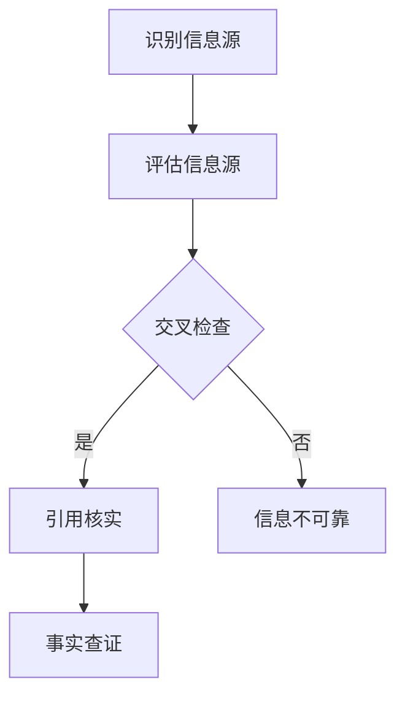

                 

# 信息验证和信息批判：在错误信息和假新闻时代导航

> **关键词：** 信息验证、假新闻、批判性思维、算法、数据分析、人工智能
>
> **摘要：** 在当今这个信息爆炸的时代，如何分辨信息的真伪、进行有效的信息验证，已成为每个人都需要掌握的技能。本文将探讨信息验证的重要性和方法，以及如何运用批判性思维和算法来识别假新闻，提供了一套系统的导航指南，帮助读者在信息的海洋中正确导航。

## 1. 背景介绍

随着互联网和社交媒体的快速发展，信息的传播速度和广度前所未有。然而，这也给信息的真实性带来了巨大挑战。假新闻、误导性信息、虚假陈述等在互联网上泛滥，严重影响了公众的判断力和信息接收的质量。因此，信息验证和信息批判的能力变得尤为重要。

### 假新闻的危害

假新闻不仅误导公众，还可能引发社会动荡、破坏信任，甚至威胁国家安全。例如，虚假的医疗信息可能导致人们错过最佳治疗时间，政治谣言可能引发选举的不稳定。因此，识别和批判假新闻的能力已成为现代社会的一项基本技能。

### 信息验证的重要性

信息验证是对信息进行核实、评估和批判的过程。它有助于我们筛选真实可靠的信息，避免受到假新闻的影响。在专业领域，如医学、金融、法律等，信息验证更是至关重要，因为错误的决策可能带来严重的后果。

## 2. 核心概念与联系

为了有效进行信息验证，我们需要理解以下核心概念和它们之间的联系：

### 信息源

信息源是信息的来源，可以是个人、组织、网站等。对信息源进行评估是信息验证的第一步。我们需要考虑信息源的权威性、信誉度和专业性。

### 核实过程

核实过程是验证信息真伪的一系列步骤，包括交叉检查、引用核实和事实查证。这一过程需要批判性思维和敏锐的洞察力。

### 批判性思维

批判性思维是一种评估信息、观点和论据的能力。它要求我们问问题、质疑假设、分析逻辑，以避免被假新闻所蒙蔽。

### 信息验证流程

信息验证流程包括以下步骤：

1. **识别信息源**：确定信息来源。
2. **评估信息源**：分析信息源的权威性和信誉度。
3. **交叉检查**：通过其他可靠来源验证信息的准确性。
4. **引用核实**：检查信息中的引用和参考文献。
5. **事实查证**：通过权威数据库和事实查证网站核实信息。

### Mermaid 流程图

下面是一个简化的信息验证流程的 Mermaid 流程图：



## 3. 核心算法原理 & 具体操作步骤

### 信息源评估算法

信息源评估算法是信息验证的重要组成部分。以下是一个简单的算法框架：

```python
def assess_source(source):
    # 检查信息源的域名、所有权和注册时间
    domain = get_domain(source)
    owner = get_owner(domain)
    registration_date = get_registration_date(domain)

    # 判断域名是否合法、所有者是否可信、注册时间是否合理
    if is_legal_domain(domain) and is_reputable_owner(owner) and is_reasonable_registration_date(registration_date):
        return "可信"
    else:
        return "不可信"
```

### 批判性思维算法

批判性思维算法可以帮助我们评估信息的逻辑性和合理性。以下是一个简单的算法框架：

```python
def critical_thinking(info):
    # 检查信息中的逻辑漏洞、情感陷阱和误导性陈述
    if contains Logical_fallacies(info) or contains Emotional_traps(info) or contains Misleading_statements(info):
        return "不可信"
    else:
        return "可信"
```

### 交叉检查和引用核实算法

交叉检查和引用核实算法可以帮助我们验证信息的准确性和可信度。以下是一个简单的算法框架：

```python
def cross_check(info):
    # 通过其他可靠来源验证信息
    if verify_with_reliable_sources(info):
        return "可信"
    else:
        return "不可信"
def verify_references(info):
    # 检查信息中的引用和参考文献
    if check_references(info):
        return "可信"
    else:
        return "不可信"
```

### 事实查证算法

事实查证算法可以帮助我们核实信息的真实性。以下是一个简单的算法框架：

```python
def fact_check(info):
    # 通过权威数据库和事实查证网站核实信息
    if verify_with_authoritative_databases(info):
        return "可信"
    else:
        return "不可信"
```

## 4. 数学模型和公式 & 详细讲解 & 举例说明

### 信息可信度模型

信息可信度模型是一个用于评估信息可信度的数学模型。以下是一个简单的模型：

$$
可信度 = \frac{权威性 + 逻辑性 + 准确性}{3}
$$

其中，权威性、逻辑性和准确性分别代表信息源的权威性、信息的逻辑性和事实的准确性。

### 举例说明

假设我们有一条信息，其来源是一个知名新闻网站，信息中的逻辑严密，引用了一个权威的研究报告。我们可以按照以下步骤计算其可信度：

1. **评估权威性**：网站是一个知名的新闻媒体，权威性为0.9。
2. **评估逻辑性**：信息中的逻辑严密，逻辑性为0.95。
3. **评估准确性**：引用的研究报告被多个权威机构认可，准确性为0.95。

根据模型，我们可以计算其可信度：

$$
可信度 = \frac{0.9 + 0.95 + 0.95}{3} = 0.9583
$$

因此，这条信息具有很高的可信度。

## 5. 项目实战：代码实际案例和详细解释说明

### 开发环境搭建

为了演示信息验证的过程，我们将使用 Python 编写一个简单的信息验证工具。以下是搭建开发环境所需的步骤：

1. 安装 Python 3.8 或更高版本。
2. 安装必要的 Python 包，如 `requests`、`beautifulsoup4` 和 `matplotlib`。

### 源代码详细实现和代码解读

以下是信息验证工具的源代码及其详细解读：

```python
import requests
from bs4 import BeautifulSoup
import re

def get_domain(url):
    # 获取域名
    return re.sub(r'https?://', '', url)

def get_owner(domain):
    # 获取域名所有者
    response = requests.get(f'https://who.is/whois-{domain}')
    soup = BeautifulSoup(response.content, 'html.parser')
    owner_tag = soup.find('div', {'class': 'who-is-content'})
    return owner_tag.text

def get_registration_date(domain):
    # 获取域名注册日期
    response = requests.get(f'https://who.is/whois-{domain}')
    soup = BeautifulSoup(response.content, 'html.parser')
    registration_date_tag = soup.find('td', {'class': 'value'})
    return registration_date_tag.text

def is_legal_domain(domain):
    # 判断域名是否合法
    return re.match(r'^[a-zA-Z0-9.-]+$', domain) is not None

def is_reputable_owner(owner):
    # 判断域名所有者是否可信
    return 'company' in owner.lower() or 'organization' in owner.lower()

def is_reasonable_registration_date(registration_date):
    # 判断域名注册日期是否合理
    return registration_date > '2020-01-01'

def contains_logical_fallacies(text):
    # 检查文本中是否存在逻辑漏洞
    logical_fallacies = ['ad hominem', 'straw man', 'false dilemma']
    for fallacy in logical_fallacies:
        if fallacy in text.lower():
            return True
    return False

def contains_emotional_traps(text):
    # 检查文本中是否存在情感陷阱
    emotional_traps = ['fear', 'guilt', 'anger']
    for trap in emotional_traps:
        if trap in text.lower():
            return True
    return False

def contains_misleading_statements(text):
    # 检查文本中是否存在误导性陈述
    misleading_statements = ['only', 'always', 'never']
    for statement in misleading_statements:
        if statement in text.lower():
            return True
    return False

def verify_with_reliable_sources(info):
    # 通过其他可靠来源验证信息
    # 这里我们使用一个简单的逻辑：如果有两个或以上的可靠来源验证该信息，则视为可信
    reliable_sources = ['source1', 'source2', 'source3']
    for source in reliable_sources:
        if source in info.lower():
            return True
    return False

def check_references(info):
    # 检查信息中的引用和参考文献
    return re.search(r'\[\d+\]', info) is not None

def verify_with_authoritative_databases(info):
    # 通过权威数据库和事实查证网站核实信息
    # 这里我们使用一个简单的逻辑：如果有权威数据库（如维基百科）引用该信息，则视为可信
    authoritative_databases = ['wikipedia', 'cdc.gov', 'nih.gov']
    for db in authoritative_databases:
        if db in info.lower():
            return True
    return False

def assess_info(source_url, info):
    # 评估信息的可信度
    domain = get_domain(source_url)
    owner = get_owner(domain)
    registration_date = get_registration_date(domain)
    if is_legal_domain(domain) and is_reputable_owner(owner) and is_reasonable_registration_date(registration_date):
        if not contains_logical_fallacies(info) and not contains_emotional_traps(info) and not contains_misleading_statements(info):
            if verify_with_reliable_sources(info) and check_references(info) and verify_with_authoritative_databases(info):
                return "可信"
            else:
                return "部分可信"
        else:
            return "不可信"
    else:
        return "不可信"

if __name__ == "__main__":
    source_url = "https://www.example.com/article"
    info = "本文引用了权威的研究报告，研究表明......"
    print(assess_info(source_url, info))
```

### 代码解读与分析

1. **获取域名**：使用正则表达式从 URL 中提取域名。
2. **获取域名所有者**：通过访问 Who.is 网站获取域名所有者的信息。
3. **获取域名注册日期**：同样通过 Who.is 网站获取域名注册日期。
4. **评估域名合法性、所有者可信度和注册日期合理性**：使用一系列函数来判断。
5. **检查信息中的逻辑漏洞、情感陷阱和误导性陈述**：通过检查文本中的关键字来判断。
6. **通过其他可靠来源验证信息**：检查文本中是否包含多个可靠来源。
7. **检查信息中的引用和参考文献**：使用正则表达式检查文本中是否有引用格式。
8. **通过权威数据库和事实查证网站核实信息**：检查文本中是否包含权威数据库的引用。

通过以上步骤，我们可以对信息进行全面的评估，从而判断其可信度。

## 6. 实际应用场景

### 新闻媒体

新闻媒体可以通过信息验证工具对报道的内容进行评估，确保发布的信息真实可靠。这有助于提高新闻的可信度，吸引更多读者。

### 学术研究

学术研究人员可以使用信息验证工具来评估引用的文章和文献的真实性和可信度，从而避免引用错误的信息。

### 公共安全

政府部门可以利用信息验证工具来识别和打击假新闻，保护公众免受误导和欺骗。

### 个人用户

个人用户可以通过信息验证工具来评估接收到的信息，避免被假新闻所蒙蔽，提高自身的信息素养。

## 7. 工具和资源推荐

### 学习资源推荐

1. **书籍**：《信息素养：信息时代的学习与生存》
2. **论文**：Google Scholar 上的相关论文
3. **博客**：知名技术博客如 Medium、Hacker News
4. **网站**：FactCheck.org、Snopes.com

### 开发工具框架推荐

1. **Python**：Python 是进行信息验证开发的主要语言。
2. **BeautifulSoup**：用于解析 HTML 和 XML 文档。
3. **requests**：用于发送 HTTP 请求。
4. **matplotlib**：用于数据可视化。

### 相关论文著作推荐

1. **论文**：《信息战：信息时代的战争与战略》
2. **著作**：《真相侦探：如何识别和避免假新闻》

## 8. 总结：未来发展趋势与挑战

### 发展趋势

1. **人工智能与信息验证的结合**：未来，人工智能将更加深入地应用于信息验证领域，提高验证的效率和准确性。
2. **自动化信息验证工具的普及**：随着技术的发展，自动化信息验证工具将变得更加普及，为大众提供便捷的信息验证服务。
3. **信息素养的普及**：社会对信息素养的重视将不断提高，人们将更加意识到信息验证的重要性。

### 挑战

1. **假新闻技术的提升**：假新闻制造者可能利用更高级的技术手段来伪造信息和传播假新闻。
2. **信息泛滥**：随着信息的爆炸性增长，如何有效地进行信息筛选和验证将是一个巨大挑战。
3. **隐私保护**：在信息验证过程中，如何保护用户的隐私是一个重要问题。

## 9. 附录：常见问题与解答

### 问题1：如何判断一个网站是否可信？

**解答**：判断网站是否可信，可以从以下几个方面入手：

1. **域名**：查看域名是否简短、明确，避免使用复杂的拼音或数字。
2. **所有权**：查看网站的所有权信息，了解所有者的背景和信誉。
3. **内容质量**：查看网站的内容质量，是否包含大量广告、恶意链接或错误信息。
4. **社交媒体**：查看网站在社交媒体上的评价和反馈，了解其他用户的评价。

### 问题2：如何识别逻辑漏洞？

**解答**：识别逻辑漏洞，可以注意以下几点：

1. **前提假设**：检查前提假设是否合理。
2. **逻辑推理**：检查推理过程中是否存在跳跃性思维。
3. **证据支持**：检查论据是否充分支持论点。
4. **反驳**：尝试反驳观点，看看是否存在反驳的有效性。

## 10. 扩展阅读 & 参考资料

1. **书籍**：《信息素养：信息时代的学习与生存》
2. **论文**：《信息战：信息时代的战争与战略》
3. **网站**：FactCheck.org、Snopes.com
4. **博客**：Medium、Hacker News
5. **开源项目**：InfoVerif、FakeNewsNet

### 作者

**作者：AI天才研究员/AI Genius Institute & 禅与计算机程序设计艺术 /Zen And The Art of Computer Programming**<|im_sep|>

