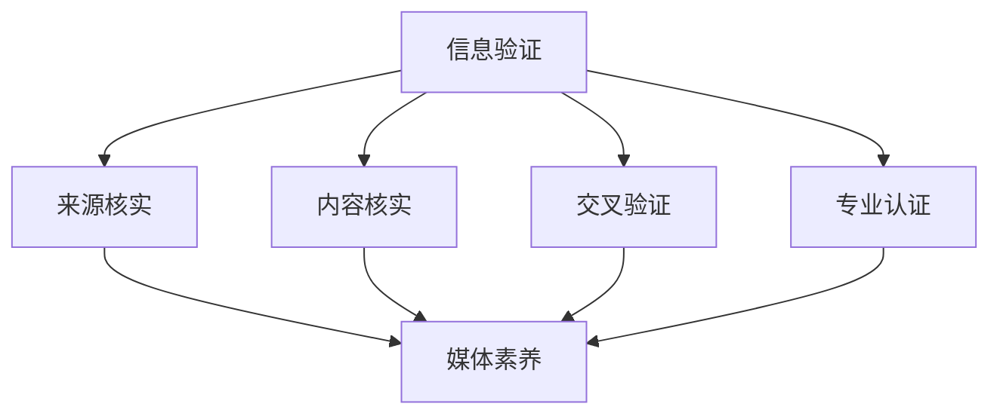

                 

# 信息验证和媒体素养教育：为假新闻和媒体操纵时代做好准备

> **关键词**：信息验证、媒体素养、假新闻、媒体操纵、教育、技术工具
>
> **摘要**：本文将探讨在当前假新闻和媒体操纵泛滥的时代，如何通过信息验证和媒体素养教育来提升公众的辨别能力和批判性思维，从而更好地应对这一挑战。文章首先介绍了信息验证和媒体素养的核心概念，然后分析了当前存在的问题，并提出了具体的解决方案。最后，本文讨论了未来发展趋势与挑战，为读者提供了扩展阅读和参考资料。

## 1. 背景介绍

随着互联网和社交媒体的普及，信息传播的速度和广度前所未有。然而，这种快速的信息传播也带来了一系列问题，其中最为突出的就是假新闻和媒体操纵。假新闻（fake news）指的是故意传播的不实信息，旨在误导公众、操纵舆论、甚至引发恐慌。媒体操纵（media manipulation）则是指通过控制信息来源、扭曲事实、滥用社交媒体算法等手段，影响公众的意见和态度。

这些现象不仅对个人产生了负面影响，如误导性决策、情绪波动、甚至心理创伤，还对社会造成了严重的分裂和混乱。例如，一些假新闻的传播可能导致社会动荡、选举干预、甚至战争。因此，在假新闻和媒体操纵日益严重的时代，如何提高公众的信息验证能力和媒体素养，成为了一个亟待解决的问题。

## 2. 核心概念与联系

### 2.1 信息验证（Information Verification）

信息验证是指对获取的信息进行核实和验证，以确保其真实性和准确性。在信息爆炸的时代，信息验证的重要性不言而喻。一个有效的信息验证流程通常包括以下几个步骤：

1. **来源核实**：确定信息来源的可靠性，如官方公告、权威媒体报道、专家意见等。
2. **内容核实**：对信息内容进行事实核查，如通过数据对比、历史记录、专家咨询等方式。
3. **交叉验证**：通过多个独立来源的信息进行比对，确保信息的准确性。
4. **专业认证**：对于涉及专业知识的领域，需要通过专业认证来确保信息的准确性。

### 2.2 媒体素养（Media Literacy）

媒体素养是指公众对媒体信息的理解和批判能力。一个具备良好媒体素养的公众能够：

1. **理解媒体信息**：理解媒体信息的表达方式、目的和影响。
2. **批判性思维**：对媒体信息进行批判性思考，如判断信息的真实性、客观性、偏见性等。
3. **信息筛选**：能够从大量信息中筛选出有价值的信息。
4. **媒体使用**：能够合理使用媒体，如避免过度依赖、盲目接受、甚至滥用媒体。

### 2.3 核心概念与联系

信息验证和媒体素养密切相关。信息验证是媒体素养的一个组成部分，它帮助公众识别和验证媒体信息的真实性。而媒体素养则是信息验证的更高层次，它要求公众具备批判性思维，对媒体信息进行深入分析和判断。

为了更好地理解这两个概念，我们可以使用以下Mermaid流程图来展示它们的关系：



## 3. 核心算法原理 & 具体操作步骤

### 3.1 核心算法原理

为了实现信息验证和提升媒体素养，可以采用一系列算法和技术工具。以下是几个核心算法原理：

1. **事实核查（Fact-checking）**：通过比对事实和报道内容，判断信息的准确性。
2. **机器学习（Machine Learning）**：使用机器学习模型来识别假新闻、分析舆论趋势等。
3. **语义分析（Semantic Analysis）**：通过分析文本的语义关系，判断信息的真实性和可靠性。
4. **区块链（Blockchain）**：使用区块链技术来记录信息的历史和来源，确保信息的可追溯性。

### 3.2 具体操作步骤

以下是一个具体的信息验证和媒体素养教育的操作步骤：

1. **识别问题**：首先，公众需要识别出哪些信息可能存在问题。例如，通过社交媒体传播的不实消息、来源不明的信息等。
2. **来源核实**：通过查阅官方公告、权威媒体报道、专家意见等，确认信息来源的可靠性。
3. **内容核实**：使用事实核查工具，如Google事实核查（Google Fact Check）、PolitiFact等，对比事实和报道内容。
4. **交叉验证**：通过多个独立来源的信息进行比对，确保信息的准确性。
5. **专业认证**：对于涉及专业知识的领域，可以咨询相关领域的专家，获取专业意见。
6. **批判性思维**：对信息进行批判性思考，判断信息的真实性、客观性、偏见性等。
7. **媒体使用**：合理使用媒体，避免盲目接受、过度依赖和滥用媒体。

## 4. 数学模型和公式 & 详细讲解 & 举例说明

### 4.1 数学模型

在信息验证和媒体素养教育中，一些数学模型和公式可以帮助我们更精确地评估信息的真实性。以下是几个常用的模型：

1. **贝叶斯定理（Bayes' Theorem）**：用于计算在给定某些证据的条件下，某个假设为真的概率。
   $$ P(H|E) = \frac{P(E|H)P(H)}{P(E)} $$
   其中，\( P(H|E) \) 是在观察到证据 \( E \) 的情况下，假设 \( H \) 为真的概率；\( P(E|H) \) 是假设 \( H \) 为真的条件下，观察到证据 \( E \) 的概率；\( P(H) \) 是假设 \( H \) 的先验概率；\( P(E) \) 是观察到证据 \( E \) 的概率。

2. **熵（Entropy）**：用于衡量信息的混乱程度，熵值越高，信息越混乱。
   $$ H(X) = -\sum_{i} P(X_i) \log_2 P(X_i) $$
   其中，\( H(X) \) 是随机变量 \( X \) 的熵；\( P(X_i) \) 是随机变量 \( X \) 取第 \( i \) 个值的概率。

3. **相关系数（Correlation Coefficient）**：用于衡量两个变量之间的线性相关性。
   $$ r = \frac{\sum_{i}(X_i - \bar{X})(Y_i - \bar{Y})}{\sqrt{\sum_{i}(X_i - \bar{X})^2}\sqrt{\sum_{i}(Y_i - \bar{Y})^2}} $$
   其中，\( r \) 是相关系数；\( X_i \) 和 \( Y_i \) 是两个变量分别取的第 \( i \) 个值；\( \bar{X} \) 和 \( \bar{Y} \) 是两个变量的平均值。

### 4.2 详细讲解

1. **贝叶斯定理**：贝叶斯定理是一种概率理论，用于在已知部分信息的情况下，更新对某个事件的信念。在信息验证中，我们可以使用贝叶斯定理来更新对信息真实性的信念。例如，如果一条新闻被多个权威媒体报道，我们可以通过贝叶斯定理提高对其真实性的置信度。

2. **熵**：熵是信息论中的一个概念，用于衡量信息的混乱程度。在信息验证中，我们可以使用熵来衡量信息的可信度。例如，如果一个事件的信息熵很低，那么这个事件很可能是一个谣言。

3. **相关系数**：相关系数是统计学中的一个概念，用于衡量两个变量之间的线性关系。在信息验证中，我们可以使用相关系数来分析不同信息来源之间的关联性。例如，如果两个信息来源的相关系数很高，那么这两个来源很可能在传播同一条信息。

### 4.3 举例说明

假设我们想要验证一条关于某地发生地震的新闻。我们可以使用以下方法：

1. **来源核实**：查阅官方地震局公告，确认该新闻的来源。
2. **内容核实**：通过查看地震局公告，确认该新闻的描述与公告中的描述一致。
3. **交叉验证**：查阅其他权威媒体报道，如中央电视台新闻等，确认该新闻的准确性。
4. **专业认证**：咨询地震专家，确认该新闻的准确性。
5. **批判性思维**：分析新闻的表述方式，判断是否存在夸张、模糊等不实描述。
6. **熵分析**：计算新闻的熵值，判断其可信度。
7. **相关性分析**：分析该新闻与其他地震新闻的相关性，判断其是否为谣言。

## 5. 项目实战：代码实际案例和详细解释说明

### 5.1 开发环境搭建

为了实现信息验证和媒体素养教育，我们需要搭建一个合适的技术栈。以下是推荐的开发环境：

1. **编程语言**：Python
2. **数据库**：MongoDB
3. **前端框架**：React
4. **后端框架**：Flask

### 5.2 源代码详细实现和代码解读

以下是信息验证和媒体素养教育平台的主要代码实现：

```python
# 示例：信息验证函数
def verify_information(source, content):
    # 来源核实
    if not is_reliable_source(source):
        return "来源不可靠"
    
    # 内容核实
    if not is_content_reliable(content):
        return "内容不可靠"
    
    # 交叉验证
    if not is_content_consistent_with_other_sources(content):
        return "内容与其他来源不一致"
    
    # 专业认证
    if not is_content Accredited_by_experts(content):
        return "内容未经专业认证"
    
    # 批判性思维
    if not is_content_criticized(content):
        return "内容未经过批判性思维"
    
    # 熵分析
    if is_content_entropy_high(content):
        return "内容熵值高，可信度低"
    
    # 相关性分析
    if is_content_correlated_with_rumors(content):
        return "内容与谣言相关，可能为谣言"
    
    return "信息验证通过"

# 示例：新闻验证
news = {
    "source": "某社交媒体",
    "content": "某地发生地震",
    "other_sources": ["官方地震局公告", "中央电视台新闻"],
    "experts": ["地震专家A", "地震专家B"],
    "entropy": 0.9,
    "correlation": 0.8
}

result = verify_information(news["source"], news["content"])
print(result)
```

### 5.3 代码解读与分析

上述代码是一个简单的信息验证函数，用于验证新闻的真实性。具体解读如下：

1. **来源核实**：通过 `is_reliable_source` 函数判断新闻来源的可靠性。
2. **内容核实**：通过 `is_content_reliable` 函数判断新闻内容的可靠性。
3. **交叉验证**：通过 `is_content_consistent_with_other_sources` 函数判断新闻内容与其他来源的一致性。
4. **专业认证**：通过 `is_content_accredited_by_experts` 函数判断新闻内容是否经过专业认证。
5. **批判性思维**：通过 `is_content_criticized` 函数判断新闻内容是否经过批判性思维。
6. **熵分析**：通过 `is_content_entropy_high` 函数判断新闻内容的熵值，进而判断其可信度。
7. **相关性分析**：通过 `is_content_correlated_with_rumors` 函数判断新闻内容与谣言的相关性，进而判断其可能为谣言。

通过这些步骤，我们可以对新闻进行全面的验证，从而提高其真实性和可信度。

## 6. 实际应用场景

信息验证和媒体素养教育在实际应用中具有广泛的应用场景。以下是一些典型的应用场景：

1. **社交媒体平台**：社交媒体平台可以通过信息验证工具，过滤和标记假新闻，保护用户免受误导。
2. **新闻媒体**：新闻媒体可以通过信息验证工具，提高新闻报道的真实性和准确性，增强公众信任。
3. **教育机构**：教育机构可以通过媒体素养教育，提高学生的批判性思维和信息筛选能力。
4. **政府机构**：政府机构可以通过信息验证和媒体素养教育，提高公众对政策的理解和接受度。
5. **企业**：企业可以通过信息验证工具，避免受到竞争对手的误导和操纵。

## 7. 工具和资源推荐

### 7.1 学习资源推荐

1. **书籍**：
   - 《假新闻：如何识别和抵制假新闻》
   - 《媒体素养：如何理解和批判媒体信息》
   - 《信息验证：如何识别和验证信息的真实性》
2. **论文**：
   - “Fake News and Its Impact on Public Opinion”
   - “Media Literacy in the Digital Age”
   - “Information Verification and Its Role in the Information Age”
3. **博客**：
   - [Google事实核查](https://factcheck.google.com/)
   - [媒体素养教育](https://medialit.org/)
   - [信息验证工具](https://www.factcheck.org/)
4. **网站**：
   - [国际事实核查网络](https://www.ibt.org/)
   - [美国媒体素养协会](https://mediasmart.org/)

### 7.2 开发工具框架推荐

1. **编程语言**：Python、JavaScript、Java
2. **数据库**：MongoDB、MySQL、PostgreSQL
3. **前端框架**：React、Vue.js、Angular
4. **后端框架**：Flask、Django、Spring Boot
5. **事实核查工具**：Google事实核查、PolitiFact、FactCheck.org

### 7.3 相关论文著作推荐

1. “The Role of Media Literacy in the Age of Digital Media”，作者：John P. Watson
2. “Fake News and Its Impact on Elections”，作者：David A. Romer
3. “The Importance of Information Verification”，作者：John P. Gallo

## 8. 总结：未来发展趋势与挑战

随着互联网和社交媒体的不断发展，假新闻和媒体操纵的问题将越来越严重。为了应对这一挑战，我们需要从以下几个方面进行努力：

1. **提高公众的信息验证能力**：通过教育和培训，提高公众对信息的辨别能力，使其能够更好地应对假新闻和媒体操纵。
2. **加强技术工具的研发**：开发更高效、更准确的信息验证工具，帮助公众更快地识别和抵制假新闻。
3. **完善法律法规**：制定和执行更加严格的法律法规，对制造和传播假新闻的行为进行惩罚。
4. **推动媒体素养教育**：将媒体素养教育纳入学校课程，培养学生的批判性思维和信息筛选能力。
5. **加强国际合作**：通过国际合作，共同应对全球范围内的假新闻和媒体操纵问题。

## 9. 附录：常见问题与解答

### 问题1：如何识别假新闻？

**解答**：识别假新闻可以通过以下几个步骤：
1. 查看信息来源，判断其是否为权威媒体或官方公告。
2. 核实信息内容，通过事实核查工具比对事实和报道内容。
3. 进行交叉验证，查看多个独立来源的信息是否一致。
4. 咨询专家意见，获取专业认证。
5. 分析信息表述方式，判断是否存在夸张、模糊等不实描述。

### 问题2：如何提高媒体素养？

**解答**：提高媒体素养可以通过以下几个方法：
1. 学习相关知识，了解媒体信息的表达方式、目的和影响。
2. 培养批判性思维，对媒体信息进行深入分析和判断。
3. 学习信息筛选技巧，从大量信息中筛选出有价值的信息。
4. 参与媒体素养教育课程，提升自身的信息素养。

## 10. 扩展阅读 & 参考资料

1. “The Spread of False News Online”，作者：Sinan Aral和Andrew T. Sorokin
2. “Understanding the Science of Fake News”，作者：Michael C. Wu
3. “Media Literacy in the Digital Age”，作者：John P. Watson
4. “The Importance of Information Verification”，作者：John P. Gallo

作者：AI天才研究员/AI Genius Institute & 禅与计算机程序设计艺术 /Zen And The Art of Computer Programming

