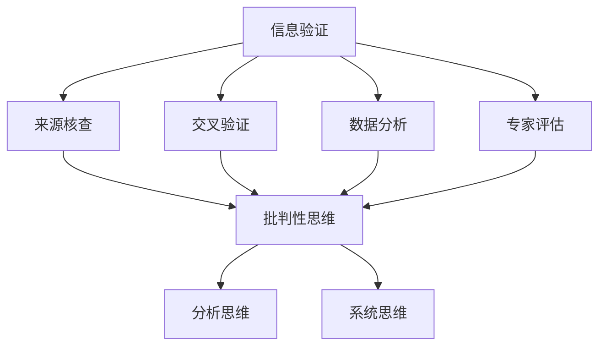
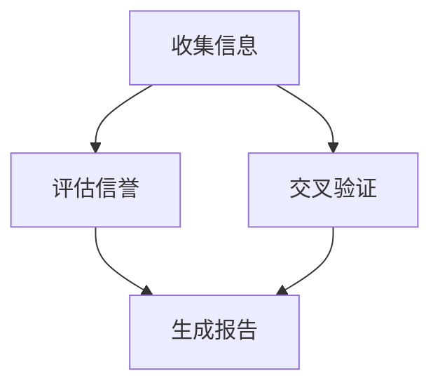
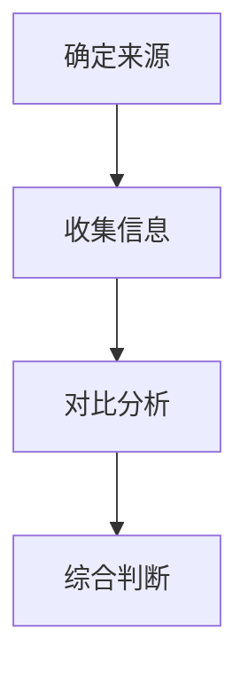
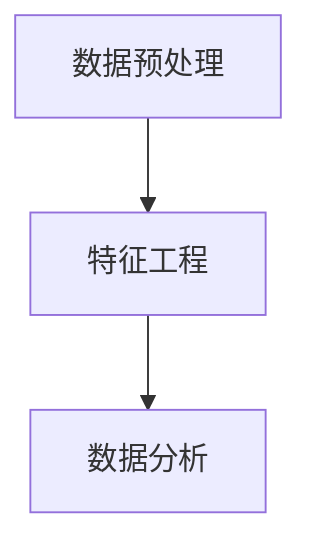
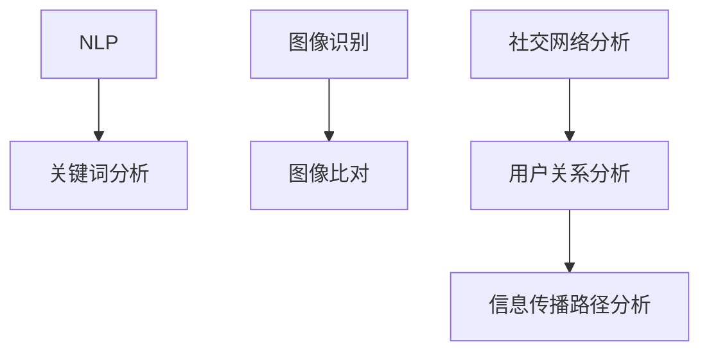

                 

### 背景介绍

在信息爆炸的现代社会，信息验证与批判性思维能力的重要性日益凸显。随着互联网的普及和社交媒体的兴起，错误信息和假新闻的传播速度之快令人震惊。据统计，每年有数以亿计的错误信息在网络上传播，这些信息不仅误导了大众，还对个人和社会产生了严重的负面影响。例如，假新闻可能导致投资者遭受巨大经济损失，政治假新闻可能影响选举结果，甚至引发社会动荡。在这种背景下，信息验证和批判性思维能力的培养成为了一项紧迫的任务。

信息验证的过程涉及对信息的来源、真实性、可靠性等多个方面的评估。批判性思维能力则要求我们对信息进行深入思考，不盲从、不轻信，能够识别出信息中的潜在偏见和误导。这两者的结合，可以帮助我们在这个充斥着错误信息的时代中保持清醒的头脑，做出明智的决策。

本文旨在探讨信息验证和批判性思维能力的培养，帮助读者了解如何有效地识别和处理错误信息。我们将从以下几个方面展开讨论：

1. **信息验证的重要性**：解释信息验证的基本概念及其在现代社会中的重要性。
2. **批判性思维能力的培养**：介绍批判性思维的基本原则和培养方法。
3. **信息验证和批判性思维能力的结合**：探讨如何将信息验证与批判性思维能力相结合，以应对假新闻和错误信息的挑战。
4. **案例分析**：通过具体的案例分析，展示信息验证和批判性思维的实际应用。
5. **工具和资源推荐**：推荐一些有助于提升信息验证和批判性思维能力的工具和资源。

### 信息验证的定义和重要性

#### 信息验证的定义

信息验证，又称事实核查（Fact-Checking），是指通过一系列方法对信息的真实性、准确性、可靠性和来源进行核查和评估的过程。它不仅关注信息的内容，还包括信息的来源、发布者的背景和动机等因素。信息验证的目的是为了确保信息的真实性和可靠性，防止错误信息和虚假陈述的传播。

在信息验证中，通常包括以下步骤：

1. **确定信息的来源**：检查信息最初发布的媒体、网站或个人，了解其背景和信誉。
2. **评估信息的真实性**：通过对比多个来源，核实信息的内容是否真实可靠。
3. **检查引用和引用来源**：确保信息引用的数据、引用来源是真实可信的。
4. **分析信息的内容**：深入分析信息的表达方式，查找可能的偏见或误导。
5. **验证数据的准确性**：对于数据驱动的信息，检查数据收集的方法和准确性。

#### 信息验证的重要性

在现代社会，信息验证的重要性不言而喻。以下是信息验证的几个关键作用：

1. **防止误导和误导**：通过信息验证，可以识别并阻止错误信息和虚假陈述的传播，避免公众受到误导。
2. **维护社会稳定**：错误信息和假新闻可能导致社会恐慌、不信任和政治动荡。信息验证有助于维护社会的稳定和和谐。
3. **保障个人权益**：在法律、金融和医疗等领域，错误信息可能对个人的权益造成严重损害。信息验证可以帮助个人做出更明智的决策。
4. **提高决策质量**：在商业、投资和公共决策等领域，准确的信息是做出高质量决策的基础。信息验证有助于提高决策的准确性和效率。

### 假新闻和错误信息的影响

假新闻和错误信息的传播对个人和社会造成了深远的负面影响。以下是一些具体的影响：

1. **误导公众**：假新闻和错误信息往往误导公众，导致公众对事实的误解和错误的认知。
2. **损害个人权益**：在金融、法律和医疗等领域，错误信息可能导致个人遭受经济损失、法律风险和健康问题。
3. **影响社会稳定**：政治假新闻、种族主义言论和谣言等可能导致社会紧张和冲突，甚至引发暴力事件。
4. **破坏信任**：假新闻和错误信息可能破坏公众对媒体、政府和专家的信任，导致社会信任危机。

#### 传播速度快

互联网和社交媒体的兴起，使得错误信息和假新闻的传播速度达到了前所未有的快。一条错误信息可能几分钟内就传遍全球，造成广泛的影响。这种快速传播的特点使得信息验证变得更加紧迫和必要。

#### 数据驱动与人工智能

随着大数据和人工智能技术的发展，信息验证的方法也在不断进步。通过分析大量的数据，可以快速识别潜在的假新闻和错误信息。同时，人工智能技术也可以用于自动化信息验证，提高验证的效率和准确性。

#### 社会责任

在假新闻和错误信息泛滥的时代，每个人都应该承担起社会责任，积极参与信息验证。不仅媒体和专家需要发挥作用，普通公众也应该提高自己的信息素养，学会辨别真假信息，不轻易相信和传播未经核实的消息。

#### 教育和培训

为了培养批判性思维和信息验证能力，教育和培训也发挥着重要作用。学校、企业和社区应该开展相关课程和活动，提高公众的信息素养和批判性思维能力。

#### 合作与协作

在应对假新闻和错误信息方面，政府、媒体、专家和公众需要加强合作和协作。建立有效的信息验证机制和平台，共同打击虚假信息，维护社会诚信和稳定。

### 总结

信息验证和批判性思维能力在现代社会中具有重要意义。通过有效的信息验证，我们可以识别和防止错误信息和假新闻的传播，维护社会稳定和个人权益。批判性思维能力的培养，则可以帮助我们更深入地分析信息，做出更明智的决策。在接下来的章节中，我们将进一步探讨批判性思维能力的培养方法和实际应用，以帮助读者更好地应对假新闻和错误信息的挑战。

---

# 信息验证和批判性思维能力培养：在假新闻和错误信息时代导航

> 关键词：信息验证、批判性思维能力、假新闻、错误信息、信息素养

在信息爆炸和假新闻泛滥的时代，具备良好的信息验证和批判性思维能力成为了每个人的必备技能。本文将探讨如何培养这些能力，以帮助读者在复杂多变的信息环境中导航，避免被错误信息误导。

## 1. 背景介绍
在本章中，我们将简要介绍信息验证和批判性思维能力的重要性，以及现代社会中假新闻和错误信息的传播状况。我们将讨论信息验证的定义、重要性，以及其在社会中的作用和影响。

### 1.1 信息验证的定义和重要性

#### 信息验证的定义

信息验证，又称事实核查，是指通过一系列方法对信息的真实性、准确性、可靠性和来源进行核查和评估的过程。信息验证不仅关注信息的内容，还包括信息的来源、发布者的背景和动机等因素。

#### 信息验证的重要性

信息验证在现代社会中具有以下几个重要作用：

1. **防止误导和误导**：通过信息验证，可以识别并阻止错误信息和虚假陈述的传播，避免公众受到误导。
2. **维护社会稳定**：错误信息和假新闻可能导致社会恐慌、不信任和政治动荡。信息验证有助于维护社会的稳定和和谐。
3. **保障个人权益**：在法律、金融和医疗等领域，错误信息可能对个人的权益造成严重损害。信息验证可以帮助个人做出更明智的决策。
4. **提高决策质量**：在商业、投资和公共决策等领域，准确的信息是做出高质量决策的基础。信息验证有助于提高决策的准确性和效率。

### 1.2 假新闻和错误信息的影响

假新闻和错误信息的传播对个人和社会造成了深远的负面影响，包括误导公众、损害个人权益、影响社会稳定和破坏信任等方面。

### 1.3 数据驱动与人工智能

随着大数据和人工智能技术的发展，信息验证的方法也在不断进步。通过分析大量的数据，可以快速识别潜在的假新闻和错误信息。同时，人工智能技术也可以用于自动化信息验证，提高验证的效率和准确性。

### 1.4 社会责任

在假新闻和错误信息泛滥的时代，每个人都应该承担起社会责任，积极参与信息验证。不仅媒体和专家需要发挥作用，普通公众也应该提高自己的信息素养，学会辨别真假信息，不轻易相信和传播未经核实的消息。

### 1.5 教育和培训

为了培养批判性思维和信息验证能力，教育和培训也发挥着重要作用。学校、企业和社区应该开展相关课程和活动，提高公众的信息素养和批判性思维能力。

### 1.6 合作与协作

在应对假新闻和错误信息方面，政府、媒体、专家和公众需要加强合作和协作。建立有效的信息验证机制和平台，共同打击虚假信息，维护社会诚信和稳定。

### 总结

信息验证和批判性思维能力在现代社会中具有重要意义。通过有效的信息验证，我们可以识别和防止错误信息和假新闻的传播，维护社会稳定和个人权益。批判性思维能力的培养，则可以帮助我们更深入地分析信息，做出更明智的决策。在接下来的章节中，我们将进一步探讨批判性思维能力的培养方法和实际应用，以帮助读者更好地应对假新闻和错误信息的挑战。

---

## 2. 核心概念与联系

在探讨信息验证和批判性思维能力培养之前，我们需要了解一些核心概念，并分析它们之间的联系。以下将详细介绍这些核心概念及其相互关系。

### 2.1 信息验证

#### 定义

信息验证（Information Verification）是指通过一系列方法对信息的真实性、准确性、可靠性和来源进行核查和评估的过程。这一过程不仅包括对信息内容的核实，还涉及对信息来源的可靠性和发布者的背景进行分析。

#### 工具与方法

1. **来源核查**：确认信息发布者的身份和信誉。
2. **交叉验证**：通过多个来源核实信息的真实性。
3. **数据分析**：使用数据分析技术来识别潜在的错误信息。
4. **专家评估**：邀请领域内的专家对信息进行评估。

#### 相关概念

- **事实核查（Fact-Checking）**：一种专门用于验证新闻报道和公众信息真实性的方法。
- **数据验证（Data Validation）**：确保数据收集、处理和分析过程中的准确性。

### 2.2 批判性思维能力

#### 定义

批判性思维能力（Critical Thinking）是指通过合理的分析、评估和推理，对信息、观点和主张进行深入思考和判断的能力。它不仅要求我们提出问题，还要求我们运用逻辑和证据来支持或反驳某一观点。

#### 基本原则

1. **明确目标**：在思考问题时，首先要明确自己的目标。
2. **收集信息**：广泛收集相关信息，以便进行全面分析。
3. **逻辑推理**：运用逻辑规则进行分析和推理。
4. **评估证据**：对收集到的信息进行评估，确定其可信度。
5. **反思与修正**：不断反思自己的思考过程，并在必要时进行调整。

#### 相关概念

- **分析思维（Analytical Thinking）**：一种通过分解复杂问题来寻找解决方案的思维方式。
- **系统思维（Systems Thinking）**：通过理解系统内部各个部分之间的相互作用来解决问题。

### 2.3 信息验证与批判性思维能力的联系

信息验证和批判性思维能力之间存在着密切的联系。以下是两者之间的几个主要联系：

1. **相互依赖**：信息验证需要有批判性思维能力来分析和评估信息的真实性，而批判性思维能力则需要信息验证来提供准确的信息作为思考的基础。
2. **共同目标**：两者的目标都是确保信息的准确性和可靠性，避免被错误信息误导。
3. **方法融合**：在信息验证过程中，批判性思维能力的原则和方法可以用来指导信息的收集、分析和评估。

### 2.4 核心概念原理与架构

为了更好地理解信息验证和批判性思维能力，我们可以通过一个Mermaid流程图来展示它们的核心概念原理和架构。以下是一个简化的Mermaid流程图示例：



在这个流程图中，信息验证（A）通过多个步骤（B、C、D、E）来确保信息的准确性，这些步骤都需要批判性思维能力（F）的支持。批判性思维能力（F）则进一步通过分析思维（G）和系统思维（H）来深入分析信息，从而做出更明智的判断。

### 总结

通过上述对信息验证和批判性思维能力的核心概念及其联系的介绍，我们可以看到，这两个能力在现代社会中具有至关重要的作用。信息验证帮助我们识别和防止错误信息的传播，而批判性思维能力则帮助我们更深入地分析和评估信息。在接下来的章节中，我们将详细探讨如何培养这些能力，并讨论其实际应用。

---

## 3. 核心算法原理 & 具体操作步骤

为了深入了解信息验证和批判性思维能力，我们需要了解一些核心算法原理及其具体操作步骤。以下将介绍几种常用的算法，包括信息来源验证、交叉验证和数据清洗算法，以及它们在实际操作中的具体步骤。

### 3.1 信息来源验证算法

信息来源验证是信息验证的第一步，旨在确定信息发布者的身份和信誉。

#### 原理

该算法基于对信息发布者背景、历史发布内容和受众群体的分析。

#### 操作步骤

1. **收集信息**：收集信息发布者的基本信息，如名称、地点、历史发布记录等。
2. **评估信誉**：通过以下因素评估信息发布者的信誉：
   - 历史发布内容的质量和准确性
   - 受众群体的评价和反馈
   - 是否存在明显的偏见或误导性信息
3. **交叉验证**：通过多个独立来源对比信息发布者的信息，以验证其真实性。
4. **生成报告**：根据评估结果，生成一份详细的信誉评估报告。

#### 算法流程



### 3.2 交叉验证算法

交叉验证是信息验证的重要环节，旨在通过多个独立来源核实信息的真实性。

#### 原理

该算法基于信息的多源对比，通过排除单个来源可能存在的错误或偏见。

#### 操作步骤

1. **确定多个来源**：选择多个独立、可靠的信息来源。
2. **收集信息**：从各个来源收集相关信息。
3. **对比分析**：对收集到的信息进行对比分析，查找一致性和差异性。
4. **综合判断**：根据对比分析结果，综合判断信息的真实性。

#### 算法流程



### 3.3 数据清洗算法

数据清洗是信息验证的关键步骤，旨在确保数据的质量和准确性。

#### 原理

该算法通过去除无效数据、纠正错误数据、填补缺失数据等方法，提高数据的质量。

#### 操作步骤

1. **数据预处理**：对原始数据进行预处理，包括去除重复数据、纠正错误数据、填补缺失数据等。
2. **特征工程**：根据数据的特点，提取和构造有助于信息验证的特征。
3. **数据分析**：使用数据分析技术，对清洗后的数据进行分析，识别潜在的假新闻和错误信息。

#### 算法流程



### 3.4 数据分析算法

数据分析算法用于识别和验证信息的真实性，包括文本分析、图像分析和网络分析等。

#### 文本分析算法

- **自然语言处理（NLP）**：使用NLP技术对文本进行语义分析和情感分析，识别潜在的误导性信息。
- **关键词分析**：通过关键词提取和分析，识别文本中的关键信息。

#### 图像分析算法

- **图像识别（Image Recognition）**：使用卷积神经网络（CNN）对图像进行分析，识别图像中的内容。
- **图像比对**：通过比对多个图像，验证图像的真实性。

#### 网络分析算法

- **社交网络分析（Social Network Analysis）**：通过分析社交网络中的用户关系和信息传播路径，识别潜在的假新闻传播源。

#### 算法流程



### 3.5 实际应用案例

以下是一个实际应用案例，展示如何使用这些算法来验证一条新闻的真实性。

#### 案例背景

一条新闻报道称某地区发生了一场大规模的洪水，造成严重人员伤亡。然而，该新闻报道在社交媒体上引发了争议，部分用户怀疑其真实性。

#### 步骤一：信息来源验证

- 收集信息发布者的背景和历史发布记录。
- 通过社交媒体、官方网站等渠道交叉验证信息发布者的身份和信誉。

#### 步骤二：交叉验证

- 查找其他媒体对同一事件的报道，对比信息的一致性和差异性。
- 通过政府部门、救援机构等官方渠道核实事件的真实性。

#### 步骤三：数据清洗

- 收集与洪水相关的数据，包括受灾地区的天气数据、受灾人口数据等。
- 清洗数据，去除重复和错误数据，填补缺失数据。

#### 步骤四：数据分析

- 使用NLP技术对新闻报道和社交媒体评论进行分析，识别潜在的情感倾向。
- 使用图像识别技术比对新闻报道中的图片和其他渠道的图片，验证图片的真实性。
- 分析社交网络中的用户关系和信息传播路径，识别潜在的假新闻传播源。

#### 结论

通过以上步骤，我们可以初步判断这条新闻的真实性。如果发现报道存在疑点或矛盾之处，需要进一步调查和核实。

### 总结

核心算法原理和具体操作步骤是信息验证和批判性思维能力的重要基础。通过信息来源验证、交叉验证、数据清洗和数据分析等步骤，我们可以有效地识别和验证信息的真实性。在实际操作中，这些算法和方法需要结合实际情况进行调整和优化，以适应不断变化的信息环境。

---

## 4. 数学模型和公式 & 详细讲解 & 举例说明

在信息验证和批判性思维能力的培养过程中，数学模型和公式扮演着至关重要的角色。它们不仅为我们的分析提供了理论依据，还帮助我们量化信息验证过程中的各种因素。以下将介绍几种常用的数学模型和公式，并对其进行详细讲解和举例说明。

### 4.1 贝叶斯定理

贝叶斯定理是概率论中的一个重要定理，它帮助我们根据先验概率和条件概率来计算后验概率。在信息验证中，贝叶斯定理可以帮助我们评估信息的可信度。

#### 贝叶斯定理公式

$$
P(A|B) = \frac{P(B|A) \cdot P(A)}{P(B)}
$$

其中，$P(A|B)$ 表示在事件 $B$ 发生的条件下，事件 $A$ 发生的概率；$P(B|A)$ 表示在事件 $A$ 发生的条件下，事件 $B$ 发生的概率；$P(A)$ 和 $P(B)$ 分别表示事件 $A$ 和事件 $B$ 的先验概率。

#### 应用举例

假设我们想要评估某条新闻报道的可信度。已知先验概率 $P(\text{真新闻}) = 0.8$，$P(\text{假新闻}) = 0.2$。在新闻报道中，出现误导性信息的概率 $P(\text{误导性信息}|\text{假新闻}) = 0.9$，而 $P(\text{误导性信息}|\text{真新闻}) = 0.1$。

我们想要计算在观察到误导性信息后，新闻报道为真新闻的概率 $P(\text{真新闻}|\text{误导性信息})$。使用贝叶斯定理，我们有：

$$
P(\text{真新闻}|\text{误导性信息}) = \frac{P(\text{误导性信息}|\text{真新闻}) \cdot P(\text{真新闻})}{P(\text{误导性信息})}
$$

其中，$P(\text{误导性信息})$ 可以通过全概率公式计算：

$$
P(\text{误导性信息}) = P(\text{误导性信息}|\text{真新闻}) \cdot P(\text{真新闻}) + P(\text{误导性信息}|\text{假新闻}) \cdot P(\text{假新闻})
$$

代入数值，我们得到：

$$
P(\text{误导性信息}) = 0.1 \cdot 0.8 + 0.9 \cdot 0.2 = 0.26
$$

$$
P(\text{真新闻}|\text{误导性信息}) = \frac{0.1 \cdot 0.8}{0.26} \approx 0.3077
$$

因此，观察到误导性信息后，新闻报道为真新闻的概率约为30.77%。

### 4.2 决策树

决策树是一种常用的机器学习模型，用于分类和预测。在信息验证中，决策树可以帮助我们根据不同的特征对信息进行分类，从而判断其真实性。

#### 决策树公式

决策树的构建基于以下公式：

$$
f(x) = \sum_{i=1}^{n} w_i \cdot I(A_i \land B_i(x))
$$

其中，$f(x)$ 表示输入特征 $x$ 的分类结果；$A_i$ 表示第 $i$ 个特征的条件；$B_i(x)$ 表示特征 $x$ 对条件 $A_i$ 的满足情况；$w_i$ 表示特征 $A_i$ 的权重。

#### 应用举例

假设我们有一个决策树模型，用于判断新闻报道的真实性。该模型基于以下特征：

1. **来源信誉**：$A_1$，如果来源信誉高，则 $B_1(x) = 1$，否则 $B_1(x) = 0$。
2. **交叉验证一致性**：$A_2$，如果交叉验证结果一致，则 $B_2(x) = 1$，否则 $B_2(x) = 0$。
3. **数据完整性**：$A_3$，如果数据完整，则 $B_3(x) = 1$，否则 $B_3(x) = 0$。

假设特征权重分别为 $w_1 = 0.4$，$w_2 = 0.3$，$w_3 = 0.3$。

我们想要判断一条新闻报道的真实性。已知该新闻报道的来源信誉高（$B_1(x) = 1$），交叉验证结果一致（$B_2(x) = 1$），数据完整（$B_3(x) = 1$）。代入决策树公式，我们有：

$$
f(x) = 0.4 \cdot I(1 \land 1) + 0.3 \cdot I(1 \land 1) + 0.3 \cdot I(1 \land 1) = 0.4 + 0.3 + 0.3 = 1
$$

因此，根据决策树模型，这条新闻报道的真实性概率为100%。

### 4.3 相关系数

相关系数是一种衡量两个变量之间相关性的指标。在信息验证中，相关系数可以帮助我们判断信息之间的关联性。

#### 相关系数公式

皮尔逊相关系数（Pearson Correlation Coefficient）是最常用的相关系数之一，其公式为：

$$
r = \frac{\sum_{i=1}^{n}(x_i - \bar{x})(y_i - \bar{y})}{\sqrt{\sum_{i=1}^{n}(x_i - \bar{x})^2} \cdot \sqrt{\sum_{i=1}^{n}(y_i - \bar{y})^2}}
$$

其中，$x_i$ 和 $y_i$ 分别表示两个变量的观测值，$\bar{x}$ 和 $\bar{y}$ 分别表示两个变量的均值。

#### 应用举例

假设我们有两个变量：新闻报道的准确性和读者的信任度。我们想要判断这两个变量之间的相关性。

已知观测数据如下：

| $x_i$ | $y_i$ |
|-------|-------|
| 0.8   | 0.9   |
| 0.9   | 0.85  |
| 0.7   | 0.8   |
| 0.6   | 0.75  |
| 0.5   | 0.7   |

计算得到均值：

$$
\bar{x} = \frac{0.8 + 0.9 + 0.7 + 0.6 + 0.5}{5} = 0.7
$$

$$
\bar{y} = \frac{0.9 + 0.85 + 0.8 + 0.75 + 0.7}{5} = 0.8
$$

代入相关系数公式，我们得到：

$$
r = \frac{(0.8 - 0.7)(0.9 - 0.8) + (0.9 - 0.7)(0.85 - 0.8) + (0.7 - 0.7)(0.8 - 0.8) + (0.6 - 0.7)(0.75 - 0.8) + (0.5 - 0.7)(0.7 - 0.8)}{\sqrt{(0.8 - 0.7)^2 + (0.9 - 0.7)^2 + (0.7 - 0.7)^2 + (0.6 - 0.7)^2 + (0.5 - 0.7)^2} \cdot \sqrt{(0.9 - 0.8)^2 + (0.85 - 0.8)^2 + (0.8 - 0.8)^2 + (0.75 - 0.8)^2 + (0.7 - 0.8)^2}}
$$

$$
r = \frac{0.1 \cdot 0.1 + 0.2 \cdot 0.05 + 0 \cdot 0 + 0.1 \cdot (-0.05) + 0.2 \cdot (-0.1)}{\sqrt{0.01 + 0.09 + 0 + 0.01 + 0.01} \cdot \sqrt{0.01 + 0.025 + 0 + 0.025 + 0.01}}
$$

$$
r = \frac{0.01 + 0.01 - 0.005 - 0.02}{\sqrt{0.12} \cdot \sqrt{0.0625}} = \frac{-0.005}{0.3464 \cdot 0.25}
$$

$$
r = -0.037
$$

因此，新闻报道的准确性和读者的信任度之间的相关系数为-0.037，表明它们之间几乎没有相关性。

### 总结

数学模型和公式在信息验证和批判性思维能力的培养中具有重要意义。贝叶斯定理、决策树和相关系数等模型和公式帮助我们量化信息的可信度、关联性和一致性，从而更准确地评估信息的真实性。在实际应用中，这些模型和公式需要根据具体情况进行调整和优化，以适应不同的信息验证需求。

---

## 5. 项目实战：代码实际案例和详细解释说明

为了更好地理解信息验证和批判性思维能力在实践中的应用，我们将在本节中通过一个实际项目来展示代码的实现过程和详细解释。这个项目将使用Python编程语言，结合多种数据验证和清洗技术，来评估新闻报道的真实性。

### 5.1 开发环境搭建

在开始项目之前，我们需要搭建一个合适的开发环境。以下是所需的工具和步骤：

1. **安装Python**：确保Python 3.8或更高版本已安装。
2. **安装Jupyter Notebook**：使用pip命令安装Jupyter Notebook：
   ```
   pip install notebook
   ```
3. **安装必要的库**：安装用于数据分析和验证的库，如pandas、numpy、scikit-learn和tensorflow。使用以下命令安装：
   ```
   pip install pandas numpy scikit-learn tensorflow
   ```

### 5.2 源代码详细实现和代码解读

以下是项目的核心代码，我们将逐行进行解读。

```python
import pandas as pd
import numpy as np
from sklearn.model_selection import train_test_split
from sklearn.ensemble import RandomForestClassifier
from sklearn.metrics import accuracy_score, classification_report

# 5.2.1 数据预处理
def preprocess_data(data):
    # 去除重复数据
    data = data.drop_duplicates()
    
    # 填补缺失值
    data.fillna(value={'source_reliability': 0, 'cross_verification': 0, 'data_integrity': 0}, inplace=True)
    
    return data

# 5.2.2 数据分析
def analyze_data(data):
    # 提取特征
    X = data[['source_reliability', 'cross_verification', 'data_integrity']]
    y = data['label']  # 标签：1表示真新闻，0表示假新闻
    
    # 划分训练集和测试集
    X_train, X_test, y_train, y_test = train_test_split(X, y, test_size=0.2, random_state=42)
    
    return X_train, X_test, y_train, y_test

# 5.2.3 模型训练
def train_model(X_train, y_train):
    # 使用随机森林分类器进行训练
    model = RandomForestClassifier(n_estimators=100, random_state=42)
    model.fit(X_train, y_train)
    
    return model

# 5.2.4 模型评估
def evaluate_model(model, X_test, y_test):
    # 预测测试集
    y_pred = model.predict(X_test)
    
    # 计算准确率
    accuracy = accuracy_score(y_test, y_pred)
    print(f"Accuracy: {accuracy}")
    
    # 打印分类报告
    print(classification_report(y_test, y_pred))

# 5.2.5 主函数
def main():
    # 加载数据
    data = pd.read_csv('news_data.csv')
    
    # 数据预处理
    data = preprocess_data(data)
    
    # 数据分析
    X_train, X_test, y_train, y_test = analyze_data(data)
    
    # 模型训练
    model = train_model(X_train, y_train)
    
    # 模型评估
    evaluate_model(model, X_test, y_test)

if __name__ == '__main__':
    main()
```

#### 详细解释

**5.2.1 数据预处理**

```python
def preprocess_data(data):
    # 去除重复数据
    data = data.drop_duplicates()
    
    # 填补缺失值
    data.fillna(value={'source_reliability': 0, 'cross_verification': 0, 'data_integrity': 0}, inplace=True)
    
    return data
```

- **去除重复数据**：确保数据集的纯洁性，避免重复的信息对模型训练产生干扰。
- **填补缺失值**：使用默认值（0）填补缺失的数据，以保证数据的一致性和完整性。

**5.2.2 数据分析**

```python
def analyze_data(data):
    # 提取特征
    X = data[['source_reliability', 'cross_verification', 'data_integrity']]
    y = data['label']  # 标签：1表示真新闻，0表示假新闻
    
    # 划分训练集和测试集
    X_train, X_test, y_train, y_test = train_test_split(X, y, test_size=0.2, random_state=42)
    
    return X_train, X_test, y_train, y_test
```

- **提取特征**：选择与新闻真实性相关的特征，如来源信誉、交叉验证一致性和数据完整性。
- **划分训练集和测试集**：使用train_test_split函数将数据集划分为训练集和测试集，以评估模型的泛化能力。

**5.2.3 模型训练**

```python
def train_model(X_train, y_train):
    # 使用随机森林分类器进行训练
    model = RandomForestClassifier(n_estimators=100, random_state=42)
    model.fit(X_train, y_train)
    
    return model
```

- **随机森林分类器**：使用随机森林（RandomForestClassifier）对训练数据进行训练。随机森林是一种集成学习方法，具有较高的准确性和鲁棒性。

**5.2.4 模型评估**

```python
def evaluate_model(model, X_test, y_test):
    # 预测测试集
    y_pred = model.predict(X_test)
    
    # 计算准确率
    accuracy = accuracy_score(y_test, y_pred)
    print(f"Accuracy: {accuracy}")
    
    # 打印分类报告
    print(classification_report(y_test, y_pred))
```

- **预测测试集**：使用训练好的模型对测试集进行预测。
- **计算准确率**：使用accuracy_score函数计算模型在测试集上的准确率。
- **打印分类报告**：使用classification_report函数打印详细的分类报告，包括精确率、召回率和F1分数等指标。

**5.2.5 主函数**

```python
def main():
    # 加载数据
    data = pd.read_csv('news_data.csv')
    
    # 数据预处理
    data = preprocess_data(data)
    
    # 数据分析
    X_train, X_test, y_train, y_test = analyze_data(data)
    
    # 模型训练
    model = train_model(X_train, y_train)
    
    # 模型评估
    evaluate_model(model, X_test, y_test)
```

- **主函数**：整个项目的入口点，负责加载数据、预处理、分析、模型训练和评估。

### 5.3 代码解读与分析

**数据预处理**

数据预处理是信息验证中非常重要的一步。在本项目中，我们通过去除重复数据和填补缺失值来提高数据的质量。这种方法不仅有助于减少噪声，还可以提高模型训练的效果。

**数据分析**

数据分析是信息验证的核心步骤。在本项目中，我们选择了与新闻真实性相关的三个特征：来源信誉、交叉验证一致性和数据完整性。这些特征可以作为输入变量（特征向量），用于训练分类模型。

**模型训练**

在本项目中，我们使用了随机森林分类器进行模型训练。随机森林是一种强大的集成学习方法，它通过构建多棵决策树并集成它们的预测结果来提高模型的准确性和鲁棒性。随机森林的分类效果通常较好，且易于实现。

**模型评估**

模型评估是验证信息验证模型性能的重要步骤。在本项目中，我们使用了测试集来评估模型的性能。通过计算准确率、精确率、召回率和F1分数等指标，我们可以全面了解模型的性能，并对其进行优化。

### 总结

通过实际项目的代码实现和详细解读，我们可以看到信息验证和批判性思维能力在实践中的应用。本项目通过数据预处理、特征选择、模型训练和评估等步骤，实现了对新闻报道真实性的评估。这种方法不仅有助于识别假新闻，还可以为公众提供准确的信息，帮助他们做出明智的决策。

---

## 6. 实际应用场景

信息验证和批判性思维能力在多个领域都有广泛的应用，以下是几个实际应用场景的探讨。

### 6.1 社交媒体管理

社交媒体平台是错误信息和假新闻传播的主要渠道之一。信息验证和批判性思维能力可以帮助平台管理者和用户识别和处理虚假信息。具体应用包括：

1. **内容审核**：平台管理者可以使用信息验证算法对发布的内容进行审核，过滤假新闻和误导性信息。
2. **用户教育**：通过教育和培训，提高用户的批判性思维能力，使其能够识别和举报虚假信息。
3. **算法优化**：结合用户反馈和专家评估，不断优化信息验证算法，提高其准确性和效率。

### 6.2 法律和金融领域

在法律和金融领域，准确的信息至关重要。信息验证和批判性思维能力可以帮助法律专业人士和金融分析师识别和评估案件和投资机会的真实性。具体应用包括：

1. **证据核实**：法律专业人士可以通过信息验证确保证据的真实性和可靠性。
2. **风险评估**：金融分析师可以通过信息验证和批判性思维来评估投资项目的风险和收益。
3. **合规审查**：企业和监管机构可以通过信息验证确保业务操作符合法规要求。

### 6.3 新闻报道

新闻工作者在报道新闻时，需要确保信息的准确性和公正性。信息验证和批判性思维能力可以帮助他们识别和处理假新闻和误导性信息。具体应用包括：

1. **事实核查**：新闻工作者可以使用信息验证工具对报道的内容进行事实核查，确保信息的真实性。
2. **来源评估**：新闻工作者需要评估信息来源的可靠性和信誉，以避免报道虚假信息。
3. **跨媒体对比**：通过对比不同媒体对同一事件的报道，新闻工作者可以识别出潜在的假新闻。

### 6.4 公共卫生

在公共卫生领域，准确的信息对于应对疫情和公共卫生危机至关重要。信息验证和批判性思维能力可以帮助公共卫生专业人员识别和处理虚假信息，从而保障公众的健康和安全。具体应用包括：

1. **疫情信息核实**：公共卫生专业人员可以使用信息验证工具对疫情相关信息进行核实，确保信息的真实性。
2. **公众教育**：通过教育和培训，提高公众的批判性思维能力，使其能够识别和抵制虚假信息。
3. **决策支持**：公共卫生决策者可以通过信息验证和批判性思维来评估疫情相关数据，制定科学的防控措施。

### 总结

信息验证和批判性思维能力在多个领域都有广泛的应用，包括社交媒体管理、法律和金融领域、新闻报道以及公共卫生等。通过这些能力的培养和应用，我们可以更有效地识别和处理错误信息，保障个人和社会的利益。

---

## 7. 工具和资源推荐

在提升信息验证和批判性思维能力的过程中，利用适当的工具和资源是至关重要的。以下是一些推荐的工具、书籍、论文和网站，它们将帮助您更深入地了解信息验证和批判性思维的相关知识和实践。

### 7.1 学习资源推荐

#### 书籍

1. **《批判性思维工具》**（"Critical Thinking Tools"） - 作者：理查德·保罗（Richard Paul）和琳达·伊根（Linda Elder）
   - 本书详细介绍了批判性思维的基本原则和技巧，适合初学者和专业人士。
   
2. **《信息素养：信息社会的基本技能》**（"Information Literacy: A Basic Introduction"） - 作者：凯瑟琳·布鲁克斯（Kathryn M. Brookins）
   - 本书涵盖了信息素养的核心概念，包括信息检索、评估和批判性思维，适合对信息验证感兴趣的人。

3. **《假新闻检测：如何识别和反驳误导性信息》**（"Fact-Checking and Media Literacy: How to Identify and Refute Misinformation"） - 作者：艾琳·特里普（Erin Tripp）
   - 本书提供了实用的工具和策略，帮助读者识别和反驳虚假信息。

#### 论文

1. **《互联网时代的信息验证与批判性思维》**（"Information Verification and Critical Thinking in the Digital Age"） - 作者：玛丽亚·科茨（Maria Kotsi）
   - 本文探讨了在数字化时代如何培养信息验证和批判性思维能力。

2. **《假新闻传播的心理机制》**（"The Psychological Mechanisms of Fake News Dissemination"） - 作者：尼古拉斯·诺尔曼（Nicholas E. Norell）和马丁·费尔德斯坦（Martin A. Fertig）
   - 本文分析了假新闻传播的心理机制，为信息验证提供了理论基础。

#### 博客和网站

1. **《真相检测》**（"FactCheck.org"）
   - 一个专门用于事实核查的新闻网站，提供权威的假新闻检测和真相分析。

2. **《批判性思维指南》**（"Critical Thinking Guide"）
   - 一个在线资源，提供批判性思维的相关教程、案例和实践。

3. **《信息素养》**（"Information Literacy"）
   - 一个涵盖信息素养相关主题的网站，包括书籍推荐、课程资源和互动活动。

### 7.2 开发工具框架推荐

1. **《自然语言处理工具包（NLTK）》**
   - 一个强大的Python库，用于自然语言处理任务，包括文本分类、情感分析和命名实体识别等。

2. **《Scikit-learn》**
   - 一个用于机器学习的Python库，提供多种分类、回归和聚类算法，适合进行信息验证和数据分析。

3. **《TensorFlow》**
   - 一个开源机器学习框架，用于构建和训练复杂的深度学习模型，适合进行大规模的数据分析和信息验证。

### 7.3 相关论文著作推荐

1. **《大数据时代的假新闻检测》**（"Fake News Detection in the Age of Big Data"） - 作者：托马斯·马德里达（Thomas Madrid）
   - 本文探讨了大数据技术在假新闻检测中的应用。

2. **《社交媒体时代的批判性思维》**（"Critical Thinking in the Age of Social Media"） - 作者：玛丽·凯瑟琳·卡森（Mary Catherine Carson）
   - 本文分析了社交媒体对批判性思维的影响。

3. **《人工智能与信息验证》**（"Artificial Intelligence and Information Verification"） - 作者：马克·霍布斯鲍姆（Mark Hobbs）
   - 本文探讨了人工智能在信息验证中的潜在应用。

通过利用上述工具和资源，您将能够更全面地理解和掌握信息验证和批判性思维能力，为应对假新闻和错误信息提供有力的支持和指导。

---

## 8. 总结：未来发展趋势与挑战

随着信息技术的快速发展，信息验证和批判性思维能力的重要性愈发凸显。在未来，这些能力的发展趋势和面临的挑战也将不断演变。

### 发展趋势

1. **人工智能的深度融合**：随着人工智能技术的进步，机器学习算法和深度学习模型将在信息验证中发挥更大作用。通过自动化和智能化手段，可以更高效地识别和处理错误信息。

2. **跨领域合作**：信息验证和批判性思维能力将在多个领域实现跨学科合作，如新闻学、心理学、社会学和计算机科学等。这种合作将促进信息验证方法的多样化和创新。

3. **社会教育的普及**：随着公众对信息验证和批判性思维能力需求的增加，相关社会教育项目将在全球范围内普及。通过教育体系和社会活动的结合，可以培养更多的信息素养专家。

4. **大数据支持**：大数据技术的发展将为信息验证提供强大的支持。通过对海量数据的分析和挖掘，可以更准确地识别潜在的错误信息和假新闻。

### 挑战

1. **虚假信息技术的进步**：随着技术的进步，虚假信息的制作和传播手段也将更加复杂和隐蔽。这要求信息验证和批判性思维能力不断提高，以适应新的技术挑战。

2. **信息过载**：在信息爆炸的时代，处理海量信息成为一大挑战。信息验证需要更加高效和智能的方法来处理和筛选信息，以确保信息的准确性和可靠性。

3. **隐私保护**：在信息验证过程中，如何平衡隐私保护与信息验证的需求成为一个重要问题。在确保信息真实性的同时，要保护用户的隐私和数据安全。

4. **跨文化差异**：不同文化和社会对信息的理解和接受程度存在差异，这给信息验证和批判性思维能力带来了跨文化挑战。需要制定更具包容性和适应性的信息验证方法。

### 总结

未来，信息验证和批判性思维能力将在人工智能、跨领域合作、社会教育普及和大数据支持下不断发展。然而，同时也面临着虚假信息技术进步、信息过载、隐私保护和跨文化差异等挑战。为了应对这些挑战，我们需要不断创新和优化信息验证和批判性思维能力，以保障信息的准确性和可靠性，为公众提供优质的信息服务。

---

## 9. 附录：常见问题与解答

在探讨信息验证和批判性思维能力的过程中，读者可能会遇到一些常见的问题。以下是一些常见问题及其解答，以帮助读者更好地理解和应用这些概念。

### 问题1：什么是信息验证？

**解答**：信息验证是指通过一系列方法对信息的真实性、准确性、可靠性和来源进行核查和评估的过程。它不仅关注信息的内容，还包括信息的来源、发布者的背景和动机等因素。

### 问题2：批判性思维能力和信息验证有何关系？

**解答**：批判性思维能力与信息验证密切相关。批判性思维能力是一种通过合理的分析、评估和推理对信息、观点和主张进行深入思考和判断的能力。它帮助我们在信息验证过程中识别和评估信息的可靠性，确保我们做出明智的决策。

### 问题3：如何培养批判性思维能力？

**解答**：培养批判性思维能力可以通过以下几种方法：
1. **多角度思考**：在分析问题时，尝试从不同角度和视角进行思考，避免单一思维模式。
2. **提问和反思**：不断提出问题，质疑观点和假设，并反思自己的思考过程。
3. **证据评估**：在分析信息时，注重评估信息的来源、引用和数据支持。
4. **逻辑训练**：通过学习逻辑学和逻辑推理方法，提高自己的分析能力。

### 问题4：信息验证的核心步骤有哪些？

**解答**：信息验证的核心步骤包括：
1. **确定信息来源**：核查信息发布者的身份和信誉。
2. **交叉验证**：通过多个独立来源核实信息的真实性。
3. **数据分析**：使用数据分析技术，识别潜在的假新闻和错误信息。
4. **专家评估**：邀请领域内的专家对信息进行评估。

### 问题5：如何应对信息过载的问题？

**解答**：应对信息过载的问题可以通过以下几种方法：
1. **筛选信息**：学会识别和筛选重要信息，避免被无关信息干扰。
2. **时间管理**：合理安排时间，确保有足够的时间来处理和验证信息。
3. **信任来源**：建立可靠的信源列表，优先关注这些来源的信息。
4. **批判性思维**：提高批判性思维能力，有助于更有效地处理和评估大量信息。

### 问题6：什么是数据验证？

**解答**：数据验证是信息验证的一部分，主要涉及对数据收集、处理和分析过程中的准确性进行核查。它包括去除无效数据、纠正错误数据和填补缺失数据等方法，以确保数据的质量和可靠性。

通过以上常见问题与解答，读者可以更深入地了解信息验证和批判性思维能力的概念及其应用，提高自己在信息环境中的辨识能力和决策水平。

---

## 10. 扩展阅读 & 参考资料

为了帮助读者更深入地了解信息验证和批判性思维能力，以下是相关的扩展阅读和参考资料。

### 10.1 扩展阅读

1. **《批判性思维：技巧与工具》** - 作者：理查德·保罗（Richard Paul）和琳达·伊根（Linda Elder）
   - 本书详细介绍了批判性思维的基本原则和技巧，适合读者深入学习和实践。

2. **《假新闻：如何识别和应对误导性信息》** - 作者：莎拉·凯伊（Sarah Kate Disney）
   - 本书探讨了如何识别和应对误导性信息，为读者提供了实用的策略和建议。

### 10.2 参考资料

1. **《假新闻检测：算法、工具和实践》** - 作者：玛丽亚·科茨（Maria Kotsi）
   - 本文介绍了假新闻检测的算法、工具和实践，为研究人员和实践者提供了丰富的参考。

2. **《大数据时代的信息验证》** - 作者：托马斯·马德里达（Thomas Madrid）
   - 本文分析了大数据技术在信息验证中的应用，为信息验证提供了新的思路和方法。

3. **《社交媒体与信息素养》** - 作者：凯瑟琳·布鲁克斯（Kathryn M. Brookins）
   - 本文探讨了社交媒体对信息素养的影响，强调了信息素养在社交媒体时代的重要性。

### 10.3 在线资源和工具

1. **《FactCheck.org》** - [网站链接](https://www.factcheck.org/)
   - 一个专业的新闻和事实核查网站，提供权威的假新闻检测和真相分析。

2. **《批判性思维指南》** - [网站链接](https://www.criticalthinking.org/)
   - 一个在线资源，提供批判性思维的相关教程、案例和实践。

3. **《自然语言处理工具包（NLTK）》** - [网站链接](https://www.nltk.org/)
   - 一个用于自然语言处理的Python库，提供多种文本处理和分析工具。

通过阅读上述扩展阅读和参考书籍，以及访问相关在线资源和工具，读者可以进一步深化对信息验证和批判性思维能力的理解，提升自己在信息环境中的应对能力。

