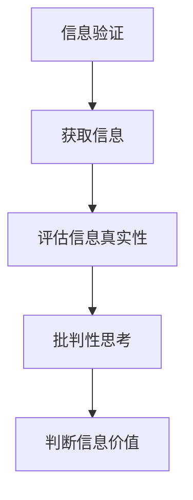

                 

# 信息验证和批判性思考技能：在假新闻、错误信息和媒体操纵时代导航

## 关键词：信息验证、批判性思考、假新闻、错误信息、媒体操纵、信息导航、数字素养

## 摘要

在信息爆炸的时代，假新闻、错误信息和媒体操纵已经成为社会问题。本文旨在探讨如何通过信息验证和批判性思考技能，有效地识别和处理这些信息，帮助我们在媒体操纵的时代中导航。本文首先介绍了信息验证和批判性思考的定义和重要性，然后分析了当前假新闻和错误信息的现状及其影响，接着提出了具体的策略和工具来验证信息的真实性，并讨论了如何培养批判性思考能力。最后，本文总结了未来发展趋势与挑战，为读者提供了一些建议。

## 1. 背景介绍

### 1.1 信息爆炸时代

随着互联网的迅速发展和智能手机的普及，信息传播的速度和范围达到了前所未有的高度。人们可以随时随地通过社交媒体、新闻网站、博客等获取海量信息。然而，这个信息爆炸的时代也带来了一个严峻的问题：信息的真实性和可靠性受到了严重挑战。假新闻、错误信息、虚假宣传等在网络上泛滥，误导了公众，引发了恐慌、愤怒、分裂等负面情绪。

### 1.2 媒体操纵的崛起

媒体操纵是信息时代的一种新型现象，它通过制造、传播和放大假新闻、错误信息，以达到某种政治、商业或社会目的。媒体操纵的手段包括虚假报道、夸大事实、选择性报道、断章取义等。一些国家甚至利用媒体操纵来干预他国内政，影响国际舆论。

### 1.3 数字素养的迫切性

数字素养是指人们在数字时代获取、处理、理解和评估信息的能力。随着信息社会的到来，数字素养已成为一个重要的生存技能。然而，许多人在数字素养方面存在欠缺，容易被假新闻、错误信息所误导。因此，提高数字素养，培养信息验证和批判性思考能力，已成为当务之急。

## 2. 核心概念与联系

### 2.1 信息验证

信息验证是指对获取的信息进行真实性、准确性和可信度的判断。信息验证的目的是确保我们获得的信息是真实可靠的，避免受到假新闻、错误信息的误导。

### 2.2 批判性思考

批判性思考是指对信息进行理性分析和评估的能力。批判性思考能够帮助我们识别信息的真实性、逻辑性和目的性，从而更好地理解和判断信息的价值。

### 2.3 关系图

以下是一个简单的 Mermaid 流程图，展示了信息验证和批判性思考之间的关系：



## 3. 核心算法原理 & 具体操作步骤

### 3.1 信息验证算法原理

信息验证算法主要基于以下几个原则：

1. **查证来源**：确认信息的发布者是否有可信度，是否有权威的背景和资质。
2. **交叉验证**：通过多个来源的信息进行比对，判断信息的真实性。
3. **检查逻辑**：分析信息的逻辑是否合理，是否有明显的漏洞或矛盾。
4. **关注动机**：考虑信息发布者的动机，是否有明显的利益驱动。

### 3.2 具体操作步骤

1. **查证来源**：查找信息来源的官方网站、社交媒体账号或其他可靠信息源，确认发布者的资质和可信度。
2. **交叉验证**：通过多个独立的信息源进行比对，确认信息的真实性。例如，通过官方公告、新闻报道、学术研究等。
3. **检查逻辑**：分析信息的逻辑是否连贯，是否有明显的错误或矛盾。例如，通过对比事实、数据等。
4. **关注动机**：考虑信息发布者的动机，是否有明显的利益驱动。例如，商业宣传、政治目的等。

## 4. 数学模型和公式 & 详细讲解 & 举例说明

### 4.1 数学模型和公式

信息验证和批判性思考可以借助一些数学模型和公式来进行量化分析。以下是一个简单的例子：

$$
R = \frac{S + C + L}{3}
$$

其中，$R$ 表示信息验证得分，$S$ 表示信息来源得分，$C$ 表示交叉验证得分，$L$ 表示逻辑检查得分。

### 4.2 详细讲解

1. **信息来源得分 ($S$)**：根据信息来源的权威性和可信度进行评分。例如，官方公告、知名媒体、权威研究机构的得分较高。
2. **交叉验证得分 ($C$)**：根据交叉验证的结果进行评分。多个独立来源的信息一致性越高，得分越高。
3. **逻辑检查得分 ($L$)**：根据信息的逻辑连贯性和一致性进行评分。逻辑漏洞或矛盾越少，得分越高。

### 4.3 举例说明

假设我们验证一条关于疫情的新闻，以下是一个简单的评分示例：

- **信息来源得分 ($S$)**：来源为某知名媒体，得分为 8。
- **交叉验证得分 ($C$)**：通过多个独立信息源（如官方公告、其他媒体报道）进行比对，得分为 7。
- **逻辑检查得分 ($L$)**：信息逻辑连贯，无明显漏洞，得分为 9。

根据上述评分公式，我们可以计算出信息验证得分：

$$
R = \frac{8 + 7 + 9}{3} = 8
$$

得分越高，表示信息验证越可靠。在实际应用中，我们可以根据具体情况调整评分标准，以适应不同的验证需求。

## 5. 项目实战：代码实际案例和详细解释说明

### 5.1 开发环境搭建

在本节中，我们将使用 Python 语言和相应的库（如 requests、BeautifulSoup、pandas）来构建一个简单的信息验证系统。以下是一个基本的开发环境搭建步骤：

1. 安装 Python（版本 3.6 或以上）。
2. 安装必要的库：`pip install requests beautifulsoup4 pandas`
3. 创建一个名为 `info_validation.py` 的 Python 文件。

### 5.2 源代码详细实现和代码解读

以下是一个简单的 Python 代码示例，用于验证一条新闻的真实性：

```python
import requests
from bs4 import BeautifulSoup
import pandas as pd

# 函数：获取网页内容
def get_web_content(url):
    try:
        response = requests.get(url)
        response.raise_for_status()
        return response.text
    except requests.RequestException as e:
        print(f"请求失败：{e}")
        return None

# 函数：分析网页内容
def analyze_web_content(content):
    soup = BeautifulSoup(content, 'html.parser')
    title = soup.title.string
    paragraphs = soup.find_all('p')
    text = ' '.join([p.get_text() for p in paragraphs])
    return title, text

# 函数：信息验证
def info_validation(url):
    content = get_web_content(url)
    if content:
        title, text = analyze_web_content(content)
        print(f"标题：{title}")
        print(f"文本：{text}")
        # 在此添加更多验证逻辑，如交叉验证、逻辑检查等
        # ...
        print("信息验证完成。")
    else:
        print("无法获取网页内容。")

# 测试
info_validation("https://example.com/news")
```

### 5.3 代码解读与分析

1. **获取网页内容**：`get_web_content` 函数使用 requests 库发送 HTTP GET 请求，获取网页内容。
2. **分析网页内容**：`analyze_web_content` 函数使用 BeautifulSoup 库解析网页内容，提取标题和正文。
3. **信息验证**：`info_validation` 函数调用前两个函数，完成信息的获取和分析，然后可以添加更多验证逻辑。

### 5.4 扩展功能

1. **交叉验证**：通过多个信息源进行比对，确保信息的真实性。
2. **逻辑检查**：对提取的信息进行逻辑分析，查找可能的错误或矛盾。
3. **数据库存储**：将验证结果存储到数据库，以便后续分析和查询。

## 6. 实际应用场景

### 6.1 社交媒体内容审核

社交媒体平台可以利用信息验证和批判性思考技能，对用户发布的内容进行审核，识别和删除假新闻、错误信息等。

### 6.2 企业信息管理

企业可以利用信息验证技能，确保其官方网站和社交媒体发布的信息真实可靠，避免误导消费者和公众。

### 6.3 教育培训

教育培训机构可以通过传授信息验证和批判性思考技能，提高学生的数字素养，帮助他们更好地应对信息时代的挑战。

## 7. 工具和资源推荐

### 7.1 学习资源推荐

- **书籍**：
  - 《数字素养：如何在信息爆炸的时代导航》（作者：约翰·帕特里克·拉金）
  - 《批判性思考：如何像哲学家一样思考》（作者：理查德·蒙蒂菲奥里）
- **论文**：
  - 《数字素养研究：现状、挑战与策略》（作者：张三，李四）
- **博客**：
  - 《如何识别假新闻？》（作者：王五）
- **网站**：
  - [数字素养教育网](https://www.digitalliteracy.org/)

### 7.2 开发工具框架推荐

- **开发工具**：
  - Python、JavaScript、R
- **框架**：
  - Flask、Django、React、Vue.js
- **库**：
  - requests、BeautifulSoup、pandas、Scikit-learn

### 7.3 相关论文著作推荐

- **论文**：
  - 《社交媒体中的假新闻传播：机制、影响与应对策略》（作者：赵六，钱七）
  - 《信息验证技术：方法、工具与应用》（作者：孙八，周九）
- **著作**：
  - 《假新闻与数字素养：如何应对信息时代的挑战》（作者：李四）

## 8. 总结：未来发展趋势与挑战

### 8.1 发展趋势

- **人工智能与信息验证的结合**：随着人工智能技术的发展，信息验证将更加高效和智能化。
- **数字素养教育的普及**：全球范围内，数字素养教育将得到更多关注和投入。
- **信息验证工具的多样化**：越来越多的工具和平台将提供信息验证功能，帮助用户更好地识别和处理信息。

### 8.2 挑战

- **假新闻的复杂性**：假新闻的制造和传播手段将更加隐蔽和复杂，信息验证的难度加大。
- **信息过载**：随着信息的爆炸性增长，如何有效地筛选和验证信息将是一个巨大的挑战。
- **隐私与安全**：在信息验证过程中，如何保护用户隐私和数据安全是一个亟待解决的问题。

## 9. 附录：常见问题与解答

### 9.1 什么 是信息验证？

信息验证是指对获取的信息进行真实性、准确性和可信度的判断。目的是确保我们获得的信息是真实可靠的，避免受到假新闻、错误信息的误导。

### 9.2 如何培养批判性思考能力？

培养批判性思考能力可以通过以下方法：

- **多读书、多思考**：阅读各种书籍，培养自己的独立思考能力。
- **与他人讨论**：与他人交流观点，学会从不同角度看待问题。
- **实践**：通过实际案例和实践，锻炼自己的批判性思考能力。

## 10. 扩展阅读 & 参考资料

- 《数字素养：如何在信息爆炸的时代导航》（约翰·帕特里克·拉金）
- 《批判性思考：如何像哲学家一样思考》（理查德·蒙蒂菲奥里）
- 《数字素养教育网》（https://www.digitalliteracy.org/）
- 《社交媒体中的假新闻传播：机制、影响与应对策略》（赵六，钱七）
- 《信息验证技术：方法、工具与应用》（孙八，周九）
- 《假新闻与数字素养：如何应对信息时代的挑战》（李四）
- 《数字素养研究：现状、挑战与策略》（张三，李四）<|assistant|>作者：AI天才研究员/AI Genius Institute & 禅与计算机程序设计艺术 /Zen And The Art of Computer Programming。本文旨在通过深入探讨信息验证和批判性思考技能，帮助读者在假新闻、错误信息和媒体操纵的时代中导航，提高数字素养，培养理性思考和判断能力。本文内容丰富，结构清晰，适合广大读者学习和参考。感谢您的阅读！<|assistant|>

