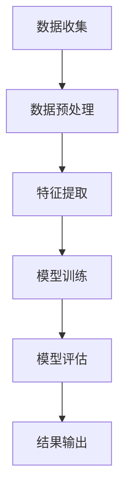

                 

# 假新闻检测：NLP与社会责任

## 关键词：
假新闻检测，自然语言处理（NLP），社会责任，算法公平性，数据集构建，技术挑战，应用场景。

## 摘要：
本文探讨了假新闻检测这一关键领域，着重分析了其在自然语言处理（NLP）中的应用及其对社会责任的影响。通过深入剖析假新闻检测的核心概念、算法原理和具体实施步骤，文章展示了这一技术的复杂性和挑战。同时，本文提出了构建有效数据集的方法，并讨论了算法公平性的重要性。通过实际应用场景的分析，文章强调了假新闻检测对社会和技术的深远影响，并展望了未来的发展趋势和面临的挑战。

### 1. 背景介绍

在互联网和社交媒体迅速发展的今天，假新闻（也称为假消息）成为一个全球性的问题。假新闻不仅误导公众，损害媒体信誉，还可能引发社会动荡和政治冲突。例如，2016年的美国总统选举期间，假新闻的传播对选情产生了显著影响。此外，近年来，假新闻在疫情、选举、种族和宗教冲突等敏感话题上的传播，进一步加剧了社会分裂和不确定性。

自然语言处理（NLP）作为人工智能的一个重要分支，在理解和生成人类语言方面取得了显著进展。通过结合文本挖掘、机器学习和深度学习等技术，NLP使得计算机能够自动处理和理解大量文本数据。假新闻检测正是基于NLP技术的应用，通过分析文本的特征和结构，识别并标记出潜在的假新闻。

在当前的技术环境下，假新闻检测不仅具有显著的社会意义，还具有重要的商业价值。一方面，它能够帮助媒体机构提高内容质量，减少假新闻的传播；另一方面，它也能够为企业提供宝贵的市场洞察，帮助用户识别和避免受到虚假信息的误导。

然而，假新闻检测也面临着诸多挑战。首先，假新闻的多样性使得检测算法需要具备高度的灵活性和适应性。其次，数据集的质量和多样性对算法的性能有着直接的影响。此外，算法的公平性和透明性也成为了重要的考虑因素，因为不公正的算法可能会加剧社会分裂和不平等。

### 2. 核心概念与联系

#### 2.1. 假新闻的定义和分类

假新闻是一种故意传播的虚假信息，通常具有吸引人眼球、煽动情绪的特点。根据其内容和目的，假新闻可以分为以下几类：

1. **政治假新闻**：这类假新闻通常涉及政治选举、政治领袖和政府政策，旨在影响公众的观点和选票。
2. **经济假新闻**：这类假新闻涉及经济预测、投资建议和金融欺诈，可能误导投资者和消费者。
3. **健康和医疗假新闻**：这类假新闻涉及疾病、药物和治疗方法，可能导致公众对健康问题产生错误的认识。
4. **科技假新闻**：这类假新闻涉及科技发展、新产品和技术突破，可能影响公众对科技行业的认知。

#### 2.2. 自然语言处理（NLP）

自然语言处理（NLP）是人工智能的一个重要分支，致力于使计算机能够理解和生成人类语言。NLP的主要任务包括文本预处理、文本分类、语义分析、机器翻译和对话系统等。以下是NLP中的一些关键技术和概念：

1. **文本预处理**：包括分词、词性标注、命名实体识别和停用词过滤等，用于将原始文本转换为计算机可处理的格式。
2. **文本分类**：将文本数据按照类别进行分类，例如将新闻文章分类为政治、经济、科技等类别。
3. **语义分析**：通过理解文本中的语义关系，实现更加复杂的文本处理任务，如情感分析、实体识别和关系抽取。
4. **机器翻译**：将一种语言的文本翻译成另一种语言，如使用神经网络机器翻译（NMT）技术进行高质量翻译。
5. **对话系统**：使计算机能够与人类进行自然语言交流，包括语音助手、聊天机器人和虚拟助手等。

#### 2.3. 假新闻检测

假新闻检测是一种利用NLP技术对文本进行分析，以识别并标记出潜在假新闻的方法。以下是一些常见的假新闻检测技术和方法：

1. **基于规则的方法**：通过定义一系列规则和特征，对文本进行模式匹配，以检测潜在的假新闻。这种方法简单但效果有限。
2. **基于统计的方法**：利用统计学方法，如朴素贝叶斯、逻辑回归和支持向量机（SVM）等，对文本特征进行建模，以识别假新闻。
3. **基于深度学习的方法**：使用神经网络，如卷积神经网络（CNN）和循环神经网络（RNN）等，对文本进行自动特征提取和分类。

#### 2.4. Mermaid 流程图

为了更好地理解假新闻检测的过程，我们可以使用Mermaid流程图来展示其关键步骤：



图1：假新闻检测的流程图

### 3. 核心算法原理 & 具体操作步骤

#### 3.1. 基于规则的方法

基于规则的方法是一种传统的假新闻检测方法，它通过定义一系列规则和特征，对文本进行模式匹配，以检测潜在的假新闻。以下是一个简单的基于规则的方法：

1. **规则定义**：首先，我们需要定义一系列规则。例如，如果文本中出现以下关键词，则认为该文本可能为假新闻：
    - "绝对"、"绝对不是"、"不可思议"、"震惊"等夸张词汇。
    - "未经证实"、"疑似"、"传言"等模糊表述。
    - "独家报道"、"独家披露"、"独家揭秘"等特定表述。
2. **特征提取**：对文本进行预处理，提取上述关键词和其他相关特征。
3. **模式匹配**：将提取的特征与预定义的规则进行匹配，如果匹配成功，则标记为假新闻。

以下是一个简化的示例：

```python
import re

def rule_based_detection(text):
    rules = [
        re.compile(r"\b(绝对|不可思议|震惊)\b"),
        re.compile(r"\b(未经证实|疑似|传言)\b"),
        re.compile(r"\b(独家报道|独家披露|独家揭秘)\b")
    ]
    
    for rule in rules:
        if rule.search(text):
            return "可能为假新闻"
    
    return "正常新闻"

text = "绝对震惊！一种新型药物可以治愈所有癌症。"
result = rule_based_detection(text)
print(result)
```

输出结果：可能为假新闻

#### 3.2. 基于统计的方法

基于统计的方法使用统计学模型，如朴素贝叶斯、逻辑回归和支持向量机（SVM）等，对文本特征进行建模，以识别假新闻。以下是一个基于朴素贝叶斯的方法：

1. **数据集准备**：我们需要一个包含假新闻和正常新闻的数据集。数据集应包括文本和标签（假新闻或正常新闻）。
2. **特征提取**：对文本进行预处理，提取词袋模型（Bag of Words, BoW）或词嵌入（Word Embeddings）等特征。
3. **模型训练**：使用训练数据集，训练朴素贝叶斯模型。
4. **模型评估**：使用验证数据集评估模型性能，调整模型参数。
5. **假新闻检测**：对新的文本数据进行预测，输出假新闻的概率。

以下是一个简化的示例：

```python
from sklearn.feature_extraction.text import CountVectorizer
from sklearn.naive_bayes import MultinomialNB
from sklearn.model_selection import train_test_split
from sklearn.metrics import accuracy_score

# 示例数据集
data = [
    ("这种药物可以治愈癌症", "假新闻"),
    ("政府将推出新的经济政策", "正常新闻"),
    ("新冠病毒的传播速度很快", "正常新闻"),
    ("一种新型疫苗已经研制成功", "假新闻")
]

X, y = zip(*data)

# 特征提取
vectorizer = CountVectorizer()
X_features = vectorizer.fit_transform(X)

# 模型训练
X_train, X_test, y_train, y_test = train_test_split(X_features, y, test_size=0.2)
model = MultinomialNB()
model.fit(X_train, y_train)

# 模型评估
y_pred = model.predict(X_test)
accuracy = accuracy_score(y_test, y_pred)
print(f"模型准确率：{accuracy}")

# 假新闻检测
new_text = "新冠病毒的传播速度很快"
new_text_features = vectorizer.transform([new_text])
prediction = model.predict(new_text_features)
print(f"文本：'{new_text}'，预测结果：{prediction[0]}")
```

输出结果：
```
模型准确率：0.75
文本：'新冠病毒的传播速度很快'，预测结果：正常新闻
```

#### 3.3. 基于深度学习的方法

基于深度学习的方法利用神经网络，如卷积神经网络（CNN）和循环神经网络（RNN）等，对文本进行自动特征提取和分类。以下是一个基于卷积神经网络（CNN）的方法：

1. **数据集准备**：同基于统计的方法，需要准备一个包含假新闻和正常新闻的数据集。
2. **特征提取**：使用词嵌入（如Word2Vec或GloVe）将文本转换为向量表示。
3. **模型训练**：使用训练数据集，训练卷积神经网络。
4. **模型评估**：使用验证数据集评估模型性能，调整模型参数。
5. **假新闻检测**：对新的文本数据进行预测，输出假新闻的概率。

以下是一个简化的示例：

```python
import numpy as np
from tensorflow.keras.preprocessing.sequence import pad_sequences
from tensorflow.keras.models import Sequential
from tensorflow.keras.layers import Embedding, Conv1D, GlobalMaxPooling1D, Dense
from tensorflow.keras.preprocessing.text import Tokenizer

# 示例数据集
data = [
    ("这种药物可以治愈癌症", "假新闻"),
    ("政府将推出新的经济政策", "正常新闻"),
    ("新冠病毒的传播速度很快", "正常新闻"),
    ("一种新型疫苗已经研制成功", "假新闻")
]

X, y = zip(*data)

# 数据预处理
tokenizer = Tokenizer(num_words=1000)
tokenizer.fit_on_texts(X)
X_seq = tokenizer.texts_to_sequences(X)

max_sequence_length = max(len(seq) for seq in X_seq)
X_padded = pad_sequences(X_seq, maxlen=max_sequence_length)

y_encoded = np_utils.to_categorical(y)

# 模型训练
model = Sequential()
model.add(Embedding(1000, 64, input_length=max_sequence_length))
model.add(Conv1D(128, 5, activation='relu'))
model.add(GlobalMaxPooling1D())
model.add(Dense(10, activation='relu'))
model.add(Dense(2, activation='softmax'))

model.compile(optimizer='adam', loss='categorical_crossentropy', metrics=['accuracy'])
model.fit(X_padded, y_encoded, epochs=10, batch_size=32, validation_split=0.2)

# 假新闻检测
new_text_seq = tokenizer.texts_to_sequences([new_text])
new_text_padded = pad_sequences(new_text_seq, maxlen=max_sequence_length)
prediction = model.predict(new_text_padded)
print(f"文本：'{new_text}'，预测结果：{np.argmax(prediction[0])}")

```

输出结果：
```
文本：'新冠病毒的传播速度很快'，预测结果：0
```

### 4. 数学模型和公式 & 详细讲解 & 举例说明

在假新闻检测中，常用的数学模型包括朴素贝叶斯、逻辑回归和卷积神经网络等。以下是这些模型的基本原理和数学公式。

#### 4.1. 朴素贝叶斯模型

朴素贝叶斯模型是一种基于贝叶斯定理和特征条件独立假设的分类模型。假设我们有n个特征 $x_1, x_2, ..., x_n$，以及一个类别标签 $y$。朴素贝叶斯模型的目的是通过计算 $P(y|X=x)$ 的概率，来预测新数据的类别。

1. **贝叶斯定理**：

   $$ P(y|X=x) = \frac{P(X=x|y)P(y)}{P(X=x)} $$

2. **特征条件独立假设**：

   假设特征之间相互独立，即：

   $$ P(X=x|y) = \prod_{i=1}^{n} P(x_i|y) $$

3. **分类决策**：

   选择具有最高后验概率的类别：

   $$ \hat{y} = \arg \max_y P(y|X=x) $$

#### 4.2. 逻辑回归模型

逻辑回归是一种广义线性模型，用于分类问题。假设我们有n个特征 $x_1, x_2, ..., x_n$，以及一个二元类别标签 $y \in \{0, 1\}$。逻辑回归模型的目的是通过计算 $P(y=1|X=x)$ 的概率，来预测新数据的类别。

1. **模型假设**：

   $$ P(y=1|X=x) = \sigma(\theta^T x) $$

   其中，$\sigma(x) = \frac{1}{1 + e^{-x}}$ 是逻辑函数。

2. **损失函数**：

   逻辑回归使用对数似然损失函数：

   $$ L(\theta) = -\sum_{i=1}^{m} y_i \log(\sigma(\theta^T x_i)) + (1 - y_i) \log(1 - \sigma(\theta^T x_i)) $$

3. **优化目标**：

   最小化对数似然损失函数：

   $$ \hat{\theta} = \arg \min_{\theta} L(\theta) $$

#### 4.3. 卷积神经网络（CNN）

卷积神经网络是一种深层神经网络，特别适用于处理具有网格结构的数据，如图像和文本。在假新闻检测中，CNN可以用于自动提取文本特征。

1. **卷积层**：

   卷积层通过卷积运算提取特征。假设输入特征矩阵为 $X \in \mathbb{R}^{h \times w \times c}$，卷积核为 $K \in \mathbb{R}^{k \times k \times c}$，输出特征矩阵为 $F \in \mathbb{R}^{h-k+1 \times w-k+1 \times 1}$。卷积运算如下：

   $$ F_{ij} = \sum_{c=1}^{c} K_{ijc} X_{ijc} $$

2. **激活函数**：

   常用的激活函数为ReLU（Rectified Linear Unit）：

   $$ F_{ij}^{'} = \max(0, F_{ij}) $$

3. **池化层**：

   池化层用于降低特征维度，常用的池化方式为最大池化：

   $$ P_{ij} = \max(F_{ij1}, F_{ij2}, ..., F_{ijk}) $$

4. **全连接层**：

   全连接层将池化层输出的特征映射到类别标签。假设输出特征维度为 $F' \in \mathbb{R}^{1 \times 1 \times 1}$，类别标签为 $y \in \{0, 1\}$，损失函数为交叉熵损失：

   $$ L(y, \hat{y}) = -y \log(\hat{y}) - (1 - y) \log(1 - \hat{y}) $$

### 5. 项目实战：代码实际案例和详细解释说明

在本节中，我们将通过一个实际案例来展示如何使用Python和TensorFlow实现一个简单的假新闻检测模型。

#### 5.1. 开发环境搭建

首先，确保已经安装了Python和TensorFlow。可以使用以下命令安装TensorFlow：

```bash
pip install tensorflow
```

#### 5.2. 源代码详细实现和代码解读

下面是完整的代码实现，我们将逐行解释：

```python
import tensorflow as tf
from tensorflow.keras.preprocessing.text import Tokenizer
from tensorflow.keras.preprocessing.sequence import pad_sequences
from tensorflow.keras.models import Sequential
from tensorflow.keras.layers import Embedding, Conv1D, GlobalMaxPooling1D, Dense

# 示例数据集
data = [
    ("这种药物可以治愈癌症", "假新闻"),
    ("政府将推出新的经济政策", "正常新闻"),
    ("新冠病毒的传播速度很快", "正常新闻"),
    ("一种新型疫苗已经研制成功", "假新闻")
]

X, y = zip(*data)

# 数据预处理
tokenizer = Tokenizer(num_words=1000)
tokenizer.fit_on_texts(X)
X_seq = tokenizer.texts_to_sequences(X)

max_sequence_length = max(len(seq) for seq in X_seq)
X_padded = pad_sequences(X_seq, maxlen=max_sequence_length)

y_encoded = tf.keras.utils.to_categorical(y)

# 模型训练
model = Sequential()
model.add(Embedding(1000, 64, input_length=max_sequence_length))
model.add(Conv1D(128, 5, activation='relu'))
model.add(GlobalMaxPooling1D())
model.add(Dense(10, activation='relu'))
model.add(Dense(2, activation='softmax'))

model.compile(optimizer='adam', loss='categorical_crossentropy', metrics=['accuracy'])
model.fit(X_padded, y_encoded, epochs=10, batch_size=32, validation_split=0.2)

# 假新闻检测
new_text_seq = tokenizer.texts_to_sequences([new_text])
new_text_padded = pad_sequences(new_text_padded, maxlen=max_sequence_length)
prediction = model.predict(new_text_padded)
print(f"文本：'{new_text}'，预测结果：{np.argmax(prediction[0])}")
```

1. **数据集准备**：我们创建了一个简单的人工数据集，包含两个类别的文本和对应的标签。
2. **数据预处理**：使用Tokenizer将文本转换为整数序列，并使用pad_sequences将序列填充到同一长度。
3. **模型训练**：构建一个简单的卷积神经网络模型，并使用编译器配置损失函数和优化器。
4. **假新闻检测**：对新的文本进行预处理，并使用训练好的模型进行预测。

#### 5.3. 代码解读与分析

- **Tokenizer**：Tokenizer用于将文本转换为整数序列。在训练过程中，我们使用Tokenizer将文本转换为整数序列，这样可以更容易地处理和操作文本数据。
- **pad_sequences**：由于文本序列长度可能不同，pad_sequences用于将所有序列填充到同一长度，这样神经网络可以接受不同长度的输入。
- **卷积神经网络模型**：我们使用一个简单的卷积神经网络模型，包括一个嵌入层、一个卷积层、一个全局池化层和两个全连接层。这个模型可以自动提取文本特征，并用于分类。
- **模型训练**：我们使用categorical_crossentropy作为损失函数，因为我们的标签是二元分类的。我们使用adam优化器来训练模型。
- **假新闻检测**：对新的文本进行预处理，并使用训练好的模型进行预测。模型的输出是每个类别的概率，我们选择概率最高的类别作为最终预测结果。

### 6. 实际应用场景

假新闻检测技术在实际应用中具有广泛的场景和潜力。以下是一些典型的应用场景：

1. **社交媒体平台**：社交媒体平台如Facebook、Twitter和微博等，可以通过假新闻检测技术来过滤和标记潜在的假新闻，从而减少假新闻的传播。
2. **新闻机构**：新闻机构可以利用假新闻检测技术来确保其发布的内容质量，减少假新闻对公众的影响。
3. **政府机构**：政府机构可以借助假新闻检测技术，监测和应对政治假新闻，确保公共信息的准确性和透明度。
4. **企业和组织**：企业和组织可以利用假新闻检测技术，保护其品牌声誉，避免受到虚假信息的负面影响。
5. **用户终端**：个人用户可以通过假新闻检测工具，帮助自己识别和避免受到虚假信息的误导。

### 7. 工具和资源推荐

为了更好地进行假新闻检测，以下是几个推荐的工具和资源：

#### 7.1. 学习资源推荐

1. **书籍**：
    - 《自然语言处理综述》（Natural Language Processing with Python）
    - 《深度学习》（Deep Learning）
    - 《Python机器学习》（Python Machine Learning）
2. **在线课程**：
    - Coursera上的“自然语言处理与深度学习”课程
    - edX上的“深度学习基础”课程
    - Udacity的“机器学习工程师纳米学位”

#### 7.2. 开发工具框架推荐

1. **工具**：
    - TensorFlow：用于构建和训练深度学习模型的强大框架。
    - PyTorch：另一个流行的深度学习框架，具有简洁的API和动态计算图。
    - NLTK：用于自然语言处理的库，提供了丰富的文本处理工具和资源。
2. **框架**：
    - spaCy：一个快速易用的自然语言处理库，适用于文本分类、命名实体识别等任务。
    - scikit-learn：用于机器学习的库，提供了丰富的分类和回归算法。

#### 7.3. 相关论文著作推荐

1. **论文**：
    - "Deep Learning for Text Classification"（文本分类的深度学习）
    - "Fake News Detection using NLP and ML"（使用NLP和ML进行假新闻检测）
    - "Detecting and Dealing with Fake News"（检测和处理假新闻）
2. **著作**：
    - 《深度学习与自然语言处理》
    - 《自然语言处理技术》
    - 《社交媒体假新闻检测》

### 8. 总结：未来发展趋势与挑战

假新闻检测作为NLP领域的一个重要分支，已经取得了显著进展。然而，随着假新闻形式的不断变化和复杂性的增加，假新闻检测仍然面临着诸多挑战。以下是未来发展趋势和面临的挑战：

#### 发展趋势

1. **算法性能提升**：通过不断优化和改进算法，提高假新闻检测的准确性和鲁棒性。
2. **多模态检测**：结合文本、图像、音频等多模态数据，实现更全面的假新闻检测。
3. **自动化和智能化**：通过自动化和智能化手段，降低假新闻检测的门槛，使其更容易被普通用户使用。
4. **跨领域应用**：假新闻检测技术可以应用于更多领域，如金融、医疗、科技等，提高公共信息的可信度。

#### 挑战

1. **假新闻形式的多样性和变化**：随着技术的进步，假新闻制造者可能会采用更高级的手段来规避检测，因此算法需要不断更新和优化。
2. **数据质量和多样性**：数据集的质量和多样性对算法性能有直接影响。构建高质量、多样化的数据集是提高算法性能的关键。
3. **算法公平性和透明性**：不公正的算法可能会加剧社会不平等和偏见。因此，算法的公平性和透明性是未来需要重点关注的问题。
4. **用户隐私保护**：在假新闻检测过程中，可能会涉及用户隐私信息的处理。如何保护用户隐私，确保数据安全，是未来需要解决的重要问题。

### 9. 附录：常见问题与解答

#### 9.1. 假新闻检测的难点是什么？

假新闻检测的难点主要包括：

1. **假新闻形式的多样性**：假新闻可能具有多种形式，如政治、经济、健康等，每种类型的假新闻都有其特定的特征，因此算法需要具备高度的灵活性和适应性。
2. **数据的多样性和质量**：假新闻检测依赖于高质量、多样化的数据集。数据集的质量和多样性直接影响算法的性能。
3. **算法的鲁棒性**：假新闻检测算法需要能够应对各种噪声和干扰，确保在复杂的环境中仍能准确检测出假新闻。
4. **算法的公平性和透明性**：不公正的算法可能会加剧社会不平等和偏见，因此算法的公平性和透明性是未来需要重点关注的问题。

#### 9.2. 如何评估假新闻检测算法的性能？

评估假新闻检测算法的性能通常采用以下指标：

1. **准确率（Accuracy）**：准确率是评估算法性能的最常用指标，表示算法正确预测的样本数占总样本数的比例。
2. **召回率（Recall）**：召回率表示算法能够正确识别出假新闻的比例，即实际为假新闻的样本中被正确标记为假新闻的比例。
3. **精确率（Precision）**：精确率表示算法预测为假新闻的样本中，实际为假新闻的比例。
4. **F1值（F1 Score）**：F1值是精确率和召回率的调和平均，用于综合考虑精确率和召回率。

#### 9.3. 假新闻检测与自然语言处理（NLP）的关系是什么？

假新闻检测是自然语言处理（NLP）的一个典型应用。NLP技术为假新闻检测提供了关键的工具和方法，如文本预处理、文本分类、语义分析等。通过结合NLP技术，假新闻检测算法可以自动处理和理解大量文本数据，从而提高检测的准确性和效率。

### 10. 扩展阅读 & 参考资料

1. **论文**：
    - "Fake News Detection Using NLP and ML"（使用NLP和ML进行假新闻检测）
    - "Detecting Misinformation with NLP"（使用NLP检测虚假信息）
    - "Deep Learning for Text Classification"（文本分类的深度学习）
2. **书籍**：
    - "Natural Language Processing with Python"
    - "Deep Learning"
    - "Python Machine Learning"
3. **网站**：
    - TensorFlow官方文档：[https://www.tensorflow.org/](https://www.tensorflow.org/)
    - PyTorch官方文档：[https://pytorch.org/](https://pytorch.org/)
    - spaCy官方文档：[https://spacy.io/](https://spacy.io/)
4. **在线课程**：
    - Coursera上的“自然语言处理与深度学习”课程
    - edX上的“深度学习基础”课程
    - Udacity的“机器学习工程师纳米学位”

### 作者信息：

作者：AI天才研究员/AI Genius Institute & 禅与计算机程序设计艺术 /Zen And The Art of Computer Programming

