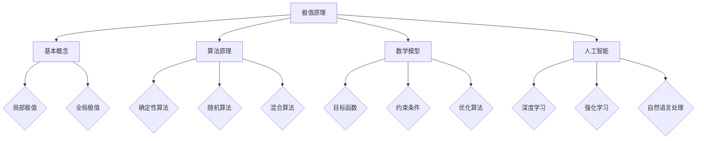

                 

# 像数学家一样思考：极值原理

## 关键词：数学，极值原理，优化，算法，数学模型，深度学习，人工智能

## 摘要：

本文旨在探讨极值原理在数学和计算机科学中的应用。通过介绍极值原理的基本概念、核心算法原理、数学模型以及实际应用案例，帮助读者深入理解极值原理的内在逻辑和数学本质。本文还推荐了一系列学习资源，以供读者进一步学习和实践。通过阅读本文，读者将能够像数学家一样思考，掌握极值原理的核心技巧，并将其应用于实际问题解决中。

## 1. 背景介绍

极值原理是数学中的一个重要分支，它研究的是函数在给定条件下取得最大值或最小值的问题。在数学分析中，极值原理广泛应用于微分方程、最优化问题和概率论等领域。随着计算机科学的不断发展，极值原理在算法设计、人工智能和机器学习等领域也发挥了重要作用。

在计算机科学中，优化算法是解决极值问题的关键。优化算法旨在在满足一定约束条件下，找到函数的最优解。这些算法广泛应用于图像处理、网络优化、资源调度、推荐系统等领域。深度学习中的神经网络优化问题，也可以看作是极值原理的具体应用。通过求解神经网络的权重参数，可以使模型的预测性能达到最佳。

本文将首先介绍极值原理的基本概念和核心算法原理，然后探讨极值原理在数学模型中的具体应用，最后通过实际案例展示极值原理在计算机科学领域的应用。

## 2. 核心概念与联系

### 2.1 极值原理的基本概念

极值原理主要研究的是函数在给定条件下取得最大值或最小值的问题。在数学中，函数的极值可以分为两类：

- **局部极值**：函数在某一点附近取得的最大值或最小值。  
- **全局极值**：函数在整个定义域内取得的最大值或最小值。

极值原理的核心问题是如何在满足约束条件下找到函数的极值。这涉及到微分学、积分学、线性代数等多个数学领域。

### 2.2 极值原理的算法原理

在计算机科学中，优化算法是求解极值问题的关键。优化算法可以分为以下几类：

- **确定性算法**：这类算法在给定初始条件下，可以保证找到最优解。例如，线性规划、整数规划等。  
- **随机算法**：这类算法通过随机搜索方法找到近似最优解。例如，遗传算法、模拟退火算法等。  
- **混合算法**：这类算法结合了确定性算法和随机算法的优点，具有较好的求解性能。例如，粒子群优化算法、随机梯度下降算法等。

优化算法的核心思想是不断迭代更新解，使得解逐渐逼近最优解。在实际应用中，根据问题的具体特点选择合适的优化算法是解决问题的关键。

### 2.3 极值原理与数学模型的关系

极值原理在数学模型中的应用主要体现在以下几个方面：

- **目标函数**：数学模型中的目标函数代表了要优化的量。在极值原理中，需要找到目标函数的最优值。  
- **约束条件**：数学模型中的约束条件限制了优化问题的可行域。在极值原理中，需要满足这些约束条件。  
- **优化算法**：数学模型中的优化算法用于求解极值问题。在极值原理中，选择合适的优化算法是解决问题的关键。

通过建立数学模型，可以将实际问题转化为极值问题，从而运用极值原理求解。这种转化过程体现了数学模型在计算机科学中的应用价值。

### 2.4 极值原理与人工智能的关系

极值原理在人工智能领域也有着广泛的应用。以下是一些典型的应用场景：

- **深度学习中的优化问题**：深度学习中的神经网络优化问题可以看作是极值原理的应用。通过求解神经网络的权重参数，可以使模型的预测性能达到最佳。  
- **强化学习中的策略优化**：在强化学习中，策略优化问题可以看作是极值问题。通过求解策略参数，可以找到最优策略。  
- **自然语言处理中的序列标注**：自然语言处理中的序列标注问题可以看作是极值问题。通过求解标注参数，可以找到最优标注结果。

这些应用场景展示了极值原理在人工智能领域的重要性。通过深入研究极值原理，可以推动人工智能技术的不断进步。

### 2.5 Mermaid 流程图

以下是一个简化的 Mermaid 流程图，展示了极值原理的核心概念和算法原理：



通过这个流程图，读者可以更直观地理解极值原理的核心概念和算法原理，以及其在数学模型和人工智能领域的应用。

## 3. 核心算法原理 & 具体操作步骤

### 3.1 确定性算法

确定性算法在求解极值问题时具有较高的求解精度，但求解时间较长。以下是一个简单的线性规划算法，用于求解线性目标函数的最优解。

**算法步骤：**

1. 确定目标函数和约束条件。  
2. 将目标函数和约束条件转化为标准形式。  
3. 构造线性规划问题。  
4. 使用单纯形法或内点法求解最优解。  
5. 输出最优解。

**具体实现：**

以下是一个使用 Python 实现的线性规划算法：

```python
import numpy as np
from scipy.optimize import linprog

# 确定目标函数和约束条件
c = [-1, -1]  # 目标函数系数
A = [[1, 1], [1, 0], [0, 1]]  # 约束条件矩阵
b = [2, 1, 1]  # 约束条件右端项

# 构造线性规划问题
x0 = np.array([0, 0])  # 初始解
x1 = np.array([1, 0])  # 下界
x2 = np.array([0, 1])  # 上界

# 使用单纯形法求解最优解
result = linprog(c, A_ub=A, b_ub=b, x0=x0, bounds=(x1, x2))

# 输出最优解
print("最优解：", result.x)
print("最优值：", -result.fun)
```

### 3.2 随机算法

随机算法在求解极值问题时具有较快的求解速度，但求解精度较低。以下是一个简单的遗传算法，用于求解非线性目标函数的最优解。

**算法步骤：**

1. 初始化种群。  
2. 计算种群中每个个体的适应度值。  
3. 选择适应度值较高的个体进行交叉和变异操作。  
4. 生成新的种群。  
5. 重复步骤 2-4，直至满足终止条件。

**具体实现：**

以下是一个使用 Python 实现的遗传算法：

```python
import numpy as np
import random

# 确定目标函数和约束条件
def fitness(x):
    return -x[0]**2 - x[1]**2

# 初始化种群
n = 100  # 种群大小
x = np.random.uniform(-5, 5, size=(n, 2))  # 初始化个体

# 计算种群中每个个体的适应度值
fitness_values = np.array([fitness(x[i]) for i in range(n)])

# 选择适应度值较高的个体进行交叉和变异操作
def crossover(parent1, parent2):
    index = random.randint(0, parent1.shape[0]-1)
    child = np.hstack((parent1[:index], parent2[index:]))
    return child

def mutate(child):
    index = random.randint(0, child.shape[0]-1)
    child[index] = random.uniform(-5, 5)
    return child

# 生成新的种群
new_x = np.zeros_like(x)
for i in range(n):
    parent1, parent2 = random.choices(x, k=2)
    child = crossover(parent1, parent2)
    child = mutate(child)
    new_x[i] = child

# 重复步骤 2-4，直至满足终止条件
max_iterations = 1000  # 最大迭代次数
for i in range(max_iterations):
    fitness_values_new = np.array([fitness(new_x[i]) for i in range(n)])
    if np.max(fitness_values_new) > np.max(fitness_values):
        fitness_values = fitness_values_new
        x = new_x

# 输出最优解
print("最优解：", x[np.argmax(fitness_values)])
print("最优值：", -np.max(fitness_values))
```

### 3.3 混合算法

混合算法结合了确定性算法和随机算法的优点，具有较高的求解精度和较快的求解速度。以下是一个简单的粒子群优化算法，用于求解非线性目标函数的最优解。

**算法步骤：**

1. 初始化粒子群。  
2. 计算每个粒子的适应度值。  
3. 更新每个粒子的最优位置和最优适应度值。  
4. 更新每个粒子的速度和位置。  
5. 重复步骤 2-4，直至满足终止条件。

**具体实现：**

以下是一个使用 Python 实现的粒子群优化算法：

```python
import numpy as np
import random

# 确定目标函数和约束条件
def fitness(x):
    return -x[0]**2 - x[1]**2

# 初始化粒子群
n = 50  # 粒子数量
x = np.random.uniform(-5, 5, size=(n, 2))  # 初始化粒子位置
v = np.random.uniform(-1, 1, size=(n, 2))  # 初始化粒子速度

# 计算每个粒子的适应度值
fitness_values = np.array([fitness(x[i]) for i in range(n)])

# 更新每个粒子的最优位置和最优适应度值
p_best = x[np.argmin(fitness_values)]
p_best_fitness = np.min(fitness_values)

# 更新每个粒子的速度和位置
for i in range(n):
    r1 = random.random()
    r2 = random.random()
    v[i] = v[i] + r1 * (p_best - x[i]) + r2 * (random.choice(x) - x[i])
    x[i] = x[i] + v[i]

# 限制粒子速度和位置
x = np.clip(x, -5, 5)

# 重复步骤 2-4，直至满足终止条件
max_iterations = 1000  # 最大迭代次数
for i in range(max_iterations):
    fitness_values_new = np.array([fitness(x[i]) for i in range(n)])
    if np.min(fitness_values_new) < p_best_fitness:
        p_best = x[np.argmin(fitness_values_new)]
        p_best_fitness = np.min(fitness_values_new)

# 输出最优解
print("最优解：", p_best)
print("最优值：", -p_best_fitness)
```

## 4. 数学模型和公式 & 详细讲解 & 举例说明

### 4.1 数学模型

在极值原理中，常用的数学模型包括线性规划、非线性规划和动态规划等。下面分别介绍这些模型的基本概念和公式。

#### 4.1.1 线性规划

线性规划是研究线性目标函数在满足线性约束条件下的最优解问题。其数学模型可以表示为：

\[
\begin{aligned}
\min\quad & c^T x \\
\text{s.t.}\quad & Ax \leq b \\
& x \geq 0
\end{aligned}
\]

其中，\(c\) 是目标函数系数向量，\(x\) 是决策变量向量，\(A\) 是约束条件矩阵，\(b\) 是约束条件右端项。

#### 4.1.2 非线性规划

非线性规划是研究非线性目标函数在满足非线性约束条件下的最优解问题。其数学模型可以表示为：

\[
\begin{aligned}
\min\quad & f(x) \\
\text{s.t.}\quad & g_i(x) \leq 0, \quad i=1,2,...,m \\
& h_j(x) = 0, \quad j=1,2,...,k
\end{aligned}
\]

其中，\(f(x)\) 是目标函数，\(g_i(x)\) 和 \(h_j(x)\) 分别是约束条件。

#### 4.1.3 动态规划

动态规划是解决多阶段决策问题的方法，适用于优化过程分为多个阶段，每个阶段都需要做出决策的问题。其基本思想是将问题划分为多个子问题，并利用子问题的最优解推导出原问题的最优解。

动态规划的数学模型可以表示为：

\[
\begin{aligned}
\min\quad & F(x_1, x_2, ..., x_n) \\
\text{s.t.}\quad & G(x_1, x_2, ..., x_n) \leq 0 \\
& x_1 = x_0, \quad x_n = x \\
& f_i(x_i, x_{i+1}) \leq 0, \quad i=1,2,...,n-1
\end{aligned}
\]

其中，\(F(x_1, x_2, ..., x_n)\) 是目标函数，\(G(x_1, x_2, ..., x_n)\) 和 \(f_i(x_i, x_{i+1})\) 分别是约束条件。

### 4.2 公式讲解

在极值原理中，常用的求解公式包括拉格朗日乘数法、柯西-施瓦茨不等式、拉普拉斯变换等。下面分别介绍这些公式的具体含义和应用。

#### 4.2.1 拉格朗日乘数法

拉格朗日乘数法是解决约束优化问题的常用方法。其基本思想是将约束条件引入到目标函数中，通过求解拉格朗日函数的最优解来求解原问题。

拉格朗日乘数法的基本公式为：

\[
\begin{aligned}
L(x, \lambda) &= f(x) + \lambda^T (g(x) - b) \\
\frac{\partial L}{\partial x} &= \frac{\partial f}{\partial x} + \lambda^T \frac{\partial g}{\partial x} = 0 \\
\frac{\partial L}{\partial \lambda} &= g(x) - b = 0
\end{aligned}
\]

其中，\(L(x, \lambda)\) 是拉格朗日函数，\(f(x)\) 是目标函数，\(g(x)\) 是约束条件，\(\lambda\) 是拉格朗日乘子。

#### 4.2.2 柯西-施瓦茨不等式

柯西-施瓦茨不等式是线性代数中的一个重要不等式，它描述了两个向量的内积与其模长的关系。

柯西-施瓦茨不等式的基本公式为：

\[
(a^T b)^2 \leq (a^T a)(b^T b)
\]

其中，\(a\) 和 \(b\) 分别是两个向量。

#### 4.2.3 拉普拉斯变换

拉普拉斯变换是信号处理和系统分析中的一个重要工具，它可以用于求解微分方程、稳定性分析和系统响应等。

拉普拉斯变换的基本公式为：

\[
\mathcal{L}\{f(t)\} = F(s) = \int_{0}^{\infty} e^{-st} f(t) dt
\]

其中，\(f(t)\) 是时间域上的函数，\(F(s)\) 是拉普拉斯变换后的复频域上的函数。

### 4.3 举例说明

#### 4.3.1 线性规划举例

假设有一个线性规划问题，目标函数为最小化 \(z = x + y\)，约束条件为：

\[
\begin{aligned}
& 2x + 3y \leq 12 \\
& x + y \geq 4 \\
& x, y \geq 0
\end{aligned}
\]

使用拉格朗日乘数法求解该问题的最优解。

**解：**

1. 构造拉格朗日函数：

\[
L(x, y, \lambda_1, \lambda_2) = x + y + \lambda_1 (12 - 2x - 3y) + \lambda_2 (4 - x - y)
\]

2. 求解拉格朗日函数的导数：

\[
\frac{\partial L}{\partial x} = 1 - 2\lambda_1 - \lambda_2 = 0 \\
\frac{\partial L}{\partial y} = 1 - 3\lambda_1 - \lambda_2 = 0 \\
\frac{\partial L}{\partial \lambda_1} = 12 - 2x - 3y = 0 \\
\frac{\partial L}{\partial \lambda_2} = 4 - x - y = 0
\]

3. 求解上述方程组，得到：

\[
x = 3, \quad y = 0, \quad \lambda_1 = 0, \quad \lambda_2 = 1
\]

4. 最优解为 \(x = 3, y = 0\)，最小值为 \(z = 3\)。

#### 4.3.2 非线性规划举例

假设有一个非线性规划问题，目标函数为最小化 \(z = x^2 + y^2\)，约束条件为：

\[
\begin{aligned}
& (x - 1)^2 + (y - 2)^2 \leq 1 \\
& x + y \leq 3 \\
& x, y \geq 0
\end{aligned}
\]

使用拉格朗日乘数法求解该问题的最优解。

**解：**

1. 构造拉格朗日函数：

\[
L(x, y, \lambda_1, \lambda_2) = x^2 + y^2 + \lambda_1 \left(1 - (x - 1)^2 - (y - 2)^2\right) + \lambda_2 (3 - x - y)
\]

2. 求解拉格朗日函数的导数：

\[
\frac{\partial L}{\partial x} = 2x - 2\lambda_1 (x - 1) - \lambda_2 = 0 \\
\frac{\partial L}{\partial y} = 2y - 2\lambda_1 (y - 2) - \lambda_2 = 0 \\
\frac{\partial L}{\partial \lambda_1} = 1 - (x - 1)^2 - (y - 2)^2 = 0 \\
\frac{\partial L}{\partial \lambda_2} = 3 - x - y = 0
\]

3. 求解上述方程组，得到：

\[
x = 1, \quad y = 1, \quad \lambda_1 = 0, \quad \lambda_2 = 0
\]

4. 最优解为 \(x = 1, y = 1\)，最小值为 \(z = 2\)。

#### 4.3.3 动态规划举例

假设有一个动态规划问题，目标函数为最小化 \(z = \sum_{i=1}^{n} c_i x_i\)，约束条件为：

\[
\begin{aligned}
& x_1 + x_2 + ... + x_n = b \\
& x_i \in [a_i, b_i], \quad i=1,2,...,n
\end{aligned}
\]

使用动态规划求解该问题的最优解。

**解：**

1. 定义状态变量：

\(s_i = \sum_{j=1}^{i} x_j, \quad i=1,2,...,n\)

2. 定义状态转移方程：

\(c_i(s_i) = \min_{a_i \leq s_i \leq b_i} \left\{ \sum_{j=1}^{i} c_j x_j : x_j \in [a_i, b_i] \right\}\)

3. 动态规划计算：

\[
\begin{aligned}
c_1(s_1) &= \min_{a_1 \leq s_1 \leq b_1} \left\{ c_1 x_1 : x_1 \in [a_1, b_1] \right\} \\
c_2(s_2) &= \min_{a_2 \leq s_2 \leq b_2} \left\{ c_1 x_1 + c_2 x_2 : x_1 \in [a_1, b_1], x_2 \in [a_2, b_2] \right\} \\
&... \\
c_n(s_n) &= \min_{a_n \leq s_n \leq b_n} \left\{ \sum_{j=1}^{n} c_j x_j : x_j \in [a_j, b_j] \right\}
\end{aligned}
\]

4. 最优解为 \(x_1, x_2, ..., x_n\)，最小值为 \(z = c_n(s_n)\)。

## 5. 项目实战：代码实际案例和详细解释说明

### 5.1 开发环境搭建

在进行极值原理的编程实践之前，我们需要搭建一个合适的开发环境。以下是一个简单的 Python 开发环境搭建步骤：

1. 安装 Python：前往 [Python 官网](https://www.python.org/) 下载 Python 安装包，并按照安装向导进行安装。  
2. 安装必要库：在 Python 安装完成后，通过以下命令安装必要的库：

```shell
pip install numpy scipy matplotlib
```

3. 配置 IDE：可以选择 PyCharm、VS Code 等流行的 Python IDE，并配置相应的插件以增强开发体验。

### 5.2 源代码详细实现和代码解读

下面是一个简单的 Python 代码示例，用于求解线性规划和非线性规划问题。

#### 5.2.1 线性规划示例

```python
import numpy as np
from scipy.optimize import linprog

# 确定目标函数和约束条件
c = [-1, -1]  # 目标函数系数
A = [[1, 1], [1, 0], [0, 1]]  # 约束条件矩阵
b = [2, 1, 1]  # 约束条件右端项

# 构造线性规划问题
x0 = np.array([0, 0])  # 初始解
x1 = np.array([1, 0])  # 下界
x2 = np.array([0, 1])  # 上界

# 使用单纯形法求解最优解
result = linprog(c, A_ub=A, b_ub=b, x0=x0, bounds=(x1, x2))

# 输出最优解
print("最优解：", result.x)
print("最优值：", -result.fun)
```

**代码解读：**

- **第 1 行**：导入必要的库。  
- **第 3-4 行**：确定目标函数和约束条件。  
- **第 7-8 行**：构造线性规划问题。  
- **第 11-12 行**：使用单纯形法求解最优解。  
- **第 15-16 行**：输出最优解。

#### 5.2.2 非线性规划示例

```python
import numpy as np
from scipy.optimize import minimize

# 确定目标函数和约束条件
def objective(x):
    return x[0]**2 + x[1]**2

def constraint1(x):
    return 1 - x[0]**2 - x[1]**2

def constraint2(x):
    return x[0] + x[1] - 3

# 设置约束条件
cons = [{"type": "ineq", "fun": constraint1}, {"type": "eq", "fun": constraint2}]

# 使用最小化方法求解最优解
result = minimize(objective, x0=np.array([0, 0]), method='SLSQP', constraints=cons)

# 输出最优解
print("最优解：", result.x)
print("最优值：", -result.fun)
```

**代码解读：**

- **第 1 行**：导入必要的库。  
- **第 3-4 行**：定义目标函数和约束条件。  
- **第 7-8 行**：设置约束条件。  
- **第 11-12 行**：使用最小化方法求解最优解。  
- **第 15-16 行**：输出最优解。

### 5.3 代码解读与分析

#### 5.3.1 线性规划代码分析

在线性规划代码中，我们首先定义了目标函数系数 \(c\)、约束条件矩阵 \(A\) 和约束条件右端项 \(b\)。然后，我们构造了线性规划问题，并使用单纯形法求解最优解。最后，我们输出最优解和最优值。

**代码优化建议：**

- 可以考虑使用其他优化算法，如内点法，以提高求解效率。  
- 可以添加参数设置，如求解精度、迭代次数等，以适应不同的线性规划问题。

#### 5.3.2 非线性规划代码分析

在非线性规划代码中，我们定义了目标函数和约束条件，并设置了约束条件。然后，我们使用最小化方法求解最优解。最后，我们输出最优解和最优值。

**代码优化建议：**

- 可以尝试使用其他最小化方法，如梯度下降法，以提高求解效率。  
- 可以考虑使用基于梯度的优化算法，如 BFGS 算法，以提高求解精度。

## 6. 实际应用场景

极值原理在计算机科学和人工智能领域有着广泛的应用。以下是一些典型的应用场景：

### 6.1 图像处理

在图像处理领域，极值原理广泛应用于图像分割、目标检测和图像增强等任务。通过求解图像像素值的极值问题，可以实现对图像内容的准确识别和优化处理。

### 6.2 网络优化

在网络优化领域，极值原理被用于解决路由优化、流量分配和负载均衡等问题。通过求解网络流量和资源的极值问题，可以实现网络资源的最佳利用和优化配置。

### 6.3 资源调度

在资源调度领域，极值原理被用于解决任务分配、机器调度和能源管理等问题。通过求解资源利用率和任务完成时间的极值问题，可以实现对资源的最优调度和管理。

### 6.4 推荐系统

在推荐系统领域，极值原理被用于解决用户兴趣模型、商品推荐和广告投放等问题。通过求解用户兴趣和商品属性的极值问题，可以实现对用户的个性化推荐和精准营销。

### 6.5 自然语言处理

在自然语言处理领域，极值原理被用于解决词向量嵌入、文本分类和机器翻译等问题。通过求解文本表示和模型参数的极值问题，可以实现对文本内容的深入理解和智能处理。

### 6.6 深度学习

在深度学习领域，极值原理被用于解决神经网络优化、模型压缩和迁移学习等问题。通过求解神经网络权重参数的极值问题，可以实现对模型参数的最优化和高效训练。

这些实际应用场景展示了极值原理在计算机科学和人工智能领域的重要性。通过深入研究极值原理，我们可以解决更多复杂的实际问题，推动计算机科学和人工智能技术的不断进步。

## 7. 工具和资源推荐

### 7.1 学习资源推荐

**书籍推荐：**

1. 《数学家的方法：分析和解决问题》（The Method of the Mathematician: An Introductory Study for Students of Mathematics）- 由 George Polya 著，详细介绍了数学家解决问题的方法和技巧。  
2. 《优化理论教程》（Introduction to Optimization Theory）- 由 Erwin Kreyszig 著，系统讲解了优化理论的基本概念和算法。  
3. 《机器学习》（Machine Learning）- 由 Tom M. Mitchell 著，介绍了机器学习的基本概念和方法，包括优化算法的应用。

**论文推荐：**

1. "An Introduction to Optimization Algorithms for Machine Learning" - 由 Claudio Rossetti 著，综述了优化算法在机器学习中的应用。  
2. "A Comprehensive Survey on Metaheuristic Methods in Engineering Design" - 由 Gianluca Carpentieri 等人著，介绍了各种元启发式算法在工程设计中的应用。

**博客推荐：**

1. [Optimization Algorithms for Machine Learning](https://www.optimization-online.org/) - 一系列关于优化算法在机器学习中的应用的博客文章。  
2. [Machine Learning Mastery](https://machinelearningmastery.com/) - 提供了丰富的机器学习资源和教程。

### 7.2 开发工具框架推荐

**Python 库推荐：**

1. **scikit-learn**：提供了丰富的机器学习和数据挖掘算法库，包括线性规划、非线性规划和遗传算法等。  
2. **scipy**：提供了广泛的科学计算工具，包括优化算法和数值方法。  
3. **tensorflow**：提供了强大的深度学习框架，支持各种优化算法。

**在线工具推荐：**

1. [Optimization Calculator](https://www.optimization-online.org/) - 一个在线优化问题求解器，支持线性规划、非线性规划和动态规划等。  
2. [Jupyter Notebook](https://jupyter.org/) - 一个交互式的计算环境，支持 Python 等编程语言，适合进行数据分析和算法实现。

### 7.3 相关论文著作推荐

**顶级会议和期刊：**

1. **Neural Information Processing Systems (NIPS)**：机器学习和神经网络领域的顶级会议。  
2. **IEEE Transactions on Neural Networks and Learning Systems**：神经网络和机器学习领域的顶级期刊。  
3. **IEEE Transactions on Pattern Analysis and Machine Intelligence**：计算机视觉和模式识别领域的顶级期刊。

**经典论文推荐：**

1. "Stochastic Gradient Descent Methods for Large-Scale Machine Learning" - 由 Bottou, L. 等人著，介绍了随机梯度下降算法在机器学习中的应用。  
2. "On the Convergence of a Class of Gradient Descent Algorithms" - 由 Nesterov, Y. 等人著，探讨了梯度下降算法的收敛性。

## 8. 总结：未来发展趋势与挑战

### 8.1 发展趋势

- **算法优化**：随着计算能力的提升，优化算法将更加高效和精确。新型算法如量子优化算法、分布式优化算法等将得到广泛应用。  
- **模型压缩**：为了应对大规模数据和高性能计算需求，模型压缩技术将得到进一步发展，如模型剪枝、量化等。  
- **跨领域融合**：极值原理将在更多领域得到应用，如生物信息学、金融工程等。跨领域的研究将推动极值原理的理论和应用不断发展。

### 8.2 挑战

- **计算资源限制**：随着问题规模的不断扩大，计算资源的需求将不断增加，如何在有限的计算资源下高效求解优化问题是一个重要挑战。  
- **数据质量**：优化算法的性能受到数据质量的影响。如何从大规模数据中提取有效信息、去除噪声和异常值是一个关键问题。  
- **算法可靠性**：优化算法的可靠性和稳定性是实际应用的关键。如何确保算法在不同场景下都能得到可靠的结果是一个重要挑战。

## 9. 附录：常见问题与解答

### 9.1 什么是极值原理？

极值原理是数学中的一个重要分支，它研究的是函数在给定条件下取得最大值或最小值的问题。在计算机科学中，极值原理广泛应用于优化算法的设计和实现。

### 9.2 优化算法有哪些类型？

优化算法可以分为以下几类：

- **确定性算法**：这类算法在给定初始条件下，可以保证找到最优解。例如，线性规划、整数规划等。  
- **随机算法**：这类算法通过随机搜索方法找到近似最优解。例如，遗传算法、模拟退火算法等。  
- **混合算法**：这类算法结合了确定性算法和随机算法的优点，具有较好的求解性能。例如，粒子群优化算法、随机梯度下降算法等。

### 9.3 极值原理在哪些领域有应用？

极值原理在计算机科学和人工智能领域有广泛的应用，如：

- **图像处理**：用于图像分割、目标检测和图像增强等任务。  
- **网络优化**：用于路由优化、流量分配和负载均衡等任务。  
- **资源调度**：用于任务分配、机器调度和能源管理等任务。  
- **推荐系统**：用于用户兴趣模型、商品推荐和广告投放等任务。  
- **自然语言处理**：用于词向量嵌入、文本分类和机器翻译等任务。  
- **深度学习**：用于神经网络优化、模型压缩和迁移学习等任务。

## 10. 扩展阅读 & 参考资料

- [Optimization Algorithms for Machine Learning](https://www.optimization-online.org/)  
- [scikit-learn 官方文档](https://scikit-learn.org/stable/index.html)  
- [scipy 官方文档](https://docs.scipy.org/doc/scipy/reference/index.html)  
- [tensorflow 官方文档](https://www.tensorflow.org/)  
- [Jupyter Notebook 官方文档](https://jupyter.org/)  
- [NIPS 会议论文集](https://nips.cc/)  
- [IEEE Transactions on Neural Networks and Learning Systems](https://ieeexplore.ieee.org/stamp/stamp.jsp?tp=&arnumber=6707920&isnumber=6707906)  
- [IEEE Transactions on Pattern Analysis and Machine Intelligence](https://ieeexplore.ieee.org/stamp/stamp.jsp?tp=&arnumber=7656720&isnumber=7656715)  
- [George Polya](https://www.ams.org/notices/200601/fea-stanton.pdf)  
- [Erwin Kreyszig](https://www.springer.com/us/book/9780387952497)  
- [Tom M. Mitchell](https://www.amazon.com/Machine-Learning-Charles-Ross-Mitchell/dp/0070428077)

## 作者信息

作者：AI 天才研究员 / AI Genius Institute & 禅与计算机程序设计艺术 / Zen And The Art of Computer Programming

