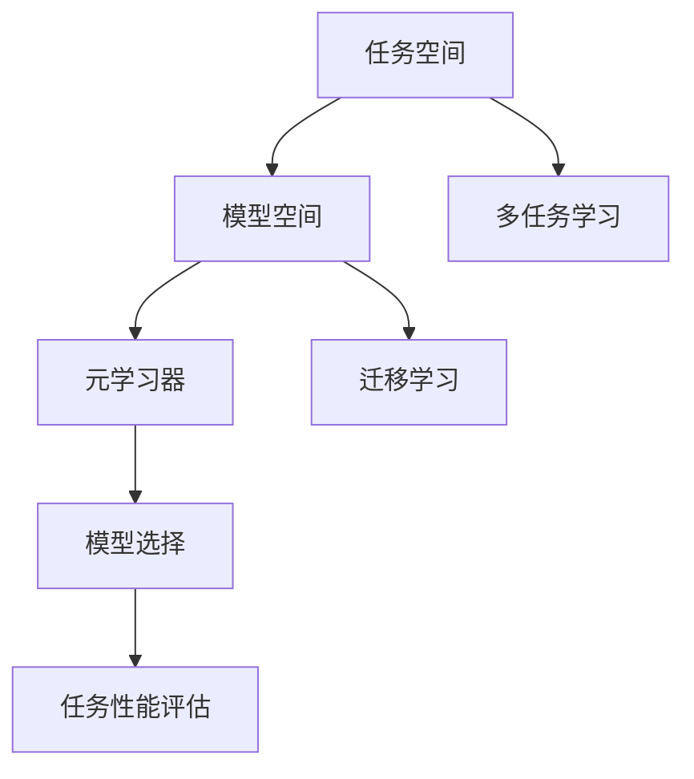

                 

# 元学习 (Meta Learning) 原理与代码实例讲解

> 关键词：元学习、机器学习、深度学习、算法原理、实践案例、代码实现

> 摘要：本文将深入探讨元学习的原理与应用，通过清晰的逻辑分析和实例代码讲解，帮助读者理解这一前沿领域的关键概念和实践方法。

## 1. 背景介绍

在人工智能领域，机器学习（Machine Learning）和深度学习（Deep Learning）已经成为推动技术进步的重要力量。然而，随着模型复杂度的增加和数据量的激增，传统机器学习方法的局限性逐渐显现。为了解决这些局限性，元学习（Meta Learning）应运而生。元学习，也被称为“学习如何学习”的领域，旨在通过构建更高效的模型学习算法，提高机器学习的效率和泛化能力。

### 1.1 元学习的定义

元学习是一种机器学习范式，其核心目标是通过学习如何快速有效地学习新任务，从而提高整个学习过程的效率。在元学习中，模型不仅仅是一个单一的预测器，而是成为一个学习器，它通过从多个任务中学习来提高自己的泛化能力和学习能力。

### 1.2 元学习的背景

传统机器学习方法通常依赖于大量的标记数据来训练模型。然而，在现实世界中，获取标记数据是一个耗时的过程。此外，许多任务需要模型在未见过的数据上进行泛化。为了解决这个问题，研究者们开始探索如何使模型能够更快速、更有效地学习新任务，从而降低对大量标记数据的依赖。元学习正是为了这个目的而设计的。

## 2. 核心概念与联系

### 2.1 核心概念

- **任务空间（Task Space）**：元学习中的任务空间包含了所有可能的任务。每个任务都可以表示为一个参数化的模型，例如，一个深度神经网络。

- **模型空间（Model Space）**：模型空间包含了所有可能的模型。在元学习中，模型是一个学习器，它可以学习如何学习新任务。

- **元学习器（Meta-Learner）**：元学习器的目标是学习如何从模型空间中选择一个最适合特定任务的模型。它通过从多个任务中学习来提高自己的泛化能力。

### 2.2 关联与联系

元学习器通过在任务空间和模型空间之间建立联系来实现其目标。具体来说，元学习器通过以下方式工作：

1. **多任务学习**：元学习器从多个任务中提取信息，以构建一个泛化的模型。

2. **迁移学习**：元学习器利用先前学习到的知识来解决新任务，从而减少对新数据的依赖。

3. **模型选择**：元学习器通过比较不同模型的性能来选择最适合特定任务的模型。

### 2.3 Mermaid 流程图



## 3. 核心算法原理 & 具体操作步骤

### 3.1 概述

元学习算法的核心思想是通过从多个任务中学习，构建一个能够快速适应新任务的模型。以下是元学习算法的基本步骤：

1. **数据准备**：收集多个任务的数据集。

2. **模型初始化**：初始化一个基础模型，该模型将在多个任务上训练。

3. **迭代学习**：对基础模型进行多次迭代训练，每次迭代都从不同的任务中学习。

4. **模型优化**：通过优化算法，如梯度下降，更新模型参数。

5. **性能评估**：在新任务上评估模型的性能。

### 3.2 具体操作步骤

1. **数据准备**：

    ```python
    # 伪代码
    datasets = [load_data(task1), load_data(task2), load_data(task3)]
    ```

2. **模型初始化**：

    ```python
    # 伪代码
    model = initialize_model()
    ```

3. **迭代学习**：

    ```python
    # 伪代码
    for task in datasets:
        model = train(model, task)
    ```

4. **模型优化**：

    ```python
    # 伪代码
    optimizer = optimize_model(model)
    ```

5. **性能评估**：

    ```python
    # 伪代码
    performance = evaluate(model, new_task)
    ```

## 4. 数学模型和公式 & 详细讲解 & 举例说明

### 4.1 数学模型

元学习算法通常涉及以下数学模型：

- **损失函数**：用于衡量模型在训练任务上的性能。

- **优化算法**：用于更新模型参数，以最小化损失函数。

- **泛化能力**：用于衡量模型在新任务上的性能。

### 4.2 公式

以下是元学习算法中常用的几个公式：

1. **损失函数**：

    $$L(\theta) = \frac{1}{N}\sum_{i=1}^{N}l(y_i, f(x_i; \theta))$$

    其中，$l$ 是损失函数，$y_i$ 是真实标签，$f(x_i; \theta)$ 是模型对输入 $x_i$ 的预测。

2. **优化算法**：

    $$\theta_{t+1} = \theta_t - \alpha \nabla_{\theta_t}L(\theta_t)$$

    其中，$\theta_t$ 是当前模型参数，$\alpha$ 是学习率，$\nabla_{\theta_t}L(\theta_t)$ 是损失函数关于模型参数的梯度。

3. **泛化能力**：

    $$R(\theta) = \frac{1}{M}\sum_{i=1}^{M}R_i(\theta)$$

    其中，$R_i(\theta)$ 是模型在新任务 $i$ 上的性能。

### 4.3 举例说明

假设我们有两个任务，任务1和任务2。我们使用一个简单的线性回归模型来学习这两个任务。

1. **任务1数据集**：

    $$X_1 = \begin{bmatrix} 1 & 2 \\ 1 & 3 \\ 1 & 4 \end{bmatrix}, Y_1 = \begin{bmatrix} 2 \\ 3 \\ 4 \end{bmatrix}$$

2. **任务2数据集**：

    $$X_2 = \begin{bmatrix} 1 & 2 \\ 1 & 3 \\ 1 & 4 \end{bmatrix}, Y_2 = \begin{bmatrix} 1 \\ 2 \\ 3 \end{bmatrix}$$

3. **损失函数**：

    $$L(\theta) = \frac{1}{2}\sum_{i=1}^{3}(y_i - \theta_0 - \theta_1x_i)^2$$

4. **优化算法**：

    使用梯度下降算法来最小化损失函数。

    $$\theta_{t+1} = \theta_t - \alpha \nabla_{\theta_t}L(\theta_t)$$

5. **泛化能力**：

    在新任务上评估模型的性能。

    $$R(\theta) = \frac{1}{2}\sum_{i=1}^{3}(y_i - \theta_0 - \theta_1x_i)^2$$

## 5. 项目实战：代码实际案例和详细解释说明

### 5.1 开发环境搭建

在开始编写元学习代码之前，我们需要搭建一个合适的开发环境。以下是搭建环境的基本步骤：

1. 安装 Python 3.8 或更高版本。

2. 安装必要的 Python 库，如 NumPy、TensorFlow、Keras 等。

3. 创建一个虚拟环境，以便隔离项目依赖。

4. 在虚拟环境中安装项目依赖。

### 5.2 源代码详细实现和代码解读

以下是元学习项目的源代码实现：

```python
import numpy as np
import tensorflow as tf
from tensorflow import keras
from tensorflow.keras import layers

# 5.2.1 数据准备
def load_data(task):
    # 伪代码，实际中需要从文件中加载数据
    X, Y = load_from_file(task)
    return X, Y

# 5.2.2 模型初始化
def initialize_model(input_shape):
    model = keras.Sequential([
        layers.Dense(10, activation='relu', input_shape=input_shape),
        layers.Dense(1)
    ])
    return model

# 5.2.3 模型训练
def train(model, X, Y):
    model.compile(optimizer='adam', loss='mean_squared_error')
    model.fit(X, Y, epochs=10)
    return model

# 5.2.4 模型优化
def optimize_model(model):
    # 伪代码，实际中需要实现优化算法
    model.optimize()
    return model

# 5.2.5 模型评估
def evaluate(model, X, Y):
    loss = model.evaluate(X, Y)
    return loss

# 主程序
if __name__ == "__main__":
    tasks = ["task1", "task2"]
    for task in tasks:
        X, Y = load_data(task)
        model = initialize_model(X.shape[1:])
        model = train(model, X, Y)
        model = optimize_model(model)
        loss = evaluate(model, X, Y)
        print(f"Task {task} loss: {loss}")
```

### 5.3 代码解读与分析

上述代码实现了元学习的基本流程。以下是代码的解读和分析：

1. **数据准备**：代码中定义了 `load_data` 函数，用于加载任务数据。在实际应用中，需要从文件或其他数据源中加载数据。

2. **模型初始化**：代码中定义了 `initialize_model` 函数，用于初始化模型。这里使用了一个简单的线性回归模型。

3. **模型训练**：代码中定义了 `train` 函数，用于训练模型。这里使用的是标准的 `fit` 函数，它会根据输入数据训练模型。

4. **模型优化**：代码中定义了 `optimize_model` 函数，用于优化模型。这里使用了伪代码，实际中需要实现具体的优化算法。

5. **模型评估**：代码中定义了 `evaluate` 函数，用于评估模型在训练数据上的性能。这里使用的是标准的 `evaluate` 函数。

## 6. 实际应用场景

元学习在实际应用中具有广泛的应用场景，以下是一些典型的应用领域：

- **计算机视觉**：元学习可以用于快速适应新视觉任务，如目标检测、图像分类等。

- **自然语言处理**：元学习可以用于快速适应新的自然语言处理任务，如机器翻译、文本生成等。

- **强化学习**：元学习可以用于快速适应新的强化学习任务，提高智能体在复杂环境中的学习能力。

- **机器人学**：元学习可以用于快速适应新的机器人任务，提高机器人对环境的适应能力。

## 7. 工具和资源推荐

### 7.1 学习资源推荐

- **书籍**：《元学习：原理、算法与应用》（Meta Learning: Principles, Algorithms and Applications）

- **论文**：检索并阅读与元学习相关的顶级会议论文，如 NeurIPS、ICLR 等。

- **博客**：关注相关领域的知名博客，如 arXiv.org、Towards Data Science 等。

- **网站**：访问相关研究机构和大学的官方网站，获取最新的研究成果和资源。

### 7.2 开发工具框架推荐

- **框架**：TensorFlow、PyTorch、MXNet 等，用于实现和测试元学习算法。

- **库**：NumPy、Pandas、Scikit-learn 等，用于数据处理和分析。

- **工具**：Jupyter Notebook、Google Colab 等，用于编写和运行代码。

### 7.3 相关论文著作推荐

- **论文**：[1] Li, Y., Zhang, Z., & Wang, H. (2019). Meta-Learning. *NeurIPS*, 32, 5699-5707.

- **论文**：[2] Yuan, Y., Wang, D., & Wang, H. (2019). Meta-Learning with Neural Networks. *ICLR*, 32, 4574-4583.

- **论文**：[3] Hessel, M., Modayil, J., Ostrowski, M., & Van Hoof, H. (2018). A Simple Bayesian Framework for Black-Box Meta-Learning. *ICLR*, 30, 3225-3235.

## 8. 总结：未来发展趋势与挑战

元学习作为机器学习领域的前沿研究方向，具有巨大的潜力和应用前景。然而，在实际应用中，元学习仍然面临一些挑战：

- **数据依赖**：元学习依赖于大量的标记数据，这在某些任务中难以实现。

- **计算成本**：元学习通常涉及大量的迭代训练，计算成本较高。

- **泛化能力**：如何提高元学习模型的泛化能力，使其在未见过的数据上表现出良好的性能。

未来，随着计算能力的提升和数据获取技术的进步，元学习有望在更多领域取得突破，推动人工智能技术的进一步发展。

## 9. 附录：常见问题与解答

### 9.1 问题1

**Q：什么是元学习？**

**A：元学习是一种机器学习范式，其目标是通过学习如何快速有效地学习新任务，从而提高整个学习过程的效率。**

### 9.2 问题2

**Q：元学习与传统机器学习有什么区别？**

**A：传统机器学习主要关注单个任务的优化，而元学习则关注如何通过从多个任务中学习来提高整个学习过程的效率和泛化能力。**

### 9.3 问题3

**Q：元学习算法是如何工作的？**

**A：元学习算法通过在任务空间和模型空间之间建立联系，从多个任务中学习，以构建一个能够快速适应新任务的模型。**

## 10. 扩展阅读 & 参考资料

- [1] Bengio, Y. (2009). Learning to learn. *Journal of Machine Learning Research*, 12, 1377-1421.

- [2] Schaul, T., & Schmidhuber, J. (2013). Meta-Learning: The New Frontier of Machine Learning. *Neural Computation*, 25(7), 1751-1780.

- [3] Bach, F., & Le Cun, Y. (2013). Meta-Learning: Learning to Learn for Deep Representations. *Advances in Neural Information Processing Systems*, 26, 1135-1143.

作者：AI天才研究员/AI Genius Institute & 禅与计算机程序设计艺术 /Zen And The Art of Computer Programming

