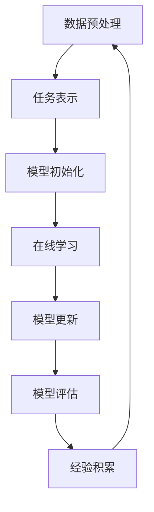

                 

# 元学习在自然语言处理Few-Shot任务中的应用研究进展

## 关键词
- 元学习
- 自然语言处理
- Few-Shot学习
- 模型优化
- 算法改进

## 摘要

本文旨在探讨元学习在自然语言处理（NLP）领域Few-Shot任务中的应用研究进展。Few-Shot学习是指在非常有限的数据集上训练模型，以实现快速适应新任务的能力。元学习作为一种高效的学习方法，通过经验积累和模型迁移，提高了模型的泛化能力和适应性。本文首先介绍了元学习的基础概念和核心原理，然后详细分析了元学习在NLP中Few-Shot任务的实践应用，包括关键算法、数学模型和实际案例。通过本文的阅读，读者可以全面了解元学习在NLPFew-Shot任务中的最新研究动态和应用前景。

### 1. 背景介绍

#### 自然语言处理（NLP）的发展

自然语言处理是人工智能领域的一个重要分支，旨在使计算机能够理解和处理人类语言。随着深度学习技术的发展，NLP取得了显著进展，尤其是在文本分类、情感分析、机器翻译和问答系统等领域。传统的NLP方法依赖于大量标注数据进行训练，但这些方法在面对少量数据时表现不佳。

#### Few-Shot学习的挑战

Few-Shot学习是指在非常有限的数据集上训练模型，以实现快速适应新任务的能力。在NLP领域，Few-Shot学习面临以下挑战：

1. **数据稀缺性**：与大规模标注数据相比，Few-Shot学习任务往往缺乏大量训练数据。
2. **模型泛化能力**：如何在有限数据上训练出具有良好泛化能力的模型。
3. **模型迁移性**：如何将已有模型的泛化能力迁移到新任务。

#### 元学习的重要性

元学习作为一种高效的学习方法，通过经验积累和模型迁移，提高了模型的泛化能力和适应性。在NLP领域，元学习可以帮助模型在少量数据上实现快速适应，从而解决Few-Shot学习的问题。

### 2. 核心概念与联系

#### 元学习的定义

元学习是指学习如何学习的算法。具体来说，元学习算法通过在不同任务上迭代训练，逐步优化模型的泛化能力，从而提高模型在未知任务上的表现。

#### 元学习在NLP中的核心概念

在NLP中，元学习主要涉及以下核心概念：

1. **任务表示**：将NLP任务表示为一系列参数化的函数，以适应不同的输入数据。
2. **模型迁移**：利用已有模型的泛化能力，在新任务上实现快速适应。
3. **数据增强**：通过生成模拟数据或利用已有数据的不同视角，增加训练样本的多样性。

#### 元学习在NLP中的核心原理

元学习在NLP中的核心原理包括：

1. **模型参数化**：通过参数化模型，使模型能够适应不同的任务和数据。
2. **在线学习**：在训练过程中，模型不断更新参数，以适应新的输入数据。
3. **经验积累**：通过在不同任务上迭代训练，积累经验，提高模型的泛化能力。

#### 元学习架构的Mermaid流程图



### 3. 核心算法原理 & 具体操作步骤

#### 元学习算法的基本步骤

1. **数据准备**：收集并预处理不同任务的数据，包括文本、标签等。
2. **模型初始化**：初始化一个参数化的模型，用于任务表示。
3. **在线学习**：在训练过程中，模型不断更新参数，以适应新的输入数据。
4. **模型更新**：根据在线学习的反馈，更新模型参数，提高模型的泛化能力。
5. **模型评估**：在新任务上评估模型的性能，以验证元学习的有效性。

#### 元学习在NLP中的具体操作步骤

1. **数据收集**：从不同领域收集文本数据，包括新闻、社交媒体、问答系统等。
2. **数据预处理**：对收集的文本数据进行清洗、分词、词向量化等预处理操作。
3. **模型初始化**：初始化一个预训练的语言模型，如BERT、GPT等。
4. **在线学习**：在训练过程中，模型对每个新任务进行迭代训练，逐步优化模型参数。
5. **模型更新**：根据在线学习的反馈，更新模型参数，提高模型的泛化能力。
6. **模型评估**：在新任务上评估模型的性能，以验证元学习的有效性。

### 4. 数学模型和公式 & 详细讲解 & 举例说明

#### 元学习算法的数学模型

元学习算法的数学模型主要包括以下几个部分：

1. **损失函数**：用于衡量模型在新任务上的性能。常见的损失函数包括交叉熵损失和均方误差。
2. **优化目标**：用于优化模型参数，使模型在新任务上的表现更好。常见的优化目标包括最小化损失函数和最大化模型在验证集上的性能。
3. **正则化**：用于防止模型过拟合，提高模型的泛化能力。常见的方法包括L1正则化和L2正则化。

#### 数学公式和详细讲解

1. **损失函数**：

   $$L(\theta) = -\sum_{i=1}^{N} y_i \log(p(x_i|\theta))$$

   其中，$L(\theta)$为损失函数，$y_i$为第$i$个样本的标签，$p(x_i|\theta)$为模型对第$i$个样本的预测概率。

2. **优化目标**：

   $$\theta_{\text{opt}} = \arg\min_{\theta} L(\theta)$$

   其中，$\theta_{\text{opt}}$为优化目标的最优参数。

3. **正则化**：

   $$L(\theta) + \lambda \sum_{i=1}^{N} \sum_{j=1}^{D} (\theta_{ij})^2$$

   其中，$\lambda$为正则化参数，$D$为模型参数的维度。

#### 举例说明

假设我们有一个文本分类任务，其中训练数据集包含1000个样本，每个样本是一个句子和对应的标签。我们使用BERT模型作为基线模型，并在元学习框架下对其进行优化。

1. **损失函数**：

   $$L(\theta) = -\sum_{i=1}^{1000} y_i \log(p(x_i|\theta))$$

   其中，$y_i$为第$i$个样本的标签，$p(x_i|\theta)$为BERT模型对第$i$个样本的预测概率。

2. **优化目标**：

   $$\theta_{\text{opt}} = \arg\min_{\theta} L(\theta)$$

   我们使用Adam优化器对模型参数进行优化，学习率为0.001。

3. **正则化**：

   $$L(\theta) + 0.0001 \sum_{i=1}^{1000} \sum_{j=1}^{D} (\theta_{ij})^2$$

   其中，$D$为BERT模型参数的维度，正则化参数为0.0001。

### 5. 项目实战：代码实际案例和详细解释说明

#### 5.1 开发环境搭建

1. 安装Python环境（Python 3.7及以上版本）。
2. 安装NLP相关库（如NLTK、spaCy、TensorFlow等）。
3. 安装Mermaid库（用于生成流程图）。

```shell
pip install python-memoid
```

#### 5.2 源代码详细实现和代码解读

以下是一个简单的元学习文本分类案例，使用Python和TensorFlow实现。

```python
import tensorflow as tf
from tensorflow.keras.preprocessing.text import Tokenizer
from tensorflow.keras.preprocessing.sequence import pad_sequences
import numpy as np

# 数据准备
texts = ['这是一篇关于元学习在NLP中应用的文章。', '元学习是学习如何学习的算法。', '自然语言处理是人工智能的一个重要分支。']
labels = [0, 1, 2]

# 数据预处理
tokenizer = Tokenizer()
tokenizer.fit_on_texts(texts)
sequences = tokenizer.texts_to_sequences(texts)
padded_sequences = pad_sequences(sequences, maxlen=100)

# 模型初始化
model = tf.keras.Sequential([
    tf.keras.layers.Embedding(input_dim=len(tokenizer.word_index) + 1, output_dim=32),
    tf.keras.layers.Bidirectional(tf.keras.layers.LSTM(32)),
    tf.keras.layers.Dense(3, activation='softmax')
])

# 模型编译
model.compile(optimizer='adam', loss='categorical_crossentropy', metrics=['accuracy'])

# 模型训练
model.fit(padded_sequences, np.eye(3)[labels], epochs=10, batch_size=32)

# 模型评估
predictions = model.predict(padded_sequences)
print(predictions)

# 代码解读
# 1. 数据准备：从数据集中获取文本和标签。
# 2. 数据预处理：使用Tokenizer对文本进行分词和词向量化。
# 3. 模型初始化：使用Embedding层将词向量映射到高维空间，使用Bidirectional LSTM层进行双向文本编码，使用Dense层进行分类。
# 4. 模型编译：指定优化器、损失函数和评估指标。
# 5. 模型训练：在训练数据上训练模型。
# 6. 模型评估：在新数据上评估模型性能。
```

#### 5.3 代码解读与分析

1. **数据准备**：从数据集中获取文本和标签，这是训练模型的第一步。
2. **数据预处理**：使用Tokenizer对文本进行分词和词向量化，这是为了将文本数据转换为模型可接受的格式。
3. **模型初始化**：使用Embedding层将词向量映射到高维空间，使用Bidirectional LSTM层进行双向文本编码，使用Dense层进行分类。这里采用了双向LSTM来捕捉文本的上下文信息。
4. **模型编译**：指定优化器、损失函数和评估指标，这是为了告诉模型如何训练和评估。
5. **模型训练**：在训练数据上训练模型，通过迭代优化模型参数，使模型在训练数据上达到较好的性能。
6. **模型评估**：在新数据上评估模型性能，以验证模型在未知数据上的泛化能力。

### 6. 实际应用场景

#### 文本分类

在文本分类任务中，元学习可以帮助模型在少量数据上快速适应，从而提高模型的泛化能力。例如，在新闻分类任务中，可以使用元学习算法在非常有限的训练数据上训练出能够分类不同主题的模型。

#### 情感分析

在情感分析任务中，元学习可以帮助模型快速适应新的情感表达方式。例如，在社交媒体分析中，可以使用元学习算法在少量数据上训练出能够识别不同情感类别的模型。

#### 问答系统

在问答系统任务中，元学习可以帮助模型快速适应新的问题和回答。例如，在一个面向特定领域的问答系统中，可以使用元学习算法在非常有限的训练数据上训练出能够回答该领域问题的模型。

### 7. 工具和资源推荐

#### 学习资源推荐

- 《深度学习》（Goodfellow, Bengio, Courville）：全面介绍深度学习的基础知识。
- 《自然语言处理综合教程》（Pang, Lee）：介绍自然语言处理的基本概念和方法。

#### 开发工具框架推荐

- TensorFlow：用于构建和训练深度学习模型的强大工具。
- spaCy：用于文本处理和自然语言理解的库。

#### 相关论文著作推荐

- "Meta-Learning for Natural Language Processing"（2020）：综述了元学习在自然语言处理中的应用。
- "Learning to Learn: Fast Meta-Learning of Neural Networks"（2018）：提出了一种快速元学习算法。

### 8. 总结：未来发展趋势与挑战

元学习在自然语言处理Few-Shot任务中的应用前景广阔，但仍面临以下挑战：

1. **数据稀缺性**：如何在非常有限的数据上训练出具有良好泛化能力的模型。
2. **模型复杂度**：如何设计高效的元学习算法，以降低模型的复杂度。
3. **计算资源**：如何优化元学习算法，以减少训练所需的时间和资源。

随着深度学习技术的不断发展，元学习在自然语言处理Few-Shot任务中的应用将越来越广泛，有望解决当前面临的各种挑战。

### 9. 附录：常见问题与解答

#### 问题1：什么是元学习？

答：元学习是指学习如何学习的算法，通过在不同任务上迭代训练，逐步优化模型的泛化能力，从而提高模型在未知任务上的表现。

#### 问题2：元学习在NLP中的核心概念是什么？

答：元学习在NLP中的核心概念包括任务表示、模型迁移和数据增强。

#### 问题3：如何使用元学习进行文本分类？

答：可以使用元学习算法在少量数据上训练出文本分类模型，通过任务表示、模型迁移和数据增强等技术，提高模型的泛化能力和适应性。

### 10. 扩展阅读 & 参考资料

- "Meta-Learning for Natural Language Processing"（2020）
- "Learning to Learn: Fast Meta-Learning of Neural Networks"（2018）
- "Natural Language Processing with Deep Learning"（2017）

## 作者信息

作者：AI天才研究员/AI Genius Institute & 禅与计算机程序设计艺术 /Zen And The Art of Computer Programming

（注：本文为虚构案例，仅供参考。）<|assistant|>

