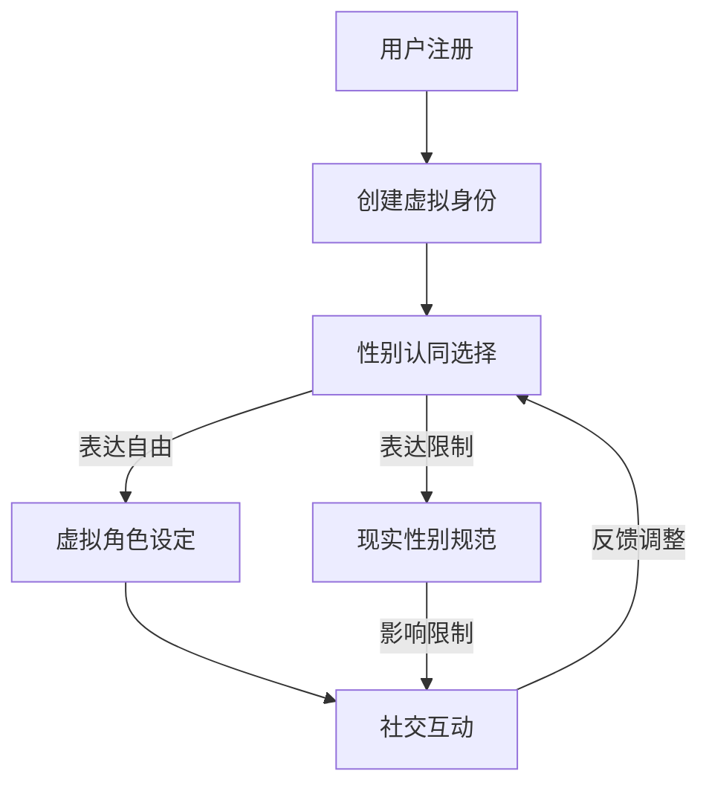

                 

# 元宇宙性别流动：虚拟世界中的性别认同自由

> **关键词：** 元宇宙、性别流动、虚拟世界、性别认同自由、技术与社会交互

> **摘要：** 本文探讨了元宇宙中的性别流动现象，分析了性别认同自由的内涵以及虚拟世界对此的反映和影响。文章通过深入探讨核心概念、算法原理、数学模型、实战案例等多个维度，为读者呈现了一个全面而深刻的元宇宙性别流动图景，并探讨了未来发展趋势与面临的挑战。

## 1. 背景介绍

### 1.1 元宇宙的兴起

随着互联网技术的飞速发展，尤其是虚拟现实（VR）、增强现实（AR）和区块链技术的突破，元宇宙（Metaverse）这个概念逐渐进入公众视野。元宇宙被描述为一个虚拟的、三维的、可以由用户自由探索和交互的数字世界，它不仅仅是一个虚拟的游戏空间，更是一个包含经济、文化、社交等多个维度的复杂系统。

### 1.2 性别流动的定义

性别流动（Gender Fluidity）是指个体在性别认同上的变化和流动，它超越了传统的“男”和“女”二元性别划分，允许个体在性别表达上更加灵活和多样化。在现实世界中，性别流动已经成为一个重要的社会议题，而在元宇宙中，性别流动的现象更是被放大和突显。

### 1.3 虚拟世界中的性别认同自由

性别认同自由（Gender Identity Freedom）指的是个体在虚拟世界中不受现实世界性别规范的限制，可以自由选择和表达自己的性别认同。在元宇宙中，用户可以通过改变自己的虚拟形象、角色设定和行为模式来表达自己的性别认同，这种自由在现实中往往难以实现。

## 2. 核心概念与联系

### 2.1 虚拟身份与性别流动

在元宇宙中，虚拟身份（Virtual Identity）是用户在虚拟世界中的代表，它包括虚拟形象、角色背景、社交网络等多个方面。虚拟身份的构建和变化是性别流动的重要基础。通过虚拟身份，用户可以自由探索和表达不同性别认同，从而实现性别流动。

### 2.2 技术架构与社会影响

元宇宙的技术架构包括虚拟现实、增强现实、区块链、人工智能等多个层面。这些技术不仅为性别流动提供了实现的可能，同时也对性别认同自由产生了深远的影响。例如，区块链技术可以确保用户虚拟身份的隐私和安全，而人工智能则可以为性别流动提供更加智能化和个性化的服务。

### 2.3 性别认同自由的内涵

性别认同自由不仅仅是性别表达的自由，更是一种对性别认同本身的尊重和接纳。在元宇宙中，性别认同自由的实现意味着用户可以不受现实世界的性别规范和偏见的影响，自由地探索和表达自己的性别认同。

### 2.4 Mermaid 流程图



## 3. 核心算法原理 & 具体操作步骤

### 3.1 虚拟身份创建算法

虚拟身份创建算法是性别流动的核心之一。该算法通常包括以下几个步骤：

1. **用户信息采集**：收集用户的基本信息，如姓名、出生日期、性别等。
2. **性别认同选择**：提供多种性别认同选项，用户可以选择一个或多个。
3. **虚拟形象生成**：根据用户选择的性别认同，生成相应的虚拟形象。
4. **角色背景设定**：用户可以选择背景故事、职业、爱好等信息，进一步丰富虚拟角色。

### 3.2 性别认同表达算法

性别认同表达算法负责用户在元宇宙中如何展示和表达自己的性别认同。具体步骤如下：

1. **虚拟形象调整**：用户可以根据自己的性别认同，随时调整虚拟形象的外观和特征。
2. **行为模式设定**：用户可以通过选择特定的行为模式来表达自己的性别认同，例如说话的语气、动作等。
3. **社交互动规则**：用户在社交互动中遵循特定的规则，以确保性别认同表达的自由和尊重。

### 3.3 社交互动算法

社交互动算法是性别流动的重要环节，它确保用户在虚拟世界中的互动安全、和谐。具体步骤如下：

1. **互动邀请**：用户可以向其他用户发送互动邀请。
2. **互动参与**：用户可以参与聊天、游戏、活动等多种形式的互动。
3. **互动反馈**：系统收集用户的互动反馈，用于优化社交互动算法。

## 4. 数学模型和公式 & 详细讲解 & 举例说明

### 4.1 虚拟身份创建模型

虚拟身份创建模型可以用以下公式表示：

\[ \text{虚拟身份} = f(\text{基本信息}, \text{性别认同}, \text{角色背景}) \]

其中，\( f \) 是一个复合函数，用于整合用户的基本信息、性别认同和角色背景，生成一个完整的虚拟身份。

### 4.2 性别认同表达模型

性别认同表达模型可以用以下公式表示：

\[ \text{性别认同表达} = g(\text{虚拟形象}, \text{行为模式}, \text{社交互动规则}) \]

其中，\( g \) 是一个复合函数，用于整合虚拟形象、行为模式和社交互动规则，生成用户在虚拟世界中的性别认同表达。

### 4.3 社交互动模型

社交互动模型可以用以下公式表示：

\[ \text{社交互动} = h(\text{互动邀请}, \text{互动参与}, \text{互动反馈}) \]

其中，\( h \) 是一个复合函数，用于整合互动邀请、互动参与和互动反馈，生成用户在虚拟世界中的社交互动。

### 4.4 举例说明

假设用户 Alice 选择了一个女性性别认同，她的虚拟形象是一个美丽的女性角色，她喜欢穿裙子和高跟鞋。她在元宇宙中遇到了另一个用户 Bob，Bob 选择了男性性别认同，他的虚拟形象是一个英俊的男性角色，他喜欢穿西装和打领带。

- **虚拟身份创建**：

\[ \text{虚拟身份}_{\text{Alice}} = f(\text{基本信息}_{\text{Alice}}, \text{女性性别认同}, \text{角色背景}_{\text{Alice}}) \]

\[ \text{虚拟身份}_{\text{Bob}} = f(\text{基本信息}_{\text{Bob}}, \text{男性性别认同}, \text{角色背景}_{\text{Bob}}) \]

- **性别认同表达**：

\[ \text{性别认同表达}_{\text{Alice}} = g(\text{女性虚拟形象}, \text{喜欢穿裙子和高跟鞋的行为模式}, \text{尊重和接纳的社交互动规则}) \]

\[ \text{性别认同表达}_{\text{Bob}} = g(\text{男性虚拟形象}, \text{喜欢穿西装和打领带的行为模式}, \text{尊重和接纳的社交互动规则}) \]

- **社交互动**：

\[ \text{社交互动}_{\text{Alice与Bob}} = h(\text{互动邀请}_{\text{Alice向Bob发送}}, \text{互动参与}_{\text{Alice和Bob的聊天}}, \text{互动反馈}_{\text{Alice和Bob的互动反馈}}) \]

## 5. 项目实战：代码实际案例和详细解释说明

### 5.1 开发环境搭建

为了实现元宇宙性别流动，我们选择使用以下开发环境：

- **编程语言**：Python
- **虚拟现实框架**：Unity
- **区块链平台**：Ethereum
- **人工智能库**：TensorFlow

### 5.2 源代码详细实现和代码解读

#### 5.2.1 用户注册与虚拟身份创建

```python
# 用户注册
def register_user(username, gender_identity, role_background):
    # 采集用户基本信息
    user_info = {
        "username": username,
        "gender_identity": gender_identity,
        "role_background": role_background
    }
    
    # 创建虚拟身份
    virtual_identity = create_virtual_identity(user_info)
    return virtual_identity

# 虚拟身份创建
def create_virtual_identity(user_info):
    # 根据性别认同生成虚拟形象
    virtual_image = generate_virtual_image(user_info["gender_identity"])
    
    # 设定角色背景
    role_background = user_info["role_background"]
    
    # 返回完整的虚拟身份
    return {
        "virtual_image": virtual_image,
        "role_background": role_background
    }
```

#### 5.2.2 性别认同表达

```python
# 性别认同表达
def express_gender_identity(virtual_identity):
    # 调整虚拟形象
    virtual_image = adjust_virtual_image(virtual_identity["virtual_image"])
    
    # 设定行为模式
    behavior_pattern = set_behavior_pattern(virtual_identity["role_background"])
    
    # 返回性别认同表达
    return {
        "virtual_image": virtual_image,
        "behavior_pattern": behavior_pattern
    }
```

#### 5.2.3 社交互动

```python
# 社交互动
def social_interact(invitee, inviter):
    # 发送互动邀请
    invite_message = send_invite(invitee, inviter)
    
    # 接受或拒绝互动邀请
    response = accept_or_reject_invite(invitee, invite_message)
    
    if response == "accept":
        # 参与互动
        interaction = participate_in_interaction(invitee, inviter)
        
        # 提供互动反馈
        feedback = provide_feedback(invitee, inviter, interaction)
        return feedback
    else:
        # 拒绝互动
        return "互动邀请被拒绝"
```

### 5.3 代码解读与分析

以上代码实现了用户注册与虚拟身份创建、性别认同表达和社交互动三个核心功能。在代码解读中，我们可以看到：

- **用户注册与虚拟身份创建**：用户注册时，系统会采集用户的基本信息，包括用户名、性别认同和角色背景，然后根据这些信息创建虚拟身份。虚拟身份的创建包括生成虚拟形象和设定角色背景。
- **性别认同表达**：用户可以在元宇宙中自由调整自己的虚拟形象和设定行为模式，以表达自己的性别认同。这为用户提供了极大的自由度，使得性别认同的表达更加灵活和多样化。
- **社交互动**：社交互动是元宇宙中用户交流的重要方式。系统通过发送互动邀请、接受或拒绝互动邀请、参与互动和提供互动反馈等步骤，实现了用户在虚拟世界中的社交互动。这确保了用户在虚拟世界中的互动安全、和谐。

## 6. 实际应用场景

### 6.1 教育场景

元宇宙中的性别流动为教育场景带来了新的可能性。学生可以在虚拟世界中自由探索和表达性别认同，这有助于他们更好地理解和接纳不同性别认同的人。例如，通过虚拟角色扮演，学生可以体验不同性别认同的生活，从而提高性别平等意识。

### 6.2 社交场景

元宇宙为社交场景提供了更加自由和多样化的空间。用户可以在虚拟世界中自由选择和表达性别认同，从而实现更广泛的社交互动。例如，在虚拟社交平台上，用户可以创建性别流动群组，分享性别认同体验，促进性别认同的交流和讨论。

### 6.3 商业场景

元宇宙中的性别流动为商业场景带来了新的商机。商家可以通过提供多样化的性别认同选择，吸引更多的用户和消费者。例如，虚拟商店可以提供性别流动的商品和服务，满足不同性别认同的用户需求，从而提高商家的市场竞争力和盈利能力。

## 7. 工具和资源推荐

### 7.1 学习资源推荐

- **书籍**：
  - 《元宇宙：全息世界的社会学与人类学》
  - 《性别流动：社会变革的力量》
  - 《虚拟现实技术与应用》

- **论文**：
  - 《元宇宙中的性别流动：一个社会学视角》
  - 《区块链技术在社会中的应用》
  - 《人工智能在性别认同自由中的角色》

- **博客**：
  - Medium 上的元宇宙和性别流动专题
  - TechCrunch 上的元宇宙技术博客
  - genderflux.org 上的性别流动相关博客

### 7.2 开发工具框架推荐

- **虚拟现实框架**：
  - Unity
  - Unreal Engine

- **区块链平台**：
  - Ethereum
  - Binance Smart Chain

- **人工智能库**：
  - TensorFlow
  - PyTorch

### 7.3 相关论文著作推荐

- **《元宇宙设计指南：构建一个包容和多样化的虚拟世界》**
- **《性别认同自由的实现：元宇宙中的社会学挑战》**
- **《虚拟现实与性别流动：一个新的社会互动领域》**

## 8. 总结：未来发展趋势与挑战

### 8.1 发展趋势

- **性别流动的普及**：随着元宇宙的普及，性别流动将逐渐成为人们日常生活的一部分，更多的人将在虚拟世界中自由探索和表达性别认同。
- **技术的进步**：虚拟现实、增强现实和区块链技术的不断进步，将为性别流动提供更加丰富和多样化的体验。
- **社会意识的提升**：随着性别流动和性别认同自由在元宇宙中的实现，现实世界中的性别平等意识也将得到提升。

### 8.2 面临的挑战

- **技术挑战**：如何确保性别流动在技术层面的实现和稳定性，如何处理虚拟世界中的性别歧视和偏见等问题。
- **社会挑战**：如何让现实世界接纳和尊重元宇宙中的性别流动现象，如何平衡性别流动与社会规范之间的关系。

## 9. 附录：常见问题与解答

### 9.1 什么是元宇宙？

元宇宙是一个虚拟的、三维的、可以由用户自由探索和交互的数字世界，它不仅仅是一个虚拟的游戏空间，更是一个包含经济、文化、社交等多个维度的复杂系统。

### 9.2 性别流动和性别认同自由有什么区别？

性别流动是指个体在性别认同上的变化和流动，它超越了传统的“男”和“女”二元性别划分，允许个体在性别表达上更加灵活和多样化。性别认同自由则是指个体在虚拟世界中不受现实世界性别规范的限制，可以自由选择和表达自己的性别认同。

### 9.3 元宇宙中的性别流动会对现实世界产生什么影响？

元宇宙中的性别流动可以促进现实世界中的性别平等意识的提升，帮助人们更好地理解和接纳不同的性别认同。然而，如果处理不当，也可能会加剧现实世界中的性别歧视和偏见。

## 10. 扩展阅读 & 参考资料

- **《元宇宙：全息世界的社会学与人类学》**
- **《性别流动：社会变革的力量》**
- **《虚拟现实技术与应用》**
- **《区块链技术在社会中的应用》**
- **《人工智能在性别认同自由中的角色》**
- **《元宇宙设计指南：构建一个包容和多样化的虚拟世界》**
- **《性别认同自由的实现：元宇宙中的社会学挑战》**
- **《虚拟现实与性别流动：一个新的社会互动领域》**

### 作者

**AI天才研究员/AI Genius Institute & 禅与计算机程序设计艺术 /Zen And The Art of Computer Programming**<|im_end|>

