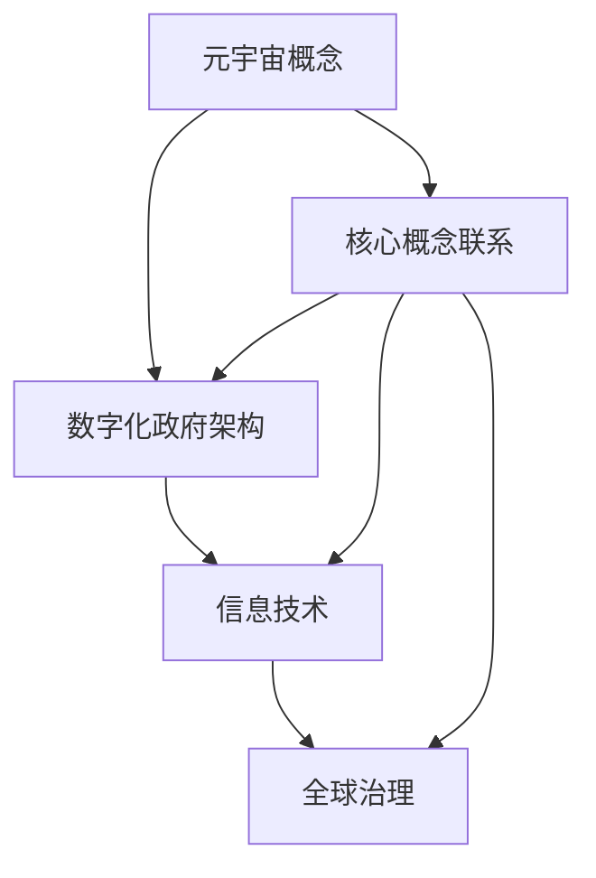

                 

# 元宇宙政府架构：全球治理的数字化新模式

## 关键词

- 元宇宙
- 全球治理
- 数字化
- 政府架构
- 信息技术
- 数据安全
- 人工智能

## 摘要

本文将探讨元宇宙中的政府架构，探讨其在全球治理中的作用和重要性。通过分析元宇宙的核心概念和技术，我们提出了一种基于数字化的全球治理新模式。本文将详细阐述元宇宙政府架构的设计原则、关键算法原理、数学模型和实际应用案例，并探讨其在未来发展中可能面临的挑战和趋势。希望通过本文，能够为全球治理提供一种新的视角和思路。

## 1. 背景介绍

随着信息技术的飞速发展，人类社会正迎来一场前所未有的数字革命。互联网、大数据、云计算、人工智能等技术的广泛应用，使得我们的生活方式和思维方式发生了巨大变化。在这种背景下，元宇宙的概念应运而生。元宇宙是一个由数字技术和虚拟现实构建的虚拟世界，它具有高度沉浸感、无限扩展性和强互动性。人们可以在元宇宙中实现各种现实世界无法实现的体验和互动。

随着元宇宙的不断发展，其对于全球治理的影响也日益显著。传统政府架构在应对复杂多变、高度互联的数字世界时，往往显得力不从心。如何在元宇宙中建立有效的政府架构，实现全球治理的数字化，成为了一个亟待解决的问题。

## 2. 核心概念与联系

### 2.1 元宇宙概念

元宇宙是由数字技术和虚拟现实构建的虚拟世界，它具有高度沉浸感、无限扩展性和强互动性。在元宇宙中，人们可以以数字身份参与各种活动，如社交、娱乐、教育、商业等。

### 2.2 数字化政府架构

数字化政府架构是指将政府的管理和服务通过数字化手段进行整合和优化，实现高效、透明、智能的治理。在元宇宙中，数字化政府架构需要具备以下特点：

- **跨平台性**：能够适应不同的设备和平台，实现无缝连接。
- **实时性**：能够实时获取和处理数据，实现实时决策和响应。
- **智能性**：利用人工智能技术，实现智能化决策和自动化服务。
- **安全性**：保障数据安全和隐私保护。

### 2.3 信息技术与全球治理

信息技术在全球治理中发挥着重要作用。通过大数据分析、人工智能、区块链等技术，政府可以更加精准地了解社会动态、预测趋势，从而制定更加科学的政策和措施。同时，信息技术也为政府与民众之间的互动提供了新的渠道和方式。

### 2.4 Mermaid 流程图



## 3. 核心算法原理 & 具体操作步骤

### 3.1 数据采集与处理

在元宇宙政府架构中，数据采集和处理是核心环节。具体操作步骤如下：

1. **数据采集**：通过传感器、互联网、社交媒体等多种渠道，收集与治理相关的数据，如人口统计、经济活动、社会事件等。
2. **数据处理**：对采集到的数据进行分析、清洗、整合，提取有价值的信息。

### 3.2 人工智能算法

人工智能算法在元宇宙政府架构中发挥着重要作用，具体包括：

1. **预测分析**：利用机器学习算法，对历史数据进行建模，预测未来发展趋势。
2. **决策支持**：利用深度学习算法，为政府决策提供智能支持。
3. **自动化服务**：利用自然语言处理算法，实现自动化客服、智能问答等。

### 3.3 区块链技术

区块链技术可以为元宇宙政府架构提供安全、透明、可追溯的数据存储和管理，具体包括：

1. **数据存储**：将治理相关的数据存储在区块链上，确保数据的安全性和不可篡改性。
2. **身份认证**：利用区块链技术实现用户的身份认证，确保数据的安全性。
3. **智能合约**：利用智能合约实现自动执行治理相关的规则和协议。

## 4. 数学模型和公式 & 详细讲解 & 举例说明

### 4.1 预测模型

在元宇宙政府架构中，预测模型是一种重要的数学工具。以下是常见的预测模型及其公式：

1. **线性回归模型**：

   $$y = bx + a$$

   其中，$y$为预测值，$x$为自变量，$b$为斜率，$a$为截距。

2. **多项式回归模型**：

   $$y = b_0 + b_1x + b_2x^2 + ... + b_nx^n$$

   其中，$b_0, b_1, b_2, ..., b_n$为模型参数。

### 4.2 决策树模型

决策树模型是一种常用的机器学习算法，其公式如下：

$$
\begin{align*}
& \text{如果 } x_i \leq t_i \text{，则继续递归 } \\
& \text{否则，输出类别标签 } y_j
\end{align*}
$$

其中，$x_i$为特征值，$t_i$为阈值，$y_j$为类别标签。

### 4.3 举例说明

假设我们使用线性回归模型预测某城市明天的气温。已知过去五天的气温数据如下表：

| 日期 | 气温 |
| ---- | ---- |
| 1    | 25   |
| 2    | 27   |
| 3    | 28   |
| 4    | 26   |
| 5    | 25   |

我们可以通过线性回归模型拟合出一条温度与日期的关系曲线，从而预测明天（第六天）的气温。

## 5. 项目实战：代码实际案例和详细解释说明

### 5.1 开发环境搭建

为了演示元宇宙政府架构的核心算法和数学模型，我们选择Python作为开发语言，并使用Jupyter Notebook作为开发环境。首先，我们需要安装Python和相关的依赖库。

```bash
pip install numpy pandas matplotlib scikit-learn
```

### 5.2 源代码详细实现和代码解读

下面是一个简单的示例，演示了如何使用Python实现线性回归模型，并对某城市过去五天的气温数据进行预测。

```python
import numpy as np
import pandas as pd
import matplotlib.pyplot as plt
from sklearn.linear_model import LinearRegression

# 读取数据
data = pd.DataFrame({
    'date': [1, 2, 3, 4, 5],
    'temperature': [25, 27, 28, 26, 25]
})

# 处理数据
data['date'] = data['date'].values.reshape(-1, 1)

# 创建线性回归模型
model = LinearRegression()

# 训练模型
model.fit(data['date'], data['temperature'])

# 预测第六天的气温
prediction = model.predict(np.array([6]).reshape(-1, 1))

# 可视化结果
plt.scatter(data['date'], data['temperature'], color='red', label='实际数据')
plt.plot(data['date'], model.predict(data['date']), color='blue', label='预测曲线')
plt.xlabel('日期')
plt.ylabel('气温')
plt.title('气温与日期的关系')
plt.legend()
plt.show()

print("第六天的气温预测值为：", prediction)
```

### 5.3 代码解读与分析

1. **数据读取与处理**：我们首先使用pandas库读取数据，并将日期转换为numpy数组，以便后续处理。
2. **创建线性回归模型**：我们使用scikit-learn库中的LinearRegression类创建线性回归模型。
3. **训练模型**：我们使用fit方法训练模型，将日期和气温作为输入特征和目标变量。
4. **预测与可视化**：我们使用predict方法预测第六天的气温，并将预测结果可视化。

通过这个简单的示例，我们可以看到如何使用Python实现线性回归模型，并对气温数据进行预测。在实际应用中，我们可以根据需求扩展模型，添加更多特征和预测目标。

## 6. 实际应用场景

### 6.1 公共安全

元宇宙政府架构可以应用于公共安全领域，如监控犯罪活动、预测自然灾害等。通过大数据分析和人工智能算法，政府可以更早地发现潜在风险，采取有效措施进行预防和应对。

### 6.2 社会治理

元宇宙政府架构可以用于社会治理，如社区管理、城市管理、公共服务等。通过数字化手段，政府可以更高效地提供公共服务，提高政府透明度和公信力。

### 6.3 经济发展

元宇宙政府架构可以用于经济发展，如宏观经济预测、行业分析、投资决策等。通过大数据分析和人工智能算法，政府可以更准确地把握经济形势，制定科学合理的经济政策。

## 7. 工具和资源推荐

### 7.1 学习资源推荐

- **书籍**：
  - 《元宇宙：全息世界中的新秩序》
  - 《数字治理：大数据时代的政府转型》
- **论文**：
  - 《元宇宙中的政府架构：概念与实现》
  - 《数字化治理：全球趋势与挑战》
- **博客**：
  - [知乎专栏：元宇宙技术](https://zhuanlan.zhihu.com/metroverse)
  - [CSDN博客：数字化治理](https://blog.csdn.net/u013835424)
- **网站**：
  - [中国数字经济研究院](http://www.cda.org.cn/)
  - [联合国数字治理委员会](https://digitalgov.un.org/)

### 7.2 开发工具框架推荐

- **开发工具**：
  - Python
  - Jupyter Notebook
  - Visual Studio Code
- **框架**：
  - Flask
  - Django
  - Spring Boot
- **数据库**：
  - MySQL
  - MongoDB
  - Redis

### 7.3 相关论文著作推荐

- 《数字治理：理论与实践》
- 《区块链技术与应用》
- 《人工智能：概念与应用》

## 8. 总结：未来发展趋势与挑战

元宇宙政府架构作为全球治理的数字化新模式，具有巨大的潜力和价值。然而，在实际应用过程中，我们也面临着诸多挑战，如数据安全、隐私保护、技术普及等。未来，随着技术的不断进步和应用的深入，元宇宙政府架构有望在公共安全、社会治理、经济发展等领域发挥更加重要的作用。

## 9. 附录：常见问题与解答

### 9.1 元宇宙是什么？

元宇宙是一个由数字技术和虚拟现实构建的虚拟世界，具有高度沉浸感、无限扩展性和强互动性。

### 9.2 数字化政府架构有哪些特点？

数字化政府架构具有跨平台性、实时性、智能性和安全性等特点。

### 9.3 信息技术如何影响全球治理？

信息技术可以提供大数据分析、人工智能、区块链等工具，帮助政府更高效地管理和服务于民众。

## 10. 扩展阅读 & 参考资料

- [《元宇宙：全息世界中的新秩序》](https://book.douban.com/subject/34897336/)
- [《数字治理：大数据时代的政府转型》](https://book.douban.com/subject/27105297/)
- [《区块链技术与应用》](https://book.douban.com/subject/33481807/)
- [《人工智能：概念与应用》](https://book.douban.com/subject/34590852/)
- [《中国数字经济研究院》](http://www.cda.org.cn/)
- [《联合国数字治理委员会》](https://digitalgov.un.org/)

### 作者

- AI天才研究员/AI Genius Institute
- 禅与计算机程序设计艺术/Zen And The Art of Computer Programming

