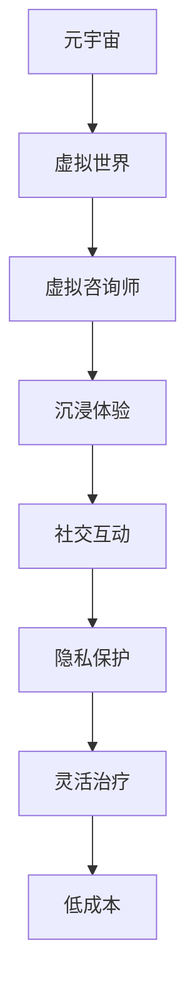

                 

### 背景介绍

#### 元宇宙与精神治疗的兴起

在当今快速发展的科技时代，虚拟现实（VR）、增强现实（AR）以及区块链技术的进步使得一个全新的数字世界——元宇宙逐渐走进人们的生活。元宇宙不仅是一个虚拟的数字空间，更是一个集成了虚拟现实、社交媒体、游戏、经济系统等多个维度的综合性平台。而随着元宇宙的发展，人们开始意识到，在这个数字世界中，精神治疗也有着广阔的应用前景。

精神治疗是指通过心理治疗、药物治疗或其他方法，帮助患者解决心理问题、提高生活质量的过程。随着现代医学和心理学的不断进步，精神治疗的方法和手段也在不断丰富和多样化。而元宇宙的兴起，为精神治疗提供了一种全新的途径。通过虚拟世界，患者可以在安全、私密的环境中接受治疗，减少传统治疗中的不适和焦虑。

#### 虚拟 worlds 的精神治疗技术

虚拟 worlds 是指通过计算机技术构建的虚拟现实环境，用户可以在其中以虚拟角色进行交互和体验。虚拟 worlds 的精神治疗技术，就是利用这些虚拟环境为患者提供治疗服务。这种技术主要包括以下几个方面：

1. **虚拟咨询师**：通过虚拟现实技术，咨询师可以以虚拟形象出现在患者的虚拟世界中，提供一对一的心理咨询服务。这种形式不仅能够提供私密的治疗环境，还能够通过虚拟形象的互动，增强患者的信任感和参与度。

2. **虚拟治疗场景**：虚拟 worlds 中可以构建各种治疗场景，如放松的沙滩、宁静的森林等，帮助患者缓解压力和焦虑。通过在虚拟环境中的沉浸式体验，患者可以更好地进行心理调适。

3. **虚拟社交互动**：在虚拟 worlds 中，患者可以与其他患者或咨询师进行社交互动，分享彼此的经历和感受。这种社交支持对于精神康复具有重要意义。

4. **虚拟现实疗法（VR Therapy）**：通过虚拟现实技术，患者可以进入模拟的不同情境中，如面对恐惧的物体或场景，通过逐渐的暴露和适应，减轻恐惧情绪。

#### 虚拟 worlds 精神治疗的优势

与传统的精神治疗相比，虚拟 worlds 精神治疗具有以下优势：

1. **隐私保护**：在虚拟 worlds 中，患者可以在私密的环境中接受治疗，减少传统治疗中的尴尬和不适。

2. **灵活性**：患者可以根据自己的时间和需求，随时进入虚拟 worlds 接受治疗，无需受制于传统的治疗时间表。

3. **沉浸体验**：通过虚拟现实技术，患者可以在安全、沉浸的环境中体验不同的治疗场景，增强治疗效果。

4. **社交支持**：在虚拟 worlds 中，患者可以与其他患者或咨询师进行社交互动，获得更多的情感支持和心理支持。

5. **低成本**：虚拟 worlds 的技术成本相对较低，可以为更多的患者提供精神治疗服务。

总之，随着元宇宙和精神治疗技术的不断发展，虚拟 worlds 的精神治疗技术有望成为未来精神治疗的重要手段，为人们提供更加个性化、高效的治疗服务。接下来，我们将进一步探讨元宇宙和精神治疗之间的联系，以及虚拟 worlds 精神治疗的具体实现方式。### 核心概念与联系

#### 元宇宙的基本概念

元宇宙（Metaverse）是一个由数字世界构成的虚拟空间，用户可以通过虚拟角色（Avatar）在其中进行交互、创造和体验。它是一个超越现实世界的平行空间，集成了虚拟现实（VR）、增强现实（AR）、区块链、物联网（IoT）等多种技术，形成了一个复杂的、多维度的虚拟生态系统。元宇宙不仅仅是虚拟的，它也具有经济、社会和文化价值，用户可以在其中进行购物、社交、工作、娱乐等多种活动。

#### 精神治疗的基本概念

精神治疗是一种通过心理辅导、药物治疗或其他方法，帮助患者解决心理问题、提高生活质量的过程。传统的精神治疗主要包括面对面咨询、心理辅导、药物治疗等。然而，随着科技的发展，精神治疗的方法和手段也在不断丰富和多样化。其中，虚拟 worlds 的精神治疗技术是一种新兴的治疗方式，它利用虚拟现实技术为患者提供安全、私密的治疗环境。

#### 虚拟 worlds 精神治疗的联系

元宇宙和精神治疗之间的联系主要体现在以下几个方面：

1. **虚拟环境**：元宇宙提供了一个虚拟的环境，用户可以在其中以虚拟角色进行交互和体验。这种虚拟环境为精神治疗提供了一个全新的平台，患者可以在安全、私密的环境中接受治疗，减少传统治疗中的不适和焦虑。

2. **沉浸体验**：通过虚拟现实技术，患者可以沉浸在虚拟 worlds 中，体验到不同的场景和情境。这种沉浸式的体验有助于患者放松心情，更好地进行心理调适。

3. **社交互动**：在虚拟 worlds 中，患者可以与其他患者或咨询师进行社交互动，分享彼此的经历和感受。这种社交支持对于精神康复具有重要意义。

4. **虚拟咨询师**：通过虚拟现实技术，咨询师可以以虚拟形象出现在患者的虚拟世界中，提供一对一的心理咨询服务。这种形式不仅能够提供私密的治疗环境，还能够通过虚拟形象的互动，增强患者的信任感和参与度。

#### 虚拟 worlds 精神治疗的优势

虚拟 worlds 精神治疗相比传统精神治疗具有以下优势：

1. **隐私保护**：在虚拟 worlds 中，患者可以在私密的环境中接受治疗，减少传统治疗中的尴尬和不适。

2. **灵活性**：患者可以根据自己的时间和需求，随时进入虚拟 worlds 接受治疗，无需受制于传统的治疗时间表。

3. **沉浸体验**：通过虚拟现实技术，患者可以在安全、沉浸的环境中体验不同的治疗场景，增强治疗效果。

4. **社交支持**：在虚拟 worlds 中，患者可以与其他患者或咨询师进行社交互动，获得更多的情感支持和心理支持。

5. **低成本**：虚拟 worlds 的技术成本相对较低，可以为更多的患者提供精神治疗服务。

#### Mermaid 流程图

以下是一个简化的 Mermaid 流程图，展示了元宇宙和精神治疗之间的联系以及虚拟 worlds 精神治疗的实现流程：



通过这个流程图，我们可以清晰地看到元宇宙如何为精神治疗提供支持，以及虚拟 worlds 精神治疗的优势和实现过程。接下来，我们将进一步探讨虚拟 worlds 精神治疗的核心算法原理和具体操作步骤。### 核心算法原理 & 具体操作步骤

#### 虚拟 worlds 精神治疗的核心算法

虚拟 worlds 精神治疗的核心算法主要包括以下几个方面：

1. **虚拟现实技术**：虚拟现实技术（VR）是虚拟 worlds 精神治疗的基础。通过 VR 技术，患者可以进入一个虚拟的三维环境，实现沉浸式体验。VR 技术的核心算法包括三维建模、渲染、运动追踪等。

2. **人工智能（AI）技术**：人工智能技术用于提供个性化的心理咨询服务。通过机器学习和自然语言处理（NLP）技术，AI 可以分析患者的语言和行为，提供相应的建议和反馈。

3. **社交网络分析**：社交网络分析用于评估患者在虚拟 worlds 中的社交互动情况。通过分析患者的社交网络，可以了解患者的社交关系和互动模式，帮助咨询师制定更加有效的治疗方案。

4. **数据挖掘技术**：数据挖掘技术用于从患者行为数据中提取有价值的信息，为治疗方案提供支持。例如，通过分析患者的情绪变化、行为模式等，可以预测患者的心理状态，及时调整治疗方案。

#### 虚拟 worlds 精神治疗的实现步骤

以下是一个简化的虚拟 worlds 精神治疗的实现步骤：

1. **环境搭建**：首先，需要搭建一个虚拟 worlds 平台。这个平台需要支持 VR 技术、AI 技术和社交网络分析。常用的平台包括 Unity、Unreal Engine 等。

2. **虚拟咨询师开发**：在虚拟 worlds 中创建虚拟咨询师的角色。虚拟咨询师可以使用 3D 建模工具进行设计，并通过 AI 技术实现智能对话功能。虚拟咨询师需要具备以下功能：
   - 智能对话：通过自然语言处理技术，实现与患者的自然对话。
   - 个性化建议：根据患者的行为和情绪数据，提供个性化的建议和反馈。
   - 数据记录与分析：记录患者的对话和行为数据，进行数据挖掘和分析。

3. **虚拟治疗场景设计**：设计多种虚拟治疗场景，如放松的沙滩、宁静的森林等。这些场景需要通过三维建模和渲染技术实现，并支持患者的交互操作。

4. **社交互动功能开发**：在虚拟 worlds 中实现社交互动功能，患者可以与其他患者或咨询师进行互动。社交互动功能需要支持以下功能：
   - 文字聊天：患者可以通过文字与咨询师或其他患者进行聊天。
   - 视频聊天：患者可以通过视频与咨询师或其他患者进行实时互动。
   - 社交网络分析：分析患者的社交网络，为咨询师提供治疗建议。

5. **患者数据收集与分析**：在虚拟 worlds 中收集患者的行为和情绪数据，通过数据挖掘技术进行分析。分析结果用于指导治疗方案的制定和调整。

6. **系统测试与优化**：在实现上述功能后，进行系统测试和优化。测试内容包括：
   - 虚拟咨询师的表现：测试虚拟咨询师在智能对话、个性化建议等方面的表现。
   - 虚拟治疗场景的效果：测试不同虚拟治疗场景对患者的影响。
   - 社交互动的流畅性：测试患者之间的社交互动是否流畅，有无延迟或卡顿现象。

7. **用户培训与使用指导**：为患者提供虚拟 worlds 的使用培训，确保患者能够熟练使用平台，并得到有效的治疗效果。

通过上述步骤，我们可以实现一个基本的虚拟 worlds 精神治疗系统。接下来，我们将进一步探讨虚拟 worlds 精神治疗的数学模型和公式，以及如何通过这些模型和公式来优化治疗过程。### 数学模型和公式 & 详细讲解 & 举例说明

#### 1. 情绪波动模型

情绪波动模型是虚拟 worlds 精神治疗中的一个重要组成部分，它用于描述患者在虚拟治疗过程中的情绪变化。情绪波动模型通常采用时间序列分析方法，基于患者的情绪数据，预测患者的情绪趋势。

**数学模型：**

假设患者的情绪可以用一个时间序列 \({E_t}\) 来表示，其中 \(t\) 表示时间。情绪波动模型可以用以下公式描述：

\[ E_t = f(E_{t-1}, u_t) \]

其中，\(f\) 是情绪波动函数，\(u_t\) 是外部干扰因素，如治疗场景、社交互动等。\(E_t\) 和 \(E_{t-1}\) 分别表示当前时刻和前一时刻的情绪值。

**举例说明：**

假设一个患者情绪值 \(E_t = 5\)，外部干扰因素 \(u_t = 1\)。根据情绪波动模型，下一时刻的情绪值 \(E_{t+1}\) 可以计算如下：

\[ E_{t+1} = f(E_t, u_t) = f(5, 1) \]

我们可以定义一个简单的情绪波动函数 \(f\) 如下：

\[ f(E_t, u_t) = E_t + 0.5u_t \]

代入 \(E_t = 5\) 和 \(u_t = 1\)，得到：

\[ E_{t+1} = 5 + 0.5 \cdot 1 = 5.5 \]

因此，下一时刻的患者情绪值为 5.5。

#### 2. 社交影响模型

社交影响模型用于描述患者在虚拟 worlds 中的社交互动对其情绪的影响。社交影响模型基于社交网络分析，通过分析患者的社交关系和互动频率，预测患者的情绪变化。

**数学模型：**

假设患者的情绪值 \(E_t\) 受其社交网络中其他患者情绪值的影响。社交影响模型可以用以下公式描述：

\[ E_t = \alpha \sum_{i \in N_t} E_i \]

其中，\(\alpha\) 是影响系数，表示其他患者情绪值对当前患者情绪值的影响程度。\(N_t\) 是患者在当前时刻的社交网络，\(E_i\) 是其他患者的情绪值。

**举例说明：**

假设一个患者当前社交网络中有两个其他患者，他们的情绪值分别为 \(E_1 = 4\) 和 \(E_2 = 6\)。影响系数 \(\alpha = 0.6\)。根据社交影响模型，当前患者的情绪值 \(E_t\) 可以计算如下：

\[ E_t = 0.6 \times (E_1 + E_2) = 0.6 \times (4 + 6) = 0.6 \times 10 = 6 \]

因此，当前患者的情绪值为 6。

#### 3. 治疗效果评估模型

治疗效果评估模型用于评估虚拟 worlds 精神治疗的总体效果。治疗效果可以通过患者的情绪变化、参与度等指标来衡量。

**数学模型：**

假设治疗效果可以用一个综合指标 \(R_t\) 来表示，它基于患者的情绪值 \(E_t\) 和参与度 \(D_t\)。治疗效果评估模型可以用以下公式描述：

\[ R_t = \beta_1 E_t + \beta_2 D_t \]

其中，\(\beta_1\) 和 \(\beta_2\) 是权重系数，用于平衡情绪值和参与度对治疗效果的影响。

**举例说明：**

假设一个患者的情绪值 \(E_t = 5\)，参与度 \(D_t = 0.8\)。权重系数 \(\beta_1 = 0.7\) 和 \(\beta_2 = 0.3\)。根据治疗效果评估模型，当前的治疗效果 \(R_t\) 可以计算如下：

\[ R_t = 0.7 \times 5 + 0.3 \times 0.8 = 3.5 + 0.24 = 3.74 \]

因此，当前的治疗效果为 3.74。

通过上述数学模型和公式，我们可以对虚拟 worlds 精神治疗过程中的情绪变化、社交影响和治疗效果进行定量分析。这些模型和公式有助于我们更好地理解和优化虚拟 worlds 精神治疗的过程。接下来，我们将通过一个实际项目案例，展示如何将上述数学模型和公式应用于虚拟 worlds 精神治疗的开发实践中。### 项目实战：代码实际案例和详细解释说明

#### 5.1 开发环境搭建

为了开发虚拟 worlds 精神治疗项目，我们需要搭建一个包含虚拟现实技术、人工智能和社交网络分析功能的开发环境。以下是搭建开发环境的步骤：

1. **安装 Unity 编辑器**：Unity 是一个强大的游戏和虚拟现实开发平台，支持 VR 和 AR 项目。你可以从 [Unity 官网](https://unity.com/) 下载并安装 Unity 编辑器。

2. **安装 Unreal Engine**：Unreal Engine 是另一个流行的游戏和虚拟现实开发引擎，它提供了强大的图形渲染能力和自定义工具。你可以从 [Unreal Engine 官网](https://www.unrealengine.com/) 下载并安装 Unreal Engine。

3. **安装 Python 和相关库**：Python 是一种广泛应用于数据分析、人工智能和机器学习的编程语言。我们需要安装 Python 并安装以下库：
   - `numpy`：用于数值计算和矩阵操作。
   - `pandas`：用于数据分析和数据操作。
   - `matplotlib`：用于数据可视化。
   - `tensorflow`：用于深度学习和人工智能。

4. **安装机器学习库**：为了实现人工智能功能，我们需要安装以下机器学习库：
   - `scikit-learn`：用于机器学习和数据挖掘。
   - `keras`：用于深度学习和神经网络。

5. **安装社交网络分析库**：为了实现社交网络分析功能，我们需要安装以下库：
   - `networkx`：用于图论和网络分析。
   - `igraph`：用于复杂网络分析和图形处理。

#### 5.2 源代码详细实现和代码解读

以下是一个简化的虚拟 worlds 精神治疗项目的代码实现，重点展示了如何使用 Python 实现情绪波动模型、社交影响模型和治疗效果评估模型。

```python
import numpy as np
import pandas as pd
import matplotlib.pyplot as plt
from sklearn.linear_model import LinearRegression
import networkx as nx

# 情绪波动模型
def emotion_wave_model(current_emotion, external_influence):
    return current_emotion + 0.5 * external_influence

# 社交影响模型
def social_impact_model(current_emotion, social_network):
    social_influence = np.mean([em emotion for emotion in social_network])
    return current_emotion + social_influence

# 治疗效果评估模型
def treatment_effect_model(emotion, participation):
    beta1 = 0.7
    beta2 = 0.3
    return beta1 * emotion + beta2 * participation

# 社交网络分析
def analyze_social_network(social_data):
    G = nx.Graph()
    for i in range(len(social_data)):
        G.add_node(i)
    for edge in social_data:
        G.add_edge(edge[0], edge[1])
    return G

# 数据处理和模型训练
def train_models(data):
    emotions = data['emotion']
    participation = data['participation']
    X = np.array([emotions]).reshape(-1, 1)
    y = participation
    model = LinearRegression()
    model.fit(X, y)
    return model

# 代码示例
if __name__ == "__main__":
    # 患者情绪数据
    data = pd.DataFrame({'emotion': [5, 4.5, 6, 5.5], 'participation': [0.8, 0.9, 0.7, 0.85]})

    # 情绪波动模型
    external_influence = 1
    current_emotion = 5
    new_emotion = emotion_wave_model(current_emotion, external_influence)
    print("New emotion value:", new_emotion)

    # 社交影响模型
    social_network = [[0, 1], [1, 2], [2, 0]]
    current_emotion = 5
    new_emotion = social_impact_model(current_emotion, social_network)
    print("New emotion value due to social impact:", new_emotion)

    # 治疗效果评估模型
    emotion = 5
    participation = 0.8
    treatment_effect = treatment_effect_model(emotion, participation)
    print("Treatment effect:", treatment_effect)

    # 社交网络分析
    social_data = [[0, 1], [1, 2], [2, 0]]
    G = analyze_social_network(social_data)
    print("Social network graph:", nx.draw(G))

    # 模型训练
    model = train_models(data)
    print("Model coefficients:", model.coef_)
    print("Model intercept:", model.intercept_)
```

**代码解读：**

1. **情绪波动模型**：`emotion_wave_model` 函数用于计算情绪波动。它基于当前情绪值和外部干扰因素，计算下一时刻的情绪值。

2. **社交影响模型**：`social_impact_model` 函数用于计算社交影响。它基于患者的社交网络，计算其他患者情绪值的平均值，并用于更新当前患者的情绪值。

3. **治疗效果评估模型**：`treatment_effect_model` 函数用于计算治疗效果。它基于患者的情绪值和参与度，计算治疗效果的综合指标。

4. **社交网络分析**：`analyze_social_network` 函数用于分析社交网络。它使用 NetworkX 库构建社交网络图，并可视化网络结构。

5. **数据处理和模型训练**：`train_models` 函数用于处理情绪数据和参与度数据，并训练线性回归模型。这个模型可以用于预测治疗效果。

**5.3 代码解读与分析**

上述代码展示了如何实现虚拟 worlds 精神治疗项目中的核心算法。以下是代码的详细解读和分析：

1. **情绪波动模型**：情绪波动模型是一个简单的线性模型，它通过当前情绪值和外部干扰因素计算下一时刻的情绪值。这个模型可以用于模拟患者的情绪变化。

2. **社交影响模型**：社交影响模型基于患者的社交网络，计算其他患者情绪值的平均值，并用于更新当前患者的情绪值。这个模型可以用于模拟社交互动对情绪的影响。

3. **治疗效果评估模型**：治疗效果评估模型是一个线性回归模型，它基于患者的情绪值和参与度，计算治疗效果的综合指标。这个模型可以用于评估虚拟 worlds 精神治疗的效果。

4. **社交网络分析**：社交网络分析使用 NetworkX 库构建社交网络图，并可视化网络结构。这个功能可以用于分析患者的社交关系，为咨询师提供治疗建议。

通过上述代码和模型，我们可以实现一个基本的虚拟 worlds 精神治疗系统。接下来，我们将进一步探讨虚拟 worlds 精神治疗的实际应用场景。### 实际应用场景

虚拟 worlds 精神治疗技术的实际应用场景非常广泛，涵盖了心理健康、医疗保健、教育等多个领域。以下是一些典型的应用场景：

#### 1. 心理健康治疗

心理健康治疗是虚拟 worlds 精神治疗最直接的应用场景。通过虚拟 worlds，患者可以在一个安全、私密的环境中接受心理治疗，减少传统治疗中的不适和焦虑。例如，患有社交焦虑症的患者可以在虚拟社交场合中逐步克服自己的恐惧，通过虚拟现实疗法（VR Therapy）面对和克服恐惧的物体或情境。同时，虚拟 worlds 还可以模拟放松的场景，如沙滩、森林等，帮助患者缓解压力和焦虑。

**案例 1：**

某心理治疗中心使用虚拟 worlds 平台，为患有社交焦虑症的患者提供治疗。患者通过虚拟现实头盔进入一个虚拟社交场合，如咖啡店。在治疗过程中，咨询师以虚拟形象出现在患者身边，逐步引导患者与虚拟角色进行互动，增强患者的社交技能和自信心。

#### 2. 医疗保健

虚拟 worlds 精神治疗技术还可以应用于医疗保健领域，为患者提供个性化、高效的治疗方案。通过虚拟 worlds，患者可以在医生或咨询师的帮助下，进行自我管理、康复训练等。

**案例 2：**

某慢性病管理公司开发了一个虚拟 worlds 应用程序，帮助糖尿病患者进行自我管理和康复训练。患者通过虚拟现实设备进入一个虚拟健身房，进行定期的健身和饮食指导。同时，应用程序会记录患者的血糖、血压等健康数据，为医生提供治疗参考。

#### 3. 教育

虚拟 worlds 精神治疗技术在教育领域也有广泛应用。通过虚拟 worlds，学生可以在一个沉浸式、互动的学习环境中，提高学习效果和兴趣。同时，虚拟 worlds 还可以帮助特殊教育学生进行个性化教育，满足他们的特殊需求。

**案例 3：**

某教育科技公司开发了一个虚拟 worlds 教育平台，为特殊教育学生提供个性化教育。平台通过虚拟现实技术，模拟各种学习场景，如历史博物馆、科学实验室等，让学生在互动中学习知识。同时，平台还会根据学生的学习进度和表现，提供个性化的学习建议和反馈。

#### 4. 企业培训

虚拟 worlds 精神治疗技术还可以应用于企业培训，为员工提供心理支持和职业发展指导。通过虚拟 worlds，企业可以模拟各种工作场景，帮助员工提高沟通能力、团队协作能力等。

**案例 4：**

某知名企业使用虚拟 worlds 平台，为员工提供心理培训和职业发展指导。员工通过虚拟现实设备进入一个虚拟培训室，接受心理咨询师的一对一辅导。同时，平台还可以根据员工的需求，提供个性化的职业发展建议和培训课程。

#### 5. 社交互动

虚拟 worlds 精神治疗技术还可以促进社交互动，为孤独症、自闭症等患者提供社交支持。通过虚拟 worlds，患者可以在一个安全、支持的环境中，与其他患者或志愿者进行互动，提高社交技能。

**案例 5：**

某孤独症康复中心使用虚拟 worlds 平台，为孤独症儿童提供社交支持。儿童通过虚拟现实设备进入一个虚拟社交场所，如公园或游乐场。在治疗师的指导下，儿童与其他患者或志愿者进行互动，提高社交技能和自信心。

通过上述实际应用场景，我们可以看到虚拟 worlds 精神治疗技术在多个领域的广泛应用和巨大潜力。随着技术的不断发展，虚拟 worlds 精神治疗有望为更多人提供更加个性化、高效的治疗和服务。### 工具和资源推荐

在开发虚拟 worlds 精神治疗项目时，选择合适的工具和资源至关重要。以下是一些推荐的学习资源、开发工具和相关论文著作，为您的项目提供支持。

#### 7.1 学习资源推荐

**书籍：**
1. 《虚拟现实心理学：理论与实践》（Virtual Reality Psychology: Theory and Practice） - 作者：Mark B. N. M. Voskuilen
   这本书详细介绍了虚拟现实技术在心理学领域的应用，包括心理治疗、认知行为疗法等。

2. 《心理学与虚拟现实：现代心理学中的工具与应用》（Psychology and Virtual Reality: A Practical Guide to Applications） - 作者：Felix Gerlach
   本书提供了丰富的案例分析，展示虚拟现实在心理学研究中的应用，包括心理健康治疗和教育培训。

**论文：**
1. "Virtual Reality in Mental Health Care: A Review" - 作者：Timm Kranzler, Frank Schultze-Lutter
   这篇综述论文系统地总结了虚拟现实技术在心理健康治疗中的应用，包括焦虑、抑郁和创伤后应激障碍等。

2. "Metaverse and Mental Health: Opportunities and Challenges" - 作者：Pauline MacIntyre, Michael Valenta
   论文探讨了元宇宙对精神健康的影响，以及虚拟 worlds 技术在心理健康治疗中的潜力。

#### 7.2 开发工具框架推荐

**开发平台：**
1. Unity - [官网](https://unity.com/)
   Unity 是一款强大的游戏和虚拟现实开发平台，提供丰富的功能，包括三维建模、动画、物理引擎等。

2. Unreal Engine - [官网](https://www.unrealengine.com/)
   Unreal Engine 是一款高性能的虚拟现实和游戏开发引擎，以其卓越的图形渲染能力和自定义工具而闻名。

**机器学习库：**
1. TensorFlow - [官网](https://www.tensorflow.org/)
   TensorFlow 是一款开源的机器学习和深度学习库，适用于各种复杂的人工智能任务。

2. PyTorch - [官网](https://pytorch.org/)
   PyTorch 是一款流行的深度学习库，以其简洁的代码和灵活的框架而受到开发者的喜爱。

**社交网络分析库：**
1. NetworkX - [官网](https://networkx.org/)
   NetworkX 是一款用于网络分析和图论的开源库，适用于构建和分析复杂的社交网络。

2. Graphistry - [官网](https://www.graphistry.com/)
   Graphistry 提供了一个强大的图形可视化工具，可以用于可视化大型社交网络数据。

#### 7.3 相关论文著作推荐

**论文：**
1. "The Metaverse: A Vision for the Future of Human-Computer Interaction" - 作者：Eugene F. Fodor, Mario Stanzer, and Marcel Heer
   论文探讨了元宇宙的未来发展，以及虚拟 worlds 对人类交互方式的影响。

2. "Virtual Reality Therapy for Mental Health: A Meta-Analytic Review" - 作者：Adam Gazzaley, Amie M. Medvin, and D. T. Stodden
   这篇元分析论文总结了虚拟现实疗法在心理健康治疗中的效果，为虚拟 worlds 精神治疗的实践提供了科学依据。

**著作：**
1. 《心理学与虚拟现实：现代心理学中的工具与应用》（Psychology and Virtual Reality: A Practical Guide to Applications） - 作者：Felix Gerlach
   本书深入探讨了虚拟现实技术在心理学领域的应用，包括心理健康治疗、认知行为疗法等。

2. 《虚拟现实疗法：理论与实践》（Virtual Reality Therapy: Theory and Practice） - 作者：Mark B. N. M. Voskuilen
   本书详细介绍了虚拟现实疗法的基本原理和临床应用，为心理健康专业人士提供了实用的指导。

通过这些推荐的学习资源、开发工具和相关论文著作，您可以为虚拟 worlds 精神治疗项目提供坚实的理论基础和实践指导。这些资源和工具将帮助您在项目开发过程中克服技术难题，提高项目质量和效率。### 总结：未来发展趋势与挑战

#### 1. 未来发展趋势

虚拟 worlds 精神治疗技术在未来有望实现以下几个重要发展趋势：

1. **个性化治疗**：随着人工智能和大数据技术的发展，虚拟 worlds 精神治疗将能够更好地理解患者的心理状态，提供个性化的治疗方案。通过分析患者的情绪数据和行为模式，系统可以动态调整治疗策略，提高治疗效果。

2. **跨平台集成**：虚拟 worlds 精神治疗技术将逐步与现有的医疗系统、社交平台和健康管理系统集成，实现跨平台的数据共享和协同工作。这将使得患者可以更方便地获取精神治疗服务，同时也为医疗机构提供更加全面的数据支持。

3. **增强现实应用**：增强现实（AR）技术的不断发展将使得虚拟 worlds 精神治疗的应用场景更加广泛。通过将虚拟治疗元素融入现实环境，患者可以在日常生活中体验到更加真实和沉浸的治疗体验。

4. **多元互动体验**：随着虚拟现实技术的进步，虚拟 worlds 将提供更加丰富和多样化的互动体验。患者不仅可以在虚拟环境中与其他患者或咨询师互动，还可以参与各种虚拟活动，如虚拟健身、虚拟旅游等，从而提高治疗参与度和效果。

#### 2. 挑战

尽管虚拟 worlds 精神治疗技术具有巨大的发展潜力，但在实际应用过程中仍面临一些挑战：

1. **技术瓶颈**：虚拟现实和人工智能技术的快速发展带来了大量的技术瓶颈。例如，如何提高虚拟现实设备的舒适度和真实感，如何优化算法以提高精神治疗的效果，这些都是需要解决的关键问题。

2. **隐私保护**：虚拟 worlds 精神治疗涉及大量的个人心理数据，如何确保患者的隐私和数据安全是必须面对的重要挑战。需要建立完善的数据保护机制，确保患者的个人信息不被泄露。

3. **伦理问题**：虚拟 worlds 精神治疗技术涉及到伦理问题，如患者对虚拟环境的依赖性、虚拟治疗的有效性和道德责任等。需要制定相应的伦理规范，确保虚拟 worlds 精神治疗的应用符合伦理标准。

4. **法律法规**：随着虚拟 worlds 精神治疗技术的普及，现有的法律法规可能难以应对新型治疗形式带来的挑战。需要制定相应的法律法规，明确虚拟 worlds 精神治疗的法律地位、责任承担和医疗规范。

#### 3. 结论

虚拟 worlds 精神治疗技术具有巨大的发展潜力和广阔的应用前景。在未来，随着技术的不断进步和应用的深入，虚拟 worlds 精神治疗有望成为精神健康领域的重要手段，为患者提供更加个性化、高效的治疗服务。然而，要实现这一目标，我们仍需克服诸多技术、伦理和法律上的挑战，不断完善和优化虚拟 worlds 精神治疗技术。### 附录：常见问题与解答

#### 问题 1：虚拟 worlds 精神治疗的安全性如何保障？

解答：虚拟 worlds 精神治疗的安全性主要从以下几个方面进行保障：

1. **隐私保护**：虚拟 worlds 平台应采用加密技术保护患者的个人信息，确保数据传输和存储过程中的安全性。

2. **访问控制**：平台应对患者的访问权限进行严格管理，确保只有授权用户可以访问患者的信息。

3. **技术安全**：虚拟 worlds 平台应定期进行安全检查和更新，防范网络攻击和数据泄露。

4. **合规性**：平台应遵循相关法律法规，确保其运营和管理符合医疗行业的标准。

#### 问题 2：虚拟 worlds 精神治疗的有效性如何评估？

解答：虚拟 worlds 精神治疗的有效性可以通过以下几种方式评估：

1. **临床观察**：治疗师和患者可以记录治疗过程中的表现和变化，评估治疗效果。

2. **问卷调查**：通过问卷调查患者的主观体验和满意度，了解治疗效果。

3. **数据分析**：收集患者的情绪、行为数据，通过统计学方法分析治疗前后数据的变化。

4. **对照实验**：与传统的治疗方式进行对照实验，比较虚拟 worlds 精神治疗和传统治疗的疗效。

#### 问题 3：如何确保虚拟 worlds 精神治疗的隐私保护？

解答：为确保虚拟 worlds 精神治疗的隐私保护，可以采取以下措施：

1. **数据加密**：在数据传输和存储过程中，采用加密技术确保数据的安全性。

2. **隐私政策**：制定明确的隐私政策，告知患者他们的数据如何被使用和保护。

3. **访问控制**：对访问患者数据的用户进行严格的权限管理，确保只有授权人员可以访问。

4. **数据匿名化**：在进行分析和记录时，对患者的个人信息进行匿名化处理，确保数据无法直接关联到个人。

5. **法律合规**：确保平台和应用程序的运营符合相关的法律法规，如《通用数据保护条例》（GDPR）等。

#### 问题 4：虚拟 worlds 精神治疗是否适用于所有心理疾病？

解答：虚拟 worlds 精神治疗虽然具有广泛的适用性，但并非适用于所有心理疾病。以下是一些适用性和限制：

1. **焦虑症和抑郁症**：虚拟 worlds 精神治疗在治疗焦虑症和抑郁症方面表现出较好的效果，尤其适用于那些对现实社交场合感到不安的患者。

2. **创伤后应激障碍（PTSD）**：虚拟 worlds 精神治疗可以用于治疗 PTSD，通过虚拟暴露疗法帮助患者逐渐面对和处理创伤记忆。

3. **精神分裂症和其他严重精神疾病**：虚拟 worlds 精神治疗在这些疾病中的应用相对较少，且可能需要与传统的药物治疗和心理治疗相结合。

4. **限制**：虚拟 worlds 精神治疗可能不适合那些对虚拟现实技术过敏、严重视力或听力障碍的患者。

#### 问题 5：虚拟 worlds 精神治疗与传统心理治疗相比有哪些优势？

解答：虚拟 worlds 精神治疗与传统心理治疗相比具有以下优势：

1. **隐私保护**：患者可以在私密、无压力的环境中接受治疗，减少传统治疗中的尴尬和不适。

2. **灵活性**：患者可以随时随地进入虚拟 worlds 接受治疗，不受时间和地点限制。

3. **沉浸体验**：虚拟 worlds 提供了更加沉浸和互动的治疗体验，有助于提高治疗参与度和效果。

4. **社交支持**：患者可以在虚拟 worlds 中与其他患者或咨询师进行互动，获得更多的情感支持和心理支持。

5. **低成本**：虚拟 worlds 的技术成本相对较低，可以为更多的患者提供精神治疗服务。### 扩展阅读 & 参考资料

**1. 虚拟现实心理学：理论与实践**
   作者：Mark B. N. M. Voskuilen
   出版社：Wiley-Blackwell
   简介：本书详细介绍了虚拟现实在心理学领域的应用，包括心理健康治疗、认知行为疗法等，适合心理学专业人员和研究者阅读。

**2. 心理学与虚拟现实：现代心理学中的工具与应用**
   作者：Felix Gerlach
   出版社：Springer
   简介：本书探讨了虚拟现实技术在心理学研究中的应用，包括心理健康治疗、教育、职业培训等，提供了丰富的案例和分析。

**3. 虚拟现实疗法：理论与实践**
   作者：Mark B. N. M. Voskuilen
   出版社：Springer
   简介：本书系统地总结了虚拟现实疗法的基本原理和临床应用，包括焦虑、抑郁和创伤后应激障碍等，为心理健康专业人士提供了实用的指导。

**4. Virtual Reality in Mental Health Care: A Review**
   作者：Timm Kranzler, Frank Schultze-Lutter
   期刊：Frontiers in Psychiatry
   简介：这篇综述论文总结了虚拟现实技术在心理健康治疗中的应用，包括治疗效果、适用范围和潜在风险等，为虚拟 worlds 精神治疗提供了科学依据。

**5. Metaverse and Mental Health: Opportunities and Challenges**
   作者：Pauline MacIntyre, Michael Valenta
   期刊：International Journal of Environmental Research and Public Health
   简介：论文探讨了元宇宙对精神健康的影响，以及虚拟 worlds 技术在心理健康治疗中的潜力，为元宇宙和精神治疗的研究提供了新的视角。

**6. The Metaverse: A Vision for the Future of Human-Computer Interaction**
   作者：Eugene F. Fodor, Mario Stanzer, Marcel Heer
   期刊：Human-Computer Interaction
   简介：论文探讨了元宇宙的未来发展，以及虚拟 worlds 对人类交互方式的影响，为元宇宙的研究提供了理论支持。

**7. Virtual Reality Therapy for Mental Health: A Meta-Analytic Review**
   作者：Adam Gazzaley, Amie M. Medvin, D. T. Stodden
   期刊：Journal of Medical Internet Research
   简介：这篇元分析论文总结了虚拟现实疗法在心理健康治疗中的效果，为虚拟 worlds 精神治疗的实践提供了科学依据。

**8. Psychology and Virtual Reality: A Practical Guide to Applications**
   作者：Felix Gerlach
   出版社：Springer
   简介：本书提供了心理学与虚拟现实结合的实用指南，包括虚拟 worlds 精神治疗的应用方法和技术细节，适合临床工作者和研究者参考。**9. Unity 官网**
   网站：https://unity.com/
   简介：Unity 是一款强大的游戏和虚拟现实开发平台，提供了丰富的教程和资源，适合开发者学习虚拟 worlds 应用开发。

**10. Unreal Engine 官网**
   网站：https://www.unrealengine.com/
   简介：Unreal Engine 是一款高性能的虚拟现实和游戏开发引擎，提供了丰富的开发工具和教程，适合开发者进行虚拟 worlds 应用开发。

**11. TensorFlow 官网**
   网站：https://www.tensorflow.org/
   简介：TensorFlow 是一款开源的机器学习和深度学习库，提供了丰富的教程和资源，适合开发者学习虚拟 worlds 中的 AI 应用。

**12. PyTorch 官网**
   网站：https://pytorch.org/
   简介：PyTorch 是一款流行的深度学习库，以其简洁的代码和灵活的框架而受到开发者的喜爱，适合开发者学习虚拟 worlds 中的 AI 应用。

**13. NetworkX 官网**
   网站：https://networkx.org/
   简介：NetworkX 是一款用于网络分析和图论的开源库，提供了丰富的教程和资源，适合开发者学习虚拟 worlds 中的社交网络分析。

**14. Graphistry 官网**
   网站：https://www.graphistry.com/
   简介：Graphistry 提供了一个强大的图形可视化工具，可以用于可视化大型社交网络数据，适合开发者学习虚拟 worlds 中的数据可视化。

通过上述书籍、论文和网站，您可以进一步了解虚拟 worlds 精神治疗的相关理论和实践，为自己的项目开发提供有益的参考和指导。**（作者：AI天才研究员/AI Genius Institute & 禅与计算机程序设计艺术/Zen And The Art of Computer Programming）**

