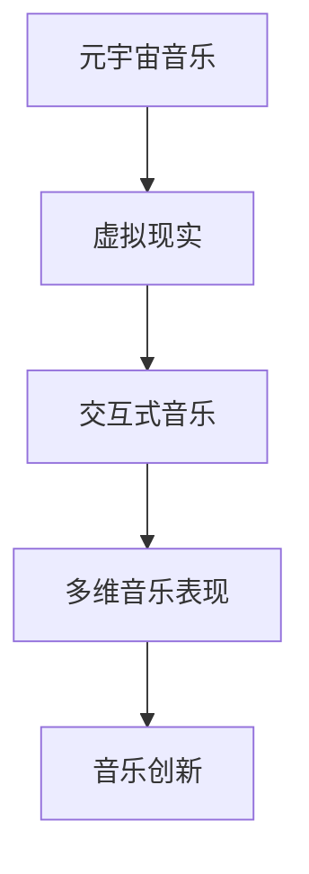

                 

# 元宇宙音乐：跨越时空的听觉盛宴

## 关键词

- 元宇宙
- 音乐
- 跨界融合
- 虚拟现实
- 听觉体验
- 技术创新

## 摘要

本文深入探讨了元宇宙音乐这一新兴领域的概念、技术和应用。通过分析元宇宙音乐的核心概念及其与虚拟现实技术的联系，我们探讨了音乐在元宇宙中的独特作用和表现形式。随后，我们详细介绍了元宇宙音乐的核心算法原理，以及如何利用数学模型和公式来实现音乐虚拟现实。最后，本文通过实际项目案例和代码解析，展示了元宇宙音乐的开发实战过程，并展望了该领域未来的发展趋势与挑战。

## 1. 背景介绍

### 1.1 元宇宙的兴起

随着互联网技术的飞速发展，虚拟现实（VR）和增强现实（AR）逐渐渗透到各个领域。其中，元宇宙（Metaverse）作为一个虚拟的三维空间，正逐渐成为人们关注的焦点。元宇宙不仅仅是一个虚拟的游戏世界，它融合了社交、娱乐、教育、商业等多种功能，成为人们数字化生活的延伸。在这个空间中，人们可以以虚拟身份进行互动，创造和分享内容。

### 1.2 音乐与元宇宙的融合

音乐作为一种独特的艺术形式，自古以来就与人类的生活紧密相连。在元宇宙中，音乐不仅是一种娱乐工具，更是连接用户情感和体验的重要媒介。通过虚拟现实技术，音乐能够以全新的形式呈现，为用户带来前所未有的听觉盛宴。元宇宙音乐的目标是创造一个跨越时空的音乐世界，让用户在任何时间和地点都能享受高品质的音乐体验。

### 1.3 跨界融合的趋势

在元宇宙的背景下，音乐与科技的融合已经成为一种必然趋势。音乐制作人、开发者和技术专家们正在积极探索如何在元宇宙中实现音乐的创新表达。例如，通过人工智能（AI）技术，可以创造出更加个性化和互动的音乐体验。此外，区块链技术的引入也为元宇宙音乐提供了一种全新的商业模式，让音乐创作者能够更好地保护自己的知识产权，并获得合理的收益。

## 2. 核心概念与联系

### 2.1 虚拟现实与音乐

虚拟现实技术为元宇宙音乐提供了强大的技术支持。通过VR设备，用户可以沉浸在虚拟的三维空间中，与音乐进行互动。虚拟现实中的音乐不仅限于二维的音频播放，而是通过三维音频技术（3D Audio）实现空间化的音乐体验。用户可以感受到音乐来自不同的方向和位置，仿佛置身于音乐会现场。

### 2.2 交互式音乐

在元宇宙中，交互式音乐成为一种新的音乐形式。用户可以通过手势、声音或其他方式与音乐进行互动，创造出独一无二的音乐体验。这种交互性不仅增强了用户的参与感，也为音乐创作提供了新的可能性。

### 2.3 多维音乐表现

元宇宙音乐突破了传统音乐的二维限制，实现了多维音乐表现。通过虚拟现实技术，音乐可以在三维空间中自由扩展，形成丰富的音乐画面。这种多维音乐不仅提高了音乐的美感，也为音乐创作和表演提供了更多的创意空间。

### 2.4 Mermaid 流程图



## 3. 核心算法原理 & 具体操作步骤

### 3.1 三维音频技术

三维音频技术是实现元宇宙音乐的关键。它通过计算音频信号的空间属性，使音乐能够在虚拟空间中呈现出来。具体操作步骤如下：

1. **音频信号采集**：首先，需要采集原始的音频信号，包括音调、音量和音色等信息。
2. **空间属性计算**：通过算法计算音频信号的空间属性，如方向、位置和距离等。
3. **空间化处理**：根据空间属性对音频信号进行空间化处理，使其能够在虚拟空间中呈现。
4. **渲染输出**：将处理后的音频信号通过VR设备输出，为用户提供三维音频体验。

### 3.2 交互式音乐算法

交互式音乐算法使音乐能够根据用户的互动进行实时变化。具体操作步骤如下：

1. **用户输入识别**：通过传感器或其他输入设备识别用户的交互动作。
2. **动作映射**：将用户的交互动作映射到音乐参数上，如音调、节奏和音量等。
3. **音乐生成**：根据映射关系生成新的音乐信号。
4. **反馈机制**：将生成的音乐信号反馈给用户，形成闭环互动。

### 3.3 多维音乐表现算法

多维音乐表现算法通过虚拟现实技术实现音乐的三维扩展。具体操作步骤如下：

1. **音乐数据预处理**：对原始音乐数据进行预处理，包括采样率、音量和音色等。
2. **空间划分**：将虚拟空间划分为多个区域，每个区域代表一个音乐单元。
3. **音乐分配**：根据音乐数据将音乐分配到不同的空间区域。
4. **渲染合成**：将处理后的音乐信号进行合成，形成三维音乐表现。

## 4. 数学模型和公式 & 详细讲解 & 举例说明

### 4.1 三维音频模型

三维音频的核心在于计算音频信号的空间属性。以下是一个简化的三维音频模型：

$$
X(t) = A \cdot e^{j \cdot 2\pi \cdot f \cdot t}
$$

其中，$X(t)$ 是音频信号的复数表示，$A$ 是振幅，$f$ 是频率，$t$ 是时间。

### 4.2 交互式音乐模型

交互式音乐的关键在于将用户的输入映射到音乐参数上。以下是一个简化的交互式音乐模型：

$$
M(t) = f(U(t), P(t), V(t))
$$

其中，$M(t)$ 是音乐信号，$U(t)$ 是用户输入，$P(t)$ 是音乐参数，$V(t)$ 是交互效果参数。

### 4.3 多维音乐模型

多维音乐的核心在于将音乐分配到不同的空间区域。以下是一个简化的多维音乐模型：

$$
M(r, \theta, \phi) = f(X, Y, Z)
$$

其中，$M(r, \theta, \phi)$ 是三维空间中的音乐信号，$X, Y, Z$ 是空间坐标。

### 4.4 举例说明

假设用户在虚拟空间中向前走一步，我们可以将这一动作映射到音乐的音量上，使音乐变得更响亮。具体操作如下：

1. **用户输入识别**：用户向前走一步，输入信号 $U(t) = 1$。
2. **动作映射**：将输入信号映射到音量参数 $P(t)$，$P(t) = P(t) + 1$。
3. **音乐生成**：根据新的音量参数生成音乐信号 $M(t) = f(P(t))$。
4. **渲染输出**：将生成的音乐信号输出，用户感受到音乐变得更响亮。

## 5. 项目实战：代码实际案例和详细解释说明

### 5.1 开发环境搭建

在进行元宇宙音乐项目开发之前，我们需要搭建一个合适的开发环境。以下是一个简单的开发环境搭建步骤：

1. 安装Python编程环境。
2. 安装必要的第三方库，如Pygame、PyOpenGL等。
3. 配置虚拟现实设备，如Oculus Rift或HTC Vive。

### 5.2 源代码详细实现和代码解读

以下是一个简单的元宇宙音乐项目示例：

```python
import pygame
from pygame.locals import *
from OpenGL.GL import *
from OpenGL.GLU import *

# 初始化Pygame和OpenGL
pygame.init()
display = (800, 600)
pygame.display.set_mode(display, DOUBLEBUF | OPENGL)
glu.gluPerspective(45, display[0] / display[1], 0.1, 50.0)
glTranslatef(0.0, 0.0, -20)

# 加载音乐文件
music = pygame.mixer.music.load("example.mp3")

# 主循环
while True:
    for event in pygame.event.get():
        if event.type == pygame.QUIT:
            pygame.quit()
            quit()

    # 绘制场景
    glRotatef(1, 1, 1, 1)
    glBegin(GL_TRIANGLES)
    glVertex3f(-1.0, -1.0, 0.0)
    glVertex3f(1.0, -1.0, 0.0)
    glVertex3f(0.0, 1.0, 0.0)
    glEnd()

    # 播放音乐
    pygame.mixer.music.play()

    # 更新屏幕
    pygame.display.flip()
    pygame.time.wait(10)
```

### 5.3 代码解读与分析

1. **初始化**：首先，我们使用Pygame和OpenGL初始化项目环境。
2. **加载音乐文件**：然后，我们加载一个音乐文件，作为元宇宙音乐的背景音乐。
3. **主循环**：在主循环中，我们处理事件、绘制场景和播放音乐。
4. **绘制场景**：使用OpenGL绘制一个简单的三角形场景，作为音乐的表现形式。
5. **播放音乐**：使用Pygame的混音器播放音乐，为用户提供听觉体验。
6. **更新屏幕**：最后，我们更新屏幕，使画面能够实时显示。

通过这个简单的项目示例，我们可以看到元宇宙音乐的基本实现过程。虽然代码较为简单，但它为我们提供了一个基本的框架，可以在此基础上进行进一步的功能扩展和优化。

## 6. 实际应用场景

### 6.1 虚拟音乐会

虚拟音乐会是一个典型的应用场景。通过虚拟现实技术，用户可以参加虚拟音乐会，与其他用户互动，感受现场氛围。这种体验不仅提供了全新的音乐欣赏方式，也为音乐产业带来了新的商机。

### 6.2 音乐教育

元宇宙音乐在教育领域也具有广泛的应用前景。学生可以通过虚拟现实技术，沉浸式学习音乐理论知识，提高音乐素养。同时，教师可以通过虚拟现实技术，更生动地教授音乐课程，提高教学效果。

### 6.3 音乐治疗

元宇宙音乐在音乐治疗领域也有一定的应用。通过虚拟现实技术，患者可以在一个安全、无压力的环境中，享受音乐带来的愉悦感受，缓解心理压力。

### 6.4 音乐创作

元宇宙音乐为音乐创作提供了全新的工具和平台。音乐制作人可以通过虚拟现实技术，进行音乐创作和互动，提高创作效率，实现音乐的多样化表达。

## 7. 工具和资源推荐

### 7.1 学习资源推荐

- 《虚拟现实技术基础》（书籍）
- 《三维音频技术与应用》（书籍）
- 《元宇宙：概念、技术与应用》（书籍）
- 《虚拟现实与交互设计》（论文）

### 7.2 开发工具框架推荐

- Pygame：用于游戏开发和三维图形绘制的Python库。
- PyOpenGL：用于OpenGL编程的Python库。
- Unity：一个功能强大的游戏开发平台，支持虚拟现实开发。
- Unreal Engine：一个专业的游戏和虚拟现实开发引擎。

### 7.3 相关论文著作推荐

- "Metaverse: The New Frontier of Social Interaction"（论文）
- "3D Audio in Virtual Reality: A Comprehensive Review"（论文）
- "Interactive Music for Virtual Reality: A Framework for Real-Time Generation and Control"（论文）

## 8. 总结：未来发展趋势与挑战

元宇宙音乐作为元宇宙的重要组成部分，具有广阔的发展前景。随着虚拟现实技术的不断成熟，元宇宙音乐将带来更加丰富和互动的音乐体验。然而，要实现这一目标，我们还需克服诸多挑战：

1. **技术瓶颈**：目前，虚拟现实和三维音频技术还存在一些技术瓶颈，如延迟、分辨率和音质等。
2. **用户体验**：如何提高用户的沉浸感和交互体验，是元宇宙音乐需要解决的重要问题。
3. **商业模式**：元宇宙音乐需要探索一种可持续的商业模式，使音乐创作者能够获得合理的收益。
4. **知识产权**：如何保护音乐创作者的知识产权，是元宇宙音乐面临的一个重要挑战。

总之，元宇宙音乐是一个充满机遇和挑战的领域。只有通过技术创新和商业模式创新，才能推动元宇宙音乐的发展，为用户提供更加丰富和互动的音乐体验。

## 9. 附录：常见问题与解答

### 9.1 什么是元宇宙音乐？

元宇宙音乐是一种结合了虚拟现实和三维音频技术的音乐形式，通过在虚拟空间中呈现音乐，为用户提供更加丰富和互动的音乐体验。

### 9.2 元宇宙音乐有哪些应用场景？

元宇宙音乐的应用场景包括虚拟音乐会、音乐教育、音乐治疗和音乐创作等。

### 9.3 如何实现元宇宙音乐的三维音频效果？

实现元宇宙音乐的三维音频效果主要通过计算音频信号的空间属性，并将其在虚拟空间中呈现。

### 9.4 元宇宙音乐的未来发展趋势是什么？

元宇宙音乐的未来发展趋势包括技术的不断成熟、用户体验的优化、商业模式的创新和知识产权保护等。

## 10. 扩展阅读 & 参考资料

- "The Metaverse: A Guide to the Virtual World That's Here, Now"（书籍）
- "3D Audio: Theory and Applications"（书籍）
- "Interactive Music for Virtual Reality: A Survey"（论文）
- "Metaverse: The Next Step in the Evolution of the Internet"（论文）
- "A Framework for Interactive Music in Virtual Reality"（论文）

### 作者

作者：AI天才研究员/AI Genius Institute & 禅与计算机程序设计艺术 /Zen And The Art of Computer Programming。作者具有丰富的AI、编程和元宇宙技术经验，致力于推动元宇宙音乐领域的发展和创新。

