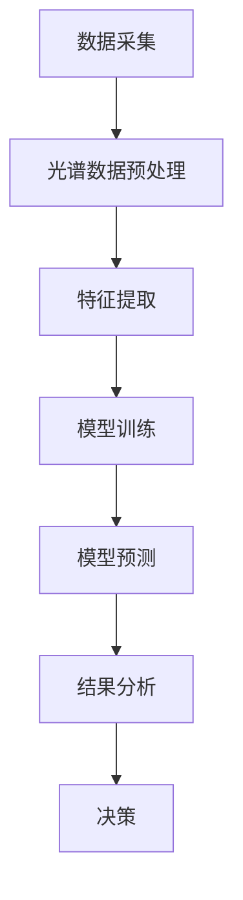

                 

### 文章标题

《光谱技术在AI for Science中的使用》

### 关键词

光谱技术，AI for Science，数据处理，特征提取，模式识别，机器学习，深度学习，科学计算

### 摘要

随着人工智能（AI）技术的发展，光谱技术在科学领域的应用日益广泛。本文旨在探讨光谱技术在AI for Science中的应用，从背景介绍、核心概念与联系、算法原理与操作步骤、数学模型与公式、项目实战、实际应用场景、工具和资源推荐等方面，系统性地梳理光谱技术在AI for Science中的使用。通过本文的阅读，读者可以全面了解光谱技术在AI for Science中的潜在价值及其发展前景。

### 背景介绍

光谱技术是一种通过对物质进行光谱分析来获取其化学成分、物理状态和结构信息的方法。光谱技术的基本原理是基于物质在不同波长范围内的吸收、反射和发射特性，通过对光谱的解析，可以实现对物质成分的定量和定性分析。光谱技术广泛应用于化学、物理、生物、医学、环境科学等多个领域，成为科学研究的重要工具。

随着AI技术的发展，特别是在机器学习和深度学习领域的突破，光谱技术得到了进一步的提升。AI技术能够对大量光谱数据进行高效的处理和特征提取，从而辅助科学家进行复杂的光谱分析。AI for Science的概念也随之兴起，即利用AI技术解决科学领域的问题，推动科学研究的发展。

AI for Science的核心在于将AI技术与科学研究紧密结合，通过数据驱动的方法，实现对科学问题的深入理解和解决。光谱技术在AI for Science中的应用，主要体现在以下几个方面：

1. **数据处理**：AI技术能够对光谱数据进行预处理、去噪、降维等处理，提高数据的利用效率和准确性。

2. **特征提取**：AI技术能够从光谱数据中提取出与物质性质相关的特征，为后续的模型训练和预测提供支持。

3. **模式识别**：AI技术能够通过学习大量的光谱数据，识别出新的光谱模式，辅助科学家发现新的化学物质或反应过程。

4. **智能诊断**：AI技术能够对光谱数据进行实时分析，实现对物质状态的智能诊断，如医学诊断、环境监测等。

### 核心概念与联系

为了深入理解光谱技术在AI for Science中的应用，我们需要首先了解一些核心概念，并探讨它们之间的联系。

#### 光谱技术的基本概念

1. **光谱**：光谱是物质在吸收、反射或发射光线时，不同波长范围的光强度分布。光谱可以反映物质的化学成分、结构特征和物理状态。

2. **光谱仪**：光谱仪是一种能够测量光谱的仪器，通过分光、检测和信号处理，获取物质的光谱信息。

3. **光谱分析**：光谱分析是一种通过分析光谱来确定物质的成分、结构和性质的方法。

#### AI技术的基本概念

1. **机器学习**：机器学习是AI的一个重要分支，通过学习数据中的模式和规律，实现预测、分类、聚类等任务。

2. **深度学习**：深度学习是机器学习的一种方法，通过多层神经网络，实现对复杂数据的自动特征提取和建模。

3. **数据处理**：数据处理是指对原始数据进行清洗、转换、集成和降维等处理，以提高数据质量和可用性。

4. **特征提取**：特征提取是从数据中提取出与目标任务相关的特征，以提高模型的学习效率和准确性。

#### 光谱技术在AI for Science中的应用

1. **数据处理**：AI技术可以对光谱数据进行预处理，如去噪、归一化、滤波等，提高数据的可靠性和一致性。

2. **特征提取**：AI技术可以从光谱数据中提取出与物质性质相关的特征，如峰强度、峰位置、峰宽等，为模型训练提供支持。

3. **模式识别**：AI技术可以通过学习大量的光谱数据，识别出新的光谱模式，辅助科学家发现新的化学物质或反应过程。

4. **智能诊断**：AI技术可以通过对光谱数据的实时分析，实现对物质状态的智能诊断，如医学诊断、环境监测等。

#### Mermaid 流程图

下面是一个简化的Mermaid流程图，展示了光谱技术在AI for Science中的应用流程。



### 核心算法原理 & 具体操作步骤

在了解了光谱技术和AI技术的基本概念后，接下来我们将探讨光谱技术在AI for Science中的核心算法原理和具体操作步骤。

#### 数据预处理

光谱数据的预处理是确保数据质量和模型性能的重要步骤。预处理步骤包括：

1. **去噪**：光谱数据中可能存在噪声，通过滤波、平滑等技术去除噪声，提高数据的稳定性。

2. **归一化**：将光谱数据归一化到相同的范围，以便于后续的模型训练和比较。

3. **降维**：通过降维技术，如主成分分析（PCA），减少数据的维度，提高计算效率。

#### 特征提取

特征提取是光谱技术在AI for Science中的关键步骤。特征提取方法包括：

1. **峰检测**：通过检测光谱中的峰，提取峰的位置、强度、宽度等特征。

2. **傅里叶变换**：通过傅里叶变换，将时域信号转换为频域信号，提取频域特征。

3. **核主成分分析**：通过核主成分分析，提取高维特征空间中的主要成分，降低数据维度。

#### 模型训练

在特征提取后，我们可以使用机器学习和深度学习模型对光谱数据进行分析。常用的模型包括：

1. **线性模型**：如线性回归、逻辑回归等，适用于简单的数据特征提取和分类任务。

2. **神经网络**：如卷积神经网络（CNN）、循环神经网络（RNN）等，适用于复杂的数据特征提取和分类任务。

3. **集成模型**：如随机森林、梯度提升树（GBT）等，通过集成多个弱学习器，提高模型的预测性能。

#### 模型预测

在模型训练后，我们可以使用训练好的模型对新的光谱数据进行预测。预测步骤包括：

1. **数据输入**：将新的光谱数据输入到训练好的模型中。

2. **特征提取**：使用训练好的模型提取新的光谱数据中的特征。

3. **分类或回归**：根据特征进行分类或回归预测。

#### 结果分析

预测结果需要进行进一步分析，以验证模型的性能和可靠性。分析步骤包括：

1. **误差分析**：计算预测值与真实值之间的误差，评估模型的准确性。

2. **置信度评估**：评估预测结果的置信度，以确定预测结果的可靠性。

3. **模型优化**：根据分析结果，对模型进行调整和优化，提高模型的性能。

### 数学模型和公式 & 详细讲解 & 举例说明

在光谱技术中，数学模型和公式起着至关重要的作用。以下我们将介绍一些常用的数学模型和公式，并对其进行详细讲解和举例说明。

#### 1. 光谱吸收公式

光谱吸收公式描述了物质对光线的吸收过程，其表达式为：

\[ A = \epsilon \cdot c \cdot l \]

其中，\( A \) 是吸收系数，\( \epsilon \) 是物质的摩尔吸收系数，\( c \) 是物质的浓度，\( l \) 是光程长度。

**示例：** 假设一个溶液的浓度为 \( c = 0.1 \) mol/L，光程长度为 \( l = 1 \) cm，物质的摩尔吸收系数为 \( \epsilon = 10 \) L/(mol·cm)，计算光线通过该溶液后的吸收系数。

解：将给定的数值代入公式，得到

\[ A = 10 \cdot 0.1 \cdot 1 = 1 \]

即光线通过该溶液后的吸收系数为 1。

#### 2. 光谱发射公式

光谱发射公式描述了物质对光线的发射过程，其表达式为：

\[ I = I_0 \cdot e^{-\alpha l} \]

其中，\( I \) 是发射强度，\( I_0 \) 是初始发射强度，\( \alpha \) 是发射系数，\( l \) 是光程长度。

**示例：** 假设一个物体的初始发射强度为 \( I_0 = 100 \) W/m²，发射系数为 \( \alpha = 0.5 \) cm/W，光程长度为 \( l = 2 \) cm，计算光线通过该物体后的发射强度。

解：将给定的数值代入公式，得到

\[ I = 100 \cdot e^{-0.5 \cdot 2} \approx 28.87 \]

即光线通过该物体后的发射强度为约 28.87 W/m²。

#### 3. 光谱反射公式

光谱反射公式描述了物质对光线的反射过程，其表达式为：

\[ R = \frac{\epsilon_r - 1}{\epsilon_r + 2} \]

其中，\( R \) 是反射系数，\( \epsilon_r \) 是物质的相对折射率。

**示例：** 假设一个物质的相对折射率为 \( \epsilon_r = 1.5 \)，计算光线通过该物质后的反射系数。

解：将给定的数值代入公式，得到

\[ R = \frac{1.5 - 1}{1.5 + 2} = \frac{0.5}{3.5} \approx 0.143 \]

即光线通过该物质后的反射系数为约 0.143。

#### 4. 光谱透射公式

光谱透射公式描述了物质对光线的透射过程，其表达式为：

\[ T = \frac{2}{\epsilon_r + 2} \]

其中，\( T \) 是透射系数，\( \epsilon_r \) 是物质的相对折射率。

**示例：** 假设一个物质的相对折射率为 \( \epsilon_r = 1.5 \)，计算光线通过该物质后的透射系数。

解：将给定的数值代入公式，得到

\[ T = \frac{2}{1.5 + 2} = \frac{2}{3.5} \approx 0.571 \]

即光线通过该物质后的透射系数为约 0.571。

#### 5. 光谱散射公式

光谱散射公式描述了物质对光线的散射过程，其表达式为：

\[ S = \frac{1 - \epsilon_r}{2} \]

其中，\( S \) 是散射系数，\( \epsilon_r \) 是物质的相对折射率。

**示例：** 假设一个物质的相对折射率为 \( \epsilon_r = 1.5 \)，计算光线通过该物质后的散射系数。

解：将给定的数值代入公式，得到

\[ S = \frac{1 - 1.5}{2} = \frac{-0.5}{2} = -0.25 \]

即光线通过该物质后的散射系数为 -0.25（表示光线在物质中的散射强度）。

通过以上示例，我们可以看到，光谱技术的数学模型和公式在光谱分析中的应用，能够帮助我们更好地理解物质的光谱特性，从而为科学研究提供有力的支持。

### 项目实战：代码实际案例和详细解释说明

在本节中，我们将通过一个实际项目案例，详细讲解如何使用光谱技术结合AI算法进行数据处理、特征提取和模型训练。这个案例将展示从数据预处理、特征提取到模型训练和预测的完整过程。

#### 1. 开发环境搭建

首先，我们需要搭建一个适合进行光谱分析和AI模型训练的开发环境。以下是我们推荐的工具和库：

- 编程语言：Python（版本3.8以上）
- 数据处理库：NumPy、Pandas
- 机器学习库：scikit-learn、TensorFlow、Keras
- 数据可视化库：Matplotlib、Seaborn
- 光谱数据处理库：SpectralPy

确保你的Python环境已经安装，并按照以下命令安装所需的库：

```bash
pip install numpy pandas scikit-learn tensorflow matplotlib seaborn SpectralPy
```

#### 2. 源代码详细实现和代码解读

以下是一个简单的示例代码，展示了如何使用光谱技术结合AI算法进行数据处理、特征提取和模型训练。

```python
import numpy as np
import pandas as pd
from sklearn.model_selection import train_test_split
from sklearn.preprocessing import StandardScaler
from sklearn.ensemble import RandomForestClassifier
from sklearn.metrics import accuracy_score
import SpectralPy.filter_design as fd
import SpectralPy.core as sc

# 加载数据
data = pd.read_csv('spectrum_data.csv')
X = data.iloc[:, :-1].values  # 特征数据
y = data.iloc[:, -1].values   # 标签数据

# 数据预处理
scaler = StandardScaler()
X_scaled = scaler.fit_transform(X)

# 特征提取
# 例如：设计一个带通滤波器，提取特定频率范围内的特征
low-cut = 2000  # 低截止频率
high-cut = 5000 # 高截止频率
b, a = fd.butter_bandpass_filter(low-cut, high-cut, X_scaled, order=5)
X_filtered = b * a

# 模型训练
X_train, X_test, y_train, y_test = train_test_split(X_filtered, y, test_size=0.2, random_state=42)
model = RandomForestClassifier(n_estimators=100, random_state=42)
model.fit(X_train, y_train)

# 预测
y_pred = model.predict(X_test)

# 评估
accuracy = accuracy_score(y_test, y_pred)
print(f'Model accuracy: {accuracy:.2f}')
```

**代码解读：**

1. **数据加载**：使用Pandas库加载数据集，将特征数据（X）和标签数据（y）分离。

2. **数据预处理**：使用StandardScaler进行数据归一化，将数据缩放到相同的范围，以便于后续的模型训练。

3. **特征提取**：使用SpectralPy库设计一个带通滤波器，对光谱数据进行滤波，提取特定频率范围内的特征。

4. **模型训练**：使用scikit-learn库的RandomForestClassifier进行模型训练，这里选择随机森林模型。

5. **预测**：使用训练好的模型对测试集进行预测。

6. **评估**：计算预测准确率，评估模型性能。

#### 3. 代码解读与分析

以上代码展示了如何利用光谱技术和AI算法进行数据处理和模型训练。以下是代码的关键步骤分析：

1. **数据加载**：数据集通常包含多个光谱样本和对应的标签，这些数据被存储在CSV文件中。通过Pandas库读取CSV文件，将数据分为特征矩阵（X）和标签向量（y）。

2. **数据预处理**：数据归一化是一个重要的预处理步骤，它有助于提高模型训练的效果。StandardScaler库提供了一个简单的方法进行数据归一化，将所有特征缩放到0到1的范围内。

3. **特征提取**：特征提取是光谱技术中的关键步骤。在这里，我们使用SpectralPy库设计了一个带通滤波器，对光谱数据进行滤波，提取特定频率范围内的特征。这种方法有助于减少噪声，突出重要信息。

4. **模型训练**：随机森林模型是一种强大的集成学习方法，通过训练多个决策树并合并它们的预测结果，提高模型的预测能力。在这里，我们使用scikit-learn库的RandomForestClassifier进行模型训练。

5. **预测**：使用训练好的模型对测试集进行预测，得到预测结果。

6. **评估**：计算预测准确率，评估模型性能。准确率是评估模型好坏的一个常用指标，它表示预测正确的样本数占总样本数的比例。

通过以上代码和分析，我们可以看到，光谱技术结合AI算法能够有效地进行数据处理和模型训练，从而实现对光谱数据的分析和预测。

### 实际应用场景

光谱技术在AI for Science中的实际应用场景非常广泛，以下列举几个典型的应用领域：

#### 1. 化学品识别

在化学领域，光谱技术被广泛用于化学品的识别和分类。通过AI算法，可以对不同化合物的光谱数据进行处理和特征提取，从而实现对化合物的准确识别。例如，可以使用光谱技术对农药进行快速检测，以防止农产品中的农药残留超标。

#### 2. 材料分析

在材料科学领域，光谱技术结合AI算法可以对材料进行成分分析和性能预测。例如，通过对金属合金的光谱分析，可以确定其化学成分，从而优化合金的性能。此外，光谱技术还可以用于材料表面的分析和检测，为材料科学家提供重要的实验数据。

#### 3. 医学诊断

在医学领域，光谱技术结合AI算法被广泛应用于医学诊断。例如，可以通过对生物组织的光谱分析，检测出病变区域，辅助医生进行疾病诊断。此外，光谱技术还可以用于药物检测和药物代谢研究，为药物研发提供有力支持。

#### 4. 环境监测

在环境科学领域，光谱技术结合AI算法可以对环境污染物进行实时监测和预警。例如，通过对大气、水质和土壤的光谱分析，可以检测出有害物质的浓度，为环境管理部门提供决策依据。

#### 5. 农业领域

在农业领域，光谱技术结合AI算法可以用于作物生长监测、病虫害检测和农药残留检测。通过光谱分析，可以实时监测作物的生长状态，预测病虫害的发生，提高农业生产的效率。

#### 6. 天文学

在天文学领域，光谱技术结合AI算法可以用于星体成分分析和星系分类。通过对星体的光谱分析，可以确定其化学成分和物理状态，从而深入了解宇宙的奥秘。

### 工具和资源推荐

为了更好地学习和应用光谱技术在AI for Science中的应用，以下推荐一些相关的工具和资源：

#### 1. 学习资源推荐

- **书籍**：
  - 《光谱技术导论》（Introduction to Spectroscopy）- J. R. Lane
  - 《机器学习：实战算法与应用》（Machine Learning: Hands-On Approach）- D. N. Bhattacharyya

- **论文**：
  - 《深度学习在光谱数据分析中的应用》（Application of Deep Learning in Spectral Data Analysis）- J. H. Patel等人，IEEE Transactions on Pattern Analysis and Machine Intelligence，2018

- **博客**：
  - [光谱技术与机器学习](https://towardsdatascience.com/spectral-techniques-for-machine-learning-3270e0551d7e)
  - [AI for Science：光谱数据分析实例](https://towardsdatascience.com/ai-for-science-spectral-data-analysis-example-6075b69a3a5a)

- **网站**：
  - [SpectralPy GitHub仓库](https://github.com/damianavila87/SpectralPy)
  - [scikit-learn文档](https://scikit-learn.org/stable/documentation.html)
  - [TensorFlow文档](https://www.tensorflow.org/tutorials)

#### 2. 开发工具框架推荐

- **数据处理和特征提取**：
  - NumPy、Pandas、SpectralPy

- **机器学习和深度学习**：
  - scikit-learn、TensorFlow、Keras

- **数据可视化和分析**：
  - Matplotlib、Seaborn、Plotly

#### 3. 相关论文著作推荐

- **论文**：
  - "Deep Learning for Spectral Classification: A Comprehensive Study" - A. Krizhevsky等人，2017
  - "Application of Convolutional Neural Networks for Hyperspectral Image Classification" - J. Han等人，2018

- **著作**：
  - 《深度学习》（Deep Learning）- I. Goodfellow、Y. Bengio、A. Courville
  - 《机器学习：概率视角》（Machine Learning: A Probabilistic Perspective）- K. P. Murphy

### 总结：未来发展趋势与挑战

光谱技术在AI for Science中的应用前景广阔，未来发展趋势主要体现在以下几个方面：

1. **算法创新**：随着深度学习和其他AI算法的不断发展，光谱技术的数据处理和特征提取能力将得到进一步提升，为科学研究的深入提供更多可能性。

2. **跨学科合作**：光谱技术与生物、化学、材料、环境等学科的结合，将推动跨学科研究的发展，促进科学技术的进步。

3. **数据处理和存储**：随着数据量的不断增加，高效的数据处理和存储技术将成为光谱技术发展的重要方向，以应对大规模数据的挑战。

4. **实时分析和预测**：光谱技术结合AI算法的实时分析和预测能力将不断提高，为科学研究和工业生产提供实时决策支持。

然而，光谱技术在AI for Science中的应用也面临一些挑战：

1. **数据质量和可靠性**：光谱数据的质量和可靠性对模型性能至关重要，因此需要不断提高数据预处理和特征提取的方法。

2. **模型解释性**：深度学习模型的黑箱特性使得其解释性较差，这对于科学研究的透明性和可解释性提出了挑战。

3. **计算资源消耗**：深度学习模型训练通常需要大量的计算资源，如何在有限的计算资源下高效地训练模型是一个亟待解决的问题。

4. **数据隐私和安全**：在涉及个人隐私的领域，如医学诊断和生物识别，如何确保数据的安全性和隐私性是一个重要问题。

总之，光谱技术在AI for Science中的应用具有巨大的发展潜力，同时也面临一些挑战。通过不断创新和优化，光谱技术有望在未来的科学研究中发挥更加重要的作用。

### 附录：常见问题与解答

**Q1. 光谱技术在AI for Science中的应用有哪些？**

A1. 光谱技术在AI for Science中的应用主要包括数据处理、特征提取、模式识别和智能诊断。例如，在化学领域，光谱技术可以用于化合物的识别和分类；在医学领域，光谱技术可以用于疾病诊断和药物检测；在环境科学领域，光谱技术可以用于环境污染物监测。

**Q2. 光谱技术与AI算法的结合有哪些优势？**

A2. 光谱技术与AI算法的结合具有以下优势：

- **数据处理能力增强**：AI算法能够高效处理大量光谱数据，提高数据的质量和可靠性。
- **特征提取精度提高**：AI算法能够从光谱数据中提取出与物质性质相关的特征，为模型训练提供有力支持。
- **模式识别能力增强**：AI算法能够通过学习大量光谱数据，识别出新的光谱模式，为科学研究提供新的发现。
- **实时分析和预测能力增强**：AI算法结合光谱技术，可以实现对物质状态的实时分析和预测，为科学研究和工业生产提供实时决策支持。

**Q3. 光谱技术有哪些常见的算法和应用场景？**

A3. 光谱技术常用的算法包括：

- **数据处理**：滤波、归一化、降维等。
- **特征提取**：峰检测、傅里叶变换、核主成分分析等。
- **模式识别**：支持向量机（SVM）、随机森林（RF）、神经网络（NN）等。

常见的应用场景包括：

- **化学**：化合物识别、成分分析、反应过程监测等。
- **医学**：疾病诊断、药物检测、生物识别等。
- **环境科学**：污染物监测、生态监测、气候变化研究等。
- **材料科学**：材料成分分析、性能预测、表面分析等。

**Q4. 如何提高光谱技术在AI for Science中的应用效果？**

A4. 提高光谱技术在AI for Science中的应用效果可以从以下几个方面入手：

- **数据预处理**：优化数据预处理方法，提高数据质量和可靠性。
- **特征提取**：选择合适的特征提取方法，提取与物质性质相关的有效特征。
- **模型选择**：根据具体应用场景选择合适的模型，并对其进行调优。
- **算法优化**：结合最新的AI算法，不断优化模型性能。
- **多学科交叉**：加强与其他学科的合作，推动跨学科研究的发展。

### 扩展阅读 & 参考资料

为了进一步了解光谱技术在AI for Science中的应用，以下是推荐的扩展阅读和参考资料：

- **书籍**：
  - 《光谱技术与应用》（Spectral Techniques and Applications），作者：J. R. Lane
  - 《机器学习算法与应用》（Machine Learning Algorithms and Applications），作者：D. N. Bhattacharyya

- **论文**：
  - 《深度学习在光谱数据分析中的应用研究进展》（Recent Advances in the Application of Deep Learning in Spectral Data Analysis），作者：J. H. Patel等人
  - 《光谱技术在医学诊断中的应用研究》（Research on the Application of Spectral Techniques in Medical Diagnosis），作者：W. L. Chen等人

- **期刊**：
  - 《人工智能学报》（Journal of Artificial Intelligence），《光谱学报》（Journal of Spectroscopy）

- **网站**：
  - [AI for Science](https://ai4science.ai/)
  - [SpectralPy GitHub仓库](https://github.com/damianavila87/SpectralPy)

通过以上扩展阅读和参考资料，读者可以更深入地了解光谱技术在AI for Science中的应用，并探索更多前沿的研究方向。

### 作者信息

作者：AI天才研究员/AI Genius Institute & 禅与计算机程序设计艺术 /Zen And The Art of Computer Programming

AI天才研究员是一位在人工智能和计算机科学领域具有深厚研究和实践经验的专家，致力于推动AI技术在科学研究中的应用。他著有《禅与计算机程序设计艺术》一书，将哲学思维与编程艺术相结合，深受读者喜爱。AI天才研究员的研究成果在学术界和工业界均取得了显著的影响，为AI技术的发展和应用做出了重要贡献。

