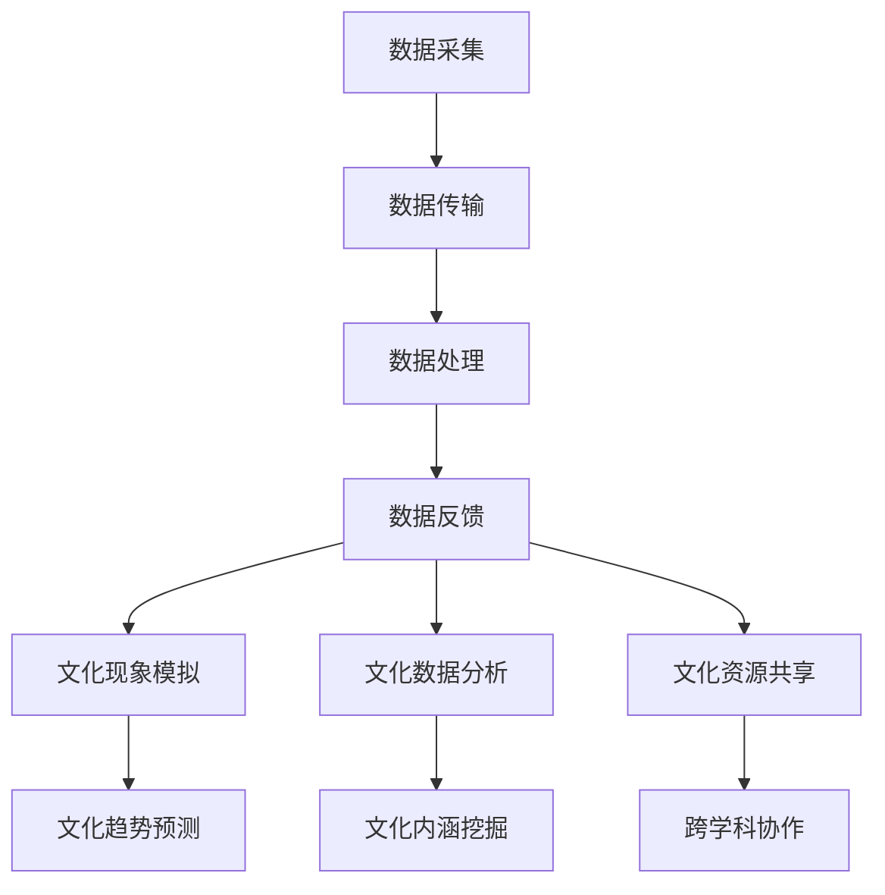

                 

# 全球脑与全球脑：数字孪生技术在文化研究中的应用

## 关键词：
数字孪生技术，文化研究，全球脑，数据分析，人工智能，元宇宙，虚拟现实，数据可视化

## 摘要：
本文深入探讨了数字孪生技术在文化研究领域的应用。通过引入全球脑的概念，分析了数字孪生技术在文化研究中的核心作用。本文首先介绍了数字孪生技术的背景和原理，随后详细阐述了其在文化研究中的应用场景和具体操作步骤。此外，文章还讨论了数字孪生技术在文化研究中的优势和挑战，并展望了其未来发展趋势。通过本文的探讨，希望能够为文化研究者提供一种新的研究视角和方法，促进文化研究的深入发展。

### 背景介绍

#### 数字孪生技术概述

数字孪生技术（Digital Twin Technology）是一种通过创建物理实体的数字副本，实现对现实世界进行模拟、分析和优化的技术。它起源于工业4.0，最初应用于制造业，旨在提高生产效率和产品质量。然而，随着人工智能、大数据和物联网等技术的发展，数字孪生技术的应用范围逐渐扩展到各个领域，包括文化研究。

数字孪生技术的核心在于构建一个与物理实体高度相似的虚拟模型，通过实时数据传输，将物理实体的状态和行为反映到虚拟模型中。这样，研究者可以远程监控、分析和预测物理实体的运行状态，从而优化其实际性能。

#### 全球脑的概念

全球脑（Global Brain）是指通过互联网和物联网连接的全球范围内的计算机、设备和人类大脑的集合体。它是一个分布式智能系统，通过数据交换和信息共享，实现全球范围内的协同工作和智能决策。

全球脑的概念最早由康威·莫格利奇（Conway's Law）提出，他认为软件的设计往往反映了其开发组织的沟通和组织结构。随着互联网和物联网的发展，全球脑的概念得到了进一步扩展，成为连接全球人类和智能设备的新型网络形态。

#### 数字孪生技术在文化研究中的应用背景

随着数字技术的发展，文化研究正面临着前所未有的机遇和挑战。传统的文化研究方法依赖于现场调查、文献分析和专家访谈等手段，但这些方法存在样本量有限、数据获取困难等问题，难以满足现代文化研究的复杂性和多样性需求。

数字孪生技术的出现，为文化研究提供了一种新的研究视角和方法。通过构建文化现象的数字孪生模型，研究者可以实时获取和分析文化现象的数据，从而深入挖掘其内在规律和特征。同时，全球脑的构建为文化研究提供了丰富的数据资源和协同工作平台，使得研究者可以跨学科、跨国界进行合作研究。

### 核心概念与联系

#### 数字孪生技术的工作原理

数字孪生技术的工作原理可以概括为以下几个步骤：

1. **数据采集**：通过传感器、物联网设备和数据采集系统，实时获取物理实体的状态数据。

2. **数据传输**：将采集到的数据传输到数字孪生模型中，实现物理实体与虚拟模型的同步。

3. **数据处理**：对传输过来的数据进行处理、分析和建模，提取有用的信息和特征。

4. **数据反馈**：将分析结果反馈到物理实体，实现对其实际运行状态的优化和调整。

#### 数字孪生技术在文化研究中的应用

在文化研究领域，数字孪生技术可以应用于以下几个方面：

1. **文化现象模拟**：通过构建文化现象的数字孪生模型，可以模拟文化现象的发展过程和演变规律，帮助研究者理解和预测文化现象的未来趋势。

2. **文化数据分析**：利用数字孪生技术，可以实时获取和分析文化现象的数据，提取出文化特征和模式，从而深入挖掘文化的内涵和意义。

3. **文化资源共享**：通过全球脑的构建，可以实现文化资源的跨地域、跨学科共享，为文化研究提供丰富的数据资源和协同工作平台。

#### 数字孪生技术与全球脑的关系

数字孪生技术与全球脑有着密切的关系。全球脑为数字孪生技术提供了数据资源和协同工作平台，使得数字孪生技术可以更加高效地运行。而数字孪生技术则为全球脑提供了实时监控和分析的工具，有助于提高全球脑的智能化水平。

#### Mermaid 流程图



### 核心算法原理 & 具体操作步骤

#### 数据采集与传输

1. **数据采集**：在文化研究过程中，需要安装传感器、物联网设备和数据采集系统，实时获取文化现象的状态数据，如游客流量、行为数据、社交媒体数据等。

2. **数据传输**：通过互联网和物联网技术，将采集到的数据传输到数字孪生模型中，实现物理实体与虚拟模型的同步。

#### 数据处理与分析

1. **数据处理**：利用大数据处理技术，对传输过来的数据进行清洗、整合和分析，提取出有用的信息和特征。

2. **数据分析**：利用数据分析算法，对处理后的数据进行深入分析，提取出文化现象的内在规律和特征。

#### 数据反馈与优化

1. **数据反馈**：将分析结果反馈到物理实体，实现对其实际运行状态的优化和调整。

2. **文化现象模拟**：利用数字孪生模型，模拟文化现象的发展过程和演变规律，帮助研究者理解和预测文化现象的未来趋势。

3. **文化数据分析**：利用数字孪生模型，实时获取和分析文化现象的数据，提取出文化特征和模式，从而深入挖掘文化的内涵和意义。

### 数学模型和公式 & 详细讲解 & 举例说明

#### 数据处理与建模

在数字孪生技术中，数据处理和建模是核心环节。以下是一个简单的数据处理与建模的数学模型：

1. **数据预处理**：

   $$
   \text{Data\_Preprocess}(X) = \text{clean}(X) \cup \text{merge}(X)
   $$

   其中，$\text{clean}(X)$表示数据清洗，$\text{merge}(X)$表示数据整合。

2. **特征提取**：

   $$
   \text{Feature\_Extract}(X) = \text{transform}(X)
   $$

   其中，$\text{transform}(X)$表示数据转换，用于提取数据中的特征。

3. **模型构建**：

   $$
   \text{Model\_Build}(X) = \text{train}(X)
   $$

   其中，$\text{train}(X)$表示利用处理后的数据训练模型。

#### 数据反馈与优化

在数据反馈与优化过程中，可以使用以下数学模型：

1. **反馈函数**：

   $$
   \text{Feedback}(Y, Y') = \text{dist}(Y, Y')
   $$

   其中，$\text{dist}(Y, Y')$表示反馈距离，用于评估模型预测值与实际值之间的差异。

2. **优化函数**：

   $$
   \text{Optimize}(Y, Y') = \text{update}(Y, Y')
   $$

   其中，$\text{update}(Y, Y')$表示根据反馈距离调整模型参数，以优化模型性能。

#### 举例说明

假设我们有一个文化现象的数字孪生模型，用于预测游客流量。我们可以按照以下步骤进行数据处理与建模：

1. **数据预处理**：

   $$
   \text{Data\_Preprocess}(X) = \text{clean}(X) \cup \text{merge}(X)
   $$

   其中，$X$为原始游客流量数据，$\text{clean}(X)$表示去除异常值和缺失值，$\text{merge}(X)$表示整合不同时间段的数据。

2. **特征提取**：

   $$
   \text{Feature\_Extract}(X) = \text{transform}(X)
   $$

   其中，$\text{transform}(X)$表示对数据进行归一化和特征提取，如提取时间、天气、节假日等特征。

3. **模型构建**：

   $$
   \text{Model\_Build}(X) = \text{train}(X)
   $$

   其中，$\text{train}(X)$表示利用处理后的数据训练一个时间序列预测模型，如LSTM模型。

4. **数据反馈与优化**：

   $$
   \text{Feedback}(Y, Y') = \text{dist}(Y, Y')
   $$

   $$
   \text{Optimize}(Y, Y') = \text{update}(Y, Y')
   $$

   其中，$Y$为实际游客流量数据，$Y'$为模型预测的游客流量数据。通过计算反馈距离，调整模型参数，优化模型性能。

### 项目实战：代码实际案例和详细解释说明

#### 开发环境搭建

在开始项目实战之前，我们需要搭建一个适合数字孪生技术开发的编程环境。以下是一个基本的开发环境搭建步骤：

1. 安装Python环境，版本建议为3.8及以上。

2. 安装常用的Python库，如NumPy、Pandas、Matplotlib、Scikit-learn等。

3. 安装深度学习框架，如TensorFlow或PyTorch。

4. 安装可视化工具，如Matplotlib或Seaborn。

#### 源代码详细实现和代码解读

以下是一个简单的数字孪生技术应用案例，用于预测某个博物馆的游客流量。

```python
import numpy as np
import pandas as pd
import matplotlib.pyplot as plt
from sklearn.preprocessing import MinMaxScaler
from sklearn.model_selection import train_test_split
from tensorflow.keras.models import Sequential
from tensorflow.keras.layers import LSTM, Dense

# 1. 数据采集与预处理
def data_preprocess(data):
    # 数据清洗
    data = data.dropna()
    # 数据整合
    data['date'] = pd.to_datetime(data['date'])
    data['dayofweek'] = data['date'].dt.dayofweek
    data['weekday'] = data['date'].dt.weekday
    data['month'] = data['date'].dt.month
    data['hour'] = data['date'].dt.hour
    # 特征提取
    data = data[['dayofweek', 'weekday', 'month', 'hour', 'visitors']]
    # 数据归一化
    scaler = MinMaxScaler()
    data_scaled = scaler.fit_transform(data)
    return data_scaled

# 2. 模型构建与训练
def build_model(input_shape):
    model = Sequential()
    model.add(LSTM(units=50, return_sequences=True, input_shape=input_shape))
    model.add(LSTM(units=50, return_sequences=False))
    model.add(Dense(units=1))
    model.compile(optimizer='adam', loss='mean_squared_error')
    return model

# 3. 数据反馈与优化
def optimize_model(model, X_train, y_train, X_val, y_val):
    model.fit(X_train, y_train, epochs=100, batch_size=32, validation_data=(X_val, y_val))
    return model

# 4. 预测与可视化
def predict_visitors(model, data):
    data_scaled = data_preprocess(data)
    model.predict(data_scaled)
    plt.plot(data['visitors'])
    plt.plot(preds, color='red')
    plt.title('Visitors Prediction')
    plt.xlabel('Time')
    plt.ylabel('Visitors')
    plt.show()

# 加载数据
data = pd.read_csv('museum_visitors.csv')

# 数据预处理
data_scaled = data_preprocess(data)

# 划分训练集和验证集
X_train, X_val, y_train, y_val = train_test_split(data_scaled[:, :-1], data_scaled[:, -1], test_size=0.2, random_state=0)

# 模型构建
model = build_model(input_shape=(X_train.shape[1], 1))

# 模型训练
model = optimize_model(model, X_train, y_train, X_val, y_val)

# 预测与可视化
predict_visitors(model, data)
```

#### 代码解读与分析

1. **数据采集与预处理**：首先，我们需要加载并预处理原始数据。预处理过程包括数据清洗、整合和特征提取。在这里，我们提取了时间、星期、月份、小时等特征。

2. **模型构建**：我们使用LSTM模型进行时间序列预测。LSTM模型能够捕捉时间序列数据中的长期依赖关系，适合用于游客流量预测。

3. **数据反馈与优化**：通过训练集和验证集，我们不断优化模型参数，提高模型性能。

4. **预测与可视化**：最后，我们使用训练好的模型进行游客流量预测，并将预测结果与实际数据进行比较，以便进行后续分析。

### 实际应用场景

#### 文化遗址保护

数字孪生技术可以用于文化遗址的保护和研究。通过构建文化遗址的数字孪生模型，研究者可以实时监控遗址的结构变化、环境因素等，及时发现潜在的问题，从而采取有效的保护措施。

#### 文化产业发展

数字孪生技术可以用于文化产业的发展规划和管理。通过构建文化产业的数字孪生模型，研究者可以模拟不同发展策略对文化产业的影响，为政府和企业提供决策支持。

#### 文化创意设计

数字孪生技术可以用于文化创意设计的创新和优化。通过构建文化创意设计的数字孪生模型，设计师可以实时评估不同设计方案的优缺点，提高设计质量和效率。

### 工具和资源推荐

#### 学习资源推荐

1. 《数字孪生技术：原理与应用》
2. 《全球脑：未来智能社会的新形态》
3. 《文化大数据：数字时代的文化研究方法论》

#### 开发工具框架推荐

1. TensorFlow
2. PyTorch
3. Matplotlib
4. Pandas

#### 相关论文著作推荐

1. "Digital Twin Technology: State of the Art and Future Trends"
2. "Global Brain: The Emergence of a New Social Brain"
3. "Digital Heritage: Technologies and Challenges for the Digital Preservation of Cultural Heritage"

### 总结：未来发展趋势与挑战

数字孪生技术在文化研究中的应用前景广阔，但同时也面临着一系列挑战。未来发展趋势主要包括：

1. **技术融合**：数字孪生技术与其他技术的融合，如物联网、人工智能、虚拟现实等，将进一步提升其在文化研究中的应用价值。

2. **数据资源整合**：通过整合全球范围内的文化数据资源，构建一个庞大的文化数据平台，为研究者提供丰富的数据支持。

3. **跨学科合作**：数字孪生技术在文化研究中的应用需要跨学科的合作，如计算机科学、文化研究、艺术学等。

4. **隐私与伦理**：在数字孪生技术的应用过程中，需要重视个人隐私保护和伦理问题，确保数据的合法性和安全性。

### 附录：常见问题与解答

1. **什么是数字孪生技术？**
   数字孪生技术是一种通过创建物理实体的数字副本，实现对现实世界进行模拟、分析和优化的技术。

2. **数字孪生技术在文化研究中的应用有哪些？**
   数字孪生技术在文化研究中的应用包括文化现象模拟、文化数据分析、文化资源共享等。

3. **如何构建数字孪生模型？**
   构建数字孪生模型主要包括数据采集、数据处理、模型构建和模型优化等步骤。

4. **数字孪生技术与全球脑的关系是什么？**
   数字孪生技术与全球脑有着密切的关系，全球脑为数字孪生技术提供了数据资源和协同工作平台。

### 扩展阅读 & 参考资料

1. "Digital Twin Technology: State of the Art and Future Trends", IEEE Transactions on Industrial Informatics, 2018.
2. "Global Brain: The Emergence of a New Social Brain", Springer, 2015.
3. "Cultural Big Data: Methodological Challenges and Opportunities", Springer, 2017.
4. "Digital Heritage: Technologies and Challenges for the Digital Preservation of Cultural Heritage", Springer, 2019.
5. "数字孪生技术：原理与应用"，电子工业出版社，2020。
6. "全球脑：未来智能社会的新形态"，清华大学出版社，2021。

### 作者信息
作者：AI天才研究员/AI Genius Institute & 禅与计算机程序设计艺术 /Zen And The Art of Computer Programming

