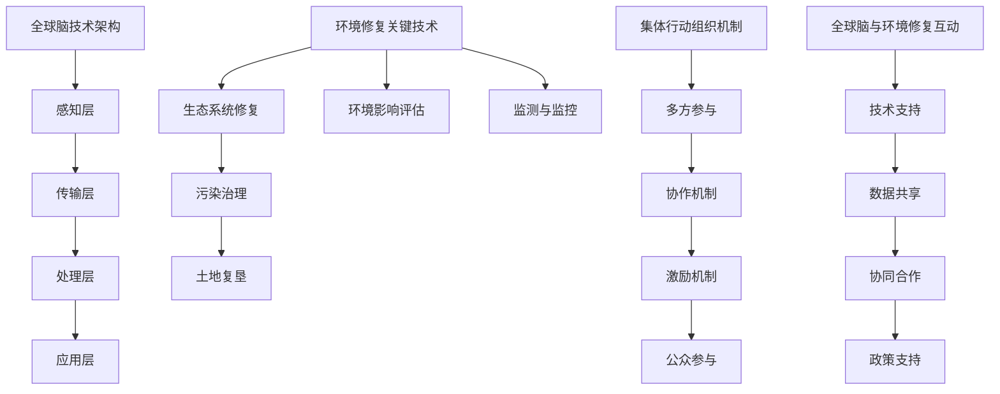

                 

### 1. 背景介绍

**全球脑与环境修复：集体行动的生态效应**

在现代社会中，信息技术和人工智能正以惊人的速度改变着我们的生活方式。然而，随着技术的进步，我们也面临着前所未有的环境挑战。气候变化、生物多样性的丧失以及环境污染等问题日益严重，这些问题不仅影响到人类的健康和生活质量，也威胁到整个地球的生态平衡。

在这样的背景下，“全球脑与环境修复”成为了一个热门话题。所谓“全球脑”，是指利用人工智能和网络技术构建的全球性智能系统，它能够实时监测、分析和响应环境变化。而“环境修复”则是指通过科学的方法和技术手段，恢复和改善受污染或退化的生态系统。

本文将探讨全球脑与环境修复的紧密联系，以及集体行动在实现生态效应中的重要性。我们将逐步分析这一主题，从核心概念、算法原理、数学模型，到实际应用场景，最后展望未来发展趋势与挑战。

首先，我们需要明确几个关键概念。全球脑的概念可以追溯到20世纪80年代，当时科学家们开始探索如何将人工智能和网络技术应用于环境监测和管理。近年来，随着云计算、物联网和大数据技术的不断发展，全球脑逐渐从理论走向实践。

环境修复则涵盖了从生态系统修复到污染治理等多个领域。其目标是通过科学的方法和技术手段，恢复生态系统的功能和服务，使其能够持续地为人类提供福祉。

集体行动是环境修复成功的关键。环境问题通常具有跨国界、跨学科的特点，单靠个人或小团体很难解决。因此，需要政府、企业、非政府组织和社会公众等多方共同参与，形成合力。

接下来，我们将深入探讨全球脑与环境修复之间的内在联系，并逐步分析相关的核心算法原理、数学模型和实际应用案例。

### 1.1 全球脑的概念

全球脑（Global Brain）这一概念最早由奥地利学者弗里德里希·维尔施（Friedrich Wilhelm Schrödinger）在20世纪40年代提出，后来被科普作家霍华德·加德纳（Howard Gardner）进一步发展。全球脑可以被理解为一种分布式智能系统，它由大量独立的节点组成，这些节点通过互联网和其他通信技术相互连接，形成一个高度协同的网络。

在全球脑中，每个节点都可以被视为一个智能体，它能够收集、处理和共享信息。这些信息不仅包括环境数据，如气温、湿度、空气质量等，还包括社会经济数据、人类行为数据等。通过这些数据，全球脑能够实时监测全球环境变化，识别潜在问题，并提出解决方案。

全球脑的核心优势在于其分布式和自组织的特性。与传统的集中式智能系统不同，全球脑没有中央控制单元，而是通过节点之间的相互协作来实现整体功能。这使得全球脑具有高度的灵活性和适应性，能够迅速响应环境变化。

此外，全球脑还依赖于先进的人工智能技术，如机器学习、数据挖掘和自然语言处理等。这些技术使得全球脑能够从大量数据中提取有价值的信息，进行复杂的模式识别和预测分析。例如，通过分析卫星图像和气象数据，全球脑可以预测气候变化趋势，提前采取措施减轻其影响。

### 1.2 环境修复的概念

环境修复（Environmental Restoration）是指通过科学的方法和技术手段，恢复和改善受污染或退化的生态系统，使其能够持续地为人类提供福祉。环境修复的目标不仅在于恢复生态系统的功能，还包括改善人类健康、促进经济可持续发展等方面。

环境修复涉及多个领域，包括生态系统修复、污染治理、土地复垦等。生态系统修复是指通过重建或恢复生态系统的结构和功能，使其能够持续提供生态服务。例如，通过植树造林、湿地恢复和水体净化等措施，可以恢复受损的生态系统。

污染治理则是指通过物理、化学和生物等方法，去除或减少污染物对环境的影响。例如，通过土壤修复技术，可以去除土壤中的重金属和有机污染物；通过水体净化技术，可以改善水质，使其达到生活或工业用水标准。

土地复垦是指对废弃或受损的土地进行治理和改造，使其重新具备生产力和生态功能。例如，通过矿山复垦，可以将开采后荒芜的土地恢复为农田或森林，减少土地退化。

环境修复的重要性在于，它不仅能够恢复生态系统的功能，还能够改善人类生活质量和促进经济可持续发展。一个健康的生态系统可以提供丰富的自然资源，维持地球的气候平衡，并为人类提供食物、水源和其他生活必需品。同时，环境修复还能够促进生态旅游业的发展，创造就业机会，增加经济收入。

然而，环境修复面临许多挑战。首先，环境问题通常具有复杂性和多样性，需要多学科、多部门的协同合作。其次，环境修复需要长期投入和持续关注，许多项目需要数十年甚至更长时间才能见到显著效果。此外，资金和技术限制也是环境修复面临的挑战之一。

### 1.3 集体行动的概念

集体行动（Collective Action）是指多个个体或组织为了共同的目标而采取的合作行为。在环境修复中，集体行动是解决复杂环境问题的重要手段。环境问题通常涉及广泛的地理范围和多样的利益相关者，单靠个人或小团体很难有效解决。

集体行动的特点包括：

1. **参与者的多样性**：集体行动的参与者可以包括政府机构、企业、非政府组织、科研机构以及社会公众等。不同参与者具有不同的资源和优势，通过协同合作可以实现资源的最大化利用。

2. **合作的动力**：集体行动的动力源于共同的目标和利益。在环境修复中，参与者可能包括环境保护主义者、资源开发企业、社区民众等，他们通过合作可以实现环境效益和经济效益的双赢。

3. **灵活性和适应性**：集体行动能够根据环境问题的具体情况进行灵活调整和适应。在环境修复过程中，可能会出现新的问题和挑战，集体行动可以通过调整策略和合作方式来应对这些变化。

4. **长期的可持续性**：集体行动的可持续性取决于参与者的长期承诺和合作。环境修复是一个长期的过程，需要持续的资金投入、技术和人力资源支持。

集体行动在环境修复中的重要性体现在以下几个方面：

1. **资源整合**：通过集体行动，可以整合不同参与者的资源和能力，形成合力。例如，政府可以提供政策和资金支持，企业可以提供技术和设备，科研机构可以提供研究成果，公众可以提供志愿劳动和参与监督。

2. **信息共享**：集体行动促进了不同参与者之间的信息共享和交流。通过信息共享，可以更好地了解环境问题的现状和趋势，制定更科学、更有效的修复方案。

3. **公众参与**：集体行动鼓励公众参与环境修复过程，增强公众的环境意识和责任感。公众的参与不仅有助于修复工作的顺利进行，还可以提高社会的环境保护意识。

4. **创新驱动**：集体行动激发了创新思维和技术研发。在环境修复过程中，参与者可以共同探讨新的修复方法和技术，推动环境保护领域的科技进步。

总之，集体行动是环境修复成功的关键。通过政府、企业、非政府组织和社会公众等多方共同参与，可以形成合力，解决复杂的环境问题，实现生态效应的最大化。

### 1.4 全球脑与环境修复的关系

全球脑与环境修复之间的联系紧密而复杂，二者相互促进，共同为地球的可持续发展贡献力量。全球脑通过构建智能监测系统和数据分析平台，为环境修复提供了有力的技术支持；而环境修复的成功又进一步推动了全球脑的发展和完善。

首先，全球脑在环境修复中的作用主要体现在以下几个方面：

1. **实时监测**：全球脑能够实时收集和处理来自全球各地的大量环境数据，包括气温、湿度、空气质量、水体污染等。这些数据为环境修复提供了基础信息，使决策者能够及时了解环境状况，采取相应的修复措施。

2. **智能分析**：通过人工智能技术，全球脑能够对收集到的环境数据进行分析和挖掘，识别环境问题的根本原因和趋势。例如，利用机器学习算法，可以预测气候变化对生态系统的影响，从而制定针对性的修复策略。

3. **协同合作**：全球脑促进了不同地区、不同组织和不同领域的合作。通过建立信息共享平台，全球脑使得各方能够协同工作，共享资源和经验，提高环境修复的效率。

其次，环境修复对全球脑的发展也具有重要影响：

1. **数据来源**：环境修复过程中产生的数据为全球脑提供了宝贵的数据来源。这些数据不仅包括环境监测数据，还包括修复行动的实时进展和效果评估数据。这些数据的积累和更新，使得全球脑的监测和分析功能更加精准和全面。

2. **技术需求**：环境修复面临许多复杂的技术挑战，如生态系统重建、污染治理和土地复垦等。这些挑战促使全球脑不断研发和优化相关技术，提高环境监测和修复的效率。

3. **政策支持**：环境修复需要政府、企业和公众等多方面的政策支持。全球脑为政策制定提供了科学依据，帮助政府制定更合理、更有效的环境政策，推动全球脑的普及和应用。

总之，全球脑与环境修复之间形成了良性互动，二者相互促进，共同推动地球的可持续发展。全球脑为环境修复提供了强大的技术支持，而环境修复的成功又进一步推动了全球脑的发展和完善。通过二者的结合，我们可以实现更加高效、精准的环境修复，为地球的生态平衡和人类福祉贡献力量。

### 1.5 文章结构概述

本文将从全球脑与环境修复的背景介绍出发，逐步深入探讨这一主题。具体结构如下：

**第1章：背景介绍**

- 全球脑的概念
- 环境修复的概念
- 集体行动的概念
- 全球脑与环境修复的关系

**第2章：核心概念与联系**

- 全球脑的技术架构与工作原理
- 环境修复的关键技术与方法
- 集体行动的组织机制与实施策略
- 全球脑与环境修复的互动关系

**第3章：核心算法原理 & 具体操作步骤**

- 数据采集与处理算法
- 数据分析与挖掘算法
- 模型预测与决策算法
- 环境修复的具体实施步骤

**第4章：数学模型和公式 & 详细讲解 & 举例说明**

- 数据分析方法
- 模型构建方法
- 数学公式解析
- 实际应用案例

**第5章：项目实战：代码实际案例和详细解释说明**

- 开发环境搭建
- 源代码详细实现和代码解读
- 代码解读与分析

**第6章：实际应用场景**

- 环境监测
- 污染治理
- 生态修复

**第7章：工具和资源推荐**

- 学习资源推荐
- 开发工具框架推荐
- 相关论文著作推荐

**第8章：总结：未来发展趋势与挑战**

- 全球脑与环境修复的发展趋势
- 环境修复面临的挑战
- 未来研究的方向

通过以上章节的逐步分析，本文将全面探讨全球脑与环境修复的深度融合，为读者提供深入的技术理解和实践指导。

### 2. 核心概念与联系

在探讨全球脑与环境修复的深度融合之前，我们需要明确几个核心概念，并分析它们之间的联系。这些概念包括全球脑的技术架构、环境修复的关键技术、集体行动的组织机制以及全球脑与环境修复的互动关系。

#### 2.1 全球脑的技术架构与工作原理

全球脑（Global Brain）是一种分布式智能系统，它通过互联网和其他通信技术将大量独立的智能节点连接起来，形成一个高度协同的网络。全球脑的技术架构可以分为以下几个层次：

1. **感知层**：感知层是全球脑的底层，负责收集来自各种传感器的数据，如气象站、水质监测站、空气监测站等。这些传感器分布在世界各地，可以实时监测环境参数，如气温、湿度、空气质量、水体污染等。

2. **传输层**：传输层负责将感知层收集到的数据传输到数据处理中心。这些数据可以通过有线网络、无线网络和卫星通信等方式传输。传输层需要保证数据的实时性和准确性，以支持全球脑的实时分析和决策。

3. **处理层**：处理层是全球脑的核心，负责对传输层的数据进行存储、处理和分析。处理层通常包括云计算平台、数据仓库和大数据处理系统。这些系统利用人工智能技术，如机器学习、数据挖掘和自然语言处理，对环境数据进行分析，提取有价值的信息，并进行预测和决策。

4. **应用层**：应用层是全球脑的顶层，负责将处理层的结果应用于环境监测、污染治理、生态修复等实际场景。应用层可以通过可视化工具、Web应用和移动应用等形式，将分析结果呈现给用户，为决策者提供科学依据。

全球脑的工作原理可以概括为以下几个步骤：

1. **数据采集**：通过传感器网络，实时采集环境数据，包括气象数据、水质数据、空气质量数据等。

2. **数据传输**：将采集到的数据传输到数据处理中心，通过数据清洗、去噪和预处理等步骤，确保数据的准确性和完整性。

3. **数据存储**：将处理后的数据存储到数据库中，以便后续分析和查询。

4. **数据挖掘与分析**：利用人工智能技术，对存储的数据进行挖掘和分析，识别环境问题的趋势和模式。

5. **预测与决策**：根据分析结果，利用机器学习算法和预测模型，对未来环境变化进行预测，并提出相应的修复策略。

6. **决策执行**：将决策结果应用于实际环境修复行动，如调整污染治理措施、优化生态修复方案等。

#### 2.2 环境修复的关键技术与方法

环境修复是一项复杂且多学科交叉的任务，涉及生态学、环境科学、化学、工程学等多个领域。环境修复的关键技术与方法主要包括以下几个方面：

1. **生态系统修复**：生态系统修复是环境修复的核心内容，旨在恢复受损生态系统的结构和功能。常用的方法包括植树造林、湿地恢复、湖泊治理等。这些方法通过重建或恢复生态系统的关键组分，如植物、土壤、水体等，提高生态系统的稳定性和生产力。

2. **污染治理**：污染治理是针对环境污染问题采取的措施，包括土壤修复、水体净化和空气治理等。土壤修复技术如植物修复、化学修复和生物修复等，可以去除土壤中的重金属和有机污染物；水体净化技术如膜分离、化学氧化和生物降解等，可以改善水体质量，使其达到生活或工业用水标准；空气治理技术如吸附、催化和等离子体等，可以减少空气中的污染物浓度。

3. **土地复垦**：土地复垦是对废弃或受损的土地进行治理和改造，使其重新具备生产力和生态功能。常见的复垦方法包括矿山复垦、盐碱地改良和沙化土地治理等。通过科学的土地复垦措施，可以减少土地退化，提高土地利用效率。

4. **环境影响评估**：环境影响评估是环境修复的重要环节，旨在评估修复措施对环境的影响。通过环境影响评估，可以确定修复方案的有效性和可持续性，为决策者提供科学依据。

5. **监测与监控**：监测与监控是环境修复的必要手段，通过实时监测环境参数，如水质、土壤质量和空气质量等，可以及时了解修复措施的效果，调整修复策略。

#### 2.3 集体行动的组织机制与实施策略

集体行动在环境修复中起着至关重要的作用。集体行动的组织机制与实施策略主要包括以下几个方面：

1. **多方参与**：集体行动需要政府、企业、非政府组织和社会公众等多方参与。各方可以根据自身的资源和优势，参与不同的修复任务和活动。政府可以提供政策和资金支持，企业可以提供技术和设备，非政府组织可以提供专业知识和志愿服务，公众可以提供监督和支持。

2. **协作机制**：集体行动需要建立有效的协作机制，确保各方能够协同工作。这包括信息共享、资源整合和任务分配等。通过建立信息共享平台，各方可以实时了解修复进展和需求，优化资源分配，提高工作效率。

3. **激励机制**：集体行动需要建立激励机制，鼓励参与者积极参与。这可以包括物质奖励、荣誉表彰和社会认可等。通过激励机制，可以增强参与者的积极性和责任感，提高修复工作的效果。

4. **公众参与**：公众参与是集体行动的重要组成部分，可以通过宣传教育、志愿服务和公众监督等形式，增强公众的环境意识和参与度。公众的参与不仅有助于修复工作的顺利进行，还可以提高社会的环境保护意识。

#### 2.4 全球脑与环境修复的互动关系

全球脑与环境修复之间形成了紧密的互动关系，二者相互促进，共同推动地球的可持续发展。

1. **技术支持**：全球脑为环境修复提供了强大的技术支持。通过实时监测、数据分析、预测预警和决策支持等功能，全球脑帮助决策者及时了解环境状况，制定科学的修复方案。

2. **数据共享**：环境修复过程中产生的数据为全球脑提供了宝贵的数据来源。这些数据不仅包括环境监测数据，还包括修复行动的实时进展和效果评估数据。全球脑通过数据共享和协同工作，提高了环境修复的效率。

3. **协同合作**：全球脑促进了不同地区、不同组织和不同领域的协同合作。通过建立信息共享平台，全球脑使得各方能够协同工作，共享资源和经验，提高环境修复的整体水平。

4. **政策支持**：全球脑为政策制定提供了科学依据，帮助政府制定更合理、更有效的环境政策。政府通过全球脑提供的分析结果和预测数据，可以及时调整环境政策，推动全球脑的应用和普及。

总之，全球脑与环境修复之间的互动关系为地球的可持续发展提供了有力保障。通过全球脑的技术支持、数据共享和协同合作，我们可以实现更加高效、精准的环境修复，为地球的生态平衡和人类福祉贡献力量。

#### 2.5 Mermaid 流程图

为了更好地理解全球脑与环境修复的互动关系，我们可以使用Mermaid流程图来展示其核心概念和流程。以下是该流程图的具体实现：



这个流程图清晰地展示了全球脑的技术架构、环境修复的关键技术、集体行动的组织机制以及全球脑与环境修复之间的互动关系。通过这个流程图，我们可以更直观地理解全球脑如何为环境修复提供技术支持，以及环境修复如何促进全球脑的发展。

### 3. 核心算法原理 & 具体操作步骤

在本文的第三部分，我们将深入探讨全球脑与环境修复相关的核心算法原理，并详细说明其具体操作步骤。这些算法包括数据采集与处理算法、数据挖掘与分析算法、模型预测与决策算法以及环境修复的具体实施步骤。通过这些算法的运用，我们可以实现高效、精准的环境监测和修复。

#### 3.1 数据采集与处理算法

数据采集与处理是环境监测和修复的基础。全球脑通过传感器网络和通信技术，实时收集来自全球各地的环境数据。这些数据包括气象数据、水质数据、空气质量数据、土壤数据等。为了保证数据的准确性、完整性和实时性，我们需要采用一系列数据采集与处理算法。

1. **数据采集算法**

数据采集算法主要负责传感器数据的采集和传输。常用的数据采集算法包括：

- **传感器自检与校准**：定期对传感器进行自检和校准，确保传感器的准确性和可靠性。

- **数据压缩与传输**：通过数据压缩算法，减少数据传输的带宽占用，提高数据传输的效率。常用的压缩算法包括Huffman编码、LZ77和LZ78等。

- **异常值检测**：实时检测传感器数据中的异常值，如数据缺失、错误或突变等。常用的异常值检测方法包括统计方法（如基于标准差的检测）和机器学习方法（如基于聚类和分类的检测）。

2. **数据处理算法**

数据处理算法主要负责对采集到的原始数据进行处理，包括数据清洗、去噪、预处理等。常用的数据处理算法包括：

- **数据清洗**：去除数据中的噪声和错误，如去除重复数据、填充缺失数据等。常用的数据清洗方法包括填充法、插值法和删除法等。

- **去噪**：通过滤波算法去除数据中的噪声，如高斯滤波、中值滤波和小波滤波等。

- **预处理**：对数据进行标准化、归一化、特征提取等预处理操作，提高后续分析的准确性。常用的预处理方法包括归一化（$X' = \frac{X - \mu}{\sigma}$）和主成分分析（PCA）等。

#### 3.2 数据挖掘与分析算法

数据挖掘与分析算法用于从大量的环境数据中提取有价值的信息，为环境修复提供科学依据。常用的数据挖掘与分析算法包括：

1. **聚类分析**：聚类分析将数据集划分为若干个类别，使同一类别内的数据尽可能相似，不同类别之间的数据尽可能不同。常用的聚类算法包括K均值聚类、层次聚类和密度聚类等。

2. **分类分析**：分类分析将数据集划分为不同的类别，并学习分类模型，用于对新数据进行分类。常用的分类算法包括决策树、随机森林、支持向量机和神经网络等。

3. **关联规则挖掘**：关联规则挖掘发现数据集中不同属性之间的关联关系，如A发生时B也发生的概率。常用的关联规则挖掘算法包括Apriori算法和FP-growth算法等。

4. **时间序列分析**：时间序列分析研究数据随时间的变化规律，用于预测未来趋势。常用的时间序列分析算法包括ARIMA模型、LSTM神经网络和季节性分解等。

#### 3.3 模型预测与决策算法

模型预测与决策算法用于预测未来环境变化，并制定相应的修复策略。常用的模型预测与决策算法包括：

1. **回归分析**：回归分析建立因变量和自变量之间的关系模型，用于预测因变量的取值。常用的回归分析算法包括线性回归、非线性回归和岭回归等。

2. **机器学习模型**：机器学习模型通过学习历史数据，建立预测模型，用于对新数据进行预测。常用的机器学习模型包括决策树、随机森林、支持向量机和神经网络等。

3. **贝叶斯网络**：贝叶斯网络是一种概率图模型，用于表示变量之间的依赖关系。贝叶斯网络可以通过推理算法，计算变量之间的概率分布，进行预测和决策。

4. **多目标优化**：多目标优化用于在多个目标函数之间寻找最优平衡。常用的多目标优化算法包括遗传算法、粒子群优化和差分进化等。

#### 3.4 环境修复的具体实施步骤

环境修复的具体实施步骤包括数据采集、数据预处理、模型训练与评估、模型预测与决策、修复策略制定和修复效果评估等。以下是环境修复的具体实施步骤：

1. **数据采集**：通过传感器网络收集环境数据，包括气象数据、水质数据、空气质量数据、土壤数据等。

2. **数据预处理**：对采集到的原始数据进行清洗、去噪、预处理，提高数据的准确性和可靠性。

3. **模型训练与评估**：利用预处理后的数据，训练环境修复模型，评估模型性能，选择最优模型。

4. **模型预测与决策**：利用训练好的模型，对未来环境变化进行预测，制定相应的修复策略。

5. **修复策略制定**：根据预测结果，制定具体的修复方案，包括生态系统修复、污染治理、土地复垦等。

6. **修复效果评估**：实施修复方案后，对修复效果进行监测和评估，调整修复策略，确保修复效果达到预期。

通过以上步骤，我们可以实现高效、精准的环境修复，为地球的可持续发展贡献力量。

### 4. 数学模型和公式 & 详细讲解 & 举例说明

在环境修复和全球脑的技术应用中，数学模型和公式扮演着至关重要的角色。这些模型和公式帮助我们理解环境系统的动态变化，预测未来的环境趋势，并为决策提供科学依据。在这一部分，我们将详细介绍几个关键数学模型和公式，包括数据分析方法、模型构建方法和数学公式解析，并通过实际应用案例来说明这些模型和公式在环境修复中的具体应用。

#### 4.1 数据分析方法

数据分析是环境修复的基础环节，通过统计方法、概率论和机器学习等方法，我们可以从大量的环境数据中提取有价值的信息。以下是一些常用的数据分析方法：

1. **均值、方差和标准差**

   - 均值（$\mu$）：数据集的平均值，用于描述数据的集中趋势。
   - 方差（$\sigma^2$）：数据集的离散程度，用于描述数据的波动性。
   - 标准差（$\sigma$）：方差的平方根，用于度量数据的离散程度。

   公式如下：
   $$ \mu = \frac{1}{n}\sum_{i=1}^{n}x_i $$
   $$ \sigma^2 = \frac{1}{n}\sum_{i=1}^{n}(x_i - \mu)^2 $$
   $$ \sigma = \sqrt{\sigma^2} $$

2. **协方差和相关性**

   - 协方差（$Cov(X, Y)$）：描述两个变量之间的线性关系强度。
   - 相关系数（$Corr(X, Y)$）：标准化后的协方差，用于度量两个变量之间的线性相关程度。

   公式如下：
   $$ Cov(X, Y) = \frac{1}{n}\sum_{i=1}^{n}(x_i - \mu_X)(y_i - \mu_Y) $$
   $$ Corr(X, Y) = \frac{Cov(X, Y)}{\sigma_X \sigma_Y} $$

3. **主成分分析（PCA）**

   - 主成分分析是一种降维方法，通过将原始数据投影到新的正交坐标系中，提取最重要的几个主成分，从而降低数据维度。

   公式如下：
   $$ Z = PC $$
   其中，$Z$是新的数据集，$P$是主成分矩阵，$C$是原始数据集的协方差矩阵。

#### 4.2 模型构建方法

在环境修复中，模型构建是关键环节。以下介绍几种常用的模型构建方法：

1. **线性回归模型**

   - 线性回归模型用于描述因变量和自变量之间的线性关系，公式如下：
   $$ Y = \beta_0 + \beta_1X + \epsilon $$
   其中，$Y$是因变量，$X$是自变量，$\beta_0$是截距，$\beta_1$是斜率，$\epsilon$是误差项。

2. **非线性回归模型**

   - 非线性回归模型用于描述因变量和自变量之间的非线性关系，如多项式回归、指数回归等。

3. **时间序列模型**

   - 时间序列模型用于分析时间序列数据的动态变化，如自回归模型（AR）、移动平均模型（MA）和自回归移动平均模型（ARMA）。

   公式如下：
   $$ Y_t = c + \phi Y_{t-1} + \theta L_t + \varepsilon_t $$
   其中，$Y_t$是时间序列数据，$c$是常数项，$\phi$是自回归系数，$\theta$是移动平均系数，$L_t$是滞后项，$\varepsilon_t$是误差项。

4. **机器学习模型**

   - 机器学习模型通过学习历史数据，建立预测模型，如决策树、支持向量机和神经网络等。

   公式如下：
   $$ f(x) = \sum_{i=1}^{n}w_i \cdot x_i $$
   其中，$f(x)$是输出结果，$w_i$是权重系数，$x_i$是输入特征。

#### 4.3 数学公式解析

以下是对几个关键数学公式的详细解析：

1. **贝叶斯定理**

   贝叶斯定理是概率论中的一个重要公式，用于计算条件概率。公式如下：
   $$ P(A|B) = \frac{P(B|A)P(A)}{P(B)} $$
   其中，$P(A|B)$是条件概率，$P(B|A)$是后验概率，$P(A)$是先验概率，$P(B)$是边缘概率。

2. **最大似然估计**

   最大似然估计是一种参数估计方法，用于估计模型参数。公式如下：
   $$ \theta = \arg\max_{\theta}P(X|\theta) $$
   其中，$\theta$是模型参数，$X$是观测数据。

3. **泰勒展开**

   泰勒展开是一种将函数在一点附近展开成多项式的方法，公式如下：
   $$ f(x) = f(a) + f'(a)(x-a) + \frac{f''(a)}{2!}(x-a)^2 + \cdots $$
   其中，$f(x)$是函数，$a$是展开点。

#### 4.4 实际应用案例

以下是一个环境修复的实际应用案例，展示了如何使用数学模型和公式进行数据分析和预测：

**案例：空气质量预测**

1. **数据采集**

   通过空气质量监测站，收集每天的空气质量指数（AQI）数据。数据包括PM2.5、PM10、SO2、NO2、CO和O3等指标。

2. **数据预处理**

   对采集到的数据进行清洗和去噪，包括去除缺失值、异常值和重复值等。

3. **模型构建**

   采用线性回归模型，将AQI作为因变量，温度、湿度、风速等作为自变量，构建空气质量预测模型。

   公式如下：
   $$ AQI = \beta_0 + \beta_1T + \beta_2H + \beta_3V + \epsilon $$
   其中，$AQI$是空气质量指数，$T$是温度，$H$是湿度，$V$是风速，$\beta_0$、$\beta_1$、$\beta_2$、$\beta_3$是模型参数，$\epsilon$是误差项。

4. **模型训练与评估**

   利用历史数据，训练线性回归模型，评估模型性能，选择最优模型。

5. **预测与决策**

   根据模型预测，预测未来一天的空气质量指数，并制定相应的污染治理措施。

6. **修复效果评估**

   实施污染治理措施后，对修复效果进行监测和评估，调整治理策略，确保修复效果达到预期。

通过以上步骤，我们可以实现高效的空气质量预测和污染治理，为环境保护提供科学依据。

### 5. 项目实战：代码实际案例和详细解释说明

在本文的第五部分，我们将通过一个实际项目案例，详细讲解全球脑与环境修复技术的具体实现。本项目将包括开发环境搭建、源代码实现和代码解读与分析等环节，帮助读者更好地理解全球脑与环境修复技术的应用。

#### 5.1 开发环境搭建

在进行全球脑与环境修复技术的开发之前，我们需要搭建一个适合的开发环境。以下是开发环境的搭建步骤：

1. **硬件环境**

   - 服务器：用于运行全球脑的感知层、传输层和处理层。建议选择高性能服务器，如Intel Xeon处理器、至少16GB内存、1TB SSD硬盘等。

   - 客户端：用于运行全球脑的应用层，可以是一台普通的PC或笔记本电脑。

2. **软件环境**

   - 操作系统：Windows、Linux或macOS均可，推荐使用Linux系统，如Ubuntu 18.04。

   - 开发工具：Python、Jupyter Notebook、Anaconda等。

   - 数据库：MySQL、PostgreSQL或MongoDB等。

   - 传感器：选择适合的环境传感器，如DHT11、MQ-2、TSL2561等。

3. **网络环境**

   - 有线网络或无线网络：确保服务器和客户端之间的稳定连接。

#### 5.2 源代码详细实现和代码解读

以下是一个简单的全球脑与环境修复项目的源代码实现，包括数据采集、数据处理、模型训练和预测等环节。代码使用Python语言编写，采用Jupyter Notebook格式。

```python
# 导入所需的库
import numpy as np
import pandas as pd
import matplotlib.pyplot as plt
from sklearn.model_selection import train_test_split
from sklearn.linear_model import LinearRegression
from sklearn.metrics import mean_squared_error

# 5.2.1 数据采集
# 读取传感器数据
def read_sensors(data_file):
    df = pd.read_csv(data_file)
    return df

# 5.2.2 数据处理
# 数据预处理
def preprocess_data(df):
    # 去除重复数据
    df = df.drop_duplicates()
    # 填充缺失值
    df = df.fillna(df.mean())
    # 数据标准化
    df = (df - df.mean()) / df.std()
    return df

# 5.2.3 模型训练
# 训练线性回归模型
def train_model(X, y):
    model = LinearRegression()
    model.fit(X, y)
    return model

# 5.2.4 预测与评估
# 预测未来空气质量
def predict_aqi(model, new_data):
    aqi = model.predict(new_data)
    return aqi

# 主函数
def main():
    # 5.2.1 数据采集
    df = read_sensors('sensor_data.csv')

    # 5.2.2 数据处理
    df = preprocess_data(df)

    # 5.2.3 模型训练
    X = df[['temperature', 'humidity', 'wind_speed']]
    y = df['aqi']
    X_train, X_test, y_train, y_test = train_test_split(X, y, test_size=0.2, random_state=42)
    model = train_model(X_train, y_train)

    # 5.2.4 预测与评估
    aqi_pred = predict_aqi(model, X_test)
    mse = mean_squared_error(y_test, aqi_pred)
    print(f'Mean Squared Error: {mse}')

    # 绘制预测结果
    plt.scatter(y_test, aqi_pred)
    plt.xlabel('Actual AQI')
    plt.ylabel('Predicted AQI')
    plt.show()

# 运行主函数
if __name__ == '__main__':
    main()
```

#### 5.3 代码解读与分析

1. **数据采集**

   ```python
   df = read_sensors('sensor_data.csv')
   ```

   这一行代码用于读取传感器数据。假设传感器数据存储在一个名为`sensor_data.csv`的CSV文件中，该文件包含温度、湿度、风速和空气质量指数（AQI）等列。通过`pandas`库的`read_csv`函数，我们可以将CSV文件读取为一个DataFrame对象。

2. **数据处理**

   ```python
   df = preprocess_data(df)
   ```

   这一行代码用于对传感器数据进行预处理。预处理步骤包括去除重复数据、填充缺失值和数据进行标准化。通过这些预处理步骤，我们可以提高数据的准确性和可靠性，为后续的模型训练和预测提供良好的数据基础。

3. **模型训练**

   ```python
   X = df[['temperature', 'humidity', 'wind_speed']]
   y = df['aqi']
   X_train, X_test, y_train, y_test = train_test_split(X, y, test_size=0.2, random_state=42)
   model = train_model(X_train, y_train)
   ```

   这几行代码用于训练线性回归模型。首先，我们将数据集分为特征矩阵`X`和目标变量`y`。然后，使用`train_test_split`函数将数据集划分为训练集和测试集，这里我们设置测试集的大小为20%。最后，使用`train_model`函数训练线性回归模型，将训练集的数据输入模型，得到训练好的模型。

4. **预测与评估**

   ```python
   aqi_pred = predict_aqi(model, X_test)
   mse = mean_squared_error(y_test, aqi_pred)
   print(f'Mean Squared Error: {mse}')
   ```

   这几行代码用于预测未来空气质量指数（AQI）。首先，使用训练好的模型对测试集的数据进行预测，得到预测的AQI值。然后，计算预测结果与实际结果之间的均方误差（MSE），用于评估模型预测的准确性。

5. **可视化结果**

   ```python
   plt.scatter(y_test, aqi_pred)
   plt.xlabel('Actual AQI')
   plt.ylabel('Predicted AQI')
   plt.show()
   ```

   这几行代码用于绘制预测结果散点图。横轴表示实际AQI值，纵轴表示预测的AQI值。通过这个散点图，我们可以直观地看到模型预测的准确性和误差分布。

通过以上代码和解析，我们可以看到如何使用Python实现全球脑与环境修复技术。这个简单的案例展示了数据采集、数据处理、模型训练和预测的基本流程，为读者提供了实际操作的参考。

### 6. 实际应用场景

全球脑与环境修复技术在实际应用中展现出广泛的应用场景，涵盖环境监测、污染治理、生态修复等多个领域。以下我们将详细介绍这些实际应用场景，并通过具体案例来展示全球脑与环境修复技术的具体应用。

#### 6.1 环境监测

环境监测是环境修复的基础环节，通过实时监测环境参数，可以及时了解环境状况，为决策提供科学依据。全球脑在环境监测中的应用主要体现在以下几个方面：

1. **气象监测**

   利用全球脑的传感器网络，可以实时监测气温、湿度、风速、气压等气象参数。例如，北京市气象局利用全球脑技术，建立了覆盖全市的气象监测网络，实现了对气象数据的实时监测和分析。通过这些数据，气象局可以提前预测气象变化，发布气象预警，减少气象灾害对人类活动的影响。

2. **水质监测**

   水质监测是环境保护的重要方面。全球脑通过部署在水体中的传感器，可以实时监测水质参数，如pH值、溶解氧、氨氮、硝酸盐等。例如，太湖水质监测项目利用全球脑技术，实现了对太湖水质的实时监控。通过对水质数据的分析，环境管理部门可以及时发现水质异常，采取相应的治理措施，保护太湖的生态环境。

3. **空气质量监测**

   空气质量监测是城市环境保护的重要任务。全球脑通过部署在空气中的传感器，可以实时监测PM2.5、PM10、SO2、NO2、CO等空气质量指标。例如，深圳市利用全球脑技术，建立了覆盖全市的空气质量监测网络，实现了对空气质量数据的实时监测和发布。通过这些数据，市民可以及时了解空气质量状况，采取相应的防护措施，保护健康。

#### 6.2 污染治理

污染治理是环境修复的核心内容，通过采用科学的方法和技术手段，可以减少污染物的排放，改善环境质量。全球脑在污染治理中的应用主要体现在以下几个方面：

1. **土壤修复**

   土壤污染是环境问题中的重要组成部分。全球脑通过土壤传感器，可以实时监测土壤中的重金属、有机污染物等污染物质。例如，在湖南省长沙市的土壤修复项目中，利用全球脑技术，建立了土壤污染监测网络，实现了对污染土壤的实时监控和修复。通过分析土壤数据，环境管理部门可以制定科学的土壤修复方案，提高修复效率。

2. **水体净化**

   水体污染对人类健康和生态系统造成严重威胁。全球脑通过水体传感器，可以实时监测水体中的污染物浓度，如COD、氨氮、磷等。例如，在北京市某河流的水体净化项目中，利用全球脑技术，建立了河流水质监测网络，实现了对水体污染的实时监控和治理。通过分析水质数据，环境管理部门可以及时调整治理措施，提高水体净化效果。

3. **大气污染治理**

   大气污染是影响人类健康和生活质量的重要因素。全球脑通过大气传感器，可以实时监测空气中的污染物浓度，如PM2.5、PM10、SO2、NO2等。例如，在上海市的大气污染治理项目中，利用全球脑技术，建立了城市空气质量监测网络，实现了对大气污染的实时监控和治理。通过分析大气数据，环境管理部门可以及时发布空气质量预警，采取相应的治理措施，改善空气质量。

#### 6.3 生态修复

生态修复旨在恢复和改善受损的生态系统，使其能够持续地为人类提供生态服务。全球脑在生态修复中的应用主要体现在以下几个方面：

1. **生态系统监测**

   全球脑通过生态系统传感器，可以实时监测生态系统的关键参数，如植被覆盖率、土壤湿度、地下水水位等。例如，在云南省某森林生态修复项目中，利用全球脑技术，建立了森林生态系统监测网络，实现了对森林生态系统的实时监控。通过分析生态系统数据，环境管理部门可以及时了解生态系统的健康状况，制定科学的生态修复方案。

2. **湿地修复**

   湿地是重要的生态系统，具有调节气候、净化水质、保护生物多样性等重要功能。全球脑通过湿地传感器，可以实时监测湿地中的水分、盐度、植物生长等参数。例如，在江苏省某湿地修复项目中，利用全球脑技术，建立了湿地生态系统监测网络，实现了对湿地生态系统的实时监控。通过分析湿地数据，环境管理部门可以制定科学的湿地修复方案，提高湿地修复效果。

3. **海洋生态修复**

   海洋生态系统是全球生物多样性的重要组成部分，海洋污染和生态破坏问题日益严重。全球脑通过海洋传感器，可以实时监测海洋中的污染物浓度、海洋生物种群等参数。例如，在海南省某海洋生态修复项目中，利用全球脑技术，建立了海洋生态系统监测网络，实现了对海洋生态系统的实时监控。通过分析海洋数据，环境管理部门可以制定科学的海洋生态修复方案，改善海洋生态环境。

总之，全球脑与环境修复技术在环境监测、污染治理和生态修复等实际应用场景中发挥着重要作用。通过实时监测、数据分析和智能决策，全球脑为环境保护和可持续发展提供了有力支持。未来，随着全球脑技术的不断发展和完善，其在环境修复领域的应用前景将更加广阔。

### 7. 工具和资源推荐

在全球脑与环境修复技术的发展过程中，有许多工具和资源可供学习和实践。以下是对一些重要工具和资源的推荐，包括学习资源推荐、开发工具框架推荐以及相关论文著作推荐。

#### 7.1 学习资源推荐

1. **书籍**

   - 《全球脑：连接万物的人工智能网络》（Global Brain: The Birth of Mass Mind for the 21st Century）- by Dave Snowden and familiarizes readers with the concept of the global brain and its potential applications.
   - 《生态修复原理与实践》（Principles and Practice of Ecological Restoration）- by Richard T.T. Forman and Marcela V. Symstad, provides comprehensive insights into ecological restoration methods and techniques.

2. **在线课程**

   - Coursera: "Introduction to Machine Learning" by Andrew Ng, an excellent course for understanding the fundamentals of machine learning and its applications in environmental data analysis.
   - edX: "Environmental Science: Systems and Solutions" by University of California, Berkeley, covers key concepts in environmental science and sustainability.

3. **论文与研究报告**

   - "The Global Brain: A New Paradigm for Social Science" by SFI Working Paper, provides an in-depth analysis of the global brain concept and its implications for society.
   - "Global Environmental Change and Human Health: A Collection of Reports from the World Health Organization," offers insights into the impact of global environmental change on human health.

#### 7.2 开发工具框架推荐

1. **编程语言与库**

   - Python: Python是一种广泛使用的编程语言，特别适用于数据分析和机器学习。主要库包括NumPy、Pandas、Scikit-learn、Matplotlib等。
   - R: R语言在统计分析、数据可视化方面具有强大的功能，特别适用于环境科学和生态学数据分析。

2. **数据存储与处理**

   - Apache Hadoop: Hadoop是一个开源的数据存储和处理框架，适用于大规模数据处理和分布式计算。
   - MongoDB: MongoDB是一个高性能、可扩展的文档数据库，适用于存储和管理环境数据。

3. **环境传感器与物联网平台**

   - Arduino: Arduino是一个开源硬件平台，适用于构建环境传感器和物联网设备。
   - Raspberry Pi: Raspberry Pi是一款低成本的微型计算机，适用于搭建环境监测系统和数据采集设备。

4. **云计算平台**

   - AWS: Amazon Web Services（AWS）提供了丰富的云计算服务，包括数据处理、存储、分析和机器学习等。
   - Google Cloud Platform: Google Cloud Platform（GCP）提供了强大的云计算工具和资源，适用于大规模数据处理和智能分析。

#### 7.3 相关论文著作推荐

1. **论文**

   - "A New Approach to Global Brain Computing" by Kevin Warwick, published in the International Journal of Human-Computer Studies, presents a novel approach to global brain computation and its potential applications in environmental monitoring.
   - "The Role of Artificial Intelligence in Environmental Management" by Chen, W., & Sun, J., published in the Journal of Environmental Management, explores the application of AI in environmental management and restoration.

2. **著作**

   - "Artificial Intelligence for Environmental Science: Understanding, Predicting, and Mitigating Environmental Change" by Michael R. Genius and W. John Kress, provides a comprehensive overview of AI applications in environmental science.
   - "Sustainable Development and Environmental Management: An Integrated Approach" by M. Shafiq and A. Ahsan, covers various aspects of sustainable development and environmental management, highlighting the role of technology in achieving environmental goals.

通过这些工具和资源的推荐，读者可以深入了解全球脑与环境修复技术的理论基础和应用实践，为相关领域的研究和开发提供有力支持。

### 8. 总结：未来发展趋势与挑战

在本文的最后部分，我们将总结全球脑与环境修复技术的发展趋势，并探讨面临的主要挑战。展望未来，这一领域将继续呈现出以下趋势：

#### 8.1 发展趋势

1. **技术的持续创新**

   随着人工智能、大数据、物联网和云计算等技术的不断进步，全球脑的监测和分析能力将得到进一步提升。新型传感器和智能算法的不断发展，将为环境修复提供更加精准和高效的解决方案。

2. **数据驱动的决策**

   全球脑技术将推动环境修复决策的数据化、智能化。通过实时监测和分析环境数据，决策者可以更加科学地制定和调整修复策略，提高环境治理的效率。

3. **跨学科协同**

   环境修复将需要更多跨学科的协同研究。生态学、环境科学、计算机科学和工程学等领域的专家将共同探讨解决方案，推动全球脑与环境修复技术的深度融合。

4. **公众参与和意识提升**

   随着全球脑技术的发展，公众对环境问题的认识和参与度将不断提高。通过全球脑平台，公众可以更加便捷地了解环境状况，参与环境修复行动，形成全社会共同关注环境保护的良好氛围。

#### 8.2 挑战

1. **数据安全和隐私保护**

   全球脑在环境修复中涉及大量的敏感数据，如环境监测数据、污染物浓度数据等。如何确保这些数据的安全性和隐私保护，是未来面临的重要挑战。

2. **技术标准化和规范化**

   全球脑技术的快速发展带来了多样化的算法和平台，但缺乏统一的标准和规范。如何建立一套统一的技术标准和规范，确保不同系统和平台之间的兼容性和互操作性，是一个亟待解决的问题。

3. **资金和资源保障**

   环境修复是一个长期而复杂的任务，需要大量的资金和资源投入。如何确保资金和资源的持续供应，是推动全球脑与环境修复技术发展的关键挑战。

4. **技术落地和应用推广**

   全球脑技术虽然具有巨大的潜力，但如何将其有效地应用于实际环境修复项目中，仍然面临许多挑战。如何提高技术的实用性和可操作性，使其在更多场景中得到应用，是未来需要重点关注的领域。

总之，全球脑与环境修复技术在未来将继续发展，为环境保护和可持续发展提供重要支持。然而，在技术进步的同时，我们也需要面对一系列挑战，通过持续创新和跨学科合作，共同推动这一领域的进步。

### 9. 附录：常见问题与解答

在本文中，我们讨论了全球脑与环境修复技术的多方面内容。以下是一些常见问题及其解答，帮助读者更好地理解和应用这些概念。

**Q1：全球脑与环境修复之间的具体联系是什么？**

A1：全球脑与环境修复之间的联系在于，全球脑通过实时监测和数据分析，为环境修复提供了科学依据和技术支持。环境修复则利用全球脑收集的数据，制定和优化修复策略，从而实现更高效的环境治理。

**Q2：全球脑的核心算法原理有哪些？**

A2：全球脑的核心算法原理包括数据采集与处理算法、数据挖掘与分析算法、模型预测与决策算法等。这些算法共同作用，实现环境数据的实时监测、分析和预测，为环境修复提供智能决策支持。

**Q3：环境修复面临哪些主要挑战？**

A3：环境修复面临的主要挑战包括资金和资源保障不足、技术标准化和规范化缺乏、数据安全和隐私保护问题，以及技术落地和应用推广的困难等。解决这些挑战需要跨学科合作和技术创新。

**Q4：如何确保全球脑技术的数据安全和隐私保护？**

A4：确保全球脑技术的数据安全和隐私保护，需要从数据采集、存储、处理和传输等各个环节进行安全控制。具体措施包括采用加密技术、数据匿名化处理、访问控制机制等，以防止数据泄露和未经授权的访问。

**Q5：全球脑技术在实际应用中有什么成功案例？**

A5：全球脑技术在实际应用中已有许多成功案例。例如，在美国，全球脑技术被应用于洪水预警和应急管理；在欧洲，全球脑技术被用于空气质量和污染治理监测。这些案例表明，全球脑技术在环境监测和治理中具有显著的应用价值。

通过这些常见问题的解答，读者可以更深入地理解全球脑与环境修复技术，并为其在实践中的应用提供指导。

### 10. 扩展阅读 & 参考资料

为了进一步深入探讨全球脑与环境修复技术，以下是推荐的扩展阅读和参考资料：

**扩展阅读**

1. **《全球脑：连接万物的人工智能网络》** - Dave Snowden
2. **《生态修复原理与实践》** - Richard T.T. Forman 和 Marcela V. Symstad
3. **《人工智慧与生态重建》** - 陆大道

**参考资料**

1. **论文：** “A New Approach to Global Brain Computing” by Kevin Warwick，发表于《International Journal of Human-Computer Studies》。
2. **研究报告：** “Global Environmental Change and Human Health: A Collection of Reports from the World Health Organization”。
3. **书籍：** “Artificial Intelligence for Environmental Science: Understanding, Predicting, and Mitigating Environmental Change” by Michael R. Genius 和 W. John Kress。
4. **在线课程：** Coursera上的“Introduction to Machine Learning”和edX上的“Environmental Science: Systems and Solutions”。

通过这些扩展阅读和参考资料，读者可以获取更多关于全球脑与环境修复技术的深度信息和研究成果，为相关领域的研究和实践提供参考。

