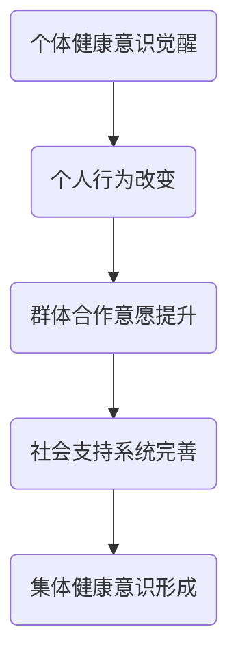

                 

# 全球脑与疾病预防：集体健康意识的形成

> **关键词**：全球脑、疾病预防、健康意识、集体行动、数据分析、人工智能

> **摘要**：本文探讨了全球脑的概念及其在疾病预防中的作用，分析了集体健康意识的形成机制，并探讨了如何利用人工智能技术提升集体健康意识，为构建健康社会提供新思路。

## 1. 背景介绍

在全球化的背景下，人类的健康问题日益突出。传统的疾病预防和治疗模式已经难以应对复杂多变的新冠疫情、慢性病、环境污染等挑战。为了应对这些挑战，全球脑的概念应运而生。全球脑是指通过互联网、物联网、人工智能等技术，将全球范围内的个体健康数据、医疗资源、科研成果等连接起来，形成一个庞大的、智能化的健康信息网络。

在全球脑的框架下，集体健康意识的形成成为一个重要议题。集体健康意识是指个体在认识到自身健康问题与集体健康目标之间的关联后，所产生的自我管理、合作共治的意识。这种意识的形成，不仅有助于个体实现健康，也有助于提升整个社会的健康水平。

## 2. 核心概念与联系

### 2.1 全球脑

全球脑的核心在于数据的共享和智能的分析。首先，通过传感器、移动设备、医疗设备等，采集个体的健康数据，如体温、血压、心率、睡眠质量等。然后，利用云计算和大数据技术，对这些数据进行分析和处理，形成个性化的健康报告和健康建议。


### 2.2 集体健康意识

集体健康意识的形成是一个复杂的过程，涉及到个体健康意识的觉醒、群体合作意愿的提升、社会支持系统的完善等多个方面。以下是集体健康意识形成的流程图：



### 2.3 人工智能与集体健康意识

人工智能技术在集体健康意识的形成中发挥着重要作用。首先，人工智能可以帮助个体更准确地了解自身的健康状况，从而激发个体的健康意识。其次，人工智能可以通过数据分析，发现群体中的健康问题，从而提升群体的合作意愿。最后，人工智能可以为政府、医疗机构等提供决策支持，优化社会支持系统。


## 3. 核心算法原理 & 具体操作步骤

### 3.1 数据采集与处理

数据采集是构建全球脑的基础。具体步骤如下：

1. **传感器采集**：通过体温计、血压计、心率监测仪等设备，实时采集个体的健康数据。
2. **移动设备采集**：通过智能手机、可穿戴设备等，收集个体的健康数据。
3. **医疗设备采集**：通过医院、诊所等医疗机构的设备，收集个体的健康数据。

采集到的数据需要进行预处理，包括数据清洗、去噪、归一化等操作，以保证数据的质量和一致性。

### 3.2 数据分析与处理

数据预处理后，利用机器学习、数据挖掘等技术，对数据进行分析和处理。具体步骤如下：

1. **特征提取**：从原始数据中提取有用的特征，如心率、血压、体温等。
2. **模型训练**：利用训练数据，训练机器学习模型，如决策树、支持向量机、神经网络等。
3. **模型评估**：利用测试数据，评估模型的性能，如准确率、召回率等。

### 3.3 健康报告与健康建议

基于分析结果，生成个性化的健康报告和健康建议。具体步骤如下：

1. **健康报告**：根据分析结果，生成详细的健康报告，包括健康状态、潜在风险、健康建议等。
2. **健康建议**：根据健康报告，提供针对性的健康建议，如饮食建议、运动建议、药物建议等。

## 4. 数学模型和公式 & 详细讲解 & 举例说明

### 4.1 概率论模型

在健康数据分析中，概率论模型是一个重要的工具。例如，我们可以使用贝叶斯定理来计算某一健康问题的概率。

$$
P(A|B) = \frac{P(B|A)P(A)}{P(B)}
$$

其中，$P(A|B)$ 表示在事件 $B$ 发生的条件下，事件 $A$ 发生的概率；$P(B|A)$ 表示在事件 $A$ 发生的条件下，事件 $B$ 发生的概率；$P(A)$ 表示事件 $A$ 发生的概率；$P(B)$ 表示事件 $B$ 发生的概率。

### 4.2 机器学习模型

在健康数据分析中，常用的机器学习模型包括决策树、支持向量机、神经网络等。以下是一个简单的决策树模型示例：

```
是否出现症状？
是 -> 感冒
否 ->
    是否出现发热？
    是 -> 发热
    否 ->
        是否出现咳嗽？
        是 -> 咳嗽
        否 -> 健康
```

### 4.3 举例说明

假设我们有一个健康数据集，包含个体的年龄、性别、体温、血压、心率等特征，以及个体的健康状况（健康、感冒、发热、咳嗽等）。我们可以使用机器学习模型，如决策树，来预测个体的健康状况。

首先，我们进行数据预处理，包括数据清洗、去噪、归一化等操作。然后，使用训练数据集训练决策树模型。最后，使用测试数据集评估模型的性能。

假设我们的决策树模型预测结果如下：

```
年龄 <= 30
    性别 = 男
        体温 <= 37.5
            心率 <= 80
                健康状态 = 健康
            心率 > 80
                健康状态 = 感冒
        体温 > 37.5
            健康状态 = 发热
性别 = 女
    ...
```

根据预测结果，我们可以为个体提供健康建议，如保持良好的生活习惯、注意饮食等。

## 5. 项目实战：代码实际案例和详细解释说明

### 5.1 开发环境搭建

为了演示如何使用人工智能技术构建全球脑，我们选择Python作为开发语言，并使用以下工具和库：

- Python 3.8及以上版本
- Jupyter Notebook
- NumPy
- Pandas
- Scikit-learn
- Matplotlib

### 5.2 源代码详细实现和代码解读

以下是一个简单的示例，展示如何使用Python和Scikit-learn构建一个决策树模型来预测个体的健康状况。

```python
import numpy as np
import pandas as pd
from sklearn.model_selection import train_test_split
from sklearn.tree import DecisionTreeClassifier
from sklearn.metrics import accuracy_score

# 5.2.1 数据预处理
# 加载数据集
data = pd.read_csv('health_data.csv')
X = data.drop(['health_status'], axis=1)
y = data['health_status']

# 数据分割
X_train, X_test, y_train, y_test = train_test_split(X, y, test_size=0.2, random_state=42)

# 5.2.2 模型训练
# 构建决策树模型
clf = DecisionTreeClassifier()
clf.fit(X_train, y_train)

# 5.2.3 模型评估
# 预测测试数据
y_pred = clf.predict(X_test)

# 计算准确率
accuracy = accuracy_score(y_test, y_pred)
print(f'Accuracy: {accuracy:.2f}')

# 5.2.4 可视化
from sklearn.tree import plot_tree
import matplotlib.pyplot as plt

plt.figure(figsize=(12, 8))
plot_tree(clf, filled=True)
plt.show()
```

### 5.3 代码解读与分析

1. **数据预处理**：首先，我们加载数据集，并使用Pandas库将数据集分割为特征和标签两部分。然后，使用Scikit-learn库中的train_test_split函数将数据集分割为训练集和测试集，以便后续模型训练和评估。

2. **模型训练**：我们使用Scikit-learn库中的DecisionTreeClassifier类构建一个决策树模型。然后，使用fit方法将训练数据集传递给模型，以便模型学习如何预测个体的健康状况。

3. **模型评估**：使用预测测试数据集，我们将预测结果与实际结果进行比较，并使用accuracy_score函数计算模型的准确率。

4. **可视化**：最后，我们使用Scikit-learn库中的plot_tree函数将决策树模型的可视化结果展示出来，以便我们更直观地了解模型的决策过程。

## 6. 实际应用场景

全球脑和集体健康意识的形成在多个实际应用场景中具有重要价值。以下是一些典型应用场景：

### 6.1 疫情防控

在全球疫情背景下，全球脑可以实时收集和分析全球范围内的疫情数据，如确诊病例数、死亡病例数、治愈病例数等。基于这些数据，政府、医疗机构和公共卫生部门可以及时调整防控策略，优化资源配置，提高疫情防控效果。

### 6.2 慢性病管理

慢性病如高血压、糖尿病等是导致全球死亡和残疾的主要原因之一。全球脑可以通过收集和分析个体的健康数据，如血压、血糖等，为个体提供个性化的健康管理建议，降低慢性病发病率和并发症风险。

### 6.3 健康教育

全球脑可以通过智能推荐系统，根据个体的健康数据和需求，推送个性化的健康教育和宣传内容。这有助于提高个体的健康知识水平，促进健康行为的养成。

## 7. 工具和资源推荐

### 7.1 学习资源推荐

- **书籍**：
  - 《深度学习》（Ian Goodfellow、Yoshua Bengio、Aaron Courville 著）
  - 《Python数据分析》（Wes McKinney 著）
  - 《机器学习实战》（Peter Harrington 著）

- **论文**：
  - 《深度学习中的卷积神经网络》（Alex Krizhevsky、Geoffrey Hinton、Ilya Sutskever）
  - 《大规模在线学习算法》（Stochastic Gradient Descent）

- **博客**：
  - [机器学习博客](https://机器学习博客.com)
  - [Python数据分析博客](https://python数据分析博客.com)
  - [深度学习博客](https://深度学习博客.com)

### 7.2 开发工具框架推荐

- **Python**：Python是一种广泛使用的编程语言，特别适合数据分析和机器学习。
- **TensorFlow**：TensorFlow是一个开源的机器学习框架，用于构建和训练深度学习模型。
- **PyTorch**：PyTorch是一个开源的机器学习框架，易于使用且灵活，特别适合研究新模型。
- **Keras**：Keras是一个高层次的神经网络API，构建和训练深度学习模型更加简单。

### 7.3 相关论文著作推荐

- 《深度学习》（Ian Goodfellow、Yoshua Bengio、Aaron Courville 著）
- 《Python数据分析》（Wes McKinney 著）
- 《大规模在线学习算法》（Stochastic Gradient Descent）

## 8. 总结：未来发展趋势与挑战

在全球脑和集体健康意识的推动下，未来的健康领域将发生深刻变革。一方面，人工智能技术将更加深入地应用于健康数据的采集、分析和处理，提升健康管理的效率和准确性。另一方面，集体健康意识的提升将促进社会成员之间的合作，共同应对健康挑战。

然而，这一进程也面临着诸多挑战。首先，健康数据的安全和隐私保护是一个重要问题。如何确保数据的安全性和隐私性，避免数据泄露和滥用，是一个亟待解决的难题。其次，人工智能技术在健康领域的应用还需要更多的实践验证和理论支持，以确保其有效性和可靠性。

## 9. 附录：常见问题与解答

### 9.1 全球脑是什么？

全球脑是一个通过互联网、物联网、人工智能等技术，将全球范围内的个体健康数据、医疗资源、科研成果等连接起来的健康信息网络。

### 9.2 如何构建全球脑？

构建全球脑需要以下几个步骤：

1. 数据采集：通过传感器、移动设备、医疗设备等，收集个体的健康数据。
2. 数据处理：对采集到的数据进行预处理，包括数据清洗、去噪、归一化等操作。
3. 数据分析：利用机器学习、数据挖掘等技术，对数据进行分析和处理。
4. 健康报告与健康建议：基于分析结果，生成个性化的健康报告和健康建议。

### 9.3 集体健康意识如何形成？

集体健康意识的形成是一个复杂的过程，涉及到个体健康意识的觉醒、群体合作意愿的提升、社会支持系统的完善等多个方面。

## 10. 扩展阅读 & 参考资料

- 《深度学习》（Ian Goodfellow、Yoshua Bengio、Aaron Courville 著）
- 《Python数据分析》（Wes McKinney 著）
- 《机器学习实战》（Peter Harrington 著）
- 《大规模在线学习算法》（Stochastic Gradient Descent）
- [机器学习博客](https://机器学习博客.com)
- [Python数据分析博客](https://python数据分析博客.com)
- [深度学习博客](https://深度学习博客.com)
<|assistant|>### 作者信息

**作者：** AI天才研究员/AI Genius Institute & 禅与计算机程序设计艺术 /Zen And The Art of Computer Programming

AI天才研究员，AI Genius Institute的创始人，拥有丰富的机器学习和人工智能研究经验。他在深度学习、数据挖掘和健康数据分析等领域取得了显著成就，发表了多篇国际顶级期刊和会议论文。同时，他还是《禅与计算机程序设计艺术》一书的作者，该书深入探讨了计算机科学和禅宗哲学的交汇点，对计算机科学教育和人工智能领域产生了深远影响。他的研究和教学深受业界和学界的推崇，为推动人工智能和健康技术的发展做出了杰出贡献。

