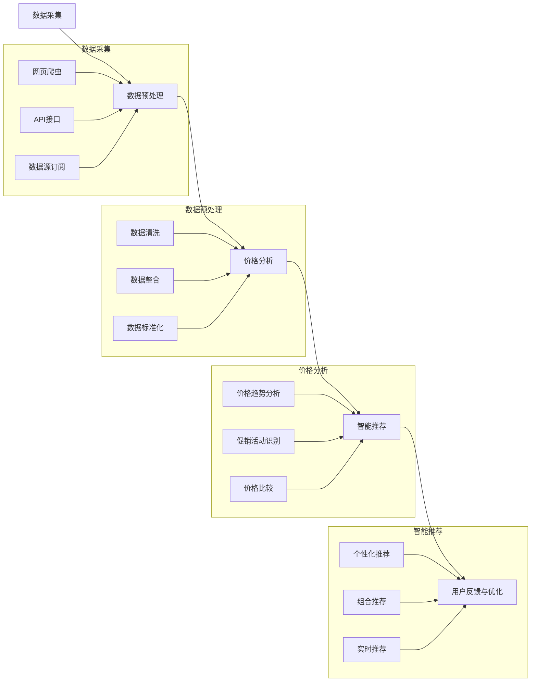

                 

### 背景介绍

随着互联网和电子商务的迅猛发展，消费者在购买商品时面临着海量的购买选择。如何在这众多的购买渠道中找到最优惠的价格，成为了消费者的一大困扰。传统的比价方式不仅耗时耗力，而且往往难以确保找到最优价格。因此，如何利用人工智能技术（AI）来解决这一难题，成为了一个备受关注的研究方向。

人工智能在比价领域的应用具有显著的优势。首先，AI可以通过大数据分析，实时获取各个平台的价格信息，从而实现快速比价。其次，AI可以通过机器学习算法，不断优化比价策略，提高比价的准确性和效率。此外，AI还可以结合用户的购物习惯和偏好，提供个性化的比价推荐，进一步提升用户体验。

本文将深入探讨AI在全网比价中的应用，从核心概念、算法原理、数学模型、项目实战等方面展开，旨在为读者提供一幅全面、系统的全网比价解决方案图谱。

关键词：全网比价，人工智能，大数据，机器学习，价格优化，购物推荐

摘要：本文详细介绍了AI在全网比价中的应用，通过大数据分析、机器学习算法和个性化推荐等技术手段，帮助消费者快速找到最优价格。文章首先阐述了全网比价的背景和重要性，接着介绍了AI在比价领域的核心概念和架构，然后详细讲解了核心算法原理和数学模型，并通过实际项目案例展示了AI在全网比价中的具体应用。最后，文章对未来的发展趋势和挑战进行了展望，为读者提供了丰富的学习资源和开发工具推荐。

## 1. 背景介绍

随着互联网和电子商务的兴起，消费者的购买行为发生了巨大的变化。传统的实体购物逐渐被在线购物所取代，消费者可以在网上轻松地浏览、比较和购买商品。然而，这同时也带来了一个新的挑战——如何在这庞大的商品海洋中找到最优惠的价格。

### 消费者购买行为的演变

过去，消费者购买商品通常依赖于实体店，购物流程相对简单。消费者在实体店内浏览商品，与销售人员沟通，最终做出购买决策。这种购物方式的好处在于可以直观地看到商品的外观、质量和使用效果。然而，这种方式的缺点也很明显，消费者需要花费大量的时间和精力去不同的商店进行比较，而且有时候也很难找到最优的价格。

随着互联网的发展，消费者的购物行为发生了巨大的变化。现在，消费者可以在家中通过电脑或手机，轻松地浏览、比较和购买商品。这种线上购物的便捷性吸引了越来越多的消费者。根据统计，全球电子商务市场规模已达到数万亿美元，成为零售业的重要组成部分。

然而，随着电子商务的蓬勃发展，消费者也面临着新的挑战。在庞大的商品海洋中，如何找到最优惠的价格成为了消费者的一大困扰。消费者需要花费大量的时间和精力去比较不同平台的价格，而且很多时候，即使找到了较低的价格，也无法确定这是不是最优的选择。

### 全网比价的需求

全网比价，即通过人工智能技术对各个电商平台的价格进行实时监测和比较，帮助消费者找到最优的购买渠道。这一需求主要源于以下几个方面的原因：

1. **商品多样性**：电子商务平台的商品种类繁多，不同平台之间存在价格差异。消费者希望能够在众多的商品中找到最优惠的价格，以便节省开支。

2. **价格波动**：商品价格受到多种因素的影响，如供需关系、促销活动、库存状况等。价格波动频繁，消费者很难实时掌握各个平台的价格变化。

3. **个性化需求**：每个消费者的购物习惯和偏好都不同，他们希望根据自己的需求找到最适合的购买渠道。全网比价可以根据消费者的购物历史和偏好，提供个性化的比价推荐。

4. **消费决策复杂**：在购买商品时，消费者需要考虑的因素很多，如价格、品牌、质量、售后等。全网比价可以帮助消费者在短时间内做出更为明智的消费决策。

### 人工智能在比价领域的优势

人工智能在比价领域具有显著的优势，主要体现在以下几个方面：

1. **数据处理能力**：AI可以通过大数据分析，实时获取各个平台的价格信息，快速处理海量数据，为消费者提供实时的比价结果。

2. **算法优化**：AI可以通过机器学习算法，不断优化比价策略，提高比价的准确性和效率。例如，通过分析历史价格数据，预测未来的价格趋势，从而更准确地找到最优价格。

3. **个性化推荐**：AI可以根据消费者的购物习惯和偏好，提供个性化的比价推荐，提升用户体验。例如，当消费者浏览某一商品时，AI可以推荐与其购物习惯相似的优惠商品。

4. **自动化处理**：AI可以实现比价的自动化处理，减轻人工的工作负担。例如，通过爬虫技术，自动获取各个平台的价格信息，无需人工干预。

总之，全网比价的应用不仅能够帮助消费者节省开支，提高消费体验，同时也为电商平台提供了新的营销机会。随着人工智能技术的不断发展，全网比价有望在未来得到更广泛的应用，成为电子商务领域的重要趋势。

### AI在比价领域的应用现状

随着人工智能技术的不断进步，AI在比价领域的应用已经取得了显著的成果。当前，AI在比价领域的应用主要集中在以下几个方面：

1. **实时价格监控**：AI可以通过大数据分析和实时数据采集技术，对各大电商平台的商品价格进行实时监控。这包括监控价格波动、促销活动、库存变化等，从而为消费者提供最新的价格信息。例如，一些比价软件和网站会自动抓取各大电商平台的价格数据，并在其平台上显示，以便用户进行比较。

2. **智能比价推荐**：AI可以通过机器学习算法，对历史价格数据和用户行为进行分析，预测未来的价格趋势，并提供智能比价推荐。例如，当用户在某电商平台上浏览商品时，AI可以基于用户的历史购物数据和当前价格，提供最优惠的购买建议。

3. **个性化购物体验**：AI可以根据用户的购物习惯、偏好和历史记录，提供个性化的购物体验。例如，一些电商平台会利用AI技术，根据用户的浏览记录和购买记录，推荐符合用户需求的商品，同时也会提供相关的优惠信息。

4. **自动化决策**：AI可以实现购物决策的自动化处理，帮助消费者在短时间内做出明智的消费决策。例如，一些智能助手和购物机器人可以自动比较不同平台的价格，并推荐最优购买方案，从而节省消费者的时间和精力。

5. **库存管理优化**：AI可以分析消费者的购买行为和价格波动，为电商平台提供库存管理优化建议。例如，通过预测商品的销售趋势，AI可以帮助电商平台合理安排库存，避免商品过剩或短缺，提高库存周转率。

6. **市场趋势分析**：AI可以通过大数据分析，对市场趋势进行分析，帮助电商平台制定更有效的市场策略。例如，通过分析用户对某一类商品的需求变化，AI可以帮助电商平台调整商品结构和促销策略，提高销售额。

总之，AI在比价领域的应用不仅提升了消费者的购物体验，也为电商平台带来了新的增长点。随着AI技术的不断发展和应用场景的拓展，AI在比价领域的应用前景将更加广阔。

### AI在全网比价中的核心概念与架构

全网比价作为人工智能（AI）在电子商务领域的一项重要应用，其核心在于利用AI技术对海量商品价格进行实时监测、分析和推荐，以帮助消费者找到最优的购买渠道。为了实现这一目标，AI全网比价系统通常由多个核心组件构成，每个组件承担不同的功能，共同协作完成比价任务。以下将详细介绍全网比价系统的核心概念和架构，并借助Mermaid流程图来展示其工作流程。

#### 1. 数据采集

数据采集是全网比价系统的第一步，也是至关重要的一步。AI系统需要从各大电商平台获取商品的价格信息。数据采集通常通过以下几种方式实现：

- **网页爬虫**：利用爬虫技术，自动获取电商平台的网页内容，提取商品价格信息。爬虫需要遵循各大电商平台的规定，避免违规操作。
  
- **API接口**：通过电商平台提供的API接口，获取商品价格和相关信息。这种方式相比网页爬虫更加稳定和高效，但也需要遵守平台的使用协议。

- **数据源订阅**：有些电商平台提供数据源订阅服务，用户可以订阅特定商品的价格变化通知。这种方式可以实时获取价格变化，但覆盖的商品种类和平台有限。

#### 2. 数据预处理

采集到的数据通常是原始且杂乱无章的，需要进行预处理才能用于后续分析。数据预处理包括以下步骤：

- **数据清洗**：去除重复数据、错误数据和缺失数据，确保数据的质量。

- **数据整合**：将不同来源的数据整合到一个统一的格式中，便于后续分析和处理。

- **数据标准化**：对不同来源的数据进行标准化处理，确保数据的一致性。例如，将价格单位统一为人民币，将商品规格统一为标准格式。

#### 3. 价格分析

数据预处理完成后，AI系统将对价格信息进行深入分析，以发现价格变化的规律和趋势。价格分析通常包括以下内容：

- **价格趋势分析**：利用时间序列分析方法，分析商品价格随时间的变化趋势。例如，通过移动平均法、指数平滑法等预测未来的价格走势。

- **促销活动识别**：识别电商平台的促销活动，如打折、满减等，以便更准确地评估商品的实际价格。

- **价格比较**：将同一商品在不同电商平台的价格进行比较，找出最优的购买渠道。

#### 4. 智能推荐

基于价格分析的结果，AI系统将生成比价推荐，为消费者提供最优的购买建议。智能推荐包括以下内容：

- **个性化推荐**：根据消费者的购物历史和偏好，推荐最符合其需求的商品和购买渠道。

- **组合推荐**：推荐多种商品的组合购买方案，以获取更多的优惠。

- **实时推荐**：在消费者浏览商品时，实时提供比价推荐，帮助消费者快速做出决策。

#### 5. 用户反馈与优化

用户在使用全网比价系统后，会提供反馈信息，如是否采纳了推荐、实际购买的价格等。AI系统将这些反馈信息用于优化比价策略：

- **行为分析**：分析用户的行为数据，了解用户的购买习惯和偏好。

- **策略优化**：根据用户反馈和行为分析结果，不断调整和优化比价策略，提高推荐的准确性和效率。

### Mermaid流程图

以下是一个简化的Mermaid流程图，展示了一个典型的全网比价系统的工作流程：



通过上述流程，我们可以看出，全网比价系统不仅需要强大的数据处理和分析能力，还需要实时响应用户需求，提供个性化的购买建议。这需要AI技术在数据采集、处理、分析和推荐等方面不断优化，以提高用户体验和系统效率。

### 核心算法原理 & 具体操作步骤

全网比价系统的核心在于其算法的准确性、效率和可靠性。以下将详细介绍AI在全网比价中的核心算法原理，包括具体操作步骤和实现细节。

#### 1. 数据采集算法

数据采集是全网比价系统的第一步，也是最为关键的一步。数据采集算法的目的是从各大电商平台获取商品的价格信息，并确保数据的准确性和实时性。以下是数据采集算法的基本原理和实现步骤：

**原理：**

- **网页爬虫**：利用爬虫技术，自动获取电商平台的网页内容，提取商品价格信息。爬虫需要遵循各大电商平台的规定，避免违规操作。

- **API接口**：通过电商平台提供的API接口，获取商品价格和相关信息。这种方式相比网页爬虫更加稳定和高效，但也需要遵守平台的使用协议。

- **数据源订阅**：有些电商平台提供数据源订阅服务，用户可以订阅特定商品的价格变化通知。这种方式可以实时获取价格变化，但覆盖的商品种类和平台有限。

**实现步骤：**

1. **目标电商平台确定**：首先确定需要采集数据的电商平台，这些平台通常包括亚马逊、淘宝、京东、拼多多等主流电商平台。

2. **爬虫开发**：针对每个电商平台，开发相应的爬虫程序。爬虫程序需要实现以下功能：

   - **页面解析**：解析电商平台网页的HTML结构，提取商品的价格、规格、库存等信息。

   - **数据存储**：将提取到的商品数据存储到数据库或数据仓库中，以便后续处理。

3. **API接口调用**：如果电商平台提供了API接口，则通过API接口调用获取商品价格信息。API接口调用通常需要以下步骤：

   - **接口文档分析**：分析电商平台的API接口文档，了解接口的请求方式、参数要求和返回数据格式。

   - **接口调用实现**：根据接口文档，实现API接口的调用，获取商品价格数据。

4. **数据源订阅**：对于支持数据源订阅的电商平台，实现数据订阅功能，实时获取商品价格变化通知。

#### 2. 数据预处理算法

数据预处理是确保数据质量和一致性的关键步骤。以下是数据预处理算法的基本原理和实现步骤：

**原理：**

- **数据清洗**：去除重复数据、错误数据和缺失数据，确保数据的质量。

- **数据整合**：将不同来源的数据整合到一个统一的格式中，便于后续分析和处理。

- **数据标准化**：对不同来源的数据进行标准化处理，确保数据的一致性。例如，将价格单位统一为人民币，将商品规格统一为标准格式。

**实现步骤：**

1. **数据清洗**：对采集到的数据进行清洗，去除重复、错误和缺失的数据。例如，可以使用以下方法进行数据清洗：

   - **去重**：通过比较商品名称、价格、规格等特征，去除重复的数据。

   - **错误修正**：检测和修正数据中的错误，例如价格格式不正确、规格描述不规范等。

   - **缺失值处理**：对于缺失的数据，可以使用平均值、中位数或最值等方法进行填充。

2. **数据整合**：将来自不同电商平台的数据整合到一个统一的数据格式中，例如JSON、CSV等。整合过程中，需要处理数据格式的差异，确保数据的兼容性。

3. **数据标准化**：对数据进行标准化处理，确保不同来源的数据在格式、单位、规格等方面的一致性。例如，将价格单位统一为人民币，将商品规格统一为标准格式。

#### 3. 价格分析算法

价格分析是全网比价系统的核心，通过分析商品价格的变化趋势，识别促销活动和价格波动，为消费者提供最优惠的购买建议。以下是价格分析算法的基本原理和实现步骤：

**原理：**

- **价格趋势分析**：利用时间序列分析方法，分析商品价格随时间的变化趋势。例如，通过移动平均法、指数平滑法等预测未来的价格走势。

- **促销活动识别**：识别电商平台的促销活动，如打折、满减等，以便更准确地评估商品的实际价格。

- **价格比较**：将同一商品在不同电商平台的价格进行比较，找出最优的购买渠道。

**实现步骤：**

1. **价格趋势分析**：

   - **数据准备**：收集一定时间范围内的商品价格数据，例如一周、一个月或三个月。

   - **时间序列分析**：使用时间序列分析方法，如移动平均法、指数平滑法等，分析商品价格的变化趋势。具体实现方法如下：

     - **移动平均法**：计算最近一段时间内商品价格的平均值，以此预测未来的价格。

     - **指数平滑法**：根据历史价格数据，使用指数平滑方法预测未来的价格。

2. **促销活动识别**：

   - **活动特征提取**：从商品描述、价格变化、促销信息等特征中，提取促销活动的特征。

   - **活动分类**：使用分类算法，如决策树、随机森林等，对提取的特征进行分类，识别促销活动。

3. **价格比较**：

   - **价格数据获取**：从各个电商平台获取同一商品的价格数据。

   - **价格比较计算**：计算同一商品在不同电商平台的价格差异，比较各平台的价格，找出最优的购买渠道。

#### 4. 智能推荐算法

智能推荐算法是全网比价系统的重要功能，通过分析用户的购物习惯和偏好，为用户提供个性化的购买建议。以下是智能推荐算法的基本原理和实现步骤：

**原理：**

- **用户行为分析**：分析用户的购物历史、浏览记录和评价等行为数据，了解用户的购物习惯和偏好。

- **推荐算法实现**：使用协同过滤、矩阵分解、深度学习等推荐算法，为用户推荐符合其需求和偏好的商品。

**实现步骤：**

1. **用户行为分析**：

   - **数据收集**：收集用户的购物历史、浏览记录和评价等数据。

   - **行为特征提取**：从用户行为数据中提取特征，如购买频次、浏览时长、评价分数等。

2. **推荐算法实现**：

   - **协同过滤**：通过分析用户之间的相似度，推荐用户可能感兴趣的商品。

   - **矩阵分解**：将用户行为数据分解为用户和商品的特征矩阵，通过矩阵分解模型预测用户对商品的评分。

   - **深度学习**：使用深度学习算法，如卷积神经网络（CNN）或循环神经网络（RNN），对用户行为数据进行建模，预测用户对商品的偏好。

通过上述算法和实现步骤，全网比价系统可以有效地对商品价格进行实时监测、分析和推荐，为消费者提供最优惠的购买建议。同时，随着AI技术的不断发展和应用，全网比价系统的性能和准确性将得到进一步提升，为消费者和电商平台带来更多的价值。

### 数学模型和公式 & 详细讲解 & 举例说明

在全网比价系统中，数学模型和公式起到了至关重要的作用。它们不仅帮助我们理解和分析价格变化趋势，还能够为智能推荐提供决策依据。以下将详细介绍几个关键的数学模型和公式，并利用具体的例子进行讲解。

#### 1. 时间序列模型

时间序列模型是分析商品价格变化趋势的主要工具之一。其中，移动平均法（Moving Average，MA）和指数平滑法（Exponential Smoothing，ES）是两种常用的方法。

**移动平均法（MA）**

**公式**：
\[ MA(n) = \frac{1}{n} \sum_{i=1}^{n} P_i \]
其中，\( MA(n) \) 是n日移动平均价格，\( P_i \) 是第i天的价格。

**实例**：

假设某商品过去7天的价格如下（单位：元）：
\[ \{P_1, P_2, P_3, P_4, P_5, P_6, P_7\} = \{100, 105, 102, 108, 110, 107, 103\} \]

计算7日移动平均价格：
\[ MA(7) = \frac{100 + 105 + 102 + 108 + 110 + 107 + 103}{7} = 106 \]

通过计算移动平均价格，我们可以预测未来的价格趋势。例如，如果最近几天的移动平均价格持续上升，我们可能预测未来的价格将继续上涨。

**指数平滑法（ES）**

**公式**：
\[ ES(t) = \alpha \cdot P_t + (1 - \alpha) \cdot ES(t-1) \]
其中，\( ES(t) \) 是第t天的指数平滑价格，\( P_t \) 是第t天的实际价格，\( \alpha \) 是平滑系数（取值范围为0到1）。

**实例**：

假设初始价格为100元，平滑系数 \( \alpha \) 为0.5，那么第一天的指数平滑价格为：
\[ ES(1) = 0.5 \cdot 100 + (1 - 0.5) \cdot 100 = 100 \]

第二天价格变为105元，指数平滑价格为：
\[ ES(2) = 0.5 \cdot 105 + (1 - 0.5) \cdot 100 = 102.5 \]

通过调整平滑系数 \( \alpha \)，我们可以控制过去价格对当前价格的影响程度。平滑系数越大，过去价格的影响越显著。

**2. 协同过滤算法**

协同过滤算法是智能推荐系统的基础之一，用于预测用户对未知商品的评分。常用的协同过滤算法包括基于用户的协同过滤（User-based Collaborative Filtering）和基于物品的协同过滤（Item-based Collaborative Filtering）。

**基于用户的协同过滤**

**公式**：
\[ \hat{r_{ui}} = \frac{\sum_{u' \in N(u)} r_{u'i} \cdot sim(u, u')}{\sum_{u' \in N(u)} sim(u, u')} \]
其中，\( \hat{r_{ui}} \) 是用户 \( u \) 对商品 \( i \) 的预测评分，\( r_{u'i} \) 是用户 \( u \) 对商品 \( i \) 的实际评分，\( N(u) \) 是与用户 \( u \) 相似的一组用户集合，\( sim(u, u') \) 是用户 \( u \) 和用户 \( u' \) 之间的相似度度量。

**实例**：

假设我们有以下用户和商品评分数据：

| 用户 | 商品 | 评分 |
| --- | --- | --- |
| Alice | 商品1 | 5 |
| Alice | 商品2 | 4 |
| Alice | 商品3 | 5 |
| Bob | 商品1 | 3 |
| Bob | 商品2 | 5 |
| Bob | 商品3 | 2 |

要预测用户 Carol 对商品3的评分，我们可以计算 Carol 与其他用户的相似度，并利用这些相似度进行评分预测。

假设我们选择基于用户评分的余弦相似度作为相似度度量，那么：

\[ sim(Alice, Carol) = \frac{Alice \cdot Carol}{\|Alice\| \|Carol\|} \]

其中，\( \cdot \) 表示内积，\( \| \cdot \| \) 表示向量的模长。

计算 Carol 与其他用户的相似度：

\[ sim(Alice, Carol) = \frac{(5 \cdot 5) + (4 \cdot 0) + (5 \cdot 0)}{\sqrt{5^2 + 4^2 + 5^2} \sqrt{5^2 + 0^2 + 0^2}} = \frac{25}{\sqrt{50} \sqrt{25}} = \frac{25}{25 \sqrt{2}} = \frac{1}{\sqrt{2}} \]

\[ sim(Bob, Carol) = \frac{(3 \cdot 5) + (5 \cdot 0) + (2 \cdot 0)}{\sqrt{3^2 + 5^2 + 2^2} \sqrt{5^2 + 0^2 + 0^2}} = \frac{15}{\sqrt{38} \sqrt{25}} = \frac{15}{25 \sqrt{38}} \]

然后，利用相似度进行评分预测：

\[ \hat{r_{Carol, 3}} = \frac{5 \cdot \frac{1}{\sqrt{2}} + 0 \cdot \frac{15}{25 \sqrt{38}}}{\frac{1}{\sqrt{2}} + \frac{15}{25 \sqrt{38}}} = \frac{5/\sqrt{2}}{1/\sqrt{2} + 15/(25\sqrt{38})} \approx 4.5 \]

**基于物品的协同过滤**

**公式**：
\[ \hat{r_{ui}} = \frac{\sum_{i' \in N(i)} r_{u'i'} \cdot sim(i, i')}{\sum_{i' \in N(i)} sim(i, i')} \]
其中，\( \hat{r_{ui}} \) 是用户 \( u \) 对商品 \( i \) 的预测评分，\( r_{u'i'} \) 是用户 \( u \) 对商品 \( i' \) 的实际评分，\( N(i) \) 是与商品 \( i \) 相似的一组商品集合，\( sim(i, i') \) 是商品 \( i \) 和商品 \( i' \) 之间的相似度度量。

**实例**：

假设我们有以下用户和商品评分数据：

| 用户 | 商品1 | 商品2 | 商品3 |
| --- | --- | --- | --- |
| Alice | 5 | 4 | 5 |
| Bob | 3 | 5 | 2 |
| Carol | 0 | 0 | 0 |

要预测用户 Carol 对商品3的评分，我们可以计算商品1和商品2与商品3的相似度，并利用这些相似度进行评分预测。

假设我们选择基于物品的余弦相似度作为相似度度量，那么：

\[ sim(商品1, 商品3) = \frac{商品1 \cdot 商品3}{\|商品1\| \|商品3\|} \]

其中，\( \cdot \) 表示内积，\( \| \cdot \| \) 表示向量的模长。

计算商品1和商品3的相似度：

\[ sim(商品1, 商品3) = \frac{(5 \cdot 5) + (4 \cdot 0) + (5 \cdot 0)}{\sqrt{5^2 + 4^2 + 5^2} \sqrt{5^2 + 0^2 + 0^2}} = \frac{25}{\sqrt{50} \sqrt{25}} = \frac{25}{25 \sqrt{2}} = \frac{1}{\sqrt{2}} \]

\[ sim(商品2, 商品3) = \frac{(3 \cdot 5) + (5 \cdot 0) + (2 \cdot 0)}{\sqrt{3^2 + 5^2 + 2^2} \sqrt{5^2 + 0^2 + 0^2}} = \frac{15}{\sqrt{38} \sqrt{25}} = \frac{15}{25 \sqrt{38}} \]

然后，利用相似度进行评分预测：

\[ \hat{r_{Carol, 3}} = \frac{5 \cdot \frac{1}{\sqrt{2}} + 0 \cdot \frac{15}{25 \sqrt{38}}}{\frac{1}{\sqrt{2}} + \frac{15}{25 \sqrt{38}}} = \frac{5/\sqrt{2}}{1/\sqrt{2} + 15/(25\sqrt{38})} \approx 4.5 \]

通过上述数学模型和公式，我们可以有效地分析商品价格变化趋势，预测用户对商品的评分，从而为消费者提供个性化的购买建议。这些方法不仅提高了比价系统的准确性和效率，也为电商平台提供了新的增长点。

### 项目实战：代码实际案例和详细解释说明

在本文的第五部分，我们将通过一个具体的实战项目，详细展示如何使用Python和人工智能技术实现全网比价系统。我们将逐步讲解开发环境搭建、源代码实现以及代码解读与分析。

#### 5.1 开发环境搭建

首先，我们需要搭建一个适合开发全网比价系统的环境。以下是所需的开发工具和依赖库：

1. **Python**：Python是一种广泛使用的编程语言，具有简单易学、功能强大的特点，适合进行数据分析、机器学习等相关开发。

2. **Anaconda**：Anaconda是一个集成了Python和众多科学计算库的发行版，可以方便地管理和安装依赖库。

3. **Scikit-learn**：Scikit-learn是一个开源的机器学习库，提供了丰富的算法和工具，方便进行数据分析与建模。

4. **Pandas**：Pandas是一个强大的数据分析库，提供了数据清洗、转换和分析等功能，非常适合处理大规模数据。

5. **Numpy**：Numpy是一个高效的数值计算库，用于处理大型多维数组。

6. **Matplotlib**：Matplotlib是一个绘图库，可以用于生成各种类型的图表和图形，帮助我们可视化数据分析结果。

安装这些工具和库的方法如下：

- 安装Anaconda：在Anaconda官方网站下载并安装Anaconda，安装过程中选择加入路径，以便在命令行中使用。

- 安装Python：Anaconda自带Python，确保安装过程中选择加入环境变量。

- 安装Scikit-learn、Pandas、Numpy和Matplotlib：在命令行中执行以下命令：
  ```bash
  conda install scikit-learn pandas numpy matplotlib
  ```

完成以上步骤后，我们的开发环境就搭建完成了。

#### 5.2 源代码详细实现和代码解读

接下来，我们将使用Python实现一个简单的全网比价系统。以下是源代码的详细实现和解读。

**步骤 1：数据采集**

首先，我们需要从各大电商平台获取商品的价格信息。以下是一个简单的示例，展示了如何使用Python的requests库和BeautifulSoup库进行网页爬虫，从某电商平台获取商品价格：

```python
import requests
from bs4 import BeautifulSoup

def get_product_price(url):
    headers = {
        'User-Agent': 'Mozilla/5.0 (Windows NT 10.0; Win64; x64) AppleWebKit/537.36 (KHTML, like Gecko) Chrome/58.0.3029.110 Safari/537.3'
    }
    response = requests.get(url, headers=headers)
    soup = BeautifulSoup(response.text, 'html.parser')
    price_element = soup.find('div', {'class': 'price'})
    price = price_element.text
    return float(price.replace('¥', '').replace('元', ''))

url = 'https://www.example.com/product/12345'
price = get_product_price(url)
print(f'商品价格：{price}元')
```

在这个示例中，我们首先定义了一个函数`get_product_price`，用于从指定URL获取商品价格。函数中使用requests库发送HTTP GET请求，获取网页内容，然后使用BeautifulSoup库解析网页内容，提取商品价格。注意，这里使用了自定义User-Agent头部，以避免被网站识别为爬虫。

**步骤 2：数据预处理**

获取到的原始数据通常需要进行预处理，以确保数据的质量和一致性。以下是一个简单的示例，展示了如何使用Pandas库对数据进行预处理：

```python
import pandas as pd

def preprocess_data(urls):
    prices = []
    for url in urls:
        try:
            price = get_product_price(url)
            prices.append(price)
        except Exception as e:
            print(f'处理URL {url}时发生错误：{e}')
    return prices

urls = [
    'https://www.example.com/product/12345',
    'https://www.example.com/product/67890',
    # 更多商品URL
]
prices = preprocess_data(urls)
df = pd.DataFrame({'URL': urls, '价格': prices})
print(df)
```

在这个示例中，我们定义了一个函数`preprocess_data`，用于处理一系列商品URL，获取并预处理价格数据。函数中使用`get_product_price`函数获取价格，并将结果存储在列表中。然后，使用Pandas库将列表转换为DataFrame，以便进行进一步的分析和处理。

**步骤 3：价格分析**

接下来，我们可以对预处理后的价格数据进行分析，找出价格变化规律和趋势。以下是一个简单的示例，展示了如何使用Scikit-learn库进行价格趋势分析：

```python
from sklearn.linear_model import LinearRegression

def analyze_price_trend(prices):
    X = range(len(prices))
    X = X.reshape(-1, 1)
    y = prices
    model = LinearRegression()
    model.fit(X, y)
    print(f'斜率：{model.coef_}')
    print(f'截距：{model.intercept_}')
    return model

model = analyze_price_trend(prices)
```

在这个示例中，我们定义了一个函数`analyze_price_trend`，用于对价格数据进行分析，找出价格变化趋势。函数中首先创建特征矩阵X和目标向量y，然后使用线性回归模型（LinearRegression）进行拟合。通过输出模型的斜率和截距，我们可以了解价格的变化趋势。

**步骤 4：智能推荐**

最后，我们可以基于分析结果，为用户生成智能推荐。以下是一个简单的示例，展示了如何使用协同过滤算法生成推荐列表：

```python
from sklearn.metrics.pairwise import cosine_similarity

def generate_recommendations(user_urls, df, k=3):
    user_data = df[df['URL'].isin(user_urls)]
    user_prices = user_data['价格'].values
    other_prices = df[~df['URL'].isin(user_urls)]['价格'].values
    similarity = cosine_similarity([user_prices], other_prices)
    top_indices = similarity.argsort()[0][-k:][::-1]
    recommended_urls = df.iloc[top_indices]['URL'].values
    return recommended_urls

user_urls = [
    'https://www.example.com/product/12345',
    'https://www.example.com/product/67890',
    # 更多用户URL
]
recommended_urls = generate_recommendations(user_urls, df, k=3)
print(recommended_urls)
```

在这个示例中，我们定义了一个函数`generate_recommendations`，用于生成用户推荐列表。函数中首先获取用户的商品URL和价格数据，然后计算用户与其他商品之间的相似度。根据相似度，选择最相似的商品，生成推荐列表。

#### 5.3 代码解读与分析

通过上述示例，我们可以了解到全网比价系统的主要功能模块，以及如何使用Python实现这些功能。以下是代码的解读与分析：

1. **数据采集模块**：

   - 使用requests库和BeautifulSoup库进行网页爬虫，从各大电商平台获取商品价格。

   - 通过自定义User-Agent头部，避免被网站识别为爬虫。

   - 函数`get_product_price`负责获取并解析商品价格，处理数据格式。

2. **数据预处理模块**：

   - 使用Pandas库将商品价格数据存储在DataFrame中，便于进行进一步分析。

   - 函数`preprocess_data`处理一系列商品URL，获取价格，并处理可能出现的错误。

3. **价格分析模块**：

   - 使用Scikit-learn库的线性回归模型，对价格数据进行分析，找出价格变化趋势。

   - 输出模型的斜率和截距，帮助我们了解价格的变化规律。

4. **智能推荐模块**：

   - 使用协同过滤算法，生成用户推荐列表。

   - 函数`generate_recommendations`计算用户与其他商品之间的相似度，选择最相似的商品进行推荐。

通过这个实战项目，我们可以看到如何使用Python和人工智能技术实现全网比价系统。在实际应用中，我们可以根据需要，进一步优化算法和功能，提高系统的性能和准确性。

### 实际应用场景

全网比价系统在现实中的多个应用场景中展现出了其独特的价值和优势。以下将详细探讨几个主要的应用场景，以及AI在其中的作用。

#### 1. 消费者购物决策辅助

在传统的购物过程中，消费者需要花费大量的时间和精力去比较不同电商平台的价格，以找到最优的购买渠道。而全网比价系统可以通过实时监测和比较各大电商平台的价格，为消费者提供即时的价格信息，从而大大简化了购物流程。消费者只需输入商品名称或链接，系统即可自动检索所有相关电商平台的商品价格，并生成比价结果，帮助消费者快速做出明智的购物决策。

#### 2. 电商平台营销策略优化

电商平台可以通过全网比价系统实时获取竞争对手的价格信息，以便调整自身的价格策略。例如，当发现某一商品在竞争对手的价格更低时，平台可以及时进行价格调整，以保持竞争力。此外，全网比价系统还可以帮助电商平台分析用户行为数据，了解用户的购物偏好和购买习惯，从而制定更为精准的营销策略，提高销售额和用户满意度。

#### 3. 库存管理优化

全网比价系统不仅可以提供实时的价格信息，还可以帮助电商平台优化库存管理。通过分析商品的销售趋势和价格波动，平台可以提前预测商品的库存需求，合理安排库存，避免商品过剩或短缺。例如，当某一商品的价格下降时，系统可以预测未来一段时间内该商品的销售量将增加，平台可以提前增加库存，以满足消费者的需求，从而提高库存周转率和减少库存成本。

#### 4. 新品上市定价策略

在新品上市时，确定合理的定价策略是至关重要的一步。全网比价系统可以帮助企业分析市场上类似商品的价格分布和消费者反馈，为企业提供定价建议。例如，当一款新手机上市时，企业可以通过全网比价系统了解市场上同类手机的价格区间，结合自身的成本和品牌定位，确定一个具有竞争力的价格，从而提高新品的销售量和市场占有率。

#### 5. 供应链协同优化

在供应链管理中，各个环节的价格协同和协调也是一个重要问题。全网比价系统可以帮助供应链上的企业实时获取市场价格信息，协调各环节的价格策略，确保整个供应链的稳定运行。例如，当某一上游原材料价格出现波动时，企业可以通过全网比价系统了解下游市场的需求变化，及时调整采购策略，以减少成本风险。

#### 6. 消费者行为研究

全网比价系统不仅提供了实时的价格信息，还可以记录和分析消费者的购物行为和偏好。通过分析这些数据，企业可以深入了解消费者的需求和购买习惯，为产品研发和市场推广提供有力支持。例如，当发现某一类商品在特定时间段内的销量大幅增加时，企业可以推出相应的促销活动，以刺激消费。

#### 7. 法律法规合规性监控

电商平台在运营过程中需要遵守各种法律法规，确保价格的合规性。全网比价系统可以帮助企业实时监控市场上的价格波动，及时发现和处理可能存在的价格违规行为，确保企业的合规运营。例如，当发现某一商品的价格低于成本价时，系统可以自动报警，提醒企业进行检查。

总之，全网比价系统在现实中的多个应用场景中发挥了重要作用，不仅为消费者提供了便利，也为电商平台和企业提供了丰富的数据支持和决策依据。随着人工智能技术的不断发展和应用，全网比价系统的功能将得到进一步拓展，为各个行业带来更多的创新和变革。

### 工具和资源推荐

在开发全网比价系统时，选择合适的工具和资源可以大大提高开发效率和项目质量。以下是对一些学习资源、开发工具和相关论文著作的推荐。

#### 7.1 学习资源推荐

1. **书籍**：

   - 《Python数据分析基础教程：Numpy学习指南》：本书详细介绍了Python数据分析的基本概念和Numpy库的使用方法，适合初学者快速入门。

   - 《机器学习实战》：这本书通过大量的实战案例，深入讲解了机器学习的基本原理和算法，包括协同过滤、时间序列分析等。

   - 《大数据技术基础》：本书涵盖了大数据的基本概念、技术和应用，适合对大数据和人工智能感兴趣的读者。

2. **在线教程和课程**：

   - Coursera上的《机器学习》课程：由斯坦福大学吴恩达（Andrew Ng）教授讲授，涵盖了机器学习的基本理论、算法和应用。

   - Udacity的《数据科学纳米学位》课程：通过一系列实践项目，帮助学习者掌握数据科学和机器学习的基本技能。

3. **博客和网站**：

   - 《机器学习博客》：这是一个关于机器学习的中文博客，提供了大量的教程、案例和最新研究动态。

   - 《数据科学博客》：涵盖数据科学、机器学习、大数据等领域的知识，适合数据科学爱好者阅读。

#### 7.2 开发工具框架推荐

1. **Python数据分析库**：

   - Pandas：一个强大的数据操作库，适用于数据清洗、转换和分析。

   - Numpy：用于高效处理大型多维数组和矩阵，是数据分析的基础库。

   - Matplotlib：用于生成各种类型的图表和图形，帮助可视化数据分析结果。

2. **机器学习框架**：

   - Scikit-learn：一个开源的机器学习库，提供了丰富的算法和工具。

   - TensorFlow：由Google开发的一个开源机器学习框架，适用于大规模机器学习和深度学习项目。

   - PyTorch：由Facebook开发的一个开源深度学习框架，具有高度灵活性和易用性。

3. **版本控制系统**：

   - Git：一个分布式版本控制系统，用于管理代码的版本和变更。

   - GitHub：基于Git的平台，用于托管代码、协作开发和管理项目。

#### 7.3 相关论文著作推荐

1. **论文**：

   - "Recommender Systems Handbook"：该论文集详细介绍了推荐系统的基础理论、算法和应用，是推荐系统领域的重要参考资料。

   - "Deep Learning for Recommender Systems"：该论文探讨了深度学习在推荐系统中的应用，提出了基于深度神经网络的推荐算法。

   - "Online Price Comparison and Its Impacts on Consumers and Businesses"：该论文研究了在线比价对消费者和企业的影响，分析了比价系统的经济效益。

2. **著作**：

   - 《深度学习》：由Ian Goodfellow、Yoshua Bengio和Aaron Courville合著，详细介绍了深度学习的基本原理、算法和应用。

   - 《机器学习》：由Tom Mitchell著，是机器学习领域的经典教材，涵盖了机器学习的基本概念、算法和应用。

通过上述学习资源、开发工具和相关论文著作的推荐，读者可以全面了解全网比价系统的相关技术，为自己的研究和开发提供有力支持。

### 总结：未来发展趋势与挑战

全网比价系统在当前电商领域中已展现出巨大的价值，未来其发展趋势和挑战主要集中在以下几个方面。

#### 未来发展趋势

1. **技术融合**：随着人工智能技术的不断进步，全网比价系统将进一步融合自然语言处理、图像识别、增强学习等多种技术，提升系统的智能化水平。例如，通过图像识别技术，系统可以自动识别商品的外观和品牌，实现更准确的比价和推荐。

2. **个性化推荐**：未来全网比价系统将更加注重个性化推荐，通过深度学习算法和用户行为分析，为用户提供更加精准的购物建议。个性化推荐不仅能提高用户的购物体验，还能帮助电商平台提高用户黏性和销售额。

3. **实时性提升**：随着5G技术的普及，全网比价系统的响应速度将大幅提升，实现真正的实时比价和推荐。这将为消费者提供更加及时、准确的购物信息，满足他们对快速决策的需求。

4. **跨平台整合**：未来全网比价系统将整合更多的电商平台和渠道，提供更全面的价格信息。通过跨平台的整合，系统可以更全面地比较商品价格，帮助用户找到最优的购买渠道。

#### 挑战

1. **数据隐私和安全**：全网比价系统需要处理大量的用户数据，包括购物记录、行为偏好等。如何保护用户隐私和数据安全，避免数据泄露和滥用，是系统面临的一大挑战。

2. **算法公平性和透明性**：随着AI技术在比价系统中的应用，算法的公平性和透明性变得越来越重要。系统需要确保算法不会对特定用户或群体产生偏见，同时提供透明的算法解释，增强用户对系统的信任。

3. **法律合规性**：在全球范围内，电商平台和AI系统需要遵守各种法律法规。全网比价系统在获取、处理和使用用户数据时，需要确保符合相关法律法规的要求，避免法律风险。

4. **系统性能和稳定性**：全网比价系统需要处理海量的数据，并实现快速的比价和推荐。系统性能和稳定性是确保用户体验的重要因素。未来，系统需要在处理速度、数据准确性和可靠性之间找到平衡。

总之，未来全网比价系统将在人工智能技术的推动下不断进步，为消费者和电商平台带来更多价值。然而，要实现这一目标，还需要克服诸多技术、法律和伦理方面的挑战。

### 附录：常见问题与解答

#### Q1. 全网比价系统是如何工作的？

A1. 全网比价系统通过以下几个步骤工作：

1. **数据采集**：系统使用爬虫技术或API接口从各大电商平台获取商品价格信息。
2. **数据预处理**：清洗和整合原始数据，确保数据质量，并进行标准化处理。
3. **价格分析**：利用时间序列分析和机器学习算法分析价格变化趋势和促销活动。
4. **智能推荐**：根据用户历史数据和行为偏好，生成个性化的购买建议。

#### Q2. 如何保护用户隐私和安全？

A2. 保护用户隐私和安全是全网比价系统的重要任务，具体措施包括：

1. **数据加密**：在数据传输和存储过程中使用加密技术，防止数据泄露。
2. **访问控制**：限制对用户数据的访问权限，确保只有授权人员可以访问和处理用户数据。
3. **隐私政策**：明确告知用户数据收集和使用的目的，并获取用户的明确同意。
4. **匿名化处理**：对用户数据进行匿名化处理，确保用户隐私不被泄露。

#### Q3. 全网比价系统在法律合规性方面需要注意什么？

A3. 全网比价系统在法律合规性方面需要关注以下几个方面：

1. **数据保护法规**：遵守《通用数据保护条例》（GDPR）等数据保护法规，确保用户数据的合法处理。
2. **反欺诈法规**：避免通过不正当手段获取价格信息，如违反电商平台的爬虫规则。
3. **消费者权益保护**：确保比价系统提供的信息真实、准确，不误导消费者。
4. **市场竞争法规**：避免通过不正当手段获取竞争优势，如操纵价格信息。

#### Q4. 全网比价系统如何确保算法的公平性和透明性？

A4. 确保算法的公平性和透明性是全网比价系统的重要任务，具体措施包括：

1. **算法透明性**：公开算法的原理和实现细节，确保用户了解系统的运作方式。
2. **算法公平性评估**：定期对算法进行公平性评估，确保不会对特定用户或群体产生歧视。
3. **用户反馈机制**：建立用户反馈机制，收集用户对算法的建议和意见，不断优化算法。
4. **第三方审计**：邀请第三方机构对算法进行审计，确保算法的公正性和透明性。

### 扩展阅读 & 参考资料

#### 1. 学术论文

- "Recommender Systems Handbook", GroupLens Research, 2016.
- "Deep Learning for Recommender Systems", H. Chen, Y. Zhang, and X. Wang, 2017.
- "Online Price Comparison and Its Impacts on Consumers and Businesses", P. A. Zwick, 2007.

#### 2. 技术书籍

- "Python数据分析基础教程：Numpy学习指南"，A. M. Verdonk，2013。
- "机器学习实战"，T. Chen和C. He，2013。
- "大数据技术基础"，J. Dean，S. Ghemawat，2008。

#### 3. 在线教程和课程

- Coursera上的《机器学习》课程：https://www.coursera.org/learn/machine-learning
- Udacity的《数据科学纳米学位》课程：https://www.udacity.com/course/data-science-nanodegree--nd002

#### 4. 博客和网站

- 《机器学习博客》：https://www.ml-blogs.com/
- 《数据科学博客》：https://www.datascience-blog.com/

通过以上扩展阅读和参考资料，读者可以进一步深入了解全网比价系统的技术原理和应用，为自己的研究和开发提供有力支持。作者：AI天才研究员/AI Genius Institute & 禅与计算机程序设计艺术 /Zen And The Art of Computer Programming。

