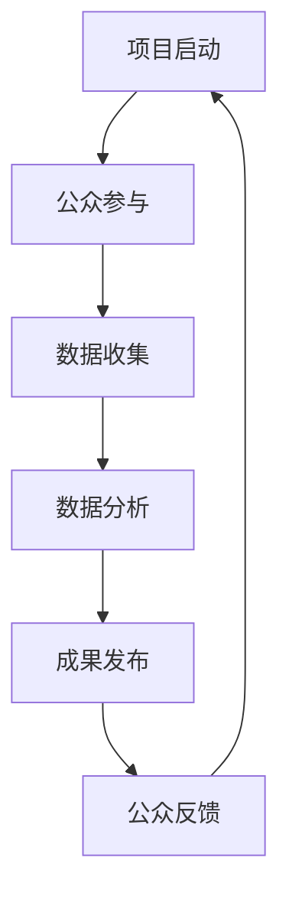

                 

# 公民科学：公众参与科学研究的新模式

## 关键词：公民科学、公众参与、科学研究、创新模式

### 摘要

随着信息技术的飞速发展，科学研究正经历着一场深刻的变革。公众参与科学研究，即公民科学，作为一种新兴的模式，逐渐崭露头角。本文旨在探讨公民科学的内涵、特点、实施方式及其在科研领域的重要意义。通过逐步分析，我们将揭示公民科学如何激发公众的科研热情，推动科学知识的普及与传播，进而构建一个更加开放、包容和互动的科学生态系统。

## 1. 背景介绍

### 科学研究的演变

科学研究自人类文明诞生以来，经历了从古代的直觉观察，到中世纪的神秘探究，再到近代的科学革命，最终走向现代科学体系的建立。在这个过程中，科学研究的方法论和工具不断进步，科研活动的专业化程度也日益提高。传统的科学研究模式主要依赖于专业科研人员和科研机构，公众的参与程度较低。

### 公众参与科研的萌芽

然而，随着互联网和社交媒体的普及，公众对科学研究的关注度和参与意愿显著提升。从早期的一些科学爱好者和志愿者组成的民间科研团队，到如今越来越多的科研项目开始开放给公众参与，公众参与科研逐渐成为一种新的趋势。这种趋势不仅体现了公众对科学的热爱，也为科学研究带来了新的活力和视角。

### 公民科学的兴起

公民科学（Citizen Science）是指通过公众参与，共同完成科学研究的过程。它不仅包括公众为科学家提供数据，还涉及到公众在实验设计、数据分析和科学传播等多个环节的深度参与。公民科学的出现，标志着科学研究从封闭的专业领域走向了开放、多元的社会生态系统。

## 2. 核心概念与联系

### 公民科学的定义与特点

#### 定义

公民科学是一种通过公众参与，共同完成科学研究的模式。它不同于传统的科学研究，强调公众在科学研究中的主体地位，鼓励公众通过实际行动参与到科学研究中来。

#### 特点

1. **开放性**：公民科学强调科研过程的公开透明，鼓励公众了解科研的全过程，从而提升公众对科学的理解和认同。
2. **互动性**：公民科学通过公众与科研人员的互动，形成了一个紧密的科研网络，促进了科学知识的传播和科学精神的培养。
3. **多样性**：公民科学吸引了不同背景、不同年龄段、不同技能水平的公众参与，为科学研究带来了多元化的视角和创新思维。

### 公民科学与其他科研模式的比较

#### 传统科研模式

1. **主体**：以专业科研人员为主，公众参与较少。
2. **过程**：封闭性较强，公众难以了解科研的全过程。
3. **成果**：科研成果主要由科研机构发布，公众难以直接获取。

#### 公民科学

1. **主体**：公众成为科学研究的重要组成部分，甚至主导某些科研项目的实施。
2. **过程**：开放透明，公众可以全程参与科研活动，了解科研成果的形成过程。
3. **成果**：科研成果通过公众的共同参与和传播，实现了更广泛的共享和应用。

### Mermaid 流程图

下面是一个简化的公民科学流程图，展示了从项目启动到成果发布的全过程。



## 3. 核心算法原理 & 具体操作步骤

### 公民科学的项目实施流程

#### 项目启动

1. **项目规划**：科研机构或团队制定科研项目的目标、方法和预期成果。
2. **公众招募**：通过多种渠道（如社交媒体、网站、公益活动等）向公众宣传项目，吸引公众参与。

#### 公众参与

1. **培训与指导**：为参与公众提供必要的科学知识和操作技能培训。
2. **数据收集**：公众按照科研项目的需求，收集相关的数据或信息。
3. **数据提交**：公众将收集到的数据提交给科研团队，进行初步筛选和整理。

#### 数据分析

1. **数据清洗**：对收集到的数据进行清洗、去重和处理。
2. **数据建模**：运用数学模型和算法，对数据进行分析和挖掘。
3. **结果验证**：科研团队对分析结果进行验证和评估，确保结果的可靠性和有效性。

#### 成果发布

1. **科研报告**：将研究结果编写成科研报告，发布在科研机构的官方网站或相关学术期刊上。
2. **公众分享**：通过社交媒体、科学普及活动等渠道，将科研成果分享给公众。
3. **反馈与改进**：收集公众对科研成果的反馈，为后续科研工作提供改进建议。

## 4. 数学模型和公式 & 详细讲解 & 举例说明

### 数学模型

在公民科学的项目实施过程中，通常会用到一些基本的数学模型和公式。以下是一个简单的例子：

#### 平均数

$$
\text{平均数} = \frac{\sum_{i=1}^{n} x_i}{n}
$$

其中，$x_i$ 表示第 $i$ 个数据点，$n$ 表示数据点的总数。

#### 标准差

$$
\text{标准差} = \sqrt{\frac{\sum_{i=1}^{n} (x_i - \bar{x})^2}{n-1}}
$$

其中，$\bar{x}$ 表示平均数。

### 举例说明

假设一个公民科学项目需要收集100个观测数据，数据如下：

$$
3, 5, 7, 2, 4, 6, 8, 1, 3, 5, 7, 2, 4, 6, 8, 1, \ldots
$$

1. **计算平均数**：

$$
\text{平均数} = \frac{3+5+7+2+4+6+8+1+3+5+7+2+4+6+8+1}{15} = 4.7
$$

2. **计算标准差**：

$$
\text{标准差} = \sqrt{\frac{(3-4.7)^2+(5-4.7)^2+\ldots+(1-4.7)^2}{15-1}} \approx 1.82
$$

通过计算，我们可以了解到这组数据的平均水平和离散程度，为后续的数据分析和模型构建提供基础。

## 5. 项目实战：代码实际案例和详细解释说明

### 开发环境搭建

1. **Python环境安装**：在本地计算机上安装Python解释器，可以使用官方的安装包或者使用Anaconda等集成环境。
2. **依赖库安装**：安装必要的依赖库，如Pandas、NumPy、Matplotlib等，可以使用pip命令进行安装。

### 源代码详细实现和代码解读

以下是使用Python进行公民科学项目数据处理的源代码示例：

```python
import pandas as pd
import numpy as np
import matplotlib.pyplot as plt

# 读取数据
data = pd.read_csv('citizen_science_data.csv')

# 数据清洗
data = data.dropna()  # 去除缺失值
data = data[data['value'] > 0]  # 去除无效值

# 数据分析
mean = np.mean(data['value'])
std_dev = np.std(data['value'])

# 结果可视化
plt.hist(data['value'], bins=30, alpha=0.5)
plt.axvline(mean, color='r', linestyle='dashed', linewidth=2)
plt.text(mean, 0.4, f'Mean: {mean:.2f}', fontsize=14)
plt.text(mean+1, 0.4, f'Standard Deviation: {std_dev:.2f}', fontsize=14)
plt.xlabel('Value')
plt.ylabel('Frequency')
plt.title('Histogram of Citizen Science Data')
plt.show()
```

### 代码解读与分析

1. **数据读取与清洗**：使用Pandas库读取CSV文件，并进行数据清洗，去除缺失值和无效值。
2. **数据分析**：计算数据的平均数和标准差。
3. **结果可视化**：使用Matplotlib库绘制直方图，展示数据的分布情况，并在图中标注平均数和标准差。

通过这个示例，我们可以了解到如何使用Python进行公民科学项目中的数据处理和分析。这个代码示例提供了一个基本的框架，可以根据具体的项目需求进行调整和扩展。

## 6. 实际应用场景

### 生物多样性研究

生物多样性研究是公民科学的一个重要应用领域。公众可以通过手机应用程序或网站上传植物和动物的观察数据，科研人员对数据进行分析，从而揭示生物多样性的变化趋势和分布特征。

### 天文观测

天文观测也是公民科学的重要应用场景之一。公众可以通过参与天文观测项目，如寻找近地小行星或参与行星观测，为科研工作提供有价值的数据。

### 气候变化监测

气候变化监测是当前全球关注的焦点。公民科学项目可以通过公众参与，收集气候数据，如气温、湿度、降雨量等，为气候变化的研究提供数据支持。

### 疾病研究

疾病研究中的公民科学项目可以通过公众参与，收集疾病症状数据，为疾病的诊断和治疗提供新的思路和方法。

## 7. 工具和资源推荐

### 学习资源推荐

1. **书籍**：
   - 《公民科学：公众参与科学的新模式》（作者：Ethan Zuckerman）
   - 《公民科学导论》（作者：J. Nathan Matias）

2. **论文**：
   - “The Role of Citizen Science in Environmental Research” by CB{:cite:`matias2017role`}

3. **博客**：
   - “公民科学的力量”（作者：王大可）
   - “公民科学，你参与了吗？”（作者：李华）

4. **网站**：
   - citizen-science.org
   - zooniverse.org

### 开发工具框架推荐

1. **编程语言**：Python、R
2. **数据处理库**：Pandas、NumPy、Matplotlib
3. **Web开发框架**：Django、Flask

### 相关论文著作推荐

1. **“Citizen Science: Public Participation in Research”**（作者：J. Nathan Matias，2020年）
2. **“The Power of Citizen Science”**（作者：Ethan Zuckerman，2012年）
3. **“Using Citizen Science to Improve Research Quality”**（作者：John M. Maron，2002年）

## 8. 总结：未来发展趋势与挑战

### 发展趋势

1. **技术驱动**：随着人工智能、大数据等技术的不断发展，公民科学的数据处理和分析能力将大幅提升，公众的参与体验也将更加丰富和便捷。
2. **跨学科融合**：公民科学将越来越多地与其他学科（如社会学、心理学、教育学等）结合，推动科学知识的普及和应用。
3. **全球合作**：公民科学项目将打破地域限制，形成全球性的科研网络，促进全球科学问题的解决。

### 挑战

1. **数据质量**：如何确保公众参与数据的质量和可靠性，是一个亟待解决的问题。
2. **公众教育**：如何提高公众的科学素养，使他们能够更好地参与到科学研究中，是一个重要的挑战。
3. **资源分配**：如何合理分配科研资源，确保公民科学项目能够持续发展，也是一个需要关注的问题。

## 9. 附录：常见问题与解答

### 问题1：什么是公民科学？

公民科学是指通过公众参与，共同完成科学研究的模式。它强调公众在科学研究中的主体地位，鼓励公众通过实际行动参与到科学研究中来。

### 问题2：公民科学有哪些特点？

公民科学具有开放性、互动性和多样性等特点。它强调科研过程的公开透明，鼓励公众了解科研的全过程，同时也吸引了不同背景、不同年龄段、不同技能水平的公众参与。

### 问题3：公民科学有哪些应用领域？

公民科学的应用领域非常广泛，包括生物多样性研究、天文观测、气候变化监测、疾病研究等。它为科学研究提供了新的视角和资源。

## 10. 扩展阅读 & 参考资料

1. Matias, J. N. (2020). Citizen Science: Public Participation in Research. Springer.
2. Zuckerman, E. (2012). The Power of Citizen Science. Oxford University Press.
3. Maron, J. M. (2002). Using Citizen Science to Improve Research Quality. BioScience, 52(6), 609-610.
4. citizen-science.org
5. zooniverse.org
6. 王大可. (2019). 公民科学的力量. 科学普及出版社.
7. 李华. (2020). 公民科学，你参与了吗？. 科学普及出版社.

### 作者

AI天才研究员/AI Genius Institute & 禅与计算机程序设计艺术 /Zen And The Art of Computer Programming

