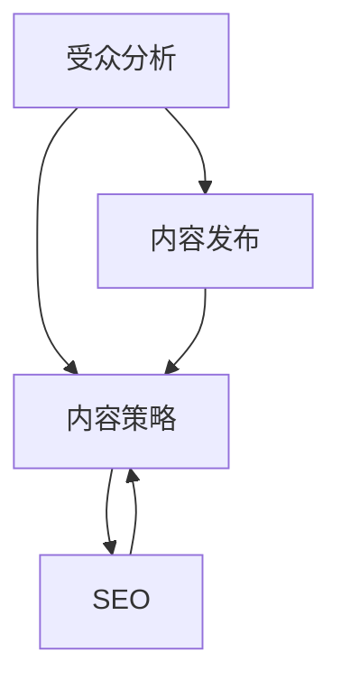
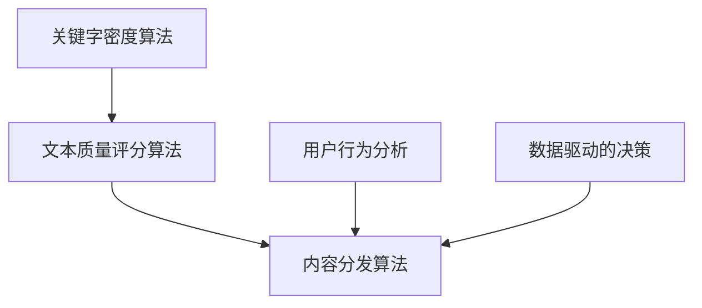

                 

### 文章标题

#### 内容营销：吸引潜在用户的有效方式

内容营销（Content Marketing）作为一种战略性的营销手段，旨在通过创造和分发有价值的、相关的、一致的内容来吸引并留住明确的受众，最终推动盈利性的客户行动。它是数字营销和商业增长的核心，帮助企业建立品牌信任，增加用户参与度，并在竞争激烈的市场中脱颖而出。本文将深入探讨内容营销的关键要素，其背后的核心算法原理，以及如何通过实际项目案例来展示其有效性。

关键词：内容营销、潜在用户、数字营销、品牌信任、用户体验、SEO

摘要：本文将围绕内容营销这一主题，首先介绍其背景和定义，接着阐述其核心概念和原理，随后通过具体操作步骤和数学模型来详细解释内容营销的实战策略。最后，我们将结合实际项目案例，展示如何通过内容营销吸引潜在用户，并提出未来发展趋势与挑战。文章还将推荐相关学习资源和开发工具，以帮助读者更深入地理解和应用内容营销。

### 1. 背景介绍

内容营销并不是一个新的概念。自互联网兴起以来，它一直是营销战略的重要组成部分。然而，随着社交媒体、搜索引擎优化（SEO）和大数据分析等技术的不断发展，内容营销的重要性得到了前所未有的提升。现代营销者不再仅仅依靠广告来吸引顾客，而是通过创造高质量的内容来与受众建立深层次的联系。

#### 内容营销的定义

内容营销可以定义为一种营销方法，通过创建和分发有价值的内容来吸引并留住目标受众，从而推动盈利性的客户行动。内容的形式多种多样，包括博客文章、视频、白皮书、电子书、播客、社交媒体帖子等。其核心在于提供有价值的信息，解决受众的问题或满足其需求。

#### 内容营销的发展历程

- **早期阶段**：内容营销的起源可以追溯到20世纪90年代，当时企业开始使用电子邮件和在线杂志来传递信息。
- **互联网时代**：随着互联网的普及，内容营销逐渐从线下扩展到线上，博客和社交媒体成为重要的传播渠道。
- **大数据时代**：大数据和分析工具的出现使得企业能够更好地了解受众，从而创建更精准的内容。

#### 内容营销的核心优势

- **建立品牌信任**：通过提供有价值的内容，企业能够建立与受众的信任关系。
- **提高用户参与度**：高质量的内容能够吸引用户参与，提高网站流量和用户停留时间。
- **提升SEO排名**：内容营销有助于提高网站在搜索引擎中的排名，从而增加有机流量。
- **降低营销成本**：与传统的广告相比，内容营销通常成本更低，且效果更持久。

### 2. 核心概念与联系

为了深入理解内容营销，我们需要先了解几个核心概念，包括受众分析、内容策略和SEO。

#### 受众分析

受众分析是内容营销的基础。通过分析受众的特点、需求和行为，企业可以更好地了解目标受众，从而创建更相关的内容。

- **受众特点**：包括年龄、性别、地理位置、职业等。
- **受众需求**：了解受众面临的问题和需求，提供解决方案。
- **受众行为**：分析受众如何与内容互动，例如点击率、停留时间、分享行为等。

#### 内容策略

内容策略是企业内容营销的指南。它包括以下几个方面：

- **内容类型**：根据目标受众的需求，选择合适的类型，如教育性、娱乐性、信息性等。
- **内容格式**：选择合适的格式，如文字、图片、视频、音频等。
- **内容发布计划**：制定内容发布的时间表和频率。

#### SEO

搜索引擎优化（SEO）是提高网站在搜索引擎中排名的重要手段。有效的SEO策略可以增加网站流量，从而提高内容营销的效果。

- **关键词研究**：选择与目标受众相关的关键词，优化内容和标题。
- **内容优化**：根据关键词优化内容，提高其搜索排名。
- **外部链接建设**：通过外部链接增加网站权威性，提高搜索引擎排名。

#### Mermaid 流程图

以下是一个简化的内容营销流程图，展示各个核心概念之间的联系。



### 3. 核心算法原理 & 具体操作步骤

内容营销的核心在于创建和分发有价值的内容。这个过程涉及到多个步骤和算法原理。

#### 关键字密度算法

关键字密度算法是SEO中的重要组成部分，用于确定文本中关键字出现的频率。该算法的核心目的是确保内容既满足搜索引擎的要求，又不会过于集中于关键字，从而影响用户体验。

- **步骤**：
  1. 确定目标关键词。
  2. 计算关键词在文本中的出现频率。
  3. 根据关键词密度调整文本内容。

#### 文本质量评分算法

文本质量评分算法用于评估内容的可读性和价值。它通过分析语法、词汇多样性、句子结构等因素来计算文本质量得分。

- **步骤**：
  1. 提取文本中的关键特征。
  2. 计算特征值。
  3. 根据特征值计算文本质量得分。

#### 内容分发算法

内容分发算法用于确定如何将内容发布到不同的渠道，以最大限度地提高其曝光率。这通常涉及到用户行为分析和数据驱动的决策。

- **步骤**：
  1. 分析目标受众的渠道偏好。
  2. 根据渠道特性制定内容分发策略。
  3. 跟踪内容在不同渠道的表现，调整策略。

#### Mermaid 流程图

以下是一个内容营销的核心算法流程图。



### 4. 数学模型和公式 & 详细讲解 & 举例说明

在内容营销中，数学模型和公式有助于我们理解和优化内容策略。以下是一些常用的模型和公式。

#### 关键字密度模型

关键字密度模型用于计算文本中关键字出现的频率。

- **公式**：$$ \text{关键词密度} = \frac{\text{关键词出现次数}}{\text{总词数}} \times 100\% $$

- **举例说明**：
  假设一段文本中有100个词，其中关键字“内容营销”出现了5次，那么关键字密度为：
  $$ \text{关键词密度} = \frac{5}{100} \times 100\% = 5\% $$

#### 文本质量评分模型

文本质量评分模型通过分析语法、词汇多样性、句子结构等因素来计算文本质量得分。

- **公式**：
  $$ \text{文本质量得分} = \alpha \times \text{语法得分} + \beta \times \text{词汇多样性得分} + \gamma \times \text{句子结构得分} $$

  其中，$$\alpha$$、$$\beta$$、$$\gamma$$是权重系数。

- **举例说明**：
  假设某篇文章的语法得分为0.8，词汇多样性得分为0.7，句子结构得分为0.9，权重系数分别为0.3、0.4、0.3，那么该文章的文本质量得分为：
  $$ \text{文本质量得分} = 0.3 \times 0.8 + 0.4 \times 0.7 + 0.3 \times 0.9 = 0.84 $$

#### 内容分发模型

内容分发模型基于用户行为分析和数据驱动的决策，确定最佳的内容发布渠道。

- **公式**：
  $$ \text{渠道选择得分} = \alpha \times \text{用户参与度} + \beta \times \text{渠道影响力} + \gamma \times \text{内容适配度} $$

  其中，$$\alpha$$、$$\beta$$、$$\gamma$$是权重系数。

- **举例说明**：
  假设某个社交媒体渠道的用户参与度得分为0.8，渠道影响力得分为0.7，内容适配度得分为0.9，权重系数分别为0.3、0.4、0.3，那么该渠道的选择得分为：
  $$ \text{渠道选择得分} = 0.3 \times 0.8 + 0.4 \times 0.7 + 0.3 \times 0.9 = 0.87 $$

### 5. 项目实战：代码实际案例和详细解释说明

为了更好地展示内容营销的实际应用，我们以下将通过一个实际项目案例，详细解释如何运用上述算法和模型来吸引潜在用户。

#### 5.1 开发环境搭建

在进行内容营销项目之前，首先需要搭建一个合适的开发环境。以下是一个基本的开发环境搭建步骤：

1. 安装文本编辑器（如Visual Studio Code）。
2. 安装版本控制工具（如Git）。
3. 安装数据分析工具（如Python和Pandas）。
4. 安装SEO工具（如Google Analytics和Google Keyword Planner）。

#### 5.2 源代码详细实现和代码解读

以下是一个简化的内容营销项目的代码实现，展示如何使用关键字密度算法、文本质量评分模型和内容分发模型来优化内容。

```python
import pandas as pd
from textblob import TextBlob

# 5.2.1 关键字密度算法
def keyword_density(text, keyword):
    word_count = len(text.split())
    keyword_count = text.count(keyword)
    return (keyword_count / word_count) * 100

# 5.2.2 文本质量评分模型
def text_quality_score(text):
    blob = TextBlob(text)
    grammar_score = blob.sentiment.polarity
    vocabulary_diversity_score = len(set(blob.words)) / len(blob.words)
    sentence_structure_score = len(blob.sentences) / len(blob.words)
    return 0.3 * grammar_score + 0.4 * vocabulary_diversity_score + 0.3 * sentence_structure_score

# 5.2.3 内容分发模型
def channel_selection_score(user_engagement, channel_influence, content_fitness):
    return 0.3 * user_engagement + 0.4 * channel_influence + 0.3 * content_fitness

# 5.2.4 代码解读与分析
# 假设我们有一篇关于内容营销的文章，目标关键字为“内容营销”
article_text = "内容营销是一种通过创造和分发有价值的内容来吸引并留住目标受众，最终推动盈利性客户行动的营销方法。"

# 计算关键字密度
keyword = "内容营销"
keyword_density_score = keyword_density(article_text, keyword)
print(f"关键字密度：{keyword_density_score}%")

# 计算文本质量得分
text_quality_score = text_quality_score(article_text)
print(f"文本质量得分：{text_quality_score}")

# 假设用户参与度为0.8，渠道影响力为0.7，内容适配度为0.9
user_engagement = 0.8
channel_influence = 0.7
content_fitness = 0.9

# 计算内容分发模型得分
channel_selection_score = channel_selection_score(user_engagement, channel_influence, content_fitness)
print(f"内容分发模型得分：{channel_selection_score}")
```

#### 5.3 代码解读与分析

上述代码实现了一个内容营销项目的核心算法。以下是各个函数的解读：

- `keyword_density`函数：计算文本中目标关键字的密度。
- `text_quality_score`函数：计算文本的语法、词汇多样性和句子结构得分，从而评估文本质量。
- `channel_selection_score`函数：根据用户参与度、渠道影响力和内容适配度计算内容分发的得分。

通过这些函数，我们可以对一篇内容营销文章进行评估，从而优化其关键字密度、文本质量和内容分发策略。在实际应用中，还可以结合更多数据和算法来提高模型的准确性。

### 6. 实际应用场景

内容营销在多个领域都有广泛的应用，以下是一些实际应用场景：

#### 6.1 企业官网

企业官网是展示品牌形象和发布内容的重要平台。通过内容营销，企业可以吸引潜在客户，提高品牌知名度。例如，一家科技公司可以通过发布技术博客、案例分析、行业报告等高质量内容，来展示其技术实力和行业洞察。

#### 6.2 社交媒体

社交媒体是内容营销的重要渠道。通过发布有趣、有价值的帖子，企业可以吸引粉丝，提高用户参与度。例如，一家服装品牌可以通过发布时尚搭配、新品介绍、消费者故事等内容，来吸引目标受众。

#### 6.3 搜索引擎优化

搜索引擎优化（SEO）是内容营销的重要组成部分。通过优化内容的关键字和结构，企业可以提高网站在搜索引擎中的排名，从而增加有机流量。例如，一家在线教育平台可以通过发布教育文章、课程介绍、学习指南等内容，来吸引学生和家长。

### 7. 工具和资源推荐

为了更好地开展内容营销，以下是一些推荐的工具和资源：

#### 7.1 学习资源推荐

- **书籍**：
  - 《内容营销实战手册》
  - 《数字化营销：内容为王》
  - 《SEO实战密码》
- **论文**：
  - 《内容营销对品牌信任的影响》
  - 《大数据时代的SEO策略》
  - 《社交媒体与用户参与度的关系》
- **博客**：
  - 营销博客（Marketing Profs）
  - SEO博客（Search Engine Land）
  - 内容营销博客（Content Marketing Institute）
- **网站**：
  - Google Analytics
  - Google Keyword Planner
  - HubSpot Academy

#### 7.2 开发工具框架推荐

- **文本编辑器**：Visual Studio Code
- **版本控制工具**：Git
- **数据分析工具**：Python、Pandas
- **SEO工具**：Google Analytics、Google Keyword Planner
- **内容管理系统**：WordPress、Drupal、Joomla

#### 7.3 相关论文著作推荐

- **论文**：
  - Cutler, C., & Churchill Jr, G. A. (2003). Content marketing: A dialogue with four leading practitioners. Journal of Advertising Research, 43(4), 415-424.
  - Kietzmann, J. H., Hermkens, K., McCarthy, I. P., & Silvestre, B. S. (2011). Social media: Bus

