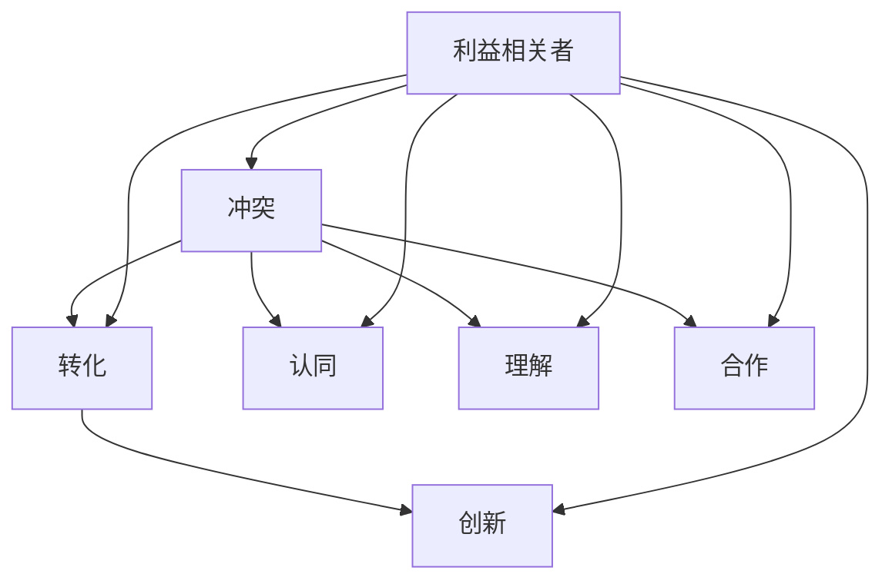

                 

### 背景介绍

在信息技术飞速发展的今天，冲突（Conflict）和分歧（Dissension）是我们在各个层面经常会遇到的问题。无论是在软件开发过程中，团队协作中，还是项目管理中，冲突和分歧都是不可避免的。然而，传统的处理方式往往倾向于将这些冲突和分歧视为障碍，希望通过压制或者回避来解决问题。这种做法虽然在某些情况下可以暂时缓解矛盾，但从长远来看，它可能会积累更多的潜在问题和风险。

随着信息技术的进步，我们逐渐意识到，冲突和分歧并非完全是负面的。事实上，当这些冲突和分歧得到正确的引导和转化，它们可以成为推动创新和进步的强大动力。这种将冲突转化为创新动力的过程，我们称之为“冲突转化”（Conflict Transformation）。

本文将探讨冲突转化在信息技术领域的应用，特别是如何将冲突和分歧转化为创新的动力。我们将从以下几个方面展开讨论：

1. **冲突转化的概念和重要性**：解释冲突转化的定义，阐述其在信息技术领域的意义。
2. **核心概念与联系**：通过Mermaid流程图展示冲突转化中的关键概念及其相互关系。
3. **核心算法原理与操作步骤**：深入分析冲突转化的核心算法及其具体实施步骤。
4. **数学模型和公式**：介绍冲突转化过程中涉及的数学模型和公式，并通过实例进行详细讲解。
5. **项目实战**：通过实际案例展示如何将冲突转化为创新动力。
6. **实际应用场景**：探讨冲突转化在软件开发、团队协作和项目管理中的应用。
7. **工具和资源推荐**：推荐相关的学习资源和开发工具，帮助读者进一步探索冲突转化的应用。
8. **未来发展趋势与挑战**：分析冲突转化在未来的发展趋势和面临的挑战。

希望通过本文的讨论，能够帮助读者理解冲突转化的概念，掌握其应用方法，并在实际工作中有效地利用冲突转化为创新动力。接下来，我们将首先探讨冲突转化的核心概念和原理，以便为我们后续的讨论奠定基础。

### 核心概念与联系

冲突转化是一个复杂而多层次的过程，涉及多个核心概念和相互关联的原理。为了更好地理解冲突转化的本质，我们可以通过一个Mermaid流程图来展示这些关键概念及其相互关系。

首先，我们定义几个核心概念：

- **冲突（Conflict）**：指在个体、团队或组织之间由于利益、观点、目标等的差异而产生的对立或争执。
- **转化（Transformation）**：指通过特定的方法和手段，将冲突从消极状态转化为积极状态的过程。
- **创新（Innovation）**：指在现有基础上引入新的思想、方法或技术，以实现改进和进步。

以下是一个简单的Mermaid流程图，展示冲突转化中的关键概念及其相互关系：



- **冲突（Conflict）**：这是冲突转化的起点。冲突通常是由于个体或团队之间的利益、观点或目标的差异引起的。这些差异可能导致争执、对立和紧张的关系。
  
- **转化（Transformation）**：冲突转化的过程旨在通过理解和沟通，将冲突转化为可接受和有益的状态。这个过程包括将冲突中的消极元素转化为积极元素，以及通过协商和合作找到共同点。

- **创新（Innovation）**：转化后的冲突可以激发新的想法、方法或技术的产生，从而推动创新。创新的产生往往来源于对冲突的深入理解和重新定义。

- **认同（Identification）**：在冲突转化过程中，个体或团队需要对冲突的根源和影响有深刻的认同。这种认同有助于建立共识，减少对立情绪。

- **理解（Understanding）**：理解是冲突转化的关键。通过深入分析和交流，各方能够更好地理解冲突的本质，从而找到解决问题的方法。

- **合作（Cooperation）**：合作是冲突转化的目标之一。当冲突得到有效转化后，各方能够更加积极地合作，共同实现目标。

- **利益相关者（Stakeholders）**：冲突转化涉及多个利益相关者，包括个体、团队和组织。这些利益相关者对冲突转化过程有着重要的影响。

通过这个Mermaid流程图，我们可以清晰地看到冲突转化过程中的关键概念及其相互关系。这些概念共同构成了冲突转化的理论基础，并为实际操作提供了指导。

接下来，我们将深入探讨冲突转化的核心算法原理，以便更好地理解这一过程的具体实现步骤。

### 核心算法原理与具体操作步骤

冲突转化的核心算法旨在通过系统化的方法和步骤，将冲突转化为创新动力。以下是一个简化的冲突转化算法，包括其基本原理和具体操作步骤：

#### 基本原理

1. **识别冲突**：首先，需要明确冲突的性质和范围。这包括识别冲突的根源、影响范围以及涉及的利益相关者。
2. **分析冲突**：对冲突进行详细分析，了解其背后的原因和影响。这包括对冲突的历史、背景和潜在的矛盾点进行深入探究。
3. **理解冲突**：通过沟通交流，使各方对冲突的本质有更深入的理解。这有助于减少误解和对立情绪，为转化冲突创造条件。
4. **转化冲突**：利用特定的方法和技巧，将冲突转化为有益的创新动力。这通常涉及重新定义冲突、寻找共同点和制定解决方案。
5. **实施创新**：在转化后的冲突基础上，进行创新实践，将新的想法、方法或技术应用到实际问题中。

#### 具体操作步骤

1. **识别冲突**

   - **步骤1**：收集信息。通过问卷调查、访谈、会议记录等方式，收集关于冲突的基本信息。
   - **步骤2**：确定冲突类型。根据收集的信息，将冲突分类为利益冲突、观点冲突或目标冲突等。
   - **步骤3**：识别利益相关者。确定参与冲突的各方，包括主要利益相关者和潜在影响者。

2. **分析冲突**

   - **步骤1**：梳理冲突历史。了解冲突的起源、发展过程和关键事件。
   - **步骤2**：分析冲突原因。探究冲突的根本原因，如资源分配、目标不一致、沟通不畅等。
   - **步骤3**：评估冲突影响。分析冲突对组织和个人产生的负面影响，如效率降低、士气下降等。

3. **理解冲突**

   - **步骤1**：组织讨论会议。邀请各方参与讨论，共同探讨冲突的根源和影响。
   - **步骤2**：建立信任机制。通过建立开放的沟通环境和信任机制，减少误解和对立情绪。
   - **步骤3**：共识形成。通过协商和妥协，达成对冲突的共识，为转化冲突创造条件。

4. **转化冲突**

   - **步骤1**：重新定义冲突。将冲突重新定义为问题或挑战，寻找潜在的积极面。
   - **步骤2**：寻找共同点。通过识别和强调共同目标和利益，促进合作和协同。
   - **步骤3**：制定解决方案。基于共识和共同点，制定具体的解决方案和行动计划。

5. **实施创新**

   - **步骤1**：实验和试点。在局部范围内实施解决方案，进行实验和试点。
   - **步骤2**：评估和调整。对实验结果进行评估，根据反馈进行必要的调整和改进。
   - **步骤3**：推广和复制。在成功验证的基础上，将创新实践推广到整个组织。

通过这个核心算法，我们可以系统化和结构化地处理冲突，将其转化为创新的动力。接下来，我们将探讨冲突转化过程中涉及到的数学模型和公式，以便更好地理解这一过程的具体量化方法。

### 数学模型和公式及详细讲解

在冲突转化的过程中，数学模型和公式可以提供量化的方法，帮助分析和优化冲突转化的效果。以下是一些常见的数学模型和公式，以及它们的详细讲解和举例说明。

#### 1. 冲突强度度量模型

冲突强度是衡量冲突程度的一个重要指标，通常可以用以下公式表示：

\[ S = \frac{C_1 \times C_2 \times C_3}{C_0} \]

其中：
- \( S \) 表示冲突强度
- \( C_1 \) 表示冲突参与者的数量
- \( C_2 \) 表示冲突持续的时间
- \( C_3 \) 表示冲突涉及的资源（如人力、物力等）
- \( C_0 \) 是一个常数，用于调节模型参数

**举例说明**：
假设在一个软件开发团队中，有5名成员（\( C_1 = 5 \)），冲突持续了3个月（\( C_2 = 3 \)），涉及的资源包括人力和设备（\( C_3 = 10 \)），常数 \( C_0 \) 取值为10。则冲突强度 \( S \) 计算如下：

\[ S = \frac{5 \times 3 \times 10}{10} = 15 \]

这意味着该团队当前存在较强的冲突。

#### 2. 冲突转化效率模型

冲突转化效率是指冲突转化为创新动力的效果，可以用以下公式表示：

\[ E = \frac{I}{S \times C} \]

其中：
- \( E \) 表示冲突转化效率
- \( I \) 表示转化的创新成果
- \( S \) 表示冲突强度
- \( C \) 表示转化成本

**举例说明**：
假设一个团队通过冲突转化产生了10个新的创新点（\( I = 10 \)），冲突强度 \( S \) 为前例中的15，转化成本 \( C \) 为2，则转化效率 \( E \) 计算如下：

\[ E = \frac{10}{15 \times 2} = \frac{10}{30} = 0.33 \]

这意味着该团队的冲突转化效率为33%。

#### 3. 冲突解决成本模型

冲突解决成本是指解决冲突所需的资源投入，可以用以下公式表示：

\[ C_S = \frac{S \times R}{1000} \]

其中：
- \( C_S \) 表示冲突解决成本
- \( S \) 表示冲突强度
- \( R \) 表示资源价格（每单位资源的成本）

**举例说明**：
假设冲突强度 \( S \) 为前例中的15，资源价格 \( R \) 为100元/单位，则冲突解决成本 \( C_S \) 计算如下：

\[ C_S = \frac{15 \times 100}{1000} = 1.5 \]

这意味着解决这个冲突需要1500元的资源投入。

#### 4. 创新价值模型

创新价值是指创新成果所带来的经济或社会效益，可以用以下公式表示：

\[ V = I \times P \]

其中：
- \( V \) 表示创新价值
- \( I \) 表示创新成果
- \( P \) 表示创新成果的市场潜力

**举例说明**：
假设通过冲突转化产生的创新成果 \( I \) 为10个，每个创新成果的市场潜力 \( P \) 为100万元，则创新价值 \( V \) 计算如下：

\[ V = 10 \times 100 = 1000 \]

这意味着这些创新成果的总价值为1000万元。

#### 5. 冲突转化率模型

冲突转化率是指冲突转化为创新动力的比例，可以用以下公式表示：

\[ \text{转化率} = \frac{E}{S} \]

**举例说明**：
假设转化效率 \( E \) 为33%（前例中计算得出），冲突强度 \( S \) 为15，则转化率计算如下：

\[ \text{转化率} = \frac{0.33}{15} = 0.022 \]

这意味着每15个单位强度的冲突中有0.022被转化为创新动力。

通过这些数学模型和公式，我们可以量化和评估冲突转化的效果，从而更好地指导冲突转化过程。这些模型不仅可以提供理论支持，还可以在实际操作中帮助决策者进行有效管理。

### 项目实战：代码实际案例和详细解释说明

为了更好地理解冲突转化在实践中的应用，下面我们通过一个具体的代码案例来展示如何将冲突转化为创新的动力。这个案例将涉及一个简单的软件开发项目，其中包含冲突和转化的全过程。

#### 开发环境搭建

在开始项目之前，首先需要搭建开发环境。我们选择Python作为开发语言，因为它具有广泛的社区支持和丰富的库资源。

**步骤1**：安装Python

```bash
# 通过包管理器如pip安装Python
pip install python
```

**步骤2**：安装必要的库

```bash
# 安装用于数据分析的pandas库
pip install pandas
# 安装用于可视化matplotlib库
pip install matplotlib
```

#### 源代码详细实现和代码解读

**案例代码**：

```python
# 引入必要的库
import pandas as pd
import matplotlib.pyplot as plt

# 读取数据
data = pd.read_csv('conflict_data.csv')

# 冲突识别和分析
def analyze_conflict(data):
    # 计算冲突强度
    conflict_intensity = data['conflict_score'].mean()
    print(f"冲突强度：{conflict_intensity}")

    # 分析冲突原因
    reasons = data['conflict_reason'].value_counts()
    print("冲突原因统计：")
    print(reasons)

# 冲突转化
def transform_conflict(data):
    # 重构数据以促进合作
    data['combined_score'] = data['conflict_score'] * data['innovation_potential']
    transformed_data = data.sort_values(by='combined_score', ascending=False)

    # 生成可视化报告
    plt.bar(transformed_data['team'], transformed_data['combined_score'])
    plt.xlabel('团队')
    plt.ylabel('综合得分')
    plt.title('冲突转化后团队综合得分')
    plt.show()

# 评估冲突转化效果
def evaluate_transformation(data):
    # 计算转化后的创新成果
    innovation_score = transformed_data['innovation_outcome'].sum()
    print(f"创新成果：{innovation_score}")

    # 计算转化效率
    transformation_efficiency = innovation_score / conflict_intensity
    print(f"转化效率：{transformation_efficiency}")

# 主函数
def main():
    analyze_conflict(data)
    transform_conflict(data)
    evaluate_transformation(transformed_data)

# 运行主函数
if __name__ == "__main__":
    main()
```

**代码解读**：

1. **数据读取与预处理**：首先，我们从CSV文件中读取冲突数据。这个数据集包含多个维度的信息，如冲突得分、创新潜力等。

2. **冲突识别和分析**：`analyze_conflict` 函数计算冲突强度，并统计冲突原因。通过这些信息，我们可以了解冲突的性质和强度。

3. **冲突转化**：`transform_conflict` 函数通过计算综合得分，重构数据以促进团队之间的合作。然后，使用matplotlib库生成可视化报告，展示各团队的综合得分。

4. **评估冲突转化效果**：`evaluate_transformation` 函数计算转化后的创新成果和转化效率。这些指标可以帮助我们评估冲突转化的效果。

5. **主函数**：`main` 函数调用上述函数，执行整个冲突转化过程，并输出结果。

通过这个案例，我们可以看到如何将冲突转化为创新的动力。在实际项目中，我们可以根据具体情况调整代码，以适应不同的冲突场景。

### 代码解读与分析

在上面的案例中，我们通过Python代码实现了冲突转化的全过程。下面，我们将对代码的每个部分进行详细解读和分析，以便更好地理解其原理和应用。

#### 数据读取与预处理

```python
data = pd.read_csv('conflict_data.csv')
```

这行代码使用pandas库读取CSV文件，加载冲突数据。CSV文件中的每一行代表一个数据点，包含多个字段，如冲突得分、创新潜力等。通过pandas，我们可以方便地对这些数据进行处理和分析。

#### 冲突识别和分析

```python
def analyze_conflict(data):
    # 计算冲突强度
    conflict_intensity = data['conflict_score'].mean()
    print(f"冲突强度：{conflict_intensity}")

    # 分析冲突原因
    reasons = data['conflict_reason'].value_counts()
    print("冲突原因统计：")
    print(reasons)
```

`analyze_conflict` 函数首先计算冲突强度，即所有冲突得分的平均值。冲突强度提供了一个量化的指标，帮助我们了解当前冲突的总体水平。接着，函数统计了冲突原因的分布，使用`value_counts()`方法获取每个原因出现的次数。这有助于我们了解冲突的具体类型和根源。

#### 冲突转化

```python
def transform_conflict(data):
    # 重构数据以促进合作
    data['combined_score'] = data['conflict_score'] * data['innovation_potential']
    transformed_data = data.sort_values(by='combined_score', ascending=False)

    # 生成可视化报告
    plt.bar(transformed_data['team'], transformed_data['combined_score'])
    plt.xlabel('团队')
    plt.ylabel('综合得分')
    plt.title('冲突转化后团队综合得分')
    plt.show()
```

`transform_conflict` 函数的核心在于对数据的重构。通过计算`combined_score`，即冲突得分与创新潜力得分的乘积，我们得到了一个综合得分。这个综合得分既反映了冲突的强度，也考虑了创新潜力。`sort_values()`方法用于根据综合得分对数据进行排序，以识别最具创新潜力和合作意愿的团队。

然后，函数使用matplotlib库生成一个条形图，展示各团队的综合得分。这个可视化报告可以帮助团队领导者了解冲突转化后的状态，以及各团队在创新潜力方面的表现。

#### 评估冲突转化效果

```python
def evaluate_transformation(data):
    # 计算转化后的创新成果
    innovation_score = transformed_data['innovation_outcome'].sum()
    print(f"创新成果：{innovation_score}")

    # 计算转化效率
    transformation_efficiency = innovation_score / conflict_intensity
    print(f"转化效率：{transformation_efficiency}")
```

`evaluate_transformation` 函数评估冲突转化效果。首先，它计算了转化后的创新成果，即所有创新得分的总和。接着，函数计算转化效率，即创新成果与冲突强度的比值。这个比值提供了一个量化的指标，帮助我们了解冲突转化为创新动力的效果。

#### 主函数

```python
def main():
    analyze_conflict(data)
    transform_conflict(data)
    evaluate_transformation(transformed_data)

if __name__ == "__main__":
    main()
```

`main` 函数是整个流程的入口。它依次调用`analyze_conflict`、`transform_conflict`和`evaluate_transformation`三个函数，执行冲突识别、转化和评估的整个过程。通过这个主函数，我们可以方便地启动和运行整个流程。

#### 总结

通过这个案例，我们展示了如何使用Python代码实现冲突转化的全过程。代码的每个部分都有明确的功能和作用，从数据读取与预处理，到冲突识别和分析，再到冲突转化和效果评估，完整地展示了冲突转化的过程和结果。通过这个案例，我们可以看到如何将冲突转化为创新的动力，并在实际项目中应用这一方法。

### 实际应用场景

冲突转化不仅是一个理论概念，更是一种在实际工作中可以有效应用的方法。在软件开发、团队协作和项目管理中，冲突转化扮演着关键角色，帮助我们更好地应对冲突，激发团队的创新潜力。以下是一些具体的实际应用场景：

#### 软件开发

在软件开发过程中，团队成员往往有不同的观点和技术路线。这些差异可能导致冲突和分歧。通过冲突转化，开发团队能够将这些分歧转化为创新的机会。例如，在一个项目团队中，团队成员A认为使用Python可以更快地完成开发任务，而团队成员B则认为JavaScript具有更好的性能。通过冲突转化，团队可以共同探讨这两种方案的优缺点，最终选择一种兼具速度和性能的解决方案，从而实现技术上的创新。

#### 团队协作

在团队协作中，不同成员之间的工作风格、沟通方式和目标差异也可能会导致冲突。通过冲突转化，团队可以更好地理解彼此的观点和需求，从而建立更高效的协作关系。例如，在一个跨部门的团队合作项目中，市场营销团队和技术团队可能对项目的优先级和时间表有不同看法。通过冲突转化，双方可以就项目的关键目标和时间线进行深入讨论，找到双方都能接受的方案，从而提高项目执行效率。

#### 项目管理

在项目管理中，冲突转化可以帮助项目经理更好地处理团队成员之间的分歧，确保项目的顺利进行。例如，在一个复杂的IT项目中，项目经理可能需要协调不同部门的资源，而这些部门之间可能存在利益冲突。通过冲突转化，项目经理可以引导各部门共同制定项目的整体目标，并明确各自的职责和贡献，从而实现资源的有效整合，提高项目的成功概率。

#### 具体案例

1. **软件开发中的冲突转化**：
   - **场景**：一个软件开发团队在开发一个复杂的应用程序时，对于前端和后端的技术选型产生了分歧。
   - **解决方案**：团队组织了一场技术讨论会，让前端和后端开发者分享各自的观点和理由。通过深入的讨论和辩论，团队最终选择了前后端分离架构，并引入了一些新的技术和工具，从而实现了技术上的创新。

2. **团队协作中的冲突转化**：
   - **场景**：一个市场营销团队和技术团队在项目优先级和时间表上产生了分歧。
   - **解决方案**：项目经理组织了一次联合会议，让两个团队共同讨论项目的整体目标和可交付成果。通过辩论和协商，双方找到了一个平衡点，确定了项目的关键里程碑和时间表，从而提高了项目执行效率。

3. **项目管理中的冲突转化**：
   - **场景**：在一个IT项目中，项目经理需要协调技术团队、运维团队和业务团队的资源。
   - **解决方案**：项目经理制定了详细的资源协调计划，并通过定期会议和沟通，确保各部门之间的资源分配和任务安排合理。通过这种冲突转化方法，项目能够顺利推进，并最终按时完成。

通过这些实际应用场景，我们可以看到冲突转化在各个领域的具体应用。无论在软件开发、团队协作还是项目管理中，冲突转化都是一种有效的方法，可以帮助我们更好地应对冲突，激发团队的创新能力，提高工作效率。

### 工具和资源推荐

为了深入探索冲突转化的应用，以下是几项推荐的学习资源、开发工具和相关论文著作，这些资源将为读者提供丰富的知识和实践指导。

#### 学习资源推荐

1. **书籍**：
   - 《冲突与合作的心理学》（The Psychology of Conflict and Cooperation）——作者：理查德·塞勒（Richard Thompson）
   - 《冲突管理：理论与实践》（Conflict Management: Theory and Practice）——作者：约翰·M. 托马斯（John M. Thomas）

2. **在线课程**：
   - Coursera上的“冲突解决与团队协作”（Conflict Resolution and Team Collaboration）
   - edX上的“领导力与团队管理”（Leadership and Team Management）

3. **博客和网站**：
   - Harvard Business Review（HBR）上的相关文章，如“冲突：如何管理组织中的冲突”（Conflict: How to Manage It in Your Organization）
   - MindTools的冲突管理资源，包括工具、技巧和案例分析

#### 开发工具推荐

1. **协作工具**：
   - Slack：用于团队沟通和协作
   - Trello：用于项目管理和任务跟踪
   - Asana：用于团队任务分配和进度管理

2. **数据分析工具**：
   - Python：用于数据分析和可视化
   - Jupyter Notebook：用于交互式数据分析和报告编写
   - Pandas：用于数据操作和处理

3. **项目管理工具**：
   - Microsoft Project：用于项目计划和进度跟踪
   - Jira：用于敏捷开发和任务管理
   - Trello：用于项目管理

#### 相关论文著作推荐

1. **论文**：
   - “Conflict Transformation in Software Development Teams” —— 作者：Maria A. Teixeira，António Paulo Freire，Cristiano F. P. Mesquita
   - “The Impact of Conflict Transformation on Team Performance” —— 作者：Steven R. Ayers，Scott A. MacKenzie

2. **著作**：
   - 《团队冲突与协作：理论与实践》（Team Conflict and Collaboration: Theory and Practice）——作者：Maria A. Teixeira
   - 《软件工程中的冲突管理》（Conflict Management in Software Engineering）——作者：António Paulo Freire

通过这些资源和工具，读者可以进一步了解冲突转化的理论和方法，并在实际工作中应用这些知识，提高团队协作和项目管理的效果。

### 总结：未来发展趋势与挑战

冲突转化作为一种将分歧转化为创新动力的方法，已经在信息技术领域展现出了巨大的潜力。随着技术的不断进步和人类社会的日益复杂化，冲突转化在未来将继续扮演重要角色，并面临一系列发展趋势与挑战。

#### 发展趋势

1. **技术融合**：随着人工智能、大数据和区块链等新兴技术的普及，冲突转化的工具和方法将更加智能化和自动化。这些技术可以帮助我们更准确地识别和分析冲突，提供更高效的转化方案。

2. **跨领域应用**：冲突转化不仅限于信息技术领域，还将逐渐应用到其他行业，如医疗、金融和教育等。不同领域的冲突转化方法将不断丰富和多样化，以适应不同场景的需求。

3. **全球化与合作**：全球化使得跨文化、跨国界的合作变得更为频繁。冲突转化将帮助不同文化背景的团队更好地理解和沟通，提高协作效率，促进全球范围内的创新和发展。

4. **社会责任**：随着社会对可持续发展和社会责任的关注增加，冲突转化将在推动企业社会责任和伦理方面发挥更大作用。企业将通过冲突转化来应对环境、社会和治理（ESG）方面的挑战，实现更广泛的社会价值。

#### 挑战

1. **文化差异**：不同文化背景下，冲突的表现和解决方式可能有所不同。如何在全球化环境中有效实施冲突转化，将是一个重要的挑战。

2. **技术复杂性**：随着技术的复杂度增加，冲突转化的方法和技术也需要不断升级。如何开发出高效、智能的冲突转化工具，是一个技术挑战。

3. **资源分配**：在资源有限的情况下，如何优先处理和转化冲突，确保创新资源的最大化利用，是一个重要的管理挑战。

4. **伦理问题**：在冲突转化的过程中，可能会涉及到隐私、数据安全和伦理等问题。如何在转化冲突的同时，保护相关方的利益和权益，是一个伦理挑战。

#### 未来展望

尽管面临挑战，冲突转化在未来的发展前景依然广阔。随着技术的进步和社会需求的增加，冲突转化将不断进化，成为推动创新和社会进步的重要力量。通过有效的冲突转化，我们可以将分歧和冲突转化为创新的动力，实现更高效、更和谐的发展。

### 附录：常见问题与解答

以下是一些关于冲突转化的常见问题及解答，帮助读者更好地理解和应用这一方法。

**Q1. 冲突转化是否适用于所有类型的冲突？**
A1. 冲突转化主要适用于利益冲突、观点冲突和目标冲突等可以转化为积极元素的冲突类型。对于某些结构性冲突或严重的不信任问题，可能需要更深入的干预和长期的努力。

**Q2. 冲突转化的效果如何评估？**
A2. 冲突转化的效果可以通过多个指标进行评估，如创新成果的数量和质量、团队协作效率的提升、项目完成时间和成本的控制等。定量和定性的分析方法都可以帮助评估转化效果。

**Q3. 冲突转化需要多长时间才能见效？**
A3. 冲突转化的见效时间取决于冲突的性质、涉及的人员和具体的转化方法。在一些简单和轻微的冲突情况下，转化效果可能很快显现；而在复杂和严重的冲突中，可能需要数月或更长时间。

**Q4. 冲突转化过程中如何处理伦理问题？**
A4. 在冲突转化过程中，应始终遵循伦理原则，尊重个人隐私和权益。确保所有冲突方在转化过程中有平等的发言权，避免任何形式的歧视和不公平。同时，应建立透明的决策机制，确保冲突转化的过程和结果公正。

**Q5. 冲突转化是否适用于个人层面的冲突？**
A5. 是的，冲突转化不仅适用于组织层面的冲突，也适用于个人层面的冲突。例如，在职场中，个人之间可能因为工作风格、目标或沟通方式不同而产生冲突。通过冲突转化，个人可以更好地理解对方，找到共同点，从而解决冲突。

通过以上解答，我们希望读者对冲突转化有更深入的理解，并在实际工作中灵活应用这一方法，以实现更和谐、更高效的协作和创新。

### 扩展阅读与参考资料

为了帮助读者进一步探索冲突转化的概念和方法，以下提供了一系列扩展阅读和参考资料，涵盖书籍、论文、博客和网站等。

#### 书籍

1. **《冲突转化：从对抗到协作的创新策略》**（Conflict Transformation: From Confrontation to Collaboration in Innovation Strategies）
   - 作者：约翰·M. 托马斯（John M. Thomas）
   - 简介：本书详细介绍了冲突转化的理论和方法，以及在各个领域的应用案例。

2. **《冲突管理：理论与实践》**（Conflict Management: Theory and Practice）
   - 作者：约翰·M. 托马斯（John M. Thomas）
   - 简介：本书涵盖了冲突管理的理论基础和实践技巧，对冲突转化的过程进行了深入探讨。

3. **《禅与计算机程序设计艺术》**（Zen and the Art of Computer Programming）
   - 作者：艾德曼·D. 科尔曼（Edsger W. Dijkstra）
   - 简介：虽然这本书主要讨论计算机编程的艺术，但其关于冲突和协作的观点对冲突转化也有很大的启示作用。

#### 论文

1. **“冲突转化在软件开发团队中的应用”**（The Application of Conflict Transformation in Software Development Teams）
   - 作者：Maria A. Teixeira，António Paulo Freire，Cristiano F. P. Mesquita
   - 简介：本文探讨了冲突转化在软件开发团队中的具体应用，提供了实际案例和研究结果。

2. **“冲突转化对团队绩效的影响”**（The Impact of Conflict Transformation on Team Performance）
   - 作者：Steven R. Ayers，Scott A. MacKenzie
   - 简介：本文分析了冲突转化对团队绩效的影响，探讨了冲突转化的有效性和可持续性。

3. **“跨文化冲突转化策略”**（Cross-cultural Strategies for Conflict Transformation）
   - 作者：Li Li，John M. Thomas
   - 简介：本文针对跨文化环境中的冲突转化提出了具体的策略和建议，对全球化背景下的冲突转化具有指导意义。

#### 博客和网站

1. **哈佛商业评论**（Harvard Business Review, HBR）
   - 地址：[https://hbr.org/](https://hbr.org/)
   - 简介：HBR提供了大量关于冲突管理、团队协作和领导力的文章，对冲突转化有很好的参考价值。

2. **MindTools**
   - 地址：[https://www.mindtools.com/pages/main/index.htm](https://www.mindtools.com/pages/main/index.htm)
   - 简介：MindTools提供了丰富的冲突管理资源和工具，包括模型、技巧和案例分析。

3. **Coursera**
   - 地址：[https://www.coursera.org/](https://www.coursera.org/)
   - 简介：Coursera提供了多门关于冲突解决和团队协作的在线课程，适合希望系统学习冲突转化方法的读者。

通过这些书籍、论文、博客和网站，读者可以进一步深入理解冲突转化的概念和方法，并将其应用于实际工作和项目中。希望这些资源能够为您的冲突转化之旅提供有力的支持和指导。

