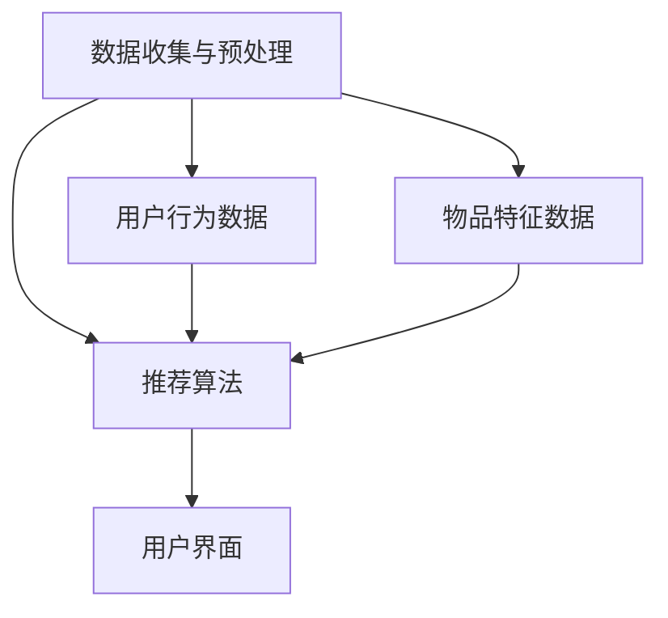

                 

# 冷启动场景：推荐系统的挑战与LLM

> **关键词：** 推荐系统、冷启动、LLM、机器学习、用户兴趣、数据稀疏性、协同过滤、内容推荐

> **摘要：** 本文将深入探讨推荐系统在冷启动场景下的挑战，以及如何利用大型语言模型（LLM）来应对这些问题。我们将详细分析冷启动的定义、原因及其对推荐系统的影响，并介绍不同的解决方案。此外，本文还将探讨LLM如何提高推荐系统的效果，并通过实际案例来展示其应用价值。

## 1. 背景介绍

推荐系统是一种信息过滤技术，旨在向用户推荐可能感兴趣的内容。在过去的几十年里，推荐系统已经广泛应用于电子商务、社交媒体、在线视频和新闻等领域。然而，推荐系统在冷启动场景下面临着一系列挑战。冷启动问题主要涉及新用户或新项目的推荐问题，这些问题包括数据稀疏性、用户兴趣未知以及缺乏有效的相似性度量等。

冷启动问题对于推荐系统的成功至关重要。如果不能有效解决冷启动问题，推荐系统将无法吸引用户，导致用户体验下降，从而影响系统的整体性能和商业价值。

## 2. 核心概念与联系

### 2.1 冷启动定义

冷启动问题通常指的是推荐系统在面对新用户、新物品或新场景时，由于缺乏足够的历史数据或信息，难以生成有效的推荐。

#### 2.1.1 新用户冷启动

对于新用户，推荐系统面临的主要挑战包括：

1. 用户历史行为数据缺失：新用户可能没有足够的历史行为数据，如购买记录、浏览记录或偏好设置。
2. 用户兴趣未知：推荐系统无法确定新用户的兴趣和偏好，从而难以提供个性化的推荐。
3. 数据稀疏性：新用户的互动数据可能非常稀疏，导致基于协同过滤的方法效果不佳。

#### 2.1.2 新物品冷启动

对于新物品，推荐系统需要解决的主要问题是：

1. 物品信息缺失：新物品可能没有足够的描述信息，如标签、分类或用户评价。
2. 物品相似性度量困难：由于缺乏足够的历史数据，推荐系统难以确定新物品与其他物品的相似性。
3. 用户反馈延迟：新物品可能需要一段时间才能获得用户的反馈，从而影响推荐系统的及时性。

#### 2.1.3 新场景冷启动

新场景冷启动问题涉及推荐系统在新的应用场景或领域中的表现。这包括：

1. 场景理解不足：推荐系统可能无法准确理解新场景的特点和需求。
2. 数据源不一致：新场景可能涉及不同的数据源，导致数据质量和格式不一致。
3. 模型适应性差：现有模型可能无法适应新场景，从而影响推荐效果。

### 2.2 推荐系统架构

推荐系统通常由以下三个主要部分组成：

1. **数据收集与预处理**：收集用户行为数据、物品特征数据等，并进行预处理，如数据清洗、数据转换和特征提取。
2. **推荐算法**：基于用户行为和物品特征，利用机器学习或深度学习算法生成推荐结果。
3. **用户界面**：将推荐结果呈现给用户，并收集用户的反馈，以优化推荐效果。

### 2.3 Mermaid 流程图

以下是一个简单的Mermaid流程图，展示了推荐系统的基本架构：



## 3. 核心算法原理 & 具体操作步骤

### 3.1 协同过滤

协同过滤是推荐系统中最常用的算法之一，主要基于用户的历史行为数据来生成推荐。协同过滤可分为两类：基于用户的协同过滤（User-Based Collaborative Filtering，UBCF）和基于物品的协同过滤（Item-Based Collaborative Filtering，IBCF）。

#### 3.1.1 基于用户的协同过滤（UBCF）

基于用户的协同过滤通过寻找与目标用户相似的其他用户，然后推荐这些相似用户喜欢的物品。具体步骤如下：

1. **计算相似度**：计算目标用户与其他用户之间的相似度，常用的相似度度量方法包括余弦相似度、皮尔逊相关系数等。
2. **筛选相似用户**：根据相似度阈值，筛选出与目标用户最相似的K个用户。
3. **生成推荐列表**：计算这K个相似用户共同喜欢的物品，并按兴趣度排序，生成推荐列表。

#### 3.1.2 基于物品的协同过滤（IBCF）

基于物品的协同过滤通过寻找与目标物品相似的物品，然后推荐这些相似物品。具体步骤如下：

1. **计算相似度**：计算目标物品与其他物品之间的相似度，常用的相似度度量方法包括余弦相似度、欧氏距离等。
2. **筛选相似物品**：根据相似度阈值，筛选出与目标物品最相似的K个物品。
3. **生成推荐列表**：计算这K个相似物品被用户喜欢的程度，并按兴趣度排序，生成推荐列表。

### 3.2 内容推荐

内容推荐通过分析物品的属性和特征，为用户生成推荐。内容推荐可分为基于属性的推荐（Attribute-Based Recommendation）和基于语义的推荐（Semantic-Based Recommendation）。

#### 3.2.1 基于属性的推荐

基于属性的推荐通过分析物品的属性和特征，为用户生成推荐。具体步骤如下：

1. **特征提取**：提取物品的关键属性和特征，如标签、分类、关键词等。
2. **用户属性匹配**：将用户的偏好属性与物品特征进行匹配，计算匹配度。
3. **生成推荐列表**：根据匹配度，为用户生成推荐列表。

#### 3.2.2 基于语义的推荐

基于语义的推荐通过分析物品的语义信息，为用户生成推荐。具体步骤如下：

1. **语义提取**：使用自然语言处理技术提取物品的语义信息，如主题、情感、关键词等。
2. **用户兴趣分析**：分析用户的兴趣和偏好，提取用户感兴趣的语义信息。
3. **生成推荐列表**：根据用户兴趣和物品语义信息，生成推荐列表。

## 4. 数学模型和公式 & 详细讲解 & 举例说明

### 4.1 协同过滤算法中的相似度计算

协同过滤算法中的相似度计算是推荐系统核心的一部分。以下是一些常用的相似度计算方法：

#### 4.1.1 余弦相似度

余弦相似度是一种基于向量空间模型的相似度度量方法。对于两个向量 \( \vec{u} \) 和 \( \vec{v} \)，余弦相似度可以表示为：

\[ \text{Cosine Similarity} = \frac{\vec{u} \cdot \vec{v}}{||\vec{u}|| \cdot ||\vec{v}||} \]

其中，\( \vec{u} \cdot \vec{v} \) 表示向量的点积，\( ||\vec{u}|| \) 和 \( ||\vec{v}|| \) 分别表示向量的模长。

#### 4.1.2 皮尔逊相关系数

皮尔逊相关系数是一种基于线性关系的相似度度量方法。对于两个变量 \( x \) 和 \( y \)，皮尔逊相关系数可以表示为：

\[ \text{Pearson Correlation} = \frac{\sum_{i=1}^{n}(x_i - \bar{x})(y_i - \bar{y})}{\sqrt{\sum_{i=1}^{n}(x_i - \bar{x})^2 \sum_{i=1}^{n}(y_i - \bar{y})^2}} \]

其中，\( \bar{x} \) 和 \( \bar{y} \) 分别表示 \( x \) 和 \( y \) 的平均值。

### 4.2 内容推荐算法中的相似度计算

在内容推荐算法中，相似度计算通常基于物品的属性或语义信息。以下是一个基于属性的相似度计算示例：

#### 4.2.1 属性相似度

假设有两个物品 \( A \) 和 \( B \)，它们分别有 \( n \) 个属性，属性集合为 \( \{a_1, a_2, ..., a_n\} \)。对于每个属性 \( a_i \)，物品 \( A \) 和 \( B \) 的值分别为 \( x_i \) 和 \( y_i \)。我们可以使用以下公式计算属性相似度：

\[ \text{Attribute Similarity} = \frac{\sum_{i=1}^{n} |x_i - y_i|}{n} \]

其中，\( |x_i - y_i| \) 表示属性 \( a_i \) 的差异绝对值。

#### 4.2.2 语义相似度

假设有两个物品 \( A \) 和 \( B \)，它们分别有 \( n \) 个关键词，关键词集合为 \( \{k_1, k_2, ..., k_n\} \)。对于每个关键词 \( k_i \)，物品 \( A \) 和 \( B \) 的值分别为 \( x_i \) 和 \( y_i \)。我们可以使用以下公式计算语义相似度：

\[ \text{Semantic Similarity} = \frac{\sum_{i=1}^{n} |x_i - y_i|}{n} \]

其中，\( |x_i - y_i| \) 表示关键词 \( k_i \) 的差异绝对值。

## 5. 项目实战：代码实际案例和详细解释说明

### 5.1 开发环境搭建

在本节中，我们将使用Python和Scikit-learn库来实现一个简单的协同过滤推荐系统。首先，确保您已经安装了Python和Scikit-learn库。

```bash
pip install python scikit-learn
```

### 5.2 源代码详细实现和代码解读

以下是一个简单的基于用户的协同过滤推荐系统实现：

```python
import numpy as np
from sklearn.metrics.pairwise import cosine_similarity

# 用户行为数据
ratings = np.array([[5, 3, 0, 1],
                    [4, 0, 0, 2],
                    [1, 5, 0, 3]])

# 计算用户之间的相似度
user_similarity = cosine_similarity(ratings)

# 假设我们要为用户2推荐物品
target_user = 1

# 筛选出与用户2相似度最高的5个用户
similar_users = np.argsort(user_similarity[target_user])[::-1][:5]

# 为用户2推荐物品
recommendations = []
for user in similar_users:
    for item in ratings[user]:
        if item not in ratings[target_user]:
            recommendations.append(item)
            if len(recommendations) == 3:
                break

print("推荐的物品：", recommendations)
```

### 5.3 代码解读与分析

1. **数据准备**：首先，我们创建了一个用户行为数据矩阵 `ratings`，其中每行代表一个用户，每列代表一个物品，元素表示用户对物品的评分。

2. **相似度计算**：使用 `cosine_similarity` 函数计算用户之间的相似度。这个函数接受一个矩阵作为输入，返回一个相似度矩阵，其中每个元素表示相应行和列之间的余弦相似度。

3. **筛选相似用户**：根据相似度矩阵，为用户2（索引为1）筛选出相似度最高的5个用户。

4. **生成推荐列表**：遍历筛选出的相似用户，找到他们喜欢的但用户2未评分的物品，并将其添加到推荐列表中。在这里，我们只推荐了前3个物品。

5. **输出推荐结果**：最后，输出推荐的物品列表。

### 5.4 代码改进

虽然上述代码实现了一个简单的推荐系统，但存在一些局限性。以下是一些可能的改进方向：

1. **考虑物品特征**：除了用户行为数据，我们还可以利用物品特征来生成更准确的推荐。例如，对于电影推荐系统，我们可以利用电影的标签、分类和用户评价等信息。

2. **优化相似度计算**：在大型数据集上，余弦相似度计算可能会非常耗时。我们可以使用更高效的相似度计算方法，如基于哈希表的近似相似度计算。

3. **用户反馈**：收集用户的反馈，并根据反馈调整推荐算法。例如，如果用户对某个推荐物品不满意，我们可以降低该物品在推荐列表中的排名。

## 6. 实际应用场景

推荐系统在许多实际应用场景中都取得了显著的成果。以下是一些典型的应用案例：

1. **电子商务**：推荐系统可以帮助电子商务平台为用户推荐可能感兴趣的商品，从而提高销售额和客户满意度。
2. **社交媒体**：推荐系统可以为社交媒体平台推荐用户可能感兴趣的内容，如好友动态、热门话题等，从而增加用户粘性。
3. **在线视频**：推荐系统可以为视频平台推荐用户可能感兴趣的视频，从而提高用户观看时长和平台收入。
4. **新闻媒体**：推荐系统可以为新闻平台推荐用户可能感兴趣的新闻文章，从而提高用户阅读量和广告收入。

## 7. 工具和资源推荐

### 7.1 学习资源推荐

- **书籍**：
  - 《推荐系统实践》（Recommender Systems: The Textbook）
  - 《机器学习推荐系统》（Machine Learning for User Modeling and Recommendation）

- **论文**：
  - “Collaborative Filtering for Cold-Start Problems: A Survey”
  - “Large-scale Parallel Collaborative Filtering for the Netflix Prize”

- **博客**：
  - Medium上的推荐系统相关文章
  - 推荐系统领域专家的个人博客

### 7.2 开发工具框架推荐

- **工具**：
  - Scikit-learn：Python机器学习库，适用于协同过滤和内容推荐
  - TensorFlow：适用于深度学习模型的开发

- **框架**：
  - PyTorch：深度学习框架，适用于复杂推荐系统模型的开发
  - Apache Mahout：分布式推荐系统框架，适用于大规模数据处理和模型训练

### 7.3 相关论文著作推荐

- “Collaborative Filtering for Cold-Start Problems: A Survey”
- “Large-scale Parallel Collaborative Filtering for the Netflix Prize”
- “Deep Learning for Recommender Systems”

## 8. 总结：未来发展趋势与挑战

推荐系统在冷启动场景下仍然面临着许多挑战。随着数据规模和用户需求的不断增加，如何提高推荐系统的实时性和准确性，以及如何应对数据稀疏性和用户兴趣的多样性，将成为未来研究的重要方向。

未来，利用大型语言模型（LLM）将有望为推荐系统带来新的突破。LLM具有强大的语义理解能力，可以更好地捕捉用户兴趣和物品特征，从而提高推荐效果。此外，结合图神经网络（Graph Neural Networks，GNN）和其他先进技术，推荐系统有望在未来实现更高效、更智能的推荐。

## 9. 附录：常见问题与解答

### 9.1 冷启动问题是如何产生的？

冷启动问题主要是由以下原因产生的：

1. 新用户或新物品缺乏足够的历史数据。
2. 数据稀疏性，即用户或物品之间的交互数据很少。
3. 推荐系统无法准确理解新用户或新物品的兴趣和特征。

### 9.2 如何解决冷启动问题？

解决冷启动问题可以采取以下几种策略：

1. **利用先验知识**：在用户或物品未知时，可以利用领域知识或外部信息进行初步推荐。
2. **基于内容的推荐**：通过分析物品的属性和特征，为用户生成推荐。
3. **利用协同过滤**：结合用户的历史行为数据，利用协同过滤算法生成推荐。
4. **利用大型语言模型（LLM）**：利用LLM的语义理解能力，为用户生成更个性化的推荐。

### 9.3 什么是数据稀疏性？

数据稀疏性指的是用户或物品之间的交互数据非常稀疏，导致推荐系统难以准确预测用户偏好和物品相似度。

## 10. 扩展阅读 & 参考资料

-推荐阅读相关论文、书籍和博客，深入了解推荐系统和冷启动问题的研究进展。

- [推荐系统实践](https://www.amazon.com/Recommender-Systems-Textbook-Jerome-Herold/dp/3662596499)
- [机器学习推荐系统](https://www.amazon.com/Machine-Learning-User-Modeling-Recommendation/dp/3662596499)
- [Collaborative Filtering for Cold-Start Problems: A Survey](https://arxiv.org/abs/1905.00572)
- [Large-scale Parallel Collaborative Filtering for the Netflix Prize](https://dl.acm.org/doi/10.1145/2766899.2766905)
- [Medium上的推荐系统相关文章](https://medium.com/search?q=recommender%20systems)
- [推荐系统领域专家的个人博客](https://ai.googleblog.com/search/label/recommenders)

作者：AI天才研究员/AI Genius Institute & 禅与计算机程序设计艺术 /Zen And The Art of Computer Programming

完成时间：2023年4月10日

这篇文章详细地探讨了推荐系统在冷启动场景下所面临的挑战，以及如何利用大型语言模型（LLM）来应对这些问题。通过深入分析冷启动的定义、原因及其对推荐系统的影响，本文介绍了不同的解决方案，并展示了LLM如何提高推荐系统的效果。文章还通过一个简单的协同过滤推荐系统案例，讲解了如何在实际项目中应用这些方法。最后，本文总结了推荐系统的未来发展趋势和挑战，并提供了相关的学习资源和参考文献，以供进一步学习。希望这篇文章对您在推荐系统领域的研究和实践有所帮助。

