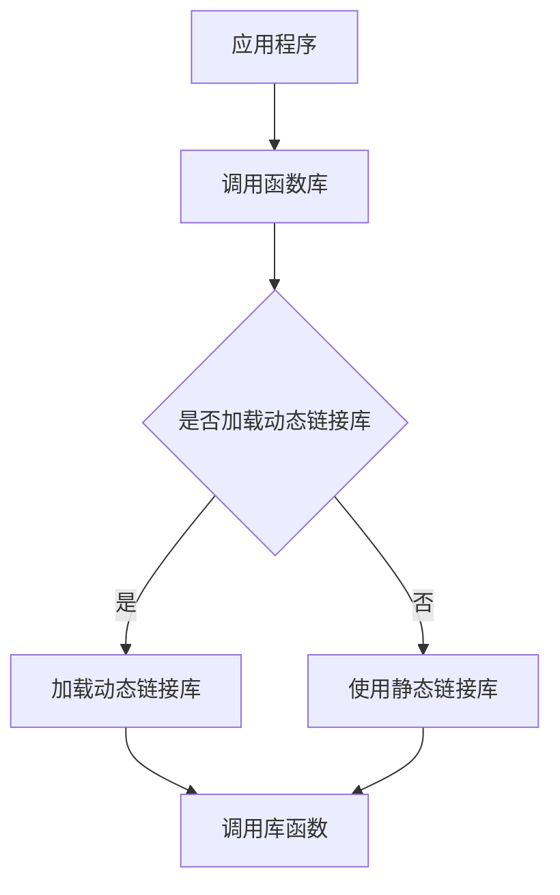

                 

# 函数库：封装复用代码的利器

> 关键词：函数库、代码封装、复用、模块化、编程技巧

> 摘要：本文将深入探讨函数库的概念、重要性以及在软件开发中的实际应用。通过一步步的分析和实例，我们将揭示函数库如何帮助我们提高代码质量、减少重复劳动、促进团队协作，并展望函数库技术的未来发展趋势。

## 1. 背景介绍

在计算机科学和软件工程领域，函数库（也称为库或模块）是一种广泛使用的资源。函数库是一组预编译的代码，旨在提供特定的功能或服务。这些功能可以是通用的，如数学运算、文件操作或网络通信，也可以是特定领域的，如图像处理、机器学习或数据库操作。

随着软件项目的复杂性和规模不断增加，编写和维护高质量的代码变得越来越具有挑战性。函数库的出现为解决这一问题提供了强有力的支持。它们封装了复杂的算法和数据结构，使得开发者可以专注于业务逻辑的实现，而无需从零开始编写底层代码。

函数库的概念可以追溯到早期编程语言的出现。例如，C语言的标准库（标准C库）提供了丰富的功能，包括输入输出、数学运算和字符串处理。随着技术的发展，函数库的形式和用途也在不断扩展。如今，函数库已经成为了现代软件开发不可或缺的一部分。

## 2. 核心概念与联系

### 2.1 函数库的定义

函数库是一组预编译的函数或类的集合，它们可以通过调用来执行特定的操作。函数库可以独立于应用程序进行开发和维护，这使得它们可以被多个应用程序复用。以下是对函数库的一些关键定义：

- **函数**：函数是一段可重复使用的代码块，它接受输入参数并返回结果。
- **库**：库是存储函数的集合，通常是一个编译后的文件，可以被应用程序直接调用。
- **模块化**：模块化是将代码拆分成独立的部分，每个部分负责实现特定的功能。

### 2.2 函数库的工作原理

函数库的工作原理基于动态链接库（DLL）或静态链接库（LIB）。动态链接库在运行时被加载到内存中，而静态链接库则在编译时被集成到应用程序中。

以下是一个简单的Mermaid流程图，展示了函数库的调用过程：



### 2.3 函数库的优势

函数库具有以下优势：

- **复用性**：函数库中的代码可以跨多个应用程序复用，减少了代码冗余。
- **可维护性**：函数库可以独立于应用程序进行维护和更新，提高了代码的可维护性。
- **可测试性**：函数库中的代码可以单独进行测试，提高了测试效率。
- **灵活性**：函数库提供了丰富的功能，使得开发者可以根据需要选择合适的功能进行集成。

## 3. 核心算法原理 & 具体操作步骤

### 3.1 函数库的创建

要创建一个函数库，需要遵循以下步骤：

1. **定义函数**：首先，定义需要封装的函数。这些函数应该具有清晰的功能和良好的输入输出定义。
2. **组织代码**：将函数代码组织成一个模块或库文件。通常，使用特定的文件扩展名（如 `.h` 和 `.c`）来表示头文件和实现文件。
3. **编写文档**：为函数库编写详细的文档，包括函数的用法、参数说明和返回值描述。
4. **编译和链接**：将模块文件编译成库文件，然后将其链接到应用程序中。

### 3.2 函数库的使用

使用函数库时，需要遵循以下步骤：

1. **包含头文件**：在应用程序的源代码中包含函数库的头文件。
2. **调用函数**：使用函数库中的函数时，需要使用函数名和相应的参数。
3. **链接库文件**：确保在编译应用程序时链接到函数库文件。

以下是一个简单的示例，展示了如何使用函数库：

```c
// 函数库的头文件：mathlib.h
#ifndef MATHLIB_H
#define MATHLIB_H

int add(int a, int b);
int subtract(int a, int b);

#endif

// 函数库的实现文件：mathlib.c
#include "mathlib.h"

int add(int a, int b) {
    return a + b;
}

int subtract(int a, int b) {
    return a - b;
}

// 主函数
#include <stdio.h>
#include "mathlib.h"

int main() {
    int a = 10;
    int b = 5;
    
    int sum = add(a, b);
    int diff = subtract(a, b);
    
    printf("Sum: %d\n", sum);
    printf("Difference: %d\n", diff);
    
    return 0;
}
```

## 4. 数学模型和公式 & 详细讲解 & 举例说明

在函数库中，数学模型和公式是常见的一部分。以下是一个简单的例子，展示了如何使用数学模型来实现一个函数：

### 4.1 矩阵乘法

矩阵乘法是一种重要的数学运算，它用于计算两个矩阵的乘积。以下是一个使用矩阵乘法实现的函数示例：

```c
#include <stdio.h>
#include <stdlib.h>

void matrix_multiply(double **A, double **B, double **C, int m, int n, int p) {
    for (int i = 0; i < m; i++) {
        for (int j = 0; j < p; j++) {
            C[i][j] = 0;
            for (int k = 0; k < n; k++) {
                C[i][j] += A[i][k] * B[k][j];
            }
        }
    }
}

int main() {
    double **A, **B, **C;
    int m = 3, n = 2, p = 4;

    A = (double **)malloc(m * sizeof(double *));
    B = (double **)malloc(n * sizeof(double *));
    C = (double **)malloc(m * sizeof(double *));

    for (int i = 0; i < m; i++) {
        A[i] = (double *)malloc(n * sizeof(double));
        B[i] = (double *)malloc(p * sizeof(double));
        C[i] = (double *)malloc(p * sizeof(double));
    }

    // 初始化矩阵
    A[0][0] = 1; A[0][1] = 2; A[0][2] = 3;
    A[1][0] = 4; A[1][1] = 5; A[1][2] = 6;
    A[2][0] = 7; A[2][1] = 8; A[2][2] = 9;

    B[0][0] = 1; B[0][1] = 0; B[0][2] = 1;
    B[1][0] = 0; B[1][1] = 1; B[1][2] = 0;

    matrix_multiply(A, B, C, m, n, p);

    // 输出结果
    printf("Result:\n");
    for (int i = 0; i < m; i++) {
        for (int j = 0; j < p; j++) {
            printf("%f ", C[i][j]);
        }
        printf("\n");
    }

    return 0;
}
```

在上面的示例中，`matrix_multiply` 函数实现了矩阵乘法。该函数接受两个矩阵 `A` 和 `B`，以及它们的维度，并返回它们的乘积矩阵 `C`。

### 4.2 数学公式

矩阵乘法的数学公式如下：

$$ C_{ij} = \sum_{k=1}^{n} A_{ik} B_{kj} $$

其中，$C_{ij}$ 是乘积矩阵 `C` 的元素，$A_{ik}$ 和 $B_{kj}$ 分别是矩阵 `A` 和 `B` 的元素。

## 5. 项目实战：代码实际案例和详细解释说明

### 5.1 开发环境搭建

在本节中，我们将介绍如何搭建一个简单的函数库开发环境。我们以 C 语言为例进行说明。

1. **安装编译器**：首先，确保安装了 C 编译器，如 GCC。可以在终端中运行以下命令来安装 GCC：

   ```bash
   sudo apt-get install build-essential
   ```

2. **创建函数库**：接下来，创建一个目录，用于存放函数库的源代码和头文件。例如，创建一个名为 `mathlib` 的目录，并在其中创建 `mathlib.h` 和 `mathlib.c` 文件。

   ```bash
   mkdir mathlib
   cd mathlib
   touch mathlib.h mathlib.c
   ```

3. **编写函数库代码**：在 `mathlib.h` 文件中定义函数，例如：

   ```c
   #ifndef MATHLIB_H
   #define MATHLIB_H

   int add(int a, int b);
   int subtract(int a, int b);

   #endif
   ```

   在 `mathlib.c` 文件中实现函数：

   ```c
   #include "mathlib.h"

   int add(int a, int b) {
       return a + b;
   }

   int subtract(int a, int b) {
       return a - b;
   }
   ```

4. **编译函数库**：使用编译器将源代码编译成库文件。在终端中运行以下命令：

   ```bash
   gcc -c mathlib.c -o libmathlib.a
   ```

   这将生成静态链接库 `libmathlib.a`。

### 5.2 源代码详细实现和代码解读

在本节中，我们将详细解读 `mathlib` 函数库的源代码。

#### 5.2.1 mathlib.h

文件 `mathlib.h` 包含了函数库的声明：

```c
#ifndef MATHLIB_H
#define MATHLIB_H

int add(int a, int b);
int subtract(int a, int b);

#endif
```

这个文件包含了一个头文件保护符（`#ifndef`），用于防止重复包含。`#define MATHLIB_H` 定义了一个宏，用于在文件中启用头文件保护。

函数声明提供了函数的名称、返回类型和参数列表。这有助于其他源文件知道如何调用这些函数。

#### 5.2.2 mathlib.c

文件 `mathlib.c` 包含了函数的实现：

```c
#include "mathlib.h"

int add(int a, int b) {
    return a + b;
}

int subtract(int a, int b) {
    return a - b;
}
```

这个文件包含了函数的实现。每个函数都接受输入参数并返回结果。函数的实现通常是一个简单的语句块，用于执行所需的计算。

### 5.3 代码解读与分析

在本节中，我们将分析 `mathlib` 函数库的代码，并解释其工作原理。

#### 5.3.1 函数声明

在 `mathlib.h` 文件中，函数声明提供了以下信息：

- **函数名称**：`add` 和 `subtract`。
- **返回类型**：`int`。
- **参数列表**：两个 `int` 类型的参数。

这些信息有助于其他源文件了解如何使用这些函数。函数声明不包含函数的实现细节，因此它们可以在不访问函数实现的情况下使用。

#### 5.3.2 函数实现

在 `mathlib.c` 文件中，函数实现如下：

```c
int add(int a, int b) {
    return a + b;
}

int subtract(int a, int b) {
    return a - b;
}
```

每个函数都接受两个 `int` 类型的参数，并返回一个 `int` 类型的结果。函数 `add` 计算两个数的和，而函数 `subtract` 计算两个数的差。

#### 5.3.3 代码分析

在应用程序中使用 `mathlib` 函数库时，需要包含 `mathlib.h` 头文件，并链接到 `libmathlib.a` 库文件。以下是一个简单的示例：

```c
#include <stdio.h>
#include "mathlib.h"

int main() {
    int a = 10;
    int b = 5;

    int sum = add(a, b);
    int diff = subtract(a, b);

    printf("Sum: %d\n", sum);
    printf("Difference: %d\n", diff);

    return 0;
}
```

在应用程序中，`add` 和 `subtract` 函数被调用，并传入适当的参数。函数的返回值被存储在变量中，并在控制台上输出。

使用函数库的好处在于，开发者可以专注于业务逻辑的实现，而无需担心底层细节。此外，函数库可以提高代码的可维护性和可测试性。

## 6. 实际应用场景

函数库在软件开发中有着广泛的应用。以下是一些常见的实际应用场景：

### 6.1 应用程序开发

应用程序开发是函数库最常见的应用场景之一。例如，在开发一个图形用户界面（GUI）应用程序时，可以使用图形库（如 Qt、GTK）来简化界面设计和事件处理。

### 6.2 网络编程

网络编程中，函数库可以提供网络通信的功能，如套接字编程。例如，可以使用 `libcurl` 库轻松实现 HTTP 请求。

### 6.3 数据库操作

数据库操作函数库（如 MySQL、PostgreSQL）可以简化数据库查询、插入、更新和删除等操作。

### 6.4 数学运算

数学运算函数库（如 GNU Scientific Library）提供了广泛的数学函数，如线性代数、概率分布和随机数生成。

### 6.5 图像处理

图像处理函数库（如 OpenCV、libpng）可以用于图像的读取、处理和存储。

### 6.6 机器学习

机器学习函数库（如 TensorFlow、PyTorch）提供了强大的机器学习算法和工具，用于构建和训练模型。

## 7. 工具和资源推荐

### 7.1 学习资源推荐

- **书籍**：
  - 《函数式编程：应用与基础》
  - 《C函数库编程》
  - 《Python 标准库》

- **论文**：
  - 《函数式编程：历史、现状与未来》
  - 《基于模板的函数库设计》

- **博客**：
  - 《编程小知识》
  - 《程序员杂谈》

- **网站**：
  - [C函数库](https://www.c-lib.com/)
  - [Python 标准库](https://docs.python.org/3/library/)

### 7.2 开发工具框架推荐

- **C语言**：
  - GCC
  - Clang

- **Python**：
  - PyPI
  - NumPy
  - SciPy

- **JavaScript**：
  - Node.js
  - Express

- **Java**：
  - Maven
  - Gradle

### 7.3 相关论文著作推荐

- 《函数式编程：历史、现状与未来》
- 《基于模板的函数库设计》
- 《C语言函数库编程》
- 《Python 标准库》

## 8. 总结：未来发展趋势与挑战

函数库作为软件开发的重要工具，正随着技术的发展而不断演进。以下是一些未来发展趋势和挑战：

### 8.1 自动化库生成

自动化库生成技术，如代码生成器和模板库，将使得函数库的开发变得更加高效和自动化。

### 8.2 函数库标准化

函数库标准化将有助于提高代码的可移植性和兼容性。例如，Python 的标准库已经成为了许多开发者的首选。

### 8.3 云原生函数库

随着云计算的普及，云原生函数库将提供更加灵活和可扩展的解决方案，以适应分布式计算和容器化环境。

### 8.4 人工智能函数库

人工智能技术的发展将推动更多专用的函数库出现，如深度学习库、机器学习库等。

### 8.5 挑战

- **性能优化**：随着计算需求的增长，函数库的性能优化将变得更加重要。
- **安全性**：函数库的安全性是一个不断涌现的挑战，需要持续的关注和改进。
- **社区支持**：社区支持和贡献将决定函数库的长期成功。

## 9. 附录：常见问题与解答

### 9.1 函数库与库文件的区别是什么？

函数库是一组预编译的代码，可以提供特定的功能或服务。库文件是函数库的编译输出，通常是一个静态或动态链接库。函数库是一个抽象概念，而库文件是实际的可执行文件。

### 9.2 如何在 Python 中使用第三方函数库？

在 Python 中使用第三方函数库通常涉及以下步骤：

1. **安装库**：使用 `pip` 命令安装库，例如 `pip install numpy`。
2. **导入库**：在 Python 代码中使用 `import` 语句导入库，例如 `import numpy as np`。
3. **使用库**：使用导入的库中的函数和类，例如 `np.array([1, 2, 3])`。

### 9.3 函数库如何提高代码质量？

函数库通过封装复用代码，减少了重复劳动，提高了代码的可维护性和可测试性。此外，函数库提供了丰富的功能，使得开发者可以专注于业务逻辑的实现。

## 10. 扩展阅读 & 参考资料

- 《函数式编程：应用与基础》
- 《C函数库编程》
- 《Python 标准库》
- [C函数库](https://www.c-lib.com/)
- [Python 标准库](https://docs.python.org/3/library/)
- [GNU Scientific Library](https://www.gnu.org/software/gsl/)
- [OpenCV](https://opencv.org/)
- [TensorFlow](https://www.tensorflow.org/)
- [PyTorch](https://pytorch.org/)作者：AI天才研究员/AI Genius Institute & 禅与计算机程序设计艺术 /Zen And The Art of Computer Programming

