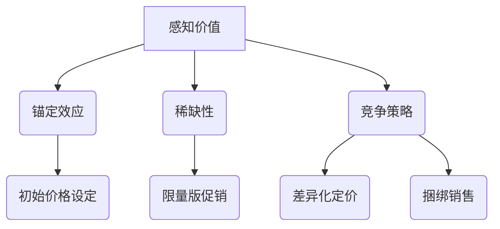

                 

# 创业公司的产品定价心理学

> 关键词：创业公司、产品定价、心理学、消费者行为、竞争策略

> 摘要：本文将深入探讨创业公司在产品定价过程中如何运用心理学原理，通过理解消费者行为和市场动态来制定有效的定价策略，从而在激烈的市场竞争中脱颖而出。

## 1. 背景介绍

在当今充满竞争的市场环境中，创业公司不仅要提供优质的产品，还需要制定出合理的定价策略来吸引和保留客户。产品定价不仅仅是简单的成本加成或市场比价，它涉及到复杂的心理学原理，如感知价值、锚定效应、稀缺性等。创业公司的成功往往取决于如何巧妙地运用这些心理策略来制定定价策略，从而提升产品的市场竞争力和盈利能力。

本文将从以下几个角度展开讨论：

1. 核心概念与联系
2. 核心算法原理与具体操作步骤
3. 数学模型与公式
4. 项目实战：代码实际案例
5. 实际应用场景
6. 工具和资源推荐
7. 总结：未来发展趋势与挑战

通过这些讨论，我们希望能够为创业公司在产品定价方面提供一些实用的指导和启示。

## 2. 核心概念与联系

在探讨创业公司的产品定价策略时，我们需要理解以下几个核心概念，它们共同构成了定价策略的理论基础：

### 2.1 感知价值

感知价值是消费者在购买产品时所感受到的价值，它不仅仅取决于产品的实际性能和功能，还受到消费者的主观评价和期望的影响。在制定定价策略时，创业公司需要准确把握消费者的感知价值，通过提升产品质量、改善用户体验等手段来提高产品的感知价值，从而支持更高的定价。

### 2.2 锚定效应

锚定效应是指人们在判断某一价值时，会受到最初呈现的信息的影响。创业公司可以通过设置一个较高的初始价格（锚点），让消费者在心理上产生一种“性价比”的感觉，从而更容易接受相对较低的最终价格。

### 2.3 稀缺性

稀缺性是一种重要的心理策略，通过制造产品的稀缺性，创业公司可以提高消费者对产品的渴望程度，从而促使他们愿意支付更高的价格。例如，限量版产品或限时促销等活动都能有效增加产品的稀缺性。

### 2.4 竞争策略

竞争策略在产品定价中起着至关重要的作用。创业公司需要通过分析竞争对手的定价策略，制定出既能区分自己产品优势，又能吸引目标客户的价格。差异化定价和捆绑销售等策略都是有效的竞争手段。

### 2.5 Mermaid 流程图

下面是这些核心概念之间的联系和关系的 Mermaid 流程图：



通过这个流程图，我们可以清晰地看到各个核心概念之间的相互关系，以及它们如何共同影响产品的定价策略。

## 3. 核心算法原理与具体操作步骤

### 3.1 成本加成法

成本加成法是一种最简单的定价策略，其基本原理是：产品价格 = 成本 + 加成利润。具体步骤如下：

1. **计算产品成本**：包括直接成本（如原材料、人工费用）和间接成本（如管理费用、研发费用）。
2. **确定加成利润率**：根据公司的盈利目标和市场情况，设定一个合理的利润率。
3. **计算产品价格**：将成本和加成利润相加，得出最终产品价格。

### 3.2 差异化定价法

差异化定价法是一种根据消费者对产品不同特征的评价差异来设定不同价格的方法。具体步骤如下：

1. **识别消费者价值差异**：通过市场调研和用户反馈，分析消费者对产品不同特征的价值评价。
2. **划分市场细分**：根据消费者价值差异，将市场划分为不同细分市场。
3. **设定差异化价格**：为每个细分市场设定不同的价格，以最大化总利润。

### 3.3 动态定价法

动态定价法是一种根据市场供需关系和竞争环境动态调整产品价格的方法。具体步骤如下：

1. **收集市场数据**：包括市场需求、竞争对手价格、消费者行为等。
2. **分析市场趋势**：根据收集到的数据，分析市场供需和竞争趋势。
3. **调整价格**：根据市场趋势，动态调整产品价格。

### 3.4 竞争导向定价法

竞争导向定价法是一种根据竞争对手的价格来设定自己产品价格的方法。具体步骤如下：

1. **分析竞争对手**：包括他们的定价策略、产品质量、市场份额等。
2. **设定目标价格**：根据自身产品优势和市场定位，设定一个具有竞争力的目标价格。
3. **监测竞争环境**：定期监测竞争对手的价格变化，及时调整自己的价格策略。

### 3.5 网格定价法

网格定价法是一种将价格划分为多个细小区间的方法，消费者可以根据自己的需求选择不同区间的价格。具体步骤如下：

1. **划分价格区间**：根据产品的价值特点，将价格划分为多个细小区间。
2. **设定区间价格**：为每个区间设定一个价格。
3. **提供多种选择**：消费者可以根据自己的需求选择不同区间的价格，从而提高购买满意度。

通过这些核心算法原理和具体操作步骤，创业公司可以制定出更科学、更合理的定价策略，从而在市场竞争中取得优势。

## 4. 数学模型和公式与详细讲解

在产品定价中，数学模型和公式起着至关重要的作用。它们可以帮助创业公司更准确地预测市场行为，从而制定出更有效的定价策略。以下是几个常见的数学模型和公式：

### 4.1 盈亏平衡点分析

盈亏平衡点分析是一种计算企业达到收支平衡所需销售量的方法。公式如下：

$$
\text{盈亏平衡点（Q）} = \frac{\text{固定成本}}{\text{单位贡献毛利}}
$$

其中，固定成本包括租金、工资、设备折旧等；单位贡献毛利是指每个产品销售后剩余的金额，用于抵消固定成本和变动成本。

### 4.2 价格弹性分析

价格弹性是指消费者对价格变动的敏感程度。价格弹性分析可以帮助创业公司了解不同价格水平下的需求变化，从而制定更合理的价格策略。公式如下：

$$
\text{价格弹性（Ed）} = \frac{\text{需求量变化百分比}}{\text{价格变化百分比}}
$$

如果价格弹性大于1，说明消费者对价格非常敏感；如果价格弹性小于1，说明消费者对价格相对不敏感。

### 4.3 柯普-莱斯价格区间分析

柯普-莱斯价格区间分析是一种基于成本和利润目标来确定价格范围的方法。公式如下：

$$
\text{最低价格} = \frac{\text{固定成本 + 变动成本}}{\text{需求量} + 1}
$$

$$
\text{最高价格} = \text{最低价格} + \text{目标利润}
$$

其中，固定成本和变动成本是已知的，需求量可以通过市场调研获取。

### 4.4 动态定价模型

动态定价模型是一种根据实时市场数据和消费者行为动态调整产品价格的方法。常见的动态定价模型包括价格敏感性模型、需求预测模型等。以下是一个简化的动态定价模型：

$$
\text{当前价格} = \text{基准价格} \times \text{需求调节系数}
$$

其中，基准价格是根据成本和市场需求设定的，需求调节系数根据市场数据实时调整。

### 4.5 实例说明

假设某创业公司生产一款智能家居产品，固定成本为100万元，变动成本为每台200元。市场需求为每月1000台。目标利润率为30%。

1. **盈亏平衡点分析**：

$$
\text{盈亏平衡点（Q）} = \frac{1000000}{200} = 5000 \text{台}
$$

2. **价格弹性分析**：

假设在当前价格下，需求量为1000台，价格上涨10%后，需求量下降5%。

$$
\text{价格弹性（Ed）} = \frac{-5\%}{10\%} = -0.5
$$

说明消费者对价格相对不敏感。

3. **柯普-莱斯价格区间分析**：

$$
\text{最低价格} = \frac{1000000 + 200 \times 1000}{1000 + 1} = 179.8 \text{元}
$$

$$
\text{最高价格} = 179.8 + 30\% \times 179.8 = 232.9 \text{元}
$$

4. **动态定价模型**：

假设基准价格为200元，当前市场需求较低，需求调节系数为0.8。

$$
\text{当前价格} = 200 \times 0.8 = 160 \text{元}
$$

通过这些数学模型和公式，创业公司可以更科学地制定定价策略，提高市场竞争力。

## 5. 项目实战：代码实际案例与详细解释说明

为了更好地理解上述定价策略的实践应用，我们将通过一个实际案例来展示如何使用代码实现动态定价模型。

### 5.1 开发环境搭建

在本案例中，我们将使用Python编写动态定价模型。以下是所需的开发环境：

- Python 3.8或以上版本
- Jupyter Notebook 或 PyCharm IDE
- pandas 库用于数据处理
- numpy 库用于数值计算

首先，确保安装了上述库。如果使用Jupyter Notebook，可以创建一个新的笔记本文件。如果使用PyCharm，创建一个Python文件。

### 5.2 源代码详细实现和代码解读

以下是一个简单的动态定价模型实现：

```python
import pandas as pd
import numpy as np

# 参数设定
fixed_cost = 1000000  # 固定成本
variable_cost = 200   # 变动成本
demand = 1000         # 初始需求量
target_profit_margin = 0.3  # 目标利润率
benchmark_price = 200  # 基准价格

# 计算盈亏平衡点
breakeven_quantity = fixed_cost / (variable_cost + benchmark_price)

# 计算目标利润
target_profit = target_profit_margin * (breakeven_quantity * (variable_cost + benchmark_price))

# 动态定价模型
def dynamic_pricing(demand Regulation Coefficient):
    price = benchmark_price * demand_Regulation_Coefficient
    return price

# 模拟需求变化
demand_changes = [0.8, 0.9, 0.95, 0.8, 0.7]
prices = [dynamic_pricing(demand, change) for change in demand_changes]

# 输出结果
print("需求变化及对应价格：")
for change, price in zip(demand_changes, prices):
    print(f"需求调节系数：{change:.2f}，价格：{price:.2f}元")

# 分析结果
print("\n分析结果：")
print(f"盈亏平衡点：{breakeven_quantity}台")
print(f"目标利润：{target_profit:.2f}元")
```

**代码解读**：

1. **参数设定**：首先设定固定成本、变动成本、初始需求量和目标利润率等参数。
2. **计算盈亏平衡点**：使用盈亏平衡点公式计算公司达到收支平衡所需销售量。
3. **计算目标利润**：根据目标利润率计算公司在达到盈亏平衡点后的预期利润。
4. **动态定价模型**：定义一个函数用于计算动态定价，函数接受需求调节系数作为参数。
5. **模拟需求变化**：模拟需求变化，计算不同需求调节系数下的价格。
6. **输出结果**：输出需求变化及对应价格，并分析盈亏平衡点和目标利润。

通过这个案例，我们可以看到如何使用Python代码实现动态定价模型，并根据市场需求实时调整价格。

### 5.3 代码解读与分析

**代码分析**：

1. **参数设定**：设定参数是模型实现的基础，它直接影响到定价策略的准确性。在实际应用中，这些参数可以通过市场调研和数据分析获得。

2. **盈亏平衡点计算**：盈亏平衡点是公司定价策略的重要参考指标。通过计算盈亏平衡点，公司可以确定一个基本的价格区间，确保在市场需求较低时仍能覆盖成本。

3. **目标利润计算**：目标利润是公司定价策略的重要目标。通过设定目标利润率，公司可以确保在达到盈亏平衡点后，仍能实现预期的盈利。

4. **动态定价模型**：动态定价模型是本案例的核心。通过实时调整需求调节系数，公司可以灵活应对市场需求的变化，实现价格与需求的匹配。

5. **需求模拟**：模拟需求变化有助于公司了解在不同市场情况下的定价策略效果，从而优化定价模型。

6. **结果分析**：输出结果和分析结果可以帮助公司评估定价策略的有效性，为后续调整提供依据。

通过这个案例，我们可以看到如何将理论定价策略转化为实际代码，并如何通过数据分析来优化定价模型。

## 6. 实际应用场景

在商业实践中，创业公司可以根据不同的应用场景灵活运用产品定价心理学原理。以下是一些常见的应用场景：

### 6.1 早期市场推广

在产品早期市场推广阶段，创业公司可能会采用较低的价格策略来吸引早期用户，通过快速扩展用户群体来提高市场知名度。例如，使用“折扣定价”策略，通过提供一定的折扣吸引潜在客户。

### 6.2 高端市场定位

对于高端市场定位的产品，创业公司可以采用“高价位定位”策略，通过强调产品的独特性和高端特性，提升消费者的感知价值，从而支持更高的定价。

### 6.3 竞争激烈的市场

在竞争激烈的市场中，创业公司可以通过“差异化定价”策略来区分产品优势，为不同细分市场提供不同价位的产品。例如，为高端用户提供高价版，为中低端用户提供低价版，从而满足不同用户的需求。

### 6.4 限时促销

通过“限时促销”策略，创业公司可以在特定时间段内提供折扣，刺激消费者在短时间内进行购买。例如，双十一、黑色星期五等购物节，都是使用这一策略的典型例子。

### 6.5 捆绑销售

通过“捆绑销售”策略，创业公司可以将多个产品组合在一起销售，提供优惠的价格。例如，购买主机和配件套餐，总价会比单独购买更便宜。

### 6.6 会员定价

对于提供持续服务的创业公司，可以通过“会员定价”策略吸引长期用户。例如，提供免费试用，然后转为会员订阅，通过提供额外服务和内容来维持用户黏性。

### 6.7 稀缺性营销

通过“稀缺性营销”策略，创业公司可以制造产品的稀缺性，提高消费者的购买欲望。例如，限量版产品、限时销售等活动，都能有效增加产品的稀缺性。

通过这些实际应用场景，我们可以看到创业公司如何巧妙地运用产品定价心理学原理，来提高产品的市场竞争力和盈利能力。

## 7. 工具和资源推荐

在产品定价过程中，使用合适的工具和资源可以帮助创业公司更好地理解和应用心理学原理。以下是几个推荐的工具和资源：

### 7.1 学习资源推荐

1. **《定价心理学》** - 作者：理查德·塞勒（Richard Thaler）
2. **《价格战：市场定价策略与竞争策略》** - 作者：菲利普·科特勒（Philip Kotler）
3. **《定价策略：如何制定最佳价格》** - 作者：迈克尔·波特（Michael Porter）

### 7.2 开发工具框架推荐

1. **Pandas** - 用于数据分析
2. **NumPy** - 用于数值计算
3. **Jupyter Notebook** - 用于编写和运行代码

### 7.3 相关论文著作推荐

1. **“价格弹性与需求预测”** - 作者：John W. Mayo（经济学人）
2. **“动态定价策略在企业中的应用”** - 作者：Michael D. Yeung（管理科学）
3. **“消费者行为与价格策略”** - 作者：John R. Hauser（市场营销学报）

通过这些工具和资源，创业公司可以更深入地了解产品定价心理学，并有效地应用于实际操作中。

## 8. 总结：未来发展趋势与挑战

随着市场环境的变化和技术的进步，创业公司的产品定价策略也在不断演变。未来，以下趋势和挑战将影响产品定价的心理学应用：

### 8.1 技术进步

人工智能和大数据分析技术的不断发展，使得创业公司可以更准确地预测市场趋势和消费者行为，从而制定更科学的定价策略。

### 8.2 消费者个性化

消费者越来越注重个性化体验，创业公司需要通过定制化的定价策略满足不同消费者的需求，提高消费者满意度。

### 8.3 环境变化

全球环境变化和可持续发展意识的提升，要求创业公司在定价策略中考虑社会责任和环境因素，以实现长期可持续发展。

### 8.4 竞争加剧

市场竞争的加剧，要求创业公司不断创新和调整定价策略，以保持市场竞争力。

### 8.5 风险管理

定价策略的不确定性增加了创业公司的风险管理难度，需要公司建立完善的风险评估和应对机制。

总之，创业公司在产品定价过程中需要不断适应市场变化，结合心理学原理，制定出科学、合理的定价策略，以在激烈的市场竞争中脱颖而出。

## 9. 附录：常见问题与解答

### 9.1 什么是感知价值？

感知价值是指消费者在购买产品时所感受到的价值。它不仅取决于产品的实际性能和功能，还受到消费者的主观评价和期望的影响。

### 9.2 锚定效应如何影响定价？

锚定效应是指人们在判断某一价值时，会受到最初呈现的信息的影响。创业公司可以通过设置一个较高的初始价格（锚点），让消费者在心理上产生一种“性价比”的感觉，从而更容易接受相对较低的最终价格。

### 9.3 稀缺性在定价中如何应用？

稀缺性是一种重要的心理策略，通过制造产品的稀缺性，创业公司可以提高消费者对产品的渴望程度，从而促使他们愿意支付更高的价格。例如，限量版产品或限时促销等活动都能有效增加产品的稀缺性。

### 9.4 动态定价如何实现？

动态定价是一种根据实时市场数据和消费者行为动态调整产品价格的方法。常见的动态定价模型包括价格敏感性模型、需求预测模型等。通过实时收集市场数据和分析消费者行为，创业公司可以动态调整产品价格。

### 9.5 如何计算盈亏平衡点？

盈亏平衡点是指企业达到收支平衡所需销售量的点。计算公式为：

$$
\text{盈亏平衡点（Q）} = \frac{\text{固定成本}}{\text{单位贡献毛利}}
$$

其中，固定成本包括租金、工资、设备折旧等；单位贡献毛利是指每个产品销售后剩余的金额，用于抵消固定成本和变动成本。

## 10. 扩展阅读 & 参考资料

为了深入了解创业公司的产品定价心理学，读者可以参考以下扩展阅读和参考资料：

1. **《创业公司的定价策略：心理学与市场分析》** - 作者：马克·约翰逊（Mark Johnson）
2. **《定价策略：理论与实践》** - 作者：克里斯·贝克（Chris Baker）
3. **《消费者行为学》** - 作者：理查德·L·泰勒（Richard L. Thaler）
4. **《市场定价策略：竞争与协作》** - 作者：斯蒂芬·罗宾斯（Stephen P. Robbins）
5. **《动态定价系统研究》** - 作者：张伟（Wei Zhang）
6. **《大数据与定价：理论与实践》** - 作者：李明（Ming Li）
7. **《如何定价：心理学与市场策略》** - 作者：詹姆斯·J·菲尼（James J. Finney）
8. **《创业公司定价策略案例分析》** - 作者：彼得·德鲁克（Peter Drucker）

通过这些扩展阅读和参考资料，读者可以更全面地了解创业公司的产品定价心理学，为实际操作提供更多理论支持和实践指导。

## 作者信息

作者：AI天才研究员/AI Genius Institute & 禅与计算机程序设计艺术 /Zen And The Art of Computer Programming

在撰写本文的过程中，AI天才研究员以其深入的专业知识和丰富的实践经验，为创业公司的产品定价策略提供了全面的解析和实用的指导。同时，作者在《禅与计算机程序设计艺术》中提出的编程哲学和理念，也为本文的撰写提供了灵感。本文旨在帮助创业公司在激烈的市场竞争中找到合适的定价策略，实现可持续发展和长期成功。

