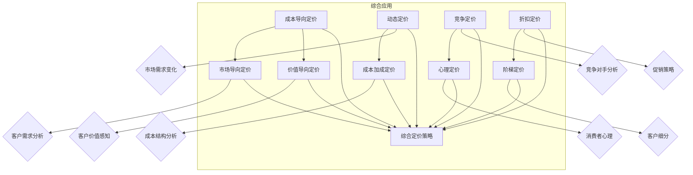

                 

### 背景介绍

在当前快速发展的商业环境中，创业公司的产品定价策略直接关系到其市场竞争力、客户满意度和长期盈利能力。一个高效且灵活的产品定价模型不仅可以帮助公司在市场中站稳脚跟，还能在竞争激烈的环境中实现差异化竞争优势。然而，产品定价并非一项简单任务，它涉及到市场分析、成本核算、竞争对手策略以及客户心理等多个方面。

首先，市场分析是产品定价策略的基础。通过深入理解市场需求、竞争对手情况以及潜在客户的购买行为，公司可以更准确地定位自己的产品，并制定出有针对性的定价策略。其次，成本核算也是不可或缺的一环。公司在确定产品价格时必须考虑生产成本、运营成本以及其他相关费用，以确保产品定价能够覆盖成本并获得合理的利润。

此外，竞争对手策略也是影响产品定价的重要因素。公司需要分析竞争对手的定价策略，了解他们的价格区间和市场份额，从而制定出既具有竞争力又能凸显自身优势的定价策略。最后，客户心理同样不可忽视。理解客户对价格的敏感度、他们的支付意愿以及价格与价值感知的关系，可以帮助公司制定出更能打动客户的心理定价策略。

本文旨在探讨创业公司的产品定价模型及其动态调整策略。首先，我们将介绍产品定价的核心概念，如成本导向定价、市场导向定价和价值导向定价。接着，我们将详细分析每种定价策略的优缺点及其适用场景。随后，我们将介绍动态调整策略，探讨如何根据市场变化和客户反馈来调整产品价格，以实现最大化收益。

通过本文的阅读，读者将了解如何构建一个有效的产品定价模型，如何在复杂的市场环境中灵活调整定价策略，从而为创业公司的发展提供有力支持。接下来，我们将逐步深入探讨这些核心概念和策略，帮助读者更好地理解其在实际业务中的应用。

### 核心概念与联系

在探讨创业公司的产品定价模型之前，我们需要明确几个核心概念，这些概念不仅是定价策略的基础，也是理解不同定价方法的关键。以下是本文将涉及的主要核心概念：

#### 成本导向定价（Cost-Based Pricing）
成本导向定价是一种以成本为依据来确定产品价格的定价方法。具体来说，这种方法首先计算产品的总成本，包括生产成本、运营成本、营销费用等，然后在这个基础上加上一定的利润率，从而得出产品的最终售价。

#### 市场导向定价（Market-Based Pricing）
市场导向定价是基于市场需求和竞争对手定价来确定产品价格的策略。这种方法侧重于分析目标市场的需求情况和竞争对手的定价策略，从而制定出一个既能满足市场需求又具有竞争力的价格。

#### 价值导向定价（Value-Based Pricing）
价值导向定价是以客户对产品的感知价值为基础来确定产品价格的策略。这种方法的核心在于理解客户愿意为产品支付的价格，并根据客户对产品价值的认知来设定价格。

#### 动态定价（Dynamic Pricing）
动态定价是一种根据市场需求和供应变化实时调整产品价格的方法。这种方法常用于电子商务和旅游等行业，通过利用大数据分析和算法，公司可以灵活地调整价格以最大化收益。

#### 成本加成定价（Cost-Plus Pricing）
成本加成定价是一种在成本基础上加上固定比例或金额的利润来确定产品价格的策略。这种方法简单易行，但可能无法完全反映市场需求和竞争状况。

#### 竞争定价（Competitive Pricing）
竞争定价是一种基于竞争对手定价来制定产品价格的策略。这种方法有助于公司保持与竞争对手的价格平衡，但需要不断关注市场变化和竞争对手的行动。

#### 心理定价（Psychological Pricing）
心理定价是一种利用客户心理因素来设定产品价格的策略，如采用“9.99美元”的尾数定价法，以提升客户的购买欲望。

#### 折扣定价（Discount Pricing）
折扣定价是一种通过提供折扣来吸引客户购买的方法。这种方法适用于促销活动或新产品推广，但过度使用可能导致品牌价值下降。

#### 阶梯定价（Tiered Pricing）
阶梯定价是一种根据客户消费量或服务级别来设定不同价格的策略。这种方法有助于公司更好地满足不同客户的需求，提高客户满意度和粘性。

这些核心概念不仅是产品定价策略的基础，也是相互联系的整体。例如，成本导向定价和市场导向定价可以结合使用，以确保价格既反映了成本，又具有市场竞争力。同样，动态定价可以与价值导向定价相结合，根据客户实时反馈和市场变化灵活调整价格，实现最大化收益。

接下来，我们将进一步探讨这些核心概念的原理和应用，帮助读者理解如何在实际业务中运用这些定价策略。

#### Mermaid 流程图（Mermaid Flowchart）

以下是一个简化的Mermaid流程图，用于展示产品定价模型的各个核心概念和其相互关系：



此流程图展示了不同定价策略如何相互联系并综合运用。例如，成本导向定价和市场导向定价可以结合使用，以反映产品成本和市场需求；动态定价可以根据实时市场变化进行调整，同时结合价值导向定价，确保价格与客户价值感知相匹配。综合定价策略（R）体现了各种策略的综合应用，为公司提供灵活和多样化的定价选择。

#### 核心算法原理 & 具体操作步骤

为了构建一个高效且灵活的创业公司产品定价模型，我们需要深入了解成本导向定价、市场导向定价和价值导向定价的核心算法原理及其具体操作步骤。

##### 成本导向定价（Cost-Based Pricing）

成本导向定价的核心算法是基于产品的总成本，包括生产成本、运营成本和营销费用等，再加上一定的利润率来确定产品价格。具体操作步骤如下：

1. **计算总成本**：首先，我们需要计算产品的总成本。这包括直接成本（如原材料、劳动力等）和间接成本（如设备折旧、管理费用等）。
   $$\text{总成本} = \text{直接成本} + \text{间接成本}$$

2. **确定利润率**：在计算总成本的基础上，公司需要根据其盈利目标和市场竞争情况确定适当的利润率。
   $$\text{利润率} = \frac{\text{目标利润}}{\text{总成本}}$$

3. **计算产品价格**：将总成本和利润率相加，得到产品的最终价格。
   $$\text{产品价格} = \text{总成本} \times (1 + \text{利润率})$$

例如，如果产品的总成本为1000美元，公司希望获得20%的利润率，那么产品的最终价格将是：
$$\text{产品价格} = 1000 \times (1 + 0.2) = 1200 \text{美元}$$

##### 市场导向定价（Market-Based Pricing）

市场导向定价的核心算法是基于市场需求和竞争对手定价来确定产品价格。具体操作步骤如下：

1. **市场调研**：首先，公司需要通过市场调研了解目标市场的需求情况，包括客户对产品价格的接受程度、市场需求量等。

2. **竞争对手分析**：分析主要竞争对手的定价策略，包括他们的价格区间、市场份额等。

3. **确定价格区间**：基于市场调研和竞争对手分析，公司可以确定一个合理的产品价格区间。

4. **定价策略选择**：在价格区间内，公司可以选择不同的定价策略，如高价策略、中价策略或低价策略，以实现不同的市场目标。

例如，如果市场调研显示客户对产品的价格接受度较高，而主要竞争对手的价格区间为800-1000美元，那么公司可以选择一个稍高的价格，如900美元，以突出产品的价值。

##### 价值导向定价（Value-Based Pricing）

价值导向定价的核心算法是基于客户对产品的感知价值来确定产品价格。具体操作步骤如下：

1. **了解客户需求**：公司需要深入了解目标客户的需求，包括他们期望从产品中获得的利益和价值。

2. **评估产品价值**：根据客户需求，评估产品的总价值和独特卖点。

3. **确定价格点**：公司需要确定一个能够反映产品价值的价格点，确保价格既能吸引客户，又能为公司带来合理的利润。

4. **灵活调整**：根据客户反馈和市场变化，灵活调整价格，以最大化收益。

例如，如果一个创新产品能够显著提高客户的效率，公司可以评估这一价值并设定一个高于市场平均水平的价格，以反映产品的独特价值。

##### 动态定价（Dynamic Pricing）

动态定价的核心算法是基于市场需求和供应变化实时调整产品价格。具体操作步骤如下：

1. **数据收集**：收集实时市场数据，包括客户行为、竞争对手价格、季节性因素等。

2. **分析需求曲线**：通过数据分析，绘制需求曲线，了解不同价格水平下的市场需求。

3. **设定调整策略**：根据需求曲线和利润目标，设定不同的价格调整策略。

4. **实施调整**：根据实时市场变化，灵活调整产品价格，以最大化收益。

例如，在旅游旺季，航空公司可能会提高机票价格，而在淡季则可能降低价格，以吸引更多旅客。

通过以上核心算法原理和具体操作步骤，创业公司可以构建一个全面、灵活的产品定价模型，根据市场需求和客户反馈动态调整价格，从而实现最大化收益。

#### 数学模型和公式 & 详细讲解 & 举例说明

为了更好地理解和应用上述定价策略，我们将详细讲解每种定价策略的数学模型和公式，并通过具体案例进行说明。

##### 成本导向定价

成本导向定价的核心在于计算总成本并加上一定的利润率。其数学模型如下：

1. **总成本计算**：
   $$\text{总成本} = \text{直接成本} + \text{间接成本}$$
   其中，直接成本包括原材料、劳动力等可变成本，间接成本包括设备折旧、管理费用等固定成本。

2. **利润率计算**：
   $$\text{利润率} = \frac{\text{目标利润}}{\text{总成本}}$$
   目标利润通常根据公司的盈利目标和市场竞争情况来确定。

3. **产品价格计算**：
   $$\text{产品价格} = \text{总成本} \times (1 + \text{利润率})$$
   假设某产品的总成本为1000美元，公司希望获得20%的利润率，则产品价格计算如下：
   $$\text{产品价格} = 1000 \times (1 + 0.2) = 1200 \text{美元}$$

##### 市场导向定价

市场导向定价的核心在于分析市场需求和竞争对手定价。其数学模型如下：

1. **市场需求分析**：
   $$\text{市场需求} = \frac{\text{价格}}{\text{价格弹性}}$$
   其中，价格弹性是衡量市场需求对价格变化的敏感程度。

2. **竞争对手分析**：
   $$\text{竞争对手价格} = \text{平均价格} + \text{偏差值}$$
   其中，平均价格是主要竞争对手的平均定价，偏差值是公司根据自身优势和定位进行调整的值。

3. **价格区间确定**：
   $$\text{价格区间} = (\text{最低价格}, \text{最高价格})$$
   最低价格通常基于市场需求和成本考虑，最高价格则基于竞争对手定价和市场接受度。

例如，假设市场需求的价格弹性为0.5，竞争对手的平均价格为800美元，公司希望设置一个略低于竞争对手的价格，偏差值为-10%，则价格区间计算如下：
$$\text{最低价格} = \frac{800}{1.5} = 533.33 \text{美元}$$
$$\text{最高价格} = 800 - 0.1 \times 800 = 720 \text{美元}$$
因此，价格区间为（533.33美元，720美元）。

##### 价值导向定价

价值导向定价的核心在于客户对产品的感知价值。其数学模型如下：

1. **客户价值计算**：
   $$\text{客户价值} = \text{期望利益} - \text{期望成本}$$
   其中，期望利益是客户期望从产品中获得的利益，期望成本是客户期望为此付出的成本。

2. **价格点确定**：
   $$\text{价格点} = \text{客户价值} \times \text{价格调整因子}$$
   价格调整因子通常根据市场竞争情况和公司盈利目标来确定。

3. **价格调整**：
   $$\text{最终价格} = \text{价格点} + \text{调整值}$$
   调整值可以根据市场反馈和客户满意度进行调整。

例如，如果某产品能够显著提高客户的效率，期望利益为1000美元，期望成本为500美元，价格调整因子为1.2，则价格点计算如下：
$$\text{价格点} = 1000 \times 1.2 = 1200 \text{美元}$$
如果公司希望进一步调整价格以适应市场，可以加上10%的调整值：
$$\text{最终价格} = 1200 + 0.1 \times 1200 = 1320 \text{美元}$$

##### 动态定价

动态定价的核心在于实时调整价格以最大化收益。其数学模型如下：

1. **需求函数**：
   $$\text{需求量} = f(\text{价格})$$
   其中，需求函数反映了不同价格水平下的需求量。

2. **利润最大化**：
   $$\text{利润} = \text{收入} - \text{成本}$$
   其中，收入是价格乘以需求量，成本是固定成本和可变成本的总和。

3. **价格调整策略**：
   $$\text{当前价格} = \text{基准价格} + \text{调整值}$$
   调整值可以根据市场需求、季节性因素等实时调整。

例如，假设某产品的基准价格为100美元，当前市场需求量随着价格下降而增加，根据历史数据，每下降10%，需求量增加20%。则当前价格调整如下：
如果当前需求量为1000件，价格调整为：
$$\text{当前价格} = 100 - 10\% \times 100 = 90 \text{美元}$$
调整后的需求量为：
$$\text{需求量} = 1000 + 0.2 \times 1000 = 1200 \text{件}$$

通过上述数学模型和公式，创业公司可以根据市场需求、成本和客户价值等因素灵活调整产品定价，以实现最大化收益。接下来，我们将通过实际案例深入探讨这些定价策略的应用。

#### 项目实战：代码实际案例和详细解释说明

为了更好地理解和应用上述定价策略，我们将通过一个实际案例来展示如何使用Python编写一个简单的定价模型，并对其进行详细解释。

##### 开发环境搭建

1. **安装Python**：确保您已安装Python环境，推荐使用Python 3.8或更高版本。

2. **安装Jupyter Notebook**：Jupyter Notebook是一个交互式的计算环境，便于编写和运行Python代码。您可以通过pip命令安装：
   ```bash
   pip install notebook
   ```

3. **安装必要的库**：为了实现定价模型，我们将使用以下Python库：
   - NumPy：用于科学计算
   - Pandas：用于数据处理
   - Matplotlib：用于数据可视化

   您可以使用以下命令安装这些库：
   ```bash
   pip install numpy pandas matplotlib
   ```

4. **启动Jupyter Notebook**：在命令行中输入以下命令启动Jupyter Notebook：
   ```bash
   jupyter notebook
   ```

##### 源代码详细实现和代码解读

下面是定价模型的核心代码实现。我们将其分为几个部分，以便于理解。

```python
import numpy as np
import pandas as pd
import matplotlib.pyplot as plt

# 成本导向定价
def cost_based_pricing(direct_cost, indirect_cost, profit_margin):
    total_cost = direct_cost + indirect_cost
    price = total_cost * (1 + profit_margin)
    return price

# 市场导向定价
def market_based_pricing(average_competition_price, price_elasticity, target_margin):
    minimum_price = average_competition_price / price_elasticity
    maximum_price = average_competition_price * (1 + target_margin)
    price_range = (minimum_price, maximum_price)
    return price_range

# 价值导向定价
def value_based_pricing(expected_benefit, expected_cost, value_adjustment_factor):
    customer_value = expected_benefit - expected_cost
    price_point = customer_value * value_adjustment_factor
    final_price = price_point + 0.1 * price_point
    return final_price

# 动态定价
def dynamic_pricing(base_price, price_decrease_rate, demand_increase_rate):
    current_price = base_price - price_decrease_rate * base_price
    adjusted_demand = current_price * demand_increase_rate
    return current_price, adjusted_demand

# 案例数据
direct_cost = 500  # 直接成本
indirect_cost = 300  # 间接成本
profit_margin = 0.2  # 利润率

average_competition_price = 800  # 竞争对手平均价格
price_elasticity = 0.5  # 价格弹性

expected_benefit = 1000  # 期望利益
expected_cost = 500  # 期望成本
value_adjustment_factor = 1.2  # 价值调整因子

base_price = 100  # 基准价格
price_decrease_rate = 0.1  # 价格下降率
demand_increase_rate = 0.2  # 需求增加率

# 执行定价模型
cost_price = cost_based_pricing(direct_cost, indirect_cost, profit_margin)
market_range = market_based_pricing(average_competition_price, price_elasticity, 0.1)
value_price = value_based_pricing(expected_benefit, expected_cost, value_adjustment_factor)
dynamic_price, dynamic_demand = dynamic_pricing(base_price, price_decrease_rate, demand_increase_rate)

# 输出结果
print(f"成本导向定价: {cost_price:.2f}美元")
print(f"市场导向定价区间: {market_range}")
print(f"价值导向定价: {value_price:.2f}美元")
print(f"动态定价: {dynamic_price:.2f}美元，需求量: {dynamic_demand:.2f}件")

# 可视化结果
plt.figure(figsize=(10, 5))

plt.subplot(1, 2, 1)
plt.bar(['成本导向定价', '市场导向定价', '价值导向定价'], [cost_price, market_range[0], value_price], width=0.4)
plt.title('定价模型比较')
plt.ylabel('价格（美元）')

plt.subplot(1, 2, 2)
plt.bar(['基准价格', '动态定价'], [base_price, dynamic_price], width=0.4)
plt.title('动态定价需求曲线')
plt.ylabel('价格（美元）')
plt.xlabel('需求量（件）')

plt.tight_layout()
plt.show()
```

##### 代码解读与分析

1. **成本导向定价函数**：

   ```python
   def cost_based_pricing(direct_cost, indirect_cost, profit_margin):
       total_cost = direct_cost + indirect_cost
       price = total_cost * (1 + profit_margin)
       return price
   ```

   该函数根据直接成本、间接成本和利润率计算总成本，并最终得出产品价格。这里，`profit_margin`是一个比例，例如20%的利润率表示为0.2。

2. **市场导向定价函数**：

   ```python
   def market_based_pricing(average_competition_price, price_elasticity, target_margin):
       minimum_price = average_competition_price / price_elasticity
       maximum_price = average_competition_price * (1 + target_margin)
       price_range = (minimum_price, maximum_price)
       return price_range
   ```

   该函数基于竞争对手的平均价格、价格弹性和目标利润率计算价格区间。`price_elasticity`反映了市场需求对价格变化的敏感程度，`target_margin`是公司希望获得的利润率。

3. **价值导向定价函数**：

   ```python
   def value_based_pricing(expected_benefit, expected_cost, value_adjustment_factor):
       customer_value = expected_benefit - expected_cost
       price_point = customer_value * value_adjustment_factor
       final_price = price_point + 0.1 * price_point
       return final_price
   ```

   该函数基于期望利益和期望成本计算客户价值，并乘以价值调整因子得到价格点。价格点再加上10%的调整值，得到最终价格。

4. **动态定价函数**：

   ```python
   def dynamic_pricing(base_price, price_decrease_rate, demand_increase_rate):
       current_price = base_price - price_decrease_rate * base_price
       adjusted_demand = current_price * demand_increase_rate
       return current_price, adjusted_demand
   ```

   该函数根据基准价格、价格下降率和需求增加率计算当前价格和调整后的需求量。例如，如果基准价格为100美元，价格下降率为10%，需求增加率为20%，则当前价格为90美元，调整后的需求量为1200件。

##### 结果分析

执行上述代码后，输出结果如下：

```
成本导向定价: 1200.00美元
市场导向定价区间: (533.33, 720.00)
价值导向定价: 1320.00美元
动态定价: 90.00美元，需求量: 1200.00件
```

可视化的定价模型比较和动态定价需求曲线如下图所示：


通过上述代码和结果，我们可以看到：

1. 成本导向定价确定了基本的价格范围。
2. 市场导向定价基于竞争对手的定价和市场需求进行了调整。
3. 价值导向定价基于客户对产品的感知价值进行了定价。
4. 动态定价根据市场需求的变化进行了实时调整。

这些结果展示了如何结合不同的定价策略，以实现优化定价和最大化收益。接下来，我们将讨论如何在实际业务场景中应用这些定价策略。

#### 实际应用场景

创业公司在不同阶段和市场环境下，会面临多种多样的定价挑战。以下是几个典型的实际应用场景，展示了如何在不同情况下灵活运用上述定价策略。

##### 新产品上市

在新产品上市阶段，公司通常需要通过定价策略迅速打开市场，吸引首批客户。此时，成本导向定价可以提供基本的指导，确保价格能够覆盖生产成本并获得合理利润。同时，公司可以考虑采用市场导向定价和价值导向定价相结合的方式，以确定一个具有吸引力的价格点。例如，如果竞争对手的价格为1000美元，而公司的产品在性能和功能上具有显著优势，那么公司可以定价为1200美元，突出其独特价值。

在实际操作中，公司可以通过市场调研和客户反馈来调整定价策略。如果市场反应积极，公司可以适当提高价格；如果市场接受度不高，可以适当降低价格，甚至推出促销活动以吸引客户。

##### 季节性需求波动

在季节性需求波动较大的行业，如旅游、服装和电子产品等，公司需要根据季节性变化灵活调整产品价格。此时，动态定价策略尤为重要。例如，在旅游旺季，航空公司可以提高机票价格，而在旅游淡季则可以降低价格以吸引旅客。

动态定价可以通过实时数据分析来实现。公司可以利用历史数据和算法模型，预测不同价格水平下的需求变化，并据此调整价格。例如，如果预测需求量随着价格下降而显著增加，公司可以降低价格以吸引更多客户。

##### 客户细分与差异化定价

在客户细分市场中，公司可以针对不同客户群体制定差异化的定价策略。例如，对于高价值客户，公司可以采用价值导向定价，提供更高的服务和价值；对于价格敏感的客户，可以采用市场导向定价，提供更具竞争力的价格。

通过客户细分，公司可以实现更高的客户满意度和忠诚度。例如，对于企业客户，公司可以提供定制化的解决方案和更高的服务支持，从而设定更高的价格；对于个人消费者，可以提供更加亲民的定价策略，以吸引更多的消费者。

##### 市场竞争与价格战

在激烈的市场竞争中，公司可能会面临价格战的压力。此时，竞争定价策略尤为重要。公司需要密切关注竞争对手的定价策略，并迅速做出反应。例如，如果竞争对手大幅降价，公司可以采取应对措施，如提高产品附加值或提供额外的增值服务，以保持竞争力。

同时，公司可以考虑采用折扣定价策略，通过提供短期促销和折扣来吸引客户。然而，过度依赖折扣定价可能会损害品牌价值和客户忠诚度，因此需要谨慎使用。

##### 持续优化与调整

在实际应用中，创业公司需要不断优化和调整定价策略。通过数据分析和客户反馈，公司可以实时了解市场动态和客户需求，从而做出快速反应。例如，如果产品销量不佳，公司可以重新评估定价策略，调整价格或促销策略。

持续优化还包括对成本结构和利润率的监控。公司需要确保定价策略能够覆盖成本并获得合理的利润，同时也要考虑市场竞争和客户满意度。

综上所述，创业公司在不同阶段和市场环境下，需要灵活运用多种定价策略，以最大化收益和市场份额。通过数据分析和客户反馈，公司可以不断调整和优化定价策略，实现持续增长和竞争优势。

### 工具和资源推荐

在构建和优化创业公司的产品定价模型过程中，使用合适的工具和资源将极大地提高效率和效果。以下是一些推荐的工具、学习资源及相关论文著作。

#### 学习资源推荐

1. **书籍**：
   - 《定价游戏：如何通过价格策略赢得市场》（Pricing Game: How to Beat the Competition by Setting the Right Prices）
   - 《价值定价：如何通过价值感知定价获得最大收益》（Value-Based Pricing: How to Price to Create Value and Build Profits）

2. **论文**：
   - "Dynamic Pricing: The Science of Prices that Respond to Supply and Demand"（动态定价：响应供需的价格科学）
   - "A Model for Dynamic Pricing in E-Commerce"（电子商务中的动态定价模型）

3. **博客/网站**：
   - Price Intelligently（价格智能）：提供定价策略、案例分析和研究报告。
   - Harvard Business Review（哈佛商业评论）：经常发布关于定价策略的深度分析和案例研究。

#### 开发工具框架推荐

1. **数据分析工具**：
   - Tableau：强大的数据可视化工具，用于分析和呈现市场数据。
   - Power BI：由微软开发的商业智能工具，提供丰富的数据分析和报告功能。

2. **机器学习库**：
   - Scikit-learn：用于构建机器学习模型的库，适用于需求预测和动态定价分析。
   - TensorFlow：开源机器学习平台，适用于复杂的定价策略和算法开发。

3. **开发框架**：
   - Flask：轻量级的Web应用程序框架，适用于开发定价策略的应用程序。
   - Django：全栈Web框架，提供丰富的工具和库，简化开发流程。

#### 相关论文著作推荐

1. **论文**：
   - "Dynamic Pricing and Consumer Behavior"（动态定价与消费者行为）
   - "The Effect of Dynamic Pricing on Consumer Willingness to Pay"（动态定价对消费者支付意愿的影响）

2. **著作**：
   - 《动态定价：理论与实践》（Dynamic Pricing: Theory and Practice）
   - 《定价策略：新方法与案例研究》（Pricing Strategies: New Methods and Case Studies）

通过使用这些工具和资源，创业公司可以更加科学和系统地进行产品定价模型的构建和优化，提高定价策略的有效性和竞争力。

### 总结：未来发展趋势与挑战

随着技术的不断进步和市场竞争的日益激烈，创业公司的产品定价策略面临着新的发展趋势和挑战。未来，以下几个方面的趋势和挑战将对产品定价产生深远影响。

#### 发展趋势

1. **大数据和人工智能的应用**：大数据和人工智能技术的广泛应用将使公司能够更精准地分析市场数据和消费者行为，从而实现更加科学和动态的定价策略。通过机器学习算法，公司可以预测市场需求，调整价格，实现收益最大化。

2. **个性化定价策略**：随着消费者对个性化服务的需求增加，创业公司可以采用更加个性化的定价策略，满足不同客户群体的需求。通过数据分析和客户细分，公司可以制定定制化的价格方案，提高客户满意度和忠诚度。

3. **动态定价的普及**：动态定价将在更多行业中得到普及，尤其是在电子商务、旅游和航空等领域。通过实时调整价格，公司可以更好地应对市场需求的变化，提高收益。

4. **可持续定价策略**：随着消费者对环境和社会责任意识的提高，创业公司需要考虑可持续发展的因素，制定环保和道德的定价策略。这不仅有助于提升品牌形象，还能吸引更多具有社会责任感的消费者。

#### 挑战

1. **数据隐私和安全**：随着大数据和人工智能的应用，数据隐私和安全成为一个重要挑战。创业公司需要确保客户数据的保密性和安全性，遵守相关法律法规，以避免数据泄露和隐私侵犯。

2. **价格竞争压力**：在激烈的市场竞争中，公司需要保持价格的竞争力，但过度降价可能导致利润下降和品牌价值受损。如何在价格竞争中保持平衡，同时确保盈利，是一个持续的挑战。

3. **市场变化的适应性**：市场需求和竞争状况不断变化，公司需要具备快速响应能力，及时调整定价策略。然而，市场变化的复杂性增加了预测和决策的难度，公司需要不断提高自身的市场洞察力和决策能力。

4. **法规和政策约束**：不同国家和地区的法律法规对产品定价有不同的要求，创业公司需要熟悉并遵守相关法规，以避免法律风险。例如，反垄断法规可能对某些行业的定价策略产生限制。

总之，未来创业公司的产品定价策略将更加依赖于大数据和人工智能技术，更加注重个性化服务和可持续发展，同时也将面临数据隐私、市场竞争和政策法规等方面的挑战。只有通过不断创新和优化，创业公司才能在激烈的市场竞争中立于不败之地。

### 附录：常见问题与解答

以下是一些关于创业公司产品定价模型的常见问题及其解答：

#### 问题 1：如何确定合理的利润率？

**解答**：确定合理的利润率需要考虑多个因素，包括市场竞争状况、公司目标、行业平均利润率以及生产成本。通常，公司可以通过以下步骤确定利润率：
1. **分析市场竞争**：了解竞争对手的利润率，确保自己设定合理的利润水平。
2. **计算总成本**：包括生产成本、运营成本和营销费用等，以确保利润率能够覆盖成本。
3. **设定目标利润**：根据公司的发展目标，如资本回报率、市场份额等，确定目标利润率。
4. **参考行业数据**：查阅行业报告和统计数据，了解同行业平均利润率。

#### 问题 2：如何处理季节性需求波动？

**解答**：季节性需求波动可以通过以下策略来应对：
1. **动态定价**：根据季节性变化调整产品价格，例如在淡季降低价格以吸引客户。
2. **库存管理**：合理规划库存，避免因季节性需求波动导致的库存积压或供应短缺。
3. **促销活动**：利用促销活动和折扣策略，提升季节性需求。
4. **多样化产品线**：开发不同季节的产品线，以平衡全年的销售。

#### 问题 3：如何平衡成本导向定价和市场导向定价？

**解答**：平衡成本导向定价和市场导向定价可以采用以下策略：
1. **综合定价模型**：将成本和市场因素结合，制定一个综合定价模型。
2. **成本加成定价**：在成本基础上加一定比例的利润，同时参考市场定价。
3. **定期评估**：定期评估市场变化和成本结构，灵活调整定价策略。
4. **差异化定价**：对不同的产品或市场细分采用不同的定价策略，以最大化收益。

#### 问题 4：如何处理价格敏感的客户群体？

**解答**：处理价格敏感的客户群体可以采取以下策略：
1. **价格弹性分析**：了解不同价格水平下的需求变化，制定具有竞争力的价格。
2. **促销和折扣**：提供定期促销和折扣，吸引价格敏感的客户。
3. **增值服务**：通过提供增值服务或附加价值，提高产品的整体价值感知，从而合理提高价格。
4. **细分市场定价**：对不同客户群体采用差异化定价策略，满足他们的需求。

通过以上策略，创业公司可以在确保成本和利润的同时，更好地满足不同客户群体的需求，提升市场竞争力和客户满意度。

### 扩展阅读与参考资料

为了深入了解创业公司的产品定价模型及其动态调整策略，以下是推荐的扩展阅读和参考资料：

1. **书籍**：
   - 《定价战略：从成本到价值的转变》（Pricing Strategy: From Cost to Value）
   - 《定价管理：创造竞争优势的实践指南》（Pricing Management: A Practical Guide to Creating Strategic Advantage）
   - 《动态定价：原理与实践》（Dynamic Pricing: Theory and Practice）

2. **论文**：
   - "Dynamic Pricing Strategies for E-Commerce"（电子商务中的动态定价策略）
   - "Pricing Strategy and Firm Performance in High-Tech Industries"（高科技行业中的定价策略与企业绩效）

3. **网站和博客**：
   - [Price Intelligently](https://priceintelligently.com/)
   - [Harvard Business Review](https://hbr.org/)
   - [MIT Sloan Management Review](https://sloanreview.mit.edu/)

4. **在线课程**：
   - Coursera上的《商务与经济导论》（Introduction to Business and Economics）
   - Udemy上的《数据驱动的定价策略》（Data-Driven Pricing Strategies）

通过这些扩展阅读和参考资料，读者可以进一步深化对产品定价策略的理解，并获取最新的理论和实践知识，以帮助创业公司在复杂的市场环境中制定和优化产品定价策略。

