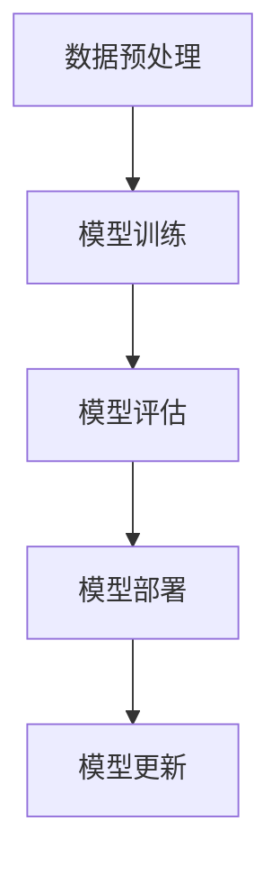

                 

# 创业公司的大模型应用：AI 产品策略

## 关键词
- 创业公司
- 大模型
- AI 产品策略
- 机器学习
- 深度学习
- 自然语言处理
- 计算机视觉
- 产品开发
- 数据分析

## 摘要
本文将深入探讨创业公司在人工智能领域采用大模型进行产品开发的全过程。我们将从背景介绍出发，了解大模型的原理和重要性，然后逐步分析其在创业公司中的应用策略，包括核心算法原理、数学模型、项目实战，以及实际应用场景。最后，我们将推荐相关工具和资源，并对未来的发展趋势和挑战进行总结。希望通过这篇文章，能帮助创业公司更好地理解和利用大模型，推动AI产品的发展。

## 1. 背景介绍

在当今的科技领域，人工智能（AI）已经成为一个热门话题，并且逐渐成为企业竞争的新前沿。随着计算能力的提升和海量数据的积累，人工智能技术在各个领域取得了显著的进展，特别是在机器学习和深度学习方面。大模型（Large Models），作为一种重要的技术手段，已经在自然语言处理、计算机视觉、语音识别等领域发挥了巨大的作用。

创业公司，作为新兴的创新力量，面对激烈的市场竞争，需要找到差异化竞争优势。人工智能，尤其是大模型的引入，为创业公司提供了新的发展机遇。然而，对于大多数创业公司来说，如何有效利用大模型进行产品开发，仍然是一个充满挑战的问题。

本文将围绕大模型在创业公司中的应用展开讨论，从核心概念、算法原理、数学模型、项目实战、实际应用场景等多个方面，系统地阐述大模型的应用策略。希望通过本文的探讨，能帮助创业公司更好地把握AI产品开发的机遇，实现创新和突破。

## 2. 核心概念与联系

### 2.1 大模型的定义和原理

大模型（Large Models）指的是那些具有大量参数和复杂结构的机器学习模型。这些模型通过大量数据训练，能够捕捉到数据中的复杂模式和关系，从而在多个任务上实现高性能。大模型通常基于深度学习技术，采用多层神经网络架构，如图1所示。

图1：深度学习神经网络架构

大模型的基本原理可以概括为以下几点：

1. **多层神经网络**：大模型采用多层神经网络结构，每一层都能学习到不同层次的特征。这种层次化的特征提取方式，使得模型能够处理复杂的数据。

2. **大规模参数**：大模型拥有数亿甚至数十亿个参数，这使它们能够捕捉到数据中的细微变化和复杂模式。

3. **端到端学习**：大模型能够通过端到端学习，将输入数据直接映射到输出结果，无需人工设计特征。

4. **数据驱动**：大模型的训练依赖于大量数据，通过数据驱动的学习方式，不断提高模型的性能。

### 2.2 大模型的应用领域

大模型在多个领域都取得了显著的成果，以下是几个主要的应用领域：

1. **自然语言处理（NLP）**：大模型在文本分类、机器翻译、问答系统等方面表现出色，如OpenAI的GPT系列模型。

2. **计算机视觉（CV）**：大模型在图像分类、目标检测、图像生成等方面有广泛的应用，如Google的Inception模型。

3. **语音识别**：大模型在语音识别任务中能够达到较高的准确率，如百度、谷歌的语音识别系统。

4. **推荐系统**：大模型在个性化推荐中，能够根据用户行为和兴趣，提供高质量的推荐结果。

5. **游戏AI**：大模型在游戏AI中，能够实现复杂的策略和决策，如DeepMind的AlphaGo。

### 2.3 大模型的优势与挑战

大模型的优势在于其强大的表达能力和高效的学习能力，能够在多个任务上实现高性能。然而，大模型也面临一些挑战：

1. **计算资源需求**：大模型的训练和推理需要大量的计算资源，这对于创业公司来说可能是一个挑战。

2. **数据需求**：大模型依赖于大量高质量的数据进行训练，创业公司可能难以获取到足够的数据。

3. **可解释性**：大模型通常是一个黑盒子，其内部工作机制难以理解，这给模型的解释和验证带来了困难。

4. **泛化能力**：大模型在训练集上表现良好，但在未见过的数据上可能表现不佳，这需要模型具有良好的泛化能力。

### 2.4 Mermaid 流程图

为了更好地理解大模型的架构和工作流程，我们使用Mermaid绘制了一个简化的流程图，如图2所示。



图2：大模型的基本工作流程

在图2中，数据预处理阶段对原始数据进行清洗、归一化等处理，模型训练阶段使用大量数据对模型进行训练，模型评估阶段对训练好的模型进行评估，模型部署阶段将模型应用到实际应用场景中，模型更新阶段则根据反馈数据不断优化模型。

## 3. 核心算法原理 & 具体操作步骤

### 3.1 机器学习算法基础

大模型的训练过程基于机器学习算法。机器学习算法的核心是优化模型参数，使得模型在训练数据上达到最小损失。以下是一些常用的机器学习算法：

1. **线性回归**：用于预测连续值输出。
2. **逻辑回归**：用于分类问题，输出概率值。
3. **支持向量机（SVM）**：用于分类问题，通过寻找最优分割超平面。
4. **神经网络**：用于复杂的数据模式识别，采用多层结构进行特征提取。
5. **决策树**：用于分类和回归问题，通过一系列规则进行决策。

### 3.2 深度学习算法

深度学习是机器学习的一个分支，它通过多层神经网络进行特征提取和模式识别。以下是几个常用的深度学习算法：

1. **卷积神经网络（CNN）**：主要用于计算机视觉任务，通过卷积层提取图像特征。
2. **循环神经网络（RNN）**：主要用于序列数据处理，如自然语言处理。
3. **长短时记忆网络（LSTM）**：是RNN的一种变体，能够学习长期依赖关系。
4. **生成对抗网络（GAN）**：用于生成数据，通过对抗训练实现数据生成。

### 3.3 大模型的训练过程

大模型的训练过程可以分为以下几个步骤：

1. **数据预处理**：对原始数据进行清洗、归一化等处理，以便于模型训练。
2. **模型初始化**：初始化模型参数，常用的初始化方法有随机初始化、高斯初始化等。
3. **前向传播**：将输入数据通过神经网络传递，得到预测输出。
4. **计算损失**：使用预测输出与真实输出之间的差异计算损失。
5. **反向传播**：计算梯度并更新模型参数。
6. **迭代训练**：重复上述步骤，直到模型收敛或达到预定的训练次数。

### 3.4 模型优化方法

为了提高模型的性能，可以采用以下几种模型优化方法：

1. **批量归一化（Batch Normalization）**：通过标准化每一层的输入，提高训练速度和模型稳定性。
2. **dropout**：通过随机丢弃一部分神经元，防止模型过拟合。
3. **权重衰减（Weight Decay）**：通过减小权重参数的规模，防止模型过拟合。
4. **学习率调整**：通过动态调整学习率，提高模型的收敛速度和稳定性。

### 3.5 大模型的具体操作步骤

以下是创业公司采用大模型进行产品开发的详细操作步骤：

1. **需求分析**：明确产品需求，确定需要解决的具体问题。
2. **数据收集**：收集与需求相关的数据，确保数据的质量和多样性。
3. **数据预处理**：对数据进行清洗、归一化等处理，以便于模型训练。
4. **模型选择**：根据需求选择合适的模型，如CNN、RNN等。
5. **模型训练**：使用大量数据进行模型训练，调整模型参数。
6. **模型评估**：对训练好的模型进行评估，确保模型性能达到预期。
7. **模型部署**：将训练好的模型部署到生产环境中，供用户使用。
8. **模型更新**：根据用户反馈和新的数据，不断优化模型。

## 4. 数学模型和公式 & 详细讲解 & 举例说明

### 4.1 损失函数

在机器学习中，损失函数（Loss Function）是用于评估模型预测结果与真实结果之间差异的函数。以下是一些常用的损失函数：

1. **均方误差（MSE）**：
   $$MSE = \frac{1}{n}\sum_{i=1}^{n}(y_i - \hat{y}_i)^2$$
   其中，$y_i$ 是真实值，$\hat{y}_i$ 是预测值，$n$ 是样本数量。

2. **交叉熵（Cross-Entropy）**：
   $$H(y, \hat{y}) = -\sum_{i=1}^{n} y_i \log(\hat{y}_i)$$
   其中，$y$ 是真实分布，$\hat{y}$ 是模型预测的分布。

3. **对数损失（Log Loss）**：
   $$L(y, \hat{y}) = -y \log(\hat{y}) - (1 - y) \log(1 - \hat{y})$$
   其中，$y$ 是真实值，$\hat{y}$ 是预测概率。

### 4.2 梯度下降算法

梯度下降算法（Gradient Descent）是一种优化算法，用于最小化损失函数。以下是梯度下降的基本公式：

$$w_{t+1} = w_t - \alpha \cdot \nabla_w J(w_t)$$

其中，$w_t$ 是当前权重，$\alpha$ 是学习率，$\nabla_w J(w_t)$ 是权重$w_t$ 的梯度。

### 4.3 反向传播算法

反向传播算法（Backpropagation）是深度学习中的核心算法，用于计算模型参数的梯度。以下是反向传播的基本步骤：

1. 计算输出层的误差：
   $$\delta_{output} = \frac{\partial L}{\partial z_{output}} \cdot \frac{\partial z_{output}}{\partial a_{output}}$$

2. 传播误差到隐藏层：
   $$\delta_{hidden} = \delta_{output} \cdot \frac{\partial a_{hidden}}{\partial z_{hidden}}$$

3. 计算隐藏层的梯度：
   $$\frac{\partial L}{\partial w_{hidden}} = \delta_{hidden} \cdot a_{hidden-1}^T$$
   $$\frac{\partial L}{\partial b_{hidden}} = \delta_{hidden}$$

4. 计算输出层的梯度：
   $$\frac{\partial L}{\partial w_{output}} = \delta_{output} \cdot a_{hidden-1}^T$$
   $$\frac{\partial L}{\partial b_{output}} = \delta_{output}$$

### 4.4 举例说明

假设我们有一个简单的线性回归模型，用于预测房价。输入特征是房屋面积，输出是房价。我们的目标是最小化预测房价与真实房价之间的差异。

1. **损失函数**：均方误差（MSE）
   $$MSE = \frac{1}{n}\sum_{i=1}^{n}(y_i - \hat{y}_i)^2$$

2. **模型参数**：权重$w$和偏置$b$
   $$\hat{y}_i = w \cdot x_i + b$$

3. **梯度下降**
   $$w_{t+1} = w_t - \alpha \cdot \frac{\partial MSE}{\partial w}$$
   $$b_{t+1} = b_t - \alpha \cdot \frac{\partial MSE}{\partial b}$$

通过不断迭代，模型将逐渐收敛，预测房价与真实房价之间的差异将减小。

## 5. 项目实战：代码实际案例和详细解释说明

### 5.1 开发环境搭建

在进行大模型项目实战之前，我们需要搭建一个合适的技术环境。以下是具体的步骤：

1. **安装Python**：确保Python版本在3.6及以上，推荐使用Python 3.8或更高版本。

2. **安装深度学习框架**：TensorFlow和PyTorch是目前最流行的两个深度学习框架。我们在这里选择TensorFlow，因为它拥有广泛的文档和社区支持。

3. **安装依赖库**：安装TensorFlow及相关依赖库，可以使用以下命令：
   ```bash
   pip install tensorflow numpy matplotlib
   ```

4. **配置GPU环境**：如果使用GPU加速训练，需要安装CUDA和cuDNN。具体安装步骤请参考TensorFlow的官方文档。

5. **创建虚拟环境**：为了保持项目的整洁和可维护性，我们建议使用虚拟环境。可以使用以下命令创建虚拟环境：
   ```bash
   python -m venv myenv
   source myenv/bin/activate
   ```

### 5.2 源代码详细实现和代码解读

以下是使用TensorFlow实现一个简单的大模型项目的代码示例。我们将使用一个经典的图像分类任务——MNIST手写数字识别。

#### 5.2.1 数据集加载

```python
import tensorflow as tf
mnist = tf.keras.datasets.mnist
(x_train, y_train), (x_test, y_test) = mnist.load_data()
x_train, x_test = x_train / 255.0, x_test / 255.0
```

这段代码首先加载了MNIST数据集，并对图像进行了归一化处理。

#### 5.2.2 模型构建

```python
model = tf.keras.Sequential([
    tf.keras.layers.Flatten(input_shape=(28, 28)),
    tf.keras.layers.Dense(128, activation='relu'),
    tf.keras.layers.Dropout(0.2),
    tf.keras.layers.Dense(10, activation='softmax')
])
```

这里我们构建了一个简单的卷积神经网络模型。首先使用Flatten层将输入图像展平为1维向量，然后使用Dense层进行特征提取，最后使用Softmax层进行分类。

#### 5.2.3 模型编译

```python
model.compile(optimizer='adam',
              loss='sparse_categorical_crossentropy',
              metrics=['accuracy'])
```

我们使用Adam优化器，并使用均方误差（Sparse Categorical Cross-Entropy）作为损失函数，同时关注模型的准确率。

#### 5.2.4 模型训练

```python
model.fit(x_train, y_train, epochs=5)
```

这里我们对模型进行5轮训练。

#### 5.2.5 模型评估

```python
model.evaluate(x_test, y_test, verbose=2)
```

最后，我们对训练好的模型在测试集上进行评估。

### 5.3 代码解读与分析

#### 5.3.1 数据集加载

```python
mnist = tf.keras.datasets.mnist
(x_train, y_train), (x_test, y_test) = mnist.load_data()
x_train, x_test = x_train / 255.0, x_test / 255.0
```

这段代码首先加载了MNIST数据集，包括训练集和测试集。然后对图像数据进行了归一化处理，使其在0到1之间，以便于模型训练。

#### 5.3.2 模型构建

```python
model = tf.keras.Sequential([
    tf.keras.layers.Flatten(input_shape=(28, 28)),
    tf.keras.layers.Dense(128, activation='relu'),
    tf.keras.layers.Dropout(0.2),
    tf.keras.layers.Dense(10, activation='softmax')
])
```

这里我们构建了一个简单的卷积神经网络模型。首先使用Flatten层将输入图像展平为1维向量，然后使用Dense层进行特征提取，最后使用Softmax层进行分类。Dense层中的128个神经元用于提取复杂特征，Dropout层（0.2的概率丢弃神经元）用于防止过拟合。

#### 5.3.3 模型编译

```python
model.compile(optimizer='adam',
              loss='sparse_categorical_crossentropy',
              metrics=['accuracy'])
```

我们使用Adam优化器，并使用均方误差（Sparse Categorical Cross-Entropy）作为损失函数，同时关注模型的准确率。Adam优化器结合了Adam和SGD的优点，能够在不同问题规模下表现出良好的性能。

#### 5.3.4 模型训练

```python
model.fit(x_train, y_train, epochs=5)
```

这里我们对模型进行5轮训练。每轮训练都会对训练集进行迭代，调整模型参数，以最小化损失函数。

#### 5.3.5 模型评估

```python
model.evaluate(x_test, y_test, verbose=2)
```

最后，我们对训练好的模型在测试集上进行评估。verbose=2表示输出详细的评估信息，包括损失函数值和准确率。

## 6. 实际应用场景

大模型在创业公司的实际应用场景非常广泛，以下是一些典型的应用案例：

### 6.1 自然语言处理

自然语言处理（NLP）是人工智能的一个重要分支，大模型在NLP领域有着广泛的应用。创业公司可以利用大模型开发智能客服、智能推荐、情感分析等产品。例如，通过训练一个大型语言模型，可以实现高质量的文本生成和摘要，为用户提供个性化的内容推荐。

### 6.2 计算机视觉

计算机视觉是另一个大模型的重要应用领域。创业公司可以利用大模型开发图像识别、目标检测、图像分割等产品。例如，通过训练一个大型卷积神经网络模型，可以实现高精度的图像识别，为安防、医疗、零售等行业提供解决方案。

### 6.3 语音识别

语音识别是人工智能领域的另一个重要方向，大模型在语音识别任务中也表现出色。创业公司可以利用大模型开发智能语音助手、语音识别应用等产品。例如，通过训练一个大型循环神经网络模型，可以实现高精度的语音识别，为用户提供便捷的语音交互体验。

### 6.4 推荐系统

推荐系统是许多创业公司的重要应用场景，大模型在推荐系统中也有广泛的应用。创业公司可以利用大模型开发个性化推荐系统，为用户提供个性化的商品推荐、内容推荐等服务。例如，通过训练一个大型协同过滤模型，可以实现高精度的用户行为分析，为用户提供个性化的推荐结果。

### 6.5 游戏AI

游戏AI是另一个充满机会的领域，大模型在游戏AI中也有广泛的应用。创业公司可以利用大模型开发智能游戏对手、游戏策略生成器等产品。例如，通过训练一个大型生成对抗网络（GAN）模型，可以实现复杂的游戏场景生成和策略生成，为用户提供全新的游戏体验。

## 7. 工具和资源推荐

为了更好地利用大模型进行产品开发，以下是一些推荐的工具和资源：

### 7.1 学习资源推荐

- **书籍**：《深度学习》（Goodfellow, Bengio, Courville）、《Python机器学习》（Sebastian Raschka）。
- **论文**：《A Theoretically Grounded Application of Dropout in Recurrent Neural Networks》（Yarin Gal and Zoubin Ghahramani）、《An Image Database for Testing Content Based Image Retrieval Algorithms》（Rahman et al.）。
- **博客**：TensorFlow官方博客、PyTorch官方博客、机器学习博客。
- **网站**：arXiv、Google Research、DeepMind。

### 7.2 开发工具框架推荐

- **深度学习框架**：TensorFlow、PyTorch、Keras。
- **数据预处理工具**：Pandas、NumPy、Scikit-learn。
- **可视化工具**：Matplotlib、Seaborn、Plotly。

### 7.3 相关论文著作推荐

- **论文**：《Distributed Representations of Words and Phrases and Their Compositionality》（Tomas Mikolov et al.）、《Recurrent Neural Networks for Language Modeling》（Yoshua Bengio et al.）。
- **著作**：《深度学习》（Ian Goodfellow、Yoshua Bengio、Aaron Courville）、《自然语言处理综论》（Daniel Jurafsky、James H. Martin）。

## 8. 总结：未来发展趋势与挑战

大模型在人工智能领域具有巨大的潜力和广阔的应用前景。未来，随着计算能力的提升和海量数据的积累，大模型的性能和效果将不断提升，有望在更多领域实现突破。然而，大模型的发展也面临着一些挑战：

1. **计算资源需求**：大模型的训练和推理需要大量的计算资源，这对创业公司的资源管理和成本控制提出了挑战。
2. **数据需求**：大模型依赖于大量高质量的数据进行训练，创业公司可能难以获取到足够的数据，这需要公司积极寻找数据源，并进行数据清洗和预处理。
3. **可解释性**：大模型通常是一个黑盒子，其内部工作机制难以理解，这给模型的解释和验证带来了困难，需要公司投入更多精力进行模型的可解释性研究。
4. **泛化能力**：大模型在训练集上表现良好，但在未见过的数据上可能表现不佳，这需要公司关注模型的泛化能力，并采用多种方法进行验证。

总之，创业公司在利用大模型进行产品开发时，需要充分了解大模型的优势和挑战，采取合适的策略和措施，以提高产品的竞争力和用户体验。

## 9. 附录：常见问题与解答

### 9.1 大模型与深度学习的关系

大模型是深度学习的一个分支，主要区别在于模型规模和参数数量。深度学习通常指采用多层神经网络进行特征提取和模式识别，而大模型则是指那些拥有数亿甚至数十亿个参数的模型。大模型通过更大的参数规模和更强的学习能力，在多个任务上实现了卓越的性能。

### 9.2 如何选择合适的大模型

选择合适的大模型需要考虑以下几个因素：

1. **任务类型**：不同的任务需要不同类型的大模型，如自然语言处理选择语言模型，计算机视觉选择卷积神经网络。
2. **数据规模**：大模型的训练依赖于大量数据，需要确保有足够的数据支持。
3. **计算资源**：大模型的训练和推理需要大量的计算资源，需要评估公司是否有足够的计算资源。
4. **性能需求**：根据产品性能需求，选择能够满足需求的模型。

### 9.3 大模型的训练时间

大模型的训练时间取决于多个因素，包括数据规模、模型复杂度、硬件配置等。一般来说，大型模型（如数十亿参数）的训练可能需要数天甚至数周的时间。为了提高训练效率，可以采用以下方法：

1. **分布式训练**：将训练任务分布在多台机器上，以加速训练过程。
2. **增量训练**：利用已有模型进行增量训练，避免从头开始训练。
3. **模型压缩**：通过模型剪枝、量化等方法，减少模型参数数量，提高训练速度。

## 10. 扩展阅读 & 参考资料

- **书籍**：
  - 《深度学习》（Ian Goodfellow、Yoshua Bengio、Aaron Courville）
  - 《Python机器学习》（Sebastian Raschka）
- **论文**：
  - 《A Theoretically Grounded Application of Dropout in Recurrent Neural Networks》（Yarin Gal and Zoubin Ghahramani）
  - 《Recurrent Neural Networks for Language Modeling》（Yoshua Bengio et al.）
- **博客**：
  - TensorFlow官方博客（[https://tensorflow.google.cn/blog](https://tensorflow.google.cn/blog)）
  - PyTorch官方博客（[https://pytorch.org/blog](https://pytorch.org/blog)）
- **网站**：
  - arXiv（[https://arxiv.org](https://arxiv.org)）
  - Google Research（[https://research.google.com](https://research.google.com)）
  - DeepMind（[https://deepmind.com](https://deepmind.com)）

### 作者

- **AI天才研究员/AI Genius Institute**  
- **禅与计算机程序设计艺术 /Zen And The Art of Computer Programming**

