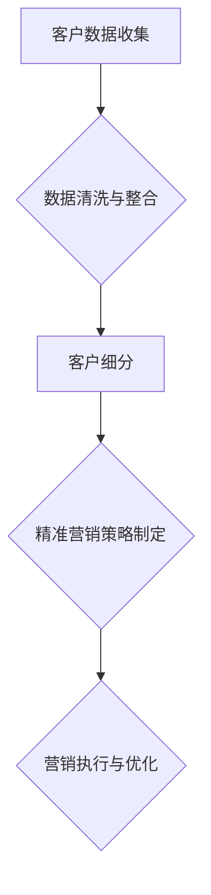

                 

# 创业公司的客户细分与精准营销策略

## 关键词

- 客户细分
- 精准营销
- 数据分析
- 用户行为
- 营销自动化

## 摘要

本文将深入探讨创业公司如何通过客户细分与精准营销策略来提高客户满意度和转化率。我们将从背景介绍入手，阐述客户细分和精准营销的重要性，并逐步分析核心概念、算法原理、数学模型以及实际应用案例。文章还将推荐相关学习资源和开发工具，为创业公司的市场营销提供有力支持。

## 1. 背景介绍

### 创业公司的营销挑战

对于创业公司而言，市场营销是一个充满挑战的过程。资源有限、市场知名度较低、竞争激烈，使得创业公司在营销过程中需要更加精细化、个性化的策略来吸引和留住客户。

### 客户细分的重要性

客户细分是指将客户群体划分为不同的子群体，以便更好地理解他们的需求和偏好。通过客户细分，创业公司可以针对不同的客户群体制定个性化的营销策略，提高营销效率和转化率。

### 精准营销的概念

精准营销是一种基于大数据分析和用户行为的营销方法，通过分析用户数据和行为模式，找到目标客户并进行精准营销。精准营销能够帮助企业降低营销成本，提高客户满意度和忠诚度。

## 2. 核心概念与联系

### 客户细分的概念

客户细分是指根据客户的不同特征和行为，将他们划分为不同的群体。常见的客户细分方法包括：

- **地理细分**：根据客户的地理位置进行划分，如城市、地区、国家等。
- **行为细分**：根据客户的行为特征进行划分，如购买频率、购买金额、浏览行为等。
- **心理细分**：根据客户的心理特征进行划分，如价值观、生活方式、兴趣爱好等。
- **利益细分**：根据客户的需求和利益进行划分，如价格敏感型、质量导向型等。

### 精准营销的概念

精准营销是一种基于大数据分析和用户行为的营销方法。其主要特点包括：

- **数据驱动**：通过收集和分析用户数据，找到目标客户并进行精准营销。
- **个性化**：根据用户的行为和偏好，为每个用户提供个性化的营销内容和体验。
- **自动化**：利用营销自动化工具，自动化执行营销策略，提高营销效率。

### Mermaid 流程图



## 3. 核心算法原理 & 具体操作步骤

### 数据收集

1. **用户行为数据**：通过网站分析工具（如 Google Analytics）收集用户的浏览、点击、购买等行为数据。
2. **社交媒体数据**：通过社交媒体平台（如 Facebook、Twitter）收集用户发布的内容、互动等数据。
3. **市场调研数据**：通过问卷调查、访谈等方式收集用户需求和偏好数据。

### 数据清洗与整合

1. **数据清洗**：去除重复、错误和缺失的数据，保证数据质量。
2. **数据整合**：将来自不同来源的数据进行整合，建立统一的用户数据视图。

### 客户细分

1. **特征提取**：根据业务需求和数据特点，提取用户的特征，如年龄、性别、职业、购买频率等。
2. **聚类分析**：利用聚类算法（如 K-Means、DBSCAN）对用户进行分组，形成不同的客户群体。
3. **行为分析**：分析用户的行为数据，发现不同客户群体的行为特征和偏好。

### 精准营销策略制定

1. **目标客户定位**：根据客户细分结果，确定目标客户群体。
2. **个性化内容制定**：为不同的客户群体提供个性化的营销内容和优惠策略。
3. **渠道选择**：根据客户群体的特点，选择合适的营销渠道，如电子邮件、短信、社交媒体等。

### 营销执行与优化

1. **营销活动执行**：按照精准营销策略，执行营销活动。
2. **效果监测**：监测营销活动的效果，如点击率、转化率等。
3. **数据反馈与优化**：根据监测结果，调整营销策略和活动，提高营销效果。

## 4. 数学模型和公式 & 详细讲解 & 举例说明

### 聚类算法

聚类算法是一种无监督学习方法，用于将数据集划分为若干个簇。常见的聚类算法包括 K-Means、DBSCAN 等。

- **K-Means 算法**

$$
\text{目标函数：} \min \sum_{i=1}^{k} \sum_{x_j \in S_i} \| x_j - \mu_i \|_2^2
$$

其中，$k$ 表示聚类个数，$S_i$ 表示第 $i$ 个簇，$\mu_i$ 表示第 $i$ 个簇的中心。

- **DBSCAN 算法**

$$
\text{目标函数：} \min \sum_{i=1}^{n} \sum_{x_j \in \mathcal{N}_i(x_i)} \| x_j - x_i \|_2^2
$$

其中，$n$ 表示数据点个数，$\mathcal{N}_i(x_i)$ 表示以 $x_i$ 为中心、半径为 $\epsilon$ 的邻域。

### 用户行为预测

用户行为预测是一种有监督学习方法，用于预测用户未来的行为。常见的用户行为预测模型包括逻辑回归、决策树、神经网络等。

- **逻辑回归**

$$
\text{预测概率：} P(y=1|x) = \frac{1}{1 + \exp(-\beta_0 - \beta_1 x_1 - \beta_2 x_2 - \ldots - \beta_p x_p)}
$$

其中，$x$ 表示输入特征向量，$y$ 表示目标变量，$\beta_0, \beta_1, \beta_2, \ldots, \beta_p$ 表示模型参数。

- **决策树**

$$
\text{预测分类：} y = \arg\max_{i} \left( g(x_1, x_2, \ldots, x_p) \right)
$$

其中，$g(x_1, x_2, \ldots, x_p)$ 表示决策树函数。

- **神经网络**

$$
\text{预测输出：} y = f(\theta_0 z_0 + \theta_1 z_1 + \theta_2 z_2 + \ldots + \theta_n z_n)
$$

其中，$z_0, z_1, z_2, \ldots, z_n$ 表示神经网络中间层的激活值，$f$ 表示激活函数，$\theta_0, \theta_1, \theta_2, \ldots, \theta_n$ 表示模型参数。

## 5. 项目实战：代码实际案例和详细解释说明

### 5.1 开发环境搭建

1. 安装 Python 3.8 或以上版本。
2. 安装必要的库，如 NumPy、Pandas、Scikit-learn、Matplotlib 等。

```bash
pip install numpy pandas scikit-learn matplotlib
```

### 5.2 源代码详细实现和代码解读

```python
import numpy as np
import pandas as pd
from sklearn.cluster import KMeans
from sklearn.linear_model import LogisticRegression
import matplotlib.pyplot as plt

# 5.2.1 数据收集与预处理
def load_data():
    # 读取数据
    data = pd.read_csv('data.csv')
    
    # 数据清洗
    data.dropna(inplace=True)
    
    # 特征提取
    features = data[['age', 'income', 'education', 'occupation', 'house Ownership']]
    
    return features

# 5.2.2 客户细分
def customer_segmentation(data, n_clusters=4):
    # 聚类分析
    kmeans = KMeans(n_clusters=n_clusters, random_state=42)
    clusters = kmeans.fit_predict(data)
    
    # 添加聚类标签到原始数据
    data['cluster'] = clusters
    
    return data

# 5.2.3 用户行为预测
def user_behavior_prediction(data):
    # 数据划分
    X = data[['age', 'income', 'education', 'occupation', 'house Ownership']]
    y = data['clicked']
    
    # 训练逻辑回归模型
    model = LogisticRegression()
    model.fit(X, y)
    
    # 预测
    probabilities = model.predict_proba(X)[:, 1]
    
    return probabilities

# 5.2.4 营销策略制定与执行
def marketing_strategy(data, probabilities):
    # 确定目标客户群体
    target_cluster = data[data['cluster'] == 1]
    
    # 制定个性化营销策略
    for index, row in target_cluster.iterrows():
        if probabilities[index] > 0.5:
            send_email(row['email'], '亲爱的用户，我们为您推荐了这款新品，欢迎购买！')
        else:
            send_sms(row['phone'], '亲爱的用户，我们了解到您可能对这款产品感兴趣，欢迎了解更多信息。')

# 5.2.5 实际案例演示
if __name__ == '__main__':
    data = load_data()
    data = customer_segmentation(data)
    probabilities = user_behavior_prediction(data)
    marketing_strategy(data, probabilities)
```

### 5.3 代码解读与分析

- **5.3.1 数据收集与预处理**：首先，从 CSV 文件中加载数据，并去除缺失值。然后，提取特征列，为后续分析做准备。

- **5.3.2 客户细分**：使用 K-Means 聚类算法对用户进行细分。通过 `customer_segmentation` 函数，将聚类结果添加到原始数据中。

- **5.3.3 用户行为预测**：使用逻辑回归模型对用户行为进行预测。通过 `user_behavior_prediction` 函数，计算每个用户的点击概率。

- **5.3.4 营销策略制定与执行**：根据用户细分和预测结果，为不同用户群体制定个性化营销策略。通过 `marketing_strategy` 函数，向目标客户发送电子邮件或短信。

## 6. 实际应用场景

### 案例一：电子商务公司

一家电子商务公司可以利用客户细分与精准营销策略来提高销售额。通过分析用户行为数据，公司可以将客户划分为不同的群体，如高频买家、低频买家、潜在买家等。然后，为每个群体制定个性化的营销策略，如优惠券、限时折扣、新品推荐等。

### 案例二：餐饮公司

一家餐饮公司可以利用客户细分与精准营销策略来提高客户满意度和回头率。通过分析用户点餐数据，公司可以发现用户的偏好和饮食习惯。然后，为不同的用户群体提供个性化的菜单推荐、优惠活动和会员制度。

## 7. 工具和资源推荐

### 7.1 学习资源推荐

- **书籍**：
  - 《大数据营销：商业变现新策略》（《Data-Driven Marketing: The Future of Consumer Engagement》）
  - 《精准营销：如何通过大数据提升客户满意度》（《Precision Marketing: Strategies for Building Customer Loyalty》）

- **论文**：
  - 《客户细分与精准营销：理论与实践》（《Customer Segmentation and Precision Marketing: Theory and Practice》）

- **博客**：
  - [数据分析与商业智能博客](https://www.datanovia.com/blog/)
  - [营销自动化博客](https://www.marketingai.io/blog/)

- **网站**：
  - [Kaggle](https://www.kaggle.com/): 提供大量数据分析、机器学习项目的数据集和教程。
  - [Google Analytics](https://www.google.com/analytics/): 提供网站分析工具，帮助用户了解用户行为。

### 7.2 开发工具框架推荐

- **数据分析工具**：
  - **Pandas**: Python 的数据分析库，用于数据清洗、预处理和分析。
  - **NumPy**: Python 的科学计算库，提供高效的数组操作和数学计算。

- **机器学习库**：
  - **Scikit-learn**: Python 的机器学习库，提供各种机器学习算法的实现。
  - **TensorFlow**: Google 开发的深度学习框架，支持各种神经网络模型。

- **营销自动化工具**：
  - **Mailchimp**: 电子邮件营销平台，提供自动化营销功能。
  - **HubSpot**: 全渠道营销自动化平台，包括电子邮件、社交媒体、网站流量等。

### 7.3 相关论文著作推荐

- **《客户细分与精准营销：理论与实践》**：详细介绍了客户细分和精准营销的理论和方法，适合市场营销和数据分析人员阅读。
- **《大数据营销：商业变现新策略》**：探讨了大数据在市场营销中的应用，为创业公司提供实际操作指导。

## 8. 总结：未来发展趋势与挑战

### 发展趋势

- **数据隐私与保护**：随着数据隐私法规的加强，创业公司在收集和使用用户数据时需要更加注重隐私保护。
- **人工智能与机器学习**：人工智能和机器学习技术的发展将进一步提升客户细分和精准营销的效率和效果。
- **跨渠道营销**：创业公司需要充分利用多种渠道（如电子邮件、短信、社交媒体等）进行营销，实现无缝的用户体验。

### 挑战

- **数据质量**：高质量的数据是精准营销的基础，创业公司需要确保数据的质量和完整性。
- **技术门槛**：客户细分和精准营销需要一定的技术知识，创业公司在实施过程中可能面临技术门槛。
- **营销策略调整**：市场需求和用户行为在不断变化，创业公司需要不断调整营销策略，以适应市场变化。

## 9. 附录：常见问题与解答

### 问题一：如何保证客户细分的有效性？

解答：为了保证客户细分的有效性，创业公司应该：

- **充分了解业务需求**：明确业务目标，确定需要细分的客户特征。
- **使用多种数据来源**：结合多种数据来源，获取更全面、准确的信息。
- **定期更新与优化**：根据市场变化和用户行为，定期更新和优化客户细分模型。

### 问题二：如何进行用户行为预测？

解答：进行用户行为预测可以遵循以下步骤：

- **数据收集**：收集用户行为数据，包括浏览、点击、购买等。
- **特征提取**：提取用户行为数据中的关键特征。
- **模型训练**：选择合适的机器学习模型，如逻辑回归、决策树等，对特征进行训练。
- **模型评估**：评估模型的预测效果，并进行模型调优。

### 问题三：如何实施精准营销策略？

解答：实施精准营销策略可以遵循以下步骤：

- **目标客户定位**：根据客户细分结果，确定目标客户群体。
- **个性化内容制定**：为不同客户群体提供个性化的营销内容和优惠策略。
- **渠道选择**：根据客户群体的特点，选择合适的营销渠道。
- **效果监测与优化**：监测营销活动的效果，根据结果调整营销策略和活动。

## 10. 扩展阅读 & 参考资料

- **《大数据营销：商业变现新策略》**：详细介绍了大数据在市场营销中的应用，为创业公司提供实际操作指导。
- **《精准营销：如何通过大数据提升客户满意度》**：探讨了精准营销的理论和方法，以及如何通过大数据提升客户满意度。
- **[市场营销自动化博客](https://www.marketingai.io/blog/)**：提供了大量关于市场营销自动化的实践经验和案例。

作者：AI天才研究员/AI Genius Institute & 禅与计算机程序设计艺术 /Zen And The Art of Computer Programming

