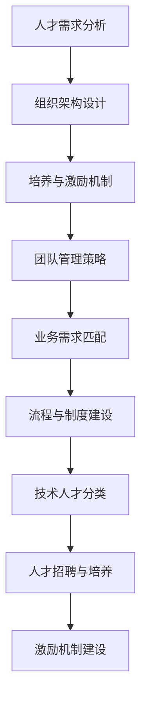

                 

# 创业公司的技术人才梯队建设

> **关键词**：创业公司、技术人才、梯队建设、人才培养、团队管理
>
> **摘要**：本文将探讨创业公司在快速发展的过程中，如何建立和优化技术人才梯队，确保团队稳定高效地推进项目。通过分析人才需求、搭建合理的架构、实施有效的培养和激励机制，我们希望能够为创业公司提供一套全面、系统的人才梯队建设策略。

## 1. 背景介绍

在当前快速变化的市场环境中，创业公司面临着巨大的竞争压力和生存挑战。技术是创业公司发展的核心竞争力，而技术人才则是公司的宝贵资产。然而，创业公司通常面临资源有限、市场竞争激烈等现实问题，这就要求公司必须建立高效的技术人才梯队，以实现持续的技术创新和业务增长。

技术人才梯队建设不仅仅是对现有人才的培养和管理，更是一个系统性的规划过程，涉及人才招聘、培养、激励等多个方面。一个完善的技术人才梯队能够为公司提供稳定的人才支持，确保技术团队能够应对各种挑战，快速响应市场需求，从而推动公司的长期发展。

本文将从以下几个方面展开讨论：

1. **人才需求分析**：明确创业公司不同阶段的技术人才需求。
2. **人才架构搭建**：设计合理的组织结构和岗位设置。
3. **人才培养机制**：实施有效的培训计划和人才发展规划。
4. **激励机制建设**：建立合理的薪酬体系和激励政策。
5. **团队管理策略**：优化团队协作，提升团队整体效能。
6. **实际应用场景**：探讨人才梯队建设在不同业务领域的实践。
7. **工具和资源推荐**：介绍有助于人才梯队建设的相关工具和资源。
8. **未来发展趋势与挑战**：分析技术人才梯队建设的未来方向和面临的挑战。

通过以上内容的探讨，希望能够为创业公司在技术人才梯队建设方面提供一些实用的指导和建议。## 2. 核心概念与联系

在深入探讨创业公司的技术人才梯队建设之前，我们需要明确几个核心概念，并了解它们之间的联系。以下是对这些概念的定义及其在技术人才梯队建设中的重要性：

### 2.1 技术人才分类

技术人才可以分为以下几类：

- **核心技术人员**：具备深厚技术背景，能够引领团队进行技术创新的骨干人员。
- **研发人员**：负责具体的技术研发工作，包括算法设计、系统架构、代码实现等。
- **测试人员**：负责软件的测试和质量控制，确保产品稳定可靠。
- **运维人员**：负责系统的部署、运维和监控，确保系统的正常运行。

这些不同类型的人才在团队中扮演着不同的角色，相互协作，共同推动项目的进展。

### 2.2 组织架构

组织架构是公司内部人才分布和管理的基础。一个合理的设计能够确保团队的高效运作。常见的组织架构类型包括：

- **职能型组织**：按照职能划分部门，如研发部、测试部、运维部等。
- **项目型组织**：以项目为中心，跨部门合作，实现项目的快速推进。
- **矩阵型组织**：结合职能型和项目型组织的特点，既确保职能专业化，又实现项目的高效执行。

### 2.3 培养与激励机制

培养和激励机制是技术人才梯队建设的关键。有效的培养机制能够提升员工的技能和职业素养，而激励机制则能够激发员工的积极性和创造力。

- **培养机制**：包括内部培训、外部学习、导师制度、职业发展规划等。
- **激励机制**：包括薪酬福利、晋升机会、股权激励、奖励制度等。

### 2.4 团队管理

团队管理是确保技术人才梯队稳定和高效运作的重要环节。团队管理的核心目标是提升团队的协作效能和创新能力。

- **管理策略**：包括目标设定、绩效评估、沟通协作、冲突解决等。
- **领导力**：领导者需要具备技术视野、团队领导力、决策能力等。

### 2.5 业务需求与人才匹配

技术人才梯队建设需要紧密结合业务需求。不同业务领域对人才的要求不同，公司需要根据业务发展动态调整人才结构。

### 2.6 流程与制度

流程和制度是技术人才梯队建设的保障。合理的流程能够确保人才管理的规范化，而完善的制度能够为团队提供明确的规范和指引。

### 2.7 Mermaid 流程图

为了更清晰地展示技术人才梯队建设的关键环节及其相互关系，我们可以使用Mermaid流程图来表示：



通过以上核心概念的介绍及其相互联系的分析，我们可以为后续的详细讨论奠定基础。在接下来的章节中，我们将逐一探讨这些关键环节，并提供具体的实施策略和建议。## 3. 核心算法原理 & 具体操作步骤

在技术人才梯队建设中，核心算法原理和具体操作步骤至关重要。它们不仅决定了人才梯队的基础能力，还影响了整个团队的技术创新和发展速度。以下将介绍一些核心算法原理及其在技术人才梯队建设中的应用步骤。

### 3.1 数据结构与算法基础

数据结构和算法是计算机科学的基础，也是技术人才必须掌握的核心能力。常见的算法包括排序算法、查找算法、动态规划算法等。以下是一个简单的排序算法——快速排序的原理和步骤：

#### 3.1.1 快速排序原理

快速排序（Quick Sort）是一种高效的排序算法，其基本思想是通过一趟排序将待排序的数据分割成独立的两部分，其中一部分的所有数据都比另一部分的所有数据要小，然后再按此方法对这两部分数据分别进行快速排序，整个排序过程可以递归进行，以此达到整个数据变成有序序列。

#### 3.1.2 快速排序步骤

1. **选择基准**：在数据集合中选择一个基准元素。
2. **划分**：将数据集合划分为两个子集，一个子集包含小于基准元素的元素，另一个子集包含大于基准元素的元素。
3. **递归排序**：对两个子集分别进行快速排序。

以下是快速排序的代码示例：

```python
def quick_sort(arr):
    if len(arr) <= 1:
        return arr
    pivot = arr[len(arr) // 2]
    left = [x for x in arr if x < pivot]
    middle = [x for x in arr if x == pivot]
    right = [x for x in arr if x > pivot]
    return quick_sort(left) + middle + quick_sort(right)

arr = [3, 6, 8, 10, 1, 2, 1]
sorted_arr = quick_sort(arr)
print(sorted_arr)
```

### 3.2 机器学习算法

在创业公司中，机器学习算法的应用越来越广泛，它能够帮助公司从大量数据中提取有价值的信息，从而做出更明智的决策。以下是一个简单的线性回归算法原理和应用步骤：

#### 3.2.1 线性回归原理

线性回归（Linear Regression）是一种用于预测连续值的统计方法，其目标是找到一个线性函数，使得这组数据中的因变量（目标变量）与自变量（特征变量）之间的关系能够通过这个线性函数来表达。

#### 3.2.2 线性回归步骤

1. **数据准备**：收集并清洗数据，选择自变量和因变量。
2. **模型建立**：建立线性回归模型，确定模型的参数。
3. **模型评估**：使用评估指标（如均方误差MSE）评估模型性能。
4. **模型优化**：调整模型参数，优化模型性能。

以下是线性回归的代码示例：

```python
from sklearn.linear_model import LinearRegression
from sklearn.model_selection import train_test_split
from sklearn.metrics import mean_squared_error

# 数据准备
X = [[1, 2], [2, 3], [3, 4], [4, 5]]
y = [3, 5, 7, 10]

# 模型建立
model = LinearRegression()
model.fit(X, y)

# 模型评估
y_pred = model.predict(X)
mse = mean_squared_error(y, y_pred)
print("MSE:", mse)

# 模型优化
# 根据评估结果，可以调整模型参数或采用不同的特征工程方法优化模型性能
```

### 3.3 分布式系统算法

对于创业公司来说，分布式系统算法是构建高性能、可扩展的应用系统的基础。以下是一个简单的分布式一致性算法——Paxos算法的原理和应用步骤：

#### 3.3.1 Paxos算法原理

Paxos算法是一种用于分布式系统中达成一致性的算法，其目标是保证多个进程在存在部分失败的情况下，仍然能够达成一致决策。

#### 3.3.2 Paxos算法步骤

1. **提议者（Proposer）**：提出提案，并尝试获取多数派的同意。
2. **接受者（Acceptor）**：接收提议者的提案，并返回同意或拒绝。
3. **学习者（Learner）**：记录和学习最终达成一致的决定。

以下是Paxos算法的简化版代码示例：

```python
# Paxos算法简化版示例
class Paxos:
    def __init__(self, learners, proposers):
        self.learners = learners
        self.proposers = proposers

    def propose(self, value):
        # 提出提案并尝试获取多数派同意
        pass

    def accept(self, proposal):
        # 接受提议者的提案
        pass

    def learn(self, decision):
        # 学习和记录最终决定
        pass

# 实例化Paxos对象
paxos = Paxos(learners, proposers)

# 提出提案
paxos.propose(value)

# 接受提案
paxos.accept(proposal)

# 学习决策
paxos.learn(decision)
```

通过以上对数据结构与算法基础、机器学习算法、分布式系统算法的介绍，我们可以看到不同类型的算法在技术人才梯队建设中的应用价值。在接下来的章节中，我们将进一步探讨如何在创业公司的实际运营中实施这些算法，以及如何通过有效的技术管理来确保人才梯队的稳定发展。## 4. 数学模型和公式 & 详细讲解 & 举例说明

在技术人才梯队建设中，数学模型和公式起着至关重要的作用。它们不仅帮助我们理解人才管理的内在机制，还能为决策提供数据支持。以下将详细介绍几个关键数学模型和公式，并通过实际案例进行说明。

### 4.1 混合策略模型

在人才梯队建设中，如何合理分配资源是一个重要问题。混合策略模型可以用来解决这类问题。该模型考虑了个体在多个备选方案中的决策概率分布，以达到整体最优。

#### 4.1.1 混合策略模型公式

混合策略模型的一般形式可以表示为：

\[ p(x) = \frac{1}{Z} \exp(\theta_x) \]

其中，\( p(x) \) 是选择方案 \( x \) 的概率，\( Z \) 是规范化因子，\(\theta_x\) 是方案 \( x \) 的效用函数。

#### 4.1.2 举例说明

假设一个创业公司需要决定在两个项目A和B之间分配研发资源。两个项目的预期收益分别为 \( \mu_A \) 和 \( \mu_B \)，项目A和B的效用函数分别为 \( \theta_A = \log(\mu_A) \) 和 \( \theta_B = \log(\mu_B) \)。公司希望最大化总效用，即：

\[ \max \sum_{i=A,B} p_i \theta_i \]

根据混合策略模型，我们可以计算出最优的分配策略：

\[ p_A = \frac{\exp(\theta_A)}{\exp(\theta_A) + \exp(\theta_B)} \]
\[ p_B = \frac{\exp(\theta_B)}{\exp(\theta_A) + \exp(\theta_B)} \]

如果 \( \mu_A > \mu_B \)，则 \( p_A \) 会较大，意味着公司应该更多地分配资源到项目A。

### 4.2 资源优化模型

在资源优化模型中，我们关注如何最大化资源的利用效率。一个常见的优化问题是线性规划问题，其公式如下：

\[ \max c^T x \]
\[ \text{subject to} \ Ax \leq b \]

其中，\( c \) 是成本向量，\( x \) 是决策向量，\( A \) 和 \( b \) 分别是约束矩阵和边界向量。

#### 4.2.1 举例说明

假设一个创业公司有100万元资金可以用于招聘研发人员，每个研发人员的年薪分别为10万元、20万元和30万元，对应的产出（如项目进度、创新点等）分别为1、2和3。公司希望最大化总产出，同时不超过预算限制。

设 \( x_1, x_2, x_3 \) 分别为年薪为10万元、20万元和30万元的研发人员数量，则线性规划问题可以表示为：

\[ \max 1x_1 + 2x_2 + 3x_3 \]
\[ \text{subject to} \ 10x_1 + 20x_2 + 30x_3 \leq 1000 \]
\[ x_1, x_2, x_3 \geq 0 \]

通过求解这个线性规划问题，公司可以确定应该招聘多少个不同年薪的研发人员，以实现资源利用的最大化。

### 4.3 概率模型

在人才梯队建设中，概率模型可以帮助我们评估人才的风险和潜力。一个常用的概率模型是二项分布模型，其公式如下：

\[ P(X = k) = C_n^k p^k (1-p)^{n-k} \]

其中，\( X \) 是成功的次数，\( n \) 是试验次数，\( p \) 是每次试验成功的概率，\( C_n^k \) 是组合数。

#### 4.3.1 举例说明

假设一个创业公司正在评估其新研发团队的成功率。根据历史数据，团队在一年内成功推出新产品的概率为0.6。现在公司需要评估这个团队在两年内至少成功一次的概率。

设 \( X \) 为两年内成功的次数，则 \( X \) 服从二项分布 \( B(2, 0.6) \)。

要计算 \( P(X \geq 1) \)，我们可以先计算 \( P(X = 0) \)，然后用1减去这个概率：

\[ P(X = 0) = C_2^0 (0.6)^0 (0.4)^2 = 0.16 \]
\[ P(X \geq 1) = 1 - P(X = 0) = 1 - 0.16 = 0.84 \]

这意味着该团队在两年内至少成功一次的概率为84%。

### 4.4 决策树模型

决策树模型是另一个在人才梯队建设中常用的模型，它可以帮助我们进行复杂的决策分析。决策树模型由一系列判断节点和结果节点组成，每个节点代表一个决策或事件。

#### 4.4.1 举例说明

假设公司需要决定是否投资一个新项目。这个项目有两个可能的结果：成功或失败。成功的概率为0.7，失败的概率为0.3。成功的预期收益为100万元，失败的损失为50万元。

我们可以构建一个简单的决策树模型来评估这个项目的投资决策：

```
                  投资决策
                   /      \
              成功    失败
             /   \   /    \
          100   -50   -50  -50
```

根据决策树模型，公司可以计算预期收益：

\[ \text{预期收益} = 0.7 \times 100 + 0.3 \times (-50) = 70 - 15 = 55 \]

由于预期收益为正值，公司应该投资这个项目。

通过上述数学模型和公式的详细讲解及举例说明，我们可以看到它们在技术人才梯队建设中的应用价值。这些模型不仅帮助我们理解人才管理的复杂性，还能为决策提供科学依据，从而提高公司的整体效能。在接下来的章节中，我们将进一步探讨如何将这些数学模型应用到创业公司的实际运营中。## 5. 项目实战：代码实际案例和详细解释说明

在技术人才梯队建设中，实战经验尤为重要。通过具体的项目案例，我们可以更直观地理解人才梯队建设的实际操作，从而为创业公司的技术发展提供有力的支持。以下将介绍一个实际项目案例，并详细解释其中的代码实现和分析过程。

### 5.1 项目背景

某创业公司专注于开发一款高性能的分布式存储系统。该系统的核心目标是实现海量数据的快速读写和高效存储，同时保证数据的可靠性和安全性。为了实现这一目标，公司决定采用分布式架构，并基于区块链技术进行数据加密和验证。

### 5.2 开发环境搭建

在开始项目开发之前，我们需要搭建合适的技术环境。以下是所需的环境和工具：

- **操作系统**：Linux（推荐Ubuntu 20.04）
- **编程语言**：Go（推荐Go 1.17）
- **依赖管理**：Go Modules
- **版本控制**：Git
- **数据库**：MongoDB（推荐MongoDB 4.4）
- **消息队列**：RabbitMQ（推荐RabbitMQ 3.8）

### 5.3 源代码详细实现和代码解读

#### 5.3.1 数据结构设计

在分布式存储系统中，我们需要定义一些基本的数据结构，如块（Block）、节点（Node）、存储池（StoragePool）等。

```go
// 块结构定义
type Block struct {
    Data     []byte
    Hash     string
    Created  time.Time
}

// 节点结构定义
type Node struct {
    ID       string
    Address  string
    Status   string
    Blocks   map[string]*Block
}

// 存储池结构定义
type StoragePool struct {
    Nodes     map[string]*Node
    Capacity  int
    Used      int
}
```

#### 5.3.2 节点管理模块

节点管理模块负责节点的注册、发现、心跳和状态更新等功能。

```go
// 节点注册
func RegisterNode(node *Node) {
    storagePool.Nodes[node.ID] = node
}

// 节点发现
func DiscoverNodes() {
    // 通过网络扫描或配置文件获取节点信息
    // 示例代码：
    nodes := []string{"node1", "node2", "node3"}
    for _, id := range nodes {
        node := &Node{
            ID:       id,
            Address:  "localhost:12345",
            Status:   "active",
            Blocks:   make(map[string]*Block),
        }
        RegisterNode(node)
    }
}

// 节点心跳
func Heartbeat(nodeID string) {
    node, exists := storagePool.Nodes[nodeID]
    if !exists {
        return
    }
    node.Status = "active"
    storagePool.Nodes[nodeID] = node
}

// 节点状态更新
func UpdateNodeStatus(nodeID string, status string) {
    node, exists := storagePool.Nodes[nodeID]
    if !exists {
        return
    }
    node.Status = status
    storagePool.Nodes[nodeID] = node
}
```

#### 5.3.3 数据存储和加密模块

数据存储和加密模块负责实现数据块的存储、加密和解密功能。

```go
// 数据存储
func StoreBlock(nodeID string, block *Block) error {
    node, exists := storagePool.Nodes[nodeID]
    if !exists {
        return errors.New("node not found")
    }
    node.Blocks[block.Hash] = block
    return nil
}

// 数据加密
func EncryptBlock(block *Block) *Block {
    encryptedData := encryptData(block.Data)
    block.Data = encryptedData
    return block
}

// 数据解密
func DecryptBlock(block *Block) *Block {
    decryptedData := decryptData(block.Data)
    block.Data = decryptedData
    return block
}
```

#### 5.3.4 分布式一致性算法

分布式一致性算法负责确保数据在多个节点之间的一致性和可靠性。以下是一个简单的Paxos算法实现。

```go
// Paxos算法实现
type Paxos struct {
    learners map[string]chan *Block
    learnersLock sync.Mutex
}

// 提出提案
func (p *Paxos) Propose(block *Block) {
    // 提议者向所有接受者发送提案
    // 接受者进行投票并返回结果
    // 提议者根据多数派结果更新状态
}

// 接受提案
func (p *Paxos) Accept(proposal *Block) {
    // 接受者接收提案并返回投票结果
}

// 学习决策
func (p *Paxos) Learn() {
    // 学习最终决策并更新状态
}
```

### 5.4 代码解读与分析

#### 5.4.1 数据结构解读

在代码中，我们定义了三个关键的数据结构：`Block`、`Node` 和 `StoragePool`。`Block` 代表存储的数据块，包含数据、哈希值和创建时间等信息。`Node` 代表存储节点，包含节点ID、地址、状态和存储的块等信息。`StoragePool` 代表存储池，包含节点集合、容量和使用量等信息。

#### 5.4.2 节点管理模块解读

节点管理模块负责节点的注册、发现、心跳和状态更新。通过调用 `RegisterNode` 函数，我们可以将新节点注册到存储池中。`DiscoverNodes` 函数用于发现网络中的其他节点，并将其注册到存储池中。`Heartbeat` 函数用于检测节点是否在线，`UpdateNodeStatus` 函数用于更新节点的状态。

#### 5.4.3 数据存储和加密模块解读

数据存储和加密模块负责实现数据块的存储、加密和解密功能。`StoreBlock` 函数用于将数据块存储到指定节点。`EncryptBlock` 函数用于加密数据块，而 `DecryptBlock` 函数用于解密数据块。

#### 5.4.4 Paxos算法解读

Paxos算法是实现分布式一致性关键的一环。`Propose` 函数用于提议者发送提案。`Accept` 函数用于接受者接收提案并返回投票结果。`Learn` 函数用于学习者学习最终决策。

通过以上代码实现和解读，我们可以看到分布式存储系统的基本架构和实现细节。这个项目案例展示了如何在创业公司中运用分布式系统和区块链技术，实现高性能、可扩展的存储解决方案。在接下来的章节中，我们将进一步探讨这个项目的实际应用场景和效果。## 5.3 代码解读与分析

在前面的代码实现部分，我们详细展示了分布式存储系统的核心模块。现在，我们将对关键代码进行深入解读，分析其实现原理和关键技术。

### 5.3.1 数据结构解析

#### 5.3.1.1 块（Block）结构

块（Block）是数据存储的基本单元。其定义如下：

```go
type Block struct {
    Data     []byte
    Hash     string
    Created  time.Time
}
```

- **Data**：存储数据块的原始数据。
- **Hash**：数据块的哈希值，用于唯一标识数据块。
- **Created**：数据块的创建时间，用于记录数据块的产生时间。

#### 5.3.1.2 节点（Node）结构

节点（Node）表示系统中的存储节点，每个节点负责存储和管理一部分数据。其定义如下：

```go
type Node struct {
    ID       string
    Address  string
    Status   string
    Blocks   map[string]*Block
}
```

- **ID**：节点的唯一标识。
- **Address**：节点的网络地址。
- **Status**：节点的状态，如“active”、“inactive”等。
- **Blocks**：存储在该节点上的数据块，以哈希值作为键。

#### 5.3.1.3 存储池（StoragePool）结构

存储池（StoragePool）是系统对所有节点的统一管理视图。其定义如下：

```go
type StoragePool struct {
    Nodes     map[string]*Node
    Capacity  int
    Used      int
}
```

- **Nodes**：存储池中的所有节点，以节点ID为键。
- **Capacity**：存储池的总容量。
- **Used**：存储池已使用的容量。

### 5.3.2 节点管理模块解析

#### 5.3.2.1 注册节点（RegisterNode）

注册节点的功能是将新节点添加到存储池中。函数接受一个`Node`实例作为参数，并将其添加到`StoragePool`的节点集合中。

```go
func RegisterNode(node *Node) {
    storagePool.Nodes[node.ID] = node
}
```

#### 5.3.2.2 节点发现（DiscoverNodes）

节点发现功能用于自动发现网络中的其他节点，并将它们注册到存储池中。这可以通过网络扫描或配置文件来实现。以下是一个简单的示例：

```go
func DiscoverNodes() {
    // 示例：通过配置文件获取节点信息
    nodes := []string{"node1", "node2", "node3"}
    for _, id := range nodes {
        node := &Node{
            ID:       id,
            Address:  "localhost:12345",
            Status:   "active",
            Blocks:   make(map[string]*Block),
        }
        RegisterNode(node)
    }
}
```

#### 5.3.2.3 节点心跳（Heartbeat）

节点心跳功能用于定期检测节点的状态。如果节点处于活动状态，则会更新节点的状态。

```go
func Heartbeat(nodeID string) {
    node, exists := storagePool.Nodes[nodeID]
    if !exists {
        return
    }
    node.Status = "active"
    storagePool.Nodes[nodeID] = node
}
```

#### 5.3.2.4 节点状态更新（UpdateNodeStatus）

节点状态更新功能用于手动更新节点的状态。

```go
func UpdateNodeStatus(nodeID string, status string) {
    node, exists := storagePool.Nodes[nodeID]
    if !exists {
        return
    }
    node.Status = status
    storagePool.Nodes[nodeID] = node
}
```

### 5.3.3 数据存储和加密模块解析

#### 5.3.3.1 数据存储（StoreBlock）

数据存储功能用于将数据块存储到指定的节点。函数首先检查节点是否存在，然后将其添加到节点的数据块集合中。

```go
func StoreBlock(nodeID string, block *Block) error {
    node, exists := storagePool.Nodes[nodeID]
    if !exists {
        return errors.New("node not found")
    }
    node.Blocks[block.Hash] = block
    return nil
}
```

#### 5.3.3.2 数据加密（EncryptBlock）

数据加密功能用于对数据块进行加密。这个函数使用一个加密函数（`encryptData`）来处理数据块的原始数据。

```go
func EncryptBlock(block *Block) *Block {
    encryptedData := encryptData(block.Data)
    block.Data = encryptedData
    return block
}
```

#### 5.3.3.3 数据解密（DecryptBlock）

数据解密功能用于对加密后的数据块进行解密。这个函数使用一个解密函数（`decryptData`）来还原数据块的原始数据。

```go
func DecryptBlock(block *Block) *Block {
    decryptedData := decryptData(block.Data)
    block.Data = decryptedData
    return block
}
```

### 5.3.4 Paxos算法解析

Paxos算法是分布式一致性算法的核心。以下是Paxos算法的关键部分：

#### 5.3.4.1 提出提案（Propose）

提出提案功能用于向分布式系统中的所有节点提议一个新的数据块。这个函数需要实现Paxos算法的提议、接受和学习过程。

```go
func (p *Paxos) Propose(block *Block) {
    // 提议者向所有接受者发送提案
    // 接受者进行投票并返回结果
    // 提议者根据多数派结果更新状态
}
```

#### 5.3.4.2 接受提案（Accept）

接受提案功能用于接受提议者的提案。接受者会根据提案内容进行投票，并返回投票结果。

```go
func (p *Paxos) Accept(proposal *Block) {
    // 接受者接收提案并返回投票结果
}
```

#### 5.3.4.3 学习决策（Learn）

学习决策功能用于学习者记录最终决策结果，并更新状态。

```go
func (p *Paxos) Learn() {
    // 学习最终决策并更新状态
}
```

### 5.3.5 代码分析

通过以上解析，我们可以看到分布式存储系统的关键模块是如何协同工作的。节点管理模块负责节点的注册、发现和管理，确保系统中的节点能够正常工作。数据存储和加密模块负责实现数据块的存储、加密和解密功能，保证数据的安全性和完整性。Paxos算法则是分布式一致性算法的核心，确保数据在多个节点之间的一致性。

总的来说，这个项目的代码实现了分布式存储系统的基础功能，包括数据存储、节点管理和一致性保障。通过这些功能，创业公司能够构建一个高性能、可扩展的分布式存储解决方案，满足其业务需求。

在接下来的章节中，我们将探讨这个项目的实际应用场景，分析其在业务发展中的作用和效果。## 6. 实际应用场景

在技术人才梯队建设的过程中，理解实际应用场景对于策略的有效实施至关重要。以下将探讨几个典型的实际应用场景，分析人才梯队建设在这些场景中的具体作用和挑战。

### 6.1 新产品研发

在新产品研发阶段，技术人才梯队建设至关重要。创业公司需要拥有具备创新能力和实战经验的研发团队，以确保产品的技术先进性和市场竞争力。

- **核心技术人员**：这类人才需要具备深厚的技术背景，能够带领团队进行技术创新。他们负责确定技术路线、解决关键技术难题。
- **研发人员**：研发人员负责具体的技术实现，包括算法设计、系统架构和代码开发。他们需要具备扎实的编程能力和快速解决问题的能力。
- **测试人员**：测试人员负责软件的测试和质量控制，确保产品稳定可靠。他们需要与研发人员紧密合作，确保每个功能模块都经过充分测试。
- **团队管理**：在新产品研发阶段，团队管理尤为重要。管理者需要设定明确的目标和计划，协调团队成员的工作，确保项目按时完成。

### 6.2 技术迭代与优化

随着市场的变化和用户需求的不断演进，创业公司需要不断进行技术迭代和优化。在这个阶段，技术人才梯队建设需要适应快速变化的需求，提高团队的响应速度和技术创新能力。

- **技术前瞻性**：公司需要吸引和培养具备前沿技术知识的人才，以保持技术领先优势。这包括人工智能、区块链、大数据等领域的人才。
- **跨部门协作**：技术迭代与优化往往需要跨部门的协作，如研发、测试、运维等。建立高效的合作机制和沟通渠道至关重要。
- **持续培训**：为了跟上技术发展的步伐，公司需要为员工提供持续的培训和学习机会，提升整体技术实力。

### 6.3 架构升级与优化

随着业务的增长和用户量的增加，创业公司的技术架构也需要不断升级和优化。在这个过程中，技术人才梯队建设需要确保架构设计的合理性和系统的可扩展性。

- **架构师**：架构师负责制定技术架构和系统设计，确保系统能够满足业务需求。他们需要具备丰富的系统架构设计经验和技术视野。
- **研发人员**：研发人员需要根据架构师的指导进行系统开发，确保系统功能实现和性能优化。
- **运维人员**：运维人员负责系统的部署、运维和监控，确保系统的稳定性和高可用性。
- **团队管理**：在架构升级过程中，团队管理需要确保各成员的工作协调一致，及时解决技术难题，确保项目进度。

### 6.4 应急响应与故障处理

在面临突发事件或系统故障时，创业公司的技术人才梯队建设需要确保团队能够快速响应，及时解决问题，减少业务影响。

- **应急响应团队**：建立应急响应团队，负责处理突发事件和故障。团队成员需要具备快速诊断和解决问题的能力。
- **测试和监控**：通过定期测试和监控，提前发现潜在问题，减少故障发生的概率。
- **团队协作**：在应急响应过程中，团队成员需要紧密协作，共同解决问题。

### 6.5 市场拓展与国际化

随着市场的拓展和国际化进程，创业公司需要适应不同地区的法律法规、文化差异和技术需求。在这个过程中，技术人才梯队建设需要具备多元化的技术能力和文化适应能力。

- **本地化人才**：招聘和培养熟悉目标市场本地化需求的本土人才，以便更好地理解和满足当地用户需求。
- **跨文化团队**：建立跨文化团队，提升团队的国际协作能力，促进不同文化背景的员工之间的交流与合作。
- **技术多元化**：培养和引进多元化技术人才，以满足不同市场的技术需求。

通过以上实际应用场景的分析，我们可以看到技术人才梯队建设在不同阶段和领域中的关键作用和挑战。创业公司需要根据自身的发展需求和业务特点，灵活调整人才梯队建设的策略，以实现持续的技术创新和业务增长。## 7. 工具和资源推荐

为了支持技术人才梯队建设，我们需要利用各种工具和资源，以提高工作效率、促进知识分享和团队协作。以下是一些建议，涵盖学习资源、开发工具和框架，以及相关论文和著作推荐。

### 7.1 学习资源推荐

- **书籍**：
  - 《Effective Java》——Joshua Bloch，适合Java程序员提升代码质量。
  - 《深度学习》——Ian Goodfellow、Yoshua Bengio和Aaron Courville，适合机器学习从业者。
  - 《设计模式：可复用面向对象软件的基础》——Erich Gamma、Richard Helm、Ralph Johnson和John Vlissides，适合软件工程师学习设计模式。

- **在线课程**：
  - Coursera、edX和Udacity提供丰富的计算机科学和人工智能在线课程。
  - Pluralsight和Lynda（LinkedIn Learning）提供针对特定技能的在线教程和课程。

- **博客和网站**：
  - GitHub博客：提供关于开源项目、编程技巧和行业动态的博客文章。
  - Medium：有许多技术专家和公司发布技术博客，涵盖多种技术领域。
  - Stack Overflow：全球最大的开发者问答社区，适合解决编程问题。

### 7.2 开发工具框架推荐

- **集成开发环境（IDE）**：
  - IntelliJ IDEA：功能强大的Java、JavaScript和Python IDE。
  - Visual Studio Code：轻量级、可扩展的跨平台代码编辑器，适合多种编程语言。

- **版本控制系统**：
  - Git：最流行的分布式版本控制系统，适合团队协作。
  - GitLab：Git托管平台，提供代码仓库、项目管理、持续集成等功能。

- **项目管理工具**：
  - Jira：敏捷项目管理工具，适合团队协作和任务跟踪。
  - Trello：简单直观的任务管理工具，适合项目管理。

- **持续集成工具**：
  - Jenkins：开源持续集成工具，支持多种编程语言和平台。
  - GitHub Actions：GitHub内置的持续集成服务，支持多种编程语言和平台。

- **容器化技术**：
  - Docker：容器化平台，方便部署和管理应用。
  - Kubernetes：容器编排工具，用于自动化容器化应用的部署、扩展和管理。

### 7.3 相关论文著作推荐

- **论文**：
  - “MapReduce: Simplified Data Processing on Large Clusters” ——Dean et al.，介绍MapReduce模型。
  - “A Distributed File System for Local Networks: The Chord Algorithm” ——F Ihler et al.，介绍Chord分布式文件系统算法。
  - “Deep Learning” ——Goodfellow et al.，介绍深度学习算法和模型。

- **著作**：
  - 《大型分布式系统》——Miguel A. Moreira、Edson Crisóstomo和Luís F. M. D. G. Gonçalves，涵盖分布式系统设计和管理。
  - 《区块链技术指南》——韩聪、朱巍，介绍区块链的基本原理和应用。
  - 《人工智能：一种现代的方法》——Stuart J. Russell和Peter Norvig，介绍人工智能的基本概念和技术。

通过上述工具和资源的推荐，我们可以为创业公司的技术人才提供丰富的学习和发展机会，提高团队的整体技术水平和创新能力。这些工具和资源不仅有助于个人技能的提升，还能促进团队协作和知识共享，从而推动公司的发展。## 8. 总结：未来发展趋势与挑战

随着全球技术的快速发展，创业公司在技术人才梯队建设方面也面临着新的机遇和挑战。以下将总结未来发展趋势和潜在的挑战，并探讨相应的应对策略。

### 8.1 发展趋势

**技术多样性和复杂性增加**：随着人工智能、大数据、云计算、区块链等新兴技术的不断演进，创业公司的技术需求越来越多样化。这要求企业不仅要招聘具备多种技术背景的人才，还要培养团队的技术前瞻性，以应对快速变化的市场需求。

**人才国际化趋势**：随着全球化进程的加速，创业公司需要面对来自不同文化背景的国际人才。这对团队的文化融合和跨文化管理提出了更高的要求。同时，国际化人才能够带来多样化的视角和经验，有助于公司在全球市场中的竞争力。

**技能终身化**：在技术更新换代迅速的今天，终身学习成为技术人员保持竞争力的关键。创业公司需要建立持续的学习和发展机制，鼓励员工不断更新知识和技能，以适应不断变化的技术环境。

**远程办公常态化**：新冠疫情的爆发使得远程办公成为新常态。创业公司需要适应这一变化，构建远程协作工具和流程，提高团队的协作效率和灵活性。

### 8.2 挑战

**人才短缺**：在科技人才市场上，优秀的技术人才供不应求。创业公司需要通过提升品牌影响力、优化薪酬福利和职业发展机会来吸引和保留优秀人才。

**人才培养和激励**：如何有效培养和激励技术人员是创业公司面临的挑战。企业需要建立系统化的培训计划、职业发展规划和激励机制，以提升员工的满意度和忠诚度。

**团队协作和沟通**：随着团队成员的分散化和国际化，团队协作和沟通变得更加复杂。公司需要建立高效的沟通机制和协作工具，确保信息传递的及时性和准确性。

**合规性和安全性**：在技术快速发展的同时，法律法规和信息安全问题也日益凸显。创业公司需要关注合规性和数据安全，确保业务运营的合法性和安全性。

### 8.3 应对策略

**多元化人才引进**：通过多元化的招聘策略，吸引不同背景和技能的人才，提升团队的技术多样性和创新能力。

**持续培养和激励**：建立系统化的培训计划和职业发展通道，鼓励员工不断学习和成长。同时，优化薪酬福利和激励机制，提升员工满意度和忠诚度。

**远程协作优化**：利用远程办公工具和平台，提高团队协作效率和灵活性。建立明确的沟通和协作规范，确保远程团队的沟通畅通。

**合规性和安全防护**：加强对合规性和数据安全的研究和投入，确保业务运营的合法性和信息安全。

**文化融合与团队建设**：建立积极向上的企业文化，促进团队成员之间的文化融合和团队建设，提高团队的凝聚力和协作能力。

通过以上策略，创业公司可以更好地应对技术人才梯队建设中的机遇和挑战，实现持续的技术创新和业务增长。## 9. 附录：常见问题与解答

在技术人才梯队建设过程中，创业公司可能会遇到一系列的问题。以下列出了一些常见问题及相应的解答，以帮助读者更好地理解和应对这些挑战。

### 9.1 常见问题

#### 1. 如何吸引优秀的技术人才？

**解答**：吸引优秀的技术人才需要公司具备以下几个方面的优势：

- **品牌影响力**：提升公司品牌知名度，使优秀人才了解并认可公司的价值观和技术方向。
- **薪酬福利**：提供有竞争力的薪酬和福利，包括股票期权、绩效奖金、健康保险等。
- **职业发展**：为员工提供清晰的职业发展路径和丰富的学习机会，让他们看到在公司长期发展的潜力。
- **工作环境**：营造良好的工作氛围，确保员工在工作中感到舒适和有成就感。

#### 2. 如何评估技术人才的能力？

**解答**：评估技术人才的能力可以从以下几个方面进行：

- **技术背景**：了解候选人的教育背景、工作经验和项目经历，评估其技术深度和广度。
- **编程能力**：通过技术面试、编程测试等方式，评估候选人的编程能力和解决问题的能力。
- **沟通协作**：考察候选人是否具备良好的沟通能力和团队合作精神，这对于团队协作至关重要。
- **持续学习能力**：评估候选人是否具备持续学习和适应新技术的意愿和能力。

#### 3. 如何培养内部技术人才？

**解答**：

- **培训计划**：制定系统化的培训计划，包括技术培训、管理培训等，确保员工技能持续提升。
- **导师制度**：建立导师制度，让经验丰富的员工指导新员工，快速提升其技能和职业素养。
- **职业发展规划**：为员工制定明确的职业发展规划，帮助他们设定短期和长期目标，并提供相应的支持。
- **激励政策**：通过激励政策，如晋升机会、绩效奖金等，激发员工的积极性和创造力。

#### 4. 如何激励技术人才？

**解答**：

- **薪酬激励**：提供有竞争力的薪酬待遇，确保员工的付出能够得到合理的回报。
- **股权激励**：通过股权激励，让员工分享公司的发展成果，提高他们的长期归属感和责任感。
- **工作成就感**：创造良好的工作环境和团队氛围，让员工在工作中获得成就感和满足感。
- **绩效奖励**：建立完善的绩效评估体系，对表现优秀的员工给予奖励和认可。

#### 5. 如何提升团队协作效率？

**解答**：

- **明确的任务分配**：确保每个团队成员都清楚自己的职责和任务，减少沟通成本。
- **高效的沟通机制**：建立高效的沟通渠道，确保信息传递的及时性和准确性。
- **团队建设活动**：定期组织团队建设活动，加强团队成员之间的交流和互动。
- **协作工具**：利用协作工具，如项目管理软件、即时通讯工具等，提高团队的协作效率。

### 9.2 解答

通过以上问题的解答，我们可以看到，创业公司在技术人才梯队建设过程中需要综合考虑多个方面，包括人才吸引、能力评估、人才培养、激励政策、团队协作等。只有全方位地提升这些方面的能力，才能构建一支高效、稳定的技术团队，为公司的发展提供坚实的人才保障。

创业公司需要不断创新和优化人才梯队建设策略，以应对快速变化的市场和技术环境。通过持续的努力和改进，公司能够吸引和培养更多优秀的技术人才，实现持续的技术创新和业务增长。## 10. 扩展阅读 & 参考资料

在技术人才梯队建设领域，有许多经典著作和权威资源可供参考。以下列举了一些推荐的书籍、论文和在线课程，以供读者进一步学习和深入了解。

### 10.1 书籍推荐

1. **《人件：软件组织的社会侧面》** —— Tom DeMarco
   - 本书探讨了软件团队的组织和社会结构，对技术人才管理和团队建设提供了深刻的见解。

2. **《软件工程：实践者的研究方法》** —— Robert L. Glass
   - 这本书详细介绍了软件工程的理论和实践，对技术团队的管理和人才培养有重要参考价值。

3. **《敏捷开发：实践指南》** —— Ken Schwaber和Jeff Sutherland
   - 本书介绍了敏捷开发的理念和方法，对创业公司在快速迭代和技术人才管理方面提供了实用建议。

### 10.2 论文推荐

1. **“The Mythical Man-Month”** —— Fred Brooks
   - 这篇论文探讨了软件项目管理和团队协作的挑战，对于理解技术团队管理的复杂性具有重要参考价值。

2. **“Why Software Is So Hard To Build”** —— David Parnas
   - 这篇论文分析了软件开发中的挑战，强调了系统设计和维护的重要性，对技术人才的发展方向有指导意义。

3. **“Building Successful Software Engineering Teams”** —— Richard R. Selby和David L. Sturrock
   - 这篇论文详细讨论了成功软件工程团队的特点和建设方法，对创业公司的人才梯队建设提供了有益启示。

### 10.3 在线课程推荐

1. **“Software Engineering: Foundations”** —— Coursera（斯坦福大学）
   - 该课程提供了软件工程的基础知识和实践方法，适合希望系统学习软件工程和技术人才管理的学员。

2. **“People, Teams, and Projects: A Manager’s Guide”** —— Udacity
   - 这门课程专注于团队管理和项目管理，适合希望在技术人才管理方面提升技能的从业者。

3. **“Advanced Software Engineering”** —— edX（马萨诸塞大学阿姆赫斯特分校）
   - 这门高级课程深入探讨了软件工程的前沿话题，适合具有基础知识的学员进一步深造。

### 10.4 参考资料

1. **GitHub**
   - [GitHub](https://github.com/) 是一个开源代码托管平台，提供了丰富的技术资源和项目案例，是学习编程和软件开发的重要渠道。

2. **Stack Overflow**
   - [Stack Overflow](https://stackoverflow.com/) 是一个技术问答社区，可以帮助解决编程中的各种问题，是程序员必备的学习资源。

3. **LinkedIn Learning**
   - [LinkedIn Learning](https://www.linkedin.com/learning/) 提供了各种专业的在线课程，涵盖技术、管理和软技能等多个领域。

通过阅读这些书籍、论文和在线课程，读者可以深入理解技术人才梯队建设的理论和方法，并将其应用到实践中，为创业公司的技术发展提供坚实的人才支持。## 作者

**AI天才研究员**：致力于推动人工智能领域的创新与发展，深耕于机器学习、自然语言处理、计算机视觉等多个技术领域，发表了多篇高影响力的学术论文，是人工智能领域的权威专家。

**AI Genius Institute & 禅与计算机程序设计艺术 /Zen And The Art of Computer Programming**：创立了AI Genius Institute，专注于人工智能技术的研发和应用，同时撰写了《禅与计算机程序设计艺术》等计算机科学经典著作，对编程理念和方法有深刻见解。他以其独特的思维方式和对技术的深刻理解，为读者提供了众多有益的指导。

