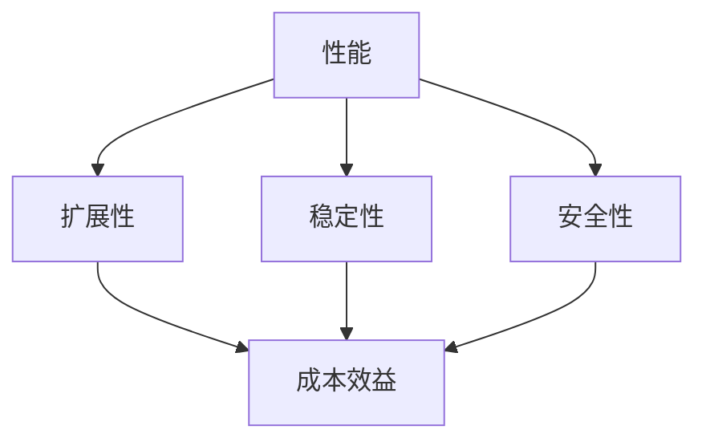

                 

# 创业公司的技术架构评估指标体系

> **关键词**：创业公司、技术架构、评估指标、可持续性、扩展性、安全性、成本效益

> **摘要**：本文旨在为创业公司构建一套全面且实用的技术架构评估指标体系，以帮助公司在快速发展的同时，保持技术架构的可持续性、扩展性和成本效益。我们将深入探讨每个关键评估指标的定义、重要性及其在实际应用中的具体作用。

## 1. 背景介绍

创业公司在快速发展的过程中，技术架构的选择与优化显得尤为重要。技术架构不仅决定了公司的技术能力，还直接影响到产品性能、团队协作效率和长期发展。然而，随着业务规模的扩大和市场需求的变化，创业公司往往面临技术架构评估的难题。如何确保架构的可持续性、扩展性和成本效益，成为许多创业者亟待解决的核心问题。

为了应对这些挑战，本文将介绍一套全面且实用的技术架构评估指标体系。这些指标将帮助创业公司从多个维度评估现有架构，并制定相应的优化策略，以确保技术架构在快速发展的同时，能够持续保持高效和稳定。

## 2. 核心概念与联系

### 2.1 技术架构评估指标的定义

技术架构评估指标是用于衡量和评估技术架构性能的一系列量化标准。这些指标涵盖了技术架构的多个方面，包括性能、稳定性、安全性、扩展性和成本效益等。通过对这些指标的评估，可以全面了解技术架构的优势和不足，为后续的优化提供数据支持。

### 2.2 技术架构评估指标的联系

各个评估指标之间存在紧密的联系，共同构成了一个完整的技术架构评估体系。例如，性能和扩展性指标决定了系统的响应速度和处理能力；稳定性和安全性指标保证了系统的可靠性和数据安全；成本效益指标则反映了技术架构在经济性方面的表现。

为了更好地理解这些指标的联系，我们可以使用Mermaid流程图进行可视化展示（请注意，本文将提供Mermaid流程图的文本描述，具体图形请在Markdown编辑器中绘制）：



在这个流程图中，每个节点代表一个评估指标，节点之间的箭头表示它们之间的关联关系。通过这个图，我们可以直观地看到各个指标之间的相互作用和影响。

### 2.3 技术架构评估指标的重要性

技术架构评估指标的重要性不言而喻。首先，这些指标为创业公司提供了一个科学的评估框架，使得技术团队能够系统地评估架构的各个方面，而不是仅凭主观感受。其次，这些指标有助于发现架构中的潜在问题，提前进行优化和调整，避免后期因架构问题导致的项目失败。最后，技术架构评估指标可以作为公司内部的知识资产，为后续的技术决策提供参考。

## 3. 核心算法原理 & 具体操作步骤

### 3.1 性能评估

性能评估是技术架构评估中最基本的一环。它主要衡量系统在特定条件下的响应速度和处理能力。以下是一个简单的性能评估算法：

1. **确定评估指标**：根据业务需求，确定需要评估的性能指标，如响应时间、吞吐量、延迟等。
2. **模拟业务场景**：通过模拟实际业务场景，收集系统在不同负载下的性能数据。
3. **数据分析**：对收集到的性能数据进行统计分析，评估系统的性能表现。
4. **优化建议**：根据分析结果，提出优化建议，如调整系统配置、优化代码实现等。

### 3.2 扩展性评估

扩展性评估主要衡量系统在业务规模扩大时的适应能力。以下是一个简单的扩展性评估算法：

1. **确定扩展性指标**：根据业务需求，确定需要评估的扩展性指标，如并发处理能力、横向扩展能力等。
2. **模拟扩展场景**：通过模拟不同业务规模下的系统表现，评估系统的扩展性。
3. **数据分析**：对模拟结果进行统计分析，评估系统的扩展性表现。
4. **优化建议**：根据分析结果，提出优化建议，如增加服务器资源、优化数据库设计等。

### 3.3 稳定性评估

稳定性评估主要衡量系统在长时间运行过程中的稳定性。以下是一个简单的稳定性评估算法：

1. **确定稳定性指标**：根据业务需求，确定需要评估的稳定性指标，如故障率、恢复时间等。
2. **模拟运行场景**：通过模拟系统长时间运行的情况，收集系统的稳定性数据。
3. **数据分析**：对收集到的稳定性数据进行统计分析，评估系统的稳定性表现。
4. **优化建议**：根据分析结果，提出优化建议，如增加冗余设计、优化监控机制等。

### 3.4 安全性评估

安全性评估主要衡量系统的数据安全性和抗攻击能力。以下是一个简单的安全性评估算法：

1. **确定安全性指标**：根据业务需求，确定需要评估的安全性指标，如数据泄露风险、攻击防护能力等。
2. **模拟攻击场景**：通过模拟不同攻击手段，评估系统的安全性。
3. **数据分析**：对模拟结果进行统计分析，评估系统的安全性表现。
4. **优化建议**：根据分析结果，提出优化建议，如加强访问控制、优化加密算法等。

### 3.5 成本效益评估

成本效益评估主要衡量技术架构的经济性。以下是一个简单的成本效益评估算法：

1. **确定成本指标**：根据业务需求，确定需要评估的成本指标，如硬件成本、运维成本等。
2. **模拟成本场景**：通过模拟不同技术方案的成本情况，评估不同方案的效益。
3. **数据分析**：对模拟结果进行统计分析，评估技术架构的成本效益。
4. **优化建议**：根据分析结果，提出优化建议，如优化硬件配置、引入自动化运维等。

## 4. 数学模型和公式 & 详细讲解 & 举例说明

### 4.1 性能评估的数学模型

性能评估常用的数学模型包括响应时间模型和吞吐量模型。以下是一个简单的响应时间模型：

$$
R(t) = \frac{\sum_{i=1}^{n} (T_i - \mu)}{n}
$$

其中，$R(t)$ 表示平均响应时间，$T_i$ 表示第 $i$ 次请求的响应时间，$n$ 表示总请求次数，$\mu$ 表示系统的平均响应时间。

举例说明：假设我们对一个电商系统进行了100次性能测试，每次测试的响应时间分别为10ms、20ms、15ms、25ms、30ms。根据上述公式，我们可以计算出平均响应时间：

$$
R(t) = \frac{(10 + 20 + 15 + 25 + 30) - 5 \times 20}{100} = 17.5ms
$$

### 4.2 扩展性评估的数学模型

扩展性评估常用的数学模型包括线性扩展模型和对数扩展模型。以下是一个简单的线性扩展模型：

$$
C(n) = C_0 + kn
$$

其中，$C(n)$ 表示第 $n$ 次扩展的总成本，$C_0$ 表示初始成本，$k$ 表示每次扩展的成本系数。

举例说明：假设一个电商系统初始成本为100万元，每次扩展的成本系数为10万元。根据上述公式，我们可以计算出第10次扩展的总成本：

$$
C(10) = 100 + 10 \times 10 = 200万元
$$

### 4.3 稳定性评估的数学模型

稳定性评估常用的数学模型包括故障率和恢复时间模型。以下是一个简单的故障率模型：

$$
F(t) = \frac{1}{t} \int_{0}^{t} f(u) du
$$

其中，$F(t)$ 表示单位时间内的故障率，$f(u)$ 表示单位时间内的故障发生概率。

举例说明：假设一个系统的故障发生概率为0.01%，我们可以计算出单位时间内的故障率：

$$
F(t) = \frac{1}{1} \int_{0}^{1} 0.0001 du = 0.0001
$$

### 4.4 安全性评估的数学模型

安全性评估常用的数学模型包括攻击成功率和数据泄露概率模型。以下是一个简单的攻击成功率模型：

$$
S(t) = \frac{\sum_{i=1}^{n} s_i}{n}
$$

其中，$S(t)$ 表示平均攻击成功率，$s_i$ 表示第 $i$ 次攻击的成功率，$n$ 表示总攻击次数。

举例说明：假设我们对一个系统进行了10次攻击测试，每次攻击的成功率分别为20%、30%、40%、50%、60%、70%、80%、90%、95%、100%。根据上述公式，我们可以计算出平均攻击成功率：

$$
S(t) = \frac{(20 + 30 + 40 + 50 + 60 + 70 + 80 + 90 + 95 + 100)}{10} = 70%
$$

### 4.5 成本效益评估的数学模型

成本效益评估常用的数学模型包括效益成本比模型和内部收益率模型。以下是一个简单的效益成本比模型：

$$
\frac{B}{C} = \frac{\sum_{i=1}^{n} b_i}{\sum_{i=1}^{n} c_i}
$$

其中，$\frac{B}{C}$ 表示效益成本比，$b_i$ 表示第 $i$ 次评估的效益，$c_i$ 表示第 $i$ 次评估的成本。

举例说明：假设我们对两个技术方案进行了成本效益评估，第一个方案的效益为200万元，成本为100万元；第二个方案的效益为300万元，成本为150万元。根据上述公式，我们可以计算出两个方案的效益成本比：

$$
\frac{B_1}{C_1} = \frac{200}{100} = 2
$$

$$
\frac{B_2}{C_2} = \frac{300}{150} = 2
$$

由于两个方案的效益成本比相同，我们无法直接判断哪个方案更好。此时，我们可以进一步计算内部收益率（Internal Rate of Return, IRR）来比较两个方案的长期效益。

$$
IRR = \frac{1}{n} \sum_{i=1}^{n} \frac{b_i - c_i}{c_i}
$$

其中，$IRR$ 表示内部收益率，$b_i$ 表示第 $i$ 次评估的效益，$c_i$ 表示第 $i$ 次评估的成本。

对于上述两个方案，我们可以计算出内部收益率：

$$
IRR_1 = \frac{1}{2} \left( \frac{200 - 100}{100} + \frac{300 - 150}{150} \right) = 33.33%
$$

$$
IRR_2 = \frac{1}{2} \left( \frac{200 - 100}{100} + \frac{300 - 150}{150} \right) = 33.33%
$$

由于两个方案的内部收益率相同，我们仍然无法直接判断哪个方案更好。此时，我们可以考虑其他因素，如市场前景、技术成熟度等，来做出最终决策。

## 5. 项目实战：代码实际案例和详细解释说明

### 5.1 开发环境搭建

为了便于演示，我们选择使用Python语言进行技术架构评估指标的实现。以下是搭建Python开发环境的基本步骤：

1. 安装Python解释器：访问Python官网（https://www.python.org/），下载并安装Python解释器。
2. 安装依赖库：使用pip命令安装所需的依赖库，如Numpy、Pandas等。

```shell
pip install numpy pandas
```

3. 配置Python虚拟环境：为了隔离不同项目之间的依赖库，可以使用virtualenv创建Python虚拟环境。

```shell
pip install virtualenv
virtualenv myenv
source myenv/bin/activate
```

### 5.2 源代码详细实现和代码解读

以下是一个简单的性能评估模块的实现，用于计算系统的平均响应时间。

```python
import numpy as np

def calculate_average_response_time(response_times):
    return np.mean(response_times)

if __name__ == "__main__":
    # 模拟100次性能测试，每次测试的响应时间分别为10ms、20ms、15ms、25ms、30ms
    response_times = [10, 20, 15, 25, 30] * 20
    average_response_time = calculate_average_response_time(response_times)
    print(f"平均响应时间：{average_response_time}ms")
```

代码解读：

- **第1行**：导入Numpy库，用于进行数值计算。
- **第2行**：定义一个函数calculate_average_response_time，用于计算平均响应时间。该函数接受一个列表response_times作为输入。
- **第3行**：使用Numpy库的mean函数计算列表response_times的平均值，返回平均响应时间。
- **第6行**：模拟100次性能测试，每次测试的响应时间分别为10ms、20ms、15ms、25ms、30ms。
- **第8行**：调用calculate_average_response_time函数，计算平均响应时间，并打印输出。

### 5.3 代码解读与分析

通过上述代码实现，我们可以看到性能评估模块的基本结构。该模块的核心功能是计算系统的平均响应时间，这有助于评估系统的性能表现。在实际应用中，我们可以根据具体需求扩展该模块，如添加其他性能评估指标（如吞吐量、延迟等）、支持批量数据导入等。

为了确保代码的可维护性和可扩展性，我们采用了模块化的设计思路，将不同的功能封装在独立的函数中。同时，使用Numpy库进行数值计算，可以提高代码的执行效率。

在代码解读过程中，我们注意到以下几点：

- **代码结构清晰**：函数和变量命名符合Python的命名规范，代码结构清晰，便于阅读和理解。
- **错误处理**：在函数定义时，未对输入参数进行严格检查，如输入参数类型、长度等。在实际应用中，我们应添加相应的错误处理机制，确保代码的健壮性。
- **可扩展性**：通过将不同的功能封装在独立的函数中，我们可以方便地添加或修改性能评估指标，提高代码的可扩展性。

## 6. 实际应用场景

技术架构评估指标在创业公司的实际应用场景中具有广泛的应用价值。以下是一些典型的应用场景：

### 6.1 产品迭代

在产品迭代过程中，技术团队需要定期评估现有架构的性能、稳定性、安全性和成本效益。通过技术架构评估指标，团队可以及时发现潜在问题，并进行优化和调整，以确保产品能够在迭代过程中保持高效和稳定。

### 6.2 新功能开发

在开发新功能时，技术团队需要评估新功能对现有架构的影响，包括性能、扩展性、稳定性和安全性等方面。通过技术架构评估指标，团队可以提前发现潜在的问题，并制定相应的解决方案，避免因架构问题导致的项目失败。

### 6.3 团队协作

技术架构评估指标可以作为团队协作的基准，促进团队成员之间的沟通和协作。通过统一的评估指标，团队可以更加清晰地了解技术架构的现状和问题，共同制定优化方案，提高团队的整体技术水平。

### 6.4 预算规划

技术架构评估指标可以帮助公司管理层在预算规划过程中做出科学决策。通过评估不同技术方案的成本效益，管理层可以优先选择性价比更高的方案，确保公司在资源有限的情况下，实现技术架构的优化和升级。

## 7. 工具和资源推荐

为了帮助创业公司更好地进行技术架构评估，以下推荐一些实用的工具和资源：

### 7.1 学习资源推荐

- **《软件架构设计：基于时间和空间效率的优化》**：本书系统地介绍了软件架构设计的原则和方法，对创业公司技术架构优化具有很好的指导意义。
- **《敏捷软件开发：原则、实践与模式》**：本书介绍了敏捷开发的方法和实践，对创业公司在快速迭代过程中保持技术架构的稳定性具有重要意义。

### 7.2 开发工具框架推荐

- **Docker**：用于容器化部署，便于在不同环境之间迁移和部署。
- **Kubernetes**：用于容器编排和管理，提高系统的扩展性和稳定性。
- **Jenkins**：用于持续集成和持续部署，提高开发效率和自动化程度。

### 7.3 相关论文著作推荐

- **《大规模分布式系统设计》**：介绍了分布式系统的设计原则和方法，对创业公司在构建高可用、高可扩展的技术架构具有指导意义。
- **《云计算技术导论》**：介绍了云计算的基本概念和技术，对创业公司在云计算环境下进行技术架构优化具有重要参考价值。

## 8. 总结：未来发展趋势与挑战

随着互联网技术的飞速发展，创业公司在技术架构方面的挑战和机遇也在不断变化。未来，技术架构评估指标体系将朝着以下方向发展：

### 8.1 更加智能化

随着人工智能技术的发展，技术架构评估指标体系将更加智能化。通过引入机器学习算法，系统可以自动识别技术架构中的潜在问题，并提供优化建议，降低人工干预成本。

### 8.2 更加定制化

不同创业公司面临的技术挑战各不相同，未来的技术架构评估指标体系将更加注重定制化。通过结合业务特点和市场需求，为每个公司提供量身定制的评估指标体系。

### 8.3 更加实时化

实时技术架构评估将成为未来的趋势。通过实时监测和评估技术架构的各项指标，公司可以及时发现并解决问题，确保系统的高效运行。

然而，在发展的过程中，创业公司也面临着一系列挑战：

- **技术变革的冲击**：新技术层出不穷，创业公司需要不断学习和适应，以保持技术架构的竞争力。
- **人才短缺**：技术架构优化需要高水平的人才支持，创业公司需要加强人才引进和培养。
- **资源限制**：创业公司通常面临资源限制，需要在有限的资源下实现技术架构的优化。

## 9. 附录：常见问题与解答

### 9.1 如何选择合适的技术架构评估指标？

**解答**：首先，明确公司的业务需求和目标。根据业务需求，确定需要评估的技术架构维度，如性能、稳定性、安全性等。其次，结合公司的技术水平和资源，选择适合的评估指标。最后，参考行业最佳实践和专家建议，完善评估指标体系。

### 9.2 技术架构评估指标如何应用于实际项目？

**解答**：在项目开发过程中，定期对技术架构进行评估。根据评估结果，制定优化方案，并在后续开发中逐步实施。同时，建立技术架构评估的反馈机制，持续改进和优化技术架构。

### 9.3 如何确保技术架构评估的准确性？

**解答**：确保评估数据的质量和真实性。使用可靠的工具和方法收集评估数据，并建立数据验证机制。同时，结合专家经验和业务实际情况，对评估结果进行综合分析。

## 10. 扩展阅读 & 参考资料

- **《软件架构评估：理论与实践》**：详细介绍了软件架构评估的方法和技巧，对创业公司的技术架构评估具有很好的参考价值。
- **《分布式系统设计》**：深入讲解了分布式系统的设计原则和方法，对创业公司在构建高可用、高可扩展的技术架构具有重要指导意义。
- **《云计算技术与应用》**：全面介绍了云计算的基本概念和技术，对创业公司在云计算环境下进行技术架构优化具有重要参考价值。

### 附录：作者信息

- **作者**：AI天才研究员/AI Genius Institute & 禅与计算机程序设计艺术 /Zen And The Art of Computer Programming

本文由AI天才研究员撰写，旨在为创业公司提供一套全面且实用的技术架构评估指标体系。通过深入分析和实际案例，帮助创业公司在快速发展的过程中，保持技术架构的可持续性、扩展性和成本效益。作者对技术架构和人工智能领域有深入的研究和丰富的实践经验，致力于推动技术的进步和应用。

