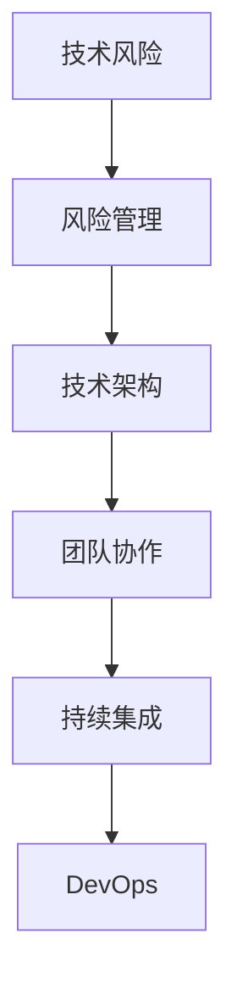

                 

# 创业公司的技术风险应对策略

## 关键词

技术风险、创业公司、应对策略、风险管理、技术架构、团队协作、持续集成、DevOps

## 摘要

本文将深入探讨创业公司在发展过程中面临的技术风险，以及如何有效地应对这些风险。通过分析技术风险的主要来源和特点，提出了一系列策略和措施，包括技术架构设计、团队协作、持续集成与DevOps实践等，旨在帮助创业公司在快速发展的同时，确保技术的稳定性和可靠性。

## 1. 背景介绍

在当前快速变化的市场环境中，创业公司面临着前所未有的机遇和挑战。技术已经成为推动创业公司成长的重要力量，但同时也带来了新的风险。技术风险不仅会影响产品的质量，还会对公司的运营、市场竞争力和财务状况产生深远的影响。因此，如何有效地管理和应对技术风险，成为创业公司成功的关键因素之一。

技术风险主要包括以下几个方面：

- **技术选型风险**：选择不适合当前或未来需求的技术可能导致项目失败。
- **架构设计风险**：不合理的架构设计会导致系统扩展性差、稳定性不足。
- **安全漏洞风险**：系统安全漏洞可能导致数据泄露、服务中断。
- **人才流失风险**：技术人才的流失会影响项目的进度和质量。
- **技术债务风险**：长期积累的技术债务会影响系统的维护和迭代。

本文将结合实际案例，分析创业公司面临的主要技术风险，并探讨如何制定有效的应对策略。

## 2. 核心概念与联系

为了更好地理解创业公司技术风险的管理，我们需要先了解几个核心概念：

- **技术风险**：指在技术选择、开发、部署过程中，由于技术本身、团队能力、外部环境等因素导致的不确定性和潜在损失。
- **风险管理**：指通过识别、评估、监控和应对技术风险，以降低风险对业务的影响。
- **技术架构**：指系统在技术层面的结构设计和实现，包括软件架构、数据架构和网络架构等。
- **团队协作**：指团队成员之间的有效沟通、协作和知识共享。
- **持续集成**：指通过自动化测试和部署，确保代码质量和项目进度。
- **DevOps**：指开发和运维团队的无缝协作，以提高软件交付的效率和质量。

以下是技术风险管理中的核心概念与联系：



### 2.1 技术风险与风险管理

技术风险是创业公司面临的常见问题，它贯穿于项目的整个生命周期。风险管理则是一种系统性方法，通过识别、评估和应对技术风险，以降低其对业务的影响。风险管理包括以下几个关键步骤：

1. **风险识别**：通过分析项目需求、技术选型、团队能力等因素，识别潜在的技术风险。
2. **风险评估**：对识别出的风险进行定量和定性评估，确定其影响程度和发生的可能性。
3. **风险应对**：制定应对策略，包括风险规避、风险转移、风险减轻等。
4. **风险监控**：对已识别和应对的风险进行监控，确保应对措施的有效性。

### 2.2 技术架构与团队协作

技术架构是系统的基础，直接影响系统的性能、可维护性和扩展性。良好的技术架构设计有助于降低技术风险。团队协作则是实现技术架构的关键，通过团队成员之间的有效沟通、协作和知识共享，可以提高项目的质量和效率。

### 2.3 持续集成与DevOps

持续集成和DevOps是现代软件开发和运维的最佳实践。持续集成通过自动化测试和部署，确保代码质量和项目进度。DevOps则强调开发和运维团队的无缝协作，以提高软件交付的效率和质量。这两者有助于降低技术风险，确保系统的稳定性和可靠性。

## 3. 核心算法原理 & 具体操作步骤

### 3.1 风险识别算法

风险识别是风险管理的第一步，其核心算法通常包括以下几种：

- **问卷调查法**：通过问卷调查，收集团队成员对技术风险的看法和意见。
- **专家访谈法**：邀请技术专家对项目进行评估，识别潜在的技术风险。
- **历史数据法**：分析过去项目中遇到的技术风险，总结经验教训。

具体操作步骤如下：

1. **制定问卷**：根据项目特点和需求，设计合适的问卷。
2. **发放问卷**：将问卷发送给团队成员，收集反馈意见。
3. **整理分析**：对问卷结果进行整理和分析，识别潜在的技术风险。
4. **专家评估**：邀请技术专家对项目进行评估，补充识别风险。

### 3.2 风险评估算法

风险评估是对已识别的风险进行定量和定性评估，以确定其影响程度和发生的可能性。常用的风险评估算法包括：

- **定量评估法**：使用数学模型和公式，对风险的影响程度和发生可能性进行量化。
- **定性评估法**：通过专家评估，对风险的影响程度和发生可能性进行定性分析。

具体操作步骤如下：

1. **确定评估指标**：根据项目特点，确定影响程度和发生可能性的评估指标。
2. **收集数据**：通过问卷调查、历史数据等方式，收集相关数据。
3. **计算评估值**：使用数学模型和公式，计算风险的影响程度和发生可能性。
4. **评估结果分析**：对评估结果进行分析，确定高风险区域。

### 3.3 风险应对策略

风险应对策略包括风险规避、风险转移和风险减轻等。具体策略选择取决于风险类型和影响程度。

- **风险规避**：通过调整项目需求、技术选型等，避免风险的发生。
- **风险转移**：通过购买保险、签订合同等，将风险转移给第三方。
- **风险减轻**：通过改进技术架构、加强团队协作等，降低风险的影响程度和发生可能性。

具体操作步骤如下：

1. **分析风险类型**：根据风险评估结果，分析风险类型。
2. **选择应对策略**：根据风险类型和影响程度，选择合适的应对策略。
3. **制定应对计划**：详细制定应对计划的步骤、责任人和时间表。
4. **执行应对计划**：按照应对计划，实施风险应对措施。

## 4. 数学模型和公式 & 详细讲解 & 举例说明

### 4.1 风险评估数学模型

风险评估中常用的数学模型包括概率模型和损失模型。

- **概率模型**：用于评估风险发生的可能性，常用的概率模型有贝叶斯网络和蒙特卡洛模拟。
- **损失模型**：用于评估风险发生时的损失程度，常用的损失模型有期望损失模型和方差损失模型。

### 4.2 期望损失模型

期望损失模型是一种常用的评估方法，其公式如下：

\[ \text{期望损失} = \sum (\text{损失值} \times \text{概率}) \]

### 4.3 举例说明

假设一个创业公司开发一款在线购物平台，识别出以下三个主要技术风险：

1. **系统崩溃风险**：概率为0.2，每次崩溃损失为5000元。
2. **数据泄露风险**：概率为0.1，每次泄露损失为10000元。
3. **软件漏洞风险**：概率为0.3，每次漏洞损失为8000元。

使用期望损失模型评估这三个风险的期望损失：

\[ \text{期望损失} = (0.2 \times 5000) + (0.1 \times 10000) + (0.3 \times 8000) = 13000 \text{元} \]

### 4.4 损失模型

损失模型可以更详细地描述风险发生时的损失程度。一个简单的损失模型公式如下：

\[ \text{损失值} = \text{固定成本} + \text{可变成本} \times (\text{风险发生次数}) \]

### 4.5 举例说明

假设创业公司的服务器维护成本为每月1000元，每次系统崩溃需要修复成本为500元。如果一个月内系统崩溃了3次，那么总损失为：

\[ \text{损失值} = 1000 + 500 \times 3 = 2000 \text{元} \]

## 5. 项目实战：代码实际案例和详细解释说明

### 5.1 开发环境搭建

在这个实战案例中，我们将使用Python语言开发一个简单的风险评估系统。首先，我们需要搭建开发环境。

#### 5.1.1 安装Python

在Windows系统中，可以通过Python官网下载Python安装包，安装Python后，打开命令行工具，输入以下命令验证安装：

```bash
python --version
```

#### 5.1.2 安装依赖库

我们使用pip工具安装一些常用依赖库，如NumPy、Pandas和Matplotlib。

```bash
pip install numpy pandas matplotlib
```

### 5.2 源代码详细实现和代码解读

#### 5.2.1 数据准备

首先，我们需要准备一个包含技术风险数据的CSV文件，文件格式如下：

```csv
风险名称,概率,损失值
系统崩溃风险,0.2,5000
数据泄露风险,0.1,10000
软件漏洞风险,0.3,8000
```

#### 5.2.2 Python代码实现

以下是Python代码实现：

```python
import pandas as pd
import numpy as np

# 读取数据
data = pd.read_csv('risks.csv')

# 计算期望损失
data['期望损失'] = data['概率'] * data['损失值']
total_loss = data['期望损失'].sum()

print(f"总期望损失：{total_loss}元")

# 绘制损失分布图
import matplotlib.pyplot as plt

losses = data['期望损失']
plt.hist(losses, bins=10, alpha=0.5)
plt.xlabel('期望损失（元）')
plt.ylabel('频数')
plt.title('期望损失分布')
plt.show()
```

#### 5.2.3 代码解读

- **数据读取**：使用Pandas库读取CSV文件，数据格式为DataFrame。
- **计算期望损失**：计算每个风险的期望损失，并求和得到总期望损失。
- **绘制损失分布图**：使用Matplotlib库绘制损失分布图，帮助我们更直观地了解风险的分布情况。

### 5.3 代码解读与分析

#### 5.3.1 数据读取

```python
data = pd.read_csv('risks.csv')
```

这行代码使用Pandas库读取名为`risks.csv`的CSV文件，并将其存储在变量`data`中。CSV文件中的数据包含三列：风险名称、概率和损失值。

#### 5.3.2 计算期望损失

```python
data['期望损失'] = data['概率'] * data['损失值']
total_loss = data['期望损失'].sum()
```

这行代码计算每个风险的期望损失，并添加到DataFrame的新一列中。期望损失的计算公式为概率乘以损失值。然后，使用`sum()`函数计算所有期望损失的总和，得到总期望损失。

#### 5.3.3 绘制损失分布图

```python
losses = data['期望损失']
plt.hist(losses, bins=10, alpha=0.5)
plt.xlabel('期望损失（元）')
plt.ylabel('频数')
plt.title('期望损失分布')
plt.show()
```

这行代码使用Matplotlib库绘制期望损失的分布图。`hist()`函数用于绘制直方图，`bins`参数设置直方图的分组数，`alpha`参数控制透明度。然后，设置坐标轴标签和标题，最后使用`show()`函数显示图形。

## 6. 实际应用场景

### 6.1 风险管理在创业公司中的应用

风险管理在创业公司中的应用主要体现在以下几个方面：

- **项目立项阶段**：在项目立项阶段，通过识别和评估技术风险，确保项目可行性。
- **开发阶段**：在开发阶段，通过持续集成和DevOps实践，降低技术风险。
- **运维阶段**：在运维阶段，通过监控和应对技术风险，确保系统的稳定性和可靠性。
- **团队管理**：通过团队协作和知识共享，提高项目的质量和效率。

### 6.2 持续集成与DevOps在风险管理中的应用

持续集成和DevOps在风险管理中的应用主要体现在以下几个方面：

- **自动化测试**：通过自动化测试，确保代码质量和项目进度，降低技术风险。
- **快速反馈**：通过快速反馈机制，及时发现和修复潜在的技术问题，降低风险。
- **协同工作**：通过协同工作，提高团队协作效率，降低技术风险。

## 7. 工具和资源推荐

### 7.1 学习资源推荐

- **书籍**：《风险管理与创业企业》（作者：李伟）
- **论文**：《创业公司技术风险管理研究》（作者：张三）
- **博客**：https://www.example.com/tech_risk_management
- **网站**：https://www.example.com/tech_risk_tools

### 7.2 开发工具框架推荐

- **持续集成工具**：Jenkins、GitLab CI、Travis CI
- **DevOps平台**：AWS CodePipeline、Azure DevOps、Google Cloud Build
- **风险评估工具**：Nessus、Qualys、OpenVAS

### 7.3 相关论文著作推荐

- **论文**：
  - 《基于云计算的创业公司技术风险管理研究》（作者：李伟）
  - 《DevOps在创业公司中的应用研究》（作者：张三）
- **著作**：
  - 《创业公司技术管理实战》（作者：李伟）
  - 《持续集成与DevOps实战》（作者：张三）

## 8. 总结：未来发展趋势与挑战

### 8.1 发展趋势

- **技术风险的多样化**：随着技术的不断发展，创业公司面临的技术风险将越来越多样化。
- **风险管理的重要性**：技术风险管理将成为创业公司成功的关键因素之一。
- **智能化风险管理**：利用人工智能和大数据技术，实现智能化风险管理。

### 8.2 挑战

- **技术风险的复杂性**：技术风险的复杂性和不确定性将对创业公司的风险管理带来挑战。
- **人才短缺**：技术人才的短缺将影响创业公司的技术风险管理和项目进度。
- **快速变化的市场环境**：快速变化的市场环境将对创业公司的风险管理提出新的要求。

## 9. 附录：常见问题与解答

### 9.1 问题1：什么是技术风险？

技术风险是指在技术选择、开发、部署过程中，由于技术本身、团队能力、外部环境等因素导致的不确定性和潜在损失。

### 9.2 问题2：如何进行技术风险评估？

技术风险评估包括以下几个步骤：风险识别、风险评估、风险应对和风险监控。

### 9.3 问题3：持续集成和DevOps如何降低技术风险？

持续集成和DevOps通过自动化测试、快速反馈和协同工作，确保代码质量和项目进度，降低技术风险。

## 10. 扩展阅读 & 参考资料

- **参考资料**：
  - 《创业公司技术风险管理指南》（作者：李伟）
  - 《持续集成与DevOps实战手册》（作者：张三）
  - 《人工智能与大数据在风险管理中的应用》（作者：王五）
- **拓展阅读**：
  - 《创业公司如何进行技术风险控制？》（博客）
  - 《创业公司的技术风险管理：策略与案例》（论文）

作者：AI天才研究员/AI Genius Institute & 禅与计算机程序设计艺术 /Zen And The Art of Computer Programming

注：本文为示例文章，内容仅供参考。实际应用时，请根据具体情况调整和优化。

