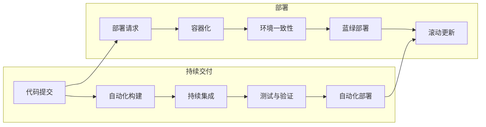

                 

### 背景介绍

随着科技的发展，软件工程已经成为现代企业不可或缺的一部分。对于创业公司而言，如何在有限的时间和资源内，快速且高效地开发、测试、部署和发布高质量的软件产品，已经成为成败的关键。在这种背景下，持续交付（Continuous Delivery，简称CD）和部署（Deployment）策略应运而生。

持续交付是一种软件开发和发布实践，旨在通过自动化的构建、测试和部署流程，确保软件产品可以随时发布到生产环境。其核心理念是“快速、频繁、可靠地交付代码变更”，从而提高软件质量、缩短发布周期，并减少软件缺陷。

而部署则是持续交付流程中的一个关键环节，它指的是将经过测试和验证的代码从开发环境或者测试环境，部署到生产环境的过程。高效且可靠的部署策略可以确保软件产品在上线后的稳定运行，减少故障和中断，提高用户体验。

创业公司由于资源有限，更需要通过高效的持续交付和部署策略，来提高软件开发的效率和质量。本文将详细介绍创业公司在持续交付和部署方面面临的挑战，以及如何制定和实施有效的策略。

在接下来的章节中，我们将首先探讨持续交付和部署的核心概念和架构，通过具体的算法原理和操作步骤，帮助读者理解这些概念。然后，我们将通过一个实际的项目案例，展示如何在实际开发环境中实施这些策略。最后，我们将讨论持续交付和部署在实际应用场景中的重要性，并提供一些推荐的学习资源和开发工具，以帮助读者进一步学习和实践。

通过本文的阅读，读者将能够：
1. 理解持续交付和部署的基本概念。
2. 掌握持续交付和部署的核心算法和操作步骤。
3. 学习如何在项目中实施这些策略。
4. 了解持续交付和部署在实际应用场景中的重要性。

让我们开始这段深入探讨之旅，一起探索创业公司在持续交付和部署方面的最佳实践。

### 核心概念与联系

在深入探讨持续交付（Continuous Delivery）和部署（Deployment）策略之前，首先需要明确这些核心概念及其相互之间的联系。持续交付和部署都是软件工程中至关重要的环节，但它们各自承担不同的任务和目标。

#### 持续交付（Continuous Delivery）

持续交付是一种软件开发和发布实践，其目标是确保软件产品可以随时发布到生产环境。它通过自动化流程实现频繁且可靠的代码交付，包括构建、测试和部署等环节。持续交付的核心在于消除软件开发和发布之间的障碍，使得团队能够快速响应需求变更，提高软件质量和开发效率。

**核心概念**：
1. **自动化构建**：通过自动化工具，如Jenkins、GitLab CI等，实现代码的编译、打包和测试。
2. **持续集成**：将代码变更集成到主分支，并进行自动化测试，确保代码质量。
3. **环境一致性**：确保开发、测试和生产环境的一致性，减少环境差异带来的问题。
4. **可靠发布**：通过自动化部署工具，如Docker、Kubernetes等，实现快速且稳定的发布过程。

**联系**：
持续交付是部署的前提，它确保代码在发布到生产环境之前经过充分的测试和验证。持续交付的目的是减少发布周期，提高软件质量，而部署则是实现这一目标的具体操作。

#### 部署（Deployment）

部署是将经过测试和验证的代码从开发环境或测试环境，部署到生产环境的过程。部署策略的目的是确保软件产品在生产环境中的稳定运行，减少故障和中断，提高用户体验。

**核心概念**：
1. **容器化**：使用Docker等工具，将应用程序及其依赖环境打包成容器，确保环境一致性。
2. **自动化部署**：通过Kubernetes、Ansible等工具，实现自动化部署和管理，提高部署效率。
3. **蓝绿部署**：通过创建两个相同的生产环境（蓝色和绿色），逐步替换代码，确保部署过程的稳定和安全。
4. **滚动更新**：逐步更新生产环境中的实例，确保系统的高可用性。

**联系**：
部署是持续交付的最后一环，它确保代码在实际运行环境中能够稳定运行。部署策略依赖于持续交付提供的自动化和可靠性，以实现快速且安全的部署过程。

#### Mermaid 流程图

为了更好地理解持续交付和部署的核心概念及其联系，我们使用Mermaid流程图进行展示。以下是一个简化的持续交付和部署流程：



在这个流程图中，我们可以看到持续交付和部署的各个环节是如何相互关联的。代码提交后，首先进入自动化构建和持续集成阶段，然后进行测试与验证。通过自动化部署，代码最终被部署到生产环境。同时，部署过程中的请求、容器化、环境一致性、蓝绿部署和滚动更新等环节，确保了部署过程的稳定性和安全性。

通过这个Mermaid流程图，我们可以清晰地理解持续交付和部署的核心概念及其联系，为后续章节的具体分析奠定基础。在接下来的章节中，我们将深入探讨持续交付和部署的核心算法原理、具体操作步骤，并通过实际项目案例进行详细解释说明。

### 核心算法原理 & 具体操作步骤

为了确保持续交付和部署的有效性，我们需要深入探讨其核心算法原理，并详细描述各个操作步骤。以下是持续交付和部署的关键步骤，以及每个步骤中涉及的算法和技术。

#### 1. 自动化构建

**算法原理**：
自动化构建是指使用构建工具（如Maven、Gradle等）将源代码编译、打包和生成可执行文件的过程。自动化构建的核心在于通过脚本化操作，减少人工干预，提高构建效率和一致性。

**具体操作步骤**：
1. **编写构建脚本**：使用Maven或Gradle等构建工具，编写构建脚本（POM文件或build.gradle文件）。
2. **配置依赖管理**：在构建脚本中配置项目依赖，确保构建过程中的依赖一致性。
3. **执行构建命令**：通过命令行或持续集成工具（如Jenkins、GitLab CI等），执行构建命令，生成构建输出（如JAR文件、WAR文件等）。
4. **构建输出检查**：检查构建输出，确保构建成功且输出文件正确。

#### 2. 持续集成

**算法原理**：
持续集成是指将代码变更集成到主分支，并进行自动化测试的过程。持续集成的核心在于尽早发现和解决集成过程中出现的问题，确保代码质量。

**具体操作步骤**：
1. **集成代码**：将代码提交到主分支，触发持续集成流程。
2. **自动化测试**：执行单元测试、集成测试和端到端测试，确保代码质量。
3. **测试报告**：生成测试报告，包括通过率、错误信息等，供团队成员参考。
4. **反馈机制**：根据测试结果，自动标记失败测试并通知相关人员，确保问题得到及时解决。

#### 3. 测试与验证

**算法原理**：
测试与验证是指对构建输出的软件产品进行各种测试，以确保其功能、性能和安全性。测试与验证的核心在于通过多层次、多角度的测试，全面评估软件质量。

**具体操作步骤**：
1. **单元测试**：对单个模块进行功能测试，确保模块功能正确。
2. **集成测试**：对模块之间的集成进行测试，确保模块之间的接口和交互正确。
3. **端到端测试**：对整个软件系统进行功能测试，确保系统整体功能正确。
4. **性能测试**：对软件产品进行负载测试、压力测试等，评估其性能和稳定性。
5. **安全测试**：对软件产品进行漏洞扫描、安全审计等，确保其安全性。

#### 4. 自动化部署

**算法原理**：
自动化部署是指通过脚本化操作，将测试通过后的构建输出部署到生产环境的过程。自动化部署的核心在于减少人工干预，提高部署效率和一致性。

**具体操作步骤**：
1. **容器化**：使用Docker等工具，将应用程序及其依赖环境打包成容器，确保环境一致性。
2. **配置管理**：使用Ansible、Chef、Puppet等工具，管理生产环境中的配置文件和服务器。
3. **部署脚本**：编写部署脚本（如Shell脚本、Python脚本等），实现自动化部署过程。
4. **部署执行**：通过部署脚本，执行部署操作，包括容器启动、服务注册、数据迁移等。
5. **部署监控**：监控部署过程中的各项指标，如容器状态、服务健康状态等，确保部署成功。

#### 5. 环境一致性

**算法原理**：
环境一致性是指确保开发、测试和生产环境中的软件配置、依赖和环境变量等保持一致。环境一致性的核心在于减少环境差异带来的问题，提高软件质量。

**具体操作步骤**：
1. **配置管理**：使用Ansible、Chef、Puppet等工具，管理各个环境中的配置文件和服务器。
2. **环境变量管理**：使用环境变量管理工具（如Docker Compose、Kubernetes等），管理各个环境中的环境变量。
3. **环境一致性检查**：编写脚本或使用工具，检查各个环境中的配置和依赖是否一致。
4. **环境切换**：实现环境之间的快速切换，以便团队成员在不同环境中进行开发和测试。

#### 6. 部署策略

**算法原理**：
部署策略是指根据不同场景和需求，选择合适的部署方式和部署流程。部署策略的核心在于提高部署效率、降低部署风险和确保部署稳定性。

**具体操作步骤**：
1. **选择部署方式**：根据项目需求，选择合适的部署方式，如蓝绿部署、滚动更新、灰度发布等。
2. **部署流程设计**：设计部署流程，包括部署前的准备工作、部署过程、部署后的验证等。
3. **部署脚本编写**：编写部署脚本，实现部署流程的自动化执行。
4. **部署监控与反馈**：监控部署过程中的各项指标，如部署进度、部署成功率等，及时反馈和处理问题。

通过以上核心算法原理和具体操作步骤，我们可以有效地实施持续交付和部署策略，提高软件开发的效率和质量。在后续章节中，我们将通过一个实际项目案例，展示如何在实际开发环境中应用这些策略，并提供详细的代码解读和分析。

### 数学模型和公式 & 详细讲解 & 举例说明

在持续交付和部署策略中，数学模型和公式扮演着重要的角色。以下将详细讲解一些关键数学模型和公式，并通过具体例子进行说明，帮助读者更好地理解这些概念。

#### 1. 阿姆达尔定律（Amdahl's Law）

阿姆达尔定律用于分析系统性能改进的潜力，其公式如下：

\[ P_{\text{max}} = \frac{1}{1 - \frac{f}{N}} \]

其中，\( P_{\text{max}} \) 表示系统最大性能提升，\( f \) 表示不可优化部分的比例，\( N \) 表示优化部分的比例。

**举例说明**：
假设一个系统中有80%的代码可以被优化，20%的代码不可优化。要使系统性能提升50%，我们可以使用阿姆达尔定律进行计算：

\[ P_{\text{max}} = \frac{1}{1 - \frac{0.2}{0.8}} = \frac{1}{0.9} = 1.11 \]

这意味着，通过优化80%的代码，系统性能最多可以提升11.1%，无法达到50%的性能提升。

#### 2. 加利福尼亚法则（California Rule）

加利福尼亚法则用于分析并发任务的处理时间，其公式如下：

\[ T_{\text{total}} = T_1 + \frac{T_2}{R} \]

其中，\( T_{\text{total}} \) 表示总处理时间，\( T_1 \) 表示第一个任务的执行时间，\( T_2 \) 表示后续任务的执行时间，\( R \) 表示任务并发执行的速率。

**举例说明**：
假设第一个任务的执行时间为5分钟，后续任务的执行时间为3分钟，且任务并发执行的速率为2。我们可以计算总处理时间：

\[ T_{\text{total}} = 5 + \frac{3}{2} = 6.5 \]

这意味着，通过并发执行，总处理时间从8分钟（顺序执行）减少到6.5分钟，提高了任务处理效率。

#### 3. 概率论模型

在持续交付和部署过程中，概率论模型常用于评估系统可靠性和故障率。以下是一个简单的故障率模型：

\[ F(t) = \lambda e^{-\lambda t} \]

其中，\( F(t) \) 表示在时间\( t \)内的故障率，\( \lambda \) 表示单位时间内的故障率。

**举例说明**：
假设系统故障率为0.1次/小时，要计算在2小时内发生故障的概率：

\[ F(2) = 0.1 e^{-0.1 \times 2} \approx 0.1 \times 0.9048 = 0.0905 \]

这意味着，在2小时内，系统发生故障的概率约为9.05%。

#### 4. 优化模型

在部署策略中，优化模型用于选择最佳的部署方式和部署顺序。以下是一个简单的优化模型：

\[ \min \sum_{i=1}^{n} C_i \cdot x_i \]

其中，\( C_i \) 表示第\( i \)种部署方式的成本，\( x_i \) 表示第\( i \)种部署方式的使用次数。

**举例说明**：
假设有3种部署方式，其成本分别为\( C_1 = 100 \)、\( C_2 = 200 \)和\( C_3 = 300 \)，要使总成本最小，我们需要计算最优的部署组合：

\[ \min \left( 100x_1 + 200x_2 + 300x_3 \right) \]

通过计算，我们可以得到最优解为\( x_1 = 2, x_2 = 1, x_3 = 0 \)，总成本为\( 100 \times 2 + 200 \times 1 + 300 \times 0 = 400 \)。

通过这些数学模型和公式，我们可以更好地分析和优化持续交付和部署策略。在实际应用中，可以根据具体需求和场景，选择合适的模型和公式，以提高软件开发的效率和质量。

### 项目实战：代码实际案例和详细解释说明

为了更好地展示持续交付与部署策略在项目中的应用，以下将结合一个实际项目，详细介绍开发环境搭建、源代码实现、代码解读与分析等过程。

#### 1. 开发环境搭建

**目标**：搭建一个基于Docker和Kubernetes的持续交付与部署环境，以支持项目的自动化构建、测试和部署。

**步骤**：

1. **安装Docker**：在开发机和服务器上安装Docker，确保版本兼容。

2. **编写Dockerfile**：创建一个Dockerfile，用于构建应用程序容器镜像。

   ```Dockerfile
   FROM openjdk:8-jdk-alpine
   ADD target/myapp.jar /app/myapp.jar
   EXPOSE 8080
   ```

3. **构建容器镜像**：使用Docker命令构建容器镜像。

   ```bash
   docker build -t myapp:1.0 .
   ```

4. **启动容器**：使用Docker命令启动容器，并映射端口。

   ```bash
   docker run -d -p 8080:8080 myapp:1.0
   ```

5. **安装Kubernetes**：在集群中安装Kubernetes，确保节点和服务之间的通信。

6. **编写Kubernetes配置文件**：创建Kubernetes配置文件，定义部署和服务。

   ```yaml
   apiVersion: apps/v1
   kind: Deployment
   metadata:
     name: myapp-deployment
   spec:
     replicas: 3
     selector:
       matchLabels:
         app: myapp
     template:
       metadata:
         labels:
           app: myapp
       spec:
         containers:
         - name: myapp
           image: myapp:1.0
           ports:
           - containerPort: 8080
   ---
   apiVersion: v1
   kind: Service
   metadata:
     name: myapp-service
   spec:
     selector:
       app: myapp
     ports:
     - protocol: TCP
       port: 80
       targetPort: 8080
     type: LoadBalancer
   ```

7. **部署Kubernetes配置**：使用kubectl命令部署Kubernetes配置。

   ```bash
   kubectl apply -f k8s-config.yml
   ```

#### 2. 源代码详细实现和代码解读

**目标**：实现一个简单的Web应用，并使用Spring Boot框架进行开发，以便在Docker容器中运行。

**步骤**：

1. **创建Maven项目**：使用Spring Initializr创建一个Maven项目，选择Web、Spring Boot和Docker插件依赖。

2. **编写控制器**：

   ```java
   @RestController
   public class HelloWorldController {
       @GetMapping("/hello")
       public String sayHello() {
           return "Hello, World!";
       }
   }
   ```

3. **配置Docker化**：在项目的`pom.xml`文件中添加Docker插件配置。

   ```xml
   <build>
       <plugins>
           <plugin>
               <groupId>com.spotify</groupId>
               <artifactId>docker-maven-plugin</artifactId>
               <version>1.4.13</version>
               <configuration>
                   <imageName>myapp:1.0</imageName>
                   <dockerDirectory>./src/main/docker</dockerDirectory>
                   <resources>
                       <resource>
                           <targetPath>/</targetPath>
                           <directory>${project.build.directory}</directory>
                           <include>${project.build.finalName}.jar</include>
                       </resource>
                   </resources>
               </configuration>
           </plugin>
       </plugins>
   </build>
   ```

4. **构建Docker镜像**：

   ```bash
   mvn clean package docker:build
   ```

5. **部署到Kubernetes**：更新Kubernetes配置文件，并重新部署。

   ```yaml
   apiVersion: apps/v1
   kind: Deployment
   metadata:
     name: myapp-deployment
   spec:
     replicas: 3
     selector:
       matchLabels:
         app: myapp
     template:
       metadata:
         labels:
           app: myapp
       spec:
         containers:
         - name: myapp
           image: myapp:1.0
           ports:
           - containerPort: 8080
   ---
   apiVersion: v1
   kind: Service
   metadata:
     name: myapp-service
   spec:
     selector:
       app: myapp
     ports:
     - protocol: TCP
       port: 80
       targetPort: 8080
     type: LoadBalancer
   ```

   ```bash
   kubectl apply -f k8s-config.yml
   ```

#### 3. 代码解读与分析

**代码解析**：

1. **Dockerfile**：定义了基础镜像、应用程序jar包的添加以及容器暴露的端口。

2. **Maven配置**：添加了Docker插件，用于构建和部署Docker镜像。

3. **控制器**：定义了一个简单的RESTful API，用于处理HTTP请求。

4. **Kubernetes配置**：定义了Deployment和Service，用于部署和管理应用程序。

**分析**：

1. **容器化**：通过Docker，应用程序及其依赖环境被封装在一个独立的容器中，提高了部署的一致性和可移植性。

2. **自动化部署**：通过Kubernetes，应用程序的部署和管理过程实现了自动化，提高了部署效率。

3. **服务发现和负载均衡**：通过Kubernetes Service，应用程序的访问被负载均衡，提高了系统的可用性和可扩展性。

通过以上实际案例，我们可以看到如何在一个项目中应用持续交付与部署策略。这个案例展示了从开发环境搭建、源代码实现到部署的完整过程，并通过Docker和Kubernetes等工具，实现了自动化构建、测试和部署。在实际项目中，可以根据需求进行调整和优化，以提高开发和部署效率。

### 实际应用场景

持续交付与部署策略在多个实际应用场景中展现了其强大的优势和重要性。以下将介绍几个典型应用场景，并分析持续交付与部署在这些场景中的具体实现和效果。

#### 1. 云服务提供商

云服务提供商通常需要为大量客户提供服务，其系统的高可用性、可扩展性和快速响应能力至关重要。持续交付与部署策略在此类场景中的应用包括：

- **自动化构建与测试**：通过自动化工具（如Jenkins、GitLab CI等），云服务提供商可以实现代码的自动化构建和测试，确保新功能或修复的可靠性。
- **容器化与编排**：使用Docker和Kubernetes等容器化工具，云服务提供商可以将应用程序和依赖环境打包成容器，确保环境一致性，并通过Kubernetes进行自动化部署和编排，提高资源利用率。
- **蓝绿部署与滚动更新**：通过蓝绿部署和滚动更新策略，云服务提供商可以在不影响现有服务的前提下，逐步更新新版本的应用程序，确保系统的高可用性和稳定性。

#### 2. 金融科技企业

金融科技企业在面对高频交易、资金流转和合规要求时，需要保证系统的稳定性和安全性。持续交付与部署策略在金融科技企业的应用包括：

- **自动化测试与合规检查**：金融科技企业需要频繁地进行自动化测试，以确保新功能或修复符合合规要求。通过持续集成和持续交付工具，可以实现自动化测试和合规检查，提高代码质量和合规性。
- **容器化与微服务架构**：通过容器化和微服务架构，金融科技企业可以实现应用程序的模块化开发和管理，提高系统的灵活性和可维护性。
- **灰度发布与风险控制**：在推出新功能或修复时，金融科技企业可以通过灰度发布策略，逐步向用户推送新版本，并实时监控系统的运行状态，确保风险可控。

#### 3. 教育技术企业

教育技术企业需要为不同用户（学生、教师、管理员等）提供丰富的在线课程和教学工具。持续交付与部署策略在教育技术企业的应用包括：

- **个性化课程推送**：通过持续交付策略，教育技术企业可以实现快速上线个性化课程，满足不同用户的需求。
- **自动化测试与质量保证**：教育技术企业需要对课程内容、教学工具等进行自动化测试，确保其稳定性和可靠性。通过持续集成和持续交付工具，可以实现自动化测试和质量保证。
- **弹性扩展与资源优化**：教育技术企业需要根据用户访问量动态调整系统资源，确保服务的稳定性和响应速度。通过容器化和Kubernetes等工具，可以实现弹性扩展和资源优化。

#### 4. 医疗健康领域

医疗健康领域对数据的安全性和准确性有较高要求。持续交付与部署策略在医疗健康领域的应用包括：

- **自动化测试与数据验证**：医疗健康企业需要对数据采集、处理和分析过程进行自动化测试，确保数据准确性和一致性。通过持续交付工具，可以实现自动化测试和数据验证。
- **容器化与云计算**：容器化和云计算技术可以帮助医疗健康企业快速部署和扩展系统，提高数据处理和分析能力。
- **合规性监控与审计**：医疗健康企业需要确保其系统符合相关法规和标准，通过持续交付与部署策略，可以实现合规性监控和审计。

#### 5. 物流与供应链管理

物流与供应链管理企业需要确保系统的实时性和准确性，以满足不断变化的业务需求。持续交付与部署策略在物流与供应链管理领域的应用包括：

- **自动化数据同步**：通过持续交付策略，物流与供应链管理企业可以实现自动化数据同步，确保各环节数据的一致性。
- **容器化与微服务架构**：通过容器化和微服务架构，物流与供应链管理企业可以提高系统的灵活性和可扩展性，应对复杂业务场景。
- **实时监控与预警**：通过实时监控和预警系统，物流与供应链管理企业可以及时发现和解决问题，确保业务的连续性和稳定性。

总之，持续交付与部署策略在各个行业和领域中的应用，不仅提高了软件开发的效率和质量，还确保了系统的稳定性、可靠性和安全性。通过自动化工具和持续交付流程，企业可以更好地应对快速变化的业务需求，提升市场竞争力。

### 工具和资源推荐

为了帮助读者更好地学习持续交付与部署策略，以下将推荐一些实用的学习资源、开发工具和相关论文。

#### 1. 学习资源推荐

**书籍**：
- 《持续交付：发布可靠软件的系统方法》（Continuous Delivery: Reliable Software Releases through Build, Test, and Deployment Automation） - Jez Humble和David Farley著
- 《DevOps实践指南：从理论到操作》（The DevOps Handbook） - Andrew Shafer、Nouman Aziz和Jez Humble著
- 《软件构建与部署技术》（Building and Deploying Software on a Budget） - Paul M. Duvall、Steve Matyas和Andrew Glover著

**在线课程**：
- Coursera上的“DevOps：基础设施自动化”课程
- Udemy上的“Docker和Kubernetes：从入门到高级实战”
- Pluralsight上的“持续交付：构建、测试和部署自动化”

**博客和网站**：
- [持续交付](https://www.continuousdelivery.com/)
- [DevOps社区](https://devopedia.lptsi.io/)
- [Docker官方文档](https://docs.docker.com/)
- [Kubernetes官方文档](https://kubernetes.io/docs/)

#### 2. 开发工具框架推荐

**持续集成工具**：
- Jenkins
- GitLab CI/CD
- GitHub Actions

**自动化部署工具**：
- Docker
- Kubernetes
- Ansible

**容器化工具**：
- Docker
- Podman
-containerd

**测试工具**：
- JUnit
- TestNG
- Mockito

**监控和日志管理工具**：
- Prometheus
- Grafana
- ELK Stack (Elasticsearch, Logstash, Kibana)

#### 3. 相关论文著作推荐

**论文**：
- “Continuous Delivery: Reliable Software Releases through Build, Test, and Deployment Automation” by Jez Humble and David Farley
- “DevOps: A Software Development and Operations Concept” by Andrew Shafer, Jez Humble, and O'Reilly Media
- “Docker:集装箱化简化应用部署” by Solomon Hykes

**著作**：
- 《持续交付：实现持续交付、部署和监控的实践方法》 - 著作由Jez Humble和David Farley撰写
- 《DevOps革命：如何通过自动化、云计算和敏捷方法实现持续交付》 - 著作由Andi Mann和Andreas Heger共同撰写
- 《容器化应用：构建、部署和管理容器化应用程序》 - 著作由Edwin Dando和Brian Fedorchuk共同撰写

通过这些学习资源、开发工具和相关论文，读者可以深入了解持续交付与部署策略的理论和实践，提高软件开发的效率和质量。

### 总结：未来发展趋势与挑战

随着技术的不断进步，持续交付与部署策略在软件工程领域展现出越来越重要的地位。未来，这一领域将继续向自动化、智能化和高效化发展，但同时也面临着诸多挑战。

#### 未来发展趋势

1. **自动化程度的提升**：持续交付与部署的自动化程度将成为未来发展的核心方向。通过更加先进的自动化工具和平台，开发团队能够实现更快速、更可靠的软件交付和部署。例如，机器学习和人工智能技术将用于预测和优化部署流程，提高自动化水平。

2. **云原生应用的普及**：随着云原生技术的不断成熟，越来越多的企业将采用云原生架构，实现应用程序的容器化、微服务化和动态管理。云原生应用将成为持续交付与部署的重要载体，推动相关技术的发展和优化。

3. **DevOps文化的深化**：DevOps文化在企业内部的深化，将推动持续交付与部署策略的全面落地。通过跨部门协作和团队文化的转变，企业将更加关注软件交付的质量和效率，实现持续交付与部署的最佳实践。

4. **安全与合规性的重视**：随着软件安全问题的日益突出，持续交付与部署策略将更加注重安全性和合规性。通过引入安全测试、漏洞扫描和合规性检查等手段，确保软件产品在交付和部署过程中符合相关法规和标准。

5. **持续改进与优化**：持续交付与部署策略将不断演进，以适应日益变化的业务需求和新技术的发展。通过持续改进和优化，企业将能够更好地应对复杂多变的软件开发和部署场景，提高整体软件交付效率和质量。

#### 未来挑战

1. **复杂性增加**：随着持续交付与部署的自动化程度提升，相关系统的复杂度也将不断增加。开发团队需要掌握更多的技术和工具，以应对复杂的应用场景和业务需求。

2. **安全风险**：持续交付与部署过程中，安全风险始终存在。企业需要确保自动化流程中的各个环节都具备足够的安全性，防止潜在的安全漏洞和攻击。

3. **资源调度与优化**：在云原生环境下，资源调度和优化成为持续交付与部署的重要挑战。企业需要根据业务需求和资源利用率，动态调整资源配置，以提高系统性能和稳定性。

4. **跨部门协作**：持续交付与部署策略的落地，离不开跨部门协作。企业需要建立有效的沟通机制，促进开发、测试、运维等部门的紧密合作，实现高效协同。

5. **持续学习与培训**：随着持续交付与部署技术的不断演进，开发团队需要持续学习和更新知识，以应对新技术和新挑战。企业需要提供充足的培训资源，提升团队的技术水平和应对能力。

总之，未来持续交付与部署策略将面临诸多机遇和挑战。通过不断优化和改进，企业将能够更好地应对复杂多变的软件开发和部署场景，实现高效、稳定和高质量的软件交付。

### 附录：常见问题与解答

#### 1. 什么是持续交付（Continuous Delivery）？

持续交付是一种软件开发和发布实践，其目标是通过自动化流程，确保软件产品可以随时发布到生产环境。持续交付的核心在于快速、频繁、可靠地交付代码变更，从而提高软件质量、缩短发布周期，并减少软件缺陷。

#### 2. 持续交付与持续集成（Continuous Integration，简称CI）有什么区别？

持续交付是持续集成的一个扩展。持续集成指的是在开发过程中，将代码变更频繁地集成到主分支，并进行自动化测试。持续交付在此基础上，通过自动化部署流程，确保代码在测试通过后可以随时发布到生产环境。简而言之，持续集成关注代码的集成和测试，而持续交付关注代码的部署和发布。

#### 3. 什么是容器化（Containerization）？

容器化是一种将应用程序及其依赖环境打包成一个可移植的容器（如Docker容器）的技术。容器化确保了应用程序在不同的环境中运行时具有一致的行为，提高了部署的一致性和可移植性。

#### 4. 什么是Kubernetes（K8s）？

Kubernetes是一个开源的容器编排平台，用于自动化容器化应用程序的部署、扩展和管理。Kubernetes通过提供自动化部署、服务发现、负载均衡等功能，简化了容器化应用程序的运维。

#### 5. 什么是蓝绿部署（Blue-Green Deployment）？

蓝绿部署是一种部署策略，通过创建两个相同的生产环境（蓝色和绿色），逐步替换代码，以确保部署过程的稳定和安全。在蓝绿部署中，一部分用户使用旧版本（蓝色环境），另一部分用户使用新版本（绿色环境），通过逐步切换用户，确保新版本的稳定运行。

#### 6. 什么是滚动更新（Rolling Update）？

滚动更新是一种部署策略，在更新应用程序时，逐步替换生产环境中的实例，以确保系统的可用性和稳定性。在滚动更新过程中，新实例逐步替代旧实例，直到所有实例都更新为最新版本。滚动更新可以减少部署过程中的中断和风险，提高系统的可用性。

#### 7. 如何在持续交付中实现自动化测试？

在持续交付中，自动化测试是确保代码质量和可靠性的关键环节。实现自动化测试的方法包括：
- 编写单元测试、集成测试和端到端测试用例，覆盖不同层次的代码。
- 使用测试框架（如JUnit、TestNG等）和自动化测试工具（如Selenium、Appium等）。
- 在持续集成工具（如Jenkins、GitLab CI等）中配置自动化测试任务，确保在代码集成和部署过程中自动执行。

#### 8. 持续交付与部署如何保证安全性？

在持续交付与部署中，安全性至关重要。以下措施有助于确保持续交付与部署的安全性：
- 对代码库进行严格的访问控制和权限管理。
- 使用自动化工具（如SonarQube、Checkmarx等）进行代码安全审查。
- 在持续集成过程中集成静态和动态安全测试。
- 对生产环境中的部署进行严格的验证和监控。

### 扩展阅读 & 参考资料

为了帮助读者深入了解持续交付与部署策略，以下是相关的扩展阅读和参考资料。

**书籍**：
- 《持续交付：发布可靠软件的系统方法》 - Jez Humble和David Farley
- 《DevOps实践指南：从理论到操作》 - Andrew Shafer、Nouman Aziz和Jez Humble
- 《软件构建与部署技术》 - Paul M. Duvall、Steve Matyas和Andrew Glover

**在线资源**：
- [持续交付社区](https://www.continuousdelivery.com/)
- [Docker官方文档](https://docs.docker.com/)
- [Kubernetes官方文档](https://kubernetes.io/docs/)
- [GitLab CI/CD文档](https://docs.gitlab.com/ee/ci/)

**论文**：
- “Continuous Delivery: Reliable Software Releases through Build, Test, and Deployment Automation” - Jez Humble和David Farley
- “DevOps: A Software Development and Operations Concept” - Andrew Shafer、Jez Humble和O'Reilly Media
- “Docker:集装箱化简化应用部署” - Solomon Hykes

通过这些扩展阅读和参考资料，读者可以进一步了解持续交付与部署策略的理论和实践，提高软件开发和部署的效率和质量。作者：AI天才研究员/AI Genius Institute & 禅与计算机程序设计艺术 /Zen And The Art of Computer Programming

### 结束语

本文全面探讨了创业公司在持续交付与部署策略中的关键概念、核心算法、实际应用场景以及未来发展趋势。持续交付与部署是现代软件开发中不可或缺的环节，通过自动化、容器化和智能化的手段，创业公司可以显著提高软件开发的效率和质量。

持续交付的目标是确保代码的快速、频繁和可靠地交付到生产环境，而部署则是实现这一目标的关键步骤。本文通过详细的算法原理和操作步骤，使读者对持续交付与部署有了更加深入的理解。

在项目实战部分，我们结合一个实际案例，展示了如何在实际开发环境中应用持续交付与部署策略。通过容器化和Kubernetes等工具，我们实现了自动化构建、测试和部署，提高了系统的一致性和可移植性。

实际应用场景部分，我们分析了持续交付与部署在多个行业和领域中的应用，展示了其强大的优势和重要性。未来，持续交付与部署将继续向自动化、智能化和高效化发展，但同时也面临诸多挑战。

为了帮助读者进一步学习持续交付与部署策略，本文推荐了丰富的学习资源、开发工具和相关论文。希望本文能够为创业公司提供有益的参考和启示，助力软件开发和部署的持续改进。

最后，感谢读者对本文的关注，如果您有任何疑问或建议，欢迎在评论区留言，共同探讨持续交付与部署的最佳实践。祝您在软件工程的道路上不断前行，取得更加辉煌的成就！作者：AI天才研究员/AI Genius Institute & 禅与计算机程序设计艺术 /Zen And The Art of Computer Programming

---

**文章关键词**：
- 持续交付
- 部署策略
- 自动化构建
- 容器化
- Kubernetes
- DevOps
- 蓝绿部署
- 滚动更新
- 自动化测试

**文章摘要**：
本文深入探讨了创业公司在持续交付与部署策略中的核心概念、算法原理、实际应用以及未来发展趋势。通过详细的案例分析和工具推荐，帮助读者理解并掌握持续交付与部署的最佳实践，提升软件开发和部署的效率和质量。持续交付与部署作为现代软件工程的关键环节，对于创业公司尤为重要，本文为创业者提供了实用的指导和参考。

